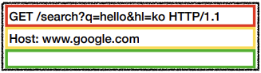

# HTTP 기본
- `H`yper`T`ext `T`ransfer `P`rotocol
## 목차
- 모든 것이 HTTP
- 클라이언트 서버 구조
- Stateful, Stateless
- 비 연결성(connectionless)
- HTTP 메시지
___
## 모든 것이 HTTP
### HTTP 메시지에 모든 것을 전송
- HTML, TEXT
- IMAGE, 음성, 영상, 파일
- JSON, XML (API)
- 거의 모든 형태의 데이터 전송 가능
- 서버간에 데이터를 주고 받을 때도 대부분 HTTP 사용
- <b>지금은 HTTP 시대!</b>
### HTTP 역사
- HTTP/0.9 (1991년): GET 메소드만 지원, HTTP 헤더 X
- HTTP/1.0 (1996년): 메소드, 헤더 추가
- <b>HTTP/1.1 (1997년): 가장 많이 사용, 우리에게 가장 중요한 버전</b>
    > 스펙 발전 과정: RFC2068 (1997) -> RFC2616 (1999) -> RFC7230~7235 (2014)
- HTTP/2 (2015년): 성능 개선
- HTTP/3 (진행중): TCP 대신 UDP 사용, 성능 개선
### 기반 프로토콜
- <b>TCP:</b> HTTP/1.1, HTTP/2
- <b>UDP:</b> HTTP/3
- 현재 HTTP/1.1 주로 사용
    > HTTP/2, HTTP/3 도 점점 사용빈도 증가
### HTTP 특징
- 클라이언트-서버 구조
- 무상태 프로토콜(stateless), 비연결성
- HTTP 메시지
- 단순함, 확장 가능
___
## 클라이언트 서버 구조
- Request-Response 구조
- 클라이언트는 서버에 요청을 보내고, 응답을 대기
- 서버가 요청에 대한 결과를 만들어, 클라이언트에 응답을 보냄
- 
___
## 무상태 프로토콜
### Stateless
- 서버가 클라이언트의 상태를 보존하지 않음
- 장점
    - 서버 확장성 높음
- 단점
    - 클라이언트가 추가 데이터 전송 필요
### Stateful, Stateless 차이
#### 상태 유지 - Stateful
> - 고객: 이 <b>노트북</b> 얼마인가요?
> - 점원: 100만원 입니다.

> - 고객: <b>2개</b> 구매하겠습니다.
> - 점원: 200만원 입니다. <b>신용카드, 현금</b>중에 어떤 걸로 결제하시겠어요?

> - 고객: 신용카드로 결제하겠습니다.
> - 점원: 200만원 결제 완료되었습니다.
#### 상태 유지 - Stateful, 점원이 중간에 바뀌면?
> - 고객: 이 <b>노트북</b> 얼마인가요?
> - 점원<b>A</b>: 100만원 입니다.

> - 고객: <b>2개</b> 구매하겠습니다.
> - 점원<b>B</b>: 무엇을 2개 구매하시겠어요?

> - 고객: 신용카드로 결제하겠습니다.
> - 점원<b>C</b>: 무슨 제품 몇 개를 신용카드로 구매하시겠어요?
#### 상태 유지 - Stateful, 정리
> - 고객: 이 <b>노트북</b> 얼마인가요?
> - 점원: 100만원 입니다.

> - 고객: <b>2개</b> 구매하겠습니다.
> - 점원: 200만원 입니다. <b>신용카드, 현금</b>중에 어떤 걸로 결제하시겠어요?
>   - <b>(노트북, 2개 상태 유지)</b>

> - 고객: 신용카드로 결제하겠습니다.
> - 점원: 200만원 결제 완료되었습니다.
>   - <b>(노트북, 2개, 신용카드 상태 유지)</b>
#### 무상태 - Stateless
> - 고객: 이 <b>노트북</b> 얼마인가요?
> - 점원: 100만원 입니다.

> - 고객: <b>노트북 2개</b> 구매하겠습니다.
> - 점원: 노트북 2개는 200만원 입니다. <b>신용카드, 현금</b>중에 어떤 걸로 결제하시겠어요?

> - 고객: <b>노트북 2개를 신용카드</b>로 구매하겠습니다.
> - 점원: 200만원 결제 완료되었습니다.
#### 무상태 - Stateless, 점원이 중간에 바뀌면?
> - 고객: 이 <b>노트북</b> 얼마인가요?
> - 점원<b>A</b>: 100만원 입니다.

> - 고객: <b>노트북 2개</b> 구매하겠습니다.
> - 점원<b>B</b>: 노트북 2개는 200만원 입니다. <b>신용카드, 현금</b>중에 어떤 걸로 결제하시겠어요?

> - 고객: <b>노트북 2개를 신용카드</b>로 구매하겠습니다.
> - 점원<b>C</b>: 200만원 결제 완료되었습니다.
#### 정리
- <b>상태 유지:</b> 중간에 다른 점원으로 바뀌면 안된다.
    - 중간에 다름 점원으로 바뀔 때, 상태 정보를 다른 점원에게 미리 알려줘야 한다.
- <b>무상태:</b> 중간에 다른 점원으로 바뀌어도 된다.
    - 갑자기 고객이 증가해도 점원을 대거 투입할 수 있다.
    - 갑자기 클라이언트 요청이 증가해도 서버를 대거 투입할 수 있다.
- 무상태는 응답 서버를 쉽게 바꿀 수 있다. -> <b>무한한 서버 증설 가능</b>
### 상태 유지 - Stateful
- 
- 
### 무상태 - Stateless
- 
- 
- 
#### 실무 한계
- 모든 것을 무상태로 설계할 수 있는 것은 아니다.
- 무상태
    > ex) 로그인이 필요 없는 단순한 서비스 소개 화면
- 상태 유지
    > ex) 로그인
- 로그인한 사용자의 경우, 로그인 상태를 서버에 유지
- 일반적으로 브라우저 쿠키와, 서버 세션등을 사용해서 상태 유지
- 상태 유지는 최소한만 사용
___
## 비 연결성(connectionless)
### 연결을 유지하는 모델
- 클라이언트들이 서버와 TCP/IP 연결을 하고, 요청과 응답을 서로 주고받은 후에도 각각의 연결 상태가 계속 유지되는 형태.
- 서버는 계속 연결을 유지하므로, 서버 자원 소모
### 연결을 유지하지 않는 모델
- 클라이언트가 서버와 TCP/IP 연결을 하고, 요청과 응답을 서로 주고받은 다음, 연결을 해제하는 형태.
- 서버는 연결 유지 X, 최소한의 자원 유지
### 비 연결성
- HTTP는 기본적으로 연결을 유지하지 않는 모델.
- 일반적으로 초 단위 이하의 빠른 속도로 응답.
- 1시간 동안 수 천명이 서비스를 사용해도, 실제 서버에서 동시에 처리하는 요청은 수 십개 이하로 매우 작음.
    > ex) 웹 브라우저에서 무의미하게 같은 검색 버튼을 여러 번 누르지는 않음
- 서버 자원을 매우 효율적으로 사용할 수 있음
### 한계와 극복
- TCP/IP 연결을 새로 맺어야 함 - 3 way handshake 시간 추가 소요
- 웹 브라우저로 사이트를 요청하면 HTML 뿐만 아니라, 자바스크립트, css, 추가 이미지 등 수 많은 자원이 함께 다운로드
- 지금은 <b>HTTP 지속 연결(Persistent Connections)</b>로 문제 해결
- HTTP/2, HTTP/3에서 더 많은 최적화
#### HTTP 초기 - 연결, 종료 낭비

#### HTTP 지속 연결(Persistent Connections)

### 서버 개발자들이 어려워하는 업무
- 정말 같은 시간에 딱 맞추어 발생하는 대용량 트래픽
    > - ex) 선착순 이벤트, 명절 KTX 예약, 학과 수업 등록
    > - ex) 저녁 6:00 선착순 1,000명 치킨 할인 이벤트 -> 수 만명 동시 요청
- Stateless를 기억하자!
___
## HTTP 메시지
### HTTP 메시지 구조

> ex) HTTP 요청 메시지<br>
> 

> ex) HTTP 응답 메시지<br>
> <br>
> [공식 스펙](https://tools.ietf.org/html/rfc7230#section-3)
> ```
>  HTTP-message = start-line
>                 *( header-field CRLF )
>                 CRLF
>                 [ message-body ]
>  ```
### 시작 라인
#### 요청 메시지
```
GET /search?q=hello&hl=ko HTTP/1.1
```
- start-line = <b>request-line</b> / status-line
- <b>request-line</b> = method SP(공백) request-target SP(공백) HTTP-version CRLF(엔터)<br><br>
- HTTP 메소드 (GET: 조회)
- 요청 대상 (/search?q=hello&hl=ko)
- HTTP Version
##### HTTP 메소드
```
GET
```
- 종류 : GET, POST, PUT, DELETE, ...
- 서버가 수행해야 할 동작 지정
    - GET: 리소스 조회
    - POST: 요청 내역 처리
##### 요청 대상
```
/search?q=hello&hl=ko
```
- absolute-path[?query] (절대경로[?쿼리])
- 절대경로= "/" 으로 시작하는 경로
    > 참고: *, http://...?x=y와 같이 다른 유형의 경로 지정 방법도 있다.
##### HTTP 버전
```
HTTP/1.1
```
- HTTP Version
#### 응답 메시지
```
HTTP/1.1 200 OK
```
- start-line= request-line / <b>status-line</b>
- <b>status-line</b> = HTTP-version SP status-code SP reason-phrase CRLF<br><br>

- HTTP 버전
- HTTP 상태 코드: 요청 성공, 실패를 나타냄
    - 200: 성공
    - 400: 클라이언트 요청 오류
    - 500: 서버 내부 오류
- 이유 문구: 사람이 이해할 수 있는 짧은 상태 코드 설명 글
### HTTP 헤더
- header-field = field-name ":" OWS field-value OWS
    > (OWS: 띄어쓰기 허용)
- field-name은 대소문자 구분 없음
- 요청 메시지
    ```
    Host: www.google.com
    ```
- 응답 메시지
    ```
    Content-Type: text/html;charset=UTF-8
    Content-Length: 3423
    ```
#### 용도
- HTTP 전송에 필요한 모든 부가정보
    > ex) 메시지 바디의 내용, 메시지 바디의 크기, 압축, 인증, 요청 클라이언트(브라우저) 정보, 서버 애플리케이션 정보, 캐시 관리 정보, ...
- 표준 헤더가 너무많음
- 필요 시 임의의 헤더 추가 가능
### HTTP 메시지 바디
- 응답 메시지
    ```
    <html>
        <body>...</body>
    </html>
    ```
#### 용도
- 실제 전송할 데이터
- HTML 문서, 이미지, 영상, JSON 등의 byte로 표현 가능한 모든 데이터 전송 가능