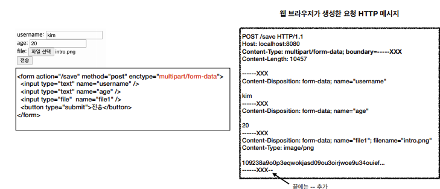

# HTTP 메소드 활용
## 목차
- 클라이언트에서 서버로 데이터 전송
- HTTP API 설계 예시
___
## 클라이언트에서 서버로 데이터 전송
### 데이터 전달 방식은 크게 2가지
1. <b>쿼리 파라미터를 통한 데이터 전송</b>
    - GET
    - 주로 정렬 필터(검색어)
2. <b>메시지 바디를 통한 데이터 전송</b>
    - POST, PUT, PATCH
    - 회원 가입, 상품 주문, 리소스 등록, 리소스 변경
### 4가지 상황
- <b>정적 데이터 조회</b>
    - 이미지, 정적 테스트 문서
- <b>동적 데이터 조회</b>
    - 주로 검색, 게시판 목록에서 정렬 필터(검색어)
- <b>HTML Form을 통한 데이터 전송</b>
    - 회원 가입, 상품 주문, 데이터 번경
- <b>HTTP API를 통한 데이터 전송</b>
     - 회원 가입, 상품 주문, 데이터 변경
     - 서버 to 서버, 앱 클라이언트, 웹 클라이언트(Ajax)
#### 정적 데이터 조회
- 쿼리 파라미터 미사용
- 
- 정리
    - 이미지, 정적 텍스트 문서
    - 조회는 GET 사용
    - 정적 데이터는 일반적으로 쿼리 파라미터 없이 리소스 경로로 단순하게 조회 가능
#### 동적 데이터 조회
- 쿼리 파라미터 사용
- 
- 정리
    - 주로 검색, 게시판 목록에서 정렬 필터(검색어)
    - 조회 조건을 줄여주는 필터, 조회 결과를 정렬하는 정렬 조건에 주로 사용
    - 조회는 GET 사용
    - GET은 쿼리 파라미터를 사용해서 데이터 전달
#### HTML Form 데이터 전송
##### POST 전송 - 저장

##### GET 전송 - 저장

- get은 메시지 바디를 사용하지 않으므로, 쿼리 파라미터에 넣어 서버에 전달
- 데이터 저장에는 GET 메소드를 사용하지 말자.
##### GET 전송 - 조회

##### multipart/form-data

- file을 전송할 때 사용
##### 정리
- HTML Form submit시, POST 전송
    > ex) 회원 가입, 상품 주문, 데이터 변경
- Content-Type: application/x-www-form-urlencoded 사용
    - form의 내용을 메시지 바디를 통해 전송(key=value, 쿼리 파라미터 형식)
    - 전송 데이터를 url encoding 처리
        > ex) abc김 -> abc%EA%B9%80
- HTML Form은 GET 전송도 가능
- Content-Type: multipart/form-data
    - 파일 업로드 같은 바이너리 데이터 전송 시 사용
    - 다른 종류의 여러 파일과 폼의 내용 함께 전송 가능(그래서 이름이 multipart)
> 참고: HTML Form 전송은 <b>GET, POST만 지원</b>
#### HTTP API 데이터 전송

- 정리
    - 서버 to 서버
        - 백엔드 시스템 통신
    - 앱 클라이언트
        - 아이폰, 안드로이드
    - 웹 클라이언트
        - HTML에서 Form 전송 대신 자바 스크립트를 통한 통신에 사용(AJAX)
            > ex) React, Vue.Js 같은 웹 클라이언트와 API 통신
    - POST, PUT, PATCH: 메시지 바디를 통해 데이터 전송
    - GET: 조회, 쿼리 파리미터로 데이터 전달
    - Content-Type: application/json을 주로 사용 (사실상 표준)
        - TEXT, XML, JSON 등
___
## HTTP API 설계 예시
- <b>HTTP API - 컬렉션</b>
    - <b>POST 기반 등록</b>
         > ex) 회원 관리 API 제공
- <b>HTTP API - 스토어</b>
    - <b>PUT 기반 등록</b>
        > ex) 정적 컨텐츠 관리, 원격 파일 관리
- <b>HTML FORM 사용</b>
    - 웹 페이지 회원 관리
    - GET, POST 만 지원
### 회원 관리 시스템
#### API 설계 - POST 기반 등록
- <b>회원 목록</b> /members <b>-> GET</b>
- <b>회원 등록</b> /members <b>-> POST</b>
- <b>회원 조회</b> /members/{id} <b>-> GET</b>
- <b>회원 수정</b> /members/{id} <b>-> PATCH, PUT, POST</b>
- <b>회원 삭제</b> /members/{id} <b>-> DELETE</b>
##### POST - 신규 자원 등록 특징
- 클라이언트는 등록될 리소스의 URI를 모른다.
    - 회원 등록 /members -> POST
    - POST /members
- 서버가 새로 등록된 리소스 URI를 생성해준다.
    ```
    HTTP/1.1 201 Created
    Location: /members/100
    ```
- 컬렉션(Collection)
    - 서버가 관리하는 리소스 디렉토리
    - 서버가 리소스의 URI를 생성하고 관리
    - 여기서 컬렉션은 /members
### 파일 관리 시스템
#### API 설계 - PUT 기반 등록
- <b>파일</b> 목록 /files <b>-> GET</b>
- <b>파일</b> 조회 /files/{filename} <b>-> GET</b>
- <b>파일</b> 등록 /files/{filename} <b>-> PUT</b>
- <b>파일</b> 삭제 /files/{filename} <b>-> DELETE</b>
- <b>파일</b> 대량 등록 /files <b>-> POST</b>
##### PUT - 신규 자원 등록 특징
- 클라이언트가 리소스 URI를 알고 있어야 한다.
    - 파일 등록 /files/{filename} -> PUT
    - PUT <b>/files/star.jpg</b>
- 클라이언트가 직접 리소스의 URI를 지정한다.
- 스토어(Store)
    - 클라이언트가 관리하는 리소스 저장소
    - 클라이언트가 리소스의 URI를 알고 관리
    - 여기서 스토어는 /files
### HTML FORM 사용
- HTML FORM은 <b>GET, POST만 지원</b>
- <b>컨트롤 URI</b>
    - GET, POST만 지원하므로 제약이 있음
    - 이런 제약을 해결하기 위해 동사로 된 리소스 경로 사용
    - 아래 예시 POST의 /new, /edit, /delete가 컨트롤 URI
    - HTTP 메소드로 해결하기 애매한 경우 사용(HTTP API 포함)
- AJAX 같은 기술을 사용하여 해결 가능 -> 회원 API 참고
- 여기서는 순수 HTML, HTML FORM 이야기
- GET, POST만 지원하므로 제약이 있음<br><br>
- <b>회원</b> 목록 /members <b>-> GET</b>
- <b>회원</b> 등록 폼 /members/new <b>-> GET</b>
- <b>회원</b> 등록 /members/new, /members <b>-> POST</b>
- <b>회원</b> 조회 /members/{id} <b>-> GET</b>
- <b>회원</b> 수정 폼 /members/{id}/edit <b>-> GET</b>
- <b>회원</b> 수정 /members/{id}/edit, /members/{id} <b>-> POST</b>
- <b>회원</b> 삭제 /members/{id}/delete <b>-> POST</b><br><br>
### 정리
- <b>HTTP API - 컬렉션</b>
    - <b>POST 기반 등록</b>
    - <b>서버가 리소스 URI 결정</b>
- <b>HTTP API - 스토어</b>
    - <b>PUT 기반 등록</b>
    - <b>클라이언트가 리소스 URI 결정</b>
- <b>HTTP FORM 사용</b>
    - 순수 HTML + HTML form 사용
    - GET, POST만 지원
### 참고하면 좋은 URI 설계 개념
- <b>문서(document)</b>
    - 단일 개념(파일 하나, 객체 인스턴스, 데이터베이스 row)
        > ex) /members/100, /files/star.jpg
- <b>컬렉션(collection)</b>
    - 서버가 관리하는 리소스 디렉토리
    - 서버가 리소스의 URI를 생성하고 관리
        > ex) /members
- <b>스토어(store)</b>
    - 클라이언트가 관리하는 리소스 저장소
    - 클라이언트가 리소스의 URI를 알고, 관리
        > ex) /files
- <b>컨트롤러(controller), 컨트롤 URI</b>
    - 문서, 컬렉션, 스토어로 해결하기 어려운 추가 프로세스 실행
    - 동사를 직접 사용
        > ex) /members/{id}/delete
- Reference : https://restfulapi.net/resource-naming