# HTTP 메소드
## 목차
- HTTP API를 만들어보자
- HTTP 메소드 - GET, POST
- HTTP 메소드 - PUT, PATCH, DELETE
- HTTP 메소드의 속성
___
## HTTP API를 만들어보자
### 요구사항 
- 회원 정보 관리 API를 만들어라.
    - 회원 목록 조회
    - 회원 조회
    - 회원 등록
    - 회원 수정
    - 회원 삭제
### API URI 설계
- URI(Uniform Resource Identifier)
    - 회원 목록 조회 /read-member-list
    - 회원 조회 /read-member-by-id
    - 회원 등록 /create-member
    - 회원 수정 /update-member
    - 회원 삭제 /delete-member
- 이것은 좋은 URI 설계일까?
- 가장 중요한 것은 <b>리소스 식별!</b>
#### API URI 고민
- 리소스의 의미는 뭘까?
    - 회원을 등록하고, 수정하고, 조회하는 것이 리소스가 아니다!
        > ex) 미네랄을 캐라 -> 리소스 : 미네랄
    - <b>회원이라는 개념 자체가 바로 리소스다.</b>
- 리소스를 어떻게 식별하는 것이 좋을까?
    - 회원을 등록하고, 수정하고, 조회하는 것을 모두 배제
    - <b>회원이라는 리소스만 식별하면 된다. -> 회원 리소스를 URI에 매핑</b>
#### 리소스 식별, URI 계층 구조 활용
- <b>회원</b> 목록 조회 /members
- <b>회원</b> 조회 /members/{id} <b>-> 어떻게 구분?</b>
- <b>회원</b> 등록 /members/{id} <b>-> 어떻게 구분?</b>
- <b>회원</b> 수정 /members/{id} <b>-> 어떻게 구분?</b>
- <b>회원</b> 삭제 /members/{id} <b>-> 어떻게 구분?</b>
> 참고: 계층 구조상 상위 컬렉션으로 보고 복수단어 사용 권장(member -> members)
#### 리소스와 행위를 분리
- <b>가장 중요한 것은 리소스를 식별하는 것</b>
- <b>URI는 리소스만 식별!</b>
- <b>리소스</b>와 해당 리소스를 대상으로 하는 <b>행위</b>를 분리
    - 리소스: 회원
    - 행위: 조회, 등록, 삭제, 변경
- 리소스는 명사, 행위는 동사
- 행위(메소드)는 어떻게 구분?
___
## HTTP 메소드 - GET, POST
### HTTP 메소드 종류
- 주요 메소드
    - GET: 리소스 조회
    - POST: 요청 데이터 처리, 주로 등록에 사용
    - PUT: 리소스를 대체, 해당 리소스가 없으면 생성
    - PATCH: 리소스 부분 변경
    - DELETE: 리소스 삭제
- 기타 메소드
    - HEAD: GET과 동일하지만, 메시지 부분을 제외하고, 상태 줄과 헤더만 반환
    - OPTIONS: 대상 리소스에 대한 통신 가능 옵션(메소드)을 설명(주로 CORS에서 사용)
    - CONNECT: 대상 자원으로 식별되는 서버에 대한 터널을 설정
    - TRACE: 대상 리소스에 대한 경로를 따라 메시지 루프백 테스트를 수행
### GET
- 리소스 조회
- 서버에 전달하고 싶은 데이터는 query(쿼리 파라미터, 쿼리 스트링)를 통해 전달
- 메시지 바디를 사용해서 데이터를 전달할 수도 있지만, 지원하지 않는 곳이 많아 권장하지 않음
#### 리소스 조회 - 메시지 전달
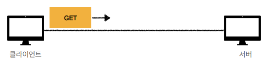
```
GET /members/100 HTTP/1.1
Host: localhost:8080
```
#### 리소스 조회 - 서버 도착
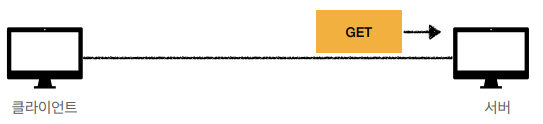
- /members/100
```
{
    "username": "young",
    "age": 20
}
```
#### 리소스 조회 - 응답 데이터
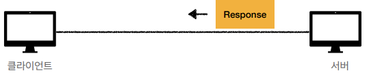
```
HTTP/1.1 200 OK
Content-Type: application/json
Content-Length: 34

{
    "username": "young",
    "age": 20    
}
```
### POST
- 요청 데이터 처리
- <b>메시지 바디를 통해 서버로 요청 데이터 전달</b>
- 서버는 요청 데이터를 <b>처리</b>
    - 메시지 바디를 통해 들어온 데이터를 처리하는 모든 기능을 수행한다.
- 주로 전달된 데이터로 신규 리소스 등록, 프로세스 처리에 사용
#### 리소스 등록 - 메시지 전달
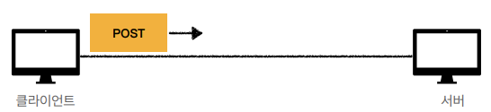
```
POST /members HTTP/1.1
Content-Type: application/json

{
    "username": "young",
    "age": 20      
}
```
#### 리소스 등록 - 신규 리소스 생성
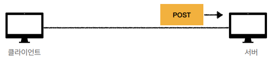
- /members -> /members/100 (신규 리소스 식별자 생성)
```
{
    "username": "young",
    "age": 20      
}
```
#### 리소스 등록 - 응답 데이터
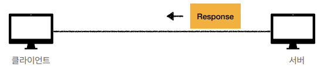
```
HTTP/1.1 201 Created
Content-Type:application/json
Content-Length: 34
Location: /members/100

{
    "username": "young",
    "age": 20      
}
```
#### 요청 데이터를 어떻게 처리한다는 뜻일까?
- 스펙: POST 메소드는 <b>대상 리소스가 리소스의 고유한 의미 체계에 따라 요청에 포함된 표현을 처리하도록 요청</b>한다.
- 예를들어 POST는 다음과 같은 기능에 사용된다.
    - HTML 양식에 입력된 필드와 같은 데이터 블록을 데이터 처리 프로세스에 제공
        > ex) HTML FORM에 입력한 정보로 회원 가입, 주문 등에서 사용
    - 게시판, 뉴스 그룹, 메일링 리스트, 블로그 또는 유사한 기사 그룹에 메시지 게시
        > ex) 게시판 글쓰기, 댓글 달기
    - 서버가 아직 식별하지 않은 새 리소스 생성
        > ex) 신규 주문 생성
    - 기존 자원에 데이터 추가
        > ex) 한 문서 끝에 내용 추가하기
- <b>정리: 이 리소스 URI에 POST 요청이 오면, 요청 데이터를 어떻게 처리할지 리소스마다 따로 정해야 함 -> 정해진 것이 없음</b>
#### 정리
1. <b>새 리소스 생성(등록)</b>
    - 서버가 아직 식별하지 않은 새 리소스 생성
2. <b>요청 데이터 처리</b>
    - 단순히 데이터를 생성하거나, 변경하는 것을 넘어 프로세스를 처리해야 하는 경우
        > ex) 주문에서 "결제완료 -> 배달시작 -> 배달완료" 처럼 단순히 값 변경을 넘어 프로세스의 상태가 변경되는 경우
    - POST의 결과로 새로운 리소스가 생성되지 않을 수도 있음
        > ex) POST /orders/{orderId}/start-delivery <b>(컨트롤 URI)</b>
        - 실무에서 반드시 모든 것을 리소스로 URI를 설계할 수는 없다.
        - 이 경우, 컨트롤 URI 방식으로 설계한다.
3. <b>다른 메소드로 처리하기 애매한 경우</b>
    > ex) JSON으로 조회 데이터를 넘겨야 하는 데, GET 메소드를 사용하기 어려운 경우
    - 애매하면 POST 메소드를 적극 사용하자.
___
## HTTP 메소드 - PUT, PATCH, DELETE
### PUT
- <b>리소스를 완전 대체</b>
    - 리소스가 있으면 대체, 없으면 생성
- <b>클라이언트가 리소스를 식별!</b>
    - 클라이언트가 리소스 위치를 알고 URI 지정
        ```
        PUT /members/100 HTTP/1.1
        ...
        ```
#### 리소스를 완전히 대체한다!
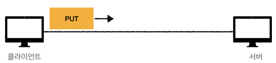
- username 필드 없음
```
PUT /members/100 HTTP/1.1
Content-Type: application/json

{
    "age": 50      
}
```
- /members/100
```
{
    "username": "young",
    "age": 20      
}
```
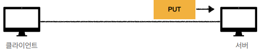
- 리소스 완전 대체(/members/100)
    - username 필드 삭제됨
```
{
    "age": 50      
}
```
- <b>즉, 리소스를 수정할 때 사용하는 것은 적절하지 않다!</b>
### PATCH
- <b>리소스 부분 변경</b>
- 만약 PATCH를 지원하지 않는 서버라면, POST를 사용하자.
#### 리소스 부분 변경
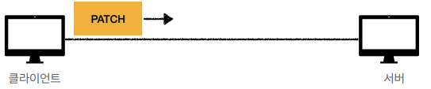
- username 필드 없음
```
PATCH /members/100 HTTP/1.1
Content-Type: application/json

{
    "age": 50      
}
```
- /members/100
```
{
    "username": "young",
    "age": 20      
}
```
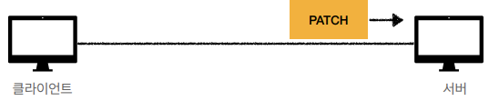
- 리소스 부분 변경(/members/100)
    - age만 50으로 변경
```
{
    "username": "young",
    "age": 50      
}
```
### DELETE
- 리소스 제거
#### 리소스 제거
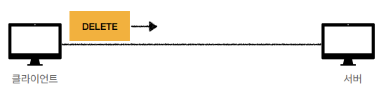
```
DELETE /members/100 HTTP/1.1
Host: localhost:8080
```
- /members/100
```
{
    "username": "young",
    "age": 20
}
```

- 리소스(/members/100) 제거 완료
___
## HTTP 메소드의 속성
- 안전(Safe Methods)
- 멱등(Idempotent Methods)
- 캐시가능(Cacheable Methods)
> 참고<br>
> 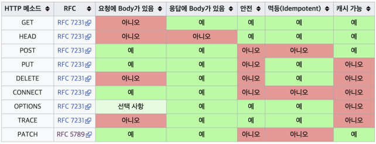
> - Get 요청에 body는 존재하지만, 좋은 방법이 아니다. 
### 안전(Safe)
- 호출해도 리소스를 변경하지 않는다.
    > Q: 그래도 계속 호출해서, 로그 같은게 쌓여 장애가 발생하면?

    > A: 그런 부분까지 고려하지 않는다. 안전은 해당 리소스만 고려한다.
### 멱등(Idempotent)
- f(f(x)) = f(x)
- 한 번 호출하든, 두 번 호출하든, 100번 호출하든 결과가 항상 똑같다.
- 멱등 메소드
    - <b>GET</b>: 몇 번을 조회하든 항상 같은 결과만 조회된다.
    - <b>PUT</b>: 같은 요청을 여러 번 해도 대체된 최종 결과는 같다.
    - <b>DELETE</b>: 같은 요청을 여러 번 해도 삭제된 결과는 같다.
    - `POST`: 멱등이 아니다! 두 번 호출하면, 같은 결제가 중복 발생할 수 있다.
        > ex) 중복 결제를 방지하기 위해, 결제 전 중복을 처리할 수 있는 키 값을 제공, POST를 사용하여 결제요청
    - PATCH는 멱등으로 설계할 수도 있고, 멱등이 아니게 설계할 수도 있다.
        > ex) 멱등 : { "name": "kim" }

        > ex) 멱등 x : { "operation": "add", "age": "10" }
- 활용
    - 자동 복구 메커니즘
    - 서버가 TIMEOUT 등으로 정상 응답을 못 주었을 때, 클라이언트가 같은 요청을 다시 해도 되는가? 판단 근거
> <b>Q: 재요청 중간에 다른 곳에서 리소스를 변경해버리면?</b>
>   - 사용자1: GET -> username:A, age:20
>   - 사용자2: PUT -> username:A, age:30
>   - 사용자3: GET -> username:A, age:30 -> 사용자2의 영향으로 바뀐 데이터 조회

> <b>A: 멱등은 외부 요인으로 중간에 리소스가 변경되는 것까지는 고려하지 않는다.</b>
### 캐시가능(Cacheable)
- 응답 결과 리소스를 캐시해서 사용해도 되는가?
- GET, HEAD, POST, PATCH 캐시 가능
- 실제로는 GET, HEAD 정도만 캐시로 사용
    - URL을 키로 설정하여 캐시하는 방식
- POST, PATCH는 본문 내용까지 캐시 키로 고려해야 하는데, 구현이 쉽지 않음
