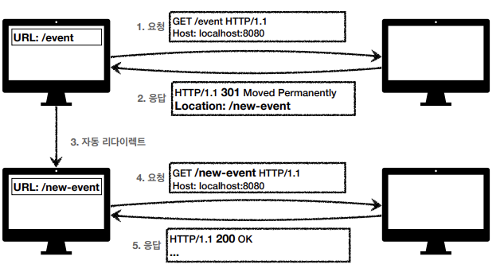

# HTTP 상태코드
- <b>클라이언트가 보낸 요청의 처리 상태를 응답에서 알려주는 기능</b>
- Reference : https://developer.mozilla.org/ko/docs/Web/HTTP/Status/200
- 종류
    - 1xx (informational): 요청이 수신되어 처리중
    - 2xx (Successful): 요청 정상 처리
    - 3xx (Redirection): 요청을 완료하려면 추가 행동이 필요
    - 4xx (Client Error): 클라이언트 오류, 잘못된 문법 등으로 서버가 요청을 수행할 수 없음
    - 5xx (Server Error): 서버 오류, 서버가 정상 요청을 처리하지 못함
- 만약 모르는 상태 코드가 나타나면?
    - 클라이언트가 인식할 수 없는 상태코드를 서버가 반환하면?
    - 클라이언트는 상위 상태코드로 해석하여 처리
    - 미래에 새로운 상태 코드가 추가되어도 클라이언트를 변경하지 않아도 됨
    > ex)
    > - 299 ??? -> 2xx (Successful)
    > - 451 ??? -> 4xx (Client Error)
    > - 599 ??? -> 5xx (Server Error)
___
## 2xx (Successful)
- <b>클라이언트 요청을 성공적으로 처리</b><br><br>
- 200 OK
- 201 Created
- 202 Accepted
- 204 No Content<br><br>
- 주로 200, 201만 사용한다
### 200 OK
- <b>요청 성공</b><br>

### 201 Created
- <b>요청 성공해서 새로운 리소스가 생성됨</b><br>

### 202 Accepted
- <b>요청이 접수 되었으나, 처리가 완료되지 않았음</b><br><br>
- 배치 처리 같은 곳에서 사용
    > ex) 요청 접수 후 1시간 뒤, 배치 프로세스가 요청을 처리함
- 잘 사용하지는 않음
### 204 No Content
- <b>서버가 요청을 성공적으로 수행했지만, 응답 페이로드 본문에 보낼 데이터가 없음</b><br><br>
- save 버튼의 결과로 아무 내용이 없어도 된다.
- save 버튼을 눌러도 같은 화면을 유지해야 한다.
- 결과 내용이 없어도 204 메시지(2xx)만으로 성공을 인식할 수 있다.
> ex) 웹 문서 편집기에서 save 버튼
___
## 3xx (Redirection)
- <b>요청을 완료하기 위해 유저 에이전트의 추가 조치 필요</b><br><br>
- 300 Multiple Choices
- 301 Moved Permanently
- 302 Found
- 303 See Other
- 304 Not Modified
- 307 Temporary Redirect
- 308 Permanent Redirect
### 리다이렉션 이해
- 웹 브라우저는 3xx 응답의 결과에 Location 헤더가 있으면, Location 위치로 자동 이동(리다이렉트)
- <b>자동 리다이렉트 흐름</b><br>
<br>
- /event를 이제 쓰지 않게 되고, /new-event로 변경된 경우, 리다이렉트를 이용하여 기존 사용자들이 /event으로 접속해도 /new-event으로 이동하도록 설계.<br><br>
- <b>종류</b>
    - <b>영구 리다이렉션</b> - 특정 리소스의 URI가 영구적으로 이동
        > ex)
        > - /members -> /users
        > - /event -> /new-event
    - <b>일시 리다이렉션</b> - 일시적인 변경
        - 주문 완료 후 주문 내역 화면으로 이동
        - PRG: Post/Redirect/Get
    - <b>특수 리다이렉션</b>
        - 결과 대신 캐시를 사용
### 영구 리다이렉션
- <b>301, 308</b><br><br>
- 리소스의 URI가 영구적으로 이동
- 원래의 URL을 사용X, 검색 엔진 등에서도 변경 인지
- <b>301 Moved Permanently</b>
    - <b>리다이렉트 요청 메소드가 GET으로 변하고, 본문이 제거될 수 있음(May)</b>
    - 
- <b>308 Permanent Redirect</b>
    - 301과 기능은 같음
    - <b>리다이렉트 요청 메소드와 본문 유지(처음 POST를 보내면 리다이렉트도 POST 유지)</b>
    - 
### 일시적인 리다이렉션
- <b>302, 307, 303</b><br><br>
- 리소스의 URI가 일시적으로 변경
- 따라서 검색 엔진 등에서 URL을 변경하면 안됨
- <b>302 Found</b>
    - <b>리다이렉트 요청 메소드가 GET으로 변하고, 본문이 제거될 수 있음(may)</b>
- <b>307 Temporary Redirect</b>
    - 302와 기능은 같음
    - <b>리다이렉트 요청 메소드와 본문 유지(요청 메소드를 변경하면 안된다. Must not)</b>
- <b>303 See Other</b>
    - 302와 기능은 같음
    - <b>리다이렉트 요청 메소드가 GET으로 변경</b>
### PRG: Post/Redirect/Get
- <b>일시적인 리다이렉션 - 예시</b><br><Br>
- POST로 주문 후에, 웹 브라우저를 새로고침하면?
    - 새로고침은 다시 요청
    - 중복 주문이 될 수 있다.
- PRG 사용 전<br>
<br><br>
- PRG 사용 목적
    - POST로 주문 후에 새로고침으로 인한 중복 주문 방지
    - POST로 주문 후에 주문 결과 화면을 GET 메소드로 리다이렉트
    - 새로고침해도 결과 화면을 GET으로 조회
    - 중복 주문 대신에 결과 화면만 GET으로 다시 요청<br>
<br>
- PRG 이후 리다이렉트
    - URL이 이미 POST -> GET으로 리다이렉트 됨
    - 새로고침해도 GET으로 결과 화면만 조회
#### 그래서 뭘 써야 할까?
- <b>302, 307, 303</b><br><br>
- <b>정리</b>
    - 302 Found -> GET으로 변할 수 있음
    - 307 Temporary Redirect -> 메소드가 변하면 안됨
    - 303 See Other -> 메소드가 GET으로 변경
- <b>역사</b>
    - 처음 302 스펙의 의도는 HTTP 메소드를 유지하는 것
    - 그런데, 웹브라우저들이 대부분 GET으로 바꾸어버림(일부는 다르게 동작)
    - 그래서 모호한 302를 대신하는 명확한 307, 303이 등장함(301 대응으로 308도 등장)
- <b>현실</b>
    - 307, 303을 권장하지만, 현실적으로 이미 많은 애플리케이션 라이브러리들이 302를 기본값으로 사용
    - 자동 리다이렉션 시에, GET으로 변해도 되면, 그냥 302를 사용해도 큰 문제 없음
### 기타 리다이렉션
- <b>300, 304</b><br><br>
- 300 Multiple Choices: 안쓴다.
- 304 Not Modified
    - 캐시를 목적으로 사용
    - 클라이언트에게 리소스가 수정되지 않았음을 알려준다.
        - 따라서 클라이언트는 로컬PC에 저장된 캐시를 재사용한다. (캐시로 리다이렉트 한다.)
    - 304 응답은 응답에 메시지 바디를 포함하면 안된다. (로컬 캐시를 사용해야 하므로)
    - 조건부 GET, HEAD 요청시 사용
___
## 4xx (Client Error)
- <b>클라이언트 오류</b><br><br>
- 클라이언트의 요청에 잘못된 문법 등으로 서버가 요청을 수행할 수 없음
- <b>오류의 원인이 클라이언트에 있음</b>
- `클라이언트가 이미 잘못된 요청, 데이터를 보내고 있기 때문에, 똑같은 재시도가 실패함`
### 400 Bad Request
- <b>클라이언트가 잘못된 요청을 해서 서버가 요청을 처리할 수 없음</b><br><br>
- 요청 구문, 메시지 등 오류
- 클라이언트는 요청 내용을 다시 검토해서 보내야 함.
> ex) 요청 파라미터가 잘못되거나, API 스펙이 맞지 않을 때 등
### 401 Unauthorized
- <b>클라이언트가 해당 리소스에 대한 인증이 필요함</b><br><br>
- 인증(Authentication) 되지 않음
- 401 오류 발생 시 응답에 WWW-Authenticate 헤더와 함께 인증 방법을 설명
- 참고
    - 인증(Authentication): 본인이 누구인지 확인, (로그인)
    - 인가(Authorization): 권한 부여 (ADMIN 권한처럼 특정 리소스에 접근할 수 있는 권한, 인증이 있어야 인가가 있음)
    - 오류 메시지가 Unauthorized(인가되지 않음) 이지만, Unauthenticated(인증되지 않음)으로 이해하자
### 403 Forbidden
- <b>서버가 요청을 이해했지만, 승인을 거부함</b><br><br>
- 주로 인증 자격 증명은 있지만, 접근 권한이 불충분한 경우
> ex) 어드민 등급이 아닌 사용자가 로그인은 했지만, 어드민 등급의 리소스에 접근하는 경우
### 404 Not Found
- <b>요청 리소스를 찾을 수 없음</b><br><br>
- 요청 리소스가 서버에 없음
- 또는 클라이언트가 권한이 부족한 리소스에 접근할 때, 해당 리소스를 숨기고 싶을 때
___
## 5xx (Server Error)
- <b>서버 오류</b><br><br>
- 서버 문제로 오류 발생
- 서버에 문제가 있기 때문에, 재시도하면 성공할 수도 있음(복구가 되는 등의 경우로)
### 500 Internal Server Error
- <b>서버 문제로 오류발생</b><br><br>
- 서버 내부 문제로 오류 발생
- 애매하면 500 오류
### 503 Service Unavailable
- <b>서비스 이용 불가</b><br><br>
- 서버가 일시적인 과부하 또는 예정된 작업으로 잠시 요청을 처리할 수 없음
- Retry-After 헤더 필드로 얼마 뒤에 복구되는지 보낼 수도 있음
___
## 참고
- 서로 약속한 HTTP API 스펙을 만족한다 -> 200, 만족하지 않는다 -> 400
- 비즈니스 로직이 정상 수행되지만, 다양한 결과가 존재한다.(승인, 거절 등) -> 200 + 비즈니스 코드 반환(봉투 패턴)
    > ex)
    > - 20살 이상만 가입 가능한 사이트에 15살이 회원 가입 요청을 한 경우, 어떤 상태 코드를 응답해줘야 할까? 200? 400?
    > - HTTP API 스펙 자체는 만족하므로 200을 응답해주되, 봉투 패턴으로 추가적인 상태 정보를 담아 응답하자!
    > - 예를들어, 15살은 가입 불가능으로 fail, 몇 일 뒤 20살이 되는 19살은 보류로 hold, ...
    > ```http
    > {
    >
    > "code": "success" ("success", "fail", "hold", "deny" ...)
    >
    > "data": {memberId: ... 결과 데이터}...
    > }
    > ```
- 비즈니스 로직을 수행하다 내부에서 시스템 예외 혹은 NPE 등의 비즈니스와 관계없는 시스템 예외가 발생 -> 500
- 다양한 비즈니스 응답이 있는 복잡한 비즈니스 로직이 있는 HTTP API는 봉투 패턴을 고려하고, 비즈니스 로직이 거의 없는 단순한 조회에서는 봉투 패턴을 고려하지 않는다.
- Reference
    - 관련 질문: https://www.inflearn.com/course/http-%EC%9B%B9-%EB%84%A4%ED%8A%B8%EC%9B%8C%ED%81%AC/lecture/61373?tab=community&q=111465
    - 봉투 패턴: https://programmer93.tistory.com/62
