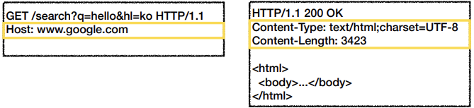

# HTTP 헤더1 - 일반 헤더
## 목차
- HTTP 헤더 개요
- 표현
- 콘텐츠 협상
- 전송 방식
- 일반 정보
- 특별한 정보
- 인증
- 쿠키
___
## HTTP 헤더 개요

- `header-field = field-name ":" OWS field-value OWS` (OWS: 띄어쓰기 허용)
    - field-name은 대소문자 구분 x
### HTTP 헤더 용도
- HTTP 전송에 필요한 모든 부가정보
    > ex) 메시지 바디의 내용, 메시지 바디의 크기, 압축, 인증, 요청 클라이언트, 서버 정보, 캐시 관리 정보, ...
- 표준 헤더가 너무 많음
    > https://en.wikipedia.org/wiki/List_of_HTTP_header_fields
- 필요 시 임의의 헤더 추가 가능
    > helloworld: hihi
### HTTP 헤더 분류 - RFC2616(과거)

- 헤더 분류
    - <b>General 헤더:</b> 메시지 전체에 적용되는 정보
        > ex) Connection: close
    - <b>Request 헤더:</b> 요청 정보
        > ex) User-Agent: Mozilla/5.0 (Macintosh; ..)
    - <b>Response 헤더:</b> 응답 정보
        > ex) Server: Apache
    - <b>Entity 헤더:</b> 엔티티 바디 정보
        > ex) Content-Type: text/html, Content-Length: 3423
### HTTP BODY message body - RFC2616(과거)

- 메시지 본문(message body)은 엔티티 본문(entity body)을 전달하는 데 사용
- 엔티티 본문은 요청이나 응답에서 전달할 실제 데이터
- <b>엔티티 헤더</b>는 <b>엔티티 본문</b>의 데이터를 해석할 수 있는 정보 제공
    - 데이터 유형(html, json), 데이터 길이, 압축 정보 등
### HTTP 표준의 변화
- 1999년 RFC2616 -> 폐기
- 2014년 RFC7230~7235 등장
### RFC723x 변화
- 엔티티(Entity) -> 표현(Representation)
- Representation = Representation Metadata + Representation Data
- 표현 = 표현 메타데이터 + 표현 데이터
### HTTP BODY message body - RFC7230(최신)

- 메시지 본문(message body)을 통해 표현 데이터 전달
- 메시지 본문 = [페이로드(payload)](https://ko.wikipedia.org/wiki/%ED%8E%98%EC%9D%B4%EB%A1%9C%EB%93%9C_(%EC%BB%B4%ED%93%A8%ED%8C%85))
- <b>표현</b>은 요청이나 응답에서 전달할 실제 데이터
- <b>표현 헤더는 표현 데이터</b>를 해석할 수 있는 정보 제공
    - 데이터 유형(html, json), 데이터 길이, 압축 정보 등
> 참고: 표현 헤더는 표현 메타데이터와 페이로드 메시지를 구분해야 하지만, 여기서는 생략
___
## 표현
- Content-Type: 표현 데이터의 형식
- Content-Encoding: 표현 데이터의 압축 방식
- Content-Language: 표현 데이터의 자연 언어
- Content-Length: 표현 데이터의 길이
- 표현 헤더는 전송, 응답 둘 다 사용
### Content-Type

- <b>표현 데이터의 형식 설명</b><br><br>
- 미디어 타입, 문자 인코딩
    > ex)
    > - text/html; charset=utf-8
    > - application/json
    > - image/png
### Content-Encoding

- <b>표현 데이터 인코딩</b><br><br>
- 표현 데이터를 압축하기 위해 사용
- 데이터를 전달하는 곳에서 압축 후 인코딩 헤더 추가
- 데이터를 읽는 쪽에서 인코딩 헤더의 정보로 압축 해제
    > ex)
    > - gzip : GNU zip 인코딩이 적용되었음을 의미
    > - [deflate](https://ko.wikipedia.org/wiki/DEFLATE) : zlib 포맷으로 압축되었다는 의미
    > - identity : 어떤 인코딩도 수행되지 않았음을 의미
    >   - Content-Encoding 헤더가 존재하지 않는다면, 이 값인 것으로 간주
### Content-Language

- <b>표현 데이터의 자연 언어</b><br><br>
- 표현 데이터의 자연 언어를 표현
    > ex)
    > - ko
    > - en
    > - en-US
### Content-Length

- <b>표현 데이터의 길이</b><br><br>
- 바이트 단위
- Transfer-Encoding(전송 코딩)을 사용하면, Content-Length를 사용하면 안됨
___
## 콘텐츠 협상
- <b>클라이언트가 선호하는 표현 요청</b><br><br>
- Accept: 클라이언트가 선호하는 미디어 타입 전달
    > ex) Accept: text/html
- Accept-Charset: 클라이언트가 선호하는 문자 인코딩
- Accept-Encoding: 클라이언트가 선호하는 압축 인코딩
- Accept-Language: 클라이언트가 선호하는 자연 언어<br><br>
- 협상 헤더는 요청시에만 사용
- <b>Accept-Language 적용 전</b><br>

- <b>Accept-Language 적용 후</b><br>

- <B>Accept-Language 복잡한 예시</B><br>

### 협상과 우선순위1
- <b>Quality Values(q)</b>
```
GET /event
Accept-Language: ko-KR,ko;q-0.9,en-US;q=0.8,en;q=0.7
```
- Quality Values(q) 값 사용
- <b>0~1, 클수록 높은 우선순위</b>
- 생략하면 1
- `Accept-Language: ko-KR,ko;q=0.9,en-US;q=0.8,en;q=0.7`
    1. ko-KR;q=1 (q생략)
    2. ko;q=0.9
    3. en-US;q=0.8
    4. en;q=0.7
- <b>Accept-Language 복잡한 예시</b><br>

### 협상과 우선순위2
- <b>Quality Values(q)</b>
```
GET /event
Accept: text/*, text/plain, text/plain;format=flowed, */*
```
- 구체적인 것이 우선한다.
- `Accept: text/*, text/plain, text/plain;format=flowed, */*`
    1. text/plain;format=flowed
    2. text/plain
    3. text/*
    4. */*
### 협상과 우선순위3
- <b>Quality Values(q)</b><br><br>
- 구체적인 것을 기준으로 미디어 타입을 맞춘다.
- `Accept: text/*;q=0.3, text/html;q=0.7, text/html;level=1, text/htmp;level=2;q=0.4, */*;q=0.5`<br>

___
## 전송 방식
- 종류
    - 단순 전송
        - 
        - https://developer.mozilla.org/ko/docs/Web/HTTP/Headers/Content-Length
    - 압축 전송
        - 
        - https://developer.mozilla.org/ko/docs/Web/HTTP/Headers/Content-Encoding
    - 분할 전송
        - 
        - https://developer.mozilla.org/ko/docs/Web/HTTP/Headers/Transfer-Encoding
    - 범위 전송
        - 
        - https://developer.mozilla.org/ko/docs/Web/HTTP/Headers/Content-Range
___
## 일반 정보
- From: 유저 에이전트의 이메일 정보
- Referer: 이전 웹 페이지 주소
- User-Agent: 유저 에이전트 애플리케이션 정보
- Server: 요청을 처리하는 origin 서버의 소프트웨어 정보
- Date: 메시지가 생성된 날짜
### From
- <B>유저 에이전트의 이메일 정보</B><br><br>
- 일반적으로 잘 사용되지 않음
- 검색 엔진 같은 곳에서 주로 사용
- 요청에서 사용
### Referer
- <b>이전 웹 페이지 주소</b><br><br>
- 현재 요청된 페이지의 이전 웹 페이지 주소
- A -> B로 이동하는 경우 B를 요청할 때 Referer: A 를 포함해서 요청
- Referer를 사용해서 유입 경로 분석 가능
- 요청에서 사용
> ex) F12 -> Request Headers -> `referer: https://en.wikipedia.org/`

> 참고: referer는 단어 referrer의 오타
### User-Agent
- <b>유저 에이전트 애플리케이션 정보</b><br><br>
- 클라이언트의 애플리케이션 정보(웹 브라우저 정보 등)
- 통계 정보
- 어떤 종류의 브라우저에서 장애가 발생하는지 파악 가능
- 요청에서 사용
> ex) F12 -> Request Headers -> `user-agent: Mozilla/5.0 (Windows NT 10.0; Win64; x64) AppleWebKit/537.36 (KHTML, like Gecko) Chrome/90.0.4430.212 Safari/537.36`
### Server
- <b>요청을 처리하는 ORIGIN 서버의 소프트웨어 정보</b><br><br>
- 응답에서 사용
> ex) F12 -> Response Headers
> - `server: Apache/2.2.22 (Debian)`
> - `server : nginx`
### Date
- <b>메시지가 발생한 날짜와 시간</b><br><br>
- 응답에서 사용
> ex) F12 -> Response Headers -> `date: Thu, 20 May 2021 07:29:11 GMT`
___
## 특별한 정보
- Host: 요청한 호스트 정보(도메인)
- Location: 페이지 리다이렉션
- Allow: 허용 가능한 HTTP 메소드
- Retry-After: 유저 에이전트가 다음 요청을 하기까지 기다려야 하는 시간
### Host
- <b>요청한 호스트 정보(도메인)</b><br><br>
```
GET /search?q=hello&hl-ko HTTP/1.1
Host: www.google.com
```
- 요청에서 사용
- `필수`
- 하나의 서버가 여러 도메인을 처리해야 할 때
- 하나의 IP 주소에 여러 도메인이 적용되어 있을 때<br><Br>
- 가상 호스트를 통해 여러 도메인을 한 번에 처리할 수 있는 서버(실제 애플리케이션이 여러 개 구동될 수 있음)<br>

### Location
- <b>페이지 리다이렉션</b><br><br>
- 웹 브라우저는 3xx 응답의 결과에 Location 헤더가 있으면, Location 위치로 자동 이동(리다이렉트)
- 201 (Created): Location 값은 요청에 의해 생성된 리소스 URI
- 3xx (Redirection): Location 값은 요청을 자동으로 리다이렉션하기 위한 대상 리소스를 가리킴
### Allow
- <b>허용 가능한 HTTP 메소드</b><br><br>
- 405 (Method Not Allowed) 에서 응답에 포함해야 함
> ex) `Allow: GET, HEAD, PUT`
- 많은 서버에 구현되어 있지는 않으므로 참고만 할 것
### Retry-After
- <b>유저 에이전트가 다음 요청을 하기까지 기다려야 하는 시간</b><br><br>
- 503 (Service Unavailable): 서비스가 언제까지 불능인지 알려줄 수 있음
> ex) `Retry-After: Fri, 31 Dec 1999 23:59:59 GMT` (날짜 표기)

> ex) `Retry-After: 120` (초단위 표기)
___
## 인증
- Authorization: 클라이언트 인증 정보를 서버에 전달
- WWW-Authenticate: 리소스 접근 시 필요한 인증 방법 정의
### Authorization
- <B>클라이언트 인증 정보를 서버에 전달</B><br><br>
- `Authorization: Basic xxxxxxxxxxxxx(value)`
- 인증과 관련된 여러가지 메커니즘이 존재함(O-auth, ...)
- 이에 따라 value에 어떤 값을 넣어야 하는지 달라진다
- HTTP 관련 Authorization 헤더는 어떤 메니즘인지는 상관없이, 일단 헤더를 제공한다.
    - 여기에 인증과 관련된 값을 넣어주면 된다
### WWW-Authenticate
- <b>리소스 접근 시 필요한 인증 방법 정의</b><br><br>
- 401 Unauthorized 응답과 함께 사용
> ex) `WWW-Authenticate: Newauth realm="apps", type=1, title="Login to \"apps\"", Basic realm="simple"`
- 위의 예제에 나와있는 정보들을 참고하여 인증 정보를 만들라는 의미로 서버에서 클라이언트에게 반환 함
___
## 쿠키
- Set-Cookie: 서버에서 클라이언트로 쿠키 전달(응답)
- Cookie: 클라이언트가 서버에서 받은 쿠키를 저장하고, HTTP 요청 시 서버로 전달
### 쿠키 미사용
- <b>처음 welcome 페이지 접근</b><br>
<br>
- <b>로그인</b><br>
<br>
- <b>로그인 이후 welcome 페이지 접근</b><br>

### Stateless
- HTTP는 무상태(Stateless) 프로토콜이다.
- 클라이언트와 서버가 요청과 응답을 주고 받으면 연결이 끊어진다.
- 클라이언트가 다시 요청하면 서버는 이전 요청을 기억하지 못한다.
- 클라이언트와 서버는 서로 상태를 유지하지 않는다.
### 쿠키 미사용 대안
- <b>모든 요청에 사용자 정보 포함</b><br>
<br>
- <b>모든 요청과 링크에 사용자 정보 포함?</b><br>
<br>
#### 모든 요청에 정보를 넘기는 문제
- 모든 요청에 사용자 정보가 포함되도록 개발해야 함
- 브라우저를 완전히 종료하고 다시 열면?
### 쿠키 사용
- <b>로그인</b><br>
<br>
- <b>로그인 이후 welcome 페이지 접근</b><br>
<br>
- <b>모든 요청에 쿠키 정보 자동 포함</b><br>

### 쿠키
> ex) `set-cookie: sessionId=abcde1234; expires=Sat, 26-Dec-2020 00:00:00 GMT; path=/; domain=.google.com; Secure`
- 사용처
    - 사용자 로그인 세션 관리
    - 광고 정보 트래킹
- 쿠키 정보는 항상 서버에 전송됨
    - 네트워크 트래픽 추가 유발
    - 최소한의 정보만 사용(세션 id, 인증 토큰)
    - 서버에 전송하지 않고, 웹 브라우저 내부에 데이터를 저장하고 싶으면 웹 스토리지 (localStorage, sessionStorage) 참고
- 주의!
    - 보안에 민감한 데이터는 저장하면 안됨(주민번호, 신용카드 번호 등)
#### 생명주기
- <b>Expires, max-age</b><br><br>
- `Set-Cookie: expires=Sat, 26-Dec-2020 04:39:21 GMT`
    - 만료일이 되면 쿠키 삭제
- `Set-Cookie: max-age=3600 (3600초)`
    - 0이나 음수를 지정하면 쿠키 삭제
- 세션 쿠키: 만료 날짜를 생략하면 브라우저 종료시 까지만 유지
- 영속 쿠키: 만료 날짜를 입력하면 해당 날짜까지 유지
#### 도메인
- <b>Domain</b><br><br>
> ex) `domain=example.org`
- <b>명시: 명시한 문서 기준 도메인 + 서브 도메인 포함</b>
    - domain=example.org를 지정해서 쿠키 생성
        - example.org 는 물론이고, dev.example.org 도 쿠키 접근
- <b>생략: 현재 문서 기준 도메인만 적용</b>
    - example.org에서 쿠키를 생성하고 domain 지정을 생략
        - example.org 에서만 쿠키 접근
        - dev.example.org 는 쿠키 미접근
#### 경로
- <b>Path</b><br><br>
> ex) path=/home
- <b>이 경로를 포함한 하위 경로 페이지만 쿠키 접근</b>
- <b>일반적으로 path=/ 루트로 지정</b>
    > ex)
    > - <b>path=/home 지정</b>
    > - /home -> 가능
    > - /home/level1 -> 가능
    > - /home/level1/level2 -> 가능
    > - /hello -> 불가능
#### 보안
- <b>Secure, HttpOnly, SameSite</b><br><br>
- `Secure`
    - 쿠키는 http, https를 구분하지 않고 전송
    - Secure를 적용하면 https인 경우에만 전송
- `HttpOnly`
    - XSS 공격 방지
    - 자바스크립트에서 접근 불가(document.cookie)
        - 쿠키는 자바스크립트로 document.cookie를 사용해서 해당 로컬 PC에 저장된 쿠키를 조회할 수 있음
    - HTTP 전송에만 사용
- `SameSite`
    - XSRF 공격 방지
    - 요청 도메인과 쿠키에 설정된 도메인이 같은 경우만 쿠키 전송