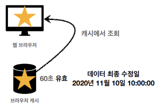
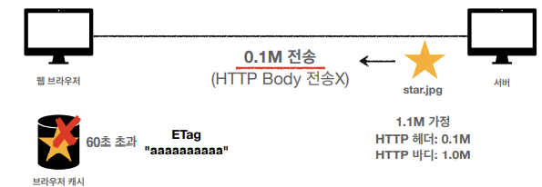

# HTTP 헤더2 - 캐시와 조건부 요청
## 목차
- 캐시 기본 동작
- 검증 헤더와 조건부 요청1
- 검증 헤더와 조건부 요청2
- 캐시와 조건부 요청 헤더
- 프록시 캐시
- 캐시 무효화
___
## 캐시 기본 동작
### 캐시가 없을 때
```c++
HTTP/1.1 200 OK
Content-Type: image/jpeg
Content-Length: 34012

lkj123kljoiasudlkjaweioluywlnfdo912u34ljko98udjklaslkjdfl;qkawj9;o4ruawsldkal;skdjfa;ow9ejkl3123123
```
- <b>첫 번째 요청</b><br>
<br>
<br><br>
- <b>두 번째 요청</b><br>
<br>
<br><br>
- 데이터가 변경되지 않아도, 계속 네트워크를 통해 데이터를 다운받아야 함
- 인터넷 네트워크는 매우 느리고 비싸다
- 브라우저 로딩 속도가 느리다
### 캐시 적용
```c++
HTTP/1.1 200 OK
Content-Type: image/jpeg
cache-control: max-age=60 // 캐시가 유효한 시간(초)
Content-Length: 34012

lkj123kljoiasudlkjaweioluywlnfdo912u34ljko98udjklaslkjdfl;qkawj9;o4ruawsldkal;skdjfa;ow9ejkl3123123
```
- <b>첫 번째 요청</b><br><br>
<br>
<br><br>
- <b>두 번째 요청</b><br>
<br>
<br><br>
- 캐시 덕분에 캐시 가능 시간동안 네트워크를 사용하지 않아도 된다.
- 비싼 네트워크 사용량을 줄일 수 있다.
- 브라우저 로딩 속도가 매우 빠르다<br><br>
- <b>세 번째 요청 - 캐시 시간 초과</b><br>
<br>
<br>
<br><Br>
- 캐시 유효 시간이 초과하면, 서버를 통해 데이터를 다시 조회하고, 캐시를 갱신한다.
- 이 때, 다시 네트워크 다운로드가 발생한다.
___
## 검증 헤더와 조건부 요청1
### 캐시 시간 초과
- 캐시 유효 시간이 초과해서, 서버에 다시 요청하면 다음 두 가지 상황이 나타난다.
    1. 서버에서 기존 데이터를 변경함
    2. 서버에서 기존 데이터를 변경하지 않음
- 캐시 만료 후에도 서버에서 데이터를 변경하지 않음
- 생각해보면, 데이터를 전송하는 대신, 저장 해 두었던 캐시를 재사용 할 수도 있다.
- 단, 클라이언트의 데이터와 서버의 데이터가 같다는 사실을 확인할 수 있는 방법 필요
### 검증 헤더 추가
- <b>첫 번째 요청</b>
```c++
HTTP/1.1 200 OK
Content-Type: image/jpeg
cache-control: max-age=60 
Last-Modified: 2020년 11월 10일 10:00:00 // 데이터가 마지막에 수정된 시간
Content-Length: 34012

lkj123kljoiasudlkjaweioluywlnfdo912u34ljko98udjklaslkjdfl;qkawj9;o4ruawsldkal;skdjfa;ow9ejkl3123123
```
<br>
<br><br>
- <b>두 번째 요청 - 캐시 시간 초과</b><br>
<br>
<br>
<br>
<br>
<br>
<br>
<br>
<br><br>
- <b>정리</b>
    - 캐시 유효 시간이 초과해도, 서버의 데이터가 갱신되지 않으면
        - 304 Not Modified + 헤더 메타 정보만 응답(바디x)
    - 클라이언트는 서버가 보낸 응답 헤더 정보로 캐시의 메타 정보를 갱신
    - 클라이언트는 캐시에 저장되어 있는 데이터 재활용
    - 결과적으로 네트워크 다운로드가 발생하지만, 용량이 적은 헤더 정보만 다운로드(매우 실용적인 해결책)
> ex)<br>
> <br>
> <br>
> <br>
___
## 검증 헤더와 조건부 요청2
- <b>검증 헤더</b>
    - 캐시 데이터와 서버 데이터가 같은지 검증하는 데이터
    - `Last-Modified`, `ETag`
- <b>조건부 요청 헤더</b>
    - 검증 헤더로 조건에 따른 분기
    - If-Modified-Since: Last-Modified 사용
    - If-None-Match: ETag 사용
    - 조건이 만족하면 200 OK
    - 조건이 만족하지 않으면, 304 Not Modified
### 예시
- If-Modified-Since: 이후에 데이터가 수정되었으면?
    - <b>데이터 미변경 예시</b>
        - 캐시: 2020년 11월 10일 10:00:00 vs 서버: 2020년 11월 10일 10:00:00
        - <b>304 Not Modified</b>, 헤더 데이터만 전송(BODY 미포함)
        - 전송 용량 0.1M (헤더 0.1M, 바디 1.0M)
    - <b>데이터 변경 예시</b>
        - 캐시: 2020년 11월 10일 10:00:00 vs 서버: 2020년 11월 10일 `11`:00:00
        - <b>200 OK</b>, 모든 데이터 전송(BODY 포함)
        - 전송 용량 1.1M (헤더 0.1M, 바디 1.0M)
### Last-Modified, If-Modified-Since 단점
- 1초 미만(0.x초) 단위로 캐시 조정이 불가능
- 날짜 기반의 로직 사용
- 데이터를 수정해서 날짜가 다르지만, 같은 데이터를 수정해서 데이터 결과가 똑같은 경우
- 서버에서 별도의 캐시 로직을 관리하고 싶은 경우
    > ex) 스페이스나 주석처럼 크게 영향이 없는 변경에서 캐시를 유지하고 싶은 경우
### ETag, If-None-Match
- Etag(Entity Tag)
- 캐시용 데이터에 임의의 고유한 버전 이름을 달아둠
    > ex) Etag: "v1.0", Etag: "a2jiodwjekjl3"
- 데이터가 변경되면, 이 이름을 바꾸어서 변경함(Hash를 다시 생성)
    > ex) ETag: "aaaaa" -> Etag: "bbbbb"
- 진짜 단순하게 ETag만 보내서 같으면 유지, 다르면 다시 받기!
- <b>캐시 제어 로직을 서버에서 완전히 관리</b>
- 클라이언트는 단순히 이 값을 서버에 제공(클라이언트는 캐시 메커니즘을 모름)
> ex)
> - 서버는 베타 오픈 기간인 3일동안 파일이 변경되어도 ETag를 동일하게 유지
> - 애플리케이션 배포 주기에 맞추어 ETag 모두 갱신
### 검증 헤더 추가
- <b>첫 번째 요청</b><br>
```c++
HTTP/1.1 200 OK
Content-Type: image/jpeg
cache-control: max-age=60 
ETag: "aaaaaaaaaa" 
Content-Length: 34012

lkj123kljoiasudlkjaweioluywlnfdo912u34ljko98udjklaslkjdfl;qkawj9;o4ruawsldkal;skdjfa;ow9ejkl3123123
```
<br>
<br><br>
- <b>두 번째 요청 - 캐시 시간 초과</b><br><br>
<br>
<br>
<br>
<br>
<br>
<br>
<br>
<br>
### 검증 헤더와 조건부 요청 헤더
- <b>검증 헤더(Validator)</b>
    - <b>ETag:</b> "v1.0", <b>ETag:</b> "asid93jkrh2l"
    - <b>Last-Modified:</b> Thu, 04 Jun 2020 07:19:24 GMT
- <b>조건부 요청 헤더</b>
    - If-Match, If-None-Match: Etag 값 사용
    - If-Modified-Since, If-Unmodified-Since: Last-Modified 값 사용
___
## 캐시와 조건부 요청 헤더
- <b>캐시 제어 헤더</b>
    - Cache-Control: 캐시 제어
    - Pragma: 캐시 제어(하위 호환)
    - Expires: 캐시 유효 기간(하위 호환)
### Cache-Control
- <b>캐시 지시어(directives)</b><br><br>
- Cache-Control: max-age
    - 캐시 유효 시간, 초 단위
- Cache-Control: no-cache
    - 데이터는 캐시해도 되지만, 항상 origin 서버에 검증하고 사용
- Cache-Control: no-store
    - 데이터에 민감한 정보가 있으므로 저장하면 안됨
    - 메모리에서 사용하고 최대한 빨리 삭제
### Pragma
- <b>캐시 제어(하위 호환)</b><br><Br>
- Pragma: no-cache
- HTTP 1.0 하위 호환
- 지금은 거의 사용하지 않음
### Expires
- <b>캐시 만료일 지정(하위 호환)</b><br><br>
- expires: Mon, 01 Jan 1990 00:00:00 GMT<br><br>
- 캐시 만료일을 정확한 날짜로 지정
- HTTP 1.0부터 사용
- 지금은 더 유연한 Cache-Control: max-age 권장
- Cache-Control: max-age와 함께 사용하면 Expires는 무시
___
## 프록시 캐시
- proxy: 대리자, 대신 처리해주다
### 원(origin) 서버 직접 접근
<br>
- 이미지 하나 다운받는 데 500ms씩 기다려야 하는 불편함 존재
### 프록시 캐시 도입
- <b>첫 번째 요청</b><br>
<br>
> ex) 유튜브
### Cache-Control
- <b>캐시 지시어(directives) - 기타</b><br><br>
- <b>Cache-Control: public</b>
    - 응답이 public 캐시에 저장되어도 됨
- <b>Cache-Control: private</b>
    - 응답이 해당 사용자만을 위한 것임, private 캐시에 저장해야 함(기본 값)
- <b>Cache-Control: s-maxage</b>
    - 프록시 캐시에만 적용되는 max-age
    - 참고만 하자
- <b>Age: 60 (HTTP 헤더)</b>
    - origin 서버에서 응답 후 프록시 캐시 내에 머문 시간(초)
    - 참고만 하자
___
## 캐시 무효화
### Cache-Control
- <b>확실한 캐시 무효화 응답</b>
    - <b>Cache-Control: no-cache, no-store, must-revalidate</b>
    - <b>Pragma: no-cache</b>
        - HTTP 1.0 하위 호환
    - 위에 있는 것을 모두 다 넣으면 확실하게 캐시 무효화가 된다.<br><br>
- <b>캐시 지시어(directives) - 확실한 캐시 무효화</b>
    - <b>Cache-Control: no-cache</b>
        - 데이터는 캐시해도 되지만, 항상 <b>origin 서버에 검증</b>히고 사용(이름에 주의!)
    - <b>Cache-Control: no-store</b>
        - 데이터에 민감한 정보가 있으므로 저장하면 안됨
        - 메모리에서 사용하고 최대한 빨리 삭제
    - <b>Cache-Control: must-revalidate</b>
        - 캐시 만료 후 최초 조회 시 <b>origin 서버에 검증</b>해야 함
        - origin 서버 접근 실패 시, 반드시 오류가 발생해야 함 - 504(Gateway Timeout)
        - must-revalidate는 캐시 유효 시간이라면, 캐시를 사용함
    - <b>Pragma: no-cache</b>
        - HTTP 1.0 하위 호환
### no-cache vs must-revalidate
- <b>no-cache 기본 동작</b><Br>
<br><br>
- <b>no-cache</b><br>
<br><br>
- <b>must-revalidate</b><br>


