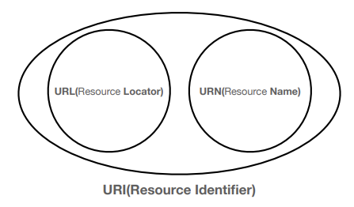
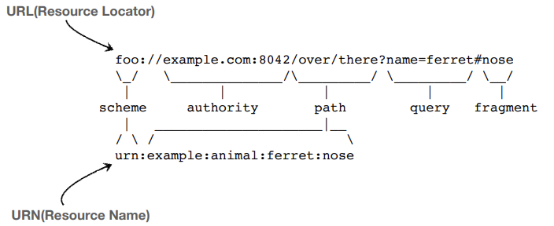
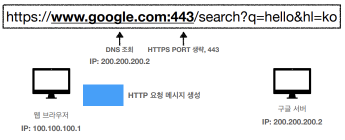
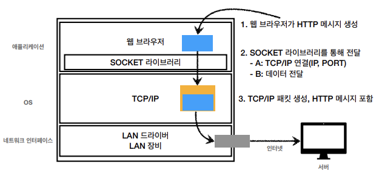
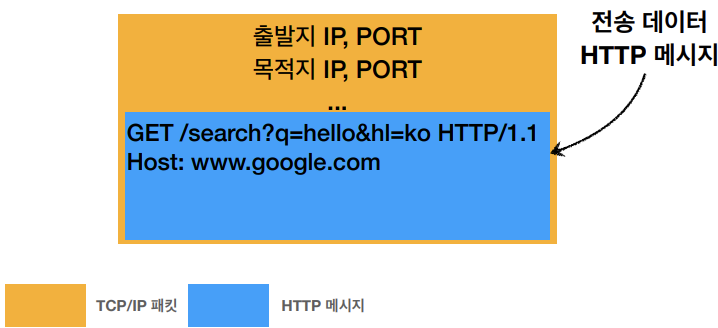
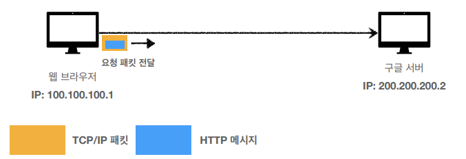
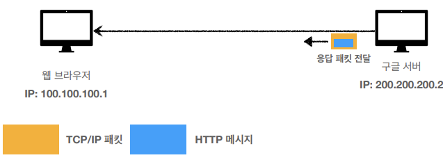
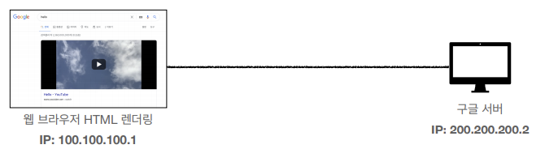

# URI와 웹 브라우저 요청
## 목차
- URI
- 웹 브라우저 요청 흐름
___
## URI
- Uniform Resource Identifier
- URI는 로케이터(Locator), 이름(Name) 또는 둘 다 추가로 분류될 수 있다.
    - https://www.ietf.org/rfc/rfc3986.txt
- 
    - URI(Resource <b>Identifier</b>): resource의 식별자
    - URL(Resource <b>Locator</b>): resource의 위치
    - URN(Resource <b>Name</b>): resource의 이름
- 
    - URN 대신 URL을 주로 사용한다.
### URI 단어 뜻
- <b>U</b>niform: 리소스 식별하는 통일된 방식
- <b>R</b>esource: 자원, URI로 식별할 수 있는 모든 것(제한 없음)
- <b>I</b>dentifier: 다른 항목과 구분하는 데 필요한 정보<br><br>
### URL, URN 단어 뜻
- URL - Locator: 리소스가 있는 위치를 지정
- URN - Name: 리소스에 이름을 부여
- 위치는 변할 수 있지만, 이름은 변하지 않는다.
- urn:isbn:8960777331 (어떤 책의 isbn URN)
- URN 이름만으로 실제 리소스를 찾을 수 있는 방법이 보편화 되지 않음
- <b>앞으로 URI를 URL과 같은 의미로 표현함</b>
### URL 전체 문법
- scheme://[userinfo@]host[:port][/path][?query][#fragment]
- https://www.google.com/search?q=hello&hl=ko<br><br>
- 프로토콜(https)
- 호스트명(www.google.com)
- 포트 번호(443)
- 패스(/search)
- 쿼리 파라미터(q=hello&hl=ko)
#### URL scheme
- <b>scheme</b>://[userinfo@]host[:port][/path][?query][#fragment]
- <b>https</b>://www.google.com/search?q=hello&hl=ko<br><br>
- 주로 프로토콜 사용
- 프로토콜: 어떤 방식으로 자원에 접근할 것인가 하는 약속 규칙
    > ex) http, https, ftp 등
- http는 80 포트, https는 443 포트를 주로 사용, 포트는 생략 가능
- https는 http에 보안 추가(HTTP Secure)
#### URL userinfo
- scheme://<b>[userinfo@]</b>host[:port][/path][?query][#fragment]
- https://www.google.com/search?q=hello&hl=ko<br><br>
- URL에 사용자정보를 포함해서 인증
- 거의 사용하지 않음
#### URL host
- scheme://[userinfo@]<b>host</b>[:port][/path][?query][#fragment]
- https://<b>www.google.com</b>:443/search?q=hello&hl=ko<br><br>
- 호스트명
- 도메인명 또는 IP 주소를 직접 사용 가능
#### URL PORT
- scheme://[userinfo@]host<b>[:port]</b>[/path][?query][#fragment]
- https://www.google.com<b>:443</b>/search?q=hello&hl=ko<br><br>
- 포트(PORT)
- 접속 포트
- 일반적으로 생략, 생략 시 http는 80, https는 443
#### URL path
- scheme://[userinfo@]host[:port]<b>[/path]</b>[?query][#fragment]
- https://www.google.com:443/<b>search</b>?q=hello&hl=ko<br><br>
- 리소스 경로(path), 계층적 구조
    > ex)
    > - /home/file1.jpg
    > - /members
    > - /members/100, /items/iphone12
#### URL query
- scheme://[userinfo@]host[:port][/path]<b>[?query]</b>[#fragment]
- https://www.google.com:443/search<b>?q=hello&hl=ko</b><br><br>
- key=value 형태
- ?로 시작, &으로 추가 가능
    > ex) ?keyA=valueA&keyB=valueB
- query parameter, query string 등으로 불림
    - 웹 서버에 제공하는 파라미터, 문자 형태
#### URL fragment
- scheme://[userinfo@]host[:port][/path][?query]<b>[#fragment]</b>
- https://docs.spring.io/spring-boot/docs/current/reference/html/getting-started.html<b>#getting-started-introducing-spring-boot</b><br><br>
- fragment
- html 내부 북마크 등에 시용
- 서버에 전송하는 정보 아님
___
## 웹 브라우저 요청 흐름

1. 클라이언트가 resource 요청 시, 웹 브라우저가 HTTP 메세지 생성
    - HTTP 요청 메세지
        ```
        GET /search?q=hello&hl=ko HTTP/1.1
        Host: www.google.com
        ```
2. SOCKET 라이브러리를 통해 TCP/IP로 서버와 연결 (3-way handshake)
3. OS 계층으로 HTTP 메세지를 전달하여 TCP/IP 패킷 생성
    - HTTP 메세지 전달 과정
        - 
    - 요청 패킷 생성
        - 
4. 클라이언트의 TCP/IP 패킷을 인터넷을 통해 서버로 전송
    - 요청 패킷 전송
        - 
5. 서버에서 요청 패킷을 받아 HTTP 메세지를 해석 후, HTTP 응답 메세지 생성
    - HTTP 응답 메세지
        ```
        HTTP/1.1 200 OK
        Content-Type: text/html;charset=UTF-8
        Content-Length: 3423

        <html>
            <body>...</body>
        </html>
        ```
6. 클라이언트에게 동일한 방식으로 응답 패킷 전송
    - 
7. 클라이언트에 응답 패킷이 도착하면, 웹 브라우저에 HTML을 렌더링
   - 