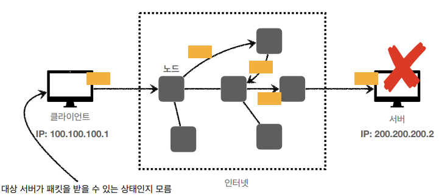

# 인터넷 네트워크
## 목차
- 인터넷 통신
- IP(Internet Protocol)
- TCP, UDP
- PORT
- DNS
___
## 인터넷 통신

- 클라이언트에서 서버로 데이터를 전송할 때, 수많은 노드(해저 광케이블, 인공위성 등)들을 통해 데이터가 전달되는 복잡한 과정이 존재한다.
- 이렇게 복잡한 인터넷 망에서 데이터들이 어떤 방식으로 전달이 될까?
## IP(인터넷 프로토콜)

### IP 역할
- 지정한 IP 주소(IP Address)에 데이터 전달
- 패킷(Packet)이라는 통신 단위로 데이터 전달
### IP 패킷 정보

- IP패킷 규칙에 따라 데이터를 전송한다.
- 출발지 IP, 목적지 IP 등의 정보를 포함한 IP패킷을 전달한다.
- <b>클라이언트 패킷 전달</b>
    - 
- <b>서버 패킷 전달</b>
    - 
### IP 프로토콜의 한계
- <b>비연결성</b>
    - 
    - 패킷을 받을 대상이 없거나, 서비스 불능 상태여도 패킷 전송
- <b>비신뢰성</b>
    - 중간에 패킷이 사라지면?
        - 
    - 패킷이 순서대로 안오면?
        - 
- <b>프로그램 구분</b>
    - 같은 IP를 사용하는 서버에서 통신하는 애플리케이션이 둘 이상이면?
___
## TCP, UDP
### 인터넷 프로토콜 스택의 4계층
- 
### 프로토콜 계층
- 
### TCP/IP 패킷 정보
- 
### TCP 특징
- **전송 제어 프로토콜(Transmission Control Protocol)**  
- 연결 지향 - TCP 3 way handshake (가상 연결)
    - 
- 데이터 전달 보증 
    - 
- 순서 보장
    -   
- 신뢰할 수 있는 프로토콜
- 현재는 대부분 TCP를 사용한다.
### UDP 특징
- **사용자 데이터그램 프로토콜(User Datagram Protocol)**  
- 하얀 도화지에 비유(기능이 거의 없음)
- 연결 지향 - TCP 3 way handshake X
- 데이터 전달 보증 X
- 순서 보장 X
- 데이터 전달 및 순서가 보장되지 않지만, 단순하고 빠름
- 정리
    - IP와 거의 동일 + PORT + 체크섬 정도만 추가
    - 애플리케이션에서 추가 작업 필요
___
## PORT
- 한 번에 둘 이상 연결해야 하면?
    - 
    - TCP or UDP 패킷에 출발지 PORT, 도착지 PORT 정보를 추가하여 전송한다.
- PORT는 같은 IP 내에서 프로세스를 구분하는 용도로 쓰인다.
    - 
- 0 ~ 65535 할당 가능
- 0 ~ 1023 : 잘 알려진 포트이므로 사용하지 않는 것이 좋다
    - FTP - 20, 21
    - TELNET - 23
    - HTTP - 80
    - HTTPS - 443
___
## DNS
- IP는 기억하기 어렵고, 변경될 수 있다.
    - IP를 갱신할 때 마다, 새로운 IP를 클라이언트가 알고 있어야 한다.
- DNS(Domain Name System)
    - 전화번호부
    - 도메인 명을 IP주소로 변환
- DNS 사용
    - 
