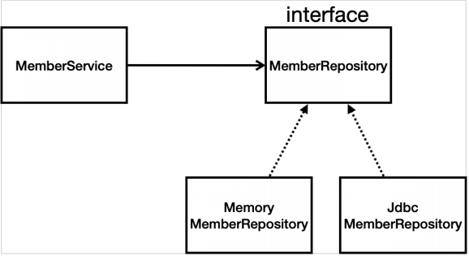

# 스프링 DB 접근 기술
- **스프링 데이터 접근**
    1. H2 데이터베이스 설치
    2. **순수 Jdbc**
    3. 스프링 통합 테스트
    4. 스프링 JdbcTemplate
    5. JPA
    6. 스프링 데이터 JPA

## 순수 Jdbc
### 환경 설정
- **`build.gradle` 파일에 `jdbc, h2 데이터베이스` 관련 라이브러리 추가**
    ```gradle
    dependencies {
        ...
        implementation 'org.springframework.boot:spring-boot-starter-jdbc'
        runtimeOnly 'com.h2database:h2'
        ...
    }
    ```

- **스프링 부트 데이터베이스 연결 설정 추가**
    - `resources/application.properties`
    ```properties
    spring.datasource.url=jdbc:h2:tcp://localhost/~/test
    spring.datasource.driver-class-name=org.h2.Driver
    spring.datasource.username=sa
    ```
    - **주의** : 스프링부트 2.4부터는 `spring.datasource.username=sa`를 꼭 추가해주어야 한다.

### Jdbc 리포지토리 구현
- 이렇게 JDBC API로 직접 코딩하는 것은 20년 전의 이야기이므로, 참고만 하고 넘어가자.
- **Jdbc 회원 리포지토리**
```java
package hello.hellospring.repository;

import hello.hellospring.domain.Member;
import org.springframework.jdbc.datasource.DataSourceUtils;

import javax.sql.DataSource;
import java.sql.*;
import java.util.ArrayList;
import java.util.List;
import java.util.Optional;

public class JdbcMemberRepository implements MemberRepository {

    private final DataSource dataSource;

    public JdbcMemberRepository(DataSource dataSource) {
        this.dataSource = dataSource;
    }

    @Override
    public Member save(Member member) {
        String sql = "insert into member(name) values(?)";

        Connection conn = null;
        PreparedStatement pstmt = null;
        ResultSet rs = null;

        // 에러가 많이 발생하기 때문에, 반드시 try-catch 문으로 작성해야 한다.
        try {
            conn = getConnection();
            // Statement.RETURN_GENERATED_KEYS : key를 1부터 1씩 증가하면서 생성해준다.
            pstmt = conn.prepareStatement(sql, Statement.RETURN_GENERATED_KEYS);

            // 위의 String형 sql 변수에 존재하는 첫 번째 물음표(?)에 두 번째 parameter 값을 넣어준다.
            pstmt.setString(1, member.getName());

            // Query 실행
            pstmt.executeUpdate();
            // Query를 실행하여 발생한 keys들을 결과로 받음
            rs = pstmt.getGeneratedKeys();

            if (rs.next()) {
                // getLong으로 값을 꺼내어 setId로 값을 설정
                member.setId(rs.getLong(1));
            } else {
                throw new SQLException("id 조회 실패");
            }
            return member;
        } catch (Exception e) {
            throw new IllegalStateException(e);
        } finally {
            // 반드시 resources를 release 해주어야 한다.
            close(conn, pstmt, rs);
        }
    }
    @Override
    public Optional<Member> findById(Long id) {
        String sql = "select * from member where id = ?";

        Connection conn = null;
        PreparedStatement pstmt = null;
        ResultSet rs = null;

        try {
            conn = getConnection();
            pstmt = conn.prepareStatement(sql);
            pstmt.setLong(1, id);

            // Query 실행
            rs = pstmt.executeQuery();

            if(rs.next()) {
                Member member = new Member();
                member.setId(rs.getLong("id"));
                member.setName(rs.getString("name"));
                return Optional.of(member);
            } else {
                return Optional.empty();
            }
        } catch (Exception e) {
            throw new IllegalStateException(e);
        } finally {
            close(conn, pstmt, rs);
        }
    }
    @Override
    public List<Member> findAll() {
        String sql = "select * from member";

        Connection conn = null;
        PreparedStatement pstmt = null;
        ResultSet rs = null;

        try {
            conn = getConnection();
            pstmt = conn.prepareStatement(sql);

            rs = pstmt.executeQuery();

            List<Member> members = new ArrayList<>();
            while(rs.next()) {
                Member member = new Member();
                member.setId(rs.getLong("id"));
                member.setName(rs.getString("name"));
                members.add(member);
            }
            return members;
        } catch (Exception e) {
            throw new IllegalStateException(e);
        } finally {
            close(conn, pstmt, rs);
        }
    }
    @Override
    public Optional<Member> findByName(String name) {
        String sql = "select * from member where name = ?";

        Connection conn = null;
        PreparedStatement pstmt = null;
        ResultSet rs = null;

        try {
            conn = getConnection();
            pstmt = conn.prepareStatement(sql);
            pstmt.setString(1, name);

            rs = pstmt.executeQuery();

            if(rs.next()) {
                Member member = new Member();
                member.setId(rs.getLong("id"));
                member.setName(rs.getString("name"));
                return Optional.of(member);
            }
            return Optional.empty();
        } catch (Exception e) {
            throw new IllegalStateException(e);
        } finally {
            close(conn, pstmt, rs);
        }
    }
    private Connection getConnection() {
        return DataSourceUtils.getConnection(dataSource);
    }

    private void close(Connection conn, PreparedStatement pstmt, ResultSet rs)
    {
        try {
            if (rs != null) {
                rs.close();
            }
        } catch (SQLException e) {
            e.printStackTrace();
        }
        try {
            if (pstmt != null) {
                pstmt.close();
            }
        } catch (SQLException e) {
            e.printStackTrace();
        }
        try {
            if (conn != null) {
                close(conn);
            }
        } catch (SQLException e) {
            e.printStackTrace();
        }
    }

    private void close(Connection conn) throws SQLException {
        DataSourceUtils.releaseConnection(conn, dataSource);
    }
}
```
- **스프링 설정 변경**
```java
package hello.hellospring;

import hello.hellospring.repository.JdbcMemberRepository;
import hello.hellospring.repository.MemberRepository;
import hello.hellospring.service.MemberService;
import org.springframework.beans.factory.annotation.Autowired;
import org.springframework.context.annotation.Bean;
import org.springframework.context.annotation.Configuration;

import javax.sql.DataSource;

@Configuration
public class SpringConfig {

    private DataSource dataSource;

    @Autowired
    public SpringConfig(DataSource dataSource) {
        this.dataSource = dataSource;
    }

    @Bean
    public MemberService memberService(){
        return new MemberService(memberRepository());
    }

    @Bean
    public MemberRepository memberRepository(){
        // return new MemoryMemberRepository();
        return new JdbcMemberRepository(dataSource);
    }
}
```
- `DataSource`는 `데이터베이스 커넥션`을 획득할 때 사용하는 객체다.
- 스프링 부트는 데이터베이스 커넥션 정보를 바탕으로 DataSource를 생성하고, 스프링 빈으로 만들어두므로 DI를 받을 수 있다.
- **구현 클래스 추가 이미지**
    - 
- **스프링 설정 이미지**
    - 
    - 계방-폐쇄 원칙(OCP, Open-Closed Principle)
        - 확장에는 열려있고, 수정·변경에는 닫혀있다.
    - 스프링의 DI(Dependencies Injection)을 사용하면 `기존 코드를 전혀 손대지 않고, 설정만으로 구현 클래스를 변경`할 수 있다.
    - 데이터를 DB에 저장하므로, 스프링 서버를 다시 실행해도 데이터가 안전하게 저장되어있다.