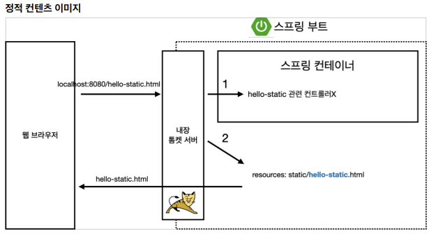
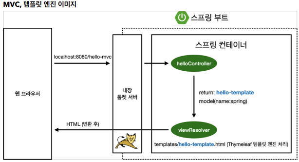
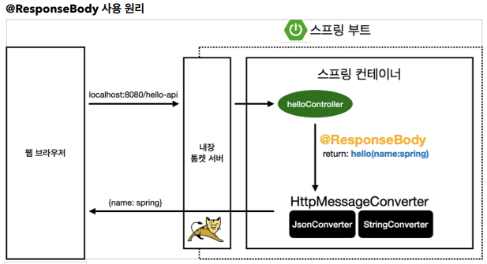

# 스프링 웹 개발 기초
- 정적 컨텐츠
    - HTML파일을 그대로 web browser에 내보내는 것
- MVC와 템플릿 엔진
    - JSP, PHP 등이 템플렛 엔진에 해당한다.
    - HTML을 서버에 보내서 동적으로 처리하여 web browser에 내보낸다.
    - Model-View-Controller(MVC)
- API
    - 과거에는 xml을 사용했지만, 요즘에는 `json`이라는 데이터 구조 포맷을 이용하여, 클라이언트에게 데이터를 전송한다.

## 정적 컨텐츠
- Spring Boot는 `/static`, `/public`, `/resources`, `/META-INF/resources` directory로부터 정적 컨텐츠를 제공한다.
- [Reference](https://docs.spring.io/spring-boot/docs/2.3.1.RELEASE/reference/html/spring-boot-features.html#boot-features-spring-mvc-static-content)
- `resources/static/hello-static.html`
    ```html
    <!DOCTYPE HTML>
    <html>
    <head>
     <title>static content</title>
     <meta http-equiv="Content-Type" content="text/html; charset=UTF-8" />
    </head>
    <body>
    정적 컨텐츠 입니다.
    </body>
    </html>
    ```
    - 실행 : http://localhost:8080/hello-static.html
- 정적 컨텐츠 이미지<br>


## MVC와 템플릿 엔진
- `Controller`
    ```java
    @Controller
    // required default 값은 true이다.
    // 그렇기 때문에, url 뒤에 ?name=spring 처럼 추가해주어야 오류가 나지 않음!
    // 추가로, @Requestparam을 사용하지 않으면, 시스템에 따라 자바 컴파일러 최적화 옵션에 의해 컴파일 시점에 name 이라는 변수가 사라지기 때문에, 받을 수가 없게 된다.
    // @RequestParam("name") String name -> 컴파일 후 @RequestParam("name") String x01
    // 그러므로 @Requestparam을 사용하는 것이 좋다.
    public class HelloController {
        @GetMapping("hello-mvc")
        public String helloMvc(@RequestParam("name") String name, Model model) {
        model.addAttribute("name", name);
        return "hello-template";
        }
     }
    ```
- `View`
    - `resources/template/hello-template.html`
    ```html
    <html xmlns:th="http://www.thymeleaf.org">
    <body>
    <!--
        Server에 접속하면 p 태그 안의 내용이 th:text 내용으로 변경되어 나타난다.
        p 태크 안의 내용은 Server없이 돌렸을 때 나타난다.
    -->
    <p th:text="'hello ' + ${name}">hello! empty</p>
    </body>
    </html>
    ```
    - 실행 : http://localhost:8080/hello-mvc?name=spring


## API
### @ResponseBody 문자 반환
```java
@Controller
public class HelloController { 
    @GetMapping("hello-string")
    @ResponseBody   // HTTP의 Body 부분에 아래 내용을 그대로 넣겠다는 의미.
    public String helloString(@RequestParam("name") String name) {
        return "hello " + name; 
    }
}
```
- `@ResponseBody`를 사용하면 뷰리졸버(`viewResolver`)를 사용하지 않음.
- 대신에 `HTTP의 Body`에 문자 내용을 직접 반환(HTML Body tag를 말하는 것이 아님!)
- 실행 : http://localhost:8080/hello-string?name=spring

### @ResponseBody 객체 반환
```java
@Controller
public class HelloController {
    @GetMapping("hello-api")
    @ResponseBody   // json으로 반환하는 것이 default로 설정되어있다.
    /*
        @ResponseBody가 없을 때는, return 값을 viewResolver에게 전달하여 맞는 template을 찾아서 반환한다.
        @ResponseBody가 있을 때는, HTTP 응답에 그대로 데이터를 넘긴다.
        만약, 문자가 아니라 객체를 반환하는 경우 json 방식(default)으로 데이터를 구성해서 HTTP 응답에 반환한다.
        HttpMessageConverter가 위의 과정을 처리한다.
    */
    public Hello helloApi(@RequestParam("name") String name) {
        Hello hello = new Hello();
        hello.setName(name);
        return hello;   // {"name" : "spring"} -> json 구조 (key, value)
    }
    static class Hello {
        private String name;
        // Java Beans 표준 방식(getter, setter)
        public String getName() {
            return name;
        }
        public void setName(String name) {
            this.name = name;
        }
    }
}
```
- `@ResponseBody`를 사용하고, 객체를 반환하면 객체가 `JSON`으로 변환됨
- 실행 : http://localhost:8080/hello-api?name=spring

### ResponseBody 사용 원리

- `@ResponseBody`를 사용
    - HTTP의 Body에 문자 내용을 직접 반환
    - `viewResolver`대신에 `HttpMessageConverter`가 동작
    - 기본 문자처리 : `StringHttpMessageConverter`
    - 기본 객체처리 : `MappingJackson2HttpMessageConverter`
        - `객체`를 `JSON`으로 바꾸어주는 대표적인 라이브러리 : `Jackson`, `GSON`
        - 스프링은 `Jackson` 라이브러리를 default로 사용한다.
    - byte 처리 등등 기타 여러 HttpMessageConverter가 기본으로 등록되어 있음
- 참고 : 클라이언트의 HTTP Accept 헤더와 서버의 컨트롤러 반환 타입 정보 둘을 조합해서 `HttpMessageConverter`가 선택된다.