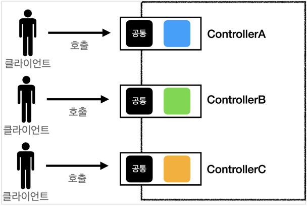
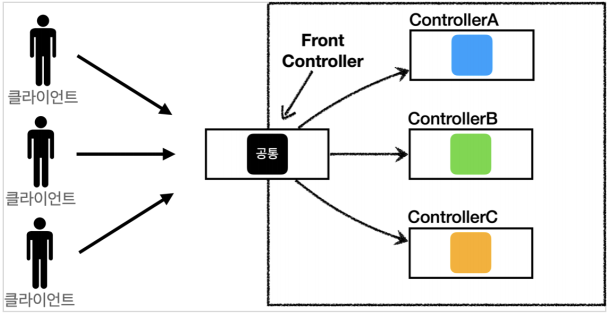
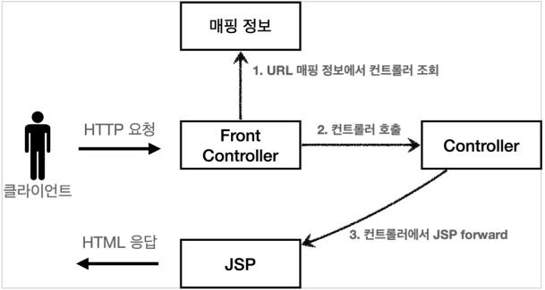
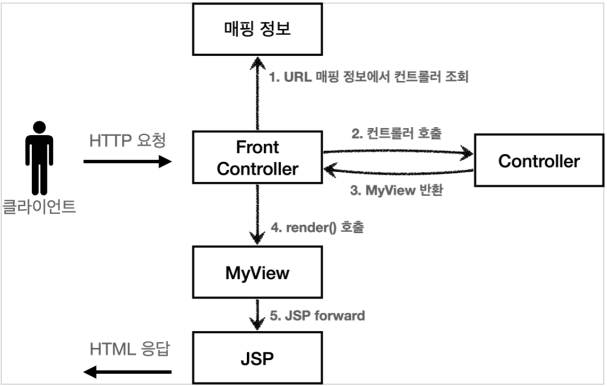
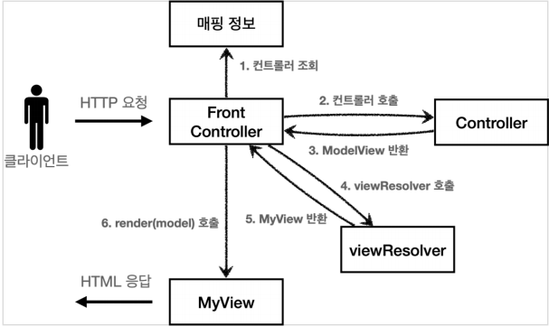
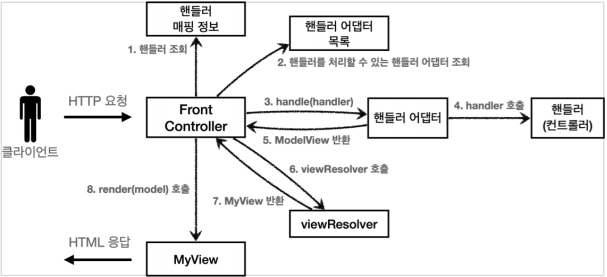

# MVC 프레임워크 만들기
## 목차
- 프론트 컨트롤러 패턴 소게
- 프론트 컨트롤러 도입 - v1
- View 분리 - v2
- Model 추가 - v3
- 단순하고 실용적인 컨트롤러 - v4
- 유연한 컨트롤러1 - v5
- 유연한 컨트롤러2 - v5
- 정리
___
## 프론트 컨트롤러 패턴 소개
- <b>프론트 컨트롤러 도입 전</b><br>
<br><br>
- <b>프론트 컨트롤러 도입 후</b><br>
<br><br>
- <b>FrontController 패턴 특징</b>
    - 프론트 컨트롤러 서블릿 하나로 클라이언트의 요청을 받음
    - 프론트 컨트롤러가 요청에 맞는 컨트롤러를 찾아서 호출
    - 입구를 하나로!
    - 공통 처리 가능
    - 프론트 컨트롤러를 제외한 나머지 컨트롤러는 서블릿을 사용하지 않아도 됨
- <b>스프링 웹 MVC와 프론트 컨트롤러</b>
    - 스프링 웹 MVC의 핵심도 바로 <b>FrontController</b>
    - 스프링 웹 MVC의 <b>DispatcherServlet</b>이 FrontController 패턴으로 구현되어있음
___
## 프론트 컨트롤러 도입 - v1
- 프론트 컨트롤러를 단계적으로 도입해보자.
- 이번 목표는 기존 코드를 최대한 유지하면서, 프론트 컨트롤러를 도입하는 것이다.
- 먼저 구조를 맞추어 두고 점진적으로 리펙터링 해보자.<br><br>
- <b>V1 구조</b><br>
<br><Br>
- <b>ControllerV1</b>
```java
public interface ControllerV1 {

    void process(HttpServletRequest request, HttpServletResponse response) throws ServletException, IOException;
}
```
- 서블릿과 비슷한 모양의 컨트롤러 인터페이스를 도입한다. 각 컨트롤러들은 이 인터페이스를 구현하면 된다.
- 프론트 컨트롤러는 이 인터페이스를 호출해서 구현과 관계없이 로직의 일관성을 가져갈 수 있다.<br><br>
- 이제 이 인터페이스를 구현한 컨트롤러를 만들어보자. 지금 단계에서는 기존 로직을 최대한 유지하는게 핵심이다.<br><br>
- <b>MemberFormControllerV1 - 회원 등록 컨트롤러</b>
```java
public class MemberFormControllerV1 implements ControllerV1 {
    @Override
    public void process(HttpServletRequest request, HttpServletResponse response) throws ServletException, IOException {
        String viewPath = "/WEB-INF/views/new-form.jsp";
        RequestDispatcher dispatcher = request.getRequestDispatcher(viewPath);
        dispatcher.forward(request, response);
    }
}
```
- <b>MemberSaveControllerV1 - 회원 저장 컨트롤러</b>
```java
public class MemberSaveControllerV1 implements ControllerV1 {

    private final MemberRepository memberRepository = MemberRepository.getInstance();

    @Override
    public void process(HttpServletRequest request, HttpServletResponse response) throws ServletException, IOException {

        String username = request.getParameter("username");
        int age = Integer.parseInt(request.getParameter("age"));

        Member member = new Member(username, age);
        System.out.println("member = " + member);
        memberRepository.save(member);

        //Model에 데이터를 보관한다.
        request.setAttribute("member", member);

        String viewPath = "/WEB-INF/views/save-result.jsp";
        RequestDispatcher dispatcher = request.getRequestDispatcher(viewPath);
        dispatcher.forward(request, response);
    }
}
```
- <b>MemberListControllerV1 = 회원 목록 컨트롤러</b>
```java
public class MemberListControllerV1 implements ControllerV1 {

    private final MemberRepository memberRepository = MemberRepository.getInstance();

    @Override
    public void process(HttpServletRequest request, HttpServletResponse response) throws ServletException, IOException {
        List<Member> members = memberRepository.findAll();

        request.setAttribute("members", members);

        String viewPath = "/WEB-INF/views/members.jsp";
        RequestDispatcher dispatcher = request.getRequestDispatcher(viewPath);
        dispatcher.forward(request, response);
    }
}
```
- 내부 로직들은 기존 서블릿과 거의 같다.
- 이제 프론트 컨트롤러를 만들어보자.<br><br>
- <b>FrontControllerServletV1 - 프론트 컨트롤러</b>
```java
@WebServlet(name = "frontControllerServletV1", urlPatterns = "/front-controller/v1/*")
public class FrontControllerServletV1 extends HttpServlet {

    private Map<String, ControllerV1> controllerMap = new HashMap<>();

    public FrontControllerServletV1() {
        controllerMap.put("/front-controller/v1/members/new-form", new MemberFormControllerV1());
        controllerMap.put("/front-controller/v1/members/save", new MemberSaveControllerV1());
        controllerMap.put("/front-controller/v1/members", new MemberListControllerV1());
    }

    @Override
    protected void service(HttpServletRequest request, HttpServletResponse response) throws ServletException, IOException {
        System.out.println("FrontControllerServletV1.service");

        String requestURI = request.getRequestURI();

        ControllerV1 controller = controllerMap.get(requestURI);
        if(controller == null){
            response.setStatus(HttpServletResponse.SC_NOT_FOUND);
            return;
        }

        controller.process(request, response);
    }
}
```
- <b>프론트 컨트롤러 분석</b>
    - <b>urlPatterns</b>
        - `urlPatterns = "/front-controller/v1/*"`: `/front-controller/v1`를 포함한 하위의 모든 요청은 이 서블릿에서 받아들인다.
            > ex) `/front-controller/v1`, `/front-controller/v1/a/b`
    - <b>controllerMap</b>
        - key: 매핑 URL
        - value: 호출될 컨트롤러
    - <b>service()</b>
        - 먼저 `requestURI`를 조회해서 실제 호출할 컨트롤러를 `controllerMap`에서 찾는다.
        - 만약 없다면, 404(SC_NOT_FOUND) 상태 코드를 반환한다.
        - 컨트롤러를 찾고 `controller.process(request, response);`을 호출하여 해당 컨트롤러를 실행한다.
    - <b>JSP</b>
        - JSP는 이전 MVC에서 사용했던 것을 그대로 사용한다.
- <b>실행</b>
    - 등록: http://localhost:8080/front-controller/v1/members/new-form
    - 목록: http://localost:8080/front-controller/v1/members
- 기존 서블릿, JSP로 만든 MVC와 동일하게 실행되는 것을 확인할 수 있다.
___
## View 분리 - v2
- 모든 컨트롤러에서 뷰로 이동하는 부분에 중복이 있으므로 깔끔하지 않다.
```java
String viewPath = "/WEB-INF/views/new-form.jsp";
RequestDispatcher dispatcher = request.getRequestDispatcher(viewPath);
dispatcher.forward(request, response);
```
- 이 부분을 깔끔하게 분리하기 위해 별도로 뷰를 처리하는 객체를 만들자.<br><br>
- <b>V2 구조</b><br>
<br><BR>
- <b>MyView</b>
    - 뷰 객체는 이후 다른 버전에서도 함께 사용하므로 패키지 위치를 `frontcontroller`에 두었다.
```java
public class MyView {

    private String viewPath;

    public MyView(String viewPath) {
        this.viewPath = viewPath;
    }

    public void render(HttpServletRequest request, HttpServletResponse response) throws ServletException, IOException{
        RequestDispatcher dispatcher = request.getRequestDispatcher(viewPath);
        dispatcher.forward(request, response);
    }
}
```
- 다음 버전의 컨트롤러 인터페이스를 만들어 보자.
    - 컨트롤럭 뷰를 반환하는 특징이 추가되었다.
- <b>ControllerV2</b>
```java
public interface ControllerV2 {

    MyView process(HttpServletRequest request, HttpServletResponse response) throws ServletException, IOException;
}
```
- <b>MemberFormControllerV2 - 회원 등록 폼</b>
```java
public class MemberFormControllerV2 implements ControllerV2 {

    @Override
    public MyView process(HttpServletRequest request, HttpServletResponse response) throws ServletException, IOException {
        return new MyView("/WEB-INF/views/new-form.jsp");
    }
}
```
- 이제 각 컨트롤러는 복잡한 `dispatcher.forward()`를 직접 생성해서 호출하지 않아도 된다.
    - 단순히 MyView 객체를 생성하고, 거기에 뷰이름만 넣어 반환하면 된다.
- `ControllerV1`을 구현한 클래스와 `ControllerV2`를 구현한 클래스를 비교해보면, 이 부분의 중복이 확실하게 제거된 것을 알 수 있다.<br><br>
- <b>MemberSaveControllerV2 - 회원 저장</b>
```java
public class MemberSaveControllerV2 implements ControllerV2 {

    private final MemberRepository memberRepository = MemberRepository.getInstance();

    @Override
    public MyView process(HttpServletRequest request, HttpServletResponse response) throws ServletException, IOException {
        String username = request.getParameter("username");
        int age = Integer.parseInt(request.getParameter("age"));

        Member member = new Member(username, age);
        System.out.println("member = " + member);
        memberRepository.save(member);

        //Model에 데이터를 보관한다.
        request.setAttribute("member", member);

        return new MyView("/WEB-INF/views/save-result.jsp");
    }
}
```
- <b>MemberListControllerV2 - 회원 목록</b>
```java
public class MemberListControllerV2 implements ControllerV2 {

    private final MemberRepository memberRepository = MemberRepository.getInstance();

    @Override
    public MyView process(HttpServletRequest request, HttpServletResponse response) throws ServletException, IOException {
        List<Member> members = memberRepository.findAll();

        request.setAttribute("members", members);

        return new MyView("/WEB-INF/views/members.jsp");
    }
}
```
- <b>프론트 컨트롤러 V2</b>
```java
@WebServlet(name = "frontControllerServletV2", urlPatterns = "/front-controller/v2/*")
public class FrontControllerServletV2 extends HttpServlet {

    private Map<String, ControllerV2> controllerMap = new HashMap<>();

    public FrontControllerServletV2() {
        controllerMap.put("/front-controller/v2/members/new-form", new MemberFormControllerV2());
        controllerMap.put("/front-controller/v2/members/save", new MemberSaveControllerV2());
        controllerMap.put("/front-controller/v2/members", new MemberListControllerV2());
    }

    @Override
    protected void service(HttpServletRequest request, HttpServletResponse response) throws ServletException, IOException {
        System.out.println("FrontControllerServletV2.service");

        String requestURI = request.getRequestURI();

        ControllerV2 controller = controllerMap.get(requestURI);
        if(controller == null){
            response.setStatus(HttpServletResponse.SC_NOT_FOUND);
            return;
        }

        MyView view = controller.process(request, response);
        view.render(request, response);
    }
}
```
- ControllerV2의 반환 타입이 `MyView`이므로, 프론트 컨트롤러는 컨트롤러의 호출 결과로 `MyView`를 반환 받는다.
    - 그리고 `view.render()`를 호출하면 `forward` 로직을 수행하여 JSP가 실행된다.
    ```java
    public void render(HttpServletRequest request, HttpServletResponse response) throws ServletException, IOException{
        RequestDispatcher dispatcher = request.getRequestDispatcher(viewPath);
        dispatcher.forward(request, response);
    }
    ```
- 프론트 컨트롤러의 도입으로, `MyView` 객체의 `render()`를 호출하는 부분을 모두 일관되게 처리할 수 있다.
    - 각각의 컨트롤러는 `MyView` 객체를 생성만 하여 반환하면 된다.
- <b>실행</b>
    - 등록: http://localhost:8080/front-contrller/v2/members/new-form
    - 목록: http://localhost:8080/front-controller/v2/members
___
## Model 추가 - v3
- <b>서블릿 종속성 제거</b>
    - 컨트롤러 입장에서 HttpServletRequest, HttpServletResponse가 꼭 필요할까?
    - 요청 파라미터 정보는 자바의 Map으로 대신 넘기도록 하면, 지금 구조에서는 컨트롤러가 서블릿 기술을 몰라도 동작할 수 있다.
    - 그리고 request 객체를 Model로 사용하는 대신에 별도의 Model 객체를 만들어 반환하면 된다.
    - 우리가 구현하는 컨트롤러가 서블릿 기술을 전혀 사용하지 않도록 변경해보자.
    - 이렇게 하면 구현 코드가 매우 단순해지고, 테스트 코드 작성도 쉽다.
- <b>뷰 이름 중복 제거</b>
    - 컨트롤러에서 지정하는 뷰 이름에 중복이 있는 것을 확인할 수 있다.
    - 컨트롤러는 <b>뷰의 논리 이름</b>을 반환하고, 실제 물리 위치의 이름은 프론트 컨트롤러에서 처리하도록 단순화하자.
    - 이렇게 해두면, 향후 뷰의 폴더 위치가 함께 이동해도 프론트 컨트롤러만 고치면 된다.<br><br>
    - `/WEB-INF/views/new-form.jsp` <b>-> new-form</b>
    - `/WEB-INF/views/save-result.jsp` <b>-> save-result</b>
    - `/WEB-INF/views/members.jsp` <b>-> members</b>
- <b>V3 구조</b><br>
<br><br>
- <b>ModelView</b>
    - 지금까지 컨트롤러에서 서블릿에 종속적인 HttpServletRequest를 사용했다. 그리고 Model도 `request.setAttribute()`를 통해 데이터를 저장하고 뷰에 전달했다.
    - 서블릿의 종속성을 제거하기 위해 Model을 직접 만들고, 추가로 View 이름까지 전달하는 객체를 만들어보자.
    - 이번 버전에서는 컨트롤러에서 HttpServletRequest를 사용할 수 없다. 따라서 직접 `request.setAttribute()`를 호출할 수도 없다. 따라서 Model이 별도로 필요하다.<br><br>
    - 참고로 `ModelView` 객체는 다른 버전에서도 사용하므로, 패키지를 `frontcontroller`에 둔다.
```java
@Getter
@Setter
public class ModelView {

    private String viewName;
    private Map<String, Object> model = new HashMap<>();

    public ModelView(String viewName) {
        this.viewName = viewName;
    }
}
```
- 뷰의 이름과, 뷰를 렌더링할 때 필요한 model 객체를 가지고 있다.
- model은 단순히 map으로 되어 있으므로, 컨트롤러에서 뷰에 필요한 데이터를 key, value로 넣어주면 된다.<br><br>
- <b>ControllerV3</b>
```java
public interface ControllerV3 {

    ModelView process(Map<String, String> paramMap);
}
```
- 이 컨트롤러는 서블릿 기술을 전혀 사용하지 않는다. 따라서 구현이 매우단순해지고, 테스트 코드 작성시 테스트 하기 쉽다.
- HttpServletRequest가 제공하는 파라미터는 프론트 컨트롤러가 paramMap에 담아 호출해주면 된다.
- 응답 결과로 뷰 이름과 뷰에 전달할 Model 데이터를 포함하는 ModelView 객체를 반환하면 된다.<br><br>
- <B>MemberFormControllerV3 - 회원 등록 폼</B>
```java
public class MemberFormControllerV3 implements ControllerV3 {
    @Override
    public ModelView process(Map<String, String> paramMap) {
        return new ModelView("new-form");
    }
}
```
- `ModelView`를 생성할 때 `new-form`이라는 view의 논리적인 이름을 지정한다. 실제 물리적인 이름은 프론트 컨트롤러에서 처리한다.<br><br>
- <b>MemberSaveControllerV3 - 회원 저장</b>
```java
public class MemberSaveControllerV3 implements ControllerV3 {

    private final MemberRepository memberRepository = MemberRepository.getInstance();

    @Override
    public ModelView process(Map<String, String> paramMap) {
        String username = paramMap.get("username");
        int age = Integer.parseInt(paramMap.get("age"));

        Member member = new Member(username, age);
        memberRepository.save(member);

        ModelView mv = new ModelView("save-result");
        mv.getModel().put("member", member);
        return mv;
    }
}
```
- `paramMap.get("username");`
    - 파라미터 정보는 map에 담겨있다. map에서 필요한 요청 파라미터를 조회하면 된다.
- `mv.getModel().put("member", member);`
    - 모델은 단순한 map이므로, 모델에 뷰에서 필요한 `member` 객체를 담고 반환한다.
- <b>MemberListControllerV3 - 회원 목록</b>
```java
public class MemberListControllerV3 implements ControllerV3 {

    private final MemberRepository memberRepository = MemberRepository.getInstance();

    @Override
    public ModelView process(Map<String, String> paramMap) {
        List<Member> members = memberRepository.findAll();
        ModelView mv = new ModelView("members");
        mv.getModel().put("members", members);
        return mv;
    }
}
```
- <b>FrontControllerServletV3</b>
```java
@WebServlet(name = "frontControllerServletV3", urlPatterns = "/front-controller/v3/*")
public class FrontControllerServletV3 extends HttpServlet {

    private Map<String, ControllerV3> controllerMap = new HashMap<>();

    public FrontControllerServletV3() {
        controllerMap.put("/front-controller/v3/members/new-form", new MemberFormControllerV3());
        controllerMap.put("/front-controller/v3/members/save", new MemberSaveControllerV3());
        controllerMap.put("/front-controller/v3/members", new MemberListControllerV3());
    }

    @Override
    protected void service(HttpServletRequest request, HttpServletResponse response) throws ServletException, IOException {
        System.out.println("FrontControllerServletV3.service");

        String requestURI = request.getRequestURI();

        ControllerV3 controller = controllerMap.get(requestURI);
        if(controller == null){
            response.setStatus(HttpServletResponse.SC_NOT_FOUND);
            return;
        }

        Map<String, String> paramMap = createParamMap(request);
        ModelView mv = controller.process(paramMap);

        String viewName = mv.getViewName();
        MyView view = viewResolver(viewName);

        view.render(mv.getModel(), request, response);
    }

    private MyView viewResolver(String viewName) {
        return new MyView("/WEB-INF/views/" + viewName + ".jsp");
    }

    private Map<String, String> createParamMap(HttpServletRequest request) {
        Map<String, String> paramMap = new HashMap<>();
        request.getParameterNames().asIterator()
                .forEachRemaining(paramName -> paramMap.put(paramName, request.getParameter(paramName)));
        return paramMap;
    }
}
```
- `view.render(mv.getModel(), request, response)` 코드에서 컴파일 오류가 발생할 것이다. 다음 코드를 참고하여 MyView 객체에 필요한 메소드를 추가하자. <br><br>
- `createParamMap()`
    - HttpServletRequest에서 파라미터 정보를 꺼내어 Map으로 반환한다. 그리고 해당 Map(`paramMap`)을 컨트롤러에 전달하면서 호출한다.
- <b>뷰 리졸버</b>
    - `MyView view = viewResolver(viewName)`
    - 컨트롤러가 반환하는 논리 뷰 이름을 실제 물리 뷰경로로 변경한다. 그리고 실제 물리 경로가 있는 MyView 객체를 반환한다.
    - 논리 뷰 이름과 물리 뷰 경로로 구분함으로써 유지보수를 훨씬 더 유연하게 할 수 있다.
        - 논리 뷰 이름: `members`
        - 물리 뷰 경로: `/WEB-INF/views/members.jsp`
- `view.render(mv.getModel(), request, response)`
    - 뷰 객체를 통해 HTML 화면을 렌더링한다.
    - 뷰 객체의 `render()`은 모델 정보도 함께 받는다.
    - JSP는 `request.getAttribute()`로 데이터를 조회하기 때문에, 모델의 데이터를 꺼내어 `request.setAttribute()`로 담아둔다.
    - JSP로 포워드하여 JSP를 렌더링한다.
- <b>MyView</b>
```java
public class MyView {

    private String viewPath;

    public MyView(String viewPath) {
        this.viewPath = viewPath;
    }

    public void render(HttpServletRequest request, HttpServletResponse response) throws ServletException, IOException{
        RequestDispatcher dispatcher = request.getRequestDispatcher(viewPath);
        dispatcher.forward(request, response);
    }

    public void render(Map<String, Object> model, HttpServletRequest request, HttpServletResponse response) throws ServletException, IOException {
        modelToRequestAttribute(model, request);
        RequestDispatcher dispatcher = request.getRequestDispatcher(viewPath);
        dispatcher.forward(request, response);
    }

    private void modelToRequestAttribute(Map<String, Object> model, HttpServletRequest request) {
        model.forEach((key, value) -> request.setAttribute(key, value));
    }
}
```
- <B>실행</B>
    - 등록: http://localhost:8080/front-controller/v3/members/new-form
    - 목록: http://localhost:8080/front-controller/v3/members
___
## 단순하고 실용적인 컨트롤러 - v4
- 앞서 만든 v3 컨트롤러는 서블릿 종속성을 제거하고, 뷰 경로의 중복을 제거하는 등, 잘 설계된 컨트롤러이다.
- 그런데 실제 컨트롤러 인터페이스를 구현하는 개발자 입장에서 보면, 항상 ModelView 객체를 생성하고 반환해야 하는 부분이 조금 번거롭다.
- 좋은 프레임워크는 아키텍처도 중요하지만, 그와 더불어 실제 개발하는 개발자가 단순하고 편리하게 사용할 수 있어야 한다. 소위 실용성이 있어야 한다.<br><br>
- 이번에는 v3를 조금 변경해서 실제 구현하는 개발자들이 매우 편리하게 개발할 수 있는 v4 버전을 개발해보자.<br><br>
- <b>V4 구조</b><br>
<br>
- 기본적인 구조는 V3와 같다. 대신 컨트롤러가 `ModelView`를 반환하지 않고, `ViewName`만 반환한다.<br><br>
- <b>ControllerV4</b>
```java
public interface ControllerV4 {

    // /** + enter하면 아래와 같이 나온다.
    /**
     *
     * @param paramMap
     * @param model
     * @return viewName
     */
    String process(Map<String, String> paramMap, Map<String, Object> model);
}
```
- 이번 버전은 인터페이스에 ModelView가 없다.
    - model 객체가 파라미터로 구현체에 전달되면, 구현체에서 사용해도 직접 동일 주소값을 참조하기 때문에 바로 사용하면 되고, 결과로 뷰의 이름만 반환해주면 된다.
- <b>MemberFormControllerV4</b>
```java
public class MemberFormControllerV4 implements ControllerV4 {
    @Override
    public String process(Map<String, String> paramMap, Map<String, Object> model) {
        return "new-form";
    }
}
```
- 정말 단순하게 `new-form`이라는 뷰의 논리 이름만 반환하면 된다.<br><br>
- <b>MemberSaveControllerV4</b>
```java
public class MemberSaveControllerV4 implements ControllerV4 {

    private final MemberRepository memberRepository = MemberRepository.getInstance();

    @Override
    public String process(Map<String, String> paramMap, Map<String, Object> model) {
        String username = paramMap.get("username");
        int age = Integer.parseInt(paramMap.get("age"));

        Member member = new Member(username, age);
        memberRepository.save(member);

        // Call-By-Value(Java)
        // 레퍼런스 변수를 값으로 전달받은 새로운 지역 변수 = model
        // model 변수의 주소에 해당 주소값을 복사하여 저장
        // put 메소드 사용 -> 동일한 주소값의 상태를 변경
        // 결과적으로, FrontController의 model에도 ("member", member)이 저장된다.
        model.put("member", member);
        return "save-result";
    }
}
```
- `model.put("member", member)`
    - 모델이 레퍼런스 변수로 파라미터로 전달되기 때문에, 모델을 직접 생성하지 않고, 그대로 사용하면 된다.
- <b>MemberListControllerV4</b>
```java
public class MemberListControllerV4 implements ControllerV4 {

    private final MemberRepository memberRepository = MemberRepository.getInstance();

    @Override
    public String process(Map<String, String> paramMap, Map<String, Object> model) {
        List<Member> members = memberRepository.findAll();

        // Call-By-Value(Java)
        // 레퍼런스 변수를 값으로 전달받은 새로운 지역 변수 = model
        // model 변수의 주소에 해당 주소값을 복사하여 저장
        // put 메소드 사용 -> 동일한 주소값의 상태를 변경
        // 결과적으로, FrontController의 model에도 ("members", members)이 저장된다.
        model.put("members", members);
        return "members";
    }
}
```
- <b>FrontControllerServletV4</b>
```java
@WebServlet(name = "frontControllerServletV4", urlPatterns = "/front-controller/v4/*")
public class FrontControllerServletV4 extends HttpServlet {

    private Map<String, ControllerV4> controllerMap = new HashMap<>();

    public FrontControllerServletV4() {
        controllerMap.put("/front-controller/v4/members/new-form", new MemberFormControllerV4());
        controllerMap.put("/front-controller/v4/members/save", new MemberSaveControllerV4());
        controllerMap.put("/front-controller/v4/members", new MemberListControllerV4());
    }

    @Override
    protected void service(HttpServletRequest request, HttpServletResponse response) throws ServletException, IOException {
        System.out.println("FrontControllerServletV4.service");

        String requestURI = request.getRequestURI();

        ControllerV4 controller = controllerMap.get(requestURI);
        if(controller == null){
            response.setStatus(HttpServletResponse.SC_NOT_FOUND);
            return;
        }

        Map<String, String> paramMap = createParamMap(request);
        Map<String, Object> model = new HashMap<>();
        String viewName = controller.process(paramMap, model);

        MyView view = viewResolver(viewName);

        view.render(model, request, response);
    }

    private MyView viewResolver(String viewName) {
        return new MyView("/WEB-INF/views/" + viewName + ".jsp");
    }

    private Map<String, String> createParamMap(HttpServletRequest request) {
        Map<String, String> paramMap = new HashMap<>();
        request.getParameterNames().asIterator()
                .forEachRemaining(paramName -> paramMap.put(paramName, request.getParameter(paramName)));
        return paramMap;
    }
}
```
- `FrontControllerV4`는 사실 이전 버전과 거의 동일하다.<br><br>
- <B>모델 객체 전달</B>
    ```java
    Map<String, Object> model = new HashMap<>(); // 추가
    ```
    - 모델 객체를 프론트 컨트롤러에서 생성하여 넘겨준다.
    - 컨트롤러에서 모델 객체 값을 담으면 여기에 그대로 담겨있게 된다.
- <b>뷰의 논리 이름을 직접 반환</b>
    ```java
    String viewName = controller.process(paramMap, model);
    MyView view = viewResolver(viewName);
    ```
    - 컨트롤러가 직접 뷰의 논리 이름을 반환하므로, 이 값을 사용하여 실제 물리 뷰를 찾을 수 있다.
- <b>실행</b>
    - 등록: http://localhost:8080/front-controller/v4/members/new-form
    - 목록: http://localhost:8080/front-controller/v4/members
- <b>정리</b>
    - 이번 버전의 컨트롤러는 매우 단순하고, 실용적이다.
    - 기존 구조에서 모델을 파라미터로 넘기고, 뷰의 논리 이름을 반환한다는 작은 아이디어를 적용했을 뿐인데, 컨트롤러를 구현하는 개발자 입장에서 보면 이제 군더더기 없는 코드를 작성할 수있다.
    - 또한 중요한 사실은 여기까지 한 번에 온 것이 아니라는 점이다.
        - 프레임워크가 점진적으로 발전하는 과정 속에서 이런 방법도 찾을 수 있었다.
    - <b>프레임워크나 공통 기능이 수고로워야 사용하는 개발자가 편리해진다.</b>
___
## 유연한 컨트롤러1 - v5
- 만약 어떤 개발자는 `ControllerV3` 방식으로 개발하고 싶고, 어떤 개발자는 `ControllerV4` 방식으로 개발하고 싶다면 어떻게 해야 할까?
```java
public interface ControllerV3 {
    ModelView process(Map<String, String> paramMap);
}
```
```java
public interface ControllerV4 {
    String process(Map<String, String> paramMap, Map<String, Object> model);
}
```
- <B>어댑터 패턴</B>
    - 지금까지 개발한 프론트 컨트롤러는 한 가지 방식의 컨트롤러 인터페이스만 사용할 수 있다.
    - `ControllerV3`, `ControllerV4`는 완전히 다른 인터페이스이다. 따라서 호환이 불가능하다.
    - 마치 v3는 110v이고, v4는 220v 전기 콘센트같은 것이다. 이럴 때 사용하는 것이 바로 어댑터이다.
    - 어댑터 패턴을 사용해서 프론트 컨트롤러가 다양한 방식의 컨트롤러를 처리할 수 있도록 변경해보자.
- <b>V5 구조</b><br>
<br>
    - <B>핸들러 어댑터:</B> 중간에 어댑터 역할을 하는 어댑터가 추가되었는데, 이름이 핸들러 어댑터이다. 여기서 어댑터 역할을 해주는 덕분에 다양한 종류의 컨트롤러를 호출할 수 있다.
    - <b>핸들러:</b> 컨트롤러의 이름을 더 넓은 범위인 핸들러로 변경했다. 그 이유는 이제 어댑터가 있기 때문에, 꼭 컨트롤러의 개념 뿐만 아닌 어떠한 것이든 해당하는 종류의 어댑터만 있으면 다 처리할 수 있기 때문이다.
- <b>MyHandlerAdapter</b>
```java
public interface MyHandlerAdapter {

    boolean supports(Object handler);

    ModelView handle(HttpServletRequest request, HttpServletResponse response, Object handler) throws ServerException, IOException;

}
```
- `boolean supports(Object handler)`
    - handler는 컨트롤러를 말한다.
    - 어댑터가 해당 컨트롤러를 처리할 수 있는지 판단하는 메소드다.
- `ModelView handle(HttpServletRequest request, HttpServletResponse response, Object handler)`
    - 어댑터는 실제 컨트롤러를 호출하고, 그 결과로 ModelView를 반환해야 한다.
    - 실제 컨트롤러가 ModelView를 반환하지 못하면, 어댑터가 ModelView를 직접 생성해서라도 반환해야 한다.
    - 이전에는 프론트컨트롤러가 실제 컨트롤러를 호출했지만, 이제는 이 어댑터를 통해 실제 컨트롤러가 호출된다.
- <b>ControllerV3HandlerAdapter</b>
```java
public class ControllerV3HandlerAdapter implements MyHandlerAdapter {

    @Override
    public boolean supports(Object handler) {
        return (handler instanceof ControllerV3);
    }

    @Override
    public ModelView handle(HttpServletRequest request, HttpServletResponse response, Object handler) throws ServerException, IOException {
        ControllerV3 controller = (ControllerV3) handler;

        Map<String, String> paramMap = createParamMap(request);
        ModelView mv = controller.process(paramMap);

        return mv;
    }

    private Map<String, String> createParamMap(HttpServletRequest request) {
        Map<String, String> paramMap = new HashMap<>();
        request.getParameterNames().asIterator()
                .forEachRemaining(paramName -> paramMap.put(paramName, request.getParameter(paramName)));
        return paramMap;
    }
}
```
- 하나씩 분석해보자.
    ```java
    @Override
    public boolean supports(Object handler) {
        return (handler instanceof ControllerV3);
    }    
    ```
    - `ControllerV3`을 처리할 수 있는 어댑터를 뜻한다.
    ```java
    ControllerV3 controller = (ControllerV3) handler;

    Map<String, String> paramMap = createParamMap(request);
    ModelView mv = controller.process(paramMap);

    return mv;
    ```
    - handler를 컨트롤러 V3으로 변환한 다음, V3 형식에 맞도록 호출한다.
    - `supports()`를 통해 `ControllerV3`만 지원하기 때문에, 타입 변환은 걱정없이 실행해도 된다.
    - ControllerV3는 ModelView를 반환하므로, 그대로 ModelView를 반환하면 된다.
- <b>FrontControllerServletV5</b>
```java
@WebServlet(name = "frontControllerServletV5", urlPatterns = "/front-controller/v5/*")
public class FrontControllerServletV5 extends HttpServlet {

    private final Map<String, Object> handlerMappingMap = new HashMap<>();
    private final List<MyHandlerAdapter> handlerAdapters = new ArrayList<>();

    public FrontControllerServletV5() {
        initHandlerMappingMap();
        initHandlerAdapters();
    }

    private boolean initHandlerAdapters() {
        return handlerAdapters.add(new ControllerV3HandlerAdapter());
    }

    private void initHandlerMappingMap() {
        handlerMappingMap.put("/front-controller/v5/v3/members/new-form", new MemberFormControllerV3());
        handlerMappingMap.put("/front-controller/v5/v3/members/save", new MemberSaveControllerV3());
        handlerMappingMap.put("/front-controller/v5/v3/members", new MemberListControllerV3());
    }

    @Override
    protected void service(HttpServletRequest request, HttpServletResponse response) throws ServletException, IOException {
        System.out.println("FrontControllerServletV5.service");

        Object handler = getHandler(request);

        if(handler == null){
            response.setStatus(HttpServletResponse.SC_NOT_FOUND);
            return;
        }

        MyHandlerAdapter adapter = getHandlerAdapter(handler);

        ModelView mv = adapter.handle(request, response, handler);

        String viewName = mv.getViewName();
        MyView view = viewResolver(viewName);

        view.render(mv.getModel(), request, response);
    }

    private MyView viewResolver(String viewName) {
        return new MyView("/WEB-INF/views/" + viewName + ".jsp");
    }

    private MyHandlerAdapter getHandlerAdapter(Object handler) throws IllegalArgumentException {
        for (MyHandlerAdapter handlerAdapter : handlerAdapters) {
            if (handlerAdapter.supports(handler)) {
                return handlerAdapter;
            }
        }
        throw new IllegalArgumentException("handler adapter를 찾을 수 없습니다. handler=" + handler);
    }

    private Object getHandler(HttpServletRequest request) {
        String requestURI = request.getRequestURI();
        return handlerMappingMap.get(requestURI);
    }
}
```
- <b>컨트롤러(Controller) -> 핸들러(Handler)</b>
    - 이전에는 컨트롤러를 직접 매핑해서 사용했다. 그런데 이제는 어댑터를 사용하기 때문에, 컨트롤러뿐만 아니라 어댑터가 지원하기만 하면, 어떤 것이라도 URL에 매핑해서 사용할 수 있다.
    - 그래서 이름을 컨트롤러에서 더 넓은 범위의 핸들러로 변경했다.
 - <b>생성자</b>
    ```java
    public FrontControllerServletV5() {
        initHandlerMappingMap(); //핸들러 매핑 초기화
        initHandlerAdapters(); //어댑터 초기화
    }
    ```
    - 생성자는 핸들러 매핑과 어댑터를 초기화(등록)한다.
- <b>매핑 정보</b>
    ```java
    private final Map<String, Object> handlerMappingMap = new HashMap<>();
    ```
    - 매핑 정보의 값이 `ControllerV3`, `ControllerV4`같은 인터페이스에서 아무 값이나 받을 수 있는 `Object`로 변경되었다.
- <b>핸들러 매핑</b>
    ```java
    Object handler = getHandler(request)
    ```
    ```java
    private Object getHandler(HttpServletRequest request) {
        String requestURI = request.getRequestURI();
        return handlerMappingMap.get(requestURI);
    }
    ```
    - 핸들러 매핑 정보인 `handlerMappingMap`에서 URL에 매핑된 핸들러(컨트롤러) 객체를 찾아 반환한다.
- <b>핸들러를 처리할 수 있는 어댑터 조회</b>
    ```java
    MyHandlerAdapter adapter = getHandlerAdapter(handler)
    ```
    ```java
    for (MyHandlerAdapter handlerAdapter : handlerAdapters) {
        if (handlerAdapter.supports(handler)) {
            return handlerAdapter;
        }
    }
    ```
    - `handler`를 처리할 수 있는 어댑터를 `adapter.supports(handler)`를 통해 찾는다.
    - handler가 `ControllerV3` 인터페이스를 구현했다면, `ControllerV3HandlerAdapter` 객체가 반환된다.
- <b>어댑터 호출</b>
    ```java
    ModelView mv = adapter.handle(request, repsonse, handler);
    ```
    - 어댑터의 `handle(request, response, handler)` 메소드를 통해 실제 어댑터가 호출된다.
    - 어댑터는 handler(컨트롤러)를 호출하고, 그 결과를 어댑터에 맞추어 반환한다.
    - `ControllerV3HandlerAdapter`의 경우, 어댑터의 모양과 컨트롤러의 모양이 유사해서 변환 로직이 단순하다.
- <b>실행</b>
    - 등록: http://localhost:8080/front-controller/v5/v3/members/new-form
    - 목록: http://localhost:8080/front-controller/v5/v3/members
- <b>정리</b>
    - 지금은 V3 컨트롤러만 사용할 수 있는 어댑터와 `ControllerV3`만 들어 있어서 크게 감흥이 없다.
    - `ControllerV4`를 사용할 수 있도록 기능을 추가해보자.
___
## 유연한 컨트롤러2 - v5
- `FrontControllerSerletV5`에 `ControllerV4` 기능도 추가해보자.
    ```java
    private void initHandlerAdapters() {
        handlerAdapters.add(new ControllerV3HandlerAdapter());
        handlerAdapters.add(new ControllerV4HandlerAdapter());
    }

    private void initHandlerMappingMap() {
        handlerMappingMap.put("/front-controller/v5/v3/members/new-form", new MemberFormControllerV3());
        handlerMappingMap.put("/front-controller/v5/v3/members/save", new MemberSaveControllerV3());
        handlerMappingMap.put("/front-controller/v5/v3/members", new MemberListControllerV3());
        
        //V4 추가
        handlerMappingMap.put("/front-controller/v5/v4/members/new-form", new MemberFormControllerV4());
        handlerMappingMap.put("/front-controller/v5/v4/members/save", new MemberSaveControllerV4());
        handlerMappingMap.put("/front-controller/v5/v4/members", new MemberListControllerV4());
    }
    ```
    - 핸들러 매핑(`handlerMappingMap`)에 `ControllerV4`를 사용하는 컨트롤러를 추가하고, 해당 컨트롤러를 처리할 수 있는 어댑터인 `ControllerV4HandlerAdapter`도 추가하자.
- <b>ControllerV4HandlerAdapter</b>
```java
public class ControllerV4HandlerAdapter implements MyHandlerAdapter {
    @Override
    public boolean supports(Object handler) {
        return (handler instanceof ControllerV4);
    }

    @Override
    public ModelView handle(HttpServletRequest request, HttpServletResponse response, Object handler) throws ServerException, IOException {
        ControllerV4 controller = (ControllerV4) handler;

        Map<String, String> paramMap = createParamMap(request);
        HashMap<String, Object> model = new HashMap<>();

        String viewName = controller.process(paramMap, model);

        ModelView mv = new ModelView(viewName);
        mv.setModel(model);

        return mv;
    }

    private Map<String, String> createParamMap(HttpServletRequest request) {
        Map<String, String> paramMap = new HashMap<>();
        request.getParameterNames().asIterator()
                .forEachRemaining(paramName -> paramMap.put(paramName, request.getParameter(paramName)));
        return paramMap;
    }
}
```
- 하나씩 분석해보자.
    ```java
    public boolean supports(Object handler) {
        return (handler instanceof ControllerV4);
    }
    ```
    - `handler`가 `ControllerV4`인 경우에만 처리하는 어댑터이다.
    - <b>실행 로직</b>
        ```java
        ControllerV4 controller = (ControllerV4) handler;

        Map<String, String> paramMap = createParamMap(request);
        HashMap<String, Object> model = new HashMap<>();

        String viewName = controller.process(paramMap, model);    
        ```
        - handler를 ControllerV4로 캐스팅하고, paramMap, model을 만들어 해당 컨트롤러를 호출한다. 그리고 viewName을 반환받는다.
    - <b>어댑터 변환</b>
        ```java
        ModelView mv = new ModelView(viewName);
        mv.setModel(model);

        return mv;
        ```
        - 어댑터에서 이 부분이 단순하지만 중요한 부분이다.
        - 어댑터가 호출하는 `ControllerV4`는 뷰의 이름을 반환한다. 그런데 어댑터는 뷰의 이름이 아닌 `ModelView`를 만드러 반환해야 한다. 여기서 어댑터가 꼭 필요한 이유가 나온다.
        - `ControllerV4`는 뷰의 이름을 반환했지만, 어댑터는 이것을 ModelView로 만들어 형식을 맞추어 반환한다. 마치 110v 전기 콘센트를 220v 전기 콘센트로 변경하듯이!
    - <b>어댑터와 ControllerV4</b>
        ```java
        public interface ControllerV4 {
        String process(Map<String, String> paramMap, Map<String, Object> model);
        }

        public interface MyHandlerAdapter {
        ModelView handle(HttpServletRequest request, HttpServletResponse response, Object handler) throws ServletException, IOException;
        }        
        ```
- <b>실행</b>
    - 등록: http://localhost:8080/front-controller/v5/v4/members/new-form
    - 목록: http://localhost:8080/front-controller/v5/v4/members
___
## 정리
- 지금까지 v1 ~ v5로 점진적으로 프레임워크를 발젼시켜왔다.
- 지금까지 한 작업들을 정리해보자.<br><br>
- <b>v1: 프론트 컨트롤러 도입</b>
    - 기존 구조를 최대한 유지하면서, 프론트 컨트롤러를 도입
- <b>v2: View 분류</b>
    - 단순 반복되는 뷰 로직 분리
- <b>v3: Model 추가</b>
    - 서블릿 종속성 제거
    - 뷰 이름 중복 제거
- <b>v4: 단순하고 실용적인 컨트롤러</b>
    - v3와 거의 비슷
    - 구현 입장에서 ModelView를 직접 생성해서 반환하지 않도록 편리한 인터페이스 제공
- <b>v5: 유연한 컨트롤러</b>
    - 어댑터 도입
    - 어댑터를 추가해서 프레임워크를 유연하고 확장성있게 설계
- 여기에 애노테이션을 사용하여 컨트롤러를 더 편리하게 발전시킬 수도 있다.
    - 애노테이션을 지원하는 어댑터를 추가하면 된다.
- 다형성과 어댑터 덕분에 기존 구조를 유지하면서, 프레임워크의 기능을 확장할 수 있다.<br><br>
- <b>스프링 MVC</b>
    - 여기서 더 발전시킬 수도 있지만, 스프링 MVC의 핵심 구조를 파악하는데 필요한 부분은 모두 만들어보았다.
    - 지금까지 작성한 코드는 스프링 MVC 프레임워크의 핵심 코드의 축약 버전이고, 구조도 거의 같다.