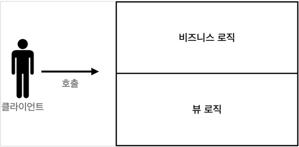
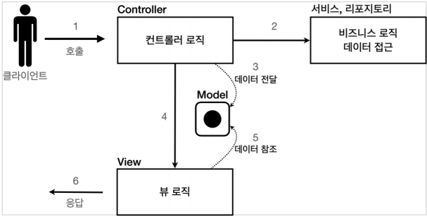

# 서블릿, JSP, MVC 패턴
## 목차
- 회원 관리 웹 애플리케이션 요구사항
- 서블릿으로 회원 관리 웹 애플리케이션 만들기
- JSP로 회원 관리 웹 애플리케이션 만들기
- MVC 패턴 - 개요
- MVC 패턴 - 적용
- MVC 패턴 - 한계
___
## 회원 관리 웹 애플리케이션 요구사항
- <b>회원 정보</b>
    - 이름: `username`
    - 나이: `age`
- <b>기능 요구사항</b>
    - 회원 저장
    - 회원 목록 조회
- <b>회원 도메인 모델</b>
```java
@Getter
@Setter
public class Member {

    private Long id;
    private String username;
    private int age;

    public Member() {
    }

    public Member(String username, int age) {
        this.username = username;
        this.age = age;
    }
}
```
- `id`는 `Member`를 회원 저장소에 저장하면 회원 저장소가 할당한다.<br><br>
- <b>회원 저장소</b>
```java
/**
 * 동시성 문제가 고려되어 있지 않음, 실무에서는 ConcurrentHashMap, AtomicLong 사용 고려
 * */
public class MemberRepository {

    private static Map<Long, Member> store = new HashMap<>();
    private static long sequence = 0L;

    // 싱글톤
    private static final MemberRepository instance = new MemberRepository();
    public static final MemberRepository getInstance(){
        return instance;
    }
    private MemberRepository(){

    }

    public Member save(Member member){
        member.setId(++sequence);
        store.put(member.getId(), member);
        return member;
    }

    public Member findById(Long id){
        return store.get(id);
    }

    public List<Member> findAll(){
        return new ArrayList<>(store.values());
    }

    public void clearStore(){
        store.clear();
    }
}
```
- 회원 저장소는 싱글톤 패턴을 적용했다.
    - 스프링을 사용하면 스프링 빈으로 등록하면 되지만, 지금은 최대한 스프링 없이 순수 서블릿만으로 구현하는 것이 목적이다.
- 싱글톤 패턴은 객체를 단 하나만 생성해서 공유해야하므로, 생성자를 `private` 접근자로 막아둔다.<br><br>
- <b>회원 저장소 테스트 코드</b>
```java
class MemberRepositoryTest {

    MemberRepository memberRepository = MemberRepository.getInstance();

    @AfterEach
    void afterEach(){
        memberRepository.clearStore();
    }

    @Test
    void save(){
        //given
        Member member = new Member("hello", 20);

        //when
        Member savedMember = memberRepository.save(member);

        //then
        Member findMember = memberRepository.findById(savedMember.getId());
        assertThat(findMember).isEqualTo(savedMember);
    }

    @Test
    void findAll(){
        //given
        Member member1 = new Member("member1", 20);
        Member member2 = new Member("member2", 21);

        //when
        memberRepository.save(member1);
        memberRepository.save(member2);

        //then
        List<Member> memberList = memberRepository.findAll();
        assertThat(memberList.size()).isEqualTo(2);
        assertThat(memberList).contains(member1, member2);
    }
}
```
- 회원을 저장하고, 목록을 조회하는 테스트를 작성했다.
    - 각 테스트가 끝날 때, 다음 테스트에 영향을 주지 않도록 각 테스트의 저장소를 `clearStore()`를 호출해서 초기화했다.
___
## 서블릿으로 회원 관리 웹 애플리케이션 만들기
- 이제 본격적으로 서블릿으로 회원 관리 웹 애플리케이션을 만들어보자.
- 가장 먼저 서블릿으로 회원 등록 HTML 폼을 제공해보자.<br><br>
- <b>MemberFormServlet - 회원 등록 폼</b>
```java
@WebServlet(name = "memberFormServlet", urlPatterns = "/servlet/members/new-form")
public class MemberFormServlet extends HttpServlet {

    private final MemberRepository memberRepository = MemberRepository.getInstance();

    @Override
    protected void service(HttpServletRequest request, HttpServletResponse response) throws ServletException, IOException {

        response.setContentType("text/html");
        response.setCharacterEncoding("utf-8");

        PrintWriter writer = response.getWriter();
        writer.write("<!DOCTYPE html>\n" +
                "<html>\n" +
                "<head>\n" +
                "   <meta charset=\"UTF-8\">\n" +
                "   <title>Title</title>\n" +
                "</head>\n" +
                "<body>\n" +
                "<form action=\"/servlet/members/save\" method=\"post\">\n" +
                "   username:   <input type=\"text\" name=\"username\" />\n" +
                "   age:        <input type=\"text\" name=\"age\" />\n" +
                "   <button type=\"submit\">전송</button>\n" +
                "</form>\n" +
                "</body>\n" +
                "</html>\n");
    }
}
```
- `MemberFormSerlet`은 단순하게 회원 정보를 입력할 수 있는 HTML Form을 만들어서 응답한다.
- 자바 코드로 HTML을 제공해야 하므로, 쉽지 않은 작업이다.<br><br>
- <b>실행</b>
    - http://localhost:8080/servlet/members/new-form
    - HTML Form 데이터를 POST로 전송해도, 전달 받는 서블릿을 아직 만들지 않았다. 그래서 오류가 발생하는 것이 정상이다.
- 이번에는 HTML Form에서 데이터를 입력하고, 전송을 누르면 실제 회원 데이터가 저장되도록 해보자.
- 전송 방식은 POST HTML Form에서 학습한 내용과 같다.<br><br>
- <b>MemberSaveServlet - 회원 저장</b>
```java
@WebServlet(name = "memberSaveServlet", urlPatterns = "/servlet/members/save")
public class MemberSaveServlet extends HttpServlet {

    private final MemberRepository memberRepository = MemberRepository.getInstance();

    @Override
    protected void service(HttpServletRequest request, HttpServletResponse response) throws ServletException, IOException {
        System.out.println("MemberSaveServlet.service");
        String username = request.getParameter("username");
        int age = Integer.parseInt(request.getParameter("age"));

        Member member = new Member(username, age);
        memberRepository.save(member);

        response.setContentType("text/html");
        response.setCharacterEncoding("utf-8");
        PrintWriter writer = response.getWriter();
        writer.write("<html>\n" +
                "<head>\n" +
                "   <meta charset=\"UTF-8\">\n" +
                "</head>\n" +
                "<body>\n" +
                "성공\n" +
                "<ul>\n" +
                "   <li>id="+member.getId()+"</li>\n" +
                "   <li>username="+member.getUsername()+"</li>\n" +
                "   <li>age="+member.getAge()+"</li>\n" +
                "</ul>\n" +
                "<a href=\"/index.html\">메인</a>\n" +
                "</body>\n" +
                "</html>");
    }
}
```
- `MemberSaveServlet`은 다음 순서로 동작한다.
    1. 파라미터를 조회해서 Member 객체를 만든다.
    2. Member 객체를 MemberRepository를 통해 저장한다.
    3. Member 객체를 사용해 결과 화면용 HTML을 동적으로 만들어 응답한다.
- <b>실행</b>
    - http://localhost:8080/servlet/members/new-form
    - 데이터가 전송되고, 저장 결과를 확인할 수 있다.
- 이번에는 저장된 모든 회원 목록을 조회하는 기능을 만들어보자.<br><br>
- <b>MemberListServlet - 회원 목록</b>
```java
@WebServlet(name = "memberListServlet", urlPatterns = "/servlet/members")
public class MemberListServlet extends HttpServlet {

    private final MemberRepository memberRepository = MemberRepository.getInstance();

    @Override
    protected void service(HttpServletRequest request, HttpServletResponse response) throws ServletException, IOException {

        List<Member> members = memberRepository.findAll();

        response.setContentType("text/html");
        response.setCharacterEncoding("utf-8");

        PrintWriter w = response.getWriter();
        w.write("<html>");
        w.write("<head>");
        w.write("   <meta charset=\"UTF-8\">");
        w.write("   <title>Title</title>");
        w.write("</head>");
        w.write("<body>");
        w.write("<a href=\"/index.html\">메인</a>");
        w.write("<table>");
        w.write("   <thead>");
        w.write("   <th>id</th>");
        w.write("   <th>username</th>");
        w.write("   <th>age</th>");
        w.write("   </thead>");
        w.write("   <tbody>");
        for (Member member : members) {
            w.write("   <tr>");
            w.write("   <td>" + member.getId() + "</td>");
            w.write("   <td>" + member.getUsername() + "</td>");
            w.write("   <td>" + member.getAge() + "</td>");
            w.write("   </tr>");
        }
        w.write("   </tbody>");
        w.write("</table>"); w.write("</body>");
        w.write("</html>");
    }
}
```
- `MemberListServlet`은 다음 순서로 동작한다.
    1. `memberRepository.findAll()`을 통해 모든 회원을 조회한다.
    2. 회원 목록 HTML을 for 루프를 통해 회원 수만큼 동적으로 생성하여 응답한다.
- <b>실행</b>
    - http://localhost:8080/servlet/members
    - 저장된 회원 목록을 확인할 수 있다.
- <b>템플릿 엔진으로</b>
    - 지금까지 서블릿과 자바 코드로만 HTML을 만들어 보았다.
    - 서블릿 덕분에 동적으로 원하는 HTML을 마음껏 만들 수 있다.
    - 정적인 HTML 문서라면, 화면이 계속 달라지는 회원의 저장 결과라던가, 회원 목록같은 동적인 HTML을 만드는 일은 불가능 할 것이다.<br><br>
    - 그런데, 코드에서 보듯이 이것은 매우 복잡하고 비효율적이다.
        - 자바 코드로 HTML을 만들어 내는 것보다, 차라리 HTML 문서에 동적으로 변경해야 하는 부분만 자바 코드를 넣을 수 있다면 더 편리할 것이다.
    - 이것이 바로 템플릿 엔진이 나온 이유이다.
        - 템플릿 엔진을 사용하면 HTML 문서에서 필요한 곳만 자바 코드를 적용해서 동적으로 변경할 수 있다.
        - 템플릿 엔진에는 JSP, Thymeleaf, Freemarker, Velocity 등이 있다.
> <b>참고</b>
> - JSP는 성능과 기능면에서 다른 템플릿 엔진과의 경쟁에서 밀리면서, 점점 사장되어 가는 추세이다.
> - 템플릿 엔진들은 각각 장단점이 있는데, 여기서는 JSP는 앞부분에서만 잠깐 다루고, 스프링과 잘 통합되는 Thymeleaf를 사용할 것이다.
### Welcome 페이지 변경
- 지금부터 서블릿에서 JSP, MVC 패턴, 직접 만드는 MVC 프레임워크, 그리고 스프링까지 긴 여정을 함께할 것이므로, 편리하게 참고할 수 있도록 welcome 페이지를 변경하자.<br><br>
- `main/webapp/index.html`
```html
<!DOCTYPE html>
<html lang="en">
<head>
    <meta charset="UTF-8">
    <title>Title</title>
</head>
<body>
<ul>
    <li><a href="basic.html">서블릿 basic</a></li>
    <li>서블릿
        <ul>
            <li><a href="/servlet/members/new-form">회원가입</a></li>
            <li><a href="/servlet/members">회원목록</a></li>
        </ul>
    </li>
    <li>JSP
        <ul>
            <li><a href="/jsp/members/new-form.jsp">회원가입</a></li>
            <li><a href="/jsp/members.jsp">회원목록</a></li>
        </ul>
    </li>
    <li>서블릿 MVC
        <ul>
            <li><a href="/servlet-mvc/members/new-form">회원가입</a></li>
            <li><a href="/servlet-mvc/members">회원목록</a></li>
        </ul>
    </li>
    <li>FrontController - v1
        <ul>
            <li><a href="/front-controller/v1/members/new-form">회원가입</a></li>
            <li><a href="/front-controller/v1/members">회원목록</a></li>
        </ul>
    </li>
    <li>FrontController - v2
        <ul>
            <li><a href="/front-controller/v2/members/new-form">회원가입</a></li>
            <li><a href="/front-controller/v2/members">회원목록</a></li>
        </ul>
    </li>
    <li>FrontController - v3
        <ul> <li><a href="/front-controller/v3/members/new-form">회원가입</a></li>
            <li><a href="/front-controller/v3/members">회원목록</a></li>
        </ul>
    </li>
    <li>FrontController - v4
        <ul>
            <li><a href="/front-controller/v4/members/new-form">회원가입</a></li>
            <li><a href="/front-controller/v4/members">회원목록</a></li>
        </ul>
    </li>
    <li>FrontController - v5 - v3
        <ul>
            <li><a href="/front-controller/v5/v3/members/new-form">회원가입</a></
            li>
            <li><a href="/front-controller/v5/v3/members">회원목록</a></li>
        </ul>
    </li>
    <li>FrontController - v5 - v4
        <ul>
            <li><a href="/front-controller/v5/v4/members/new-form">회원가입</a></
            li>
            <li><a href="/front-controller/v5/v4/members">회원목록</a></li>
        </ul>
    </li>
    <li>SpringMVC - v1
        <ul>
            <li><a href="/springmvc/v1/members/new-form">회원가입</a></li>
            <li><a href="/springmvc/v1/members">회원목록</a></li>
        </ul>
    </li>
    <li>SpringMVC - v2
        <ul>
            <li><a href="/springmvc/v2/members/new-form">회원가입</a></li>
            <li><a href="/springmvc/v2/members">회원목록</a></li>
        </ul>
    </li>
    <li>SpringMVC - v3
        <ul>
            <li><a href="/springmvc/v3/members/new-form">회원가입</a></li> <li><a href="/springmvc/v3/members">회원목록</a></li>
        </ul>
    </li>
</ul>
</body>
</html>
```
___
## JSP로 회원 관리 웹 애플리케이션 만들기
- <b>JSP 라이브러리 추가</b>
    - JSP를 사용하려면 먼저 다음 라이브러리를 추가해야 한다.
- `build.gradle`에 추가
```gradle
//JSP 추가 시작
implementation 'org.apache.tomcat.embed:tomcat-embed-jasper'
implementation 'javax.servlet:jstl'
//JSP 추가 끝
```
- <b>회원 등록 폼 JSP</b>
- `main/webapp/jsp/members/new-form.jsp`
```jsp
<%@ page contentType="text/html;charset=UTF-8" language="java" %>
<html>
<head>
    <title>Title</title>
</head>
<body>
<form action="/jsp/members/save.jsp" method="post">
    username: <input type="text" name="username" />
    age: <input type="text" name="age" />
    <button type="submit">전송</button>
</form>
</body>
</html>
```
- `<%@ page contentType="text/html;charset=UTF-8" language="java"%>`
    - 첫 줄은 JSP문서라는 뜻이다.
    - JSP 문서는 이렇게 시작해야 한다.
- 회원 등록 폼 JSP를 보면, 첫 줄을 제외하고는 완전히 HTML과 똑같다.
- JSP는 서버 내부에서 서블릿으로 변환되는데, 이전에 만든 MemberFormServlet과 거의 비슷한 모습으로 변환된다.<br><br>
- <b>실행</b>
    - htpp://localhost:8080/jsp/members/new-form.jsp
    - 실행 시 `.jsp`까지 함께 적어주어야 한다.
- <b>회원 저장 JSP</b>
- `main/webapp/jsp/members/save.jsp`
```jsp
<%@ page import="hello.servlet.domain.member.Member" %>
<%@ page import="hello.servlet.domain.member.MemberRepository" %>
<%@ page contentType="text/html;charset=UTF-8" language="java" %>
<%
    // request, response 사용 가능 (자동으로 서블릿으로 변환)
    MemberRepository memberRepository = MemberRepository.getInstance();

    System.out.println("MemberSaveServlet.service");
    String username = request.getParameter("username");
    int age = Integer.parseInt(request.getParameter("age"));

    Member member = new Member(username, age);
    memberRepository.save(member);
%>
<html>
<head>
    <title>Title</title>
</head>
<body>
성공
<ul>
    <li>id=<%=member.getId()%></li>
    <li>username=<%=member.getUsername()%></li>
    <li>age=<%=member.getAge()%></li>
</ul>
<a href="/index.html">메인</a>
</body>
</html>
```
- JSP는 자바 코드를 그대로 다 사용할 수 있다.
- `<%@ page import="hello.servlet.domain.member.MemberRepository" %>`
    - 자바의 import문과 같다.
- `<% ~~ %>`
    - 이 부분에는 자바 코드를 입력할 수 있다.
- `<%= ~~ %>`
    - 이 부분에는 자바 코드를 출력할 수 있다.
- 회원 저장 JSP를 보면, 회원 저장 서블릿 코드와 같다.
- 다른 점이 있다면, HTML을 중심으로 하고, 자바 코드를 부분부분 입력해주었다. `<% ~ %>`를 사용하여 HTML 중간에 자바 코드를 출력하고 있다.<br><br>
- <b>회원 목록 JSP</b>
- `main/webapp/jsp/members.jsp`
```jsp
<%@ page contentType="text/html;charset=UTF-8" language="java" %>
<%@ page import="hello.servlet.domain.member.MemberRepository" %>
<%@ page import="hello.servlet.domain.member.Member" %>
<%@ page import="java.util.List" %>
<%
    MemberRepository memberRepository = MemberRepository.getInstance();
    List<Member> members = memberRepository.findAll();
%>
<html>
<head>
    <title>Title</title>
</head>
<body>
<a href="/index.html">메인</a>
<table>
    <thead>
    <th>id</th>
    <th>username</th>
    <th>age</th>
    </thead>
    <tbody>
    <%
        for (Member member : members) {
            out.write(" <tr>");
            out.write("     <td>" + member.getId() + "</td>");
            out.write("     <td>" + member.getUsername() + "</td>");
            out.write("     <td>" + member.getAge() + "</td>");
            out.write(" </tr>");
        }
    %>
    </tbody>
</table>
</body>
</html>
```
- 회원 리포지토리를 먼저 조회하고, 결과 List를 사용해서 중간에 `<tr><td>` HTML 태그를 반복하여 출력하고 있다.
### 서블릿과 JSP의 한계
- 서블릿으로 개발할 때는 뷰(View) 화면을 위한 HTML을 만드는 작업이 자바 코드에 섞여서 지저분하고 복잡했다.
- JSP를 사용한 덕분에 뷰를 생성하는 HTML 작업을 깔끔하게 가져가고, 중간중간 동적으로 변경이 필요한 부분에만 자바 코드를 적용했다.
    - 그런데 이렇게 해도 해결되지 않는 몇 가지 고민이 남는다.
- 회원 저장 JSP를 보자. 코드의 상위 절반은 회원을 저장하기 위한 비즈니스 로직이고, 나머지 하위 절반만 결과를 HTML으로 보여주기 위한 뷰 영역이다. 회원 목록의 경우에도 마찬가지다.
- 코드를 잘 보면, Java 코드, 데이터를 조회하는 리포지토리 등 다양한 코드가 모두 JSP에 노출되어 있다.
    - JSP가 너무 많은 역할을 한다.
    - 이렇게 작은 프로젝트도 벌써 머리가 아파오는데, 수백 수천줄이 넘어가는 JSP를 떠올려보면 정말 지옥과 같을 것이다.
- <b>MVC 패턴의 등장</b>
    - 비즈니스 로직은 서블릿처럼 다른 곳에서 처리하고, JSP는 목적에 맞게 HTML으로 화면(View)을 그리는 일에 집중하도록 하자.
    - 과거 개발자들도 모두 비슷한 고민이 있었고, 그래서 MVC 패턴이 등장했다.
    - 이번에 직접 MVC 패턴을 적용해서 프로젝트를 리펙터링 해보자.
___
## MVC 패턴 - 개요
- <b>너무 많은 역할</b>
    - 하나의 서블릿이나 JSP만으로 비즈니스 로직과 뷰 렌더링까지 모두 처리하게 되면, 너무 많은 역할을 하게 되고, 결과적으로 유지보수가 어려워진다.
    - 비즈니스 로직을 호출하는 부분에 변경이 발생해도, 해당 코드에 손대야 하고, UI를 변경할 일이 있어도 비즈니스 로직이 함께 있는 해당 파일을 수정해야 한다.
    - HTML 코드 하나 수정해야 하는데, 수백줄의 자바 코드가 함께 있거나, 또는 비즈니스 로직을 하나 수정해야 하는데 수백 수천줄의 HTML 코드가 함께 있는 상황을 상상해보자...
- <b>변경의 라이프 사이클</b>
    - 사실 이게 정말 중요한데, 진짜 문제는 둘 사이에 변경의 라이프 사이클이 다르다는 점이다.
    - 예를 들어 UI를 일부 수정하는 일과, 비즈니스 로직을 수정하는 일은 각각 다르게 발생할 가능성이 매우 높고, 대부분 서로에게 영향을 주지 않는다.
    - 이렇게 변경의 라이프 사이클이 다른 부분을 하나의 코드로 관리하는 것은 유지보수하기 좋지 않다.
        - 물론 UI가 많이 변하면, 함께 변경될 가능성도 있다.
- <b>기능 특화</b>
    - 특히 JSP같은 뷰 템플릿은 화면을 렌더링하는데 최적화되어 있기 때문에, 이 부분의 업무만 담당하는 것이 가장 효과적이다.
- <b>Model View Controller</b>
    - MVC 패턴은 지금까지 학습한 것처럼 하나의 서블릿이나, JSP로 처리하던 것을 컨트롤러(Controller)와 뷰(View)라는 영역으로 서로 역할을 나눈 것을 의미한다.
        - 웹 애플리케이션은 보통 이 MVC 패턴을 사용한다.
- <b>컨트롤러</b>
    - HTTP 요청을 받아 파라미터를 검증하고, 비즈니스 로직을 실행한다. 그리고 뷰에 전달할 결과 데이터를 조회하여 모델에 담는다.
- <b>모델</b>
    - 뷰에 출력할 데이터를 담아둔다. 뷰가 필요한 데이터를 모두 모델에 담아 전달해주는 덕분에, 뷰는 비즈니스 로직이나 데이터 접근을 몰라도 되고, 화면을 렌더링하는 일에 집중할 수 있다.
- <b>뷰</b>
    - 모델에 담겨있는 데이터를 사용해서 화면을 그리는 일에 집중한다. 여기서는 HTML을 생성하는 부분을 말한다.
> <b>참고</b>
> - 컨트롤러에 비즈니스 로직을 둘 수도 있지만, 이렇게 되면 컨트롤러가 너무 많은 역할을 담당한다.
> - 그래서 일반적으로 비즈니스 로직은 서비스(Service)라는 계층을 별도로 만들어서 처리한다.
> - 그리고 컨트롤러는 비즈니스 로직이 있는 서비스를 호출하는 역할을 담당한다.
> - 참고로 비즈니스 로직을 변경하면, 비즈니스 로직을 호출하는 컨트롤러의 코드도 변경될 수 있다.
> - 앞에서는 이해를 돕기 위해 비즈니스 로직을 호출한다는 표현 보다는, 비즈니스 로직이라 설명했다.
- <b>MVC 패턴 이전</b><br>
<br><br>
- <b>MVC 패턴1</b><br>
<br><br>
- <b>MVC 패턴2</b><br>

___
## MVC 패턴 - 적용
- 서블릿을 컨트롤러로 사용하고, JSP를 뷰로 사용해서 MVC 패턴을 적용해보자.
- Model은 HttpServletRequest 객체를 사용한다. request는 내부에 데이터 저장소를 가지고 있는데, `request.setAttribute()`, `request.getAttribute()`를 사용하면 데이터를 보관하고, 조회할 수 있다.
### 회원 등록
- <b>회원 등록 폼 - 컨트롤러</b>
- `hello.servlet.web.servletmvc.MvcMemberFormServlet`
```java
@WebServlet(name = "mvcMemberFormServlet", urlPatterns = "/servlet-mvc/members/new-form")
public class MvcMemberFormServlet extends HttpServlet {

    @Override
    protected void service(HttpServletRequest request, HttpServletResponse response) throws ServletException, IOException {
        String viewPath = "/WEB-INF/views/new-form.jsp";
        RequestDispatcher dispatcher = request.getRequestDispatcher(viewPath);
        dispatcher.forward(request, response);
    }
}
```
- `dispatcher.forward()`: 다른 서블릿이나 JSP로 이동할 수 있는 기능이다. 서버 내부에서 다시 호출이 발생한다.
> `/WEB-INF`
> - 이 경로안에 JSP가 있으면 외부에서 직접 JSP를 호출할 수 없다. 우리가 기대하는 것은 항상 컨트롤러를 통해 JSP를 호출하는 것이다.

> <b>redirect vs forward</b>
> - 리다이렉트는 실제 클라이언트(웹 브라우저)에 응답이 나갔다가, 클라이언트가 redirect 경로로 다시 요청한다. 따라서 클라이언트가 인지할 수 있고, URL 경로도 실제로 변경된다.
> - 반면 포워드는 서버 내부에서 일어나는 호출이기 때문에 클라이언트가 전혀 인지하지 못한다.
- <b>회원 등록 폼 - 뷰</b>
- `main/webapp/WEB-INF/views/new-form.jsp`
```jsp
<%@ page contentType="text/html;charset=UTF-8" language="java" %>
<html>
<head>
    <title>Title</title>
</head>
<body>
<!-- 상대경로 사용, [현재 URL이 속한 계층 경로 + /save] -->
<form action="save" method="post">
    username: <input type="text" name="username" />
    age: <input type="text" name="age" />
    <button type="submit">전송</button>
</form>
</body>
</html>
```
- 여기서 form의 action을 보면 절대 경로(로 시작)이 아니라, 상대경로(로 시작X)하는 것을 확인할 수 있다.
- 이렇게 상대경로를 사용하면, 폼 전송 시 현재 URL이속한 계층 경로 + save가 호출된다.
- 현재 계층 경로: `/servlet-mvc/members`
- 결과: `/servlet-mvc/members/save`<br><br>
- <b>실행</b>
    - http://localhost:8080/servlet-mvc/members/new-form
    - HTML Form이 잘 나오는 것을 확인할 수 있다.
> <b>주의!</b>
> - 이후코드에서 해당 jsp를 계속 사용하기 때문에 상대경로를 사용한 부분을 그대로 유지해야 한다.
### 회원 저장
- <b>회원 저장 - 컨트롤러</b>
- <B>MvcMemberSaveServlet</B>
```java
@WebServlet(name = "mvcMemberSaveServlet", urlPatterns = "/servlet-mvc/members/save")
public class MvcMemberSaveServlet extends HttpServlet {

    private final MemberRepository memberRepository = MemberRepository.getInstance();

    @Override
    protected void service(HttpServletRequest request, HttpServletResponse response) throws ServletException, IOException {

        String username = request.getParameter("username");
        int age = Integer.parseInt(request.getParameter("age"));

        Member member = new Member(username, age);
        System.out.println("member = " + member);
        memberRepository.save(member);

        //Model에 데이터를 보관한다.
        request.setAttribute("member", member);

        String viewPath = "/WEB-INF/views/save-result.jsp";
        RequestDispatcher dispatcher = request.getRequestDispatcher(viewPath);
        dispatcher.forward(request, response);
    }
}
```
- HttpServletRequest를 Model로 사용한다.
- request가 제공하는 `setAttribute()`를 사용하면, request 객체에 데이터를 보관하여 뷰에 전달할 수 있다.
- 뷰는 `request.getAttribute()`를 사용해서 데이터를 꺼내면 된다.<br><br>
- <b>회원 저장 - 뷰</b>
- `main/webapp/WEB-INF/views/save-result.jsp`
```jsp
<%@ page contentType="text/html;charset=UTF-8" language="java" %>
<html>
<head>
    <meta charset="UTF-8">
</head>
<body>
성공
<ul>
    <li>id=${member.id}</li>
    <li>username=${member.username}</li>
    <li>age=${member.age}</li>
</ul>
<a href="/index.html">메인</a>
</body>
</html>
```
- `<%= request.getAttribute("member")%>`으로 모델에 저장한 member 객체를 꺼낼 수 있지만, 너무 복잡하다.
- JSP는 `${}` 문법을 제공하는데, 이 문법을 사용하면 request의 attribute에 담긴 데이터를 편리하게 조회할 수 있다.<br><br>
- <b>실행</b>
    - http://localhost:8080/servlet-mvc/members/new-form
    - HTML Form에 데이터를 입력하고, 전송을 누르면 저장 결과를 확인할 수 있다.
- MVC 덕분에 컨트롤러 로직과 뷰 로직을 확실하게 분리한 것을 확인할 수 있다. 향후 화면에 수정이 발생하면 뷰 로직만 변경하면 된다.
### 회원 목록 조회
- <b>회원 목록 조회 - 컨트롤러</b>
- <b>MvcMemberListServlet</b>
```java
@WebServlet(name = "mvcMemberListServlet", urlPatterns = "/servlet-mvc/members")
public class MvcMemberListServlet extends HttpServlet {

    private final MemberRepository memberRepository = MemberRepository.getInstance();

    @Override
    protected void service(HttpServletRequest request, HttpServletResponse response) throws ServletException, IOException {

        List<Member> members = memberRepository.findAll();

        request.setAttribute("members", members);

        String viewPath = "/WEB-INF/views/members.jsp";
        RequestDispatcher dispatcher = request.getRequestDispatcher(viewPath);
        dispatcher.forward(request, response);
    }
}
```
- requset 객체를 사용해서 `List<Member> members`를 모델에 보관했다.<br><br>
- <b>회원 목록 조회 - 뷰</b>
- `main/webapp/WEB-INF/views/members.jsp`
```jsp
<%@ page contentType="text/html;charset=UTF-8" language="java" %>
<%@ taglib prefix="c" uri="http://java.sun.com/jsp/jstl/core"%>
<html>
<head>
    <title>Title</title>
</head>
<body>
<a href="/index.html">메인</a>
<table>
    <thead>
    <th>id</th>
    <th>username</th>
    <th>age</th>
    </thead>
    <tbody>
    <c:forEach var="item" items="${members}">
        <tr>
            <td>${item.id}</td>
            <td>${item.username}</td>
            <td>${item.age}</td>
        </tr>
    </c:forEach>
    </tbody>
</table>
</body>
</html>
```
- 모델에 담아둔 members를 JSP가 제공하는 taglib 기능을 사용하여 반복하면서 출력했다.
- `members` 리스트에서 `member`를 순서대로 꺼내서 `item` 변수에 담고, 출력하는 과정을 반복한다.<br><br>
- `<c:forEach>` 이 기능을 사용하려면, 다음과 같이 선언해야 한다.
    - `<%@ taglib prefix="c" uri="http://java.sun.com/jsp/jstl/core"%>`
- 해당 기능을 사용하지 않고, 다음과 같이 출력해도 되지만, 너무 지저분하지 않은가?
```jsp
<%
    for (Member member : members) {
        out.write(" <tr>");
        out.write("     <td>" + member.getId() + "</td>");
        out.write("     <td>" + member.getUsername() + "</td>");
        out.write("     <td>" + member.getAge() + "</td>");
        out.write(" </tr>");
    }
%>
```
- JSP와 같은 뷰 템플릿들은 이렇게 화면을 렌더링하는데 특화된 다양한 기능을 제공한다.<br><br>
- <b>실행</b>
    - http://localhost:8080/servlet-mvc/members
    - 저장된 결과 목록을 확인할 수 있다.
> <b>참고</b>
> - 앞서 설명했듯이 JSP를 학습하는 것이 주 목적이 아니다. JSP가 궁금하다면, 이미 수많은 자료들이 나와있으므로 검색이나 책을 통해 참고하자. (반나절이면 대부분의 기능을 학습할 수 있다고 한다.)
___
## MVC 패턴 - 한계
- MVC 패턴을 적용한 덕분에 컨트롤러의 역할과 뷰를 렌더링하는 역할을 명확하게 구분할 수 있다.
- 특히 뷰는 화면을 그리는 역할에 충실한 덕분에, 코드가 깔끔하고 직관적이다. 단순하게 모델에서 필요한 데이터를 꺼내고, 화면을 만들면 된다.
- 그런데 컨트롤러는 딱 봐도 중복이 많고, 필요하지 않은 코드들도 많이 보인다.
### MVC 컨트롤러의 단점
- <b>포워드 중복</b>
    - View로 이동하는 코드가 항상 중복 호출되어야 한다. 물론 이 부분을 메소드로 공통화해도 되지만, 해당 메소드도 항상 직접 호출해야 한다.
    ```java
    RequestDispatcher dispatcher = request.getRequestDispatcher(viewPath);
    dispatcher.forward(request, response);
    ```
- <b>ViewPath에 중복</b>
    ```java
    String viewPath = "/WEB-INF/views/new-form.jsp";
    ```
    - prefix: `/WEB-INF/views/`
    - suffix: `.jsp`
    - 그리고 만약, jsp가 아닌 thymeleaf같은 다른 뷰로 변경한다면, 전체 코드를 모두 변경해야 한다.
- <b>사용하지 않는 코드</b>
    - 다음 코드를 사용할 때도 있고, 사용하지 않을 때도 있따. 특히 response는 현재 코드에서 사용되지 않았다.
    ```java
    HttpServletRequest request, HttpServletResponse response
    ```
    - 그리고 이런 `HttpServletRequest`, `HttpServletResponse`를 사용하는 코드는 테스트 케이스를 작성하기도 어렵다.
- <b>공통 처리가 어렵다.</b>
    - 기능이 복잡해질수록 컨트롤러에서 공통으로 처리해야하는 부분이 점점 더 많이 증가할 것이다.
    - 단순히 공통기능을 메소드로 뽑으면 될 것 같지만, 결과적으로 해당 메소드를 항상 호출해야 하고, 실수로 호출하지 않으면문제가 될 것이다. 더하여 호출하는 것 자체도 중복이다.
- <b>정리하면 공통 처리가 어렵다는 문제가 있다.</b>
    - 이 문제를 해결하려면 컨트롤러 호출 전에 먼저 공통 기능을 처리해야 한다.
    - 소위 <b>수문장 역할</b>을 하는 기능이 필요하다.
    - <b>프론트 컨트롤러(Front Controller) 패턴</b>을 도입하면 이런 문제를 깔끔하게 해결할 수 있다. (입구를 하나로!)
    - 스프링 MVC의 핵심도 바로 이 프론트 컨트롤러에 있다.
