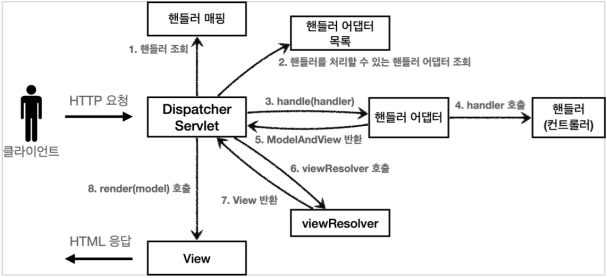

# 스프링 MVC - 구조 이해
## 목차
- 스프링 MVC 전체 구조
- 핸들러 매핑과 핸들러 어댑터
- 뷰 리졸버
- 스프링 MVC - 시작하기
- 스프링 MVC - 컨트롤러 통합
- 스프링 MVC - 실용적인 방식
___
## 스프링 MVC 전체 구조
- 직접 만든 MVC 프레임워크와 스프링 MVC를 비교해보자.<br><br>
- <b>직접 만든 MVC 프레임워크 구조</b><br>
<br><br>
- <b>SpringMVC 구조</b><br>
<br><Br>
- <B>직접 만든 프레임워크 -> 스프링 MVC 비교</B>
    - FrontController -> DispatcherServlet
    - handlerMappingMap -> HandlerMapping
    - MyHandlerAdapter -> HandlerAdapter
    - ModelView -> ModelAndView
    - viewResolver -> ViewResolver
    - MyView -> View
### DispatcherServlet 구조 살펴보기
- `org.springframework.web.servlet.DispatcherServlet`
- 스프링 MVC도 프론트 컨트롤러 패턴으로 구현되어있다.
- 스프링 MVC의 프론트 컨트롤러가 바로 디스패처 서블릿(DispatcherServlet)이다.
- 그리고 이 디스패처 서블릿이 바로 스프링 MVC의 핵심이다.<br><br>
- <b>DispatcherServlet 서블릿 등록</b>
    - `DispatcherServlet`도 부모 클래스에서 `HttpServlet`을 상속 받아 사용하고, 서블릿으로 동작한다.
        - DispatcherServlet -> FrameworkServlet -> HttpServletBean -> HttpServlet
    - 스프링 부트는 `DispatcherServlet`을 서블릿으로 자동으로 등록하면서 <b>모든 경로</b>(`urlPatterns="/"`)에 대해서 매핑한다.
        > 참고: 더 자세한 경로가 우선순위가 높다. 그래서 기존에 등록한 서블릿도 함께 동작한다.
- <b>요청 흐름</b>
    - 서블릿이 호출되면 `HttpServlet`이 제공하는 `service()`가 호출된다.
    - 스프링 MVC는 `DispatcherServlet`의 부모인 `FrameworkServlet`에서 `service()`를 오버라이드 해두었다.
    - `FrameworkServlet.service()`를 시작으로 여러 메소드가 호출되면서, `DispatcherServlet.doDispatch()`가 호출된다.
- 지금부터 `DispatcherServlet`의 핵심인 `doDispatch()` 코드를 분석해보자.
    - 최대한 간단히 살펴보기 위해 예외처리, 인터셉터 기능은 제외함.
- `DispatcherServlet.doDispatch()`
    ```java
    protected void doDispatch(HttpServletRequest request, HttpServletResponse response) throws Exception {
        HttpServletRequest processedRequest = request;
        HandlerExecutionChain mappedHandler = null;
        ModelAndView mv = null;
        // 1. 핸들러 조회
        mappedHandler = getHandler(processedRequest);
        if (mappedHandler == null) {
            noHandlerFound(processedRequest, response);
            return;
        }
        // 2. 핸들러 어댑터 조회 - 핸들러를 처리할 수 있는 어댑터
        HandlerAdapter ha = getHandlerAdapter(mappedHandler.getHandler());
        // 3. 핸들러 어댑터 실행 -> 4. 핸들러 어댑터를 통해 핸들러 실행 -> 5. ModelAndView 반환
        mv = ha.handle(processedRequest, response, mappedHandler.getHandler());
        processDispatchResult(processedRequest, response, mappedHandler, mv,
                dispatchException);
    }

    private void processDispatchResult(HttpServletRequest request, HttpServletResponse response, HandlerExecutionChain mappedHandler, ModelAndView mv, Exception exception) throws Exception {
        // 뷰 렌더링 호출
        render(mv, request, response);
    }

    protected void render(ModelAndView mv, HttpServletRequest request, HttpServletResponse response) throws Exception {
        View view;
        String viewName = mv.getViewName();
        // 6. 뷰 리졸버를 통해서 뷰 찾기, 7. View 반환
        view = resolveViewName(viewName, mv.getModelInternal(), locale, request);
        // 8. 뷰 렌더링
        view.render(mv.getModelInternal(), request, response);
    }
    ```
- <b>SpringMVC 구조</b><br>
<br><br>
- <b>동작 순서</b>
    1. <b>핸들러 조회:</b> 핸들러 매핑을 통해 요청 URL에 매핑된 핸들러(컨트롤러)를 조회한다.
    2. <b>핸들러 어댑터 조회:</b> 핸들러를 실행할 수 있는 핸들러 어댑터를 조회한다.
    3. <b>핸들러 어댑터 실행:</b> 핸들러 어댑터를 실행한다.
    4. <b>핸들러 실행:</b> 핸들러 어댑터가 실제 핸들러를 실행한다.
    5. <b>ModelAndView 반환:</b> 핸들러 어댑터는 핸들러가 반환하는 정보를 ModelAndView로 <b>변환</b>해서 반환한다.
    6. <b>viewResolver 호출:</b> 뷰 리졸버가 찾고 실행한다.
        - JSP의 경우: `InternalResourceViewResolver`가 자동 등록되고, 사용된다.
    7. <b>View 반환:</b> 뷰 리졸버는 뷰의 논리 이름을 물리 이름으로 바꾸고, 렌더링 역할을 담당하는 뷰 객체를 반환한다.
        - JSP의 경우: `InternalResourceView(JstlView)`를 반환하는데, 내부에 `forward()`로직이 있다.
    8. <b>뷰 렌더링:</b> 뷰를 통해서 뷰를 렌더링한다.
- <b>인터페이스 살펴보기</b>
    - 스프링 MVC의 큰 강점은 `DispatcherServlet` 코드의 변경 없이, 원하는 기능을 변경하거나 확장할 수 있다는 점이다. 지금까지 정리한 대부분을 확장 가능할 수 있게 인터페이스로 제공한다.
    - 이 인터페이스들만 구현해서 `DispatcherServlet`에 등록하면 나만의 컨트롤러를 만들 수도 있다.
- <b>주요 인터페이스 목록</b>
    - 핸들러 매핑: `org.springframework.web.servlet.HandlerMapping`
    - 핸들러 어댑터: `org.springframework.web.servlet.HandlerAdapter`
    - 뷰 리졸버: `org.springframework.web.servlet.ViewResolver`
    - 뷰: `org.springframework.web.servlet.View`
- <b>정리</b>
    - 스프링 MVC는 코드 분량도 매우 많고, 복잡해서 내부 구조를 다 파악하는 것은 쉽지 않다.
    - 사실 해당 기능을 직접 확장하거나 나만의 컨트롤러를 만드는 일은 없으므로 걱정하지 말자.
        - 스프링 MVC는 전세계의 수 많은 개발자들의 요구사항에 맞추어 기능을 계속 확장해왔기 때문에, 웹 애플리케이션을 만들 때 필요한 대부분의 기능이 이미 다 구현되어 있다.
    - 그래도 이렇게 핵심 동작방식을 알아두어야 향후 문제가 발생했을 때, 어떤 부분에서 문제가 발생했는지 쉽게 파악하고, 문제를 해결할 수 있다.
    - 그리고 확장 포인트가 필요할 때, 어떤 부분을 확장해야 할지 감을 잡을 수도 있다.
    - 실제 다른 컴포넌트를 제공하거나, 기능을 확장하는 부분들은 이후에 조금씩 정리할 것이다.
    - 지금은 전체적인 구조가 이렇게 되어있다는 것만 이해하자.
___
## 핸들러 매핑과 핸들러 어댑터
- 핸들러 매핑과 핸들러 어댑터가 어떤 것들이 어떻게 사용되는지 알아보자.
- 지금은 전혀 사용하지 않지만, 과거에 주로 사용했던 스프링이 제공하는 간단한 컨트롤러로 핸들러 매핑과 어댑터를 이해해보자.
### Controller 인터페이스
- <b>과거 버전 스프링 컨트롤러</b>
- `org.springframework.web.servlet.mvc.Controller`
```java
public interface Controller {
    ModelAndView handleRequest(HttpServletRequest request, HttpServletResponse response) throws Exception;
}
```
- 스프링도 처음에는 이런 딱딱한 형식의 컨트롤러를 제공했다.
> <b>참고</b>
> - `Controller` 인터페이스는 `@Controller` 애노테이션과는 전혀 다르다
- 간단하게 구현해보자.<br><Br>
- <b>OldController</b>
```java
@Component("/springmvc/old-controller")
public class OldController implements Controller {
    @Override
    public ModelAndView handleRequest(HttpServletRequest request, HttpServletResponse response) throws Exception {
        System.out.println("OldController.handleRequest");
        return null;
    }
}
```
- `@Component`: 이 컨트롤러는 `/springmvc/old-controller`라는 이름의 스프링 빈으로 등록되었다.
- <b>빈의 이름으로 URL을 매핑</b>할 것이다.<br><Br>
- <B>실행</B>
    - http://localhost:8080/springmvc/old-controller
    - 콘솔에 `OldController.handleRequest`이 출력되면 성공이다.
- <b>이 컨트롤러는 어떻게 호출될 수 있을까?</b>
    - <b>스프링 MVC 구조</b><br>
    <br><br>
    - 이 컨트롤러가 호출되려면 다음 2가지가 필요하다.
        - <b>HandlerMapping(핸들러 매핑)</b>
            - 핸들러 매핑에서 이 컨트롤러를 찾을 수 있어야 한다.
                > ex) <b>스프링 빈의 이름으로 핸들러를 찾을 수 있는 핸들러 매핑</b>이 필요하다.
        - <b>HandlerAdapter(핸들러 어댑터)</b>
            - 핸들러 매핑을 통해 찾은 핸들러를 실행할 수 있는 핸들러 어댑터가 필요하다.
                > ex) `Controller` 인터페이스를 실행할 수 있는 핸들러 어댑터를 찾아 실행해야 한다.
    - 스프링은 이미 필요한 핸들러 매핑과 핸들러 어댑터를 대부분 구현해두었다. 개발자가 직접 핸들러 매핑과 핸들러 어댑터를 만드는 일은 거의 없다.
- <b>스프링 부트가 자동 등록하는 핸들러 매핑과 핸들러 어댑터</b>
    - 실제로는 더 많지만, 중요한 부분 위주로 정리함(일부 생략)<br><br>
    - <b>HandlerMapping</b>
        ```
        0 = RequestMappingHandlerMapping : 애노테이션 기반의 컨트롤러인 @RequestMapping에서 사용
        1 = BeanNameUrlHandlerMapping : 스프링 빈의 이름으로 핸들러를 찾는다.
        ```
    - <b>HandlerAdapter</b>
        ```
        0 = RequestMappingHandlerAdapter : 애노테이션 기반의 컨트롤러인 @RequestMapping에서 사용
        1 = HttpRequestHandlerAdapter : HttpRequestHandler 처리
        2 = SimpleControllerHandlerAdapter : Controller 인터페이스(애노테이션X, 과거에 사용) 처리
        ```
    - 핸들러 매핑도, 핸들러 어댑터도 모두 순서대로 찾고 만약 없으면, 다음 순서로 넘어간다.
        1. <b>핸들러 매핑으로 핸들러 조회</b>
            1. `HandlerMapping`을 순서대로 실행해서, 핸들러를 찾는다.
            2. 이 경우 빈 이름으로 핸들러를 찾아야 하기 때문에, 이름 그대로 빈 이름으로 핸들러를 찾아주는 `BeanNameUrlHandlerMapping`이 실행에 성공하고, 핸들러인 `OldController`를 반환한다.
        2. <b>핸들러 어댑터 조회</b>
            1. `HandlerAdapter`의 `supports()`를 순서대로 호출한다.
            2. `SimpleControllerHandlerAdapter`가 `Controller` 인터페이스를 지원하므로 대상이 된다.
        3. <b>핸들러 어댑터 실행</b>
            1. 디스패쳐 서블릿이 조회한 `SimpleControllerHandlerAdapter`를 실행하면서 핸들러 정보도 함께 넘겨준다.
            2. `SimpleControllerHandlerAdapter`는 핸들러인 `OldController`를 내부에서 실행하고, 그 결과를 반환한다.
        - <b>정리 - OldController 핸들러매핑, 어댑터</b>
            - `OldController`를 실행하면서 사용된 객체는 다음과 같다.
                - `HandlerMapping = BeanNameUrlHandleMapping`
                - `HandlerAdpater = SimpleControllerHandlerAdapter`
### HttpRequestHandler
- 핸들러 매핑과, 어댑터를 더 잘 이해하기 위해 Controller 인터페이스가 아닌 다른 핸들러를 알아보자.
- `HttpRequestHandler` 핸들러(컨트롤러)는 <b>서블릿과 가장 유사한 형태</b>의 핸들러이다.<br><Br>
- <b>HttpRequestHandler</b>
```java
public interface HttpRequestHandler {
    void handleRequest(HttpServletRequest request, HttpServletResponse response) throws ServletException, IOException;
}
```
- 간단하게 구현해보자.<br><Br>
- <b>MyHttpRequestHandler</b>
```java
@Component("/springmvc/request-handler")
public class MyHttpRequestHandler implements HttpRequestHandler {
    @Override
    public void handleRequest(HttpServletRequest request, HttpServletResponse response) throws ServletException, IOException {
        System.out.println("MyHttpRequestHandler.handleRequest");
    }
}
```
- <b>실행</b>
    - http://localhost:8080/springmvc/request-handler
    - 웹 브라우저에 빈 화면이 나오고, 콘솔에 `MyHttpRequestHandler.handleRequest`가 출력되면 성공이다.<br><br>
1. <b>핸들러 매핑으로 핸들러 조회</b>
    1. `HandlerMapping`을 순서대로 실행해서, 핸들러를 찾는다.
    2. 이 경우 빈 이름으로 핸들러르 찾아야 하기 때문에, 이름 그대로 빈 이름으로 핸들러를 찾아주는 `BeanNameUrlHandlerMapping`이 실행에 성공하고, 핸들러인 `MyHttpRequestHandler`를 반환한다.
2. <b>핸들러 어댑터 조회</b>
    1. `HandlerAdapter`의 `supports()`를 순서대로 호출한다.
    2. `HttpRequestHandlerAdapter`가 `HttpRequestHandler` 인터페이스를 지원하므로 대상이 된다.
3. <b>핸들러 어댑터 실행</b>
    1. 디스패쳐 서블릿이 조회한 `HttpRequestHandlerAdapter`를 실행하면서 핸들러 정보도 함께 넘겨준다
    2. `HttpRequestHandlerAdapter`는 핸들러인 `MyHttpRequestHandler`를 내부에서 실행하고, 그 결과를 반환한다.
- <b>정리 - MyHttpRequestHandler 핸들러 매핑, 어댑터</b>
    - `MyHttpRequestHandler`를 실행하면서 사용된 객체는 다음과 같다.
        - `HandlerMapping = BeanNameUrlHandlerMapping`
        - `HandlerAdapter = HttpRequestHandlerAdapter`
- <b>@RequestMapping</b>
    - 가장 우선순위가 높은 핸들러 매핑과 핸들러 어댑터는 `RequestMappingHandlerMapping`, `RequestMappingHandlerAdapter`이다.
    - `@RequsetMapping`의 앞글자를 따서 만든 이름인데, 이것이 바로 지금 스프링에서 주로 사용하는 애노테이션 기반의 컨트롤러를 지원하는 매핑과 어댑터이다.
    - 실무에서는 99.9% 이 방식의 컨트롤러를 사용한다.
___
## 뷰 리졸버
- <b>OldController - View 조회할 수 있도록 변경</b>
```java
@Component("/springmvc/old-controller")
public class OldController implements Controller {
    @Override
    public ModelAndView handleRequest(HttpServletRequest request, HttpServletResponse response) throws Exception {
        System.out.println("OldController.handleRequest");
        return new ModelAndView("new-form");
    }
}
```
- View를 사용할 수 있도록 다음 코드를 추가했다.
    ```java
    return new ModelAndView("new-form");
    ```
- <b>실행</b>
    - http://localhost:8080/springmvc/old-controller
    - 웹 브라우저에 `Whitelabel Error Page`가 나오고, 콘솔에 `OldController.handleRequest`가 출력될 것이다.
    - <b>실행해보면 컨트롤러는 정상 호출되지만, Whitelabel Error Page 오류가 발생한다.</b>
- `application.properties`에 다음 코드를 추가하자
    ```properties
    spring.mvc.view.prefix=/WEB-INF/views/
    spring.mvc.view.suffix=.jsp
    ```
- <b>뷰 리졸버 - InternalResourceViewResolver</b>
    - 스프링 부트는 `InternalResourceViewResolver`라는 뷰 리졸버를 자동으로 등록하는데, 이때 `application.properties`에 등록한 `spring.mvc.view.prefix`, `spring.mvc.view.suffix` 설정 정보를 사용해서 등록한다.
    - 참고로 권장하지는 않지만, 설정 없이 다음과 같이 전체 경로를 주어도 동작하기는 한다.
    ```java
    return new ModelAndView("/WEB-INF/views/new-form.jsp");
    ```
- <B>실행</B>
    - http://localhost:8080/springmvc/old-controller
    - 등록 폼이 정상 출력되는 것을 확인할 수 있다. 물론 저장 기능을 개발하지는 않았으므로, 폼만 출력되고 더 진행하면 오류가 발생한다.
### 뷰 리졸버 동작 방식
- <b>스프링 MVC 구조</b><br>
<Br><br>
- <b>스프링 부트가 자동 등록하는 뷰 리졸버</b>
    - 실제로는 더 많지만, 중요한 부분 위주로 정리함(일부 생략)
    ```
    1 = BeanNameViewResolver : 빈 이름으로 뷰를 찾아서 반환한다. (예: 엑셀 파일 생성 기능에 사용)
    2 = InternalResourceViewResolver : JSP를 처리할 수 있는 뷰를 반환한다.
    ```
    1. <b>핸들러 어댑터 호출</b>
        - 핸들러 어댑터를 통해 `new-form`이라는 논리 뷰 이름을 획득한다.
    2. <b>ViewResolver 호출</b>
        - `new-form`이라는 뷰 이름으로 viewResolver를 순서대로 호출한다.
        - `BeanNameViewResolver`는 `new-form`이라는 이름의 스프링 빈으로 등록된 뷰를 찾아야 하는데 없다.
        - `InternalResourceViewResolver`가 호출된다.
    3. <b>InternalResourceViewResolver</b>
        - 이 뷰 리졸버는 `InternalResourceView`를 반환한다.
    4. <b>뷰 - InternalResourceView</b>
        - `InternalResourceView`는 JSP처럼 포워드 `forward()`를 호출해서 처리할 수 있는 경우에 사용한다.
    5. <b>view.render()</b>
        - `view.render()`가 호출되고, `InternalResourceView`는 `forward()`를 사용해서 JSP를 실행한다.
    > <b>참고</b>
    > - `InternalResourceViewResolver`는 만약 JSTL 라이브러리가 있으면 `InternalResourceView`를 상속받은 `JstlView`를 반환한다. `JstlView`는 JSTL태그 사용 시, 약간의 부가 기능이 추가된다.

    > - 다른 뷰는 실제 뷰를 렌더링하지만, JSP의 경우 `forward()`를 통해 해당 JSP로 이동(실행)해야 렌더링이 된다. JSP를 제외한 나머지 뷰 템플릿들은 `forward()` 과정 없이 바로 렌더링 된다.

    > - Thymeleaf 뷰 템플릿을 사용하면 `ThymeleafViewResolver`를 등록해야 한다. 최근에는 라이브러리만 추가하면 스프링 부트가 이런 작업도 모두 자동화해준다.
- 이제 본격적으로 스프링 MVC를 시작해보자.
___
## 스프링 MVC - 시작하기
- 스프링이 제공하는 컨트롤러는 애노테이션 기반으로 동작해서, 매우 유연하고 실용적이다. 과거에는 자바 언어에 애노테이션이 없기도 했고, 스프링도 처음부터 이런 유연한 컨트롤러를 제공한 것은 아니다.<br><Br>
- <b>RequestMapping</b>
    - 스프링은 애노테이션을 활용한 매우 유연하고, 실용적인 컨트롤러를 만들었는데 이것이 바로 `@RequestMapping` 애노테이션을 사용하는 컨트롤러이다.
    - 여담이지만, 과거에는 스프링 프레임워크가 MVC 부분이 약해서 스프링을 사용하더라도 MVC 웹 기술은 스트럿츠 같은 다른 프레임워크를 사용했었다. 그런데 `@RequestMapping` 기반의 애노테이션 컨트롤러가 등장하면서, MVC 부분도 스프링의 완승으로 끝이 났다.
- `@RequestMapping`
    - `RequestMappingHandlerMapping`
    - `RequsetMappingHandlerAdapter`
- 앞서 보았듯이 가장 우선순위가 높은 핸들러 매핑과 핸들러 어댑터는 `RequestMappingHandlerMapping`, `RequsetMappingHandlerAdapter`이다.
- `@RequestMapping`의 앞글자를 따서 만든 이름인데, 이것이 바로 지금 스프링에서 주로 사용하는 애노테이션 기반의 컨트롤러를 지원하는 핸들러 매핑과 어댑터이다. <b>실무에서는 99.9% 이 방식의 컨트롤러를 사용</b>한다고 한다.<br><br>
- 그럼 이제 본격적으로 애노테이션 기반의 컨트롤러를 사용해보자.
- 지금까지 만들었던 프레임워크에서 사용했던 컨트롤러를 `@RequestMapping` 기반의 스프링 MVC 컨트롤러를 변경해보자.<br><Br>
- <b>SpringMemberFormControllerV1 - 회원 등록 폼</b>
    ```java
    @Controller
    public class SpringMemberFormControllerV1 {

        @RequestMapping("/springmvc/v1/members/new-form")
        public ModelAndView process(){
            return new ModelAndView("new-form");
        }
    }
    ```
    - `@Controller`
        - 스프링이 자동으로 스프링 빈으로 등록한다. (내부에 `@Component` 애노테이션이 있어서 컴포넌트 스캔의 대상이 됨)
        - 스프링 MVC에서 애노테이션 기반 컨트롤러로 인식한다.
    - `@RequestMapping`: 요청 정보를 매핑한다. 해당 URL이 호출되면, 이 메소드가 호출된다. 애노테이션 기반으로 동작하기 때문에, 메소드의 이름은 임의로 지으면 된다.
    - `ModelAndView`: 모델과 뷰 정보를 담아 반환하면 된다.<br><Br>
    - `RequestMappingHandlerMapping`은 스프링 빈 중에서 `@RequestMapping` 또는 `@Controller`가 클래스레벨에 붙어 있는 경우 매핑 정보로 인식한다.
    - 따라서 다음 코드도 동일하게 동작한다.
        ```java
        @Component // 컴포넌트 스캔을 통해 스프링 빈으로 등록
        @RequestMapping
        public class SpringMemberFormControlerV1{
            @RequestMapping("/springmvc/v1/members/new-form")
            pbulic ModelAndView process(){
                return new ModelAndView("new-form");
            }
        }
        ```
    - 물론 컴포넌트 스캔 없이 다음과 같이 스프링 빈으로 직접 등록해도 동작한다.
        ```java
        @RequestMapping
        public class SprnigMemberFormControllerV1{
            @RequestMapping("/springmvc/v1/members/new-form")
            public ModelAndView process(){
                return new ModelAndView("new-form");
            }
        }
        ```
        - <b>ServletAppication</b>
        ```java
        // 스프링 빈 직접 등록
        @Bean
        TestController testController(){
            return new TestController();
        }
- <b>실행</b>
    - http://localhost:8080/springmvc/v1/members/new-form
    - 폼을 확인할 수 있다. 나머지 코드도 추가해보자.
- <b>SpringMemberSaveControllerV1 - 회원 저장</b>
    ```java
    @Controller
    public class SpringMemberSaveControllerV1 {
        private final MemberRepository memberRepository = MemberRepository.getInstance();

        @RequestMapping("/springmvc/v1/members/save")
        public ModelAndView process(HttpServletRequest request, HttpServletResponse response) {
            String username = request.getParameter("username");
            int age = Integer.parseInt(request.getParameter("age"));

            Member member = new Member(username, age);
            memberRepository.save(member);

            ModelAndView mv = new ModelAndView("save-result");
            mv.addObject("member", member);
            return mv;
        }
    }
    ```
    - `mv.addObject("member", member")`
        - 스프링이 제공하는 `ModelAndView`를 통해 Model 데이터를 추가할 때는 `addObject()`를 사용하면 된다. 이 데이터는 이후 뷰를 렌더링할 때 사용된다.
- <b>SpringMemberListControllerV1 - 회원 목록</b>
    ```java
    @Controller
    public class SpringMemberListControllerV1 {
        private final MemberRepository memberRepository = MemberRepository.getInstance();

        @RequestMapping("/springmvc/v1/members")
        public ModelAndView process() {
            List<Member> members = memberRepository.findAll();
            ModelAndView mv = new ModelAndView("members");
            mv.addObject("members", members);
            return mv;
        }
    }
    ```
- <b>실행</b>
    - 등록: http://localhost:8080/springmvc/v1/members/new-form
    - 목록: http://localhost:8080/springmvc/v1/members
___
## 스프링 MVC - 컨트롤러 통합
- `@RequestMApping`을 잘 보면 클래스 단위가 아니라 메소드 단위에 적용된 것을 확인할 수 있다. 따라서 컨트롤러 클래스를 유연하게 하나로 통합할 수 있다.<br><br>
- <b>SpringMemberControllerV2</b>
    ```java
    @Controller
    public class SpringMemberControllerV2 {

        private final MemberRepository memberRepository = MemberRepository.getInstance();

        @RequestMapping("/springmvc/v2/members/new-form")
        public ModelAndView newForm(){
            return new ModelAndView("new-form");
        }

        @RequestMapping("/springmvc/v2/members/save")
        public ModelAndView save(HttpServletRequest request, HttpServletResponse response) {
            String username = request.getParameter("username");
            int age = Integer.parseInt(request.getParameter("age"));

            Member member = new Member(username, age);
            memberRepository.save(member);

            ModelAndView mv = new ModelAndView("save-result");
            mv.addObject("member", member);
            return mv;
        }

        @RequestMapping("/springmvc/v2/members")
        public ModelAndView members() {
            List<Member> members = memberRepository.findAll();
            ModelAndView mv = new ModelAndView("members");
            mv.addObject("members", members);
            return mv;
        }
    }
    ```
    - <b>조합</b>
        - 컨트롤러 클래스를 통합하는 것을 넘어 조합도 가능하다.
        - 다음 코드는 `/springmvc/v2/members`라는 부분에 중복이 존재한다.
            - `@RequestMapping("/springmvc/v2/members/new-form")`
            - `@RequestMapping("/springmvc/v2/members")`
            - `@RequestMapping("/springmvc/v2/members/save")`
        - 물론 이렇게 사용해도 되지만, 컨트롤러를 통합한 예제 코드를 보면 중복을 어떻게 제거했는지 확인할 수 있다.
        - 클래스 레벨에 다음과 같이 `@RequestMapping`을 두면 메소드 레벨과 조합이 가능하다.
        ```java
        @Controller
        @RequestMapping("/springmvc/v2/members")
        public class SpringMemberControllerV2{
            ...
        }
        ```
    - <b>조합 결과</b>
        - `클래스 레벨 @RequestMapping("/springmvc/v2/members")`
            - `메소드 레벨 @RequestMapping("/new-form")` -> `/springmvc/v2/members/new-form`
            - `메소드 레벨 @RequestMapping("/save")` -> `/springmvc/v2/members/save`
            - `메소드 레벨 @RequestMapping` -> `/springmvc/v2/members`
    - <b>실행</b>
        - 등록: http://localhost:8080/springmvc/v2/members/new-form
        - 목록: http://localhost:8080/springmvc/v2/members
___
## 스프링 MVC - 실용적인 방식
- MVC 프레임워크 만들기에서 v3은 ModelView를 개발자가 직접 생성하여 반환했기 때문에 불편했었다. 물론 v4에서는 이를 만들어서 실용적으로 개선하였었다.<br><br>
- 스프링 MVC는 개발자가 편리하게 개발할 수 있도록 수많은 편의 기능들을 제공한다.
- <b>실무에서는 지금부터 정리하는 방식을 주로 사용한다.</b><br><br>
- <b>SpringMemberControllerV3</b>
    ```java
    /**
    * v3
    * Model 도입
    * ViewName 직접 반환
    * @RequestParam 사용
    * @RequestMapping -> @GetMapping, @PostMapping
    */
    @Controller
    @RequestMapping("/springmvc/v3/members")
    public class SpringMemberControllerV3 {

        private final MemberRepository memberRepository = MemberRepository.getInstance();

    //    @RequestMapping(value = "/new-form", method = RequestMethod.GET)
        @GetMapping("/new-form")
        public String newForm(){
            return "new-form";
        }

    //    @RequestMapping(value = "/save", method = RequestMethod.POST)
        @PostMapping("/save")
        public String save(@RequestParam("username") String username,
                           @RequestParam("age") int age,
                           Model model) {

            Member member = new Member(username, age);
            memberRepository.save(member);

            model.addAttribute("member", member);
            return "save-result";
        }

    //    @RequestMapping(method = RequestMethod.GET)
        @GetMapping
        public String members(Model model) {
            List<Member> members = memberRepository.findAll();
            model.addAttribute("members", members);
            return "members";
        }
    }
    ```
    - <b>Model 파라미터</b>
        - `save()`, `members()`를 보면 Model 파라미터로 받는 것을 확인할 수 있다. 스프링 MVC도 이런 편의 기능을 제공한다.
    - <b>ViewName 직접 반환</b>
        - 뷰의 논리 이름을 반환할 수 있다.
    - <b>@RequestParam 사용</b>
        - 스프링은 HTTP 요청 파라미터를 `@RequestParam`으로 받을 수 있다.
        - `@RequestParam("username")`은 `request.getParameter("username")`과 거의 같은 코드라고 생각하면 된다.
        - 물론 GET 쿼리 파라미터, POST Form 방식을 모두 지원한다.
    - <b>@RequestMapping -> @GetMapping, @PostMapping</b>
        - `@RequestMapping`은 URL만 매칭하는 것이 아니라, HTTP Method도 함께 구분할 수 있다.
        - 예를 들어 URL이 `/new-form`이고, HTTP Method가 GET인 경우를 모두 만족하는 매핑을 하려면 다음과 같이 처리하면 된다.
        ```java
        @RequestMapping(value = "/new-form", method = RequestMethod.GET)
        ```
        - 이것을 `@GetMapping`, `@PostMapping`으로 더 편리하게 사용할 수도 있다.
        - 참고로 Get, Post, Put, Delete, Patch 모두 애노테이션이 준비되어 있다.
        - `@GetMapping` 코드를 열면 `@RequestMapping` 애노테이션이 내부에 있는 것을 확인할 수 있다.
    - <b>실행</b>
        - 등록: http://localhost:8080/springmvc/v3/members/new-form
        - 목록: http://localhost:8080/springmvc/v3/members