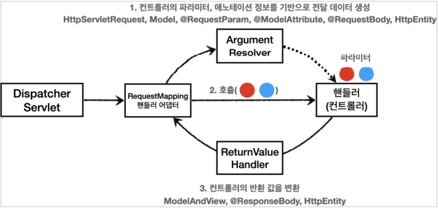

# 스프링 MVC - 기본 기능
## 목차
- 프로젝트 생성
- 로깅 간단히 알아보기
- 요청 매핑
- 요청 매핑 - API 예시
- HTTP 요청 - 기본, 헤더 조회
- HTTP 요청 파라미터 - 쿼리 파라미터, HTML Form
- HTTP 요청 파라미터 - @RequestParam
- HTTP 요청 파라미터 - @ModelAttribute
- HTTP 요청 메시지 - 단순 텍스트
- HTTP 요청 메시지 - JSON
- HTTP 응답 - 정적 리소스, 뷰 템플릿
- HTTP 응답 - HTTP API, 메시지 바디에 직접 입력
- HTTP 메시지 컨버터
- 요청 매핑 핸들러 어댑터 구조
___
## 프로젝트 생성
- <b>스프링 부트 스타터 사이트로 이동해서 스프링 프로젝트 생성</b>
    - https://start.spring.io
- 프로젝트 선택
    - Project: Gradle Project
    - Language: Java
    - Spring Boot: 2.5.x
- Project Metadata
    - Group: hello
    - Artifact: springmvc
    - Name: springmvc
    - Package name: hello.srpingmvc
    - Packaging: <b>Jar(주의!)</b>
    - Java: 11
- Dependencies: <b>Spring Web, Thymeleaf, Lombok</b>
> <b>주의!</b>
> - Packaging은 War가 아닌 <b>Jar를 선택</b>하자. JSP를 사용하지 않기 때문에 Jar를 사용하는 것이 좋다. 앞으로 스프링 부트를 사용하면 이 방식을 주로 사용하게 된다.
> - Jar를 사용하면 항상 내장 서버(톰캣 등)을 사용하고, `webapp` 경로도 사용하지 않는다. 내장 서버 사용에 최적화 되어 있는 기능이며, 최근에는 주로 이 방식을 사용한다.
> - War를 사용하면 내장 서버도 사용 가능 하지만, 주로 외부 서버에 배포하는 목적으로 사용한다.
- <b>build.gradle</b>
```gradle
plugins {
	id 'org.springframework.boot' version '2.5.0'
	id 'io.spring.dependency-management' version '1.0.11.RELEASE'
	id 'java'
}

group = 'hello'
version = '0.0.1-SNAPSHOT'
sourceCompatibility = '11'

configurations {
	compileOnly {
		extendsFrom annotationProcessor
	}
}

repositories {
	mavenCentral()
}

dependencies {
	implementation 'org.springframework.boot:spring-boot-starter-thymeleaf'
	implementation 'org.springframework.boot:spring-boot-starter-web'
	compileOnly 'org.projectlombok:lombok'
	annotationProcessor 'org.projectlombok:lombok'
	testImplementation 'org.springframework.boot:spring-boot-starter-test'
}

test {
	useJUnitPlatform()
}
```
- 동작 확인
    - 기본 메인 클래스 실행(`SpringmvcApplication.main()`)
    - http://localhost:8080 호출해서 Whitelabel Error Page가 나오면 정상 동작
### Welcome 페이지 만들기
- 스프링 부트에 `Jar`를 사용하면 `/resources/static/index.html`위치에 `index.html`파일을 두면 Welcome 페이지로 처리해준다. (스프링 부트가 지원하는 정적 컨텐츠 위치에 `/index.html`이 있으면 된다.)
```html
<!DOCTYPE html>
<html>
<head>
    <meta charset="UTF-8">
    <title>Title</title>
</head><body>
<ul>
    <li>로그 출력
        <ul>
            <li><a href="/log-test">로그 테스트</a></li>
        </ul>
    </li>
    <!-- -->
    <li>요청 매핑
        <ul>
            <li><a href="/hello-basic">hello-basic</a></li>
            <li><a href="/mapping-get-v1">HTTP 메서드 매핑</a></li>
            <li><a href="/mapping-get-v2">HTTP 메서드 매핑 축약</a></li>
            <li><a href="/mapping/userA">경로 변수</a></li>
            <li><a href="/mapping/users/userA/orders/100">경로 변수 다중</a></li>
            <li><a href="/mapping-param?mode=debug">특정 파라미터 조건 매핑</a></li>
            <li><a href="/mapping-header">특정 헤더 조건 매핑(POST MAN 필요)</a></li>
            <li><a href="/mapping-consume">미디어 타입 조건 매핑 Content-Type(POST
                MAN 필요)</a></li>
            <li><a href="/mapping-produce">미디어 타입 조건 매핑 Accept(POST MAN
                필요)</a></li>
        </ul>
    </li>
    <li>요청 매핑 - API 예시
        <ul>
            <li>POST MAN 필요</li>
        </ul>
    </li>
    <li>HTTP 요청 기본
        <ul>
            <li><a href="/headers">기본, 헤더 조회</a></li>
        </ul>
    </li>
    <li>HTTP 요청 파라미터
        <ul>
            <li><a href="/request-param-v1?username=hello&age=20">요청 파라미터
                v1</a></li>
            <li><a href="/request-param-v2?username=hello&age=20">요청 파라미터v2</a></li>
            <li><a href="/request-param-v3?username=hello&age=20">요청 파라미터
                v3</a></li>
            <li><a href="/request-param-v4?username=hello&age=20">요청 파라미터
                v4</a></li>
            <li><a href="/request-param-required?username=hello&age=20">요청
                파라미터 필수</a></li>
            <li><a href="/request-param-default?username=hello&age=20">요청
                파라미터 기본 값</a></li>
            <li><a href="/request-param-map?username=hello&age=20">요청 파라미터
                MAP</a></li>
            <li><a href="/model-attribute-v1?username=hello&age=20">요청 파라미터
                @ModelAttribute v1</a></li>
            <li><a href="/model-attribute-v2?username=hello&age=20">요청 파라미터
                @ModelAttribute v2</a></li>
        </ul>
    </li>
    <li>HTTP 요청 메시지
        <ul>
            <li>POST MAN</li>
        </ul>
    </li>
    <li>HTTP 응답 - 정적 리소스, 뷰 템플릿
        <ul>
            <li><a href="/basic/hello-form.html">정적 리소스</a></li>
            <li><a href="/response-view-v1">뷰 템플릿 v1</a></li>
            <li><a href="/response-view-v2">뷰 템플릿 v2</a></li>
        </ul>
    </li>
    <li>HTTP 응답 - HTTP API, 메시지 바디에 직접 입력
        <ul>
            <li><a href="/response-body-string-v1">HTTP API String v1</a></li>
            <li><a href="/response-body-string-v2">HTTP API String v2</a></li>
            <li><a href="/response-body-string-v3">HTTP API String v3</a></li>
            <li><a href="/response-body-json-v1">HTTP API Json v1</a></li>
            <li><a href="/response-body-json-v2">HTTP API Json v2</a></li>
        </ul>
    </li>
</ul></body>
</html>
```
> <b>참고</b>
> - 스프링 부트 Welcome 페이지 지원
>   - https://docs.spring.io/spring-boot/docs/current/reference/html/spring-boot-features.html#boot-features-spring-mvc-welcome-page
___
## 로깅 간단히 알아보기
- 운영 시스템에서는 `System.out.println()`같은 시스템 콘솔을 사용하여 필요한 정보를 출력하지 않고, 별도의 로깅 라이브러리를 사용하여 로그를 출력한다.
- 참고로 로그 관련 라이브러리도 많고, 깊게 들어가면 끝이 없기 때문에, 여기서는 최소한의 사용 방법만 정리한다.<br><br>
- <B>로깅 라이브러리</B>
    - 스프링 부트 라이브러리를 사용하면 스프링 부트 로깅 라이브러리(`spring-boot-starter-logging`)가 함께 포함된다.
    - 스프링 부트 로깅 라이브러리는 기본으로 다음 로깅 라이브러리를 사용한다.
        - SLF4J - http://www.slf4j.org
        - Logback - http://logback.qos.ch
    - 로그 라이브러리는 Logback, Log4J, Log4J2 등 수 많은 라이브러리가 존재하는데, 그것을 통합하여 인터페이스로 제공하는 것이 바로 SLF4j 라이브러리다.
    - 쉽게 말해 SLF4J는 인터페이스이고, 그 구현체로 Logback 같은 로그 라이브러리를 선택하면 된다.
        - 실무에서는 스프링 부트가 기본으로 제공하는 Logback을 대부분 사용한다고 한다.
- <b>로그 선언</b>
    ```java
    private Logger log = LoggerFactory.getLogger(getClass());
    private static final Logger log = LoggerFactory.getLogger(Xxx.class);
    ```
    - `@Slf4j`: 롬복 사용 가능
- <b>로그 호출</b>
    - `log.info("Hello")`
    - `System.out.println("hello")`
    - 시스템 콘솔로 직접 출력하는것 보다 로그를 사용하면 다음과 같은 장점이 있다. 실무에서는 항상 로그를 사용해야 한다.
    ```java
    @Slf4j
    @RestController
    public class LogTestController {

    //    private final Logger log = LoggerFactory.getLogger(getClass());

        @RequestMapping("/log-test")
        public String logTest(){
            String name = "Spring";

            log.trace("trace log={}", name);
            log.debug("debug log={}", name);
            log.info("info log={}", name);
            log.warn("warn log={}", name);
            log.error("error log={}", name);

            //로그를 사용하지 않아도 a+b 계산 로직이 먼저 실행됨, 이런 방식으로 사용하면 X
            log.debug("String concat log=" + name);
            return "ok";
        }
    }
    ```
- <b>실행</b>
    - http://localhost:8080/log-test
- <b>매핑 정보</b>
    - `@RestController`
        - `@Controller`는 반환 값이 `String`이면 뷰 이름으로 인식된다. 그래서 <b>뷰를 찾고 뷰가 랜더링된다.</b>
        - `@RestController`는 반환 값으로 뷰를 찾는 것이 아닌, <b>HTTP 메시지 바디에 바로 입력</b>한다.
            - 따라서 실행 결과로 ok 메시지를 받을 수 있다. `@ResponseBody`와 관련이 있는데 이후 더 자세히 정리한다.
- <b>테스트</b>
    - 로그가 출력되는 포맷 확인
        - 시간, 로그 레벨, 프로세스 ID, 스레드 명, 클래스 명, 로그 메시지
    - 로그 레벨 설정을 변경하여 출력 결과를 보자.
        - LEVEL: `TRACE > DEBUG > INFO > WARN > ERROR`
        - 개발 서버는 debug 출력
        - 운영 서버는 info 출력
        ```log
        ...
        2021-05-31 13:50:33.402 DEBUG 12304 --- [nio-8080-exec-1] hello.springmvc.basic.LogTestController  : debug log=Spring
        2021-05-31 13:50:33.403  INFO 12304 --- [nio-8080-exec-1] hello.springmvc.basic.LogTestController  : info log=Spring
        2021-05-31 13:50:33.403  WARN 12304 --- [nio-8080-exec-1] hello.springmvc.basic.LogTestController  : warn log=Spring
        2021-05-31 13:50:33.404 ERROR 12304 --- [nio-8080-exec-1] hello.springmvc.basic.LogTestController  : error log=Spring
        ```
- <b>로그 레벨 설정</b>
    - `application.properties`
    ```properties
    #전체 로그 레벨 설정(기본 info)
    logging.level.root=info

    #hello.springmvc 패키지와 그 하위 로그 레벨 설정
    logging.level.hello.springmvc=debug
    ```
- <b>올바른 로그 사용법</b>
    - `log.debug("data="+data)`
        - 로그 출력 레벨을 info로 설정해도 해당 코드에 있는 "data="+data가 실제 실행이 되어 버린다. 결과적으로 문자 더하기 연산이 발생한다.
    - `log.debug("data={}", data)`
        - 로그 출력 레벨을 info로 설정하면 아무 일도 발생하지 않는다. 따라서 앞과 같은 의미없는 연산이 발생하지 않는다.
- <b>로그 사용 시 장점</b>
    - 스레드 정보, 클래스 이름 같은 부가 정보를 함께 볼 수 있고, 출력 모양을 조정할 수 있다.
    - 로그 레벨에 따라 개발 서버에서는 모든 로그를 출력하고, 운영 서버에서는 출력하지 않는 등 로그를 상황에 맞게 조절할 수 있다.
    - 시스템 아웃 콘솔에만 출력하는 것이 아니라, 파일이나 네트워크 등 로그를 별도의 위치에 남길 수 있다.
        - 특히 파일로 남길 때는 일별, 특정 용량에 따라 로그를 분할하는 것도 가능하다.
    - 성능도 일반 System.out보다 좋다. (내부 버퍼링, 멀티 스레드 등) 그래서 실무에서는 꼭 로그를 사용해야 한다.
- <b>더 공부하자!</b>
    - 로그에 대한 더 자세한 내용은 slf4j, logback을 검색해보자.
        - SLF4J - http://www.slf4j.org
        - Logback - http://logback.qos.ch
    - 스프링 부트가 제공하는 로그 기능은 다음을 참고하자.
        - https://docs.spring.io/spring-boot/docs/current/reference/html/spring-boot-features.html#boot-features-logging
___
## 요청 매핑
- <b>MappingController</b>
    ```java
    @Slf4j
    @RestController
    public class MappingController {

        /**
         * 기본 요청
         * 둘다 허용 /hello-basic, /hello-basic/
         * HTTP 메서드 모두 허용 GET, HEAD, POST, PUT, PATCH, DELETE
         */
        @RequestMapping("/hello-basic")
        public String helloBasic(){
            log.info("helloBasic");
            return "ok";
        }
    }
    ```
    - <b>매핑 정보</b>
        - `@RestController`
            - `@Controller`는 반환 값이 `String`이면 뷰 이름으로 인식된다. 그래서 <b>뷰를 찾고 뷰가 랜더링</b>된다.
            - `@RestController`는 반환 값으로 뷰를 찾는 것이 아니라, <b>HTTP 메시지 바디에 바로 입력</b>한다.
                - 따라서 실행 결과로 ok 메시지를 받을 수 있다. `@ResponseBody`와 관련이 있는데, 뒤에서 더 자세히 정리한다.
        - `@RequestMapping("/hello-basic")`
            - `/hello-basic` URL 호출이 오면, 이 메소드가 실행되도록 매핑한다.
            - 대부분의 속성을 `배열[]`로 제공하므로 다중 설정이 가능하다.
                - `{"/hello-basic", "/hello-go"}`

    - <b>둘 다 허용</b>
        - 다음 두 가지 요청은 다른 URL이지만, 스프링은 다음 URL 요청들을 같은 요청으로 매핑한다.
            - 매핑: `/hello-basic`
            - URL 요청: `/hello-basic`, `/hello-basic/`
    - <b>HTTP 메소드</b>
        - `@RequestMapping`에 `method` 속성으로 HTTP 메소드를 지정하지 않으면, HTTP 메소드와 무관하게 호출된다.
            - 모두 허용 GET, HEAD, POST, PUT, PATCH, DELETE
    - <b>HTTP 메소드 매핑</b>
        ```java
        /**
         * method 특정 HTTP 메서드 요청만 허용
         * GET, HEAD, POST, PUT, PATCH, DELETE
         */
        @RequestMapping(value = "/mapping-get-v1", method = RequestMethod.GET)
        public String mappingGetV1() {
            log.info("mappingGetV1");
            return "ok";
        }
        ```
        - 만약 여기에 POST 요청을 하면, 스프링 MVC는 HTTP 405 상태코드(Method Not Allowed)를 반환한다.
    - <b>HTTP 메소드 매핑 축약</b>
        ```java
        /**
         * 편리한 축약 애노테이션 (코드보기)
         * @GetMapping
         * @PostMapping
         * @PutMapping
         * @DeleteMapping
         * @PatchMapping
         */
        @GetMapping(value = "/mapping-get-v2")
        public String mappingGetV2() {
            log.info("mapping-get-v2");
            return "ok";
        }
        ```
        - HTTP 메소드를 축약한 애노테이션을 사용하는 것이 더 직관적이다.
        - 코드를 보면, 내부에서 `@RequestMapping`과 `method`를 지정해서 사용하는 것을 확인할 수 있다.
    - <b>PathVariable(경로 변수) 사용</b>
        ```java
        /**
         * PathVariable 사용
         * 변수명이 같으면 생략 가능
         *
         * @PathVariable("userId") String userId -> @PathVariable userId
         * /mapping/userA
         */
        @GetMapping("/mapping/{userId}")
        public String mappingPath(@PathVariable("userId") String data) {
            log.info("mappingPath userId={}", data);
            return "ok";
        }
        ```
        - 실행: http://localhost:8080/mapping/userA
        - 최근 HTTP API는 다음과 같이 리소스 경로에 식별자를 넣는 스타일을 선호한다.
            - `/mapping/userA`
            - `/users/1`
        - `@RequsetMapping`은 URL 경로를 템플릿화 할 수 있는데, `@PathVariable`을 사용하면 매칭 되는 부분을 편리하게 조회할 수 있다.
        - `@PathVariable`의 이름과 파라미터 이름이 같으면 아래와 같이 생략할 수 있다.
    - <b>PathVariable 사용 - 다중</b>
        ```java
        /**
         * PathVariable 사용 다중
         */
        @GetMapping("/mapping/users/{userId}/orders/{orderId}")
        public String mappingPath(@PathVariable String userId, @PathVariable Long
                orderId) {
            log.info("mappingPath userId={}, orderId={}", userId, orderId);
            return "ok";
        }
        ```
        - 실행: http://localhost:8080/mapping/users/userA/orders/100
    - <b>특정 파라미터 조건 매핑</b>
        ```java
        /**
         * 파라미터로 추가 매핑
         * params="mode",
         * params="!mode"
         * params="mode=debug"
         * params="mode!=debug"
         * params = {"mode=debug","data=good"}
         */
        @GetMapping(value = "/mapping-param", params = "mode=debug")
        public String mappingParam() {
            log.info("mappingParam");
            return "ok";
        }
        ```
        - 실행: http://localhost:8080/mapping-param?mode=debug
        - 특정 파라미터가 있거나 없는 조건을 추가할 수 있지만, 잘 사용하지는 않는다.
    - <b>특정 헤더 조건 매핑</b>
        ```java
        /**
         * 특정 헤더로 추가 매핑
         * headers="mode",
         * headers="!mode"
         * headers="mode=debug"
         * headers="mode!=debug"
         */
        @GetMapping(value = "/mapping-header", headers = "mode=debug")
        public String mappingHeader() {
            log.info("mappingHeader");
            return "ok";
        }
        ```
        - 파라미터 매핑과 비슷하지만, HTTP 헤더를 사용한다.
        - <b>Postman으로 header를 추가하여 테스트 해보자.</b>
    - <b>미디어 타입 조건 매핑 - HTTP 요청 Content-Type, consume</b>
        ```java
        /**
         * Content-Type 헤더 기반 추가 매핑 Media Type
         * consumes="application/json"
         * consumes="!application/json"
         * consumes="application/*"
         * consumes="*\/*"
         * MediaType.APPLICATION_JSON_VALUE
         */
        @PostMapping(value = "/mapping-consume", consumes = MediaType.APPLICATION_JSON_VALUE)
        public String mappingConsumes() {
            log.info("mappingConsumes");
            return "ok";
        }
        ```
        - HTTP 요청의 Content-Type 헤더를 기반으로 미디어 타입으로 매핑한다.
        - 만약 맞지 않으면 HTTP 415 상태코드(Unsupported Media Type)을 반환한다.
        - <b>Postman으로 Content-Type 헤더를 변경하여 테스트 해보자.</b>
        > ex) consumes
        > ```
        > consumes = "text/plain"
        > consumes = {"text/plain", "application/*"}
        > consumes = MediaType.TEXT_PLAIN_VALUE
        > ```
    - <b>미디어 타입 조건 매핑 - HTTP 요청 Accpet, produce</b>
        ```java
        /**
         * Accept 헤더 기반 Media Type
         * produces = "text/html"
         * produces = "!text/html"
         * produces = "text/*"
         * produces = "*\/*"
         */
        @PostMapping(value = "/mapping-produce", produces = MediaType.TEXT_HTML_VALUE)
        public String mappingProduces() {
            log.info("mappingProduces");
            return "ok";
        }
        ```
        - HTTP 요청의 Accept 헤더를 기반으로 미디어 타입으로 매핑한다.
        - 만약 맞지 않으면, HTTP 406 상태코드(Not Acceptable)을 반환한다.
        > ex)
        > ```
        > produces = "text/plain"
        > produces = {"text/plain", "application/*"}
        > produces = MediaType.TEXT_PLAIN_VALUE
        > produces = "text/plain;charset=UTF-8"
        > ```        
___
## 요청 매핑 - API 예시
- 회원 관리를 HTTP API로 만든다 생각하고, 매핑을 어떻게 하는지 알아보자.
    - 실제 데이터가 넘어가는 부분은 생략하고, URL 매핑만
- <B>회원 관리 API</B>
    - 회원 목록 조회: GET `/users`
    - 회원 등록: POST `/users`
    - 회원 조회: GET `/users/{userId}`
    - 회원 수정: PATCH `/users/{userId}`
    - 회원 삭제: DELETE `/users/{userId}`
- <b>MappingClassController</b>
    ```java
    @RestController
    @RequestMapping("/mapping/users")
    public class MappingClassController {

        /**
         * 회원 목록 조회: GET /users
         * 회원 등록: POST /users
         * 회원 조회: GET /users/{userId}
         * 회원 수정: PATCH /users/{userId}
         * 회원 삭제: DELETE /users/{userId}
         */

        @GetMapping
        public String user(){
            return "get uesrs";
        }

        @PostMapping
        public String addUser(){
            return "post user";
        }

        @GetMapping("/{userId}")
        public String findUser(@PathVariable String userId){
            return "get userId=" + userId;
        }

        @PatchMapping("/{userId}")
        public String updateUser(@PathVariable String userId){
            return "update userId=" + userId;
        }

        @DeleteMapping("/{userId}")
        public String deleteUser(@PathVariable String userId){
            return "delete userId=" + userId;
        }
    }
    ```
    - `/mapping`: 다른 코드들과 구분하기 위해 사용함
    - `@RequestMapping("/mapping/users")`
        - 클래스 레벨에 매핑 정보를 두면, 메소드 레벨에서 해당 정보를 조합하여 사용한다.
- <b>Postman으로 테스트</b>
    - 회원 목록 조회: GET `/users`
    - 회원 등록: POST `/users`
    - 회원 조회: GET `/users/userA`
    - 회원 수정: PATCH `/users/userA`
    - 회원 삭제: DELETE `/users/userA`
- 매핑 방법을 이해했으니, 이제부터 HTTP 요청이 보내는 데이터들을 스프링 MVC로 어떻게 조회하는지 알아보자.
___
## HTTP 요청 - 기본, 헤더 조회
- 애노테이션 기반의 스프링 컨트롤러는 다양한 파라미터를 지원한다.
- 이번에는 HTTP 헤더 정보를 조회하는 방법을 알아보자.<br><br>
- <b>RequestHeaderController</b>
    ```java
    @Slf4j
    @RestController
    public class RequestHeaderController {

        @RequestMapping("/headers")
        public String headers(HttpServletRequest request,
                              HttpServletResponse response,
                              HttpMethod httpMethod,
                              Locale locale,
                              @RequestHeader MultiValueMap<String, String> headerMap,
                              @RequestHeader("host") String host,
                              @CookieValue(value = "myCookie", required = false) String cookie
                              ){
            log.info("request={}", request);
            log.info("response={}", response);
            log.info("httpMethod={}", httpMethod);
            log.info("locale={}", locale);
            log.info("headerMap={}", headerMap);
            log.info("header host={}", host);
            log.info("myCookie={}", cookie);

            return "ok";
        }
    }
    ```
    - 결과
    ```log
    2021-05-31 16:51:32.974  INFO 9960 --- [nio-8080-exec-2] h.s.b.request.RequestHeaderController    : request=org.apache.catalina.connector.RequestFacade@e58279c
    2021-05-31 16:51:32.975  INFO 9960 --- [nio-8080-exec-2] h.s.b.request.RequestHeaderController    : response=org.apache.catalina.connector.ResponseFacade@306f3cd8
    2021-05-31 16:51:32.975  INFO 9960 --- [nio-8080-exec-2] h.s.b.request.RequestHeaderController    : httpMethod=GET
    2021-05-31 16:51:32.975  INFO 9960 --- [nio-8080-exec-2] h.s.b.request.RequestHeaderController    : locale=ko_KR
    2021-05-31 16:51:32.975  INFO 9960 --- [nio-8080-exec-2] h.s.b.request.RequestHeaderController    : headerMap={content-type=[application/json], user-agent=[PostmanRuntime/7.28.0], accept=[*/*], postman-token=[f7d70b89-d70b-4ad1-a1d9-f7e3eb08b5a0], host=[localhost:8080], accept-encoding=[gzip, deflate, br], connection=[keep-alive], content-length=[16]}
    2021-05-31 16:51:32.975  INFO 9960 --- [nio-8080-exec-2] h.s.b.request.RequestHeaderController    : header host=localhost:8080
    2021-05-31 16:51:32.975  INFO 9960 --- [nio-8080-exec-2] h.s.b.request.RequestHeaderController    : myCookie=null    
    ```
    - `HttpServletRequest`
    - `HttpServletResponse`
    - `HttpMethod`: HTTP 메소드를 조회한다. `org.springframework.http.HttpMethod`
    - `Locale`: Locale 정보를 조회한다.
    - `@RequestHeader MultiValueMap<String, String> headerMap`
        - 모든 HTTP 헤더를 MultiValueMap 형식으로 조회한다.
    - `@RequestHeader("host") String host`
        - 특정 HTTP 헤더를 조회한다.
        - 속성
            - 필수 값 여부: `required`
            - 기본 값 속성: `defaultValue`
    - `@CookileValue(value = "myCookie", required = false) String cookie`
        - 특정 쿠키를 조회한다.
        - 속성
            - 필수 값 여부: `required`
            - 기본 값 속성: `defaultValue`                
- `MultiValueMap`
    - Map과 유사한데, 하나의 키에 여러 값을 받을 수 있다.
    - HTTP header, HTTP 쿼리 파라미터와 같이 하나의 키에 여러 값을 받을 때 사용한다.
        - <b>keyA=value1&keyA=value2</b>
            ```java
            MultiValueMap<String, String> map = new LinkedMultiValueMap();
            map.add("keyA", "value1");
            map.add("keyA", "value2");

            //[value1,value2]
            List<String> values = map.get("keyA");
            ```
- <b>@Slf4j</b>
    - 다음 코드를 자동으로 생성해서 로그를 선언해준다. 개발자는 편리하게 `log`라고 사용하면 된다.
    ```java
    private static final org.slf4j.Logger log = org.slf4j.LoggerFactory.getLogger(RequestHeaderController.class);
    ```
> <b>참고</b>
> - `@Controller`의 사용 가능한 `파라미터` 목록은 다음 공식 메뉴얼에서 자세하게 확인할 수 있다.
> - https://docs.spring.io/spring-framework/docs/current/reference/html/web.html#mvc-ann-arguments

> - `Controller`의 사용 가능한 `응답 값` 목록은 다음 공식 메뉴얼에서 자세하게 확인할 수 있다.
> - https://docs.spring.io/spring-framework/docs/current/reference/html/web.html#mvc-ann-return-types
___
## HTTP 요청 파라미터 - 쿼리 파라미터, HTML Form
### HTTP 요청 데이터 조회 - 개요
- 서블릿에서 학습했던 HTTP 요청 데이터를 조회하는 방법을 다시 떠올려보자. 그리고 서블릿으로 학습했던 내용을 스프링이 얼마나 깔끔하고 효율적으로 바꾸어주는지 알아보자.<br><br>
- HTTP 요청 메시지를 통해 클라이언트에서 서버로 데이터를 전달하는 방법을 알아보자.<br><br>
- <b>클라이언트에서 서버로 요청 데이터를 전달할 때는 주로 다음 3가지 방법을 사용한다.</b>
    - <b>GET - 쿼리 파라미터</b>
        - /url<b>?username=hello&age=20</b>
        - 메시지 바디 없이, URL의 쿼리 파라미터에 데이터를 포함해서 전달
        > ex) 검색, 필터, 페이징 등에서 많이 사용하는 방식
    - <b>POST - HTML - Form</b>
        - content-type: application/x-www-form-urlencoded
        - 메시지 바디에 쿼리 파라미터 형식으로 전달 username=hello&age=20
        > ex) 회원 가입, 상품 주문, HTML Form사용
    - <b>HTTP message body</b>에 데이터를 직접 담아서 요청
        - HTTP API에서 주로 사용, JSON, XML, TEXT
        - 데이터 형식은 주로 JSON 사용
        - POST, PUT, PATCH
### 요청 파라미터 - 쿼리 파라미터, HTML Form
- `HttpServletRequest`의 `request.getParamter()`를 사용하면 다음 두가지 요청 파라미터를 조회할 수 있다.
    - <b>GET, 쿼리 파라미터 전송</b>
        - `http://localhost:8080/request-param?username=hello&age=20`
    - <b>POST, HTML Form 전송</b>
        ```http
        POST /request-param ...
        content-type: application/x-www-form-urlencoded

        username=hello&age=20
        ```
    - GET 쿼리 파라미터 전송 방식이든, POST HTML Form 전송 방식이든 둘 다 형식이 같으므로 구분없이 조회할 수 있다.
    - 이것을 간단히 <b>요청 파라미터(request parameter) 조회</b>라고 한다.
    - 지금부터 스프링으로 요청 파라미터를 조회하는 방법을 단계적으로 알아보자.
- <b>RequestParamController</b>
    ```java
    @Slf4j
    @Controller
    public class RequestParamController {

        /**
         * 반환 타입이 없으면서 이렇게 응답에 값을 직접 집어넣으면, view 조회X
         */
        @RequestMapping("/request-param-v1")
        public void requestParamV1(HttpServletRequest request, HttpServletResponse response) throws IOException {
            String username = request.getParameter("username");
            int age = Integer.parseInt(request.getParameter("age"));

            log.info("username={}, age={}", username, age);

            response.getWriter().write("ok");
        }
    }
    ```
    - <b>request.getParamter()</b>
        - 여기서는 단순히 HttpServletRequest가 제공하는 방식으로 요청 파라미터를 조회했다.
    - <b>GET 실행</b>
        - http://localhost:8080/request-param-v1?username=hello&age=20
    - <b>Post Form 페이지 생성</b>
        - 먼저 테스트용 HTML Form을 만들어야 한다.
        - 리소스는 `/resources/static` 아래에 두면 스프링 부트가 자동으로 인식한다.
        - `main/resources/static/basic/hello-form.html`
        ```html
        <!DOCTYPE html>
        <html lang="en">
        <head>
            <meta charset="UTF-8">
            <title>Title</title>
        </head>
        <body>
        <form action="/request-param-v1" method="post">
            username: <input type="text" name="username" />
            age: <input type="text" name="age" />
            <button type="submit">전송</button>
        </form>
        </body>
        </html>
        ```
        - <b>Post Form 실행</b>
            - http://localhost:8080/basic/hello-form.html
        > <b>참고</b>
        > - `Jar`를 사용하면 `webapp`경로를 사용할 수 없다. 이제부터 정적 리소스도 클래스 경로에 함께 포함해야 한다.
___
## HTTP 요청 파라미터 - @RequestParam
- 스프링이 제공하는 `@RequestParam`을 사용하면 요청 파라미터를 매우 편리하게 사용할 수 있다.<br><br>
- <b>requestParamV2</b>
    ```java
    @ResponseBody
    @RequestMapping("/request-param-v2")
    public String requestParamV2(
            @RequestParam("username") String memberName,
            @RequestParam("age") int memberAge){

        log.info("username={}, age={}", memberName, memberAge);
        return "ok";
    }
    ```
    - `@RequestParam`: 파라미터 이름으로 바인딩
    - `@ResponseBody`: View 조회를 무시하고, HTTP message body에 직접 해당 내용 입력<br><br>
    - <b>@RequestParam의 `name(Value)` 속성이 파라미터 이름으로 사용</b>
    - @RequestParam("<b>username</b>") String <b>memberName</b>
    - -> request.getParameter("<b>username</b>")
- <b>requestParamV3</b>
    ```java
    @ResponseBody
    @RequestMapping("/request-param-v3")
    public String requestParamV3(
            @RequestParam String username,
            @RequestParam int age
    ){

        log.info("username={}, age={}", username, age);
        return "ok";
    }
    ```
    - HTTP 파라미터 이름이 변수 이름과 같으면 `@RequestParam(name="xx")` 생략 가능
- <b>requestParamV4</b>
    ```java
    @ResponseBody
    @RequestMapping("/request-param-v4")
    public String requestParamV4(String username, int age){

        log.info("username={}, age={}", username, age);
        return "ok";
    }
    ```
    - `String`, `int`, `Integer` 등 단순 타입이면 `@RequestParam`도 생략 가능
    > <b>주의</b>
    > - `@RequestParam` 애노테이션을 생략하면 스프링 MVC는 내부에서 `required=false`를 적용한다.

    > <b>참고</b>
    > - 이렇게 애노테이션을 완전히 생략해도 되지만, 너무 없는 것도 약간 과하다는 의견들이 있다. `@RequestParam`이 있으면 명확하게 요청 파라미터에서 데이터를 읽는다는 것을 알 수 있다.
- <b>파라미터 필수 여부 - requestParamRequired</b>
    ```java
    @ResponseBody
    @RequestMapping("/request-param-required")
    public String requestParamRequired(
            @RequestParam(required = true) String username,
            @RequestParam(required = false) Integer age
    ){

        log.info("username={}, age={}", username, age);
        return "ok";
    }
    ```
    - `@RequestParam.required`
        - 파라미터 필수 여부
        - 기본 값이 파라미터 필수(`true`)이다.
    - `/request-param` 요청
        - `username`이 없으므로 400 예외가 발생한다.
    - <b>주의! - 파라미터 이름만 사용</b>
        - `/request-param?username=`
        - 파라미터 이름만 있고, 값이 없는 경우 -> 빈 문자로 통과
    - <b>주의! - 기본형(primitive)에 null 입력</b>
        - `/request-param` 요청
        - `@RequestParam(required = false) int age`
            - `null`을 `int`에 입력하는 것은 불가능(500 예외 발생)
            - 따라서 `null`을 받을 수 있는 `Integer`으로 변경하거나, `defaultValue` 사용
- <b>기본 값 적용 - requestParamDefault</b>
    ```java
    @ResponseBody
    @RequestMapping("/request-param-default")
    public String requestParamDefault(
            @RequestParam(required = true, defaultValue = "guest") String username,
            @RequestParam(required = false, defaultValue = "-1") int age
    ){

        log.info("username={}, age={}", username, age);
        return "ok";
    }
    ```
    - 파라미터에 값이 없는 경우 `defaultValue`를 사용하면 기본 값을 적용할 수 있다.
    - 이미 기본 값이 있기 때문에, `required`는 의미가 없다.
    - `defaultValue`는 빈 문자의 경우에도 설정한 기본 값이 적용된다.
        - `/request-param?username=`
- <b>파라미터를 Map으로 조회하기 - requestParamMap</b>
    ```java
    @ResponseBody
    @RequestMapping("/request-param-map")
    public String requestParamMap(
            @RequestParam Map<String, Object> paramMap){

        log.info("username={}, age={}", paramMap.get("username"), paramMap.get("age"));
        return "ok";
    }
    ```
    - 파라미터를 Map, MultiValueMap으로 조회할 수 있다.
    - `@RequestParam Map`
        - `Map(key=value)`
    - `@RequestParam MultiValueMap`
        - `MultiValueMap(key=[value1, value2, ...] ex) (key=userIds, value=[id1, id2])`
    - 파라미터의 값이 1개가 확실하다면, `Map`을 사용해도 되지만, 그렇지 않다면 `MultiValueMap`을 사용하자.
___
## HTTP 요청 파라미터 - @ModelAttribute
- 실제 개발을 하면 요청 파라미터를 받아서 필요한 객체를 만들고, 그 객체에 값을 넣어주어야 한다. 보통 다음과 같이 코드를 작성할 것이다.
    ```java
    @RequestParam String username;
    @RequestParam int age;

    HelloData data = new HelloData();
    data.setUsername(username);
    data.setAge(age);
    ```
    - 스프링은 이 과정을 완전히 자동화해주는 `@ModelAttribute` 기능을 제공한다.
    - 먼저 요청 파라미터를 바인딩 받을 객체를 만들자.
- <b>HelloData</b>
    ```java
    @Data
    public class HelloData {
        private String username;
        private int age;
    }
    ```
    - 롬복 `@Data`
        - `@Getter`, `@Setter`, `@ToString`, `@EqualsAndHashCode`, `@RequiredArgsConstructor` 를 자동으로 적용해준다.
- <b>ModelAttribute 적용 - modelAttributeV1</b>
    ```java
    /**
    * @ModelAttribute 사용
    * 참고: model.addAttribute(helloData) 코드도 함께 자동 적용됨, 뒤에 model을 설명할 때
    자세히 설명
    */
    @ResponseBody
    @RequestMapping("/model-attribute-v1")
    public String modelAttributeV1(@ModelAttribute HelloData helloData) {
        log.info("username={}, age={}", helloData.getUsername(), helloData.getAge());
        log.info("helloData={}", helloData);
        return "ok";
    }
    ```
    - 마치 마법처럼 `HelloData` 객체가 생성되고, 요청 파라미터의 값도 모두 들어가 있다.<br><br>
    - 스프링 MVC는 `@ModelAttribute`가 있으면 다음을 실행한다.
        - `HelloData` 객체를 생성한다.
        - 요청 파라미터의 이름으로 `HelloData` 객체의 프로퍼티를 찾는다. 그리고 해당 프로퍼티의 setter를 호출하여 파라미터의 값을 입력(바인딩) 한다.
        > ex) 파라미터 이름이 `username`이면 `setUsername()` 메소드를 찾아 호출하면서 값을 입력한다.
- <b>프로퍼티</b>
    - 객체에 `getUsername()`, `setUsername()` 메소드가 있으면, 이 객체는 `username` 이라는 프로퍼티를 가진다.
    - `username` 프로퍼티의 값을 변경하면, `setUsername()`이 호출되고, 조회하면 `getUsername()`이 호출된다.
        ```java
        class HelloData {
            getUsername();
            setUsername();
        }
        ```
- <b>바인딩 오류</b>
    - `age=abc`처럼 숫자가 들어가야 할 곳에 문자를 넣으면 `BindException`이 발생한다. 이런 바인딩 오류를 처리하는 방법은 검증 부분에서 정리하겠다.
- <b>@ModelAttribute 생략 - modelAttributeV2</b>
    ```java
    /**
     * @ModelAttribute 생략 가능
     * String, int 같은 단순 타입 = @RequestParam
     * argument resolver 로 지정해둔 타입 외 = @ModelAttribute
     */
    @ResponseBody
    @RequestMapping("/model-attribute-v2")
    public String modelAttributeV2(HelloData helloData) {
        log.info("username={}, age={}", helloData.getUsername(), helloData.getAge());
        log.info("helloData={}", helloData);
        return "ok";
    }
    ```
    - `@ModelAttribute`는 생략할 수 있다.
    - 스프링은 해당 생략 시 다음과 같은 규칙을 적용한다.
        - `String`, `int`, `Integer`같은 단순 타입 = `@RequestParam`
        - 나머지 = `@ModelAttribute`(argument resolver로 지정해둔 타입 외)
___
## HTTP 요청 메시지 - 단순 텍스트
- 서블릿에서 학습한 내용을 떠올려보자.<br><Br>
- <b>HTTP message body</b>에 데이터를 직접 담아서 요청
    - HTTP API에서 주로 사용. JSON, XML, TEXT, ...
    - 데이터 형식은 주로 JSON 사용
    - POST, PUT, PATCH
- 요청 파라미터와 다르게, HTTP 메시지 바디를 통해 데이터가 직접 넘어오는 경우는 `@RequestParam`, `@ModelAttribute`를 사용할 수 없다. (물론 HTML Form 형식으로 전달되는 경우는 요청 파라미터로 인정된다.)<br><Br>
- 먼저 가장 단순한 텍스트 메시지를 HTTP 메시지 바디에 담아 전송하고, 읽어보자.
- HTTP 메시지 바디의 데이터를 `InputStream`을 사용해서 직접 읽을 수 있다.<br><br>
- <B>RequestBodyStringController</B>
    ```java
    @Slf4j
    @Controller
    public class RequestBodyStringController {

        @PostMapping("/request-body-string-v1")
        public void requestBodyString(HttpServletRequest request, HttpServletResponse response) throws IOException {
            ServletInputStream inputStream = request.getInputStream();
            String messageBody = StreamUtils.copyToString(inputStream, StandardCharsets.UTF_8);

            log.info("messageBody={}", messageBody);
            response.getWriter().write("ok");
        }
    }
    ```
    - <b>Postman을 사용해서 테스트 해보자.</b>
    - POST http://localhost:8080/request-body-string-v1
    - Body -> row, Text 선택
- <b>Input, Output 스트림, Reader - requestBodyStringV2</b>
    ```java
    /**
     * InputStream(Reader): HTTP 요청 메시지 바디의 내용을 직접 조회
     * OutputStream(Writer): HTTP 응답 메시지의 바디에 직접 결과 출력
     */
    @PostMapping("/request-body-string-v2")
    public void requestBodyStringV2(InputStream inputStream, Writer responseWriter) throws IOException {
        String messageBody = StreamUtils.copyToString(inputStream, StandardCharsets.UTF_8);

        log.info("messageBody={}", messageBody);
        responseWriter.write("ok");
    }
    ```
    - <b>스프링 MVC는 다음 파라미터를 지원한다.</b>
        - InputStream(Reader): HTTP 요청 메시지 바디의 내용을 직접 조회
        - OutputStream(Writer): HTTP 응답 메시지의 바디에 직접 결과 출력
- <b>HttpEntity - requestBodyStringV3</b>
    ```java
    /**
     * HttpEntity: HTTP header, body 정보를 편라하게 조회
     * - 메시지 바디 정보를 직접 조회(@RequestParam X, @ModelAttribute X)
     * - HttpMessageConverter 사용 -> StringHttpMessageConverter 적용
     *
     * 응답에서도 HttpEntity 사용 가능
     * - 메시지 바디 정보 직접 반환(view 조회X)
     * - HttpMessageConverter 사용 -> StringHttpMessageConverter 적용
     */
    @PostMapping("/request-body-string-v3")
    public HttpEntity<String> requestBodyStringV3(HttpEntity<String> httpEntity) throws IOException {
        String messageBody = httpEntity.getBody();
        log.info("messageBody={}", messageBody);

        return new HttpEntity<>("ok");
    }
    ```
    - <B>스프링 MVC는 다음 파라미터를 지원한다.</B>
        - <b>HttpEntity</b>: HTTP header, body 정보를 편리하게 조회
            - 메시지 바디 정보를 직접 조회
            - 요청 파라미터를 조회하는 기능과 관계 없음 `@RequestParam` X, `@ModelAttribute` X
        - <b>HttpEntity는 응답에도 사용 가능</b>
            - 메시지 바디 정보 직접 반환
            - 헤더 정보 포함 가능
            - view 조회X
        - `HttpEntity`를 상속받은 다음 객체들도 같은 기능을 제공한다.
            - <b>RequestEntity</b>
                - HttpMethod, url 정보가 추가 됨, 요청에서 사용
            - <b>ResponseEntity</b>
                - HTTP 상태 코드 설정 가능, 응답에서 사용
                - `return new ResponseEntity<String>("Hello World", responseHeaders, HttpStatus.CREATED)`
    > <b>참고</b>
    > - 스프링 MVC 내부에서 HTTP 메시지 바디를 읽어 문자나 객체로 변환해서 전달해주는데, 이 때 HTTP 메시지 컨버터(`HttpMessageConverter`)라는 기능을 사용한다.
- <b>@RequestBody - requestBodyStringV4</b>
    ```java
    /**
     * @RequestBody
     * - 메시지 바디 정보를 직접 조회(@RequestParam X, @ModelAttribute X)
     * - HttpMessageConverter 사용 -> StringHttpMessageConverter 적용
     *
     * @ResponseBody
     * - 메시지 바디 정보 직접 반환(view 조회X)
     * - HttpMessageConverter 사용 -> StringHttpMessageConverter 적용
     */
    @ResponseBody
    @PostMapping("/request-body-string-v4")
    public String requestBodyStringV4(@RequestBody String messageBody) {
        log.info("messageBody={}", messageBody);

        return "ok";
    }
    ```
    - <b>@RequestBody</b>
        - `@RequestBody`를 사용하면 HTTP 메시지 바디 정보를 편리하게 조회할 수 있다. 참고로 헤더 정보가 필요하다면 `HttpEntity`를 사용하거나, `@RequestHeader`를 사용하면 된다.
        - 이렇게 메시지 바디를 직접 조회하는 기능은 요청 파라미터를 조회하는 `@RequestParam`, `@ModelAttribute`와는 전혀 관계가 없다.
    - <b>요청 파라미터 vs HTTP 메시지 바디</b>
        - 요청 파라미터를 조회하는 기능: `@RequestParam`, `@ModelAttribute`
        - HTTP 메시지 바디를 직접 조회하는 기능: `@RequestBody`
    - <b>@ResponseBody</b>
        - `@ResponseBody`를 사용하면 응답 결과를 HTTP 메시지 바디에 직접 담아서 전달할 수 있다. 물론 이 경우에도 view를 사용하지 않는다.
___
## HTTP 요청 메시지 - JSON
- 이번에는 HTTP API에서 주로 사용하는 JSON 데이터 형식을 조회해보자.
- 기존 서블릿에서 사용했던 방식과 비슷하게 시작해보자.<br><br>
- <b>RequestBodyJsonController</b>
    ```java
    /**
     * {"username":"hello", "age":20}
     * content-type: application/json
     */
    @Slf4j
    @Controller
    public class RequestBodyJsonController {

        private ObjectMapper objectMapper = new ObjectMapper();

        @PostMapping("/request-body-json-v1")
        public void requestBodyJsonV1(HttpServletRequest request, HttpServletResponse response) throws IOException {
            ServletInputStream inputStream = request.getInputStream();
            String messageBody = StreamUtils.copyToString(inputStream, StandardCharsets.UTF_8);

            log.info("messageBody={}", messageBody);
            HelloData helloData = objectMapper.readValue(messageBody, HelloData.class);
            log.info("username = {}, age = {}", helloData.getUsername(), helloData.getAge());

            response.getWriter().write("ok");
        }
    }
    ```
    - HttpServletRequest를 사용해서 직접 HTTP 메시지 바디에서 데이터를 읽어와 문자로 변환한다.
    - 문자로 된 JSON 데이터를 Jackson 라이브러리인 `objectMapper`를 사용하여 자바 객체로 변환한다.<br><br>
    - <b>Postman으로 테스트</b>
        - POST http://localhost:8080/request-body-json-v1
        - raw, JSON, content-type: application/json
        - `{"username": "hello", "age": 20}`
- <b>requestBodyJsonV2 - @RequestBody 문자 반환</b>
    ```java
    /**
     * @RequestBody
     * HttpMessageConverter 사용 -> StringHttpMessageConverter 적용
     *
     * @ResponseBody
     * - 모든 메서드에 @ResponseBody 적용
     * - 메시지 바디 정보 직접 반환(view 조회X)
     * - HttpMessageConverter 사용 -> StringHttpMessageConverter 적용
     */
    @ResponseBody
    @PostMapping("/request-body-json-v2")
    public String requestBodyJsonV2(@RequestBody String messageBody) throws JsonProcessingException {
        log.info("messageBody={}", messageBody);
        HelloData helloData = objectMapper.readValue(messageBody, HelloData.class);
        log.info("username = {}, age = {}", helloData.getUsername(), helloData.getAge());

        return "ok";
    }
    ```
    - 이전에 학습한 `@RequestBody`를 사용하여 HTTP 메시지에서 데이터를 꺼내어 messageBody에 저장한다.
    - 문자로 된 JSON 데이터인 `messageBody`를 `objectMapper`를 통해 자바 객체로 변환한다.<br><br>
    - <b>문자로 변환하고 다시 json으로 변환하는 과정이 불편하다. @ModelAttribute처럼 한 번에 객체로 변환할 수는 없을까?</b>
- <b>requestBodyJsonV3 - @RequestBody 객체 변환</b>
    ```java
    /**
     * @RequestBody 생략 불가능(@ModelAttribute 가 적용되어 버림)
     * HttpMessageConverter 사용 -> MappingJackson2HttpMessageConverter (contenttype: application/json)
     *
     */
    @ResponseBody
    @PostMapping("/request-body-json-v3")
    public String requestBodyJsonV3(@RequestBody HelloData helloData) {
        log.info("username = {}, age = {}", helloData.getUsername(), helloData.getAge());

        return "ok";
    }
    ```
    - <b>@RequestBody 객체 파라미터</b>
        - `@RequestBody HelloData data`
        - `@RequestBody`에 직접 만든 객체를 지정할 수 있다.
    - `HttpEntity`, `@RequestBody`를 사용하면 HTTP 메시지 컨버터가 HTTP 메시지 바디의 내용을 우리가 원하는 문자나 객체 등으로 변환해준다.
    - HTTP 메시지 컨버터는 문자뿐만 아니라 JSON도 객체로 변환해주는데, 우리가 방금 V2에서 했던 작업을 대신 처리해준다.<br><br>
    - <b>@RequestBody는 생략 불가능</b>
        - `@ModelAttribute`에서 학습한 내용을 떠올려보자.<br><br>
        - 스프링은 `@ModelAttribute`, `@RequestParam` 해당 생략 시 다음과 같은 규칙을 적용한다.
            - `String`, `int`, `Integer` 같은 단순 타입 = `@RequestParam`
            - 나머지 = `@ModelAttribute` (argument resolver로 지정해둔 타입 외)
        - 따라서 이 경우 HelloData에 `@RequestBody`를 생략하면, `@ModelAttribute`가 적용되어버린다.
        - `HelloData data` -> `@ModelAttribute HelloData data`
        - 따라서, 생략하면 HTTP 메시지 바디가 아닌 요청 파라미터를 처리하게 된다.
    > <b>주의</b>
    > - HTTP 요청 시에 content-type이 application/json인지 꼭! 확인해야 한다. 그래야 JSON을 처리할 수 있는 HTTP 메시지 컨버터가 실행된다.
    - 물론 앞서 배운 것과 같이 HttpEntity를 사용해도 된다.
- <b>requestBodyJsonV4 - HttpEntity</b>
    ```java
    @ResponseBody
    @PostMapping("/request-body-json-v4")
    public String requestBodyJsonV4(HttpEntity<HelloData> data) {
        HelloData helloData = data.getBody();
        log.info("username = {}, age = {}", helloData.getUsername(), helloData.getAge());

        return "ok";
    }
    ```
- <b>requestBodyJsonV5</b>
    ```java
    @ResponseBody
    @PostMapping("/request-body-json-v5")
    public HelloData requestBodyJsonV5(@RequestBody HelloData helloData) {
        log.info("username = {}, age = {}", helloData.getUsername(), helloData.getAge());

        return helloData;
    }
    ```
    - `@ResponseBody`
        - 응답의 경우에도 `@ResponseBody`를 사용하면, 해당 객체를 HTTP 메시지 바디에 직접 넣어줄 수 있다. 물론 이 경우에도 `HttpEntity`를 사용해도 된다.
    - `@RequestBody` 요청
        - JSON 요청 -> HTTP 메시지 컨버터 -> 객체
    - `@ResponseBody` 응답
        - 객체 -> HTTP 메시지 컨버터 -> JSON 응답
___
## HTTP 응답 - 정적 리소스, 뷰 템플릿
- 응답 데이터에는 이미 앞에서 일부 다룬 내용들이지만, 응답 부분에 초점을 맞추어 정리해보자.
- 스프링(서버)에서 응답 데이터를 만드는 방법은 크게 3가지이다.
    - 정적 리소스
        > ex) 웹 브라우저에 정적인 HTML, css, js을 제공할 때는 <b>정적 리소스</b>를 사용한다.
    - 뷰 템플릿 사용
        > ex) 웹 브라우저에 동적인 HTML을 제공할 때는 뷰 템플릿을 사용한다.
    - HTTP 메시지 사용
        - HTTP API를 제공하는 경우에는 HTML이 아니라, 데이터를 전달해야 하므로, HTTP 메시지 바디에 JSON 같은 형식으로 데이터를 실어 보낸다.
### 정적 리소스
- 스프링 부트는 클래스패스의 다음 디렉토리에 있는정적 리소스를 제공한다.
    - `/static`, `/public`, `/resources`, `/META-INF/resources`
- `src/main/resources`는 리소스를 보관하는 곳이고, 클래스패스의 시작 경로이다.
    - 따라서 다음 디렉토리에 리소스를 넣어두면 스프링 부트가 정적 리소스로 서비스를 제공한다.
- <b>정적 리소스 경로</b>
    - `src/main/resources/static`<br><br>
    - 다음 경로에 파일이 들어있으면
        - `src/main/resources/static/basic/hello-form.html`
    - 웹 브라우저에서 다음과 같이 실행하면 된다.
        - `http://localhost:8080/basic/hello-form.html`
- 정적 리소스는 해당 파일을 변경 없이 그대로 서비스하는 것이다.
### 뷰 템플릿
- 뷰 템플릿을 거쳐 HTML이 생성되고, 뷰가 응답을 만들어 전달한다.
- 일반적으로 HTML을 동적으로 생성하는 용도로 사용하지만, 다른 것들도 가능하다. 뷰 템플릿이 만들 수 있는 것이라면 뭐든지 가능하다.<br><Br>
- 스프링 부트는 기본 뷰 템플릿 경로를 제공한다.<br><br>
- <b>뷰 템플릿 경로</b>
    - `src/main/resources/templates`
- <b>뷰 템플릿 생성</b>
    - `src/main/resources/templates/response/hello.html`
    ```html
    <!DOCTYPE html>
    <html xmlns:th="http://www.thymeleaf.org">
    <head>
        <meta charset="UTF-8">
        <title>Title</title>
    </head>
    <body>
    <p th:text="${data}">empty</p>
    </body>
    </html>
    ```
- <b>ResponseViewController - 뷰 템플릿을 호출하는 컨트롤러</b>
    ```java
    @Controller
    public class ResponseViewController {

        @RequestMapping("/response-view-v1")
        public ModelAndView responseViewV1(){
            ModelAndView mav = new ModelAndView("response/hello");
            mav.addObject("data", "hello!");

            return mav;
        }

        @RequestMapping("/response-view-v2")
        public String responseViewV2(Model model){
            model.addAttribute("data", "hello!");

            return "response/hello";
        }

        @RequestMapping("/response/hello")
        public void responseViewV3(Model model){
            model.addAttribute("data", "hello!");
        }
    }
    ```
    - <b>String을 반환하는 경우 - View or HTTP 메시지</b>
        - `@ResponseBody`가 없으면, `response/hello`로 뷰 리졸버가 실행되어 뷰를 찾고, 렌더링한다.
        - `@ResponseBody`가 있으면, 뷰 리졸버를 실행하지 않고, HTTP 메시지 바디에 직접 `response/hello`라는 문자가 입력된다.<br><br>
        - 여기서는 뷰의 논리 이름인 `response/hello`를 반환하면, 다음 경로의 뷰 템플릿이 렌더링되는 것을 확인할 수 있다.   
            - 실행: `templates/response/hello.html`
    - <b>Void</b>를 반환하는 경우
        - `@Controller`를 사용하고, `HttpServletResponse`, `OutputStream(Writer)`같은 HTTP 메시지 바디를 처리하는 파라미터가 없으면 요청 URL을 참고하여 논리 뷰 이름으로 사용
            - 요청 URL: `/response/hello`
            - 실행: `templates/reponse/hello.html`
        - <b>참고로 이 방식은 명시성이 너무 떨어지고, 이렇게 딱 맞는 경우도 거의 없어서 권장하지 않는다.</b>
    - <b>HTTP 메시지</b>
        - `@ResponseBody`, `HttpEntity`를 사용하면, 뷰 템플릿을 사용하는 것이 아닌 HTTP 메시지 바디에 직접 응답 데이터를 출력할 수 있다.
### Thymeleaf 스프링 부트 설정
- 다음 라이브러리를 추가하면(<b>이미 추가되어 있다.</b>)
    - `build.gradle`
    ```gradle
    `implementation 'org.springframework.boot:spring-boot-starter-thymeleaf'`
    ```
    - 스프링 부트가 자동으로 `ThymeleafViewResolver`와 필요한 스프링 빈들을 등록한다.
- 그리고 다음 설정도 사용한다. 이 설정은 기본 값이기 때문에 변경이 필요할 때만 설정하면 된다.
    - `application.properties`
    ```properties
    spring.thymeleaf.prefix=classpath:/templates/
    spring.thymeleaf.suffix=.html
    ```
> <b>참고</b>
> - 스프링 부트의 타임리프 관련 추가 설정은 다음 공식 사이트를 참고하자. (페이지 안에서 thymeleaf 검색)
    - https://docs.spring.io/spring-boot/docs/2.4.3/reference/html/appendix-application-properties.html#common-application-properties-templating
___
## HTTP 응답 - HTTP API, 메시지 바디에 직접 입력
- HTTP API를 제공하는 경우에는 HTML이 아닌 데이터를 전달해야 하므로, HTTP 메시지 바디에 JSON 같은 형식으로 데이터를 실어 보낸다.
- HTTP 요청에서 응답까지 대부분 다루었으므로 이번에는 정리를 해보자.
> <b>참고</b>
> - HTML이나 뷰 템플릿을 사용해도 HTTP 응답 메시지 바디에 HTML 데이터가 담겨 전달된다.
> - 여기서 정리하는 내용은 정적 리소스나 뷰 템플릿을 거치지 않고, 직접 HTTP 응답 메시지를 전달하는 경우들이다.
- <b>ResponseBodyController</b>
    ```java
    @Slf4j
    @Controller
    public class ResponseBodyController {

        @GetMapping("/response-body-string-v1")
        public void responseBodyV1(HttpServletRequest request, HttpServletResponse response) throws IOException {
            response.getWriter().write("ok");
        }

        /**
         * HttpEntity, ResponseEntity(Http Status 추가)
         * @return
         */
        @GetMapping("/response-body-string-v2")
        public ResponseEntity<String> responseBodyV2() throws IOException {
            return new ResponseEntity<>("ok", HttpStatus.OK);
        }

        @ResponseBody
        @GetMapping("/response-body-string-v3")
        public String responseBodyV3() {
            return "ok";
        }

        @GetMapping("/response-body-json-v1")
        public ResponseEntity<HelloData> responseBodyJsonV1(){
            HelloData helloData = new HelloData();
            helloData.setUsername("userA");
            helloData.setAge(20);

            return new ResponseEntity<>(helloData, HttpStatus.OK);
        }

        @ResponseStatus(HttpStatus.OK)
        @ResponseBody
        @GetMapping("/response-body-json-v2")
        public HelloData responseBodyJsonV2(){
            HelloData helloData = new HelloData();
            helloData.setUsername("userA");
            helloData.setAge(20);

            return helloData;
        }
    }
    ```
    - <b>responseBodyV1</b>
        - 서블릿을 직접 다룰 때처럼 HttpServletResponse 객체를 통해 HTTP 메시지 바디에 직접 `ok` 응답 메시지를 전달한다.
            - `response.getWriter().write("ok")`
    - <b>responseBodyV2</b>
        - `ResponseEntity` 엔티티는 `HttpEntity`를 상속받았는데, HttpEntity는 HTTP 메시지의 헤더, 바디 정보를 가지고 있다.
        - `ResponseEntity`는 여기에 더해서 HTTP 응답 코드를 설정할 수 있다.<br><br>
        - `HttpStatus.CREATED`로 변경하면 201 응답이 나가는 것을 확인할 수있다.
    - <b>responseBodyV3</b>
        - `@ResponseBody`를 사용하면 view를 사용하지 않고, HTTP 메시지 컨버터를 통해 HTTP 메시지를 직접 입력할 수 있다.
        - `ResponseEntity`도 동일한 방식으로 동작한다.
    - <b>responseBodyJsonV1</b>
        - `ResponseEntity`를 반환한다.
        - HTTP 메시지 컨버터를 통해 JSON 형식으로 변환되어 반환된다.
    - <b>responseBodyJsonV2</b>
        - `ResponseEntity`는 HTTP 응답 코드를 설정할 수 있는데, `@ResponseBody`를 사용하면 이런 것을 설정하기가 까다롭다.
        - `@ResponseStatus(HttpStatus.OK)` 애노테이션을 사용하면 응답 코드도 설정할 수 있다.
        - 물론 애노테이션이기 때문에, 응답 코드를 동적으로 변경할 수는 없다.
        - 프로그램 조건에 따라 동적으로 변경하려면 `ResponseEntity`를 사용하면 된다.
    - <b>@RestController</b>
        - `@Controller` 대신 `@RestController` 애노테이션을 사용하면, 해당 컨트롤러에 모두 `@ResponseBody`가 적용되는 효과가 있다.
        - 따라서 뷰 템플릿을 사용하는 것이 아니라, HTTP 메시지 바디에 직접 데이터를 입력한다.
        - 이름 그대로 Rest API(HTTP API)를 만들 때 사용하는 컨트롤러이다.<br><br>
        - 참고로 `@ResponseBody`는 클래스 레벨에 두면 전체 메소드에 적용되는데, `@RestController` 애노테이션 안에 `@ResponseBody`가 적용되어 있다.
___
## HTTP 메시지 컨버터
- 뷰 템플릿으로 HTML을 생성해서 응답하는 것이 아니라, HTTP API처럼 JSON 데이터를 HTTP 메시지 바디에서 직접 읽거나 쓰는 경우 HTTP 메시지 컨버터를 사용하면 편리하다.<br><br>
- <b>@ResponseBody 사용 원리</b><br>
    <br>
    - `@ResponseBody`를 사용
        - HTTP의 BODY에 문자 내용을 직접 반환
        - `viewResolver`대신에 `HttpMessageConverter`가 동작
        - 기본 문자처리: `StringHttpMessageConverter`
        - 기본 객체처리: `MappingJackson2HttpMessageConverter`
        - byte 처리 등 기타 여러 HttpMessageConvert가 기본으로 등록되어 있다.
    > <b>참고</b>
    > - 응답의 경우 클라이언트의 HTTP Accept 헤더와 서버의 컨트롤러 반환 타입 정보 둘을 조합하여 `HttpMessageConverger`가 선택된다.
- <b>스프링 MVC는 다음의 경우에 HTTP 메시지 컨버터를 적용한다.</b>
    - HTTP 요청: `@RequestBody`, `HttpEntity(RequestEntity)`
    - HTTP 응답: `@ResponseBody`, `HttpEntity(ResponseEntity)`
- <b>HTTP 메시지 컨버터 인터페이스</b>
    - `org.springframework.http.converter.HttpMessageConverter`
    ```java
    package org.springframework.http.converter;

    public interface HttpMessageConverter<T> {

    boolean canRead(Class<?> clazz, @Nullable MediaType mediaType);
    boolean canWrite(Class<?> clazz, @Nullable MediaType mediaType);

    List<MediaType> getSupportedMediaTypes();

    T read(Class<? extends T> clazz, HttpInputMessage inputMessage) throws IOException, HttpMessageNotReadableException;

    void write(T t, @Nullable MediaType contentType, HttpOutputMessage outputMessage) throws IOException, HttpMessageNotWritableException;
    }
    ```
    - HTTP 메시지 컨버터는 HTTP 요청, HTTP 응답 둘 다 사용된다.
        - `canRead()`, `canWriter()`: 메시지 컨버터가 해당 클래스, 미디어타입을 지원하는지 체크
        - `read()`, `write()`: 메시지 컨버터를 통해 메시지를 읽고 쓰는 기능
- <b>스프링 부트 기본 메시지 컨버터</b>(일부 생략)
    ```java
    0 = ByteArrayHttpMessageConverter // ex) 파일 업로드
    1 = StringHttpMessageConverter 
    2 = MappingJackson2HttpMessageConverter
    ```
    - 스프링 부트는 다양한 메시지 컨버터를 제공하는데, 대상 `클래스 타입`과 `미디어 타입` 둘을 체크하여 사용 여부를 결정한다. 
    - 만약 만족하지 않으면 다음 메시지 컨버터로 우선순위가 넘어간다.<br><br>
    - 몇 가지 주요한 메시지 컨버터를 알아보자.
        - `ByteArrayHttpMessageConverter`: `byte[]` 데이터를 처리한다.
            - 클래스 타입: `byte[]`, 미디어타입: `*/*`
                > - 요청 예) `@RequestBody byte[] data`
                > - 응답 예) `@ResponseBody return byte[]` 쓰기 미디어타입 `application/octet-stream`
        - `StringHttpMessageConverter`: `String` 문자로 데이터를 처리한다.
            - 클래스 타입: `String`, 미디어타입: `*/*`
                > - 요청 예) `@RequestBody String data`
                > - 응답 예) `@ResponseBody return "ok"` 쓰기 미디어타입 `text/plain`
        - `MappingJackson2HttpMessageConverter`
            - 클래스 타입: 객체 or `HashMap`, 미디어타입: `application/json` 관련 타입
                > - 요청 예) `@RequestBody HelloData data`
                > - 응답 예) `@ResponseBody return helloData` 쓰기 미디어타입 `application/json` 관련 타입
- <b>StringHttpMessageConverter</b>
    ```java
    content-type: application/json

    @RequestMapping
    void hello(@RequestBody String data) {}
    ```
- <B>MappingJackson2HttpMessageConverter</B>
    ```java
    content-type: application/json

    @RequestMapping
    void hello(@RequestBody HelloData data) {}    
    ```
- <b>?</b>
    ```java
    content-type: text/html

    @RequestMapping
    void hello(@RequestBody HelloData data) {}   
    ```
    - 컨버터를 찾을 수 없는 예외 발생
- <b>HTTP 요청 데이터 읽기</b>
    - HTTP 요청이 오고, 컨트롤러에서 `@RequestBody`, `HttpEntity` 파라미터를 사용한다.
    - 메시지 컨버터가 메시지를 읽을 수 있는지 확인하기 위해 `canRead()`를 호출한다.
        - 대상 클래스 타입을 지원하는가?
            > ex) `@RequestBody`의 대상 클래스 (`byte[]`, `String`, `HelloData`)
        - HTTP 요청의 Content-Type 미디어 타입을 지원하는가?
            > ex) `text/plain`, `application/json`, `*/*`
    - `canRead()` 조건을 만족하면 `read()`를 호출하여 객체를 생성하고 반환한다.
- <b>HTTP 응답 데이터 생성</b>
    - 컨트롤러에서 `@ResponseBody`, `HttpEntity`로 값이 반환된다.
    - 메시지 컨버터가 메시지를 쓸 수 있는지 확인하기 위해 `canWrite()`를 호출한다.
        - 대상 클래스가 타입을 지원하는가?
            > ex) return의 대상 클래스 (`byte[]`, `String`, `HelloData`)
        - HTTP 요청의 Accept 미디어 타입을 지원하는가? (더 정확히는 `@RequestMapping`의 `produces`)
            > ex) `text/plain`, `application/json`, `*/*`
    - `canWrite()` 조건을 만족하면 `write()`를 호출하여 HTTP 응답 메시지 바디에 데이터를 생성한다.
___
## 요청 매핑 핸들러 어댑터 구조
- 그렇다면, HTTP 메시지 컨버터는 스프링 MVC 어디쯤에서 사용되는 것일까?
- 다음 그림에서는 보이지 않는다.<br><br>
- <b>SpringMVC 구조</b><br>
    
    - 모든 비밀은 애노테이션 기반의 컨트롤러, 즉 `@RequestMapping`을 처리하는 핸들러 어댑터인 `RequestMappingHandlerAdapter`(요청 매핑 핸들러 어댑터)에 있다.
- <b>RequestMappingHandlerAdapter 동작 방식</b><br>
    
- <b>ArgumentResolver</b>
    - 생각해보면, 애노테이션 기반의 컨트롤러는 매우 다양한 파라미터를 사용할 수 있었다.
    - `HttpServletRequest`, `Model`은 물론이고, `@RequestParam`, `@ModelAttribute` 같은 애노테이션과 `@RequestBody`, `HttpEntity` 같은 HTTP 메시지를 처리하는 부분까지 매우 큰 유연함을 보여주었다.
    - 이렇게 파라미터를 유연하게 처리할 수 있는 이유가 바로 `ArgumentResolver` 덕분이다.<br><br>
    - 애노테이션 기반 컨트롤러를 처리하는 `RequestMappingHandlerAdapter`는 바로 이 `ArgumentResolver`를 호출하여 컨트롤러(핸들러)까 필요로 하는 다양한 파라미터의 값(객체)을 생성한다.
        - 그리고 이렇게 파라미터의 값이 모두 준비되면 컨트롤러를 호출하면서 값을 넘겨준다.
    - 스프링은 30개가 넘는 `ArgumentResolver`를 기본으로 제공한다.
    > <b>참고</b>
    > - 가능한 파라미터 목록은 다음 공식 메뉴얼에서 확인할 수 있다.
    > - https://docs.spring.io/spring-framework/docs/current/reference/html/web.html#mvc-ann-arguments
    - 정확히는 `HandlerMethodArgumentResolver`인데 줄여서 `ArgumentResolver`라고 부른다.
    ```java
    public interface HandlerMethodArgumentResolver {
        boolean supportsParameter(MethodParameter parameter);

        @Nullable
        Object resolveArgument(MethodParameter parameter, @Nullable ModelAndViewContainer mavContainer, NativeWebRequest webRequest, @Nullable WebDataBinderFactory binderFactory) throws Exception;
    }    
    ```
    - <B>동작 방식</B>
        - `ArgumentResolver`의 `supportsParameter()`를 호출하여 해당 파라미터를 지원하는지 체크하고, 지원하면 `resolverArgument()`를 호출해서 실제 객체를 생성한다.
            - 그리고 이렇게 생성된 객체가 컨트롤러 호출 시 넘어가는 것이다.
        - 원한다면 직접 이 인터페이스를 확장하여 원하는 `ArgumentResolver`를 만들 수도 있다.
    - <b>ReturnValueHandler</b>
        - `HandlerMethodReturnValueHandler`를 줄여서 `ReturnValueHandler`라 부른다.
        - `ArgumentResolver`와 비슷한데, 이것은 응답 값을 변환하고 처리한다.<br><br>
        - 컨트롤러에서 String으로 뷰 이름을 반환해도, 동작하는 이유가 바로 ReturnValueHandler 덕분이다.
        - 스프링은 10여개가 넘는 `ReturnValueHandler`를 지원한다.
            > ex) `ModelAndView`, `@ResponseBody`, `HttpEntity`, `String`, ...
        > <b>참고</b>
        > - 가능한 응답 값 목록은 다음 공식 메뉴얼에서 확인할 수 있다.
        > - https://docs.spring.io/spring-framework/docs/current/reference/html/web.html#mvc-ann-return-types
### HTTP 메시지 컨버터
- <b>HTTP 메시지 컨버터 위치</b><br>
    <Br>
    - HTTP 메시지 컨버터는 어디쯤 있을까?
    - HTTP 메시지 컨버터를 사용하는 `@RequestBody`도 컨트롤러가 필요로 하는 파라미터의 값에 사용된다.
    - `@ResponseBody`의 경우도 컨트롤러의 반환 값을 이용한다.<br><br>
    - <B>요청의 경우</B> `@RequestBody`를 처리하는 `ArgumentResolver`가 있고, `HttpEntity`를 처리하는 `ArgumentResolver`가 있다.
        - 이 `ArgumentResolver`들이 HTTP 메시지 컨버터를 사용해서 필요한 객체를 생성하는 것이다.
    - <b>응답의 경우</b> `@ResponseBody`와 `HttpEntity`를 처리하는 `ReturnValueHandler`가 있다.
        - 그리고 여기에서 HTTP 메시지 컨버터를 호출하여 응답 결과를 만든다.
    - 스프링 MVC는 `@RequestBody`, `@ResponseBody`가 있으면 `RequestResponseBodyMethodProcessor`(ArgumentResover)를 사용하고, `HttpEntity`가 있으면, `HttpEntityMethodProcessor`(ArgumentResolver)를 사용한다.
    > <b>참고</b>
    > - `HttpMessageConverter`를 구현한 클래스를 한 번 확인해보자.
### 확장
- 스프링은 다음을 모두 인터페이스로 제공한다. 따라서 필요하면 언제든지 기능을 확장할 수 있다.
    - `HandlerMethodArgumentResolver`
    - `HandlerMethodReturnValueHandler`
    - `HttpMessageConverter`
- 스프링이 필요한 대부분의 기능을 제공하기 때문에 실제 기능을 확장할 일이 많지는 않다.
- 기능 확장은 `WebMvcConfigurer`를 상속받아서 스프링 빈으로 등록하면 된다. 실제 자주 사용하지는 않으니 실제 기능 확장이 필요할 때 `WebMvcConfigurer`를 검색해보자.<br><br>
- <B>WebMvcConfigurer 확장</B>
    ```java
    @Bean
    public WebMvcConfigurer webMvcConfigurer() {
        return new WebMvcConfigurer() {
            @Override
            public void addArgumentResolvers(List<HandlerMethodArgumentResolver> resolvers) {
                //...
            } 
            
            @Override
            public void extendMessageConverters(List<HttpMessageConverter<?>> converters) {
                //...
            }
        };
    }
    ```