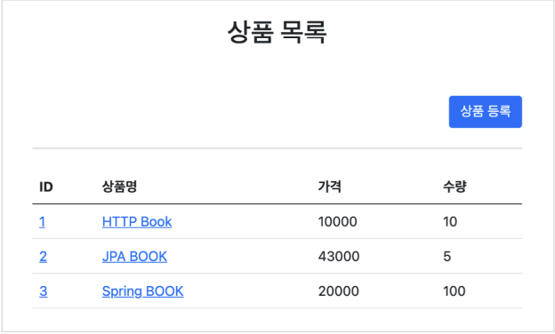
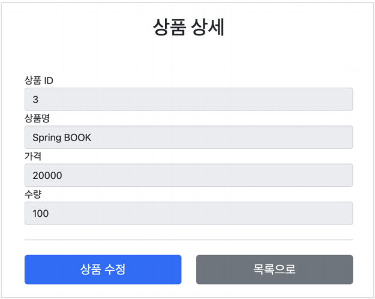
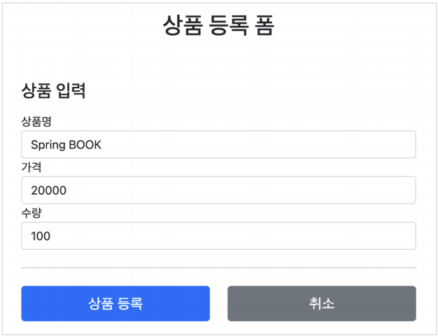
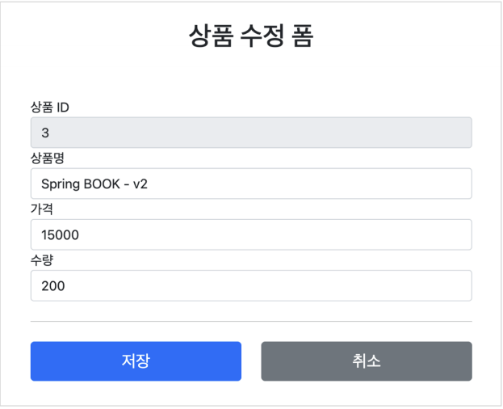
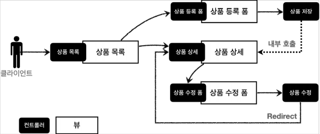
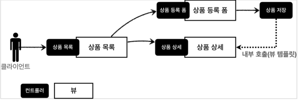
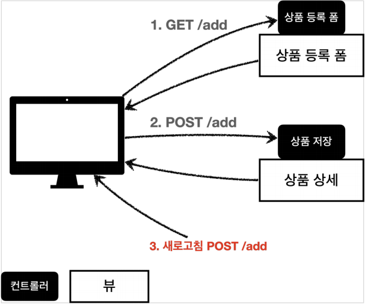
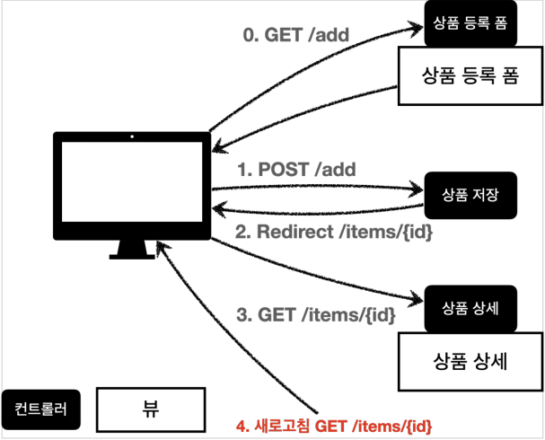

# 스프링 MVC - 웹 페이지 만들기
## 목차
- 프로젝트 생성
- 요구사항 분석
- 상품 도메인 개발
- 상품 서비스 HTML
- 상품 목록 - 타임리프
- 상품 상세
- 상품 등록 폼
- 상품 등록 처리 - @ModelAttribute
- 상품 수정
- PRG Post/Redirect/Get
- RedircetAttributes
___
## 프로젝트 생성
- <b>스프링 부트 스타터 사이트로 이동해서 스프링 프로젝트 생성</b>
    - https://start.spring.io
    - 프로젝트 생성
        - Project: Gradle Project
        - Language: Java
        - Spring Boot: 2.5.x
    - Project Metadata
        - Group: hello
        - Artifact: <b>item-service</b>
        - Name: item-service
        - Package name: <b>hello.itemservice</b>
        - Packaging: <b>Jar(주의!)</b>
        - Java: 11
    - Dependencies: <b>Spring web, Thymeleaf, Lombok</b>
- <b>build.gradle</b>
    ```gradle
    plugins {
    	id 'org.springframework.boot' version '2.5.0'
    	id 'io.spring.dependency-management' version '1.0.11.RELEASE'
    	id 'java'
    }

    group = 'hello'
    version = '0.0.1-SNAPSHOT'
    sourceCompatibility = '11'

    configurations {
    	compileOnly {
    		extendsFrom annotationProcessor
    	}
    }

    repositories {
    	mavenCentral()
    }

    dependencies {
    	implementation 'org.springframework.boot:spring-boot-starter-thymeleaf'
    	implementation 'org.springframework.boot:spring-boot-starter-web'
    	compileOnly 'org.projectlombok:lombok'
    	annotationProcessor 'org.projectlombok:lombok'
    	testImplementation 'org.springframework.boot:spring-boot-starter-test'
    }

    test {
    	useJUnitPlatform()
    }
    ```
- <b>동작 확인</b>
    - 기본 메인 클래스 실행(`SpringmvcApplication.main()`)
    - http://localhost:8080 호출해서 Whitelabel Error Page 나오면 정상 동작
### Welcome 페이지 추가
- 편리하게 사용할 수 있도록 Welcome 페이지를 추가하자.<br><br>
- `/resources/static/index.html`
    ```html
    <!DOCTYPE html>
    <html>
    <head>
        <meta charset="UTF-8">
        <title>Title</title>
    </head>
    <body>
    <ul>
        <li>상품 관리
            <ul>
                <li><a href="/basic/items">상품 관리 - 기본</a></li>
            </ul>
        </li>
    </ul>
    </body>
    </html>
    ```
- <b>동작 확인</b>
    - 기본 메인 클래스 실행(`SpringmvcApplication.main()`)
    - http://localhost:8080 호출해서 Welcome 페이지가 나오면 성공
___
## 요구사항 분석
- 상품을 관리할 수 있는 서비스를 만들어보자.<br><Br>
- <B>상품 도메인 모델</B>
    - 상품 ID
    - 상품명
    - 가격
    -수량
- <b>상품 관리 기능</b>
    - 상품 목록
    - 상품 상세
    - 상품 등록
    - 상품 수정
- <b>서비스 화면</b>
    - 
    - 
    - 
    - 
- <b>서비스 제공 흐름</b>
    - 
    - 요구사항이 정리되고 디자이너, 웹 퍼블리셔, 백엔드 개발자가 업무를 나누어 진행한다.
        - <b>디자이너:</b> 요구사항에 맞도록 디자인하고, 디자인 결과물을 웹 퍼블리셔에게 넘겨준다.
        - <b>웹 퍼블리셔:</b> 디자이너에게 받은 디자인을 기반으로 HTML, CSS를 만들어 개발자에게 제공한다.
        - <b>백엔드 개발자:</b> 디자이너, 웹 퍼블리셔를 통해 HTML 화면이 나오기 전까지의 시스템을 설계하고, 핵심 비즈니스 모델을 개발한다. 이후 HTML이 나오면 이 HTML을 뷰 템플릿으로 변환하여 동적으로 화면을 그리며, 또한 웹 화면의 흐름을 제어한다.
> <B>참고</B>
> - React, Vue.js 같은 웹 클라이언트 기술을 사용하고, 웹 프론트엔드 개발자가 별도로 있으면, 웹 프론트엔드 개발자가 웹 퍼블리셔 역할까지 포함해서 하는 경우도 있다.
> - 웹 클라이언트 기술을 사용하면, 웹 프론트엔드 개발자가 HTML을 동적으로 만드는 역할과, 웹 화면의 흐름을 담당한다.
> - 이 경우 백엔드 개발자는 HTML 뷰 템플릿을 직접 만지는 대신, HTTP API를 통해 웹 클라이언트가 필요로 하는 데이터와 기능을 제공하면 된다.
___
## 상품 도메인 개발
- <b>Item - 상품 객체</b>
    ```java
    @Getter
    @Setter
    public class Item {

        private Long id;
        private String itemName;
        private Integer price;
        private Integer quantity;

        public Item(){

        }

        public Item(String itemName, Integer price, Integer quantity) {
            this.itemName = itemName;
            this.price = price;
            this.quantity = quantity;
        }
    }
    ```
- <b>ItemRepository - 상품 저장소</b>
    ```java
    @Repository
    public class ItemRepository {

        // 실무에서는 반드시 ConcurrentHashMap, AtomicLong 사용할 것!
        private static final Map<Long, Item> store = new HashMap<>(); // static
        private static long sequence = 0L; // static

        public Item save(Item item){
            item.setId(++sequence);
            store.put(item.getId(), item);
            return item;
        }

        public Item findById(Long id){
            return store.get(id);
        }

        public List<Item> findAll(){
            // ArrayList로 감싸서 반환하면, 외부에서 store의 값을 바꾸지 않도록 할 수 있으므로 안전하다.
            return new ArrayList<>(store.values());
        }

        /**
         * Item 클래스와 중복되는 데이터가 ItemDTO 클래스에 존재하더라도,
         * id를 제외한 다른 데이터만 update 하기 위해, 명확한 ItemDTO 클래스를 만듦.
         * 따라서 개발자는 findItem.getId() 같은 불필요한 호출을 시도하지 않게 된다.
         * 중복 vs 명확성 = 명확성 Win
         */
        public void update(Long itemId, ItemDTO updateDTO) {
            Item findItem = findById(itemId);

            findItem.setItemName(updateDTO.getItemName());
            findItem.setPrice(updateDTO.getPrice());
            findItem.setQuantity(updateDTO.getQuantity());
        }

        public void clearStore(){
            store.clear();
        }
    }
    ```
- <b>ItemRepositoryTest - 상품 저장소 테스트</b>
    ```java
    class ItemRepositoryTest {

        ItemRepository itemRepository = new ItemRepository();

        @AfterEach
        void afterEach(){
            itemRepository.clearStore();
        }

        @Test
        void save(){
            //given
            Item item = new Item("itemA", 10000, 10);

            //when
            Item savedItem = itemRepository.save(item);

            //then
            Item findItem = itemRepository.findById(savedItem.getId());
            assertThat(findItem).isEqualTo(savedItem);
        }

        @Test
        void findAll(){
            //given
            Item item1 = new Item("item1", 10000, 10);
            Item item2 = new Item("item2", 20000, 20);
            itemRepository.save(item1);
            itemRepository.save(item2);

            //when
            List<Item> result = itemRepository.findAll();

            //then
            assertThat(result.size()).isEqualTo(2);
            assertThat(result).contains(item1, item2);
        }

        @Test
        void updateItem() {
            //given
            Item item1 = new Item("item1", 10000, 10);

            Item savedItem = itemRepository.save(item1);
            Long itemId = savedItem.getId();

            //when
            ItemDTO updateDTO = new ItemDTO("item2", 20000, 30);
            itemRepository.update(itemId, updateDTO);

            //then
            Item findItem = itemRepository.findById(itemId);

            assertThat(findItem.getItemName()).isEqualTo(updateDTO.getItemName());
            assertThat(findItem.getPrice()).isEqualTo(updateDTO.getPrice());
            assertThat(findItem.getQuantity()).isEqualTo(updateDTO.getQuantity());
        }
    }
    ```
___
## 상품 서비스 HTML
- 핵심 비즈니스 로직을 개발하는 동안, 웹 퍼블리셔는 HTML 마크업을 완료했다.
- 다음 파일들을 경로에 넣고 잘 동작하는지 확인해보자.<br><br>
- <b>부트스트랩</b>
    - 참고로 HTML을 편리하게 개발하기 위해 부트스트랩을 사용했다.
    - 먼저 필요한 부트스트랩 파일을 설치하자.
- <b>부트스트랩 공식 사이트:</b> https://getbootstrap.com
- <b>부트스트랩을 다운로드 받고 압축을 풀자.</b>
    - 이동: https://getbootstrap.com/docs/5.0/getting-started/download
    - Compiled CSS and JS 항목을 다운로드하자.
    - 압축을 풀고 `bootstrap.min.css`를 복사해서 다음 폴더에 추가하자
        - `resources/static/css/bootstrap.min.css`
> <b>참고</b>
> - 부트스트랩(Bootstrap)은 웹사이트를 쉽게 만들 수 있게 도와주는 HTML, CSS, JS 프레임워크이다.
> - 하나의 CSS로 휴대폰, 태블릿, 데스크탑까지 다양한 기기에서 작동한다.
> - 다양한 기능을 제공하여 사용자가 쉽게 웹사이트를 제작, 유지, 보수할 수 있도록 도와준다.
- <b>HTML, css 파일</b>
    - `/resources/static/css/bootstrap.min.css` -> 부트스트랩 다운로드
    - `/resources/static/html/items.html`
    - `/resources/static/html/item.html`
    - `/resources/static/html/addForm.html`
    - `/resources/static/html/editForm.html`
- 참고로 `/resource/static`에 넣어두었기 때문에, 스프링 부트가 정적 리소스를 제공한다.
    - http://localhost:8080/html/items.html
    - 그렌더 정적 리소스여서 <b>해당 파일을 탐색기를 통해 직접 열어도 동작</b>하는 것을 확인할 수 있다.
> <b>참고</b>
> - 이렇게 정적 리소스가 공개되는 `/resources/static` 폴더에 HTML을 넣어두면, 실제 서비스에서도 공개된다.
> - 서비스를 운영할때는, 지금처럼 공개할 필요 없는 HTML을 두는 것은 주의하자.
- <b>상품 목록 HTML</b>
    - `resources/static/html/imtes.html`
    ```html
    <!DOCTYPE HTML>
    <html>
    <head>
        <meta charset="utf-8">
        <link href="../css/bootstrap.min.css" rel="stylesheet">
    </head>
    <body>
    <div class="container" style="max-width: 600px">
        <div class="py-5 text-center">
            <h2>상품 목록</h2>
        </div>
        <div class="row">
            <div class="col">
                <button class="btn btn-primary float-end"
                        onclick="location.href='addForm.html'" type="button">상품 등록</button>
            </div>
        </div>
        <hr class="my-4">
        <div>
            <table class="table">
                <thead>
                <tr> <th>ID</th>
                    <th>상품명</th>
                    <th>가격</th>
                    <th>수량</th>
                </tr>
                </thead>
                <tbody>
                <tr>
                    <td><a href="item.html">1</a></td>
                    <td><a href="item.html">테스트 상품1</a></td>
                    <td>10000</td>
                    <td>10</td>
                </tr>
                <tr>
                    <td><a href="item.html">2</a></td>
                    <td><a href="item.html">테스트 상품2</a></td>
                    <td>20000</td>
                    <td>20</td>
                </tr>
                </tbody>
            </table>
        </div>
    </div> <!-- /container -->
    </body>
    </html>
    ```
- <b>상품 상세 HTML</b>
    - `resources/static/html/item.html`
    ```html
    <!DOCTYPE HTML>
    <html>
    <head>
        <meta charset="utf-8">
        <link href="../css/bootstrap.min.css" rel="stylesheet">
        <style> .container {
            max-width: 560px;
        }
        </style>
    </head>
    <body>
    <div class="container">
        <div class="py-5 text-center">
            <h2>상품 상세</h2>
        </div>
        <div>
            <label for="itemId">상품 ID</label>
            <input type="text" id="itemId" name="itemId" class="form-control"
                   value="1" readonly>
        </div>
        <div>
            <label for="itemName">상품명</label>
            <input type="text" id="itemName" name="itemName" class="form-control"
                   value="상품A" readonly>
        </div>
        <div>
            <label for="price">가격</label>
            <input type="text" id="price" name="price" class="form-control"
                   value="10000" readonly>
        </div>
        <div>
            <label for="quantity">수량</label>
            <input type="text" id="quantity" name="quantity" class="form-control"
                   value="10" readonly>
        </div>
        <hr class="my-4">
        <div class="row">
            <div class="col">
                <button class="w-100 btn btn-primary btn-lg"onclick="location.href='editForm.html'" type="button">상품 수정</button>
            </div>
            <div class="col">
                <button class="w-100 btn btn-secondary btn-lg"
                        onclick="location.href='items.html'" type="button">목록으로</button>
            </div>
        </div>
    </div> <!-- /container -->
    </body>
    </html>
    ```
- <B>상품 등록 폼 HTML</B>
    - `resources/static/html/addForm.html`
    ```html
    <!DOCTYPE HTML>
    <html>
    <head>
        <meta charset="utf-8">
        <link href="../css/bootstrap.min.css" rel="stylesheet">
        <style>
            .container {
                max-width: 560px;
            }
        </style>
    </head>
    <body>
    <div class="container">
        <div class="py-5 text-center">
            <h2>상품 등록 폼</h2>
        </div>
        <h4 class="mb-3">상품 입력</h4>
        <form action="item.html" method="post">
            <div>
                <label for="itemName">상품명</label>
                <input type="text" id="itemName" name="itemName" class="form-control" placeholder="이름을 입력하세요">
            </div>
            <div>
                <label for="price">가격</label>
                <input type="text" id="price" name="price" class="form-control" placeholder="가격을 입력하세요">
            </div>
            <div>
                <label for="quantity">수량</label>
                <input type="text" id="quantity" name="quantity" class="form-control" placeholder="수량을 입력하세요">
            </div>
            <hr class="my-4">
            <div class="row">
                <div class="col">
                    <button class="w-100 btn btn-primary btn-lg" type="submit">상품
                        등록</button>
                </div>
                <div class="col">
                    <button class="w-100 btn btn-secondary btn-lg"
                            onclick="location.href='items.html'" type="button">취소</button>
                </div>
            </div>
        </form>
    </div> <!-- /container -->
    </body>
    </html>
    ```
- <b>상품 수정 폼 HTML</b>
    - `resources/static/html/editForm.html`
    ```html
    <!DOCTYPE HTML>
    <html>
    <head>
        <meta charset="utf-8">
        <link href="../css/bootstrap.min.css" rel="stylesheet">
        <style>
            .container {
                max-width: 560px;
            }
        </style>
    </head>
    <body>
    <div class="container">
        <div class="py-5 text-center">
            <h2>상품 수정 폼</h2>
        </div>
        <form action="item.html" method="post">
            <div>
                <label for="id">상품 ID</label>
                <input type="text" id="id" name="id" class="form-control" value="1"
                       readonly>
            </div>
            <div>
                <label for="itemName">상품명</label>
                <input type="text" id="itemName" name="itemName" class="form-control" value="상품A">
            </div>
            <div>
                <label for="price">가격</label>
                <input type="text" id="price" name="price" class="form-control"
                       value="10000">
            </div>
            <div>
                <label for="quantity">수량</label>
                <input type="text" id="quantity" name="quantity" class="form-control" value="10">
            </div> <hr class="my-4">
            <div class="row">
                <div class="col">
                    <button class="w-100 btn btn-primary btn-lg" type="submit">저장</button>
                </div>
                <div class="col">
                    <button class="w-100 btn btn-secondary btn-lg"
                            onclick="location.href='item.html'" type="button">취소</button>
                </div>
            </div>
        </form>
    </div> <!-- /container -->
    </body>
    </html>    
    ```
___
## 상품 목록 - 타임리프
- 본격적으로 컨트롤러와 뷰 템플릿을 개발해보자.<br><br>
- <b>BasicItemController</b>
    ```java
    @Controller
    @RequestMapping("/basic/items")
    @RequiredArgsConstructor
    public class BasicItemController {
        // lombok 이용 자동 생성자 주입
        private final ItemRepository itemRepository;

        @GetMapping
        public String items(Model model){
            List<Item> items = itemRepository.findAll();
            model.addAttribute("items", items);
            return "basic/items";
        }

        /**
         * 테스트용 데이터 추가
         */
        @PostConstruct
        public void init(){
            itemRepository.save(new Item("itemA", 10000, 10));
            itemRepository.save(new Item("itemB", 20000, 20));

        }
    }
    ```
    - 컨트롤러 로직은 itemRepository에서 모든 상품을 조회한 다음에 모델에 담는다. 그리고 뷰 템플릿을 호출한다.
    - `@RequiredArgsConstructor`
        - `final`이 붙은 멤버변수만 사용하여 생성자를 자동으로 만들어준다.
            ```java
            public BasicItemController(ItemRepository itemRepository) {
                this.itemRepository = itemRepository;
            }
            ```
            - 이렇게 생성자가 딱 1개만 있으면, 스프링이 해당 생성자에 `@Autowired`로 의존관계를 주입해준다.
            - 따라서 <b>final 키워드를 빼면 안된다!</b> 그러면 `ItemRepository` 의존관계 주입이 안된다.
    - <b>테스트용 데이터 추가</b>
        - 테스트용 데이터가 없으면 회원 목록 기능이 정상 동작하는지 확인하기 어렵다.
        - `@PostConstruct`: 해당 빈의 의존관계가 모두 주입되고 나면, 초기화 용도로 호출된다.
        - 여기서는 간단히 테스트용 데이터를 넣기 위해서 사용했다.
- <b>items.html 정적 HTML을 뷰 템플릿(templates) 영역으로 복사하고, 다음과 같이 수정하자.</b>
    - `/resources/static/items.html` -> 복사 -> `/resources/templates/basic/items.html`
    ```html
    <!DOCTYPE HTML>
    <html xmlns:th="http://www.thymeleaf.org">
    <head>
        <meta charset="utf-8">
        <link th:href="@{/css/bootstrap.min.css}"
                href="../css/bootstrap.min.css" rel="stylesheet">
    </head>
    <body>
    <div class="container" style="max-width: 600px">
        <div class="py-5 text-center">
            <h2>상품 목록</h2>
        </div>
        <div class="row">
            <div class="col">
                <button class="btn btn-primary float-end"
                        onclick="location.href='addForm.html'"
                        th:onclick="|location.href='@{/basic/items/add}'|"
                        type="button">상품 등록</button>
            </div>
        </div>
        <hr class="my-4">
        <div>
            <table class="table">
                <thead>
                <tr> <th>ID</th>
                    <th>상품명</th>
                    <th>가격</th>
                    <th>수량</th>
                </tr>
                </thead>
                <tbody>
                <tr th:each="item : ${items}">
                    <td><a href="item.html" th:href="@{/basic/items/{itemId}(itemId=${item.id})}" th:text="${item.id}">회원id</a></td>
                    <td><a href="item.html" th:href="@{|/basic/items/${item.id}|}" th:text="${item.itemName}">상품명</a></td>
                    <td th:text="${item.price}">가격</td>
                    <td th:text="${item.quantity}">수량</td>
                </tr>
                </tbody>
            </table>
        </div>
    </div> <!-- /container -->
    </body>
    </html>
    ```
### 타임리프 간단히 알아보기
- <b>타임리프 사용 선언</b>
    - `<html xmlns:th="http://www.thymeleaf.org">`
- <B>속성 변경 - th:herf</B>
    - `th:href="@{/css/bootstrap.min.css}"`
        - `href="value1"`을 `th:href="value2"`의 값으로 변경한다.
        - 타임리프 뷰 템플릿을 거치게 되면, 원래 값을 `th:xxx` 값으로 변경한다. 만약 값이 없다면 새로 생성한다.
        - HTML을 그대로 볼 때는 `href` 속성이 사용되고, 뷰 템플릿을 거치면 `th:href`의 값이 `href`로 대체되면서 동적으로 변경할 수 있다.
        - 대부분의 HTML 속성을 `th:xxx`으로 변경할 수 있다.
- <b>타임리프 핵심</b>
    - 핵심은 `th:xxx`가 붙은 부분은 서버사이드에서 렌더링되고, 기존 것을 대체한다. `th:xxx`이 없으면 기존 html의 `xxx` 속성이 그대로 사용된다.
    - HTML을 파일로 직접 열었을 때, `th:xxx`가 있어도 웹 브라우저는 `th:` 속성을 알지 못하므로 무시한다.
    - 따라서 HTML을 파일 보기를 유지하면서 템플릿 기능도 할 수 있다.
- <b>URL 링크 표현식 - @{...}</b>
    - `th:href="@{/css/bootstrap.min.css}"`
        - `@{...}`: 타임리프는 URL 링크를 사용하는 경우 `@{...}`를 사용한다. 이것을 URL 링크 표현식이라 한다.
        - URL 링크 표현식을 사용하면 서블릿 컨텍스트를 자동으로 포함한다.
- <b>상품 등록 폼으로 이동</b>
    - <b>속성 변경 - th:onclick</b>
        - `onclick="location.href='addForm.html'"`
        - `th:onclick="|location.href='@{/basic/items/add}'|"`
            - 여기에는 리터럴 대체 문법이 사용되었다.
            - <b>리터럴 대체 - |...|</b>
                - `|...|` 이렇게 사용한다.
                - 타임리프에서 문자와 표현식 등은 분리되어 있기 때문에, 더해서 사용해야 한다.
                    - `<span th:text="'Welcome to our application, ' + ${user.name} + '!'">`
                - 다음과 같이 리터럴 대체 문법을 사용하면, 더하기 없이 편리하게 사용할 수 있다.
                    - `<span th:text="|Welcome to our application, ${user.name}!">`
        - 결과를 다음과 같이 만들어야 한다.
            - `location.href='/basic/items/add'`
        - 그냥 사용하면 문자와 표현식을 각각 따로 더하여 사용해야 하므로 복잡하다.
            - `th:onclick="'location.href=' + '\'' + @{/basic/items/add} + '\''"`
        - 리터럴 대체 문법을 사용하면 다음과 같이 편리하게 사용할 수 있다.
            - `th:onclick="|location.href='@{/basic/items/add}'|"`
- <b>반복 출력 - th:each</b>            
    - `<tr th:each="item : ${items}">`
    - 반복은 `th:each`를 사용한다. 이렇게 하면 모델에 포함된 `items` 컬렉션 데이터가 `item` 변수에 하나씩 포함되고, 반복문 안에서 `item` 변수를 사용할 수 있다.
    - 컬렉션의 수 만큼 `<tr>..</tr>`이 하위 태그를 포함하여 생성된다.
- <b>변수 표현식 - ${...}</b>
    - `<td th:text="${item.price}">가격</td>`
    - 모델에 포함된 값이나, 타임리프 변수로 선언한 값을 조회할 수 있다.
    - 프로퍼티 접근법을 사용한다. (`item.getPrice()`)
- <b>내용 변경 - th:text</b>
    - `<td th:text="${item.price}">가격</td>`
    - 내용의 값을 `th:text`의 값으로 변경한다.
    - 여기서는 가격을 `${item.price}`의 값으로 변경한다.
- <b>URL 링크 표현식 2 - @{...}</b>
    - `th:href="@{/basic/items/{itemId}(itemId=${item.id})}"`
    - 상품 ID를 선택하는 링크를 확인해보자.
    - URL 링크 표현식을 사용하면 경로를 템플릿처럼 편리하게 사용할 수 있다.
    - 경로 변수(`{itemID}`)뿐만 아니라 쿼리 파라미터도 생성 가능하다.
        > ex) `th:href="@{/basic/items/{itemID}(itemId=${item.id}, query='test')}"`
        > - 생성 링크: `http://localhost:8080/basic/items/1?query=test`
- <b>URL 링크 간단히</b>
    - `th:href="@{|/basic/items/${item.id}|}"`
    - 상품 이름을 선택하는 링크를 확인해보자.
    - 리터럴 대체 문법을 활용하여 간단히 사용할 수도 있다.
> <B>참고</B>
> - 타임리프는 순서 HTML을 파일을 웹 브라우저에서 열어도 내용을 확인할 수 있고, 서버를 통해 뷰 템플릿을 거치면 동적으로 변경된 결과를 확인할 수 있다.
> - JSP를 생각해보면, JSP 파일은 웹 브라우저에서 그냥 열면 JSP 소스코드와 HTML이 뒤죽박죽 섞여 정상적인 확인이 불가능하다. 오직 서버를 통해서 JSP를 열어야 한다.
> - 이렇게 <b>순수 HTML을 그대로 유지하면서 뷰 템플릿도 사용할 수 있는 타임리프의 특징으 네츄럴 템플릿</b>(natural templates)이라 한다.
___
## 상품 상세
- 상품 상세 컨트롤러와 뷰를 개발하자.<br><Br>
- <b>BasicItemController에 추가</b>
    ```java
    @GetMapping("/{itemId}")
    public String item(@PathVariable long itemId, Model model){
        Item item = itemRepository.findById(itemId);
        model.addAttribute("item", item);
        return "basic/item";
    }
    ```
    - `@PathVariable`로 넘어온 상품ID로 상품을 조회하고, 모델에 담아둔다. 그리고 뷰 템플릿을 호출한다.
- <b>상품 상세 뷰</b>
    - 정적 HTML을 뷰 템플릿(templates) 영역으로 복사하고 다음과 같이 수정하자.
        - `/resources/static/item.html` -> 복사 -> `/resources/templates/basic/item.html`
        ```html
        <!DOCTYPE HTML>
        <html xmlns:th="http://www.thymeleaf.org">
        <head>
            <meta charset="utf-8">
            <link th:href="@{/css/bootstrap.min.css}"
                    href="../css/bootstrap.min.css" rel="stylesheet">
            <style> .container {
                max-width: 560px;
            }
            </style>
        </head>
        <body>
        <div class="container">
            <div class="py-5 text-center">
                <h2>상품 상세</h2>
            </div>
            <div>
                <label for="itemId">상품 ID</label>
                <input type="text" id="itemId" name="itemId" class="form-control"
                       value="1" th:value="${item.id}" readonly>
            </div>
            <div>
                <label for="itemName">상품명</label>
                <input type="text" id="itemName" name="itemName" class="form-control"
                       value="상품A" th:value="${item.itemName}" readonly>
            </div>
            <div>
                <label for="price">가격</label>
                <input type="text" id="price" name="price" class="form-control"
                       value="10000" th:value="${item.price}" readonly>
            </div>
            <div>
                <label for="quantity">수량</label>
                <input type="text" id="quantity" name="quantity" class="form-control"
                       value="10" th:value="${item.quantity}" readonly>
            </div>
            <hr class="my-4">
            <div class="row">
                <div class="col">
                    <button class="w-100 btn btn-primary btn-lg"
                            onclick="location.href='editForm.html'"
                            th:onclick="|location.href='@{/basic/items/{itemId}/edit(itemId=${item.id})}'|"
                            type="button">상품 수정</button>
                </div>
                <div class="col">
                    <button class="w-100 btn btn-secondary btn-lg"
                            onclick="location.href='items.html'"
                            th:onclick="|location.href='@{/basic/items}'|"
                            type="button">목록으로</button>
                </div>
            </div>
        </div> <!-- /container -->
        </body>
        </html>
        ```
    - <b>속성 변경 - th:value</b>
        - `th:value="${item.id}"`
        - 모델에 있는 item 정보를 획득하고, 프로퍼티 접근법으로 출력한다. (`item.getId()`)
        - `value` 속성을 `th:value` 속성으로 변경한다.
    - <b>상품 수정 링크</b>
        - `th:onclick="|location.href='@{/basic/items/{itemId}/edit(itemId=${item.id})}'|"`
    - <b>목록으로 링크</b>
        - `th:onclick="|location.href='@{/basic/items}'|"`
___
## 상품 등록 폼
- <b>BasicItemController에 추가</b>
    ```java
    @GetMapping("/add")
    public String addForm(){
        return "basic/addForm";
    }
    ```
    - 상품 등록 폼은 단순히 뷰 템플릿만 호출한다.
- <b>상품 등록 폼 뷰</b>
    - 정적 HTML을 뷰 템플릿(templates) 영역으로 복사하고 다음과 같이 수정하자.
        - `/resources/static/addForm.html` -> 복사 -> `/resources/templates/basic/addForm.html`
        ```html
        <!DOCTYPE HTML>
        <html xmlns:th="http://www.thymeleaf.org">

        <head>
            <meta charset="utf-8">
            <link th:href="@{/css/bootstrap.min.css}"
                  href="../css/bootstrap.min.css" rel="stylesheet">
            <style>
                .container {
                    max-width: 560px;
                }
            </style>
        </head>
        <body>
        <div class="container">
            <div class="py-5 text-center">
                <h2>상품 등록 폼</h2>
            </div>
            <h4 class="mb-3">상품 입력</h4>
            <form action="item.html" th:action method="post">
                <div>
                    <label for="itemName">상품명</label>
                    <input type="text" id="itemName" name="itemName" class="form-control" placeholder="이름을 입력하세요">
                </div>
                <div>
                    <label for="price">가격</label>
                    <input type="text" id="price" name="price" class="form-control" placeholder="가격을 입력하세요">
                </div>
                <div>
                    <label for="quantity">수량</label>
                    <input type="text" id="quantity" name="quantity" class="form-control" placeholder="수량을 입력하세요">
                </div>
                <hr class="my-4">
                <div class="row">
                    <div class="col">
                        <button class="w-100 btn btn-primary btn-lg" type="submit">상품 등록</button>
                    </div>
                    <div class="col">
                        <button class="w-100 btn btn-secondary btn-lg"
                                onclick="location.href='items.html'"
                                th:onclick="|location.href='@{/basic/items}'|"
                                type="button">취소</button>
                    </div>
                </div>
            </form>
        </div> <!-- /container -->
        </body>
        </html>
        ```
    - <b>속성 변경 - th:action</b>
        - `th:action`
        - HTML form에서 `action`에 값이 없으면, 현재 URL에 데이터를 전송한다.
        - 상품 등록 폼의 URL과 실제 상품 등록을 처리하는 URL을 똑같이 맞추고 HTTP 메소드로 두 기능을 구분한다.
            - 상품 등록 폼: GET `/basic/items/add`
            - 상품 등록 처리 : POST `/basic/items/add`
        - 이렇게 하면 하나의 URL로 등록 폼과 등록 처리를 깔끔하게 처리할 수 있다.
    - <b>취소</b>
        - 취소 시 상품 목록으로 이동한다.
        - `th:onclick="|location.href='@{/basic/items}'|"`
___
## 상품 등록 처리 - @ModelAttribute
- 이제 상품 등록 폼에서 전달된 데이터로 실제 상품을 등록 처리해보자.
- 상품 등록 폼은 다음 방식으로 서버에 데이터를 전달한다.<br><Br>
- <b>POST - HTML Form</b>
    - `content-type: application/x-www-form-urlencoded`
    - 메시지 바디에 쿼리 파라미터 형식으로 전달 `itemName=itemA&price=10000&quantity=10`
    > ex) 회원 가입, 상품 주문, HTML Form 사용
- 요청 파라미터 형식을 처리해야 하므로 `@RequestParam`을 사용하자
### 상품 등록 처리 - @RequestParam
- <B>addItemV1 - BasicItemController에 추가</B>
    ```java
    @PostMapping("/add")
    public String addItemV1(@RequestParam String itemName,
                       @RequestParam int price,
                       @RequestParam Integer quantity,
                       Model model) {
        Item item = new Item();
        item.setItemName(itemName);
        item.setPrice(price);
        item.setQuantity(quantity);

        itemRepository.save(item);

        model.addAttribute("item", item);

        return "basic/item";
    }
    ```
    - 먼저 `@RequestParam String itemName`: itemName 요청 파라미터 데이터를 해당 변수에 받는다.
    - `Item` 객체를 생성하고 `itemRepository`를 통해 저장한다.
    - 저장된 `item`을 모델에 담아 뷰에 전달한다.<br><br>
    - <b>중요:</b> 여기서는 상품 상세에서 사용한 `item.html` 뷰 템플릿을 그대로 재활용한다.
### 상품 등록 처리 - @ModelAttribute
- `@RequestParam`으로 변수를 하나 하나 받아서 `Item`을 생성하는 과정은 불편했다.
- 이번에는 `@ModelATtribute`를 사용해서 한 번에 처리해보자.<br><br>
- <B>addItemV2 - 상품 등록 처리 - ModelAttribute</B>
    ```java
    /**
     * @ModelAttribute("item") Item item
     * model.addAttribute("item", item); 자동 추가
     */
    @PostMapping("/add")
    public String addItemV2(@ModelAttribute("item") Item item) {
        itemRepository.save(item);
        //model.addAttribute("item", item); // 자동 추가, 생략 가능

        return "basic/item";
    }
    ```
    - <b>@ModelAttribute - 요청 파라미터 처리</b>
        - `@ModelAttribute`는 `item` 객체를 생성하고, 요청 파라미터의 값을 프로퍼티 접근법(setXxx)으로 입력해준다.
    - <b>@ModelAttribute - Model 추가</b>
        - `@ModelAttribute`는 중요한 한 가지 기능이 더 있는데, 바로 모델(Model)에 `@ModelAttribute`로 지정한 객체를 자동으로 넣어준다.
        - 지금 코드를 보면 `model.addAttribute("item", item)`이 주석처리 되어 있어도 잘 동작하는 것을 확인할 수 있다.<br><br>
        - 모델에 데이터를 담을 때는 이름이 필요하다. 이름은 `@ModelAttribute`에 지정한 `name(value)` 속성을 사용한다.
        - 만약 다음과 같이 `@ModelAttribute`의 이름을 다르게 지정하면 다른 이름으로 모델에 포함된다.
            - `@ModelAttribute("hello") Item item` -> 이름을 `hello`로 지정
            - `@model.addAttribute("hello", item);` -> 모델에 `hello` 이름으로 지정
    - <b>주의!</b>
        - 실행 전에 이전 버전인 `addItemV1`에 `@PostMapping("/add")`를 꼭 주석 처리 해주어야 한다. 그렇지 않으면 중복 매핑으로 오류가 발생한다.
- <b>addItemV3 - 상품 등록 처리 - ModelAttribute 이름 생략</b>
    ```java
    /**
     * @ModelAttribute name 생략 가능
     * model.addAttribute(item); 자동 추가, 생략 가능
     * 생략시 model에 저장되는 name은 클래스명 첫 글자만 소문자로 등록 Item -> item
     */
    @PostMapping("/add")
    public String addItemV3(@ModelAttribute Item item) {
        itemRepository.save(item);

        return "basic/item";
    }
    ```
    - `@ModelAttribute`의 이름을 생략할 수 있다.<br><br>
    - <b>주의</b>
        - `@ModelAttribute`의 이름을 생략하면 모델에 저장될 때 클래스 명을 사용한다. 이 때 <b>클래스의 첫 글자만 소문자로 변경</b>하여 등록한다.
            > ex) `@ModelATtribute` 클래스 명 -> 모델에 자동 추가되는 이름
            > - `Item` -> `item`
            > - `HelloWorld` -> `helloWorld`
- <b>addItemV4 - 상품 등록 처리 - ModelAttribute 전체 생략</b>
    ```java
    /**
     * @ModelAttribute 자체 생략 가능
     * model.addAttribute(item) 자동 추가
     */
    @PostMapping("/add")
    public String addItemV4(Item item) {
        itemRepository.save(item);

        return "basic/item";
    }
    ```
    - `@ModelAttribute` 자체도 생략 가능하다. 대상 객체는 모델에 자동 등록된다. 나머지 사항은 기존과 동일하다.
___
## 상품 수정
- <b>상품 수정 폼 컨트롤러</b>
    ```java
    @GetMapping("/{itemId}/edit")
    public String editForm(@PathVariable Long itemId, Model model) {
        Item item = itemRepository.findById(itemId);
        model.addAttribute("item", item);
        return "basic/editForm";
    }
    ```
    - 수정에 필요한 정보를 조회하고, 수정용 폼 뷰를 호출한다.
- <b>상품 수정 폼 뷰</b>
    - 정적 HTML을 뷰 템플릿(templates) 영역으로 복사하고 다음과 같이 수정하자.
        - `/resources/static/editForm.html` -> 복사 -> `/resources/templates/basic/editForm.html`
    ```html
    <!DOCTYPE HTML>
    <html xmlns:th="http://www.thymeleaf.org">
    <head>
        <meta charset="utf-8">
        <link th:href="@{/css/bootstrap.min.css}"
                href="../css/bootstrap.min.css" rel="stylesheet">
        <style>
            .container {
                max-width: 560px;
            }
        </style>
    </head>
    <body>
    <div class="container">
        <div class="py-5 text-center">
            <h2>상품 수정 폼</h2>
        </div>
        <form action="item.html" th:action method="post">
            <div>
                <label for="id">상품 ID</label>
                <input type="text" id="id" name="id" class="form-control" value="1"
                       th:value="${item.id}"
                       readonly>
            </div>
            <div>
                <label for="itemName">상품명</label>
                <input type="text" id="itemName" name="itemName" class="form-control"
                       value="상품A"
                       th:value="${item.itemName}">
            </div>
            <div>
                <label for="price">가격</label>
                <input type="text" id="price" name="price" class="form-control"
                       value="10000"
                       th:value="${item.price}">
            </div>
            <div>
                <label for="quantity">수량</label>
                <input type="text" id="quantity" name="quantity" class="form-control"
                       value="10"
                       th:value="${item.quantity}">
            </div> <hr class="my-4">
            <div class="row">
                <div class="col">
                    <button class="w-100 btn btn-primary btn-lg" type="submit">저장</button>
                </div>
                <div class="col">
                    <button class="w-100 btn btn-secondary btn-lg"
                            onclick="location.href='item.html'"
                            th:onclick="|location.href='@{/basic/items/{itemId}(itemId=${item.id})}'|"
                            type="button">취소</button>
                </div>
            </div>
        </form>
    </div> <!-- /container -->
    </body>
    </html>
    ```
- <b>상품 수정 개발</b>
    ```java
    @PostMapping("/{itemId}/edit")
    public String edit(@PathVariable Long itemId, @ModelAttribute ItemDTO itemDTO) {
        itemRepository.update(itemId, itemDTO);
        return "redirect:/basic/items/{itemId}";
    }
    ```
    - 상품 수정은 상품 등록과 전체 프로세스가 유사하다.
        - GET `/items/{itemId}/edit`: 상품 수정 폼
        - POST `/items/{itemId}/edit`: 상품 수정 처리
    - <b>리다이렉트</b>
        - 상품 수정은 마지막에 뷰템플릿을 호출하는 대신, 상품 상세 화면으로 이동하도록 리다이렉트를 호출한다.
        - 스프링은 `redirect:/...`으로 편리하게 리다이렉트를 지원한다.
        - `redirect:/basic/items/{itemId}`
            - 컨트롤러에 매핑된 `@PathVariable`의 값은 `redirect`에도 사용할 수 있다.
            - `redirect:/basic/items/{itemId}` -> `{itemId}`는 `@PathVariable Long itemId`의 값을 그대로 사용한다.
    > <b>참고</b>
    > - HTML Form 전송은 PUT, PATCH를 지원하지 않는다. GET, POST만 사용할 수 있다.
    > - PUT, PATCH는 HTTP API 전송 시에 사용한다.
    > - 스프링에서 HTTP POST로 Form 요청할 때 히든 필드를 통해 PUT, PATCH 매핑을 사용하는 방법도 있지만, HTTP 요청상 POST 요청이다.
___
## PRG Post/Redirect/Get
- 사실 지금까지 진행한 상품 등록 처리 컨트롤러는 심각한 문제가 있다. (addItemV1 ~ addItemV4)
- 상품 등록을 완료하고, 웹 브라우저의 새로고침 버튼을 클릭해보자.
    - 상품이 계속해서 중복 등록되는 것을 확인할 수 있다.
- <b>전체 흐름</b>
    - 
    - 그 이유는 다음 그림을 통해 확인할 수 있다.
- <b>POST 등록 후 새로 고침</b>
    - 
    - 웹 브라우저의 새로 고침은 마지막에 서버로 전송한 데이터를 다시 전송한다.
    - 상품 등록 폼에서 데이터를 입력하고 저장을 선택하면 `POST /add` + 상품 데이터를 서버로 전송한다.
    - 이 상태에서 새로 고침을 또 선택하면 마지막에 전송한 `POST /add` + 상품 데이터를 서버로 다시 전송하게 된다.
    - 이 문제를 어떻게 해결할 수 있을까?
- <b>POST, Redirect GET</b>
    - 
    - 웹 브라우저의 새로 고침은 마지막에 서버로 전송한 데이터를 다시 전송한다.
    - 새로 고침 문제를 해결하려면, 상품 저장 후에 뷰 템플릿으로 이동하는 것이 아니라, 상품 상세 화면으로 리다이렉트를 호출해주면 된다.
    - 웹 브라우저는 리다이렉트의 영향으로 상품 저장 후에 실제 상품 상세 화면으로 다시 이동한다.
        - 따라서 마지막에 호출한 내용이 상품 상세 화면인 `GET /items/{id}`가 되는 것이다.
    - 이후 새로고침을 해도 상품 상세 화면으로 이동하게 되므로 새로 고침 문제를 해결할 수 있다.
- <b>BasicItemController에 추가</b>
    ```java
    @PostMapping("/add")
    public String addItemV5(Item item) {
        itemRepository.save(item);

        return "redirect:/basic/items/" + item.getId();
    }
    ```
    - 상품 등록 처리 이후에 뷰 템플릿이 아닌, 상품 상세 화면으로 리다이렉트 하도록 코드를 작성해보자.
    - 이런 문제 해결 방식을 `PRG Post/Redirect/Get`이라 한다.
> <b>주의</b>
> - `"redirect:/basic/items/" + item.getId()` redirect에서 `+item.getId()`처럼 URL에 변수를 더해 사용하는 것은 URL 인코딩이 안되기 때문에 위험하다.
> - 다음에 설명하는 `RedirectAttributes`를 사용하자.

> <b>참고</b>
> - PRG 패턴을 사용하면 중복 호출을 확률적으로 상당히 많이 줄일 수는 있지만, POST의 중복을 궁극적으로 막기는 불가능하다.
>   - ex) POST 요청이 처리되어 응답이 오기 전, 새로고침 버튼을 클릭하여 중복 요청하는 경우(즉, 응답이 늦어져서 기다리는 상황에 새로고침)
> - 그러므로 서버에서 중복을 체크하도록 로직을 추가로 개발해야 한다.
___
## RedirectAttributes
- 상품을 저장하고 상품 상세 화면으로 리다이렉트 한 것까지는 좋았다. 그런데 고객 입장에서 저장이 잘 된 것인지 아닌지 확신이 들지 않는다.
- 그래서 저장이 잘 되었으면 상품 상세 화면에 "저장 완료"라는 메시지를 보여달라는 요구사항이 왔다. 간단히 해결해보자.<br><br>
- <b>BasicItemController에 추가</b>
    ```java
    /**
     * RedirectAttributes
     */
    @PostMapping("/add")
    public String addItemV6(Item item, RedirectAttributes redirectAttributes) {
        Item savedItem = itemRepository.save(item);
        redirectAttributes.addAttribute("itemId", savedItem.getId());
        redirectAttributes.addAttribute("status", true);

        return "redirect:/basic/items/{itemId}";
    }
    ```
    - 리다이렉트 할 때 간단히 `status=true`를 추가해보자. 그리고 뷰 템플릿에서 이 값이 있으면, "저장 완료" 라는 메시지를 출력해보자.<br><br>
    - 실행해보면 다음과 같은 리다이렉트 결과가 나온다.
        - `http://localhost:8080/basic/items/3?status=true`
    - <b>RedirectAttributes</b>
        - `RedirectAttributes`를 사용하면 URL 인코딩도 해주고, `pathVariable`, 쿼리 파라미터까지 처리해준다.
        - `redirect:/basic/items/{itemId}`
            - pathVariable 바인딩: `{itemId}`
            - 나머지는 쿼리 파라미터로 처라: `?status=true`
- <b>뷰 템플릿 메시지 추가</b>
    - `resources/templates/basic/item.html`
    ```html
    <div class="container">
        <div class="py-5 text-center">
            <h2>상품 상세</h2>
        </div>

        <!-- 추가 -->
        <h2 th:if="${param.status}" th:text="'저장 완료'"></h2>
        ...
    ```
    - `th:if`: 해당 조건이 참이면 실행
    - `${param.status}`: 타임리프에서 쿼리 파라미터를 편리하게 조회하는 기능
        - 원래는 컨트롤러에서 모델에 직접 담고 값을 꺼내야 한다. 그런데 쿼리 파라미터는 자주 사용해서 타임리프에서 직접 지원한다.
    - 뷰 템플릿에 메시지를 추가하고 실행해보면 "저장 완료"라는 메시지가 나오는 것을 확인할 수 있다.
    - 물론 상품 목록에서 상품 상세로 이동한 경우에는 해당 메시지가 출력되지 않는다.