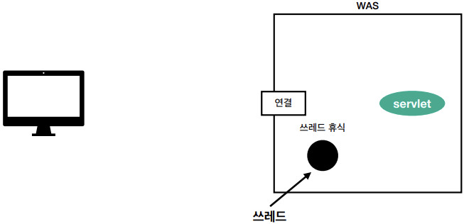
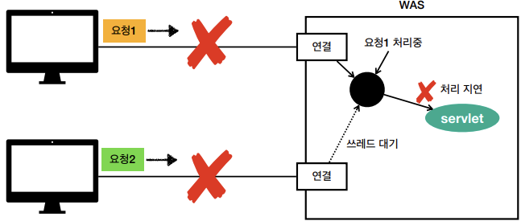

# 웹 애플리케이션 이해
## 목차
- 웹 서버, 웹 애플리케이션 서버
- 서블릿
- 동시 요청 - 멀티 스레드
- HTML, HTTP API, CSR, SSR
- 자바 백엔드 웹 기술 역사
___
## 웹 서버, 웹 애플리케이션 서버
### 웹 - HTTP 기반

### 모든 것이 HTTP
- <b>HTTP 메시지에 모든 것을 전송</b>  
- HTML, TEXT
- IMAGE, 음성, 영상, 파일
- JSON, XML (API)
- 거의 모든 형태의 데이터 전송 가능
- 서버간에 데이터를 주고 받을 때도, 대부분 HTTP 사용
- <b>지금은 HTTP 시대!</b>
### 웹 서버(Web Server)
- HTTP 기반으로 동작
- <b>정적 리소스 제공, 기타 부가기능</b>
- 정적(파일) HTML, CSS ,JS, 이미지, 영상
> ex) NGINX, APACHE 

### 웹 애플리케이션 서버(WAS - Web Application Server)
- HTTP 기반으로 동작
- 웹 서버 기능 포함+ (정적 리소스 제공 기능)
- <b>프로그램 코드를 실행해서 애플리케이션 로직 수행</b>
    - 동적 HTML, HTTP API(JSON)
    - 서블릿, JSP, 스프링 MVC
> ex) 톰캣(Tomcat), Jetty, Undertow 

### 웹 서버, 웹 애플리케이션 서버(WAS) 차이
- <b>웹 서버는 정적 리소스(파일), WAS는 애플리케이션 로직</b>
- 사실 둘의 용어 경계는 모호함
    - 웹 서버도 프로그램을 실행하는 기능을 포함하기도 함
    - 웹 애플리케이션 서버도 웹 서버의 기능을 제공함
- 자바는 서블릿 컨테이너 기능을 제공하면 WAS
    - 서블릿 없이 자바코드를 실행하는 서버 프레임워크도 있음
        > ex) Spring Reactive
- <b>WAS는 애플리케이션 코드를 실행하는데 더 특화</b>
### 웹 시스템 구성 - WAS, DB
- WAS, DB만으로 시스템 구성 가능
- WAS는 정적 리소스, 애플리케이션 로직 모두 제공 가능 
  
- WAS가 너무 많은 역할을 담당 -> 서버 과부하 우려
- 가장 비싼 애플리케이션 로직이 정적 리소스 때문에 수행이 어려울 수 있음
- WAS 장애 시, 오류 화면도 노출 불가능
### 웹 시스템 구성 - WEB, WAS, DB
- 정적 리소스는 웹 서버가 처리
- 웹 서버는 애플리케이션 로직같은 동적인 처리가 필요하면 WAS에 요청을 위임
- WAS는 중요한 애플리케이션 로직 처리 전담 
  
- 효율적인 리소스 관리
    - 정적 리소스가 많이 사용되면 Web 서버 증설
    - 애플리케이션 리소스가 많이 사용되면 WAS 증설 
  
- 정적 리소스만 제공하는 웹 서버는 잘 죽지 않음
- 애플리케이션 로직이 동작하는 WAS 서버는 잘 죽음
- WAS, DB 장애 시, WEB 서버가 오류 화면 제공 가능 

___
## 서블릿
### HTML Form 데이터 전송
- <b>POST 전송 - 저장</b> 

### 서버에서 처리해야 하는 업무
- <b>웹 애플리케이션 서버 직접 구현</b> 
  
- <b>서블릿을 지원하는 WAS 사용</b> 

### 서블릿 특징

- urlPatterns(<b>/hello</b>)의 URL이 호출되면, 서블릿 코드가 실행
- HTTP 요청 정보를 편리하게 사용할 수 있는 HttpServletRequest
- HTTP 응답 정보를 편리하게 제공할 수 있는 HttpServletResponse
- 개발자는 HTTP 스펙을 매우 편리하게 사용 

### 서블릿 HTTP 요청, 응답 흐름
- HTTP 요청 시
    - WAS는 Request, Response 객체를 새로 만들어서 서블릿 객체 호출
    - 개발자는 Request 객체에서 HTTP 요청 정보를 편리하게 꺼내어 사용
    - 개발자는 Response 객체에서 HTTP 응답 정보를 편리하게 입력
    - WAS는 Response 객체에 담겨있는 내용으로 HTTP 응답 정보를 생성
### 서블릿 컨테이너
 
- 톰캣처럼 서블릿을 지원하는 WAS를 서블릿 컨테이너라고 함
- 서블릿 컨테이너는 서블릿 객체를 생성, 초기화, 호출, 종료하는 생명주기 관리
- 서블릿 객체는 <b>싱글톤으로 관리</b>
    - 고객의 요청이 올 때 마다, 계속 객체를 생성하는 것은 비효율
    - 최초 로딩 시점에 서블릿 객체를 미리 만들어두고 재활용
    - 모든 고객 요청은 동일한 서블릿 객체 인스턴스에 접근
    - <b>공유 변수 사용 주의</b>
    - 서블릿 컨테이너 종료 시, 함께 종료
- JSP도 서블릿으로 변환되어 사용
- 동시 요청을 위한 멀티 스레드 처리 지원
___
## 동시 요청 - 멀티 스레드

### 스레드
- 애플리케이션 코드를 하나하나 순차적으로 실행하는 것은 쓰레드
- 자바 메인 메소드를 처음 실행하면 main이라는 이름의 스레드가 실행
- 스레드가 없다면, 자바 애플리케이션 실행이 불가능
- 스레드는 한 번에 하나의 코드 라인만 수행
- 동시 처리가 필요하면 스레드를 추가로 생성
### 단일 요청 - 스레드 하나 사용
 
 
 

### 다중 요청 - 스레드 하나 사용
 
 

### 요청마다 스레드 생성
 
- <B>장단점</B>
    - 장점
        - 동시 요청을 처리할 수 있다.
        - 리소스(CPU, 메모리)가 허용할 때까지 처리가능
        - 하나의 스레드가 지연되어도, 나머지 스레드는 정상 동작
    - 단점
        - 스레드 생성 비용은 매우 비싼편
            - 고객의 요청이 올 때마다 스레드를 생성하면, 응답 속도가 늦어진다
        - 스레드는 context switching overhead가 발생한다
        - 스레드 생성에 제한이 없다
            - 고객 요청이 너무 많이 오면, CPU, 메모리 임계점을 넘어 서버가 죽을 수도 있다.
### 스레드 풀
 
  
- <B>요청마다 스레드 생성의 단점 보완</B>  
- 특징
    - 필요한 스레드를 스레드 풀에 보관하고 관리한다.
    - 스레드 풀에 생성 가능한 스레드의 최대치를 관리한다.
        - 톰캣은 최대 200개 기본 설정 (변경 가능)
- 사용
    - 스레드가 필요하면, 이미 생성되어 있는 스레드를 스레드 풀에서 꺼내서 사용한다.
    - 사용을 종료하면, 스레드 풀에 해당 스레드를 반납한다.
    - 최대 스레드가 모두 사용중이어서 스레드 풀에 스레드가 없으면?
        - 기다리는 요청은 거절하거나 특정 숫자만큼만 대기하도록 설정할 수 있다.
- 장점
    - 스레드가 미리 생성되어 있으므로, 스레드를 생성하고 종료하는 비용(CPU)이 절약되고, 응답 시간이 빠르다.
    - 생성 가능한 스레드의 최대치가 있으므로 너무많은 요청이 들어와도 기존 요청은 안전하게 처리할 수 있다.  
- <b>실무 팁</b>  
- WAS의 주요 튜닝 포인트는 최대 스레드(max thread) 수이다.
- 이 값을 너무 낮게 설정하면?
    - 동시 요청이 많으면, 서버 리소스는 여유롭지만, 클라이언트는 금방 응답 지연
- 이 값을 너무 높게 설정하면?
    - 동시 요청이 많으면, CPU, 메모리 리소스 임계점 초과로 서버 다운
- 장애 발생 시?
    - 클라우드면 일단 서버부터 늘리고, 이후에 튜닝
    - 클라우드가 아니면 열심히 튜닝
### 스레드 풀 - 너무 낮게 설정
 
- CPU 사용률이 낮은 것을 파악하지 못한 개발자가 많은 클라이언트 요청을 처리하기 위해 서버를 대량 증원하는 황당한 상황이 벌어질 수 있다.
### 스레드 풀의 적정 숫자
- 적정 숫자는 어떻게 찾을까?
    - 애플리케이션 로직의 복잡도, CPU, 메모리, I/O 리소스 상황에 따라 모두 다르다
- 성능 테스트!
    - 최대한 실제 서비스와 유사하게 성능 테스트 시도
    - Tool: 아파치 ab, 제이미터, nGrinder
### WAS의 멀티 스레드 지원
- <b>핵심</b>
    - 멀티 스레드에 대한 부분은 WAS가 처리
    - <b>개발자가 멀티 스레드 관련 코드를 신경쓰지 않아도 됨</b>
    - 개발자는 마치 <b>싱글 스레드 프로그래밍을 하듯이 편리하게 소스 코드를 개발</b>
    - 멀티 스레드 환경이므로 싱글톤 객체(서블릿, 스프링 빈)는 주의해서 사용
___
## HTML, HTTP API, CSR, SSR
### 정적 리소스
- 고정된 HTML 파일, CSS, JS, 이미지, 영상 등을 제공
- 주로 웹 브라우저 

### HTML 페이지
- 동적으로 필요한 HTML 파일을 생성하여 전달
- 웹 브라우저: HTML 해석 

### HTTP API
- HTML이 아닌, 데이터를 전달
- 주로 JSON 형식 사용
- 다양한 시스템에서 호출 
  
- 데이터만 주고 받음, UI 화면이 필요하면, 클라이언트가 별도 처리
- 앱, 웹 클라이언트, 서버 to 서버, ... 

#### 다양한 시스템 연동
- 주로 JSON 형태로 데이터 통신
- UI 클라이언트 접점
    - 앱 클라이언트(아이폰, 안드로이드, PC 앱)
    - 웹 브라우저에서 자바스크립트를 통한 HTTP API 호출
    - React, Vue.js 같은 웹 클라이언트
- 서버 to 서버
    - 주문 서버 -> 결제 서버
    - 기업간 데이터 통신
### 서버사이드 렌더링, 클라이언트 사이드 렌더링
- <b>SSR - 서버 사이드 렌더링</b>
    - HTML 최종 결과를 서버에서 만들어서 웹 브라우저에 전달
    - 주로 정적인 화면에 사용
    - 관련기술: JSP, 타임리프 <b>-> 백엔드 개발자</b>
- <b>CSR - 클라이언트 사이드 렌더링</b>
    - HTML 결과를 자바 스크립트를 사용해 웹 브라우저에서 동적으로 생성하여 적용
    - 주로 동적인 화면에 사용, 웹 환경을 마치 앱처럼 필요한 부분 변경 가능
        > ex) 구글 지도, Gmail, 구글 캘린더
    - 관련기술: React, Vue.js <b>-> 웹 프론트엔드 개발자</b>
- <b>참고</b>
    - React, Vue.js를 사용하더라도, CSR + SSR 동시에 지원하는 웹 프레임워크도 있음
    - SSR을 사용하더라도, 자바스크립트를 사용해서 화면 일부를 동적으로 변경 가능
### SSR - 서버 사이드 렌더링
- <b>서버에서 최종 HTML을 생성해서 클라이언트에 전달</b>  

### CSR - 클라이언트 사이드 렌더링

### 백엔드 개발자 입장에서 UI 기술
- <b>백엔드 - 서버 사이드 렌더링 기술</b>
    - JSP, 타임리프
    - 화면이 정적이고, 복잡하지 않을 때 사용
    - 백엔드 개발자는 서버 사이드 렌더링 기술 학습 <b>필수</b>
- <b>웹 프론트엔드 - 클라이언트 사이드 렌더링 기술</b>
    - React, Vue.js
    - 복잡하고 동적인 UI 사용
    - 웹 프론트엔드 개발자의 전문 분야
- <b>선택과 집중</b>
    - 백엔드 개발자의 웹 프론트엔드 기술 학습은 <b>옵션</b>
    - 백엔드 개발자는 서버, DB,인프라 등 수 많은 백엔드 기술을 공부해야 한다.
    - 웹 프론트엔드도 깊이있게 잘 하려면, 숙련에 오랜 시간이 필요하다.
___
## 자바 백엔드 웹 기술 역사
### 과거 기술
- 서블릿 - 1997
    - HTML 생성이 어려움
- JSP - 1999
    - HTML 생성은 편리하지만, 비즈니스 로직까지 너무 많은 역할 담당
- 서블릿, JSP 조합 MVC 패턴 사용
    - 모델, 뷰 컨트롤러로 역할을 나누어 개발
- MVC 프레임워크 춘추 전국 시대 - 2000년 초 ~ 2010년 초
    - MVC 패턴 자동화, 복잡한 웹 기술을 편리하게 사용할 수 있는 다양한 기능 지원
    - 스트럿츠, 웹워크, 스프링 MVC(과거 버전)  
### 현재 사용 기술
- <b>애노테이션 기반의 스프링 MVC 등장</b>
    - @Controller
    - MVC 프레임워크의 춘추 전국 시대 마무리
- <b>스프링 부트의 등장</b>
    - 스프링 부트는 서버를 내장
    - 과거에는 서버에 WAS를 직접 설치하고, 소스는 War 파일을 만들어서 설치한 WAS에 배포
    - 스프링 부트는 빌드 결과(Jar)에 WAS 서버 포함 -> 빌드 배포 단순화
### 최신 기술 - 스프링 웹 기술의 분화
- <b>Web Servlet - Spring MVC</b>
- <b>Web Reactive - Spring WebFlux</b>
#### 스프링 웹 플럭스(WebFlux)
- <b>특징</b>
    - 비동기 non-blocking 처리
    - 최소 스레드로 최대 성능 - 스레드 context switching overhead 최소화
        - 스레드를 cpu 코어 개수와 비슷한 개수로 사용함
    - 함수형 스타일로 개발 - 동시처리 코드 효율화
    - 서블릿 기술 사용 X
- <b>그런데</b>
    - 웹 플럭스는 기술적 난이도가 매우 높음
    - 아직은 RDB 지원 부족
    - 일반 MVC의 스레드 모델도 충분히 빠름
    - 실무에서 아직 많이 사용하진 않음 (전체 1% 이하)
### 자바 뷰 템플릿 역사
- <b>HTML을 편리하게 생성하는 뷰 기능</b>  
- JSP
    - 속도 느림, 기능 부족
- 프리마커(Freemarker), 벨로시티(Velocity)
    - 속도 문제 해결, 다양한 기능
- 타임리프(Thymeleaf)
    - Natural Template: HTML의 모양을 유지하면서 뷰 템플릿 적용 가능
    - 스프링 MVC와 강력한 기능 통합
    - <b>최선의 선택,</b> 단 성능은 프리마커, 벨로시티가 더 빠름
