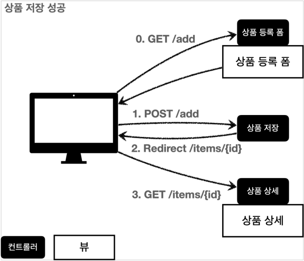
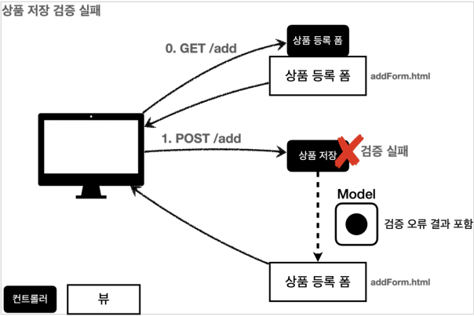

# 검증 1- Validation
## 목차
- 검증 요구사항
- 검증 직접 처리 - 소개
- 검증 직접 처리 - 개발
- BindingResult1
- BindingResult2
- FieldError, ObjectError
- 오류 코드와 메시지 처리1
- 오류 코드와 메시지 처리2
- 오류 코드와 메시지 처리3
- 오류 코드와 메시지 처리4
- 오류 코드와 메시지 처리5
- 오류 코드와 메시지 처리6
- Validator 분리1
- Validator 분리2
___
## 검증 요구사항
- 상품 관리 시스템에 새로운 요구사항이 추가되었다.<br><br>
- <b>요구사항: 검증 로직 추가</b>
    - 타입 검증
        - 가격, 수량에 문자가 들어가면 검증 오류 처리
    - 필드 검증
        - 상품명: 필수, 공백X
        - 가격: 1,000원 이상, 1백만원 이하
        - 수량: 최대 9,999개
    - 특정 필드의 범위를 넘어서는 검증
        - 가격 * 수량의 합은 10,000원 이상
- 지금까지 만든 웹 애플리케이션은 폼 입력시, 숫자를 문자로 작성하거나 해서 검증 오류가 발생하면 오류 화면으로 바로 이동한다.
    - 이렇게 되면 사용자는 처음부터 해당 폼으로 다시 이동해서 입력을 해야 한다.
        - 아마도 이런 서비스라면, 사용자는 금방 떠나버릴 것이다.
    - 웹 서비스는 폼 입력 시 오류가 발생하면, 고객이 입력한 데이터를 유지한 상태로 어떤 오류가 발생했는지 친절하게 알려주어야 한다.  
- <b>컨트롤러의 중요한 역할중 하나는 HTTP 요청이 정상인지 검증하는 것</b>이다.
    - 그리고 정상 로직보다, 이런 검증 로직을 잘 개발하는 것이 어쩌면 더 어려울 수 있다.
> <b>참고: 클라이언트 검증, 서버 검증</b>
> - 클라이언트 검증은 조작할 수 있으므로 보안에 취약하다.
> - 서버만으로 검증하면, 즉각적인 고객 사용성이 부족해진다.
> - 둘을 적절히 섞어서 사용하되, 최종적으로 서버 검증은 필수
> - API 방식을 사용하면, API 스펙을 잘 정의해서 검증 오류를 API 응답 결과에 잘 남겨주어야 함
- 먼저 검증을 직접 구현해보고, 뒤에서 스프링과 타임리프가 제공하는 검증 기능을 활용해보자.
___
## 검증 직접 처리 - 소개
- <b>상품 저장 성공</b>
    - 
        - 사용자가 상품 등록 폼에서 정상 범위의 데이터를 입력하면, 서버에서는 검증 로직이 통과하고, 상품을 저장하고, 상품 상세 화면으로 redirect한다.
- <b>상품 저장 검증 실패</b>
    - 
        - 고객이 상품 등록 폼에서 상품명을 입력하지 않거나, 가격, 수량 등이 너무 작거나 커서 검증 범위를 넘어서면, 서버 검증 로직이 실패해야 한다.
        - 이렇게 검증에 실패한 경우 고객에게 다시 상품 등록 폼을 보여주고, 어떤 값을 잘못 입력했는지 친절하게 알려주어야 한다.
- 이제 요구사항에 맞추어 검증 로직을 직접 개발해보자.
___
## 검증 직접 처리 - 개발
### 상품 등록 검증
- 먼저 상품 등록 검증 코드를 작성해보자.<br><br>
- <b>ValidationItemV1Controller - addItem() 수정</b>
    ```java
    @PostMapping("/add")
    public String addItemV1(@ModelAttribute Item item, RedirectAttributes redirectAttributes, Model model) {
        // 검증 오류 결과를 보관
        Map<String, String> errors = new HashMap<>();

        // 검증 로직
        if (!StringUtils.hasText(item.getItemName())) {
            errors.put("itemName", "상품 이름은 필수입니다.");
        }
        if (item.getPrice() == null || item.getPrice() < 1000 || item.getPrice() > 1000000) {
            errors.put("price", "가격은 1,000원 ~ 1,000,000원 까지 허용합니다.");
        }
        if (item.getQuantity() == null || item.getQuantity() >= 9999) {
            errors.put("quantity", "수량은 최소 1개 ~ 최대 9,999개 까지 허용합니다.");
        }

        // 특정 필드가 아닌 복합 룰 검증
        if (item.getPrice() != null && item.getQuantity() != null) {
            int resultPrice = item.getPrice() * item.getQuantity();
            if (resultPrice < 10000) {
                errors.put("globalError", "가격 * 수량의 합은 10,000원 이상이어야 합니다. 현재 값 = " + resultPrice);
            }
        }

        // 검증에 실패하면 다시 입력 폼으로 이동
        if (!errors.isEmpty()) {
            log.info("errors ={}", errors);
            model.addAttribute("errors", errors);
            return "validation/v1/addForm";
        }
        
        // 성공 로직
        Item savedItem = itemRepository.save(item);
        redirectAttributes.addAttribute("itemId", savedItem.getId());
        redirectAttributes.addAttribute("status", true);
        return "redirect:/validation/v1/items/{itemId}";
    }
    ```
- <b>검증 오류 보관</b>
    ```java
    Map<String, String> errors = new HashMap<>();
    ```
    - 만약 검증 시 오류가 발생하면, 어떤 검증에서 오류가 발생했는지 정보를 담아둔다.
- <b>검증 로직</b>
    ```java
    if (!StringUtils.hasText(item.getItemName())) {
        errors.put("itemName", "상품 이름은 필수입니다.");
    }
    ```
    - `import org.springframework.util.StringUtils;` 추가 필요
- 검증 시 오류가 발생하면 `errors`에 담아둔다.
    - 이 때 어떤 필드에서 오류가 발생했는지 구분하기 위해 오류가 발생한 필드명을 `key`로 사용한다.
    - 이후 뷰에서 이 데이터를 사용해서 고객에게 친절한 오류 메시지를 출력할 수 있다.
- <b>특정 필드의 범위를 넘어서는 검증 로직</b>
    ```java
    // 특정 필드의 범위를 넘어서는 검증 로직
    if (item.getPrice() != null && item.getQuantity() != null) {
        int resultPrice = item.getPrice() * item.getQuantity();
        if (resultPrice < 10000) {
            errors.put("globalError", "가격 * 수량의 합은 10,000원 이상이어야 합니다. 현재 값 = " + resultPrice);
        }
    }   
    ```
    - 특정 필드를 넘어서는 오류를 처리해야 할 수도 있다.
    - 이때는 필드 이름을 넣을 수 없으므로 `globalError`라는 `key`를 사용한다.
- <b>검증에 실패하면 다시 입력 폼으로</b>
    ```java
    if (!errors.isEmpty()) {
        model.addAttribute("errors", errors);
        return "validation/v1/addForm";
    }
    ```
    - 만약 검증에서 오류 메시지가 하나라도 있으면, 오류 메시지를 출력하기 위해 `model`에 `errors`를 담고, 입력 폼이 있는 뷰 템플릿으로 보낸다.
- <b>addForm.html</b>
    ```html
    <!DOCTYPE HTML>
    <html xmlns:th="http://www.thymeleaf.org">
    <head>
        <meta charset="utf-8">
        <link th:href="@{/css/bootstrap.min.css}"
              href="../css/bootstrap.min.css" rel="stylesheet">
        <style>
            .container {
                max-width: 560px;
            }
            .field-error {
                border-color: #dc3545;
                color: #dc3545;
            }
        </style>
    </head>
    <body>
    <div class="container">
        <div class="py-5 text-center">
            <h2 th:text="#{page.addItem}">상품 등록</h2>
        </div>
        <form action="item.html" th:action th:object="${item}" method="post">
            <div th:if="${errors?.containsKey('globalError')}">
                <p class="field-error" th:text="${errors['globalError']}">전체 오류 메시지</p>
            </div>
            <div>
                <label for="itemName" th:text="#{label.item.itemName}">상품명</label>
                <input type="text" id="itemName" th:field="*{itemName}"
                       th:class="${errors?.containsKey('itemName')} ? 'form-control field-error' : 'form-control'"
                       class="form-control" placeholder="이름을 입력하세요">
                <div class="field-error" th:if="${errors?.containsKey('itemName')}"th:text="${errors['itemName']}">
                    상품명 오류
                </div>
            </div>
            <div>
                <label for="price" th:text="#{label.item.price}">가격</label>
                <input type="text" id="price" th:field="*{price}"
                       th:class="${errors?.containsKey('price')} ? 'form-control field-error' : 'form-control'"
                       class="form-control" placeholder="가격을 입력하세요">
                <div class="field-error" th:if="${errors?.containsKey('price')}"
                     th:text="${errors['price']}">
                    가격 오류
                </div>
            </div>
            <div>
                <label for="quantity" th:text="#{label.item.quantity}">수량</label>
                <input type="text" id="quantity" th:field="*{quantity}"
                       th:class="${errors?.containsKey('quantity')} ? 'form-control field-error' : 'form-control'"
                       class="form-control" placeholder="수량을 입력하세요">
                <div class="field-error" th:if="${errors?.containsKey('quantity')}"
                     th:text="${errors['quantity']}">
                    수량 오류
                </div>
            </div>
            <hr class="my-4">
            <div class="row">
                <div class="col">
                    <button class="w-100 btn btn-primary btn-lg" type="submit"
                            th:text="#{button.save}">저장</button>
                </div>
                <div class="col">
                    <button class="w-100 btn btn-secondary btn-lg"
                            onclick="location.href='items.html'"
                            th:onclick="|location.href='@{/validation/v1/items}'|"
                            type="button" th:text="#{button.cancel}">취소</button> 
                </div>
            </div>
        </form>
    </div> <!-- /container -->
    </body>
    </html>
    ```
- <B>css 추가</B>
    ```css
    .field-error {
        border-color: #dc3545;
        color: #dc3545;
    }
    ```
    - 이 부분은 오류 메시지를 빨간색으로 강조하기 위해 추가했다.
- <b>글로벌 오류 메시지</b>
    ```html
    <div th:if="${errors?.containsKey('globalError')}">
        <p class="field-error" th:text="${errors['globalError']}">전체 오류 메시지</p>
    </div>
    ```
    - 오류 메시지는 `errors`에 내용이 있을 때만 출력하면 된다.
    - 타임리프의 `th:if`를 사용하면 조건에 만족할 때만 해당 HTML 태그를 출력할 수 있다.
> <b>참고: Safe Navigation Operator</b>
> - 만약 여기에서 `errors`가 `null`이라면 어떻게 될까?
> - 생각해보면 등록폼에 진입한 시점에서는 `errors`가 없다.
> - 따라서 `errors.containsKey()`를 호출하는 순간 `NullPointerException`이 발생한다.

> - `errors?.`은 `errors`가 `null`일 때 `NullPointerException`이 발생하는 대신, `null`을 반환하는 문법이다.
> - 이것은 스프링의 SpringEL이 제공하는 문법이다. 자세한 내용은 다음을 참고하자.
> - https://docs.spring.io/spring-framework/docs/current/reference/html/core.html#expressions-operator-safe-navigation
- 가격 1,000원, 수량 1개를 선택하면 다음과 같은 HTML 결과 화면을 볼 수 있다.
    ```html
    <div>
        <p class="field-error">가격 * 수량의 합은 10,000원 이상이어야 합니다. 현재 값 = 1000</p>
    </div>
- <b>필드 오류 처리</b>
    ```html
    <input type="text" th:classappend="${errors?.containsKey('itemName)} ? 'field-error' : _" class="form-control">
    ```
    - `classappend`를 사용해서 해당 필드에 오류가 있으면 `field-error`라는 클래스 정보를 더해서 폼의 색깔을 빨간색으로 강조한다.
    - 만약 값이 없으면 `_`(No-Operation)을 사용해서 아무 것도 하지 않는다.
- <b>필드 오류 처리 - 입력 폼 색상 적용</b>
    ```html
    <input type="text" class="form-control field-error">
    ```
- <b>필드 오류 처리 - 메시지</b>
    ```html
    <div class="field-error" th:if="${errors?.containsKey('itemName)}" th:text="${errors['itemName]}">
        상품명 오류
    </div>
    ```
    - 글로벌 오류 메시지에서 설명한 내용과 동일하고, 필드 오류를 대상으로 한다.
- <b>실행</b>
    - 상품 등록을 실행하고 검증이 잘 동작하는지 확인해보자.
        - http://localhost:8080/validation/v1/items/add
    - 상품 수정의 검증은 더 효율적인 검증 처리 방법을 학습한 다음에 진행한다.
- <b>정리</b>
    - 만약 검증 오류가 발생하면 입력 폼을 다시 보여준다.
    - 검증 오류들을 고객에게 친절하게 안내해서 다시 입력할 수 있게 한다.
    - 검증 오류가 발생해도 고객이 입력한 데이터가 유지된다.
- <b>남은 문제점</b>
    - 뷰 템플릿에서 중복 처리가 많다. 뭔가 비슷하다.
    - 타입 오류 처리가 안 된다. `Item`의 `price`, `quantity` 같은 숫자 필드는 타입이 `Integer`이므로 문자 타입으로 설정하는 것이 불가능하다.
        - 숫자 타입에 문자가 들어오면 오류가 발생한다.
        - 그런데 이러한 오류는 스프링MVC에서 컨트롤러에 진입하기도 전에 예외가 발생하기 때문에, 컨트롤러가 호출되지도 않고, 400 예외가 발생하면서 오류 페이지를 띄워준다.
    - `Item`의 `price`에 문자를 입력하는 것처럼 타입 오류가 발생해도 고객이 입력한 문자를 화면에 남겨야 한다.
        - 만약 컨트롤러가 호출된다고 가정해도, `Item`의 `price`는 `Integer`이므로 문자를 보관할 수가 없다.
        - 결국 문자는 바인딩이 불가능하므로 고객이 입력한 문자는 사라지게 되고, 고객은 본인이 어떤 내용을 입력해서 오류가 발생했는지 이해하기 어렵다.
    - 결국 고객이 입력한 값도 어딘가에 별도로 관리가 되어야 한다.
- 지금부터 스프링이 제공하는 검증 방법을 하나씩 알아보자.
___
## BindingResult1
- 지금부터 스프링이 제공하는 검증 오류처리 방법을 알아보자.
- 여기서 핵심은 <b>BindingResult</b>이다. 우선 코드로 확인해보자.<br><br>
- <b>ValidationItemControllerV2 - addItemV1</b>
    ```java
    @PostMapping("/add")
    public String addItemV1(@ModelAttribute Item item, BindingResult bindingResult, RedirectAttributes redirectAttributes) {

        // 검증 로직
        if (!StringUtils.hasText(item.getItemName())) {
            bindingResult.addError(new FieldError("item", "itemName", "상품 이름은 필수 입니다."));
        }
        if (item.getPrice() == null || item.getPrice() < 1000 || item.getPrice() > 1000000) {
            bindingResult.addError(new FieldError("item", "price", "가격은 1,000원 ~ 1,000,000원 까지 허용합니다."));
        }
        if (item.getQuantity() == null || item.getQuantity() >= 9999) {
            bindingResult.addError(new FieldError("item", "quantity", "수량은 최소 1개 ~ 최대 9,999개 까지 허용합니다."));
        }

        // 특정 필드가 아닌 복합 룰 검증
        if (item.getPrice() != null && item.getQuantity() != null) {
            int resultPrice = item.getPrice() * item.getQuantity();
            if (resultPrice < 10000) {
                bindingResult.addError(new ObjectError("item", "가격 * 수량의 합은 10,000원 이상이어야 합니다. 현재 값 = " + resultPrice));
            }
        }

        // 검증에 실패하면 다시 입력 폼으로 이동
        if (bindingResult.hasErrors()) {
            log.info("errors ={}", bindingResult);
            return "validation/v2/addForm";
        }

        // 성공 로직
        Item savedItem = itemRepository.save(item);
        redirectAttributes.addAttribute("itemId", savedItem.getId());
        redirectAttributes.addAttribute("status", true);
        return "redirect:/validation/v2/items/{itemId}";
    }
    ```
    - <b>주의</b>
        - `BindingResult bindingResult` 파라미터의 위치는 `@ModelAttribute Item item` 다음에 와야 한다.
    - <b>필드 오류 - FieldError</b>
        ```java
        if (!StringUtils.hasText(item.getItemName())) {
            bindingResult.addError(new FieldError("item", "itemName", "상품 이름은 필수 입니다."));
        }
        ```
    - <b>FieldError 생성자 요약</b>
        ```java
        public FieldError(String objectName, String field, String defaultMessage){}
        ```
        - 필드에 오류가 있으면 `FieldError` 객체를 생성하여 `bindingResult`에 담아두자.
            - `objectName`: `@ModelAttribute` 이름
            - `field`: 오류가 발생한 필드 이름
            - `defaultMessage`: 오류 기본 메시지
    - <b>ObjectError 생성자 요약</b>
        ```java
        public ObjectError(String objectName, String defaultMeesage) {}
        ```
        - 특정 필드를 넘어서는 오류가 있으면, `ObjectError` 객체를 생성하여 `bindingResult`에 담아두자.
            - `objectName`: `@ModelAttribute`의 이름
            - `defaultMessage`: 오류 기본 메시지
- `validation/v2/addForm.html` 수정
    ```html
    <form action="item.html" th:action th:object="${item}" method="post">
        <div th:if="${#fields.hasGlobalErrors()}">
            <p class="field-error" th:each="err : ${#fields.globalErrors()}"
               th:text="${err}">글로벌 오류 메시지</p>
        </div> 
        <div>
            <label for="itemName" th:text="#{label.item.itemName}">상품명</label>
            <input type="text" id="itemName" th:field="*{itemName}"
                th:errorclass="field-error" class="form-control"
                placeholder="이름을 입력하세요">
            <div class="field-error" th:errors="*{itemName}">
                상품명 오류
            </div>
        </div>
        <div>
            <label for="price" th:text="#{label.item.price}">가격</label>
            <input type="text" id="price" th:field="*{price}"
                   th:errorclass="field-error" class="form-control"
                   placeholder="가격을 입력하세요">
            <div class="field-error" th:errors="*{price}">
                가격 오류
            </div>
        </div>
        <div>
            <label for="quantity" th:text="#{label.item.quantity}">수량</label>
            <input type="text" id="quantity" th:field="*{quantity}"
                   th:errorclass="field-error" class="form-control"
                   placeholder="수량을 입력하세요">
            <div class="field-error" th:errors="*{quantity}">
                수량 오류
            </div>
        </div>
        ...
    ```
- <b>타임리프 스프링 검증 오류 통합 기능</b>
    - 타임리프는 스프링의 `BindingResult`를 활용해서 편리하게 검증 오류를 표현하는 기능을 제공한다.
        - `#fields`: `BindingResult`가 제공하는 검증 오류에 접근 가능
        - `th:errors`: 해당 필드에 오류가 있는 경우에 태그를 출력한다. (`th:if`의 편의 버전)
        - `th:errorclass`: `th:field`에서 지정한 필드에 오류가 있으면 `class` 정보를 추가한다.
        - [검증과 오류 메시지 공식 메뉴얼 바로가기](https://www.thymeleaf.org/doc/tutorials/3.0/thymeleafspring.html#validation-and-error-messages)
    - <b>글로벌 오류 처리</b>
        ```html
        <div th:if="${#fields.hasGlobalErrors()}">
            <p class="field-error" th:each="err : ${#fields.globalErrors()}"
               th:text="${err}">글로벌 오류 메시지</p>
        </div> 
        ```
    - <B>필드 오류 처리</B>
        ```html
        <input type="text" id="itemName" th:field="*{itemName}"
            th:errorclass="field-error" class="form-control"
            placeholder="이름을 입력하세요">
        <div class="field-error" th:errors="*{itemName}">
            상품명 오류
        </div>
        ```
___
## BindingResult2
- 스프링이 제공하는 검증 오류를 보관하는 객체이다.
- `BindingResult`가 있으면 `@ModelAttribute`에 데이터 바인딩 시 오류가 발생해도 컨트롤러가 호출된다!<br><br>
- <b>예) @ModelAttribute에 바인딩 시 타입 오류가 발생하면?</b>
    - `BindingResult`가 없으면 -> 400 오류가 발생하면서 컨트롤러가 호출되지 않고, 오류 페이지로 이동
    - `BindingResult`가 있으면 -> 오류 정보(`FieldError`)를 `BindingResult`에 담아 컨트롤러를 정상 호출
- <b>BindingResult에 검증 오류를 적용하는 3가지 방법</b>
    - `@ModelAttribute`의 객체에 타입 오류 등으로 바인딩이 실패하는 경우 스프링이 `FieldError`를 생성해서 `BindingResult`에 넣어준다.
    - 개발자가 직접 넣어준다.
    - `Validator` 사용 -> 뒤에서 설명
- <b>주의</b>
    - `BindingResult`는 검증할 대상 바로 다음에 와야한다. (순서가 중요!)
        - 예를 들어 `@ModelAttribute Item item` 바로 다음에 `BindingReuslt`가 와야 한다.
    - `BindingResult`는 Model에 자동으로 포함된다.
- <b>BindingResult와 Errors</b>
    - `org.springframework.validation.Errors`
    - `org.springframework.validation.BindingResult`<br><br>
    - `BindingReuslt`는 인터페이스이고, `Errors` 인터페이스를 상속받고 있다.
    - 실제 넘어오는 구현체는 `BeanPropertyBindingResult`라는 것인데, 둘 다 구현하고 있으므로 `BindingResult` 대신 `Errors`를 사용해도 된다.
    - `Errors` 인터페이스는 단순한 오류 저장과 조회 기능을 제공한다.
    - `BindingResult`는 여기에 더해 추가적인 기능들을 제공한다.
        - `addError()`도 `BindingResult`가 제공하므로 여기서는 `BindingResult`를 사용하자.
        - 주로 관례상 `BindingResult`를 많이 사용한다.
- <b>정리</b>
    - `BindingResult`, `FieldError`, `ObjectError`를 사용해서 오류 메시지를 처리하는 방법을 알아보았다.
    - 그런데 오류가 발생하는 경우, 고객이 입력한 내용이 모두 사라진다. 이 문제를 해결해보자.
___
## FieldError, ObjectError
- <b>목표</b>
    - 사용자 입력 오류 메시지가 화면에 남도록 하자.
        > ex) 가격을 1,000원 미만으로 설정 시 입력한 값이 남아있어야 한다.
    - `FieldError`, `ObjectError`에 대해 더 자세히 알아보자.
- <b>ValidationItemControllerV2 - addItemV2</b>
    ```java
    @PostMapping("/add")
    public String addItemV2(@ModelAttribute Item item, BindingResult bindingResult, RedirectAttributes redirectAttributes) {

        // 검증 로직
        if (!StringUtils.hasText(item.getItemName())) {
            bindingResult.addError(new FieldError("item", "itemName", item.getItemName(), false, null, null, "상품 이름은 필수 입니다."));
        }
        if (item.getPrice() == null || item.getPrice() < 1000 || item.getPrice() > 1000000) {
            bindingResult.addError(new FieldError("item", "price", item.getPrice(), false, null, null, "가격은 1,000원 ~ 1,000,000원 까지 허용합니다."));
        }
        if (item.getQuantity() == null || item.getQuantity() >= 9999) {
            bindingResult.addError(new FieldError("item", "quantity", item.getQuantity(), false, null, null, "수량은 최소 1개 ~ 최대 9,999개 까지 허용합니다."));
        }

        // 특정 필드가 아닌 복합 룰 검증
        if (item.getPrice() != null && item.getQuantity() != null) {
            int resultPrice = item.getPrice() * item.getQuantity();
            if (resultPrice < 10000) {
                bindingResult.addError(new ObjectError("item", "가격 * 수량의 합은 10,000원 이상이어야 합니다. 현재 값 = " + resultPrice));
            }
        }

        // 검증에 실패하면 다시 입력 폼으로 이동
        if (bindingResult.hasErrors()) {
            log.info("errors ={}", bindingResult);
            return "validation/v2/addForm";
        }
        
        // 성공 로직
        Item savedItem = itemRepository.save(item);
        redirectAttributes.addAttribute("itemId", savedItem.getId());
        redirectAttributes.addAttribute("status", true);
        return "redirect:/validation/v2/items/{itemId}";
    }
    ```
- <b>FieldError 생성자</b>
    - `FieldError`는 두 가지 생성자를 제공한다.
        ```java
        public FieldError(String objectName, String field, String defaultMessage)
        public FieldError(String objectName, String field, @Nullable Object rejectedValue, boolean bindingFailure, @Nullable String[] codes, @Nullable Object[] arguments, @Nullable String defaultMessage)
        ```
        - 파라미터 목록
            - `objectName`: 오류가 발생한 객체 이름
            - `field`: 오류 필드
            - `rejectedValue`: 사용자가 입력한 값(거절된 값)
            - `bindingFailure`: 타입 오류같은 바인딩 실패인지, 검증 실패인지에 대한 구분 값
            - `codes`: 메시지 코드
            - `arguments`: 메시지에서 사용하는 인자
            - `defaultMessage`: 기본 오류 메시지
    - `ObjectError`도 유사하게 두 가지 생성자를 제공한다.
- <b>오류 발생 시 사용자 입력 값 유지</b>
    ```java
    new FieldError("item", "price", item.getPrice(), false, null, null, "가격은 1,000 ~ 1,000,000 까지 허용합니다.")
    ```
    - 사용자의 입력 데이터가 컨트롤러의 `@ModelAttribute`에 바인딩되는 시점에 오류가 발생하면, 모델 객체에 사용자 입력 값을 유지하기 어렵다.
        - 예를 들어 가격에 숫자가 아닌 문자가 입력된다면 가겨은 `Integer` 타입이므로 문자를 보관할 수 있는 방법이 없다.
        - 그래서 오류가 발생한 경우 사용자 입력 값을 보관하는 별도의 방법이 필요하다.
        - 그리고 이렇게 보관한 사용자 입력 값을 검증 오류 발생 시 화면에 다시 출력하면 된다.
    - `FieldError`는 오류 발생 시 사용자 입력 값을 저장하는 기능을 제공한다.
        - 여기서 `rejectedValue`가 바로 오류 발생 시, 사용자 입력 값을 저장하는 필드다.
        - `BindingFailure`는 타입 오류같은 바인딩이 실패했는지 여부를 적어주면 된다.
        - 여기서는 바인딩이 실패한 것은 아니기 때문에 `false`를 사용한다.
- <b>타임리프의 사용자 입력 값 유지</b>
    - `th:field="*{price}"`
        - 타임리프의 `th:field`는 매우 영리하게 동작하는데, 정상 상황에서는 모델 객체의 값을 사용하지만, 오류가 발생하면 `FieldError`에서 보관한 값을 사용해서 값을 출력한다.
- <b>스프링의 바인딩 오류 처리</b>
    - 타입 오류로 바인딩에 실패하면 스프링은 `FieldError`를 생성하면서 사용자가 입력한 값을 넣어둔다.
    - 그리고 해당 오류를 `BindingResult`에 담아서 컨트롤러를 호출한다.
    - 따라서 타입 오류같은 바인딩 실패 시에도, 사용자의 오류 메시지를 정상 출력할 수 있다.
___
## 오류 코드와 메시지 처리1
- <b>목표</b>
    - 오류 메시지를 체계적으로 다루어보자.
- <b>FieldError 생성자</b>
    - `FieldError`는 두 가지 생성자를 제공한다.
        ```java
        public FieldError(String objectName, String field, String defaultMessage)
        public FieldError(String objectName, String field, @Nullable Object rejectedValue, boolean bindingFailure, @Nullable String[] codes, @Nullable Object[] arguments, @Nullable String defaultMessage)
        ```
        - 파라미터 목록
            - `objectName`: 오류가 발생한 객체 이름
            - `field`: 오류 필드
            - `rejectedValue`: 사용자가 입력한 값(거절된 값)
            - `bindingFailure`: 타입 오류같은 바인딩 실패인지, 검증 실패인지에 대한 구분 값
            - `codes`: 메시지 코드
            - `arguments`: 메시지에서 사용하는 인자
            - `defaultMessage`: 기본 오류 메시지
        - `FieldError`, `ObjectError`의 생성자는 `errorCode`, `arguments`를 제공한다. 이것은 오류 발생 시 오류 코드로 메시지를 찾기 위해 사용된다.
- <b>errors 메시지 파일 생성</b>
    - `messages.properties`를 사용해도 되지만, 오류 메시지를 구분하기 쉽게 `errors.properties`라는 별도의 파일로 관리해보자.
    - 먼저 스프링 부트가 해당 메시지 파일을 인식할 수 있게 다음 설정을 추가한다.
        - `application.properties`
            ```properties
            spring.messages.basename=messages,errors
            ```
        - 이렇게 하면 `messages.properties`, `errors.properties` 두 파일을 모두 인식한다.
    - <b>errors.properties 추가</b>
        - `src/main/resources/errors.properties`
            ```properties
            required.item.itemName=상품 이름은 필수입니다.
            range.item.price=가격은 {0} ~ {1} 까지 허용합니다.
            max.item.quantity=수량은 최대 {0} 까지 허용합니다.
            totalPriceMin=가격 * 수량의 합은 {0}원 이상이어야 합니다. 현재 값 = {1}           
            ```
    > <b>참고:</b> `errors_en.properties` 파일을 생성하면 오류 메시지도 국제화 처리를 할 수 있다.
- 이제 `errors`에 등록한 메시지를 사용하도록 코드를 변경해보자.<br><br>
- <b>ValidationItemControllerV2 - addItemV3() 추가</b>
    ```java
    @PostMapping("/add")
    public String addItemV3(@ModelAttribute Item item, BindingResult bindingResult, RedirectAttributes redirectAttributes) {

        log.info("objectName = {}", bindingResult.getObjectName());
        log.info("target = {}", bindingResult.getTarget());
        // 검증 로직
        if (!StringUtils.hasText(item.getItemName())) {
            bindingResult.addError(new FieldError("item", "itemName", item.getItemName(), false, new String[]{"required.item.itemName"}, null, null));
        }
        if (item.getPrice() == null || item.getPrice() < 1000 || item.getPrice() > 1000000) {
            bindingResult.addError(new FieldError("item", "price", item.getPrice(), false, new String[]{"range.item.price"}, new Object[]{1000, 1000000}, null));
        }
        if (item.getQuantity() == null || item.getQuantity() >= 9999) {
            bindingResult.addError(new FieldError("item", "quantity", item.getQuantity(), false, new String[]{"max.item.quantity"}, new Object[]{9999}, null));
        }

        // 특정 필드가 아닌 복합 룰 검증
        if (item.getPrice() != null && item.getQuantity() != null) {
            int resultPrice = item.getPrice() * item.getQuantity();
            if (resultPrice < 10000) {
                bindingResult.addError(new ObjectError("item", new String[]{"totalPriceMin"}, new Object[]{10000, resultPrice}, null));
            }
        }

        // 검증에 실패하면 다시 입력 폼으로 이동
        if (bindingResult.hasErrors()) {
            log.info("errors ={}", bindingResult);
            return "validation/v2/addForm";
        }

        // 성공 로직
        Item savedItem = itemRepository.save(item);
        redirectAttributes.addAttribute("itemId", savedItem.getId());
        redirectAttributes.addAttribute("status", true);
        return "redirect:/validation/v2/items/{itemId}";
    }
    ```
    - `codes`: `required.item.itemName`를 사용해서 메시지 코드를 지정한다.
        - 메시지 코드는 하나가 아니라, 배열로 여러 값을 전달할 수 있으며, 순서대로 매칭해서 처음 매칭되는 메시지가 사용된다.
    - `arguments`: `Object[]{1000, 1000000}`를 사용해서 코드의 `{0}`, `{1}`로 치환할 값을 전달한다.
- <b>실행</b>
    - 실행해보면 메시지, 국제화에서 학습한 `MessageSource`를 찾아서 메시지를 조회하는 것을 확인할 수 있다.
___
## 오류 코드와 메시지 처리2
- <b>목표</b>
    - `FieldError`, `ObjectError`는 다루기 너무 번거롭다.
    - 오류 코드도 좀 더 자동화할 수 있지 않을까?
        > ex) `item.itemName`처럼?
- 컨트롤러에서 `BindingResult`는 검증해야 할 객체인 `target` 바로 다음에 온다.
    - 따라서 `BindingResult`는 이미 본인이 검증해야 할 객체인 `target`을 알고 있다.
- 다음을 컨트롤러에서 실행해보자.
    ```java
    log.info("objectName = {}", errors.getObjectName());
    log.info("target = {}", target);
    ```
    - <b>출력 결과</b>
        ```java
        objectName=item //@ModelAttribute name
        target=Item(id=null, itemName=상품, price=100, quantity=1234)
        ```
### `rejectValue()`, `reject()`
- `BindingResult`가 제공하는 `rejectValue()`, `reject()`를 사용하면 `FieldError`, `ObjectError`를 직접 생성하지 않고, 깔끔하게 검증 오류를 다룰 수 있다.<br><br>
- `rejectValue()`, `reject()`를 사용해서 기존 코드를 단순화해보자.<br><br>
- <b>ValidationItemControllerV2 - addItemV4() 추가</b>
    ```java
    @PostMapping("/add")
    public String addItemV4(@ModelAttribute Item item, BindingResult bindingResult, RedirectAttributes redirectAttributes) {

        log.info("objectName={}", bindingResult.getObjectName());
        log.info("target={}", bindingResult.getTarget());
        
        // 검증 로직
        if (!StringUtils.hasText(item.getItemName())) {
            bindingResult.rejectValue("itemName", "required");
        }
        if (item.getPrice() == null || item.getPrice() < 1000 || item.getPrice() > 1000000) {
            bindingResult.rejectValue("price", "range", new Object[]{1000, 1000000}, null);
        }
        if (item.getQuantity() == null || item.getQuantity() > 10000) {
            bindingResult.rejectValue("quantity", "max", new Object[]{9999}, null);
        }
        
        //특정 필드 예외가 아닌 전체 예외
        if (item.getPrice() != null && item.getQuantity() != null) {
            int resultPrice = item.getPrice() * item.getQuantity();
            if (resultPrice < 10000) {
                bindingResult.reject("totalPriceMin", new Object[]{10000, resultPrice}, null);
            }
        }

        // 검증에 실패하면 다시 입력 폼으로 이동
        if (bindingResult.hasErrors()) {
            log.info("errors ={}", bindingResult);
            return "validation/v2/addForm";
        }

        // 성공 로직
        Item savedItem = itemRepository.save(item);
        redirectAttributes.addAttribute("itemId", savedItem.getId());
        redirectAttributes.addAttribute("status", true);
        return "redirect:/validation/v2/items/{itemId}";
    }
    ```
    - <b>실행</b>
        - 오류 메시지가 정상 출력된다. 그런데 `errors.properties`에 있는 코드를 직접 입력하지 않았는데 어떻게 된 것일까?
    - <b>rejectValue()</b>
        ```java
        void rejectValue(@Nullable String field, String errorCode, @Nullable Object[] errorArgs, @Nullable String defaultMessage);
        ```
        - `field`: 오류 필드명
        - `errorCode`: 오류 코드(이 오류 코드는 메시지에 등록된 코드가 아니다. 뒤에서 설명할 messageResolver를 위한 오류 코드이다.)
        - `errorArgs`: 오류 메시지에서 `{0}`를 치환하기 위한 값
        - `defaultMessage`: 오류 메시지를 찾을 수 없을 때 사용하는 기본 메시지
        ```java
        bindingResult.rejectValue("price", "range", new Object[]{1000, 1000000}, null)
        ```
        - 앞에서 `BindingResult`는 어떤 객체를 대상으로 검증하는지 target을 이미 알고 있다고 했다.
            - 따라서 target(item)에 대한 정보는 없어도 된다.
            - 오류 필드명은 동일하게 `price`를 사용했다.
    - <b>축약된 오류 코드</b>
        - `FieldError()`를 직접 다룰 때는 오류 코드를 `range.item.price`와 같이 모두 입력했다.
            - 그런데 `rejectValue()`를 사용할 때는 오류 코드를 `range`로 간단하게 입력했다.
            - 그래도 오류 메시지를 잘 찾아서 출력한다. 무언가 규칙이 있는 것처럼 보인다.
            - 이 부분을 이해하려면 뒤에서 설명할 `MessageCodesResolver`를 이해해야 한다.
    - `errors.properties`
        ```properties
        range.item.price=가격은 {0} ~ {1} 까지 허용합니다.
        ```
    - <b>reject()</b>
        ```java
        void reject(String errorCode, @Nullable Object[] errorArgs, @Nullable String defaultMessage);
        ```
___
## 오류 코드와 메시지 처리3
- 오류 코드를 만들 때 다음과 같이 자세히 만들 수도 있고
    - `required.item.itemName`: 상품 이름은 필수입니다.
    - `range.item.price`: 상품의 가격 범위 오류입니다.
- 또는 다음과 같이 단순하게 만들 수도 있다.
    - `required`: 필수 값입니다.
    - `range`: 범위 오류입니다.
- 단순하게 만들면 범용성이 좋아 여러 곳에서 사용할 수 있지만, 메시지를 세밀하게 작성하기 어렵다.
    - 반대로 너무 자세하게 만들면 범용성이 떨어진다.
    - 가장 좋은 방법은 범용성으로 사용하다가, 세밀하게 작성해야 하는 경우에는 세밀한 내용이 적용되도록 메시지에 단계를 두는 방법이다.
- 예를 들어 `required`라는 오류 코드를 사용한다고 가정해보자.
    - 다음과 같이 `required`라는 메시지만 있으면 이 메시지를 선택하여 사용하는 것이다.
        ```properties
        required: 필수 값 입니다.
        ```
    - 그런데 오류메시지에 `required.item.itemName`과 같이 객체명과 필드명을 조합한 세밀한 메시지 코드가 있으면, 이 메시지를 높은 우선순위로 사용하는 것이다.
    ```properties
    #Level1
    required.item.itemName: 상품 이름은 필수 입니다.

    #Level2
    required: 필수 값 입니다.
    ```
    - 물론 이렇게 객체명과 필드명을 조합한 메시지가 있는지 우선 확인하고, 없으면 좀 더 범용적인 메시지를 선택하도록 추가 개발을 해야겠지만, <br>범용성 있게 잘 개발해두면, 메시지의 추가만으로 매우 편리하게 오류 메시지를 관리할 수 있을 것이다.
- 스프링은 `MessageCodesResolver`라는 것으로 이러한 기능을 지원한다.
___
## 오류 코드와 메시지 처리4
- 우선 테스트 코드로 <b>MessageCodesResolver</b>를 알아보자.<br><br>
- <b>MessageCodesResolverTest</b>
    ```java
    public class MessageCodesResolverTest {

        MessageCodesResolver codesResolver = new DefaultMessageCodesResolver();

        @Test
        void messageCodesResolverObject(){
            String[] messageCodes = codesResolver.resolveMessageCodes("required", "item");
            for (String messageCode : messageCodes) {
                System.out.println("messageCode = " + messageCode);
            }
            assertThat(messageCodes).containsExactly("required.item", "required");
        }

        @Test
        void messageCodesResolverField() {
            String[] messageCodes = codesResolver.resolveMessageCodes("required", "item", "itemName", String.class);
            for (String messageCode : messageCodes) {
                System.out.println("messageCode = " + messageCode);
            }
            assertThat(messageCodes).containsExactly(
                    "required.item.itemName",
                    "required.itemName",
                    "required.java.lang.String",
                    "required"
            );
        }
    }
    ```
    - <b>MessageCodesResolver</b>
        - 검증 오류 코드로 메시지 코드들을 생성한다.
        - `MessageCodesResover`는 인터페이스이고, `DefaultMessageCodesResolver`는 기본 구현체이다.
        - 주로 `ObjectError`, `FieldError`와 함께 사용
    - <b>DefaultMessageCodesResolver 기본 메시지 생성 규칙</b>
        - <b>객체 오류</b>
            ```c
            객체 오류의 경우 다음 순서로 2가지 생성
            1.: code + "." + object name
            2.: code

            예) 오류 코드: required, object name: item
            1.: required.item
            2.: required
            ```
        - <b>필드 오류</b>
            ```c
            필드 오류의 경우 다음 순서로 4가지 메시지 코드 생성
            1.: code + "." + object name + "." + field
            2.: code + "." + field
            3.: code + "." + field type
            4.: code

            예) 오류 코드: typeMismatch, object name "user", field "age", field type: int
            1. "typeMismatch.user.age"
            2. "typeMismatch.age"
            3. "typeMismatch.int"
            4. "typeMismatch"
            ```
    - <B>동작 방식</B>
        - `rejectValue()`, `reject()`는 내부에서 `MessageCodesResolver`를 사용한다. 여기에서 메시지 코드들을 생성한다.
        - `FieldError`, `ObjectError`의 생성자를 보면, 오류 코드를 하나가 아닌, 여러 오류 코드를 가질 수 있다.
            - `MessageCodesResolver`를 통해 생성된 순서대로 오류 코드를 보관한다.
        - 이 부분을 `BindingResult`의 로그를 통해 확인해보자.
            - `codes [range.item.price, range.price, range.java.lang.Integer, range]`
    - <b>FieldError</b> `rejectValue("itemName", "required")`
        - 다음 4가지 오류 코드를 자동으로 생성
            - `required.item.itemName`
            - `required.itemName`
            - `required.java.lang.String`
            - `required`
    - <b>ObjectError</b> `reject("totalPriceMin")`
        - 다음 2가지 오류 코드를 자동으로 생성
            - `totalPriceMin.item`
            - `totalPriceMin`
    - <b>오류 메시지 출력</b>
        - 타임리프 화면을 렌더링할 때 `th:errors`가 실행된다.
        - 만약 이 때 오류가 있다면, 생성된 오류 메시지 코드를 순서대로 돌아가면서 메시지를 찾는다. 만약 없으면 디폴트 메시지를 출력한다.
___
## 오류 코드와 메시지 처리5
### 오류 코드 관리 전략
- <b>핵심은 구체적인 것에서! 덜 구체적인 것으로!</b>
    - `MessageCodesResolver`는 `required.item.itemName`처럼 구체적인 것을 먼저 만들어주고, `required`처럼 덜 구체적인 것을 가장 나중에 만든다.
    - 이렇게 하면 앞서 말한 것처럼 메시지와 관련된 공통 전략을 편리하게 도입할 수 있다.
- <b>왜 이렇게 복잡하게 사용하는가?</b>
    - 모든 오류 코드에 대해 메시지를 각각 다 정의하면 개발자 입장에서 관리하기 너무 힘들다.
    - 크게 중요하지 않은 메시지는 범용성 있는 `required`같은 메시지로 끝내고, 정말 중요한 메시지는 꼭 필요할 때 구체적으로 적어 사용하는 방식이 더 효과적이다.
- <b>이제 우리 애플리케이션에 이런 오류 코드 전략을 도입해보자</b>
- 우선 다음처럼 만들어보자.<br><Br>
- `errors.properties`
    ```properties
    #required.item.itemName=상품 이름은 필수입니다.
    #range.item.price=가격은 {0} ~ {1} 까지 허용합니다.
    #max.item.quantity=수량은 최대 {0} 까지 허용합니다.
    #totalPriceMin=가격 * 수량의 합은 {0}원 이상이어야 합니다. 현재 값 = {1}

    #==ObjectError==
    #Level1
    totalPriceMin.item=상품의 가격 * 수량의 합은 {0}원 이상이어야 합니다. 현재 값 = {1}

    #Level2 - 생략
    totalPriceMin=전체 가격은 {0}원 이상이어야 합니다. 현재 값 = {1}

  
    #==FieldError==
    #Level1
    required.item.itemName=상품 이름은 필수입니다.
    range.item.price=가격은 {0} ~ {1} 까지 허용합니다.
    max.item.quantity=수량은 최대 {0} 까지 허용합니다.

    #Level2 - 생략

    #Level3
    required.java.lang.String = 필수 문자입니다.
    required.java.lang.Integer = 필수 숫자입니다.
    min.java.lang.String = {0} 이상의 문자를 입력해주세요.
    min.java.lang.Integer = {0} 이상의 숫자를 입력해주세요.
    range.java.lang.String = {0} ~ {1} 까지의 문자를 입력해주세요.
    range.java.lang.Integer = {0} ~ {1} 까지의 숫자를 입력해주세요.
    max.java.lang.String = {0} 까지의 문자를 허용합니다.
    max.java.lang.Integer = {0} 까지의 숫자를 허용합니다.

    #Level4
    required = 필수 값 입니다.
    min= {0} 이상이어야 합니다.
    range= {0} ~ {1} 범위를 허용합니다.
    max= {0} 까지 허용합니다.
    ```
    - 크게 객체 오류와 필드 오류를 나누었다.
    - 그리고 범용성에 따라 레벨을 나누어 두었다.<br><Br>
    - `itemName`의 경우 `required` 검증 오류 메시지가 발생하면, 다음 코드 순서대로 메시지가 생성된다.
        1. `required.item.itemName`
        2. `required.itemName`
        3. `required.java.lang.String`
        4. `required`
        - 그리고 이렇게 생성된 메시지 코드를 기반으로 순서대로 `MessageSource`에서 메시지를 찾는다.
        - 구체적인 것에서 덜 구체적인 순서대로 찾는다. 메시지에 1번이 없으면 2번, 2번이 없으면 3번을 찾는다.
        - 이렇게 되면, 크게 중요하지 않은 오류 메시지는 기존에 정의된 것을 <b>재활용</b>하면 된다!
### ValidationUtils
- <b>ValidationUtils 사용 전</b>
    ```java
    if (!StringUtils.hasText(item.getItemName())) {
        bindingResult.rejectValue("itemName", "required");
    }   
    ```
- <b>ValidationUtils 사용 후</b>
    - 다음과 같이 한줄로 가능하며 `Empty`, 공백 같은 단순한 기능만 제공한다.
    ```java
    ValidationUtils.rejectIfEmptyOrWhitespace(bindingResult, "itemName", "required");
    ```
### 정리
1. `rejectValue()` 호출
2. `MessageCodesResolver`를 사용해서 검증 오류 코드로 메시지 코드들을 생성
3. `new FieldError()`를 생성하면서 메시지 코드들을 보관
4. `th:errors`에서 메시지 코드들로 메시지를 순서대로 메시지에서 찾고, 노출
___
## 오류 코드와 메시지 처리6
### 스프링이 직접 만든 오류 메시지 처리
- 검증 오류 코드는 다음과 같이 2가지로 나눌 수 있다.
    - 개발자가 직접 설정한 오류 코드 -> `rejectValue()`를 직접 호출
    - 스프링이 직접 검증 오류에 추가한 경우(주로 타입 정보가 맞지 않음)
- 지금까지 학습한 메시지 코드 전략의 강점을 지금부터 확인해보자.
    - `price` 필드에 문자 'A'를 입력해보자.
    - 로그를 확인해보면, `BindingResult`에 `FieldError`가 담겨 있고, 다음과 같은 메시지 코드들이 생성된 것을 확인할 수 있다.
        - `codes[typeMismatch.item.price,typeMismatch.price,typeMismatch.java.lang.Integer,typeMismatch]`
    - 다음과 같이 4가지 메시지 코드가 입력되어 있다.
        - `typeMismatch.item.price`
        - `typeMismatch.price`
        - `typeMismatch.java.lang.Integer`
        - `typeMismatch`
    - 그렇다. 스프링은 타입 오류가 발생하면 `typeMismatch`라는 오류 코드를 사용한다.
        - 이 오류 코드가 `MessageCodesResolver`를 통하면서 4가지 메시지 코드가 생성된 것이다.
    - <b>실행해보자.</b>
        - 아직 `errors.properties`에 메시지 코드가 없기 떄문에, 스프링이 생성한 기본 메시지가 출력된다.
            ```log
            Failed to convert property value of type java.lang.String to required type java.lang.Integer for property price;
            nested exception is java.lang.NumberFormatException: For input string: "A"
            ```
        - `errors.properties`에 다음 내용을 추가하자
            ```properties
            #추가
            typeMismatch.java.lang.Integer=숫자를 입력해주세요.
            typeMismatch=타입 오류입니다.
            ```
    - <b>다시 실행해보자.</b>
        - 결과적으로 소스코드를 하나도 건들지 않고, 원하는 메시지를 단게별로 설정할 수 있다.
- <b>정리</b>
    - 메시지 코드 생성 전략은 그냥 만들어진 것이 아니다. 조금 뒤에서 Bean Validation을 학습하면 그 진가를 더 확인할 수 있다.
___
## Validator 분리1
- <b>목표</b>
    - 복잡한 검증 로직을 컨트롤러와 별도로 분리하자.
- 컨트롤러에서 검증 로직이 차지하는 부분은 매우 크다.
    - 이런 경우 별도의 클래스로 역할을 분리하는 것이 좋다.
    - 그리고 이렇게 분리한 검증 로직을 재사용할 수도 있다.
- `ItemValidator`를 만들자.
    ```java
    @Slf4j
    @Component
    public class ItemValidator implements Validator {

        @Override
        public boolean supports(Class<?> clazz) {
            return Item.class.isAssignableFrom(clazz);
        }

        @Override
        public void validate(Object target, Errors errors) {
            Item item = (Item) target;
            log.info("objectName = {}", errors.getObjectName());
            log.info("target = {}", target);

            // 검증 로직
            if (!StringUtils.hasText(item.getItemName())) {
                errors.rejectValue("itemName", "required");
            }
            if (item.getPrice() == null || item.getPrice() < 1000 || item.getPrice() > 1000000) {
                errors.rejectValue("price", "range", new Object[]{1000, 1000000}, null);
            }
            if (item.getQuantity() == null || item.getQuantity() >= 9999) {
                errors.rejectValue("quantity", "max", new Object[]{"9999"}, null);
            }

            // 특정 필드가 아닌 복합 룰 검증
            if (item.getPrice() != null && item.getQuantity() != null) {
                int resultPrice = item.getPrice() * item.getQuantity();
                if (resultPrice < 10000) {
                    errors.reject("totalPriceMin", new Object[]{10000, resultPrice}, null);
                }
            }
        }
    }
    ```
    - 스프링은 검증을 체계적으로 제공하기 위해 다음 인터페이스를 제공한다.
        ```java
        public interface Validator {
            boolean supports(Class<?> clazz);
            void validate(Object target, Errors errors);
        }
        ```
        - `supports()`: 해당 검증기를 지원하는 여부 확인(뒤에서 설명)
        - `validate(Object target, Errors errors)`: 검증 대상 객체와 `BindingResult`를 매개변수로 받고, 검증
- <b>ItemValidator 직접 호출하기<br>ValidationItemControllerV2 - addItemV5()</b>
    ```java
    private final ItemValidator itemValidator; // 스프링 빈으로 주입 받아 사용
    
    ...

    @PostMapping("/add")
    public String addItemV5(@ModelAttribute Item item, BindingResult bindingResult, RedirectAttributes redirectAttributes) {

        // 검증
        itemValidator.validate(item, bindingResult);

        // 검증에 실패하면 다시 입력 폼으로 이동
        if (bindingResult.hasErrors()) {
            log.info("errors ={}", bindingResult);
            return "validation/v2/addForm";
        }

        // 성공 로직
        Item savedItem = itemRepository.save(item);
        redirectAttributes.addAttribute("itemId", savedItem.getId());
        redirectAttributes.addAttribute("status", true);
        return "redirect:/validation/v2/items/{itemId}";
    }
    ```
___
## Validator 분리2
- 스프링이 `Validator` 인터페이스를 별도로 제공하는 이유는 체계적으로 검증 기능을 도입하기 위해서다.
    - 앞에서는 검증기를 직접 불러서 사용했지만, 스프링의 추가적인 도움을 받는 방법도 존재한다.
- <b>WebDataBinder를 통해 사용하기</b>
    - `WebDataBinder`는 스프링의 파라미터 바인딩의 역할을 해주고, 검증 기능도 내부에 포함한다.
- <b>ValidationItemControllerV2에 다음 코드를 추가하자</b>
    ```java
    @InitBinder
    public void init(WebDataBinder dataBinder) {
        dataBinder.addValidators(itemValidator);
    }
    ```
    - 이렇게 `WebDataBinder`에 검증기를 추가하면 해당 컨트롤러에서는 검증기를 자동으로 적용할 수 있다.
    - `@InitBinder` -> 해당 컨트롤러에만 영향을 준다. 글로벌 설정은 별도로 해야한다.(마지막에 설명)
- <b>Validated 적용<br>ValidationItemControllerV2 - addItemV6()</b>
    ```java
    @PostMapping("/add")
    public String addItemV6(@Validated @ModelAttribute Item item, BindingResult bindingResult, RedirectAttributes redirectAttributes) {

        // 검증에 실패하면 다시 입력 폼으로 이동
        if (bindingResult.hasErrors()) {
            log.info("errors ={}", bindingResult);
            return "validation/v2/addForm";
        }

        // 성공 로직
        Item savedItem = itemRepository.save(item);
        redirectAttributes.addAttribute("itemId", savedItem.getId());
        redirectAttributes.addAttribute("status", true);
        return "redirect:/validation/v2/items/{itemId}";
    }
    ```
    - validator를 직접 호출하는 부분이 사라지고, 대신 검증 대상 앞에 `@Validated`가 붙었다.
- <b>동작 방식</b>
    - `@Validated`는 검증기를 실행하라는 애노테이션이다.
        - 이 애노테이션이 붙으면, 앞서 `WebDataBinder`에 등록한 검증기를 찾아서 실행한다.
        - 그런데 여러 검증기를 등록한다면, 그 중에 어떤 검증기가 실행되어야 할지 구분이 필요하다.
            - 이 때, `supports()`가 사용된다!
            - 여기서는 `supports(Item.class)`가 호출되고, 결과가 `true`이므로 `ItemValidator`의 `validate()`가 호출된다.
        ```java
        @Component
        public class ItemValidator implements Validator {
        
            @Override
            public boolean supports(Class<?> clazz) {
                return Item.class.isAssignableFrom(clazz);
            }

            @Override
            public void validate(Object target, Errors errors) {...}
        }
        ```
### 글로벌 설정 - 모든 컨트롤러에 적용
```java
@SpringBootApplication
public class ItemServiceApplication implements WebMvcConfigurer {
    public static void main(String[] args) {
        SpringApplication.run(ItemServiceApplication.class, args);
    }

    @Override
    public Validator getValidator() {
        return new ItemValidator();
    }
}
```
- 이렇게 글로벌 설정을 추가할 수 있다.
    - 기존 컨트롤러의 `@InitBinder`를 제거해도 글로벌 설정으로 정상 동작한다.
> <b>주의</b>
> - 글로벌 설정을 하면 다음에 설명할 BeanValidator가 자동 등록되지 않는다.
> - 참고로 글로벌 설정을 직접 사용하는 경우는 드물다.

> <b>참고</b>
> - 검증 시 `@Validated`, `@Valid` 둘 다 사용 가능하다.
> - `javax.validation.@Valid`를 사용하려면 `build.gradle` 의존관계 추가가 필요하다.
> - `implementation 'org.springframework.boot:spring-boot-starter-validation'`
> - `@Validated`는 스프링 전용 검증 애노테이션이고, `@Valid`는 자바 표준 검증 애노테이션이다.
> - 자세한 내용은 다음 Bean Validation에서 설명한다.
___