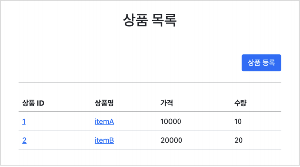
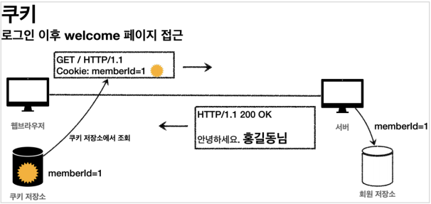
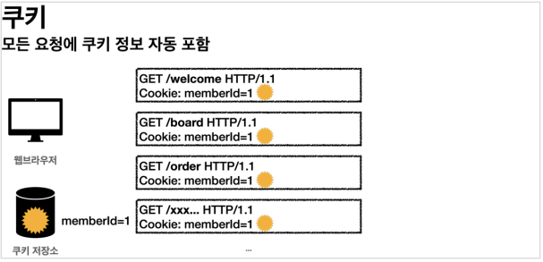
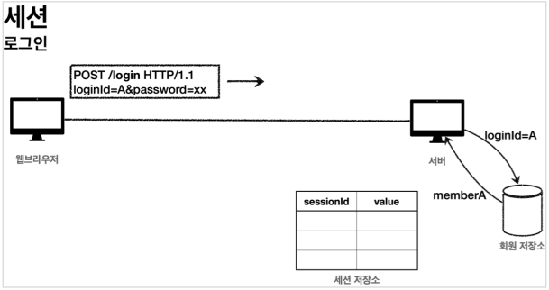
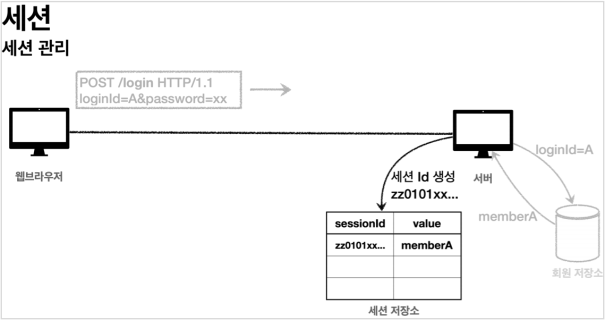
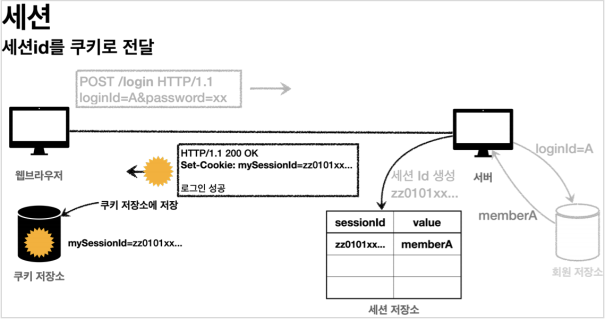
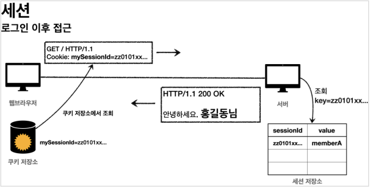

# 로그인 처리1 - 쿠키, 세션
## 목차
- 로그인 요구사항
- 패키지 구조 설계
- 홈 화면
- 회원 가입
- 로그인 기능
- 로그인 처리하기 - 쿠키 사용
- 쿠키와 보안 문제
- 로그인 처리하기 - 세션 동작 방식
- 로그인 처리하기 - 세션 직접 만들기
- 로그인 처리하기 - 직접 만든 세선 적용
- 로그인 처리하기 - 서블릿 HTTP 세션1
- 로그인 처리하기 - 서블릿 HTTP 세션2
- 세션 정보와 타임아웃 설정
___
## 로그인 요구사항
- 홈 화면 - 로그인 전
    - 회원 가입
    - 로그인
- 홈 화면 - 로그인 후
    - 본인 이름(누구님 환영합니다.)
    - 상품 관리
    - 로그 아웃
- 보안 요구사항
    - 로그인 사용자만 상품에 접근하고, 관리할 수 있음
    - <b>로그인 하지 않은 사용자가 상품 관리에 접근하면 로그인 화면으로 이동</b>
- 회원 가입, 상품 관리<br><br>
- <b>홈 화면 - 로그인 전</b>
    - 
- <b>홈 화면 - 로그인 후</b>
    - 
- <b>회원 가입</b>
    - 
- <B>로그인</B>
    - 
- <B>상품 관리</B>
    - 
___
## 패키지 구조 설계
- <b>package 구조</b>
    - hello.login
        - domain
            - item
            - member
            - login
        - web
            - item
            - member
            - login
- <b>도메인이 가장 중요하다.</b>
    - 도메인 = 화면, UI, 기술 인프라 등의 영역은 제외한, 시스템이 구현해야 하는 `핵심 비즈니스 업무 영역`을 말함.
    - 향후 web을 다른 기술로 바꾸어도 도메인은 그대로 유지할 수 있어야 한다.
    - 이렇게 하려면 web은 domain을 알고 있지만, domain은 web을 모르도록 설계해야 한다.
        - 즉, `web은 domain을 의존하지만, domain은 web을 의존하지 않는다.`
        - 예를 들어, web 패키지를 모두 삭제해도 domain에는 전혀 영향이 없도록 의존관계를 설계하는 것이 중요하다.
        - 반대로 이야기하면 domain은 web을 참조하면 안된다.
___
## 홈 화면
- <b>HomeController - home() 수정</b>
    ```java
    @GetMapping("/")
    public String home() {
        return "home";
    }
    ```
- `templates/home.html` 추가
    ```html
    <!DOCTYPE HTML>
    <html xmlns:th="http://www.thymeleaf.org">
    <head>
        <meta charset="utf-8">
        <link th:href="@{/css/bootstrap.min.css}" href="../css/bootstrap.min.css"   rel="stylesheet">
    </head>
    <body>

    <div class="container" style="max-width: 600px">
        <div class="py-5 text-center">
            <h2>홈 화면</h2>
        </div>
        <div class="row">
            <div class="col">
                <button class="w-100 btn btn-secondary btn-lg" type="button"
                        th:onclick="|location.href='@{/members/add}'|">
                    회원 가입
                </button>
            </div>
            <div class="col">
                <button class="w-100 btn btn-dark btn-lg"
                        onclick="location.href='items.html'"
                        th:onclick="|location.href='@{/login}'|" type="button">
                    로그인
                </button>
            </div>
        </div>
        <hr class="my-4">
    </div> <!-- /container -->

    </body>
    </html>
    ```
___
## 회원 가입
- <b>Member</b>
    ```java
    @Data
    public class Member {

        private Long id;

        @NotEmpty
        private String loginId; //로그인 ID

        @NotEmpty
        private String name; //사용자 이름

        @NotEmpty
        private String password;
    }
    ```
- <b>MemberRepository</b>
    ```java
    @Slf4j
    @Repository
    public class MemberRepository {
        private static Map<Long, Member> store = new HashMap<>();
        private static long sequence = 0L;

        public Member save(Member member){
            member.setId(++sequence);
            log.info("save: member={}", member);
            store.put(member.getId(), member);
            return member;
        }

        public Member findById(Long id){
            return store.get(id);
        }

        public Optional<Member> findByLoginId(String loginId){
            return findAll().stream()
                    .filter(m -> m.getLoginId().equals(loginId))
                    .findFirst();
        }

        public List<Member> findAll(){
            return new ArrayList<>(store.values());
        }

        public void clearStore(){
            store.clear();
        }
    }
    ```
- <B>MemberController</B>
    ```java
    @Controller
    @RequiredArgsConstructor
    @RequestMapping("/members")
    public class MemberController {

        private final MemberRepository memberRepository;

        @GetMapping("/add")
        public String addForm(@ModelAttribute("member") Member member) {
            return "members/addMemberForm";
        }

        @PostMapping("/add")
        public String save(@Validated @ModelAttribute Member member, BindingResult bindingResult) {
            if (bindingResult.hasErrors()) {
                return "members/addMemberForm";
            }

            memberRepository.save(member);
            return "redirect:/";
        }
    }
    ```
    - `@ModelAttribute("member")`으로 명시한 이유는, IDE의 인식 문제때문이다. 생략해도 상관은 없다.
- <b>회원 가입 뷰 템플릿</b>
    - `templates/members/addMemberForm.html`
    ```html
    <!DOCTYPE HTML>
    <html xmlns:th="http://www.thymeleaf.org">
    <head>
        <meta charset="utf-8">
        <link th:href="@{/css/bootstrap.min.css}"
              href="../css/bootstrap.min.css" rel="stylesheet">
        <style>
            .container {
                max-width: 560px;
            }
            .field-error {
                border-color: #dc3545;
                color: #dc3545;
            }
        </style>
    </head>
    <body>
    <div class="container">
        <div class="py-5 text-center">
            <h2>회원 가입</h2>
        </div>
        <h4 class="mb-3">회원 정보 입력</h4>
        <form action="" th:action th:object="${member}" method="post">
            <div th:if="${#fields.hasGlobalErrors()}">
                <p class="field-error" th:each="err : ${#fields.globalErrors()}"
                   th:text="${err}">전체 오류 메시지</p>
            </div>
            <div>
                <label for="loginId">로그인 ID</label>
                <input type="text" id="loginId" th:field="*{loginId}" class="form-control"
                       th:errorclass="field-error">
                <div class="field-error" th:errors="*{loginId}" />
            </div>
            <div>
                <label for="password">비밀번호</label>
                <input type="password" id="password" th:field="*{password}" class="form-control"
                       th:errorclass="field-error">
                <div class="field-error" th:errors="*{password}" />
            </div>
            <div>
                <label for="name">이름</label>
                <input type="text" id="name" th:field="*{name}" class="form-control"
                       th:errorclass="field-error">
                <div class="field-error" th:errors="*{name}" />
            </div>
            <hr class="my-4">
            <div class="row">
                <div class="col">
                    <button class="w-100 btn btn-primary btn-lg" type="submit">회원 가입</button>
                </div>
                <div class="col">
                    <button class="w-100 btn btn-secondary btn-lg"
                            onclick="location.href='items.html'"
                            th:onclick="|location.href='@{/}'|"
                            type="button">취소</button>
                </div>
            </div>
        </form>
    </div> <!-- /container -->
    </body>
    </html>
    ```
### 회원용 테스트 데이터 추가
- 편의상 테스트용 회원 데이터를 추가하자.
    - `loginId`: test
    - `password`: test!
    - `name`: 테스터
- <b>TestDataInit</b>
    ```java
    @Component
    @RequiredArgsConstructor
    public class TestDataInit {

        private final ItemRepository itemRepository;
        private final MemberRepository memberRepository;

        /**
         * 테스트용 데이터 추가
         */
        @PostConstruct
        public void init() {
            itemRepository.save(new Item("itemA", 10000, 10));
            itemRepository.save(new Item("itemB", 20000, 20));

            Member member = new Member();
            member.setLoginId("test");
            member.setPassword("test!");
            member.setName("테스터");
            memberRepository.save(member);
        }
    }
    ```
___
## 로그인 기능
- 로그인 기능을 개발해보자. 지금은 로그인 ID, 비밀번호를 입력하는 부분에 집중하자.
    - 
- <b>LoginService</b>
    ```java
    @Service
    @RequiredArgsConstructor
    public class LoginService {

        private final MemberRepository memberRepository;

        /**
         * @return null - 로그인 실패
         */
        public Member login(String loginId, String password){
            return memberRepository.findByLoginId(loginId)
                    .filter(m -> m.getPassword().equals(password))
                    .orElse(null);
        }
    }
    ```
    - 로그인의 핵심 비즈니스 로직은 회원을 조회한 다음, 파라미터로 넘어온 password와 비교해서 같으면 회원을 반환하고, 다르면 `null`을 반환한다.
- <b>LoginForm</b>
    ```java
    @Data
    public class LoginForm {

        @NotEmpty
        private String loginId;

        @NotEmpty
        private String password;
    }
    ```
- <b>LoginController</b>
    ```java
    @Slf4j
    @Controller
    @RequiredArgsConstructor
    public class LoginController {

        private final LoginService loginService;
        private final SessionManager sessionManager;

        @GetMapping("/login")
        public String loginForm(@ModelAttribute("loginForm") LoginForm form) {
            return "login/loginForm";
        }

        @PostMapping("/login")
        public String login(@Validated @ModelAttribute LoginForm form, BindingResult bindingResult) {
            if (bindingResult.hasErrors()) {
                return "login/loginForm";
            }

            Member loginMember = loginService.login(form.getLoginId(), form.getPassword());
            if (loginMember == null) {
                bindingResult.reject("loginFail", "아이디 또는 비밀번호가 맞지 않습니다.");
                return "login/loginForm";
            }

            // 로그인 성공 처리 TODO

            return "redirect:/";
        }
    }
    ```
    - 로그인 컨트롤러는 로그인 서비스를 호출해서 로그인에 성공하면 홈 화면으로 이동하고,<br>
    로그인에 실패하면 `bindingResult.reject()`를 사용해서 글로벌 오류(`ObjectError`)를 생성한다.<br>
    그리고 정보를 다시 입력하도록 로그인 폼을 뷰 템플릿으로 사용한다.
- <b>로그인 폼 뷰 템플릿</b>
    - `templates/login/loginForm.html`
    ```html
    <!DOCTYPE HTML>
    <html xmlns:th="http://www.thymeleaf.org">
    <head>
        <meta charset="utf-8">
        <link th:href="@{/css/bootstrap.min.css}"
              href="../css/bootstrap.min.css" rel="stylesheet">
        <style>
            .container {
                max-width: 560px;
            }
            .field-error {
                border-color: #dc3545;
                color: #dc3545;
            }
        </style>
    </head>
    <body>
    <div class="container">
        <div class="py-5 text-center">
            <h2>로그인</h2>
        </div>
        <form action="item.html" th:action th:object="${loginForm}" method="post">
            <div th:if="${#fields.hasGlobalErrors()}">
                <p class="field-error" th:each="err : ${#fields.globalErrors()}"
                   th:text="${err}">전체 오류 메시지</p>
            </div>
            <div>
                <label for="loginId">로그인 ID</label>
                <input type="text" id="loginId" th:field="*{loginId}" class="form-control"
                       th:errorclass="field-error">
                <div class="field-error" th:errors="*{loginId}" />
            </div>
            <div>
                <label for="password">비밀번호</label>
                <input type="password" id="password" th:field="*{password}"
                       class="form-control"
                       th:errorclass="field-error">
                <div class="field-error" th:errors="*{password}" />
            </div>
            <hr class="my-4">
            <div class="row">
                <div class="col">
                    <button class="w-100 btn btn-primary btn-lg" type="submit">로그인</button>
                </div>
                <div class="col">
                    <button class="w-100 btn btn-secondary btn-lg"
                            onclick="location.href='items.html'"
                            th:onclick="|location.href='@{/}'|"
                            type="button">취소</button>
                </div>
            </div>
        </form>
    </div> <!-- /container -->
    </body>
    </html>
    ```
    - 로그인 폼 뷰 템플릿에는 특별한 코드는 없다. `loginId`, `paswword`가 틀리면 글로벌 오류가 나타난다.
- <b>실행</b>
    - 로그인이 성공하면 홈으로 이동하고, 로그인에 실패하면 "아이디 또는 비밀번호가 맞지 않습니다."라는 경고와 함께 로그인 폼이 나타난다.
    - 그런데 아직, 로그인이 되면 홈 화면에 고객 이름이 보여야 한다는 요구사항을 만족하지 못한다.<br>로그인의 상태를 유지하면서, 로그인에 성공한 사용자는 홈 화면에 접근 시 고객의 이름을 보여주려면 어떻게 해야 할까?
___
### 로그인 처리하기 - 쿠키 사용
쿠키를 사용해서 로그인, 로그아웃 기능을 구현해보자.<br><br>
- <b>로그인 상태 유지하기</b>
    - 로그인의 상태를 어떻게 유지할 수 있을까?
    - 쿼리 파라미터를 계속 유지하면서 보내는 것은 매우 어렵고 번거로운 작업이다.<br>쿠키를 사용해보자.
- <b>쿠키</b>
    - 서버에서 로그인에 성공하면 HTTP 응답에 쿠키를 담아서 브라우저에 전달하자.<br>
    그러면 브라우저는 앞으로 해당 쿠키를 지속해서 보내준다.
- <b>쿠키 생성</b>
    - 
- <B>클라이언트 쿠키 전달1</B>
    - 
- <b>클라이언트 쿠키 전달2</b>
    - 
- <b>쿠키에는 영속 쿠키와 세션 쿠키가 있다.</b>
    - `영속 쿠키`: 만료 날짜를 입력하면 해당 날짜까지 유지
    - `세션 쿠키`: 만료 날짜를 생략하면 브라우저 종료 시까지만 유지<br><Br>
    - 브라우저 종료 시 로그아웃이 되길 기대하므로, 우리에게 필요한 것은 세션 쿠키이다.
- <b>LoginController - login()</b>
    - 로그인 성공 시 세션 쿠키를 생성하자.
    ```java
    @PostMapping("/login")
    public String loginV1(@Validated @ModelAttribute LoginForm form, BindingResult bindingResult, HttpServletResponse response) {
        if (bindingResult.hasErrors()) {
            return "login/loginForm";
        }

        Member loginMember = loginService.login(form.getLoginId(), form.getPassword());
        if (loginMember == null) {
            bindingResult.reject("loginFail", "아이디 또는 비밀번호가 맞지 않습니다.");
            return "login/loginForm";
        }

        // 로그인 성공 처리

        // 쿠키에 시간 정보를 주지 않으면, 세션 쿠키(브라우저 종료 시 모두 종료)
        Cookie idCookie = new Cookie("memberId", String.valueOf(loginMember.getId()));
        response.addCookie(idCookie);

        return "redirect:/";
    }
    ```
    - <b>쿠키 생성 로직</b>
        ```java
        Cookie idCookie = new Cookie("memberId", String.valueOf(loginMember.getId()));
        response.addCookie(idCookie);
        ```
        - 로그인에 성공하면 쿠키를 생성하고 `HttpServletResponse`에 담는다.<br>
        쿠키 이름은 `memberId`이고, 값은 회원의 `id`를 담아둔다.<br>
        웹 브라우저는 종료 전까지 회원의 `id`를 서버에 계속 보내줄 것이다.
    - <b>실행</b>
        - 크롬 브라우저를 통해 HTTP 응답 헤더에 쿠키가 추가된 것을 확인할 수 있다.
        - 이제 요구사항에 맞추어 로그인에 성공하면 로그인한 사용자 전용 홈 화면을 보여주자.
- <b>홈 - 로그인 처리</b>
    ```java
    @Slf4j
    @Controller
    @RequiredArgsConstructor
    public class HomeController {

        private final MemberRepository memberRepository;

        // @GetMapping("/")
        public String home() {
            return "home";
        }
        
        @GetMapping("/")
        public String homeLogin(@CookieValue(name = "memberId", required = false) Long memberId, Model model) {
            if (memberId == null) {
                return "home";
            }

            //로그인
            Member loginMember = memberRepository.findById(memberId);
            if (loginMember == null) {
                return "home";
            }

            model.addAttribute("member", loginMember);
            return "loginHome";
        }
    }
    ```
    - 기존 `home()`에 있는 `@GetMapping("/")`은 주석 처리하자.
    - `@CookieValue`를 사용하면 편리하게 쿠키를 조회할 수 있다.
    - 로그인하지 않은 사용자도 홈에 접근할 수 있기 때문에 `required = false`를 사용한다.<br><br>
    - <b>로직 분석</b>
        - 로그인 쿠키(`memberId`)가 없는 사용자는 기존 `home`으로 보낸다.<br>
        추가로 로그인 쿠키가 있어도 회원이 없으면 `home`으로 보낸다.
        - 로그인 쿠키(`memberId`)가 있는 사용자는 로그인 사용자 전용 홈 화면인 `loginHome`으로 보낸다.<br>
        추가로 홈 화면에 회원 관련 정보도 출력해야 해서 `member` 데이터도 모델에 담아서 전달한다.
- <b>홈 - 로그인 사용자 전용</b>
    - `templates/loginHome.html`
    ```html
    <!DOCTYPE HTML>
    <html xmlns:th="http://www.thymeleaf.org">
    <head>
        <meta charset="utf-8">
        <link th:href="@{/css/bootstrap.min.css}"
              href="../css/bootstrap.min.css" rel="stylesheet">
    </head>
    <body>

    <div class="container" style="max-width: 600px">
        <div class="py-5 text-center">
            <h2>홈 화면</h2>
        </div>
        <h4 class="mb-3" th:text="|로그인: ${member.name}|">로그인 사용자 이름</h4>
        <hr class="my-4">
        <div class="row">
            <div class="col">
                <button class="w-100 btn btn-secondary btn-lg" type="button"
                        th:onclick="|location.href='@{/items}'|">
                    상품 관리
                </button>
            </div>
            <div class="col">
                <form th:action="@{/logout}" method="post">
                    <button class="w-100 btn btn-dark btn-lg"
                            onclick="location.href='items.html'" type="submit">
                        로그아웃
                    </button>
                </form>
            </div>
        </div>
        <hr class="my-4">
    </div> <!-- /container -->

    </body>
    </html>
    ```
    - `th:text="|로그인: ${member.name}|"`: 로그인에 성공한 사용자 이름을 출력한다.
    - 상품 관리, 로그아웃 버튼을 노출한다.<br><br>
    - <b>실행</b>
        - 로그인에 성공하면 사용자 이름이 출력되면서 상품 관리, 로그아웃 버튼을 확인할 수 있다.<br>
        로그인에 성공 시 세션 쿠키가 지속해서 유지되고, 웹 브라우저에서 서버에 요청 시 `memberId` 쿠키를 계속 보내준다.
### 로그아웃 기능
이번에는 로그아웃 기능을 만들어보자.<br>
로그아웃 방법은 다음과 같다.
- 세션 쿠키이므로 웹 브라우저 종료 시, 서버에서 해당 쿠키의 종료 날짜를 0으로 지정<br><Br>
- <B>LoginController - logout 기능 추가</B>
    ```java
    @PostMapping("/logout")
    public String logoutV1(HttpServletResponse response) {
        expireCookie(response, "memberId");
        return "redirect:/";
    }

    private void expireCookie(HttpServletResponse response, String cookieName) {
        Cookie cookie = new Cookie(cookieName, null);
        cookie.setMaxAge(0);
        response.addCookie(cookie);
    }
    ```
    - <b>실행</b>
        - 로그아웃도 응답 쿠키를 생성하는데 `Max-Age=0`를 확인할 수 있다.<br>
        해당 쿠키는 즉시 종료된다.
___
## 쿠키와 보안 문제
쿠키를 통해 로그인 Id를 전달해서 로그인을 유지할 수 있었다.<br>
그런데 여기에는 심각한 보안 문제가 있다.
- <b>보안 문제</b>
    - 쿠키 값은 임의로 변경할 수 있다.
        - 클라이언트가 쿠키를 강제로 변경하면 다른 사용자가 된다.
        - 실제 웹브라우저 개발자모드 -> Application -> Cookie 변경으로 확인
        - `Cookie: memberId=1` -> `Cookie: memberId=2` (다른 사용자의 이름이 보임)
    - 쿠키에 보관된 정보는 훔쳐갈 수 있다.
        - 만약 쿠키에 개인정보나, 신용카드 정보가 있다면?
        - 이 정보가 웹 브라우저에도 보관되고, 네트워크 요청마다 계속 클라이언트에서 서버로 전달된다.
        - 쿠키의 정보가 나의 로컬 PC에서 털릴 수도 있고, 네트워크 전송 구간에서 털릴 수도 있다.
    - 해커가 쿠키를 한번 훔쳐가면 평생 사용할 수 있다.
        - 해커가 쿠키를 훔쳐가서 그 쿠키로 악의적인 요청을 계속 시도할 수 있다.
- <b>대안</b>
    - 쿠키에 중요한 값을 노출하지 않고, 사용자 별로 예측 불가능한 임의의 토큰(랜덤 값)을 노출하고,<br>
    서버에서 토큰과 사용자 id를 매핑해서 인식한다.<br>
    그리고 서버에서 토큰을 관리한다.
    - 토큰은 해커가 임의의 값을 넣어도 찾을 수 없도록 예상 불가능해야 한다.
    - 해커가 토큰을 털어가도 시간이 지나면 사용할 수 없도록 서버에서 해당 코튼의 만료시간을 짧게(ex: 30분) 유지한다.<br>
    또는 해킹이 의심되는 경우 서버에서 해당 토큰을 강제로 제거하면 된다.
___
## 로그인 처리하기 - 세션 동작 방식
- <b>목표</b>
    - 앞서 쿠키에 중요한 정보를 보관하는 방법에는 여러가지 보안 이슈가 존재했다.<br>
    이 문제를 해결하려면 결국 중요한 정보를 모두 서버에 저장해야 한다.<br>
    그리고 클라이언트와 서버는 추정 불가능한 임의의 식별자 값으로 연결해야 한다.<br>
    이렇게 <b>서버에 중요한 정보를 보관하고 연결을 유지하는 방법을 `세션`</b>이라 한다.
### 세션 동작 방식
세션을 어떻게 개발할지 먼저 개념을 이해해보자.
- <b>로그인</b>
    - 
    - 사용자가 `loginId`, `password` 정보를 전달하면 서버에서 해당 사용자가 맞는지 확인한다.
- <b>세션 생성</b>
    - 
    - 세션 ID를 생성하는데, 추정 불가능해야 한다.
    - <b>UUID는 추정이 불가능하다.</b>
        - `Cookie: mySessionId=zz0101xx-bab9-4b92-9b32-dadb280f4b61`
    - 생성된 세션 ID와 세션에 보관할 값(`memberA`)을 서버의 세션 저장소에 보관한다.
- <b>세션 id를 응답 쿠키로 전달</b>
    - 
- <b>클라이언트와 서버는 결국 쿠키로 연결이 되어야 한다.</b>
    - 서버는 클라이언트에 `mySessionId`라는 이름으로 세션ID만 쿠키에 담아서 전달한다.
    - 클라이언트는 쿠키 저장소에 `mySessionId` 쿠키를 보관한다.
- <b>중요</b>
    - 여기서 중요한 포인트는 회원과 관련된 정보는 전혀 클라이언트에 전달하지 않는다는 것이다.
    - 오직 추정 불가능한 세션 ID만 쿠키를 통해 클라이언트에 전달한다.
- <b>클라이언트의 세션id 쿠키 전달</b>
    - 
    - 클라이언트는 요청 시 항상 `mySessionId` 쿠키를 전달한다.
    - 서버에서는 클라이언트가 전달한 `mySessionId` 쿠키 정보로 세션 저장소를 조회해서 로그인 시 보관한 세션 정보를 사용한다.
- <b>정리</b>
    - 세션을 사용해서 서버에서 중요한 정보를 관리하게 되었다.<br>
    덕분에 다음과 같은 보안 문제들을 해결할 수 있다.
        - 쿠키 값을 변조 가능 -> 예상 불가능한 복잡한 세션Id를 사용한다.
        - 쿠키에 보관하는 정보는 클라이언트 해킹 시 털릴 가능성이 있다. -> 세션 Id가 털려도 여기에는 중요한 정보가 없다.
        - 쿠키 탈취 후 사용 -> 해커가 토큰을 털어가도 시간이 지나면 사용할 수 없도록 서버에서 세션의 만료시간을 짧게(ex: 30분) 유지한다.<br>
        또는 해킹이 의심되는 경우 서버에서 해당 세션을 강제로 제거하면 된다.
___
## 로그인 처리하기 - 세션 직접 만들기
세션을 직접 개발해서 적용해보자.<br>
세션 관리는 크게 다음 3가지 기능을 제공하면 된다.
- <b>세션 생성</b>
    - sessionId 생성 (임의의 추정 불가능한 랜덤 값)
    - 세션 저장소에 sessionId와 보관할 값 저장
    - sessionId로 응답 쿠키를 생성해서 클라이언트에 전달
- <b>세션 조회</b>
    - 클라이언트가 요청한 sessionId 쿠키의 값으로, 세션 저장소에 보관한 값 조회
- <b>세션 만료</b>
    - 클라이언트가 요청한 sessionId 쿠키의 값으로, 세션 저장소에 보관한 sessionId와 값 제거
- <b>SessionManager - 세션 관리</b>
    ```java
    /**
     * 세션 관리
     */
    @Component
    public class SessionManager {

        public static final String SESSION_COOKIE_NAME = "mySessionId";
        private Map<String, Object> sessionStore = new ConcurrentHashMap<>();

        /**
         * 세션 생성
         */
        public void createSession(Object value, HttpServletResponse response) {

            // 세션 id 생성 -> 값을 세션에 저장
            String sessionId = UUID.randomUUID().toString();
            sessionStore.put(sessionId, value);

            // 쿠키 생성
            Cookie mySessionCookie = new Cookie(SESSION_COOKIE_NAME, sessionId);
            response.addCookie(mySessionCookie);
        }

        /**
         * 세션 조회
         */
        public Object getSession(HttpServletRequest request) {
            Cookie sessionCookie = findCookie(request, SESSION_COOKIE_NAME);
            if (sessionCookie == null) {
                return null;
            }
            return sessionStore.get(sessionCookie.getValue());
        }

        /**
         * 세션 만료
         */
        public void expire(HttpServletRequest request) {
            Cookie sessionCookie = findCookie(request, SESSION_COOKIE_NAME);
            if (sessionCookie != null) {
                sessionStore.remove(sessionCookie.getValue());
            }
        }

        public Cookie findCookie(HttpServletRequest request, String cookieName){
            if (request.getCookies() == null) {
                return null;
            }
            return Arrays.stream(request.getCookies())
                    .filter(cookie -> cookie.getName().equals(cookieName))
                    .findFirst()
                    .orElse(null);
        }
    }
    ```
    - `ConcurrentHashMap`: `HashMap`은 동시 요청에 안전하지 않다.<br>
    동시 요청에 안전한 `ConcurrentHashMap`을 사용했다.
- <b>SessionManagerTest - 테스트</b>
    ```java
    class SessionManagerTest {

        SessionManager sessionManager = new SessionManager();

        @Test
        void sessionTest(){
            // 세션 생성
            MockHttpServletResponse response = new MockHttpServletResponse();
            Member member = new Member();
            sessionManager.createSession(member, response);

            // 요청에 응답 쿠키 저장
            MockHttpServletRequest request = new MockHttpServletRequest();
            request.setCookies(response.getCookies()); // mySessionId=123123-12312w3qa-a

            // 세션 조회
            Object result = sessionManager.getSession(request);
            assertThat(result).isEqualTo(member);

            // 세션 만료
            sessionManager.expire(request);
            Object expired = sessionManager.getSession(request);
            assertThat(expired).isNull();
        }

    }
    ```
    - 간단하게 테스트를 진행해보자.<br>
    여기서는 `HttpServletRequest`, `HttpServletResponse` 객체를 직접 사용할 수 없기 때문에,<br>
    테스트에서 비슷한 역할을 해주는 가짜 `MockHttpServletRequest`, `MockHttpServletResponse`를 사용했다.
___
## 로그인 처리하기 - 직접 만든 세션 적용
지금까지 개발한 세션 관리 기능을 실제 웹 애플리케이션에 적용해보자.
- <b>LoginController - loginV2()</b>
    ```java
    @PostMapping("/login")
    public String loginV2(@Validated @ModelAttribute LoginForm form, BindingResult bindingResult, HttpServletResponse response) {
        if (bindingResult.hasErrors()) {
            return "login/loginForm";
        }

        Member loginMember = loginService.login(form.getLoginId(), form.getPassword());
        log.info("login? {}", loginMember);

        if (loginMember == null) {
            bindingResult.reject("loginFail", "아이디 또는 비밀번호가 맞지 않습니다.");
            return "login/loginForm";
        }

        // 로그인 성공 처리
        // 세션 관리자를 통해 세션을 생성하고, 회원 데이터 보관
        sessionManager.createSession(loginMember, response);

        return "redirect:/";
    }
    ```
    - `private final SessionManager sessionManager;` 주입
    - `sessionManager.createSession(loginMember, response);`<br>
    로그인 성공 시 세션을 등록한다.<br>
    세션에 `loginMember`를 저장해두고, 쿠키도 함께 발행한다.
- <b>LoginController - logoutV2()</b>
    ```java
    @PostMapping("/logout")
    public String logoutV2(HttpServletRequest request) {
        sessionManager.expire(request);
        return "redirect:/";
    }
    ```
    - 로그아웃 시 해당 세션의 정보를 제거한다.
- <b>HomeController - homeLoginV2()</b>
    ```java
    @GetMapping("/")
    public String homeLoginV2(HttpServletRequest request, Model model){
        
        // 세션 관리자에 저장된 회원 정보 조회
        Object member = (Member)sessionManager.getSession(request);

        // 로그인 성공
        if (member == null) {
            return "home";
        }

        model.addAttribute("member", member);
        return "loginHome";
    }
    ```
    - `private final SessionManager sessionManager;` 주입
    - 세션 관리자에서 저장된 회원 정보를 조회한다.<br>
    만약 회원 정보가 없으면, 쿠키나 세션이 없는 것이므로 로그인 되지 않은 것으로 처리한다.
- <b>정리</b>
    - 이번 시간에는 세션과 쿠키의 개념을 명확하게 이해하기 위해 직접 만들어보았다.<br>
    사실 세션이라는 것이 뭔가 특별한 것이 아닌 단지 쿠키를 사용하는 데, 서버에서 데이터를 유지하는 방법일 뿐이라는 것을 이해했을 것이다.<br>
    그런데 프로젝트마다 이러한 세션 개념을 직접 개발하는 것은 상당히 불편할 것이다.<br>
    그래서 서블릿도 세션 개념을 지원한다.<br>
    이제 직접 만드는 세션 말고, 서블릿이 공식 지원하는 세션을 알아보자.<br>
    서블릿이 공식 지원하는 세션은 우리가 직접 만든 세션과 동작 방식이 거의 같다.<br>
    추가로 세션을 일정시간 사용하지 않으면 해당 세션을 삭제하는 기능을 제공한다.
___
## 로그인 처리하기 - 서블릿 HTTP 세션1
세션이라는 개념은 대부분의 웹 어플리케이션에 필요한 것이다.<br>
어쩌면 웹이 등장하면서부터 나온 문제이다.<br>
서블릿은 세션을 위해 `HttpSession`이라는 기능을 제공하는데, 지금까지 나온 문제들을 해결해준다.<br>
우리가 직접 구현한 세션의 개념이 이미 구현되어 있고, 더 잘 구현되어 있다.
- <b>HttpSession 소개</b>
    - 서블릿이 제공하는 `HttpSession`도 결국 우리가 직접 만든 `SessionManager`와 같은 방식으로 동작한다.<br>
    서블릿을 통해 `HttpSession`을 생성하면 다음과 같은 쿠키를 생성한다.<br>
    쿠키 이름이 `JSESSIONID`이고, 값은 추정 불가능한 랜덤 값이다.<br>
    `Cookie: JSESSIONID=5B78E23B513F50164D6FDD8C97B0AD05`
### HttpSession 사용
서블릿이 제공하는 `HttpSession`을 사용하도록 개발해보자.
- <b>SessionConst</b>
    ```java
    public interface SessionConst {
        String LOGIN_MEMBER = "loginMember";
    }
    ```
    - `HttpSession`에 데이터를 보관하고 조회할 때, 같은 이름이 중복되어 사용되므로, 상수를 하나 정의했다.
- <b>LoginController - loginV3()</b>
    ```java
    @PostMapping("/login")
    public String loginV3(@Validated @ModelAttribute LoginForm form, BindingResult bindingResult, HttpServletRequest request) {
        if (bindingResult.hasErrors()) {
            return "login/loginForm";
        }

        Member loginMember = loginService.login(form.getLoginId(), form.getPassword());
        log.info("login? {}", loginMember);

        if (loginMember == null) {
            bindingResult.reject("loginFail", "아이디 또는 비밀번호가 맞지 않습니다.");
            return "login/loginForm";
        }

        // 로그인 성공 처리
        // 세션이 있으면 있는 세션 반환, 없으면 신규 세션 생성 후 반환
        HttpSession session = request.getSession();
        // 세션에 로그인 회원 정보 보관
        session.setAttribute(SessionConst.LOGIN_MEMBER, loginMember);

        return "redirect:/";
    }
    ```
    - <b>세션 생성과 조회</b>
        - 세션을 생성하려면 `request.getSession(true)`를 사용하면 된다.<br>
        `public HttpSession getSession(boolean create);`
        - 세션의 `create` 옵션에 대해 알아보자.
            - `request.getSession(true)`
                - 세션이 ⭕, 기존 세션을 반환
                - 세션이 ❌, 새로운 세션을 생성해서 반환
                - `request.getSession()`과 동일
            - `request.getSession(false)`
                - 세션이 ⭕, 기존 세션을 반환
                - 세션이 ❌, `null`을 반환
    - <b>세션에 로그인 회원 정보 보관</b>
        - `session.setAttribute(SessionConst.LOGIN_MEMBER, loginMember);`
        - 세션에 데이터를 보관하는 방법은 `request.setAttribute(..)`와 비슷하다.<br>
        하나의 세션에 `여러 값`을 저장할 수 있다.
        - 참고로, 세션은 브라우저당 한 개만 할당된다.
- <b>LoginController - logoutV3()</b>
    ```java
    @PostMapping("/logout")
    public String logoutV3(HttpServletRequest request) {
        HttpSession session = request.getSession(false);
        if (session != null) {
            session.invalidate();
        }
        return "redirect:/";
    }
    ```
    - `session.invalidate()`: 세션을 제거한다.
- <b>HomeController - homeLoginV3()</b>
    ```java
    @GetMapping("/")
    public String homeLoginV3(HttpServletRequest request, Model model){

        HttpSession session = request.getSession(false);
        if (session == null) {
            return "home";
        }

        Object loginMember = (Member) session.getAttribute(SessionConst.LOGIN_MEMBER);

        // 세션에 회원 데이터가 없으면 home
        if (loginMember == null) {
            return "home";
        }

        // 세션이 유지되면 로그인으로 이동
        model.addAttribute("member", loginMember);
        return "loginHome";
    }
    ```
    - 세션을 찾아 사용하는 시점이므로 `create: false` 옵션을 사용해서 세션을 생성하지 않아야 한다.
    - `session.getAttribute(SessionConst.LOGIN_MEMBER)`: 로그인 시점에 세션에 보관한 회원 객체를 찾는다.
___
## 로그인 처리하기 - 서블릿 HTTP 세션2
### @SessionAttribute
스프링은 세션을 더 편리하게 사용할 수 있도록 `@SessionAttribute`을 지원한다.<br>
이미 로그인된 사용자를 찾을 때는 다음과 같이 사용하면 된다.<br>
참고로 이 기능은 세션을 생성하지 않는다.<br>
`@SessionAttribute(name = "loginMember", required = false) Member loginMember`
- <b>HomeController - homeLoginV3Spring()</b>
    ```java
    @GetMapping("/")
    public String homeLoginV3Spring(@SessionAttribute(name = SessionConst.LOGIN_MEMBER, required = false) Member loginMember, Model model){

        // 세션에 회원 데이터가 없으면 home
        if (loginMember == null) {
            return "home";
        }

        // 세션이 유지되면 로그인으로 이동
        model.addAttribute("member", loginMember);
        return "loginHome";
    }
    ```
    - 세션을 찾고, 세션에 들어 있는 데이터를 찾는 번거로운 과정을 스프링이 한 번에 편리하게 처리해준다.
### TrackingModes
- 로그인을 처음 시도하면 URL이 다음과 같이 `jsessionid`를 포함하고 있는 것을 확인할 수 있다.
    - `http://localhost:8080/;jsessionid=F59911518B921DF62D09F0DF8F83F872`
    - 이것은 웹 브라우저가 쿠키를 지원하지 않을 때 쿠키 대신 URL을 통해 세션을 유지하는 방법이다.<br>
    이 방법을 사용하려면 URL에 이 값을 계속 포함해서 전달해야 한다.
    - 타임리프같은 템플릿은 엔진을 통해 링크를 걸면 `jsessionid`를 URL에 자동으로 포함해준다.
    - 서버 입장에서 웹 브라우저가 쿠키 지원 여부를 최초에는 판단할 수 없으므로, 쿠키 값도 전달하고 URL에 `jsessionid`도 함께 전달한다.
- URL 전달 방식을 끄고 항상 쿠키를 토애서만 세션을 유지하고 싶으면, 다음 옵션을 추가하자.<br>
이렇게 하면 URL에 `jsessionid`가 노출되지 않는다.
    - `applicationproperties`
        ```properties
        server.servlet.session.tracking-modes=cookie
        ```
___
## 세션 정보와 타임아웃 설정
### 세션 정보 확인
세션이 제공하는 정보들을 확인해보자.
- <b>SessionInfoController</b>
    ```java
    @Slf4j
    @RestController
    public class SessionInfoController {

        @GetMapping("/session-info")
        public String sessionInfo(HttpServletRequest request) {
            HttpSession session = request.getSession(false);
            if (session == null) {
                return "세션이 없습니다.";
            }

            // 세션 데이터 출력
            session.getAttributeNames().asIterator()
                    .forEachRemaining(name -> log.info("session name={}, value={}", name, session. getAttribute(name)));
            log.info("sessionId={}", session.getId());
            log.info("getMaxInactiveInterval={}", session.getMaxInactiveInterval());
            log.info("creationTime={}", new Date(session.getCreationTime()));
            log.info("lastAccessedTime={}", new Date(session.getLastAccessedTime()));
            log.info("isNew={}", session.isNew());

            return "세션 출력";
        }
    }
    ```
    - `sessionId`: 세션Id, `JSESSIONID`의 값이다.
        > ex) `34B14F008AA3527C9F8ED620EFD7A4E1`
    - `maxInactiveInterval`: 세션의 유효 시간
        > ex) 1800초
    - `creationTime`: 세션 생성 일시
    - `lastAccessedTime`: 세션과 연결된 사용자가 최근에 서버에 접근한 시간<br>
    클라이언트에서 서버로 `sessionId`(`JSESSIONID`)를 요청한 경우에 갱신된다.
    - `isNew`: 새로 생성된 세션인지, 아니면 과거에 만들어 졌고 클라이언트에서 서버로 `sessionId`(`JSESSIONID`)를 요청해서 조회된 세션인지 여부
### 세션 타임아웃 설정
세션은 사용자가 로그아웃을 직접 호출해서 `session.invalidate()`가 호출되는 경우에 삭제된다.<br>
그런데 대부분의 사용자는 로그아웃을 선택하지 않고, 그냥 웹 브라우저를 종료한다.<br>
문제는 HTTP가 비 연결성(ConnectionLess)이므로 서버 입장에서는 해당 사용자가 웹 브라우저를 종료한 것인지 아닌지를 인식할 수 없다.<br>
따라서 서버에서 세션 데이터를 언제 삭제해야 하는지 판단하기가 어렵다.<br><br>
이 경우 남아 있는 세션을 무한정 보관하면 다음과 같은 문제가 발생할 수 있다.
- 세션과 관련된 쿠키(`JSESSIONID`)를 탈취 당했을 경우, 오랜 시간이 지나도 해당 쿠키로 악의적인 요청을 할 수 있다.
- 세션은 기본적으로 메모리에 생성된다.<br>
메모리의 크기가 무한하지 않기 때문에, 꼭 필요한 경우에만 생성해서 사용해야 한다.<br>
10만명의 사용자가 로그인하면 10만개의 세션이 생성되는 것이다.<br><br>
- <b>세션 종료 시점</b>
    - 세션의 종료 시점을 어떻게 정하면 좋을까? <br>
    가장 단순하게 생각해보면, 세션 생성 시점으로부터 30분 정도로 잡으면 될 것같다.<br>
    그런데 문제는 30분이 지나면 세션이 삭제되기 때문에, 열심히 사이트를 돌아다니다 또 로그인을 해서 세션을 생성해야 하는 번거로움이 발생한다.<br><br>
    더 나은 대안은 세션 생성 시점이 아닌 <b>사용자가 서버에 최근에 요청한 시간을 기준으로 30분 정도를 유지</b>해주는 것이다.<br>
    이렇게 하면 사용자가 서비스를 사용하고 있으면, 세션의 생존 시간이 30분으로 계속 늘어나게 된다.<br>
    따라서 30분마다 로그인해야 하는 번거로움이 사라지며, `HttpSession`은 이 방식을 사용한다.
- <b>세션 타임아웃 설정</b>
    - 스프링 부트로 글로벌 설정
    - `application.properties`
        ```properties
        server.servlet.session.timeout=60
        ```
        - 기본은 1800(30분)
        - 글로벌 설정은 분 단위로 설정해야 한다.
    - 특정 세션 단위로 시간 설정
        ```java
        session.setMaxInactiveInterval(1800);
        ```
- <b>세션 타임아웃 발생</b>
    - 세션의 타임아웃 시간은 해당 세션과 관련된 `JSESSIONID`를 전달하는 HTTP 요청이 있으면, 현재 시간으로 다시 초기화된다.<br>
    이렇게 초기화되면, 세션 타임아웃으로 설정한 시간동안 세션을 추가로 사용할 수 있다.
    - `session.getLastAccessedTime()`: 최근 세션 접근 시간
    - `LastAccessedTime` 이후로 timeout 시간이 지나면, WAS가 내부에서 해당 세션을 제거한다.
- <b>정리</b>
    - 서블릿의 `HttpSession`이 제공하는 타임아웃 기능 덕분에, 세션을 안전하고 편리하게 사용할 수 있다.
    - 실무에서 주의할 점은 세션에는 최소한의 데이터만 보관해야 한다는 점이다.<br>
    보관한 데이터 용량 * 사용자 수로 세션의 메모리 사용량이 급격하게 늘어나 장애로 이어질 수 있다.
    - 추가로 세션의 시간을 너무 길게 가져가면 메모리 사용이 계속 누적될 수 있으므로, 적당한 시간을 선택하는 것이 필요하다.<br>
    기본이 30분이라는 것을 기준으로 고민하면 된다.
___
