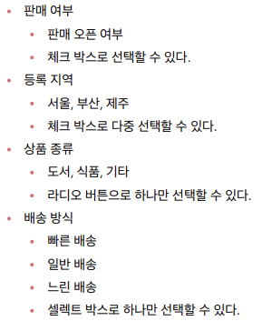
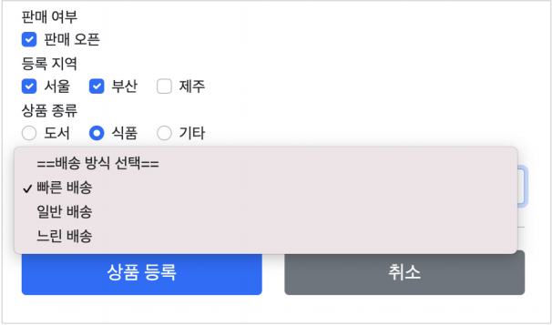

# 타임리프 - 스프링 통합과 폼
## 목차
- 타임리프 스프링 통합
- 입력 폼 처리
- 요구사항 추가
- 체크 박스 - 단일1
- 체크 박스 - 단일2
- 체크 박스 - 멀티
- 라디오 버튼
- 셀렉트 박스
___
## 타임리프 스프링 통합
- 타임리프는 크게 2가지 메뉴얼을 제공한다.
    - 기본 메뉴얼: https://www.thymeleaf.org/doc/tutorials/3.0/usingthymeleaf.html
    - 스프링 통합 메뉴얼: https://www.thymeleaf.org/doc/tutorials/3.0/thymeleafspring.html
- 타임리프는 스프링 없이도 동작하지만, 스프링과 통합을 위한 다양한 기능을 편리하게 제공한다.<br><br>
- <b>스프링 통합으로 추가되는 기능들</b>
    - 스프링의 SpringEL 문법 통합
    - `${@myBean.doSoemthing()}`처럼 스프링 빈 호출 지원
    - 편리한 폼 관리를 위한 추가 속성
        - `th:object`(기능 강화, 폼 커맨드 객체 선택)
        - `th:field`, `th:errors`, `th:errorclass`
    - 폼 컴포넌트 기능
        - checkbox, radio button, List 등을 편리하게 사용할 수 있는 기능 지원
    - 스프링의 메시지, 국제화 기능의 편리한 통합
    - 스프링의 검증, 오류 처리 통합
    - 스프링의 변환 서비스 통합(ConversionService)
- <b>설정 방법</b>
    - 타임리프 템플릿 엔진을 스프링 빈에 등록하고, 타임리프용 뷰 리졸버를 스프링 빈으로 등록하는 방법
        - https://www.thymeleaf.org/doc/tutorials/3.0/thymeleafspring.html#the-springstandard-dialect
        - https://www.thymeleaf.org/doc/tutorials/3.0/thymeleafspring.html#views-and-view-resolvers
    - `스프링 부트`는 이런 부분을 모두 `자동화` 해준다.
    - `build.gradle`에 다음 한 줄을 넣어주면, Gradle은 타임리프와 관련된 라이브러리를 다운받고, 스프링 부트는 타임리프와 관련된 설정용 스프링 빈을 자동으로 등록한다.
        ```gradle
        implementation 'org.springframework.boot:spring-boot-starter-thymeleaf'
        ```
    - 타임리프 관련 설정을 변경하고 싶으면, 다음을 참고해서 `application,properties`에 추가하자.
        - https://docs.spring.io/spring-boot/docs/current/reference/html/appendix-application-properties.html#common-application-properties-templating
___
## 입력 폼 처리
- 타임리프가 제공하는 입력 폼 기능을 적용해서, 기존 프로젝트의 폼 코드를 타임리프가 지원하는 기능을 사용해서 효율적으로 개선해보자.<br><br>
- `th:object`: 커맨드 객체를 지정한다.
- `*{...}`: 선택 변수 식이라고 한다. `th:object`에서 선택한 객체에 접근한다.
- `th:field`: HTML 태그의 `id`, `name`, `value` 속성을 자동으로 처리해준다.<br><br>
- <B>렌더링 전</B>
    ```html
    <input type="text" th:field="*{itemName}">
    ```
- <b>렌더링 후</b>
    ```html
    <input type="text" id="itemName", name="itemName", th:value="*{itemName}">
    ```
### 등록 폼
- `th:object`를 적용하려면, 먼저 해당 오브젝트 정보를 넘겨주어야 한다.
    - 등록 폼이기 때문에, 데이터가 비어있는 빈 오브젝트를 만들어서 뷰에 전달하자.
- <b>FormItemController 변경</b>
    ```java
    @GetMapping("/add")
    public String addForm(Model model) {
        model.addAttribute("item", new Item());
        return "form/addForm";
    }
    ```
- `form/addForm.html` 변경
    ```html
    <form action="item.html" th:action th:object="${item}" method="post">
            <div>
                <label for="itemName">상품명</label>
                <input type="text" id="itemName" th:field="*{itemName}" class="form-control"    placeholder="이름을 입력하세요">
            </div>
            <div>
                <label for="price">가격</label>
                <input type="text" id="price" th:field="*{price}" class="form-control"  placeholder="가격을 입력하세요">
            </div>
            <div>
                <label for="quantity">수량</label>
                <input type="text" id="quantity" th:field="*{quantity}" class="form-control"    placeholder="수량을 입력하세요">
            </div>
        ...
    ```
    - `th:object="${item}"`: `<form>`에서 사용할 객체를 지정한다. 선택 변수 식(`*{...}`)을 적용할 수 있다.
    - `th:field="*{itemName}"`
        - `*{itemName}`은 선택 변수 식을 사용했는데, `${item.itemName}`과 같다. 앞서 `th:object`로 `item`을 선택했기 때문에, 선택 변수 식을 적용할 수 있다.
        - `th:field`는 `id`, `name`, `value` 속성을 자동으로 만들어준다.
            - `id`: `th:field`에서 지정한 변수 이름과 같다. `id="itemName"`
            - `name`: `th:field`에서 지정한 변수 이름과 같다. `name="itemName"`
            - `value`: `th:field`에서 지정한 변수 이름과 같다. `value=""`
    - 참고로 해당 예제에서는 label 태그를 지정했기 때문에, `id`속성까지 제거하면 IDE가 빨간줄을 표시하는데, 이는 보기 좋지 않으므로 제거하지 않았다.(제거해도 상관 없다.)
    - <b>렌더링 전</b>
        ```html
        <input type="text" id="itemName" th:field="*{itemName}" class="form-control" placeholder="이름을 입력하세요">
        ```
    - <b>렌더링 후</b>
        ```html
        <input type="text" id="itemName" class="form-control" placeholder="이름을 입력하세요" name="itemName" value="">
        ```
### 수정 폼
- <B>FormItemController 유지</B>
    ```java
    @GetMapping("/{itemId}/edit")
    public String editForm(@PathVariable Long itemId, Model model) {
        Item item = itemRepository.findById(itemId);
        model.addAttribute("item", item);
        return "form/editForm";
    }
    ```
- `form/editForm.html` 변경 
    ```html
    <form action="item.html" th:action th:object="${item}" method="post">
        <div>
            <label for="id">상품 ID</label>
            <input type="text" id="id" class="form-control" th:field="*{id}" readonly>
        </div>
        <div>
            <label for="itemName">상품명</label>
            <input type="text" id="itemName" class="form-control" th:field="*{itemName}">
        </div>
        <div>
            <label for="price">가격</label>
            <input type="text" id="price" class="form-control" th:field="*{price}">
        </div>
        <div>
            <label for="quantity">수량</label>
            <input type="text" id="quantity" class="form-control" th:field="*{quantity}">
        </div>
        ...
    ```
___
## 요구사항 추가
- 타임리프를 사용해서 폼에서 체크박스, 라디오 버튼, 셀렉트 박스를 편리하게 사용하는 방법을 학습해보자.
- 기존 상품 서비스에 다음 요구사항이 추가되었다.
    - 
- <b>예시 이미지</b>
    - 
- <b>ItemType - 상품 종류</b>
    ```java
    public enum ItemType {

        BOOK("도서"), FOOD("식품"), ETC("기타");

        private final String description;

        ItemType(String description) {
            this.description = description;
        }

        public String getDescription() {
            return description;
        }
    }
    ```
    - 상품 종류는 `ENUM`을 사용한다. 
    - 상품 설명을 위해 `description` 필드도 추가했다.
- <b>DeliveryCode - 배송 방식</b>
    ```java
    /**
     * FAST: 빠른 배송
     * NORMAL: 일반 배송
     * SLOW: 느린 배송
     */

    @Data
    @AllArgsConstructor
    public class DeliveryCode {

        private String code;
        private String displayName;
    }
    ```
    - 배송방식은 `DeliveryCode`라는 클래스를 사용한다.
    - `code`는 `FAST`와 같이 시스템에 전달하는 값이고, `displayName`은 `빠른 배송`와 같이 고객에게 보여주는 값이다.
- <b>Item - 상품</b>
    ```java
    @Data
    public class Item {

        private Long id;
        private String itemName;
        private Integer price;
        private Integer quantity;

        private Boolean open; // 판매 여부
        private List<String> regions; // 등록 지역
        private ItemType itemType; // 상품 종류
        private String deliveryCode; // 배송 방식

        public Item() {
        }

        public Item(String itemName, Integer price, Integer quantity) {
            this.itemName = itemName;
            this.price = price;
            this.quantity = quantity;
        }
    }
    ```
- `ENUM` 클래스, `String` 같은 다양한 상황에서 어떻게 폼의 데이터를 받을 수 있는지 하나씩 알아보자.
___
## 체크 박스 - 단일 1
- <b>단순 HTML 체크 박스</b>
    - `resources/templates/form/addForm.html` 추가
        ```html
        <!-- single checkbox -->
        <div>판매 여부</div>
        <div>
            <div class="form-check">
            <input type="checkbox" id="open" name="open" class="form-check-input">
            <label for="open" class="form-check-label">판매 오픈</label>
            </div>
        </div>
        ```
- 상품이 등록되는 곳에 다음과 같이 로그를 남겨서 값이 잘 넘어오는지 확인해보자.
- <b>FormItemController 추가</b>
    ```java
    @PostMapping("/add")
    public String addItem(@ModelAttribute Item item, RedirectAttributes redirectAttributes) {
        log.info("item.open={}", item.getOpen());
        ...
    }
    ```
    - `FormItemController`에 `@Slf4j` 애노테이션 추가
- <b>실행 로그</b>
    ```log
    FormItemController : item.open=true //체크 박스를 선택하는 경우
    FormItemController : item.open=null //체크 박스를 선택하지 않는 경우
    ```
    - 체크 박스를 체크하면, HTML Form에서 `open=on`이라는 값이 넘어간다.
    - 스프링은 `on`이라는 문자를 `true`타입으로 변환해준다. (스프링 타입 컨버터가 이 기능을 수행)
- <b>주의 - 체크 박스를 선택하지 않을 때</b>
    - HTML에서 체크 박스를 선택하지 않고, 폼을 전송하면 `open`이라는 필드 자체가 서버로 전송되지 않는다.
    - HTTP 메시지 바디를 보면 `open`의 이름도 전송이 되지 않는 것을 확인할 수 있다.
        ```c
        itemName=itemA&price=10000&quantity=10
        ```
    - 서버에서 Boolean 타입을 찍어보면 결과가 `null`인 것을 확인할 수 있다.
        ```java
        log.info("item.open={}", item.getOpen());
        ```
- HTML checkbox는 선택이 안되면, 클라이언트에서 서버로 값 자체를 보내지 않는다.
- 수정의 경우, 상황에 따라 이 방식이 문제가 될 수 있다.
- 사용자가 의도적으로 체크되어 있던 값을 체크 해제해도 저장시 아무 값도 넘어가지 않기 때문에, 서버 구현에 따라 값이 오지 않은 것으로 판단하여 값을 변경하지 않을 수도 있다.<br><Br>
- 이런 문제를 해결하기 위해 스프링 MVC는 약간의 트릭을 사용하는데, `히든 필드`를 하나 만들어서, `_open`처럼 기존 체크 박스 이름 앞에 언더스코어(`_`)를 붙여 전송하면 체크를 해제했다고 인식할 수 있다.
- 히든 필드는 항상 전송되므로, 체크를 해제한 경우 `open`은 전송되지 않고, `_open`만 전송되는데, 이 경우 스프링 MVC는 체크를 해제했다고 판단한다.<br><br>
- <b>체크 해제를 인식하기 위한 히든 필드</b>
    ```html
    <input type="hidden" name="_open" value="on"/>
    ```
- <b>기존 코드에 히든 필드 추가</b>
    ```html
    <!-- single checkbox -->
    <div>판매 여부</div>
    <div>
        <div class="form-check">
        <input type="checkbox" id="open" name="open" class="form-check-input">
        <input type="hidden" name="_open" value="on"/> <!-- 히든 필드 추가 -->
        <label for="open" class="form-check-label">판매 오픈</label> 
        </div>
    </div>
    ```
- <B>실행 로그</B>
    ```log
    FormItemController : item.open=true //체크 박스를 선택하는 경우
    FormItemController : item.open=false //체크 박스를 선택하지 않는 경우
    ```
- <b>체크 박스 체크</b>
    - `open=on&_open=on`
    - 체크 박스를 체크하면 스프링 MVC가 `open`에 값이 있는 것을 확인하고 사용한다.
    - 이 때 `_open`은 무시한다.
- <b>체크 박스 미체크</b>
    - `_open=on`
    - 체크 박스를 체크하지 않으면, 스프링 MVC가 `_open`만 있는 것을 확인하고, `open`의 값이 체크되지 않았다고 인식한다.
    - 이 경우 서버에서 `Boolean` 타입을 찍어보면 결과가 `null`이 아닌 `false`인 것을 확인할 수 있다.
        ```java
        log.info("item.open={}", item.getOpen());
        ```
___
## 체크 박스 - 단일2
### 타임리프
- 개발할 때 마다, 이렇게 히든 필드를 추가하는 것은 상당히 번거롭다.
- 타임리프가 제공하는 폼 기능을 사용하면, 이런 부분을 자동으로 처리할 수 있다.<br><br>
- <B>타임리프 - 체크 박스 코드 추가</B>
    ```html
    <!-- single checkbox -->
    <div>판매 여부</div>
    <div>
        <div class="form-check">
            <input type="checkbox" id="open" th:field="*{open}" class="form-check-input">
            <label for="open" class="form-check-label">판매 오픈</label>
        </div>
    </div>
    ```
    - 체크 박스의 기존 코드를 제거하고, 타임리프가 제공하는 체크 박스 코드로 변경하였다.
- <b>타임리프 체크 박스 HTML 생성 결과</b>
    ```html
    <!-- single checkbox -->
    <div>판매 여부</div>
    <div>
        <div class="form-check">
        <input type="checkbox" id="open" class="form-check-input" name="open" value="true">
        <input type="hidden" name="_open" value="on"/>
        <label for="open" class="form-check-label">판매 오픈</label>
        </div>
    </div>
    ```
    - 타임리프를 사용하면 `체크 박스의 히든 필드`와 관련된 부분도 함께 해결해준다.
    - HTML 생성 결과를 보면 히든 필드 부분이 자동으로 생성되어 있는 것을 확인할 수 있다.
- <b>실행 로그</b>
    ```log
    FormItemController : item.open=true //체크 박스를 선택하는 경우
    FormItemController : item.open=false //체크 박스를 선택하지 않는 경우
    ```
- 상품 상세에 적용하자.
- <b>item.html</b>
    ```html
    <!-- single checkbox -->
    <div>판매 여부</div>
    <div>
        <div class="form-check">
            <input type="checkbox" id="open" th:field="*{open}" class="form-check-input" disabled>
            <label for="open" class="form-check-label">판매 오픈</label>
        </div>
    </div>
    ```
    - <b>주의:</b> `item.html`에는 `th:object`를 사용하지 않았기 때문에, `th:field` 부분에 `${item.open}`으로 적어야 한다.
        - 본인은 상위 태그에 `th:object`를 적용하였기 때문에, 그대로 사용하였다.
    - `disabled`를 사용해서 상품 상세에는 체크 박스가 선택되지 않도록 했다.
- <b>HTML 생성 결과</b>
    ```html
    <!-- single checkbox -->
    <div class="form-check">
        <input type="checkbox" id="open" class="form-check-input" disabled
        name="open" value="true" checked="checked">
        <label for="open" class="form-check-label">판매 오픈</label>
    </div>
    ```
- <b>타임리프의 체크 확인</b>
    - `checked="checked"`
    - 체크 박스에서 판매 여부를 선택해서 저장하면, 조회시 `checked` 속성이 추가된 것을 확인할 수 있다.
    - 이런 부분을 개발자가 직접 처리하려면 상당히 번거롭다. 타임리프의 `th:field`를 사용하면, 값이 `true`인 경우 `체크를 자동으로 처리`해준다.
- 상품 수정에도 적용하자.
- <b>editForm.html</b>
    ```html
    <!-- single checkbox -->
    <div>판매 여부</div>
    <div>
        <div class="form-check">
        <input type="checkbox" id="open" th:field="*{open}" class="form-check-input">
        <label for="open" class="form-check-label">판매 오픈</label>
        </div>
    </div>
        ...
    ```
    - 상품 수정도 마찬가지로, `<Form>` 태그에 `th:object`를 추가하고, checkbox를 사용하는 태그에 `th:field`를 적용하자.
- <b>ItemRepository - update() 코드 수정</b>
    ```java
    public void update(Long itemId, Item updateParam) {
        Item findItem = findById(itemId);
        findItem.setItemName(updateParam.getItemName());
        findItem.setPrice(updateParam.getPrice());
        findItem.setQuantity(updateParam.getQuantity());
        findItem.setOpen(updateParam.getOpen());
        findItem.setRegions(updateParam.getRegions());
        findItem.setItemType(updateParam.getItemType());
        findItem.setDeliveryCode(updateParam.getDeliveryCode());
    }
    ```
    - `open` 이외의 나머지 필드도 업데이트 되도록 미리 추가하였다.
    - 이렇게 적용하는 코드를 추가해야, 실제 반영된다.
___
## 체크 박스 - 멀티
- 체크 박스를 멀티로 사용해서, 하나 이상을 체크할 수 있도록 해보자.<br><br>
- 등록 지역
    - 서울, 부산, 제주
    - 체크 박스로 다중 선택할 수 있다.
- <b>FormItemController - 추가</b>
    ```java
    @ModelAttribute("regions")
    public Map<String, String> regions() {
        Map<String, String> regions = new LinkedHashMap<>();
        regions.put("SEOUL", "서울");
        regions.put("BUSAN", "부산");
        regions.put("JEJU", "제주");
        return regions;
    }
    ```
- <b>@ModelAttribute의 특별한 사용법</b>
    - 등록 폼, 상세화면, 수정 폼에서 모두 서울, 부산, 제주라는 체크 박스를 반복해서 보여주어야 한다.
    - 이렇게 하려면 각각의 컨트롤러에서 `model.addAttribute(...)`을 사용해서 체크 박스를 구성하는 데이터를 반복해서 넣어주어야 한다.
    - `@ModelAttribute`는 이렇게 컨트롤러에 있는 별도의 메소드에 적용할 수 있다.
    - 이렇게 하면 해당 컨트롤러를 요청할 때 `regions`에서 반환한 값이 자동으로 모델(`model`)에 담기게 된다.
- <b>addForm.html - 추가</b>
    ```html
    <!-- multi checkbox -->
    <div>
        <div>등록 지역</div>
        <div th:each="region : ${regions}" class="form-check form-check-inline">
            <input type="checkbox" th:field="*{regions}" th:value="${region.key}"
                   class="form-check-input">
            <label th:for="${#ids.prev('regions')}"
                   th:text="${region.value}" class="form-check-label">서울</label>
        </div>
    </div>
    ```
    - `th:for="${#ids.prev('open')}"`
        - 멀티 체크박스는 같은 이름의 여러 체크박스를 만들 수 있다.
        - 그런데 문제는 이렇게 반복해서 HTML 태그를 생성할 때, 생성된 HTML 태그 속성에서 `name`은 같아도 되지만, `id`는 모두 달라야 한다.
        - 따라서 타임리프는 체크박스를 `each` 루프 안에서 반복해서 만들 때 임의로 `1`, `2`, `3` 숫자를 뒤에 붙여준다.
    - <b>each로 체크박스가 반복 생성된 결과 - id 뒤에 숫자가 추가</b>
        ```html
        <input type="checkbox" value="SEOUL" class="form-check-input" id="regions1" name="regions">
        <input type="checkbox" value="BUSAN" class="form-check-input" id="regions2" name="regions">
        <input type="checkbox" value="JEJU" class="form-check-input" id="regions3" name="regions">
        ```
    - HTML의 `id`가 타임리프에 의해 동적으로 만들어지기 때문에 `<label for="id 값">` 으로 `label`의 대상이 되는 `id`값을 임의로 지정하는 것은 곤란하다.
    - 타임리프는 `ids.prev(...)`, `ids.next(...)`을 제공해서 동적으로 생성되는 `id`값을 사용할 수 있도록 한다.
- <b>타임리프 HTML 생성 결과</b>
    ```html
    <!-- multi checkbox -->
    <div>
        <div>등록 지역</div>
        <div class="form-check form-check-inline">
            <input type="checkbox" value="SEOUL" class="form-check-input"
                   id="regions1" name="regions">
            <input type="hidden" name="_regions" value="on"/>
            <label for="regions1"
                   class="form-check-label">서울</label>
        </div>
        <div class="form-check form-check-inline">
            <input type="checkbox" value="BUSAN" class="form-check-input"
                   id="regions2" name="regions"> <input type="hidden" name="_regions" value="on"/>
            <label for="regions2"
                   class="form-check-label">부산</label>
        </div>
        <div class="form-check form-check-inline">
            <input type="checkbox" value="JEJU" class="form-check-input"
                   id="regions3" name="regions">
            <input type="hidden" name="_regions" value="on"/>
            <label for="regions3"
                   class="form-check-label">제주</label>
        </div>
    </div>
    <!-- -->
    ```
    - `<label for="id 값">`에 지정된 `id`가 `checkbox`에서 동적으로 생성된 `regions1`, `regions2`, `regions3`에 맞추어 순서대로 입력된 것을 확인할 수 있다.
- <b>로그 출력</b>
    - `FormItemController.addItem()`에 코드 추가
        ```java
        log.info("item.regions={}", item.getRegions());
        ```
    - <b>서울, 부산 선택</b>
        ```log
        item.regions=[SEOUL, BUSAN]
        ```
    - <b>지역 선택X</b>
        ```log
        item.regions=[]
        ```
- <b>item.html - 추가</b>
    ```html
    <!-- multi checkbox -->
    <div>
        <div>등록 지역</div>
        <div th:each="region : ${regions}" class="form-check form-check-inline">
            <input type="checkbox" th:field="${item.regions}" th:value="${region.key}"
                   class="form-check-input" disabled>
            <label th:for="${#ids.prev('regions')}"
                   th:text="${region.value}" class="form-check-label">서울</label>
        </div>
    </div>
    ```
- <b>타임리프의 체크 확인</b>
    - `checked="checked"`
        - 멀티 체크 박스에서 등록지역을 선택해서 저장하면, 조회시에 `checked` 속성이 추가된 것을 확인할 수 있다.
        - 타임리프는 `th:field`에 지정한 값과 `th:value`의 값을 비교해서 체크를 자동으로 처리해준다.
- <b>editForm.html - 추가</b>
    ```html
    <!-- multi checkbox -->
    <div>
        <div>등록 지역</div>
        <div th:each="region : ${regions}" class="form-check form-check-inline">
            <input type="checkbox" th:field="${item.regions}" th:value="${region.key}"
                   class="form-check-input">
            <label th:for="${#ids.prev('regions')}"
                   th:text="${region.value}" class="form-check-label">서울</label>
        </div>
    </div>
    ```
___
## 라디오 버튼
- 라디오 버튼은 여러 선택지중에 하나를 선택할 때 사용할 수 있다.
- 이번에는 라디오 버튼을 자바 ENUM을 활용하여 개발해보자.<br><br>
- 상품 종류
    - 도서, 식품, 기타
    - 라디오 버튼으로 하나만 선택 가능
- <b>FormItemController - 추가</b>
    ```java
    @ModelAttribute("itemTypes")
    public ItemType[] itemTypes() {
        return ItemType.values();
    }
    ```
    - `itemTypes`를 등록 폼, 조회, 수정 폼에서 모두 사용하므로 `@ModelAttribute`의 특별한 사용법을 적용하자.
    - `itemType.values()`를 사용하면 해당 ENUM의 모든 정보를 배열로 반환한다.
        > ex) [BOOK, FOOD, ETC]
- <b>addForm.html - 추가</b>
    ```html
    <!-- radio button -->
    <div>
        <div>상품 종류</div>
        <div th:each="type : ${itemTypes}" class="form-check form-check-inline">
            <input type="radio" th:field="*{itemType}" th:value="${type.name()}"
                   class="form-check-input">
            <label th:for="${#ids.prev('itemType')}" th:text="${type.description}"
                   class="form-check-label">
                BOOK
            </label>
        </div>
    </div>
    ```
- <b>실행 결과, 폼 전송</b>
    ```java
    itemType=FOOD //음식 선택, 선택하지 않으면 아무 값도 넘어가지 않는다.
    ```
- <b>로그 추가</b>
    ```java
    log.info("item.itemType={}", item.getItemType());
    ```
- <b>실행 로그</b>
    ```log
    item.itemType=FOOD: 값이 있을 때
    item.itemType=null: 값이 없을 때
    ```
    - 체크 박스는 수정시 체크를 해제하면 아무 값도 넘어가지 않기 때문에, 별도의 히든 필드로 이런 문제를 해결했다.
    - 라디오 버튼은 이미 선택이 되어 있다면, `수정시에도 항상 하나를 선택`하도록 되어 있으므로 체크 박스와 달리 별도의 `히든 필드를 사용할 필요가 없다.`
- <b>item.html</b>
    ```html
    <!-- radio button -->
    <div>
        <div>상품 종류</div>
        <div th:each="type : ${itemTypes}" class="form-check form-check-inline">
            <input type="radio" th:field="${item.itemType}" th:value="${type.name()}"
                   class="form-check-input" disabled>
            <label th:for="${#ids.prev('itemType')}" th:text="${type.description}"
                   class="form-check-label">
            BOOK
            </label>
        </div>
    </div>
    ```
- <b>editForm.html</b>
    ```html
    <!-- radio button -->
    <div>
        <div>상품 종류</div>
        <div th:each="type : ${itemTypes}" class="form-check form-check-inline">
            <input type="radio" th:field="*{itemType}" th:value="${type.name()}"
                   class="form-check-input">
            <label th:for="${#ids.prev('itemType')}" th:text="${type.description}"
                   class="form-check-label">
                BOOK
            </label>
        </div>
    </div>
    ```
- <b>타임리프로 생성된 HTML</b>
    ```html
    <!-- radio button -->
    <div>
        <div>상품 종류</div>
        <div class="form-check form-check-inline">
            <input type="radio" value="BOOK" class="form-check-input"
                   id="itemType1" name="itemType">
            <label for="itemType1" class="form-check-label">도서</label>
        </div> 
        <div class="form-check form-check-inline">
            <input type="radio" value="FOOD" class="form-check-input"
                   id="itemType2" name="itemType" checked="checked">
            <label for="itemType2" class="form-check-label">식품</label>
        </div>
        <div class="form-check form-check-inline">
            <input type="radio" value="ETC" class="form-check-input" id="itemType3"
                   name="itemType">
            <label for="itemType3" class="form-check-label">기타</label>
        </div>
    </div>
    ```
    - 선택한 식품(`FOOD`)에 `checked="checked"`가 적용된 것을 확인할 수 있다.
### 타임리프에서 ENUM 직접 사용하기
- ENUM을 담아 전달하는 대신에 타임리프는 자바 객체에 직접 접근할 수도 있다.
    ```html
    <div th:each="type : ${T(hello.itemservice.domain.item.ItemType).values()}">
    ```
    - `${T(hello.itemservice.domain.item.ItemType).values()}` 스프링EL 문법으로 ENUM을 직접 사용할 수 있다.
        - ENUM에 `values()`를 호출하면 해당 ENUM의 모든 정보가 배열로 반환된다.
    - 그런데 이렇게 사용하면 ENUM의 패키지 위치가 변경되거나 할때 자바 컴파일러가 타임리프까지 컴파일 오류를 잡을 수 없으므로, 추천하는 방법은 아니다.
___
## 셀렉트 박스
- 셀렉트 박스는 여러 선택지 중 하나를 선택할 때 사용할 수 있다.
- 이번에는 셀렉트 박스를 자바 객체를 활용하여 개발해보자.<br><br>
- 배송 방식
    - 빠른 배송
    - 일반 배송
    - 느린 배송
    - 셀렉트 박스로 하나만 선택할 수 있다.
- <b>FormItemController - 추가</b>
    ```java
    @ModelAttribute("deliveryCodes")
    public List<DeliveryCode> deliveryCodes() {
        List<DeliveryCode> deliveryCodes = new ArrayList<>();
        deliveryCodes.add(new DeliveryCode("FAST", "빠른 배송"));
        deliveryCodes.add(new DeliveryCode("NORMAL", "일반 배송"));
        deliveryCodes.add(new DeliveryCode("SLOW", "느린 배송"));
        return deliveryCodes;
    }
    ```
    - `DeliveryCode`라는 자바 객체를 사용하는 방법으로 진행한다.
    - `DeliveryCode`를 등록 폼, 조회, 수정 폼에서 모두 사용하므로 `@ModelAttribue`의 특별한 사용법을 적용하자.
    > <b>참고</b>
    > - `@ModelAttribute`가 있는 `deliveryCodes()` 메소드는 컨트롤러가 호출될 때마다 사용되므로, `deliveryCodes` 객체도 계속 생성된다.
    > - 이런 부분은 미리 생성해두고 재사용하는 것이 더 효율적이다.
- <b>addForm.html - 추가</b>
    ```html
    <!-- SELECT -->
    <div>
        <div>배송 방식</div>
        <select th:field="*{deliveryCode}" class="form-select">
            <option value="">==배송 방식 선택==</option>
            <option th:each="deliveryCode : ${deliveryCodes}" th:value="${deliveryCode.code}"
                    th:text="${deliveryCode.displayName}">FAST</option>
        </select>
    </div>
    ```
- <b>타임리프로 생성된 HTML</b>
    ```html
    <!-- SELECT -->
    <div>
        <DIV>배송 방식</DIV>
        <select class="form-select" id="deliveryCode" name="deliveryCode">
        <option value="">==배송 방식 선택==</option>
        <option value="FAST">빠른 배송</option>
        <option value="NORMAL">일반 배송</option>
        <option value="SLOW">느린 배송</option>
        </select>
    </div>
    ```
- <b>item.html</b>
    ```html
    <!-- SELECT -->
    <div>
        <div>배송 방식</div>
        <select th:field="*{deliveryCode}" class="form-select" disabled>
            <option value="">==배송 방식 선택==</option>
            <option th:each="deliveryCode : ${deliveryCodes}" th:value="${deliveryCode.code}"
                    th:text="${deliveryCode.displayName}">FAST</option>
        </select>
    </div>
    ```
- <b>editForm.html</b>
    ```html
    <!-- SELECT -->
    <div>
        <div>배송 방식</div>
        <select th:field="*{deliveryCode}" class="form-select">
            <option value="">==배송 방식 선택==</option>
            <option th:each="deliveryCode : ${deliveryCodes}" th:value="${deliveryCode.code}"
                    th:text="${deliveryCode.displayName}">FAST</option>
        </select>
    </div>
    ```
- <b>타임리프로 생성된 HTML</b>
    ```html
    <!-- SELECT -->
    <div>
        <DIV>배송 방식</DIV>
        <select class="form-select" id="deliveryCode" name="deliveryCode">
            <option value="">==배송 방식 선택==</option>
            <option value="FAST" selected="selected">빠른 배송</option>
            <option value="NORMAL">일반 배송</option>
            <option value="SLOW">느린 배송</option>
        </select>
    </div>
    ```
    - `selecte="selected"`
        - 빠른 배송을 선택한 예시인데, 선택된 셀렉트 박스가 유지되는 것을 확인할 수 있다.