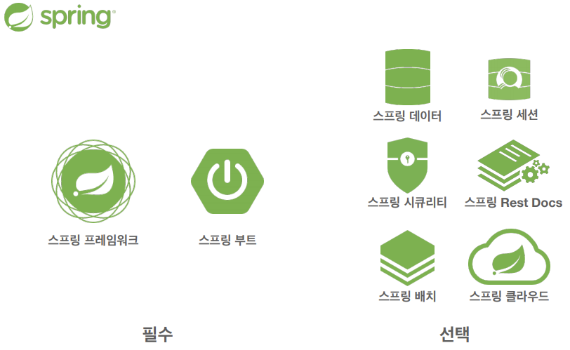

# 객체 지향 설계와 스프링

## 스프링 탄생
### EJB (Enterprise Java Beans)
- 2000년대 초반에 자바 진영의 표준으로 사용되던 기술
- 트랜잭션 설정, 분산기술 등 이론 상으로 좋은 점들이 있었지만, 복잡하고 EJB에 의존적인 코드를 작성해야 하는 등의 문제점이 존재하였음

## 스프링 역사
- 2002년 로드 존슨이 EJB의 문제점을 지적하면서 스프링의 핵심 개념과 30,000라인 이상의 예제 코드를 선보이는 책을 출간하였다.
    - BeanFactory, ApplicationContext, POJO, 제어의 역전, 의존관계 주입 등
- 책 출간 직후, 유겐 휠러와 얀 카로프가 로드 존슨에게 오픈소스 프로젝트를 제안.
- 스프링의 핵심 코드의 상당수는 유겐 휠러가 지금도 개발하고있다.
- 스프링 이름은 전통적인 J2EE(EJB)라는 겨울을 넘어 새로운 시작이라는 뜻으로 지어졌다.

### 출시(release)
- 2003년 스프링 프레임워크 1.0 출시 - XML
- 2006년 스프링 프레임워크 2.0 출시 - XML 편의 기능 지원
- 2009년 스프링 프레임워크 3.0 출시 - 자바 코드로 설정
- 2013년 스프링 프레임워크 4.0 출시 - 자바 8
- 2014년 스프링 부트 1.0 출시
- 2017년 스프링 프레임워크 5.0, 스프링 부트 2.0 출시 - Reactive Programming 지원
- 2021년 현재 스프링 프레임워크 5.2.x, 스프링부트 2.3.x

## 스프링 생태계
### 스프링 프로젝트
- 
- 이외에도 여러 프로젝트들이 존재한다.
    - https://spring.io/projects
### 스프링 프레임워크
- 핵심 기술 : 스프링 DI 컨테이너, AOP,이벤트, 기타
- 웹 기술 : 스프링 MVC, 스프링 WebFlux
- 데이터 접근 기술 : 트랜잭션, JDBC, ORM 지원, XML 지원
- 기술 통합 : 캐시, 이메일, 원격접근, 스케줄링
- 테스트 : 스프링 기반 테스트 지원
- 언어 : 코틀린, 그루비
- 최근에는 스프링 부트를 통해 스프링 프레임워크의 기술들을 편리하게 사용
### 스프링 부트
- **스프링을 편리하게 사용할 수 있도록 지원, 최근에는 기본으로 사용**
- 단독으로 실행할 수 있는 스프링 애플리케이션을 쉽게 생성
- Tomcat 같은 웹 서버를 내장해서 별도의 웹 서버를 설치하지 않아도 됨
- 손쉬운 빌드 구성을 위한 starter 종속성 제공
- 스프링과 3rd parth(외부) 라이브러리 자동 구성
- 메트릭, 상태 확인, 외부 구성 같은 프로덕션 준비 기능 제공
- 관례에 의한 간결한 설정
### 스프링의 진짜 핵심
- 스프링은 자바 언어 기반의 프레임워크
- 자바 언어의 가장 큰 특징 : `객체 지향 언어`
- 스프링은 객체 지향 언어가 가진 강력한 특징을 살려내는 프레임워크
- 스프링은 `좋은 객체 지향` 애플리케이션을 개발할 수 있게 도와주는 프레임워크

## 좋은 객체 지향 프로그래밍
### 객체 지향 특징
- 추상화
- 캡슐화
- 상속
- `다형성`
### 객체 지향 프로그래밍
- 컴퓨터 프로그램을 일련의 명령어 목록으로 보는 것이 아닌, 여러 개의 독립된 단위인 `객체`들의 모임으로 여기는 것
- 프로그램을 `유연`하고 `변경`이 용이하게 만들기 때문에, 대규모 소프트웨어 개발에 많이 사용된다.
### 역할과 구현을 분리
- 자바 언어의 다형성을 활용
    - 역할 : 인터페이스
    - 구현 : 구현 클래스, 객체
- 객체를 설계할 때, `역할`과 `구현`을 명확히 분리
    - 역할(인터페이스)을 먼저 부여하고, 그 역할을 수행하는 구현 객체 만들기
### 객체의 협력이라는 관계부터 생각
- 혼자 있는 객체는 없다.
    - 클라이언트 : `요청`
    - 서버 : `응답`
- 수 많은 객체 클라이언트와 객체 서버는 서로 협력 관계를 가진다.
### 다형성의 본질
- 인터페이스를 구현한 객체 인스턴스를 `실행 시점에 유연하게 변경`할 수 있다.
- 다형성의 본질을 이해하려면 `협력`이라는 객체 사이의 관계에서 시작해야 함
- `클라이언트를 변경하지 않고, 서버의 구현 기능을 유연하게 변경할 수 있다.`
### 스프링과 객체 지향
- 스프링은 다형성을 극대화해서 이용할 수 있게 도와준다.
- 제어의 역전(IoC), 의존관계 주입(DI)은 다형성을 활용하여 역할과 구현을 편리하게 다룰 수 있도록 지원한다.

## 좋은 객체 지향 설계의 5가지 원칙(SOLID)
- 클린코드로 유명한 로버트 마틴이 좋은 객체 지향 설계의 5가지 원칙을 다음과 같이 정리하였다.
    - SRP : 단일 책임 원칙(Single Responsibility Principle)
    - OCP : 개방-폐쇄 원칙 (Open/Closed principle)
    - LSP : 리스코프 치환 원칙 (Liskov Substitution Principle)
    - ISP : 인터페이스 분리 원칙 (Interface Segregation Principle)
    - DIP : 의존관계 역전 원칙 (Dependency Inversion Principle)
### SRP 단일 책임 원칙
- 한 클래스는 하나의 책임만 가져야 한다.
    - 책임이란 문맥과 상황에 따라 다르므로 모호하다.
- 중요한 기준은 `변경`이다.
    - 변경이 있을 때, 파급 효과가 적으면 단일 책임 원칙을 잘 따른 것
        > ex) UI 변경, 객체의 생성과 사용을 분리
### OCP 개방-폐쇄 원칙
- 소프트웨어 요소는 `확장에는 열려`있으나, `변경에는 닫혀`있어야 한다.
- `다형성` 활용
- 인터페이스를 구현한 새로운 클래스를 하나 만들어서 새로운 기능을 구현
#### 문제점
```java
MemberRepository memberRepository = new MemoryMemberRepository(); // 기존 코드
MemberRepository memberRepository = new JdbcMemberRepository(); // 변경 코드
```
- **구현 객체를 변경하려면 클라이언트 코드를 변경해야 한다.**
- **분명 다형성을 사용했지만, OCP 원칙을 지킬 수 없다.**
- 객체를 생성하고, 연관관계를 맺어주는 별도의 조립, 설정자가 필요하다 => `스프링 DI 컨테이너`
### LSP 리스코프 치환 원칙
- 프로그램의 객체는 프로그램의 정확성을 깨뜨리지 않으면서 하위 타입의 인스턴스로 바꿀 수 있어야 한다.
- 단순히 컴파일에 성공하는 것을 넘어서는 이야기
    > ex) 자동차 인터페이스의 엑셀은 앞으로 가라는 기능, 뒤로 가게 구현하면 LSP 위반, 느리더라도 앞으로 가야 함.
### ISP 인터페이스 분리 원칙
- 특정 클라이언트를 위한 인터페이스 여러 개가 범용 인터페이스 하나보다 낫다.
    > ex) 자동차 인터페이스 -> 운전 인터페이스, 정비 인터페이스로 분리<br>
    > ex) 사용자 클라이언트 -> 운전자 클라이언트, 정비사 클라이언트로 분리
- 분리하면 정비 인터페이스 자체가 변해도, 운전자 클라이언트에 영향을 주지 않음
- **인터페이스가 명확해지고, 대체 가능성이 높아진다.**
### DIP 의존관계 역전 원칙
- **구체화(구현 클래스)에 의존하지 말고, 추상화(인터페이스)에 의존하라.**
- 의존성 주입은 이 원칙을 따르는 방법 중 하나이다.
- 앞에서 이야기한 `역할에 의존하게 해야 한다`는 것과 같다.
    - 객체 세상도 클라이언트가 인터페이스에 의존해야 유연하게 구현체를 변경할 수 있다.
- 그러나 OCP에서 설명한 MemberService는 인터페이스에 의존하지만, 구현 클래스도 동시에 의존한다.
```java
 MemberRepository m = new MemoryMemberRepository(); // DIP 위반
```

## 정리
- **스프링은 다음 기술로 다형성 + OCP, DIP를 가능하게 지원**
    - DI(Dependency Injection) : 의존관계, 의존성 주입
    - DI 컨테이너 제공
- **스프링은 클라이언트 코드의 변경 없이 기능 확장을 지원**
- 모든 설계에 `역할`과 `구현`을 분리하자.
- 인터페이스를 도입하는 것은 추상화라는 비용이 발생하므로, 기능을 확장할 가능성이 없다면, 구체 클래스를 직접 사용하고, 향후 꼭 필요할 때 리팩터링하여 인터페이스를 도입하는 것도 방법이다.