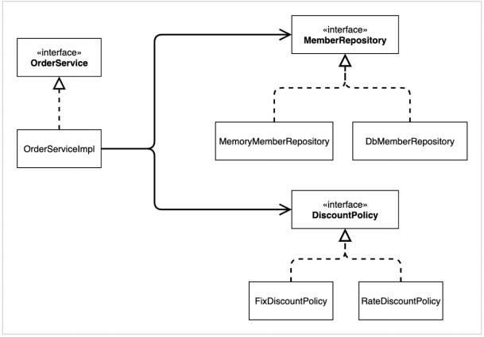

# 스프링 핵심 원리 이해1 - 예제 만들기
- 지금은 스프링 없는 순수한 자바로만 개발을 진행함으로써, 스프링의 장점을 명확하게 이해하는 것이 목표이다.
## 목차
- 프로젝트 생성
- 비즈니스 요구사항과 설계
- 회원 도메인 설계
- 회원 도메인 개발
- 회원 도메인 실행과 테스트
- 주문과 할인 도메인 설계
- 주문과 할인 도메인 개발
- 주문과 할인 도메인 실행과 테스트

## 프로젝트 생성
### 사전 준비물
- Java 11 설치
- IDE: IntelliJ 또는 Eclipse 설치
### 스프링 프로젝트 생성
- https://start.spring.io
- 프로젝트 선택
    - Project: Gradle Project
    - Spring Boot: 2.4.x
    - Language: Java
    - Packaging: Jar
    - Java: 11
- Project Metadata
    - groupId: hello
    - artifactId: core
- Dependencies
    - 선택하지 않음
### Gradle 전체 설정
- `build.gradle`
```gradle
plugins {
	id 'org.springframework.boot' version '2.4.5'
	id 'io.spring.dependency-management' version '1.0.11.RELEASE'
	id 'java'
}

group = 'hello'
version = '0.0.1-SNAPSHOT'
sourceCompatibility = '11'

repositories {
	mavenCentral()
}

dependencies {
	implementation 'org.springframework.boot:spring-boot-starter'
	testImplementation 'org.springframework.boot:spring-boot-starter-test'
}

test {
	useJUnitPlatform()
}
```
- 동작 확인
    - 기본 메인 클래스 실행(`CoreApplication.main()`)

### IntelliJ Gradle 대신에 자바 직접 실행
- 최근 IntelliJ 버전은 Gradle을 통해서 실행 하는 것이 기본으로 설정되어 있다.
- 다음과 같이 변경하면 자바로 바로 실행함으로써 실행속도를 더 향상시킬 수있다.
    - File -> Setting -> Build, Executuion, Deployment -> Build Tools -> Gradle
        - Build and run using: Gradle -> IntelliJ IDEA
        - Run tests using: Gradle -> IntelliJ IDEA

## 비즈니스 요구사항과 설계
- 회원
    - 회원가입과 회원조회가 가능하다.
    - 회원은 일반, VIP 등급이 존재한다.
    - 회원 데이터는 자체 DB를 구축할 수도 있고, 외부 시스템과 연동할 수도 있다. (미확정)
- 주문과 할인 정책
    - 회원은 상품을 주문할 수 있다.
    - 회원 등급에 따라 할인 정책을 적용할 수 있다.
    - 할인 정책은 모든 VIP에게 1,000원을 고정할인 적용 (추후 변경될 가능성)
    - 할인 정책은 변경 가능성이 높으며, 회사의 기본 할인 정책이 아직 정해지지 않은 상황, 오픈 직전까지 고민을 미루는 상황이며, 최악의 경우 할인을 적용하지 않을 수도 있다. (미확정)
- **요구사항을 보면 회원 데이터, 할인 정책같은 부분은 지금 결정하기 어려운 부분이다.**
- **객체 지향 설계 방법을 이용하여 인터페이스를 만들고 구현체를 언제든지 갈아끼울 수 있도록 설계하자.**

## 회원 도메인 설계
- 회원 도메인 요구사항
    - 회원 가입, 회원 조회 기능
    - 일반, VIP 등급
    - 회원 데이터는 자체 DB를 구축 or 외부시스템 연동 (미확정)
### 회원 도메인 협력 관계

### 회원 클래스 다이어그램

### 회원 객체 다이어그램


## 회원 도메인 개발
### 회원 엔티티
#### 회원 등급
```java
package hello.core.member;

public enum Grade {
    BASIC,
    VIP
}
```
#### 회원 엔티티
```java
package hello.core.member;

public class Member {
    private Long id;
    private String name;
    private Grade grade;

    public Member(Long id, String name, Grade grade) {
        this.id = id;
        this.name = name;
        this.grade = grade;
    }

    public Long getId() {
        return id;
    }

    public void setId(Long id) {
        this.id = id;
    }

    public String getName() {
        return name;
    }

    public void setName(String name) {
        this.name = name;
    }

    public Grade getGrade() {
        return grade;
    }

    public void setGrade(Grade grade) {
        this.grade = grade;
    }
}
```
### 회원 저장소
#### 회원 저장소 인터페이스
```java
package hello.core.member;

import hello.core.member.Member;

public interface MemberRepository {
    void save(Member member);
    Member findById(Long memberId);
}
```
#### 메모리 회원 저장소 구현체
```java
package hello.core.member;

public class MemberServiceImpl implements MemberService{

    private final MemberRepository memberRepository = new MemoryMemberRepository();

    @Override
    public void join(Member member) {
        memberRepository.save(member);
    }

    @Override
    public Member findMember(Long memberId) {
        return memberRepository.findById(memberId);
    }
}
```
- 데이터베이스가 아직 확정이 안되었지만, 개발은 진행해야 하므로 가장 단순한 메모리 회원 저장소를 구현하여 개발을 진행한다.
- 참고로 `HashMap`은 동시성 이슈가 발생할 수 있으므로, 실무에서는 `ConcurrentHashMap`을 사용하자.
### 회원 서비스
#### 회원 서비스 인터페이스
```java
package hello.core.member;

public interface MemberService {
    void join(Member member);
    Member findMember(Long memberId);
}
```
#### 회원 서비스 구현체
```java
package hello.core.member;

public class MemberServiceImpl implements MemberService{

    private final MemberRepository memberRepository = new MemoryMemberRepository();

    @Override
    public void join(Member member) {
        memberRepository.save(member);
    }

    @Override
    public Member findMember(Long memberId) {
        return memberRepository.findById(memberId);
    }
}
```

## 회원 도메인 실행과 테스트
### 회원 도메인 - 회원 가입 main
```java
package hello.core;

import hello.core.member.Grade;
import hello.core.member.Member;
import hello.core.member.MemberService;
import hello.core.member.MemberServiceImpl;

public class MemberApp {
    public static void main(String[] args) {
        MemberService memberService = new MemberServiceImpl();
        Member memberA = new Member(1L, "memberA", Grade.VIP);

        memberService.join(memberA);
        Member findMember = memberService.findMember(1L);

        System.out.println("new member = " + memberA.getName());
        System.out.println("findMember = " + findMember.getName());
    }
}
```
- 애플리케이션 로직으로 테스트 하는 것은 좋지 않은 방법이다.
- `JUnit 테스트`를 사용하자.
### 회원 도메인 - 회원 가입 테스트
```java
package hello.core.member;

import org.assertj.core.api.Assertions;
import org.junit.jupiter.api.Test;

public class MemberServiceTest {

    MemberService memberService = new MemberServiceImpl();

    @Test
    void join(){
        //given
        Member member = new Member(1L, "memberA", Grade.VIP);

        //when
        memberService.join(member);
        Member findMember = memberService.findMember(1L);

        //then
        Assertions.assertThat(member).isEqualTo(findMember);
    }
}
```
### 회원 도메인 설계의 문제점
- 다른 저장소로 변경할 때, `OCP`를 준수하지 않음.
- 의존관계가 인터페이스 뿐만 아니라, 구현까지 모두 의존하므로 `DIP`를 준수하지 않음.

## 주문과 할인 도메인 설계
- 주문과 할인 정책
    - 회원은 상품을 주문할 수 있다.
    - 회원 등급에 따라 할인 정책을 적용할 수 있다.
    - 할인 정책은 모든 VIP에게 1,000원을 고정할인 적용 (추후 변경될 가능성)
    - 할인 정책은 변경 가능성이 높으며, 회사의 기본 할인 정책이 아직 정해지지 않은 상황, 오픈 직전까지 고민을 미루는 상황이며, 최악의 경우 할인을 적용하지 않을 수도 있다. (미확정)
### 주문 도메인 협력, 역할, 책임

1. **주문 생성**: 클라이언트는 주문 서비스에 주문 생성을 요청
2. **회원 조회**: 할인을 위해서는 회원 등급이 필요하므로, 주문 서비스는 회원 저장소에서 회원을 조회
3. **할인 적용**: 주문 서비스는 회원 등급에 따른 할인 여부를 할인 정책에 위임
4. **주문 결과 반환**: 주문 서비스는 할인 결과를 포함한 주문 결과를 반환
> 참고: 실제로는 주문 데이터를 DB에 저장하겠지만, 예제에서는 생략하고, 단순하게 주문 결과만 반환하도록 설계 함.
### 주문 도메인 전체

- `역할과 구현을 분리`해서 자유롭게 구현 객체를 조립할 수 있게 설계했다.
- 덕분에 회원 저장소는 물론이고, 할인 정책도 유연하게 변경할 수 있다.
### 주문 도메인 클래스 다이어그램

### 주문 도메인 객체 다이어그램1

- 회원을 메모리에서 조회하고, 정액 할인 정책(고정 금액)을 지원해도 주문 서비스를 변경하지 않아도 된다.
- 역할들의 협력 관계를 그대로 재사용 할 수 있다.
### 주문 도메인 객체 다이어그램2

- 회원을 메모리가 아닌 실제 DB에서 조회하고, 정률 할인 정책(주문 금액에 따라 % 할인)을 지원해도 주문 서비스를 변경하지 않아도 된다.
- 협력 관게를 그대로 재사용 할 수 있다.

## 주문과 할인 도메인 개발
### 할인 도메인
#### 할인 정책 인터페이스
```java
package hello.core.discount;

import hello.core.member.Member;

public interface DiscountPolicy {
    /**
    * @return 할인 대상 금액
    * */
    int discount(Member member, int price);
}
```
#### 정액 할인 정책 구현체
```java
package hello.core.discount;

import hello.core.member.Grade;
import hello.core.member.Member;

public class FixDiscountPolicy implements DiscountPolicy {

    private int discountFixAmount = 1000; // 1000원 할인

    @Override
    public int discount(Member member, int price) {
        if (member.getGrade() == Grade.VIP) {
            return discountFixAmount;
        } else {
            return 0;
        }
    }
}
```
### 주문 도메인
- VIP만 1,000원 할인
#### 주문 엔티티
```java
package hello.core.order;

public class Order {

    private Long memberId;
    private String itemName;
    private int itemPrice;
    private int discountPrice;

    public Order(Long memberId, String itemName, int itemPrice, int discountPrice) {
        this.memberId = memberId;
        this.itemName = itemName;
        this.itemPrice = itemPrice;
        this.discountPrice = discountPrice;
    }

    public int calculatePrice(){
        return itemPrice - discountPrice;
    }

    public Long getMemberId() {
        return memberId;
    }

    public void setMemberId(Long memberId) {
        this.memberId = memberId;
    }

    public String getItemName() {
        return itemName;
    }

    public void setItemName(String itemName) {
        this.itemName = itemName;
    }

    public int getItemPrice() {
        return itemPrice;
    }

    public void setItemPrice(int itemPrice) {
        this.itemPrice = itemPrice;
    }

    public int getDiscountPrice() {
        return discountPrice;
    }

    public void setDiscountPrice(int discountPrice) {
        this.discountPrice = discountPrice;
    }

    @Override
    public String toString() {
        return "Order{" +
                "memberId=" + memberId +
                ", itemName='" + itemName + '\'' +
                ", itemPrice=" + itemPrice +
                ", discountPrice=" + discountPrice +
                '}';
    }
}
```
#### 주문 서비스 인터페이스
```java
package hello.core.order;

public interface OrderService {
    Order createOrder(Long memberId, String itemName, int itemPrice);
}
```
#### 주문 서비스 구현체
```java
package hello.core.order;

import hello.core.discount.DiscountPolicy;
import hello.core.discount.FixDiscountPolicy;
import hello.core.member.Member;
import hello.core.member.MemberRepository;
import hello.core.member.MemoryMemberRepository;

public class OrderServiceImpl implements  OrderService{

    private final MemberRepository memberRepository = new MemoryMemberRepository();
    private final DiscountPolicy discountPolicy = new FixDiscountPolicy();

    @Override
    public Order createOrder(Long memberId, String itemName, int itemPrice) {
        Member member = memberRepository.findById(memberId);
        // 할인 정책에 관한 내용은 여기서 알 수 없음.
        // 할인 정책에 관해 변경이 필요하면 discountPolicy만 수정하면 된다.
        // 즉, 단일 책임 원칙(SRP)를 잘 지킨 경우이다.
        int discountPrice = discountPolicy.discount(member, itemPrice);

        return new Order(memberId, itemName, itemPrice, discountPrice);
    }
}
```
- 주문 생성 요청이 오면, 회원 정보를 조회하고 할인 정책을 적용한 다음 주문 객체를 생성해서 반환한다.
- **메모리 회원 리포지토리와 고정 금액 할인 정책을 구현체로 생성한다.**

## 주문과 할인 도메인 실행과 테스트
### 주문과 할인 정책 실행
```java
package hello.core;

import hello.core.member.Grade;
import hello.core.member.Member;
import hello.core.member.MemberService;
import hello.core.member.MemberServiceImpl;
import hello.core.order.Order;
import hello.core.order.OrderService;
import hello.core.order.OrderServiceImpl;

public class OrderApp {
    public static void main(String[] args) {
        MemberService memberService = new MemberServiceImpl();
        OrderService orderService = new OrderServiceImpl();

        Long memberId = 1L;
        Member member = new Member(memberId, "memberA", Grade.VIP);
        memberService.join(member);

        Order order = orderService.createOrder(memberId, "itemA", 10000);
        System.out.println("order = " + order.toString());
        System.out.println("order.calculatePrice = " + order.calculatePrice());
    }
}
```
- 결과
    > order = Order{memberId=1, itemName='itemA', itemPrice=10000, 
discountPrice=1000}<br>
    > order.calculatePrice = 9000
- 할인 금액이 잘 출력되는 것을 확인할 수 있다.
- 애플리케이션 로직으로 테스트 하는 방법은 좋지 않으므로, `JUnit 테스트`를 사용하자.
### 주문과 할인 정책 테스트
```java
package hello.core.order;

import hello.core.member.Grade;
import hello.core.member.Member;
import hello.core.member.MemberService;
import hello.core.member.MemberServiceImpl;
import org.assertj.core.api.Assertions;
import org.junit.jupiter.api.Test;

public class OrderServiceTest {

    MemberService memberService = new MemberServiceImpl();
    OrderService orderService = new OrderServiceImpl();

    @Test
    void createOrder(){
        //given
        Long memberId = 1L;
        Member member = new Member(memberId, "memberA", Grade.VIP);

        //when
        memberService.join(member);

        //then
        Order order = orderService.createOrder(memberId, "itemA", 10000);
        Assertions.assertThat(order.getDiscountPrice()).isEqualTo(1000);
    }
}
```