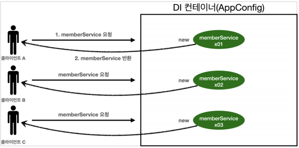
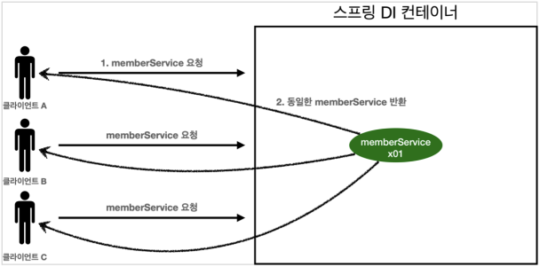
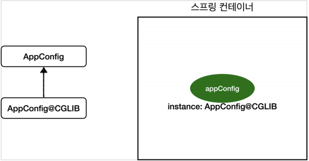

# 싱글톤 컨테이너
## 목차
- 웹 애플리케이션과 싱글톤
- 싱글톤 패턴
- 싱글톤 컨테이너
- 싱글톤 방식의 주의점
- @Configuration과 싱글톤
- @Configuration과 바이트코드 조작의 마법

## 웹 애플리케이션과 싱글톤
- 스프링은 태생이 기업용 온라인 서비스 기술을 지원하기 위해 탄생했다.
- 대부분의 스프링 애플리케이션은 웹 애플리케이션이다. 물론 웹이 아닌 애플리케이션 개발도 가능하다.
- 웹 애플리케이션은 보통 여러 고객이 동시에 요청을 한다.
- 
- **스프링 없는 순수한 DI 컨테이너 테스트**
```java
public class SingletonTest {

    @Test
    @DisplayName("스프링 없는 순수한 DI 컨테이너")
    void pureContainer() {
        AppConfig appConfig = new AppConfig();
        //1. 조회: 호출할 때 마다 객체를 생성
        MemberService memberService = appConfig.memberService();

        //2. 조회: 호출할 때 마다 객체를 생성
        MemberService memberService1 = appConfig.memberService();

        System.out.println("memberService = " + memberService);
        System.out.println("memberService1 = " + memberService1);

        // memberService != memberService1
        assertThat(memberService).isNotSameAs(memberService1);
    }
}
```
- 우리가 만들었던 스프링 없는 순수한 DI 컨테이너인 AppConfig는 요청을 할 때마다 객체를 새로 생성한다.
- 고객 트래픽이 초당 100이 나오면, 초당 100개 객체가 생성되고 소멸된다! -> 메모리 낭비가 심하다.
- 해결방안은 해당 객체가 딱 1개만 생성되고, 공유하도록 설계하면 된다. -> 싱글톤 패턴

## 싱글톤 패턴
- 클래스의 인스턴스가 딱 1개만 생성되는 것을 보장하는 디자인 패턴이다.
- 그래서 객체 인스턴스를 2개 이상 생성하지 못하도록 막아야 한다.
    - private 생성자를 사용해서 외부에서 임의로 new 키워드를 사용하지 못하도록 막아야 한다.
- 싱글톤 패턴을 적용한 예제 코드를 보자. **main이 아닌 test 위치에 생성하자.**
```java
public class SingletonService {

    // 1. static 영역에 객체를 딱 1개만 생성해둔다.
    private static final SingletonService instance = new SingletonService();

    // 2. public으로 열어서 객체 인스턴스가 필요하면, 이 static 메소드를 통해서만 조회하도록 허용한다.
    public static SingletonService getInstance() {
        return instance;
    }

    // 3. 생성자를 private으로 선언해서 외부에서 new 키워드를 사용한 객체 생성을 못하게 막는다.
    private SingletonService() {
    }

    public void logic() {
        System.out.println("싱글톤 객체 로직 호출");
    }
}
```
1. static 영역에 객체 instance를 미리 하나 생성해서 올려둔다.
2. 이 객체 인스턴스가 필요하면 오직 `getinstance()` 메소드를 통해서만 조회할 수 있다.
    - 이 메소드를 호출하면 항상 같은 인스턴스를 반환한다.
3. 딱 1개의 객체 인스턴스만 존재해야 하므로, 생성자를 private으로 막아서 혹시라도 외부에서 new 키워드로 객체 인스턴스가 생성되는 것을 막는다.
- 싱글톤 패턴을 사용하는 테스트 코드를 보자.
```java
@Test
@DisplayName("싱글톤 패턴을 적용한 객체 사용")
void singletonServiceTest() {

    // private으로 생성자를 막아두었다. 컴파일 오류가 발생한다.
    // new SingletonService();

    SinletonService singletonService = SingletonService.getInstance();
    SingletonService singletonService1 = SingletonService.getInstance();

    System.out.println("singletonService = " + singletonService);
    System.out.println("singletonService1 = " + singletonService1);

    assertThat(singletonService).isSameAs(singletonService1);
    // SameAs : 인스턴스 비교(같은 메모리 위치를 참조하는지 확인)
    // EqualTo : equals() 비교(값 자체를 비교)
}
```
- private으로 new 키워드를 막아두었다.
- 호출할 때 마다 같은 객체 인스턴스를 반환하는 것을 확인할 수 있다.
> 참고 : 싱글톤 패턴을 구현하는 방법은 여러가지가 있다. 여기서는 객체를 미리 생성해두는 가장 단순하고 안전한 방법을 선택했다.
- 싱글톤 패턴을 적용하면 고객의 요청이 올 때마다 객체를 생성하는 것이 아니라, 이미 만들어진 객체를 공유해서 효율적으로 사용할 수 있다.
- 하지만 싱글톤 패턴은 다음과 같은 수 많은 문제점들을 가지고 있다.
- **싱글톤 패턴 문제점**
    - 싱글톤 패턴을 구현하는 코드 자체가 많이 들어간다.
    - 의존관계상 클라이언트가 구체 클래스에 의존한다. -> DIP를 위반한다.
    - 클라이언트가 구체 클래스에 의존해서 OCP 원칙을 위반할 가능성이 높다.
    - 테스트하기 어렵다.
    - 내부속성을 변경하거나 초기화하기 어렵다.
    - private 생성자로 자식 클래스를 만들기 어렵다.
    - 결론적으로 유연성이 떨어진다.
    - 안티패턴으로 불리기도 한다.

## 싱글톤 컨테이너
- 스프링 컨테이너는 싱글톤 패턴의 문제점을 해결하면서, 객체 인스턴스를 싱글톤(1개만 생성)으로 관리한다.
- 지금까지 우리가 학습한 스프링 빈이 바로 싱글톤으로 관리되는 빈이다.
- **싱글톤 컨테이너**
    - 스프링 컨테이너는 싱글톤 패턴을 적용하지 않아도, 객체 인스턴스를 싱글톤으로 관리한다.
        - 이전에 설명한 컨테이너 생성 과정을 자세히 보자. 컨테이너는 객체를 하나만 생성해서 관리한다.
    - 스프링 컨테이너는 싱글톤 컨테이너 역할을 한다. 이렇게 싱글톤 객체를 생성하고 관리하는 기능을 **싱글톤 레지스트리**라 한다.
    - 스프링 컨테이너의 이런 기능 덕분에 싱글톤 패턴의 모든 단점을 해결하면서 객체를 싱글톤으로 유지할 수 있다.
        - 싱글톤 패턴을 위한 지저분한 코드가 들어가지 않아도 된다.
        - DIP, OCP, 테스트, private 생성자로부터 자유롭게 싱글톤을 사용할 수 있다.
- **스프링 컨테이너를 사용하는 테스트 코드**
```java
@Test
@DisplayName("스프링 컨테이너와 싱글톤")
void springContainer(){
    ApplicationContext ac = new AnnotationConfigApplicationContext(AppConfig.class);
    //1. 조회: 호출할 때 마다 객체를 생성
    MemberService memberService = ac.getBean("memberService", MemberService.class);

    //2. 조회: 호출할 때 마다 객체를 생성
    MemberService memberService1 = ac.getBean("memberService", MemberService.class);

    System.out.println("memberService = " + memberService);
    System.out.println("memberService1 = " + memberService1);

    assertThat(memberService).isSameAs(memberService1);
}
```
- **싱글톤 컨테이너 적용 후**
    - 
    - 스프링 컨테이너 덕분에 고객의 요청이 올 때마다 객체를 생성하는 것이 아니라, 이미 만들어진 객체를 공유해서 효율적으로 재사용할 수 있다.
    > 참고 : 스프링의 기본 빈 등록 방식은 싱글톤이지만, 싱글톤 방식만 지원하는 것은 아니다. 요청할 때마다 새로운 객체를 생성해서 반환하는 기능도 제공한다. 자세한 내용은 뒤의 빈 스코프에서 살펴본다.

## 싱글톤 방식의 주의점
- 싱글톤 패턴이든, 스프링 같은 싱글톤 컨테이너를 사용하든, 객체 인스턴스를 하나만 생성해서 공유하는 싱글톤 방식은 여러 클라이언트가 하나의 객체 인스턴스를 공유하기 때문에, 싱글톤 객체는 상태를 유지(stateful)하게 설계하면 안된다.
- <b>무상태(stateless)</b>로 설계해야 한다!
    - 특정 클라이언트에 의존적인 필드가 있으면 안된다.
    - 특정 클라이언트가 값을 변경할 수 있는 필드가 있으면 안된다.
    - 가급적 읽기만 가능해야 한다.
    - 필드대신에 자바에서 공유되지 않는 지역변수, 파라미터, ThreadLocal 등을 사용해야 한다.
- 스프링 빈의 필드에 공유 값을 설정하면 정말 큰 장애가 발생할 수 있다!!!
- **상태를 유지할 경우 발생하는 예시**
```java
public class StatefulService {

    private int price; // 상태를 유지하는 필드

    public int order(String name, int price){
        System.out.println("name = " + name + " price = " + price);
        this.price = price; // 여기가 문제!
        return price;
    }

    public int getPrice(){
        return price;
    }
}
```
```java
class StatefulServiceTest {

    @Test
    void statefulServiceSingleton(){
        ApplicationContext ac = new AnnotationConfigApplicationContext(TestConfig.class);
        StatefulService statefulService = ac.getBean(StatefulService.class);
        StatefulService statefulService1 = ac.getBean(StatefulService.class);

        // ThreadA: A사용자 10000원 주문
        statefulService.order("userA", 10000);
        // ThreadB: B사용자 20000원 주문
        statefulService1.order("userB", 20000);

        // ThreadA: 사용자A 주문 금액 조회
        int price = statefulService.getPrice();
        // ThreadA: 사용자A는 10000원을 기대했지만, 기대와 다르게 20000원 출력
        System.out.println("price = " + price);

        assertThat(statefulService.getPrice()).isEqualTo(20000);

        System.out.println("price = " + userAPrice);

    }

    static class TestConfig{

        @Bean
        public StatefulService statefulService(){
            return new StatefulService();
        }
    }

}
```
- 단순한 예제를 위해, 실제 쓰레드는 사용하지 않았다.
- ThreadA가 사용자A 코드를 호출하고, ThreadB가 사용자B 코드를 호출한다고 가정한다.
- `StatefulService`의 `price` 필드는 공유되는 필드인데, 특정 클라이언트가 값을 변경한다.
- 사용자A의 주문금액은 10000원이 되어야 하는데, 20000원이라는 결과가 나왔다.
- 실무에서 이런 경우가 종종 발생하는데, 이로인해 정말 해결하기 어려운 문제들이 발생한다고 한다.
- 공유필드는 꼭 조심해야 한다! 스프링 빈은 항상 무상태(stateless)로 설계하자.

## @Configuration과 싱글톤
- 이상한 점이 하나 있다. 다음 AppConfig 코드를 보자.
```java
@Configuration
public class AppConfig {

    @Bean
    public MemberService memberService(){
        return new MemberServiceImpl(memberRepository());
    }

    @Bean
    public OrderService orderService(){
        return new OrderServiceImpl(memberRepository(), discountPolicy());
    }

    @Bean
    public MemberRepository memberRepository() {
        return new MemoryMemberRepository();
    }

    @Bean
    public DiscountPolicy discountPolicy() {
        return new RateDiscountPolicy();
    }
}
```
- memberService 빈을 만드는 코드를 보면 `memberRepository()`를 호출한다.
    - 이 메소드를 호출하면 `new MemoryMemberRepository()`를 호출한다.
- orderService 빈을 만드는 코드도 동일하게 `memberRepository()`를 호출한다.
    - 이 메소드를 호출하면 `new MemoryMemberRepository()`를 호출한다.
- 결과적으로 각각 다른 2개의 `MemoryMemberRepository`가 생성되면서 싱글톤이 깨지는 것처럼 보인다. 스프링 컨테이너는 이 문제를 어떻게 해결할까?
- 직접 테스트 해보자.
- **검증 용도의 코드 추가**
```java
public class MemberServiceImpl implements MemberService{

    private final MemberRepository memberRepository;
    ...
    // 테스트 용도
    public MemberRepository getMemberRepository(){
        return memberRepository;
    }
}
public class OrderServiceImpl implements OrderService{

    private final MemberRepository memberRepository;
    ...
    // 테스트 용도
    public MemberRepository getMemberRepository(){
        return memberRepository;
    }
}
```
- 테스트를 위해 MemberRepository를 조회할 수 있는 기능을 추가한다.
- 기능 검증을 위해 잠시 사용하는 것이니 인터페이스에는 조회기능을 추가하지 않았다.
- **테스트 코드**
```java
public class ConfigurationSingletonTest {

    @Test
    void configurationTest(){
        ApplicationContext ac = new AnnotationConfigApplicationContext(AppConfig.class);

        MemberServiceImpl memberService = ac.getBean("memberService", MemberServiceImpl.class);
        OrderServiceImpl orderService = ac.getBean("orderService", OrderServiceImpl.class);
        MemberRepository memberRepository2 = ac.getBean("memberRepository", MemberRepository.class);

        MemberRepository memberRepository = memberService.getMemberRepository();
        MemberRepository memberRepository1 = orderService.getMemberRepository();

        // 모두 같은 인스턴스를 참조하고 있다.
        System.out.println("memberService -> memberRepository = " + memberRepository);
        System.out.println("orderService -> memberRepository = " + memberRepository1);
        System.out.println("memberRepository2 = " + memberRepository2);

        // 모두 같은 인스턴스를 참조하고 있다.
        assertThat(memberService.getMemberRepository()).isSameAs(memberRepository2);
        assertThat(orderService.getMemberRepository()).isSameAs(memberRepository2);
    }
}
```
- 확인 해 보면, memberRepository 인스턴스는 모두 같은 인스턴스가 공유되어 사용된다.
- AppConfig의 자바 코드를 보면 분명히 각각 2번 `new MemoryMemberRepository`를 호출해서 다른 인스턴스가 생성되어야 하는데?
- 어떻게 된 일일까? 혹시 두 번 호출이 안되는 것인지 확인 해 보자.
- **AppConfig에 호출 로그 추가**
```java
@Configuration
public class AppConfig {

    @Bean
    public MemberService memberService(){
        System.out.println("call AppConfig.memberService");
        return new MemberServiceImpl(memberRepository());
    }

    @Bean
    public OrderService orderService(){
        System.out.println("call AppConfig.orderService");
        return new OrderServiceImpl(memberRepository(), discountPolicy());
    }

    @Bean
    public MemberRepository memberRepository() {
        System.out.println("call AppConfig.memberRepository");
        return new MemoryMemberRepository();
    }

    @Bean
    public DiscountPolicy discountPolicy() {
        return new RateDiscountPolicy();
    }
}
```
- 스프링 컨테이너가 각각 @Bean을 호출해서 스프링 빈을 생성한다. 그래서 `memberRepository()`는 다음과 같이 총 3번이 호출되어야 하는 것 아닌가?
    1. 스프링 컨테이너가 스프링 빈에 등록하기 위해 @Bean이 붙어있는 `memberRepository()` 호출
    2. memberService() 로직에서 `memberRepository()` 호출
    3. orderService() 로직에서 `memberRepository()` 호출
    - 하지만 출력 결과는 모두 1번만 호출된다.
    ```
    call AppConfig.memberService
    call AppConfig.memberRepository
    call AppConfig.orderService
    ```

## @Configuration과 바이트코드 조작의 마법
- 스프링 컨테이너는 **싱글톤 레지스트리**다. 따라서 스프링 빈이 싱글톤이 되도록 보장해주어야 한다.
- 그러나 스프링이 자바 코드까지 어떻게 하기는 어려우므로, 저 자바 코드를 보면 분명 3번 호출되어야 하는 것이 맞지 않을까?
    - 그렇지 않다. 스프링은 클래스의 **바이트코드를 조작하는 라이브러리를 사용**하기 때문이다!
    - 모든 비밀은 `@Configuration`을 적용한 `AppConfig`에 있다.
- 다음 코드를 보자
```java
@Test
void configurationDeep() {
    ApplicationContext ac = new AnnotationConfigApplicationContext(AppConfig.class);
    //AppConfig도 스프링 빈으로 등록된다.
    AppConfig bean = ac.getBean(AppConfig.class);
 
    System.out.println("bean = " + bean.getClass());
    //출력: bean = class hello.core.AppConfig$$EnhancerBySpringCGLIB$$bd479d70
}
```
- 사실 `AnnotationConfigApplicationContext`에 파라미터로 넘긴 값은 스프링 빈으로 등록된다. 그래서 `AppConfig`도 스프링 빈이 된다.
- `AppConfig` 스프링 빈을 조회해서 클래스 정보를 출력해보자.
```
bean = class hello.core.AppConfig$$EnhancerBySpringCGLIB$$bd479d70
```
- 순수한 클래스라면 다음과 같이 출력되어야 한다.
```
class hello.core.AppConfig
```
- 그런데 예상과는 다르게 클래스 명에 `xxxCGLIB`가 붙으면서 상당히 복잡해진 것을 볼 수 있다.
    - 이 것은 스프링이 **CGLIB**라는 바이트코드 조작 라이브러리를 사용해서 AppConfig 클래스를 상속받은 임의의 다른 클래스를 만들고, 그 다른 클래스를 스프링 빈으로 등록한 것이다!
    - **그림**
        - 
    - 그 임의의 다른 클래스가 바로 싱글톤이 보장되도록 해준다.
    - 아마도 다음과 같이 바이트 코드를 조작해서 작성되어 있을 것이다.(실제로는 CGLIB의 내부 기술을 사용하는 데, 매우 복잡하다.)
    - **AppConfig@CGLIB 예상 코드**
    ```java
    @Bean
    public MemberRepository memberRepository() {
 
        if (memoryMemberRepository가 이미 스프링 컨테이너에 등록되어 있으면?) {
            return 스프링 컨테이너에서 찾아서 반환;
        } else { //스프링 컨테이너에 없으면 
            기존 로직을 호출해서 MemoryMemberRepository를 생성하고 스프링 컨테이너에 등록 
            return 반환
        }
    }
    ```
    - @Bean이 붙은 메소드마다 이미 스프링 빈이 존재하면, 존재하는 빈을 반환하고, 스프링 빈이 없으면, 생성해서 스프링 빈으로 등록하고 반환하는 코드가 동적으로 만들어진다.
    - 덕분에 싱글톤이 보장되는 것이다.
    > **참고**: AppConfig@CGLIB는 AppConfig의 자식 타입이므로, AppConfig 타입으로 조회할 수 있다.
### `@Configuration`을 적용하지 않고, `@Bean`만 적용하면 어떻게 될까?
- `@Configuration`을 붙이면 바이트 코드를 조작하는 CGLIB 기술을 사용해서 싱글톤을 보장하지만, 만약 @Bean만 적용하면 어떻게 될까?
```java
//@Configuration 삭제
public class AppConfig {
    ...
}
```
- 이제 똑같이 실행해보자.
```
bean = class hello.core.AppConfig
```
- 이 출력 결과를 통해 AppConfig가 CGLIB 기술 없이 순수한 AppConfig로 스프링 빈에 등록된 것을 확인할 수 있다.
```
call AppConfig.memberService
call AppConfig.memberRepository
call AppConfig.orderService
call AppConfig.memberRepository
call AppConfig.memberRepository
```
- 이 출력 결과를 통해서 MemberRepository가 총 3번 호출된 것을 알 수 있다.
- 1번은 @Bean에 의해 스프링 컨테이너에 등록하기 위해서이고, 2번은 각각 `memberRepository()`를 호출하면서 발생한 것이다.
- **인스턴스가 같은지 테스트 결과**
```
memberService -> memberRepository = hello.core.member.MemoryMemberRepository@6239aba6
orderService -> memberRepository = hello.core.member.MemoryMemberRepository@3e6104fc
memberRepository = hello.core.member.MemoryMemberRepository@12359a82
```
- 당연히 인스턴스가 같은지 테스트하는 코드도 실패하고, 모두 각각 다른 MemoryMemberRepository 인스턴스를 가지고 있다.
- **정리**
    - @Bean만 사용해도 스프링 빈으로 등록되지만, 싱글톤을 보장하지 않는다.
        - `memberRepository()`처럼 의존관계 주입이 필요해서 메소드를 직접 호출할 때 싱글톤을 보장하지 않는다.
        - 그러므로 스프링 설정 정보는 항상 `@Configuration`을 사용하자.