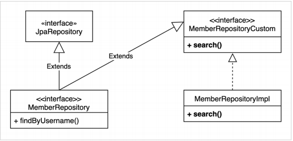

# 실무 활용 - 스프링 데이터 JPA와 Querydsl
## 목차
- 스프링 데이터 JPA 리포지토리로 변경
- 사용자 정의 리포지토리
- 스프링 데이터 페이징 활용1 - Querydsl 페이징 연동
- 스프링 데이터 페이징 활용2 - CountQuery 최적화
- 스프링 데이터 페이징 활용3 - 컨트롤러 개발
___
## 스프링 데이터 JPA 리포지토리로 변경
- <b>스프링 데이터 JPA - MemberRepository 생성</b>
    ```java
    @Repository
    public interface MemberRepository extends JpaRepository<Member, Long> {
        List<Member> findByUsername(String username);
    }
    ```
- <b>스프링 데이터 JPA 테스트</b>
    ```java
    @Test
    void basicTest() throws Exception {
        // given
        Member member = new Member("member1", 10);
        memberRepository.save(member);

        // when
        Member findMember = memberRepository.findById(member.getId()).get();
        List<Member> result1 = memberRepository.findAll();
        List<Member> result2 = memberRepository.findByUsername("member1");

        // then
        assertThat(findMember).isEqualTo(member);
        assertThat(result1).containsExactly(member);
        assertThat(result2).containsExactly(member);
    }
    ```
    - Querydsl 전용 기능인 회원 search를 작성할 수 없다. -> 사용자 정의 리포지토리 필요
___
## 사용자 정의 리포지토리
- <b>사용자 정의 리포지토리 사용법</b>
    1. 사용자 정의 인터페이스 작성
    2. 사용자 정의 인터페이스 구현
    3. 스프링 데이터 리포지토리에 사용자 정의 인터페이스 상속
- <b>사용자 정의 리포지토리 구성</b><br>
    
    - `[설계적 측면]`
        - 쿼리가 복잡하거나, 범용성이 없고, 특정 API에 종속되어 있다면, 별도로 `조회용 Repository`를 만드는 편이 좋다. 
            > ex)MemberQueryRepository
        - 핵심 비즈니스 로직, 재사용성이 높은 경우에는 커스텀을 만들어서 MemberRepository에 추가하자.
- <b>1. 사용자 정의 인터페이스 작성</b>
    ```java
    public interface MemberRepositoryCustom {
        List<MemberTeamDto> search(MemberSearchCondition condition);
    }
    ```
- <b>2. 사용자 정의 인터페이스 구현</b>
    ```java
    @RequiredArgsConstructor
    public class MemberRepositoryCustomImpl implements MemberRepositoryCustom {

        private final JPAQueryFactory queryFactory;

        @Override
        public List<MemberTeamDto> search(MemberSearchCondition condition) {
            return queryFactory
                    .select(new QMemberTeamDto(
                            member.id,
                            member.username,
                            member.age,
                            team.id,
                            team.name
                    ))
                    .from(member)
                    .leftJoin(member.team, team)
                    .where(
                            usernameEq(condition.getUsername()),
                            teamNameEq(condition.getTeamName()),
                            ageGoe(condition.getAgeGoe()),
                            ageLoe(condition.getAgeLoe()))
                    .fetch();
        }


        private BooleanExpression usernameEq(String username) {
            return StringUtils.hasText(username) ? member.username.eq(username) : null;
        }

        private BooleanExpression teamNameEq(String teamName) {
            return StringUtils.hasText(teamName) ? team.name.eq(teamName) : null;
        }

        private BooleanExpression ageGoe(Integer ageGoe) {
            return ageGoe != null ? member.age.goe(ageGoe) : null;
        }

        private BooleanExpression ageLoe(Integer ageLoe) {
            return ageLoe != null ? member.age.loe(ageLoe) : null;
        }
    }
    ```
- <b>3. 스프링 데이터 리포지토리에 사용자 정의 인터페이스 상속</b>
    ```java
    @Repository
    public interface MemberRepository extends JpaRepository<Member, Long>, MemberRepositoryCustom {
        List<Member> findByUsername(String username);
    }
    ```
- <b>커스텀 리포지토리 동작 테스트 추가</b>
    ```java
    @Test
    void searchTest() throws Exception {
        // given
        Team teamA = new Team("teamA");
        Team teamB = new Team("teamB");

        em.persist(teamA);
        em.persist(teamB);

        Member member1 = new Member("member1", 10, teamA);
        Member member2 = new Member("member2", 20, teamA);
        Member member3 = new Member("member3", 30, teamB);
        Member member4 = new Member("member4", 40, teamB);

        em.persist(member1);
        em.persist(member2);
        em.persist(member3);
        em.persist(member4);

        // when
        MemberSearchCondition condition = new MemberSearchCondition();
        condition.setAgeGoe(35);
        condition.setAgeLoe(40);
        condition.setTeamName("teamB");

        List<MemberTeamDto> result = memberRepository.search(condition);

        // then
        assertThat(result)
                .extracting("username")
                .containsExactly("member4");
    }
    ```
___
## 스프링 데이터 페이징 활용1 - Querydsl 페이징 연동
- 스프링 데이터의 Page, Pageable을 활용해보자.
- 전체 카운트를 한 번에 조회하는 단순한 방법
- 데이터 내용과 전체 카운트를 별도로 조회하는 방법<br><br>
- <b>사용자 정의 인터페이스에 페이징 2가지 추가</b>
    ```java
    public interface MemberRepositoryCustom {
        List<MemberTeamDto> search(MemberSearchCondition condition);
        Page<MemberTeamDto> searchPageSimple(MemberSearchCondition condition, Pageable pageable);
        Page<MemberTeamDto> searchPageComplex(MemberSearchCondition condition, Pageable pageable);
    }
    ```
- <b>전체 카운트를 한 번에 조회하는 단순한 방법<br>searchPageSimple(), fetchResults() 사용</b>
    ```java
    @Override
    public Page<MemberTeamDto> searchPageSimple(MemberSearchCondition condition, Pageable pageable) {
        QueryResults<MemberTeamDto> results = queryFactory
                .select(new QMemberTeamDto(
                        member.id,
                        member.username,
                        member.age,
                        team.id,
                        team.name
                ))
                .from(member)
                .leftJoin(member.team, team)
                .where(
                        usernameEq(condition.getUsername()),
                        teamNameEq(condition.getTeamName()),
                        ageGoe(condition.getAgeGoe()),
                        ageLoe(condition.getAgeLoe()))
                .offset(pageable.getOffset())
                .limit(pageable.getPageSize())
                .fetchResults();

        List<MemberTeamDto> content = results.getResults();
        long total = results.getTotal();

        return new PageImpl<>(content, pageable, total);
    }
    ```
    - Querydsl이 제공하는 `fetchResults()`를 사용하면 내용과 전체 카운트를 한 번에 조회할 수 있다. (실제 쿼리는 2번 호출)
    - `fetchResult()`는 카운트 쿼리 실행 시, 필요 없는 `order by`는 제거한다.
- <b>데이터 내용과 전체 카운트를 별도로 조회하는 방법<br>searchPageComplex()</b>
    ```java
    @Override
    public Page<MemberTeamDto> searchPageComplex(MemberSearchCondition condition, Pageable pageable) {
        List<MemberTeamDto> content = queryFactory
                .select(new QMemberTeamDto(
                        member.id,
                        member.username,
                        member.age,
                        team.id,
                        team.name
                ))
                .from(member)
                .leftJoin(member.team, team)
                .where(
                        usernameEq(condition.getUsername()),
                        teamNameEq(condition.getTeamName()),
                        ageGoe(condition.getAgeGoe()),
                        ageLoe(condition.getAgeLoe()))
                .offset(pageable.getOffset())
                .limit(pageable.getPageSize())
                .fetch();

        long total = queryFactory
                .select(member)
                .from(member)
                .leftJoin(member.team, team)
                .where(usernameEq(condition.getUsername()),
                        teamNameEq(condition.getTeamName()),
                        ageGoe(condition.getAgeGoe()),
                        ageLoe(condition.getAgeLoe()))
                .fetchCount();

        return new PageImpl<>(content, pageable, total);
    }
    ```
    - 전체 카운트를 조회하는 방법을 최적화할 수 있으면, 이렇게 분리하면 된다.
        > 예를 들어, 전체 카운트를 조회할 때 `조인 쿼리를 줄일 수 있다면 상당한 효과`가 있다.
    - 코드를 리팩토링해서 내용 쿼리와 전체 카운트 쿼리를 읽기 좋게 분리하면 더 좋다.
___
## 스프링 데이터 페이징 활용2 - CountQuery 최적화
- <b>PageableExecutionUtils.getPage()로 최적화</b>
    ```java
    JPAQuery<Member> countQuery = queryFactory
            .selectFrom(member)
            .leftJoin(member.team, team)
            .where(
                    usernameEq(condition.getUsername()),
                    teamNameEq(condition.getTeamName()),
                    ageGoe(condition.getAgeGoe()),
                    ageLoe(condition.getAgeLoe()));

    return PageableExecutionUtils.getPage(content, pageable, countQuery::fetchCount);
    ```
    - 스프링 데이터 라이브러리가 제공
    - count 쿼리가 생략 가능한 경우, 생략해서 최적화
        1. 시작 페이지이면서, 컨텐츠 사이즈가 페이지 사이즈보다 작을 때
        2. 마지막 페이지일 때 (offset + 컨텐츠 사이즈를 더해 전체 사이즈를 구함)
___
## 스프링 데이터 페이징 활용3 - 컨트롤러 개발
- <b>실제 컨트롤러</b>
    ```java
    @RestController
    @RequiredArgsConstructor
    public class MemberController {

        private final MemberJpaRepository memberJpaRepository;
        private final MemberRepository memberRepository;

        @GetMapping("/v1/members")
        public List<MemberTeamDto> searchMemberV1(MemberSearchCondition condition) {
            return memberJpaRepository.search(condition);
        }

        @GetMapping("/v2/members")
        public Page<MemberTeamDto> searchMemberV2(MemberSearchCondition condition, Pageable pageable) {
            return memberRepository.searchPageSimple(condition, pageable);
        }

        @GetMapping("/v3/members")
        public Page<MemberTeamDto> searchMemberV3(MemberSearchCondition condition, Pageable pageable) {
            return memberRepository.searchPageComplex(condition, pageable);
        }
    }
    ```
    - `http://localhost:8080/v2/members?size=5&page=2`
### 스프링 데이터 정렬(Sort)
스프링 데이터 JPA는 자신의 정렬(Sort)을 Querydsl의 정렬(OrderSpecifier)로 편리하게 변경하는 기능을 제공한다.<br>
스프링 데이터의 정렬을 Querydsl의 정렬로 직접 전환하는 방법은 다음 코드를 참고하자.

- <b>스프링 데이터 Sort를 Querydsl의 OrderSpecifier로 변환</b>
    ```java
    JPAQuery<Member> query = queryFactory
            .selectFrom(member);
    
    for (Sort.Order o : pageable.getSort()) {
        PathBuilder pathBuilder = new PathBuilder(member.getType(), member.getMetadata());

        query.orderBy(new OrderSpecifier(o.isAscending() ? Order.ASC : Order.DESC, pathBuilder.get(o.getProperty())));
    }

    List<Member> result = query.fetch();
    ```
> <b>참고</b>
> - 정렬(`Sort`)은 조건이 조금만 복잡해져도 `Pageable`의 `Sort`기능을 사용하기 어렵다.
> - 루트 엔티티 범위를 넘어가는 동적 정렬 기능이 필요하면, 스프링 데이터 페이징이 제공하는 `Sort`를 사용하기 보다는, `파라미터를 받아 직접 처리하는 것`을 권장한다.