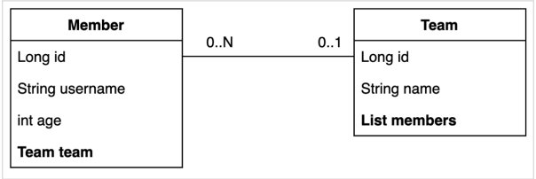
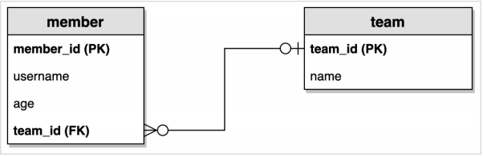

# 프로젝트 환경설정
## 목차
- 프로젝트 생성
- Querydsl 설정과 검증
- 라이브러리 살펴보기
- H2 데이터베이스 설정
- 스프링 부트 설정 - JPA, DB
- 예제 도메인 모델
___
## 프로젝트 설정
- 사용 기능: Spring Web, jpa, h2, lombok
    - Spring Boot: 2.5.x
    - groupId: study
    - artifactId: querydsl
## Querydsl 설정과 검증
`build.gradle`
```gradle
plugins {
	id 'org.springframework.boot' version '2.5.4'
	id 'io.spring.dependency-management' version '1.0.11.RELEASE'
	id 'java'
	//querydsl 추가
	id "com.ewerk.gradle.plugins.querydsl" version "1.0.10"

}

group = 'study'
version = '0.0.1-SNAPSHOT'
sourceCompatibility = '11'

configurations {
	compileOnly {
		extendsFrom annotationProcessor
	}
}

repositories {
	mavenCentral()
}

dependencies {
	implementation 'org.springframework.boot:spring-boot-starter-data-jpa'
	implementation 'org.springframework.boot:spring-boot-starter-web'
	implementation 'com.github.gavlyukovskiy:p6spy-spring-boot-starter:1.5.8'

	//querydsl 추가
	implementation 'com.querydsl:querydsl-jpa'

	compileOnly 'org.projectlombok:lombok'
	runtimeOnly 'com.h2database:h2'
	annotationProcessor 'org.projectlombok:lombok'
	testImplementation 'org.springframework.boot:spring-boot-starter-test'
}

test {
	useJUnitPlatform()
}

//querydsl 추가 시작
def querydslDir = "$buildDir/generated/querydsl"
querydsl {
	jpa = true
	querydslSourcesDir = querydslDir
}
sourceSets {
	main.java.srcDir querydslDir
}
configurations {
	querydsl.extendsFrom compileClasspath
}
compileQuerydsl {
	options.annotationProcessorPath = configurations.querydsl
}
//querydsl 추가 끝
```
### Querydsl 환경설정 검증
`검증용 엔티티 생성`
```java
@Entity
@Getter
@Setter
public class Hello {

    @Id
    @GeneratedValue
    private Long id;
}
```
`검증용 Q 타입 생성`
- <b>Gradle IntelliJ 사용법</b>
    - `Gradle -> Tasks -> build -> clean`
    - `Gradle -> Tasks -> other -> compileQuerydsl`
- <b>Gradle 콘솔 사용법</b>
    - `./gradlew clean compileQuerydsl`
- <b>Windows Terminal 사용법</b>
    - `gradlew celan compileQuerydsl`

`Q 타입 생성 확인`
- `build -> generated -> querydsl`
    - study.querydsl.entity.QHello.java 파일이 생성되어 있어야 함.
> <b>참고</b>
> - Q타입은 컴파일 시점에 자동 생성되므로, 버전관리(`Git`)에 포함하지 않는 것이 좋다.
> - 앞서 설정에서 생성 위치를 gradle build 폴더 아래 생성되도록 했기 때문에, 이 부분도 자연스럽게 해결된다.
> - (대부분 gradle build 폴더를 git에 포함하지 않는다.)
___
## 라이브러리 살펴보기
<b>gradle 의존관계 보기</b>
- `./gradlew dependencies --configuration compileClasspath`

<b>Querydsl 라이브러리 살펴보기</b>
- `querydsl-apt`: Querydsl 관련 코드 생성 기능 제공
- `querydsl-jpa`: querydsl 라이브러리

<b>스프링 부트 라이브러리 살펴보기</b>
- spring-boot-starter-web
    - `spring-boot-stater-tomcat`: 톰캣 (웹서버)
    - `spring-webmvc`: 스프링 웹 MVC
- spring-boot-starter-data-jpa
    - `spring-boot-starter-aop`
    - `spring-boot-starter-jdbc`
        - `HikariCP Connection Pool` (부트 2.0 기본)
    - `hibernate + JPA`: 하이버네이트 + JPA
    - `spring-data-jpa`: 스프링 데이터 JPA
- spring-boot-stater(공통): 스프링 부트 + 스프링 코어 + 로깅
    - spring-boot
        - `spring-core`
    - spring-boot-starter-logging
        - `logback. slf4j`

<b>테스트 라이브러리</b>
- spring-boot-starter-test
    - `junit`: 테스트 프레임워크, 스프링 부트 2.2부터 Junit5(`jupiter`) 사용
        - 과거 버전은 `vintage`
    - `mockito`: 목 라이브러리
    - `assertj`: 테스트 코드를 좀 더 편하게 작성하도록 도와주는 라이브러리
        - https://joel-costigliola.github.io/assertj/index.html
    - spring-test: 스프링 통합 테스트 지원
___

## H2 데이터베이스 설정
개발이나 테스트 용도로 가볍고 편리한 H2 DB, 웹 화면 제공

- 권한 주기: `chmod 755 h2.sh`
- 데이터베이스 파일 생성 방법
    - `jdbc:h2:~/queryds` (최소 한 번)
    - `~/querydsl.mv.db` 파일 생성 확인
    - 이후로는 `jdbc:h2:tcp://localhost/~/querydsl` 으로 접속
> <b>참고</b>
> - 데이터베이스 파일 생성이 안되는 경우, 바탕화면 우측 하단에 H2 Database Engine을 우클릭해서 종료 후 재실행하거나, 직접 create a new Databse으로 생성하자.
___

## 스프링 부트 설정 - JPA, DB
`application.yml`
```yaml
spring:
  datasource:
    url: jdbc:h2:tcp://localhost/~/querydsl
    username: sa
    password:
    driver-class-name: org.h2.Driver

  jpa:
    hibernate:
      ddl-auto: create
    properties:
      hibernate:
        format_sql: true
        use_sql_comments: true

logging.level:
  org.hibernate.SQL: debug
#  org.hibernate.type: trace
```
### 쿼리 파라미터 로그 남기기
1. 로그에 `org.hibernate.type` 추가하기
2. 외부 라이브러리 사용
    - https://github.com/gavlyukovskiy/spring-boot-data-source-decorator
    - 스프링 부트를 사용하면 아래 의존성만 추가하면 된다.
        ```gradle
        implementation 'com.github.     gavlyukovskiy:p6spy-spring-boot-starter:1.5.8'
        ```
    > <b>참고</b>
    > - 쿼리 파라미터를 로그로 남기는 외부 라이브러리는 시스템 자원을 사용하므로, 개발 단계에서는 편하게 사용하되, 운영 시스템에 적용하려면 꼭 성능 테스트를 하고 사용하자.
___

## 예제 도메인 모델
<b>엔티티 클래스</b><br>


<b>ERD</b><br>


<b>Member 엔티티</b><br>
```java
@Entity
@Getter
@Setter
@NoArgsConstructor(access = AccessLevel.PROTECTED)
@ToString(of = {"id", "username", "age"})
public class Member {

    @Id
    @GeneratedValue
    @Column(name = "member_id")
    private Long id;
    private String username;
    private int age;

    @ManyToOne(fetch = FetchType.LAZY)
    @JoinColumn(name = "team_id")
    private Team team;

    public Member(String username) {
        this(username, 0);
    }

    public Member(String username, int age) {
        this(username, age, null);
    }

    public Member(String username, int age, Team team) {
        this.username = username;
        this.age = age;
        if(team != null){
            changeTeam(team);
        }
    }

    public void changeTeam(Team team) {
        this.team = team;
        team.getMembers().add(this);
    }
}
```
> <b>참고</b>
> - `@ToString`은 가급적 내부 필드만 사용하자(연관관계가 없는 필드)

<b>Team 엔티티</b><br>
```java
@Entity
@Getter
@Setter
@NoArgsConstructor(access = AccessLevel.PROTECTED)
@ToString(of = {"id", "name"})
public class Team {

    @Id
    @GeneratedValue
    @Column(name = "team_id")
    private Long id;
    private String name;

    @OneToMany(mappedBy = "team")
    private List<Member> members = new ArrayList<>();

    public Team(String name) {
        this.name = name;
    }
}
```