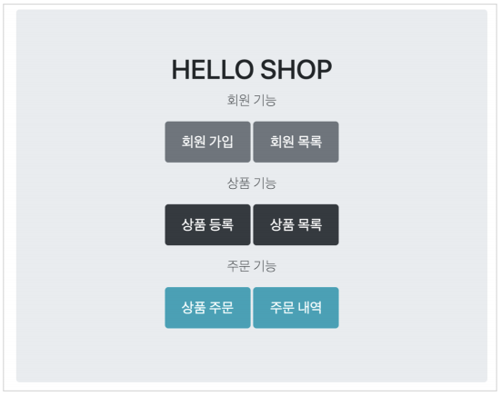
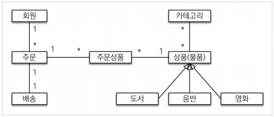
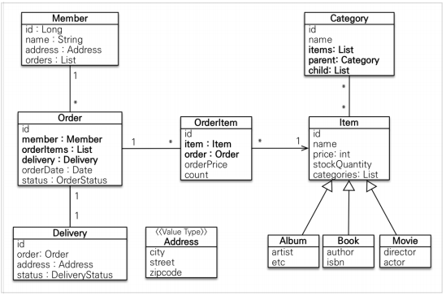
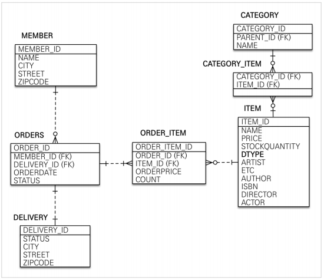
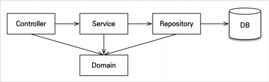

# 도메인 분석 설계
## 목차
- 프로젝트 환경설정
- 요구사항 분석
- 도메인 모델과 테이블 설계
- 엔티티 클래스 개발
- 엔티티 설계 시 주의점
- 애플리케이션 구현 준비
___
## 프로젝트 환경설정
- <b>build.gradle</b>
    ```gradle
    plugins {
    	id 'org.springframework.boot' version '2.5.3'
    	id 'io.spring.dependency-management' version '1.0.11.RELEASE'
    	id 'java'
    }

    group = 'jpabook'
    version = '0.0.1-SNAPSHOT'
    sourceCompatibility = '11'

    configurations {
    	compileOnly {
    		extendsFrom annotationProcessor
    	}
    }

    repositories {
    	mavenCentral()
    }

    dependencies {
    	implementation 'org.springframework.boot:spring-boot-starter-data-jpa'
    	implementation 'org.springframework.boot:spring-boot-starter-thymeleaf'
    	implementation 'org.springframework.boot:spring-boot-starter-validation'
    	implementation 'org.springframework.boot:spring-boot-starter-web'
    	implementation 'com.github.gavlyukovskiy:p6spy-spring-boot-starter:1.5.6'
    	compileOnly 'org.projectlombok:lombok'
    	runtimeOnly 'com.h2database:h2'
    	annotationProcessor 'org.projectlombok:lombok'
    	testImplementation 'org.springframework.boot:spring-boot-starter-test'
    }

    test {
    	useJUnitPlatform()
    }
    ```
- <b>application.properties</b>
    ```properties
    # H2 설정
    # 최초에는 jdbc:h2:~/jpashop 으로 DB 파일 생성
    # 이후 접속은 jdbc:h2:tcp://localhost/~/jpashop
    spring.datasource.url=jdbc:h2:tcp://localhost/~/jpashop
    spring.datasource.username=sa
    spring.datasource.password=
    spring.datasource.driver-class-name=org.h2.Driver

    # JPA 설정
    spring.jpa.hibernate.ddl-auto=create
    spring.jpa.properties.hibernate.format_sql=true

    # Log 설정 -> 외부 라이브러리 사용 -> 주석 처리
    #logging.level.org.hibernate.SQL=debug
    #logging.level.org.hibernate.type=trace
    ```
    - `spring.jpa.hibernate.ddl-auto = create`
        - 애플리케이션 실행 시점에 테이블 drop -> 다시 생성
    - `spring.jpa.properties.hibernate.format_sql = true`
        - SQL를 포맷팅하여 보기 좋게 출력하는 기능
    - `logging.level.org.hibernate.SQL = debug`
        - logger를 통해 하이버네이트 실행 SQL를 남기는 기능
    - `logging.level.org.hibernate.type = trace`
        - SQL 실행 파라미터를 로그로 남기는 기능
    - <b>외부 라이브러리 사용</b>
        - `implementation 'com.github.gavlyukovskiy:p6spy-spring-boot-starter:1.5.6'`
        - SQL + 실행 파라미터를 보기 좋게 출력하는 기능
    > <b>참고</b>
    > - 쿼리 파라미터를 로그로 남기는 외부 라이브러리는 시스템 자원을 사용하므로, 개발 단계에서만 사용하자.
___
## 요구사항 분석

### 기능 목록
- 회원 기능
    - 회원 등록
    - 회원 조회
- 상품 기능
    - 상품 등록
    - 상품 수정
    - 상품 조회
- 주문 기능
    - 상품 주문
    - 주문 내역 조회
    - 주문 취소
- 기타 요구사항
    - 상품은 재고 관리가 필요하다.
    - 상품의 종류는 도서, 음반, 영화가 있다.
    - 상품을 카테고리로 구분할 수 있다.
    - 상품 주문 시 배송 정보를 입력할 수 있다.
___
## 도메인 모델과 테이블 설계

- <b>회원, 주문, 상품의 관계</b>
    - 회원을 여러 상품을 주문할 수 있다.
    - 그리고 한 번 주문할 때, 여러 상품을 선택할 수 있으므로, 주문과 상품은 다대다 관계이다.
        - 하지만 이런 다대다 관계는 관계형 데이터베이스는 물론이고, 엔티티에서도 거의 사용하지 않는다.
        - 따라서 그림처럼 주문상품이라는 엔티티를 추가해서 `다대다 관계를 일대다, 다대일 관계`로 풀어냈다.
- <b>상품 분류</b>
    - 상품은 도서, 음반, 영화로 구분되는데, 상품이라는 공통 속성을 사용하므로, 상속 구조로 표현했다.
### 엔티티 분석

- <b>회원(Member)</b>
    - 이름과 임베디드 타입인 주소(`Address`), 그리고 주문(`orders`) 리스트를 가진다.
- <b>주문(Order)</b>
    - 한 번 주문 시 여러 상품을 주문할 수 있으므로, 주문과 주문상품(`OrderItem`)은 일대다 관계다.
    - 주문은 상품을 주문한 회원과 배송 정보, 주문 날짜, 주문 상태(`status`)를 가지고 있다.
    - 주문 상태는 열거형을 사용했는데, 주문(`ORDER`), 취소(`CANCEL`)을 표현할 수 있다.
- <b>주문상품(OrderItem)</b>
    - 주문한 상품 정보와 주문 금액(`orderPrice`), 주문 수량(`count`) 정보를 가지고 있다.
    > 보통 `OrderLine`, `LineItem`으로 많이 표현한다.
- <b>상품(Item)</b>
    - 이름, 가격, 재고수량(`stockQuantity`)을 가지고 있다.
    - 상품을 주문하면, 재고 수량이 줄어든다.
    - 상품의 종류로는 도서, 음반, 영화가 있는데, 각각은 사용하는 속성이 조금씩 ㅏㄷ르다.
- <b>배송(Delivery)</b>
    - 주문 시, 하나의 배송 정보를 생성한다.
    - 주문과 배송은 일대일 관계다.
- <b>카테고리(Category)</b>
    - 상품과 다대다 관계를 맺는다.
    - `parent,` `child`로 부모, 자식 카테고리를 연결한다.
- <b>주소(Address)</b>
    - 값 타입(임베디드 타입)이다.
    - 회원과 배송(`Delivery`)에서 사용한다.
> <b>참고</b>
> - 실무에서는 회원이 주문을 참조하지 않고, 주문이 회원을 참조하는 것으로 충분하다.
> - 여기서는 일대다, 다대일의 양방향 연관관계를 설명하기 위해 추가했다.

### 테이블 분석

- <B>MEMBER</B>
    - 회원 엔티티의 `Address` 임베디드 타입 정보가 회원, 배송 테이블에 그대로 들어갔다.
- <B>ITEM</B>
    - 앨범, 도서, 영화 타입을 통합해서 하나의 테이블로 만들었다.
    - `DTYPE` 컬럼으로 타입을 구분한다.
> <b>참고</b>
> - 테이블명이 `ORDERS`인 것은 데이터베이스가 `order by` 때문에 예약어로 잡고 있는 경우가 많기 때문이다.
### 연관관계 매핑 분석
- <b>회원 - 주문</b>
    - 일대다, 다대일의 양방향 관계
    - 외래 키가 있는 주문을 연관관계의 주인으로 정함
    - `Order.member`를 `ORDERS_MEMBER_ID` 외래 키와 매핑
- <B>주문상품 - 주문</B>
    - 다대일 양방향 관계
    - 외래 키가 주문상품에 있으므로, 주문상품이 연관관계의 주인
    - `OrderItem.order`를 `ORDER_ITEM.ORDER_ID` 외래 키와 매핑
- <b>주문상품 - 상품</b>
    - 다대일 단방향 관계
    - `OrderItem.item`을 `ORDER_ITEM.ITEM_ID` 외래 키와 매핑
- <B>주문 - 배송</B>
    - 일대일 양방향 관계
    - `Order.delivery`를 `ORDERS.DELIVERY_ID` 외래 키와 매핑
- <b>카테고리 - 상품</b>
    - `@ManyToMany`를 사용해서 매핑
    - 실무에서는 @ManyToMany를 사용하지 말자. 여기서는 다대다 관계를 예제로 보여주기 위해 사용하는 것이다.
> <b>참고: 외래 키가 있는 곳을 연관관계의 주인으로 정하자.</b>
> - 연관관계의 주인은 단순히 외래 키를 누가 관리하냐의 문제이다.
> - 예를 들어, 자동차와 바퀴가 있을 때, 일대다 관계에서 항상 다쪽에 외래 키가 있으므로, 외래 키가 있는 바퀴를 연관관계의 주인으로 정하면 된다.
> - 물론 반대의 경우가 불가능한 것은 아니지만, 자동차가 관리하지 않는 바퀴 테이블의 외래 키 값이 업데이트 되므로, 관리와 유지보수가 어렵고, 추가적으로 별도의 업데이트 쿼리가 발생하는 성능 문제도 있다.
___
## 엔티티 클래스 개발
- 실무에서는 가급적 Getter는 열어두고, Setter는 꼭 필요한 경우에만 사용❗
> <b>참고</b>
> - 이론적으로 Getter, Setter 모두 제공하지 않고, 꼭 필요한 별도의 메소드만 제공하는 것이 가장 이상적이다.
> - 하지만, 실무에서 엔티티의 데이터는 조회할 일이 너무 많으므로, Getter의 경우 모두 열어두는 것이 편리하다.
> - Getter는 아무리 호출해도, 호출 이상의 어떤 일이 발생하지 않는다.
> - 하지만 Setter는 호출할 때 마다 데이터가 변하기 때문에, 막 사용하면 가까운 미래에 엔티티가 도대체 왜 변경되었는지 추적하기가 점점 힘들어진다.
> - 따라서, 엔티티를 변경할 때는 Setter 대신 변경 지점이 명확하도록 변경을 위한 `비즈니스 메소드`를 별도로 제공하는 것이 좋다.
### 회원 엔티티
```java
@Entity
@Getter
@NoArgsConstructor(access = AccessLevel.PROTECTED)
public class Member {

    @Id
    @GeneratedValue
    @Column(name = "MEMBER_ID")
    private Long id;

    @Column(unique = true)
    private String name;

    @Embedded
    private Address address;

    @OneToMany(mappedBy = "member")
    private List<Order> orders = new ArrayList<>();

    public void addOrder(Order order) {
        orders.add(order);
        order.setMember(this);
    }

    public Member(String name) {
        this.name = name;
    }

    public void updateAddress(String city, String street, String zipcode) {
        address = new Address(city, street, zipcode);
    }
}
```
### 주문 엔티티
```java
@Entity
@Table(name = "ORDERS")
@Getter
@NoArgsConstructor(access = AccessLevel.PROTECTED)
public class Order {

    @Id
    @GeneratedValue
    @Column(name = "ORDER_ID")
    private Long id;

    @ManyToOne(fetch = FetchType.LAZY)
    @JoinColumn(name = "MEMBER_ID")
    private Member member;

    private LocalDateTime orderDate;

    @Enumerated(EnumType.STRING)
    private OrderStatus orderStatus;

    private Order(Member member, Delivery delivery) {
        this.member = member;
        this.delivery = delivery;
        this.orderStatus = OrderStatus.ORDER;
        this.orderDate = LocalDateTime.now();
    }

    @OneToMany(mappedBy = "order", cascade = CascadeType.ALL)
    private List<OrderItem> orderItems = new ArrayList<>();

    @OneToOne(fetch = FetchType.LAZY, cascade = CascadeType.ALL)
    @JoinColumn(name = "DELIVERY_ID")
    private Delivery delivery;

    public void addOrderItem(OrderItem orderItem) {
        orderItems.add(orderItem);
        orderItem.setOrder(this);
    }

    public void setDelivery(Delivery delivery) {
        this.delivery = delivery;
        delivery.setOrder(this);
    }

    /**
     * 주문 생성
     * @param member
     * @param delivery
     * @param orderItems
     * @return
     */
    public static Order createOrder(Member member, Delivery delivery, OrderItem... orderItems) {
        Order order = new Order(member, delivery);
        for (OrderItem orderItem : orderItems) {
            order.addOrderItem(orderItem);
        }
        return order;
    }

    /**
     * 주문 취소
     */
    public void cancel() {
        if (delivery.getDeliveryStatus() == DeliveryStatus.COMPLETE) {
            throw new IllegalStateException("이미 배송 완료된 상품은 취소가 불가능합니다.");
        }

        this.orderStatus = OrderStatus.CANCEL;
        for (OrderItem orderItem : orderItems) {
            orderItem.cancel();
        }
    }

    /**
     * 전체 주문 가격 조회
     * @return
     */
    public int getTotalPrice() {
        return orderItems.stream().mapToInt(OrderItem::getTotalPrice).sum();
    }

    public void setMember(Member member) {
        this.member = member;
    }
}
```
- <b>기능 설명</b>
    - <b>생성 메소드(`createOrder()`)</b>
        - 주문 엔티티를 생성할 때 사용
        - 주문 회원, 배송정보, 주문상품의 정보를 받아 실제 주문 엔티티 생성
    - <b>주문 취소(`cancel()`)</b>
        - 주문 취소 시 사용
        - 주문 상태를 취소로 변경하고, 주문상품에 주문취소를 알린다.
        - 만약, 이미 배송을 완료한 상품이면 주문을 취소하지 못하도록 예외를 발생시킨다.
    - <b>전체 주문 가격 조회(`getTotalPrice()`)</b>
        - 주문 시 사용한 전체 주문 가격을 조회한다.
        - 전체 주문 가격을 알려면, 각각의 주문상품 가격을 알아야 한다.
        - 로직을 보면, 연관된 주문상품들의 가격을 조회해서 더한 값을 반환한다.
            > 실무에서는 주로 주문에 전체 주문 가격 필드를 두고 역정규화 한다.
### 주문 상태
```java
public enum OrderStatus {
    ORDER, CANCEL
}
```
### 주문상품 엔티티
```java
@Entity
@Getter
@NoArgsConstructor(access = AccessLevel.PROTECTED)
public class OrderItem {

    @Id
    @GeneratedValue
    @Column(name = "ORDER_ITEM_ID")
    private Long id;

    @ManyToOne(fetch = FetchType.LAZY)
    @JoinColumn(name = "ITEM_ID")
    private Item item;

    @ManyToOne(fetch = FetchType.LAZY)
    @JoinColumn(name = "ORDER_ID")
    private Order order;

    private int orderPrice;

    private int count;

    private OrderItem(Item item, int orderPrice, int count) {
        this.item = item;
        this.orderPrice = orderPrice;
        this.count = count;
    }

    /**
     * 주문상품 생성
     * @param item
     * @param orderPrice
     * @param count
     * @return
     */
    public static OrderItem createOrderItem(Item item, int orderPrice, int count) {
        OrderItem orderItem = new OrderItem(item, orderPrice, count);
        item.removeStock(count);

        return orderItem;
    }

    /**
     * 주문상품 취소
     */
    public void cancel() {
        getItem().addStock(count);
    }

    /**
     * 주문상품 총 가격 조회
     * @return
     */
    public int getTotalPrice() {
        return getOrderPrice() * getCount();
    }

    public void setOrder(Order order) {
        this.order = order;
    }
}
```
- <b>기능 설명</b>
    - <b>생성 메소드(`createOrderItem()`)</b>
        - 주문 상품, 가격, 수량 정보를 사용해서 주문상품 엔티티 생성
        - `item.removeStock(count)`를 호출해서 주문한 수량만큼 상품의 재고 감소
    - <b>주문 취소(`cancel()`)</b>
        - `getItem().addStock(count)`를 호출해서 취소한 주문 수량만큼 상품의 재고 증가
    - <b>주문 가격 조회(`getTotalPrice()`)</b>
        - 주문 가격에 수량을 곱한 값을 반환
### 상품 엔티티
```java
@Entity
@Getter
@Inheritance(strategy = InheritanceType.SINGLE_TABLE)
@DiscriminatorColumn(name = "DTYPE")
@NoArgsConstructor(access = AccessLevel.PROTECTED)
public abstract class Item {

    @Id
    @GeneratedValue
    @Column(name = "ITEM_ID")
    private Long id;

    private String name;

    private int price;

    private int stockQuantity;

    @ManyToMany(mappedBy = "items")
    private List<Category> categories = new ArrayList<>();

    protected Item(String name, int price, int stockQuantity) {
        this.name = name;
        this.price = price;
        this.stockQuantity = stockQuantity;
    }

    /**
     * 재고 증가
     * @param quantity
     */
    public void addStock(int quantity){
        this.stockQuantity += quantity;
    }

    /**
     * 재고 감소
     * @param quantity
     */
    public void removeStock(int quantity) {
        int restStock = this.stockQuantity - quantity;
        if (restStock < 0) {
            throw new NotEnoughStockException("need more stock");
        }
        this.stockQuantity = restStock;
    }

    public void update(String name, int price, int stockQuantity) {
        this.name = name;
        this.price = price;
        this.stockQuantity = stockQuantity;
    }
}
```
- <b>비즈니스 로직 분석</b>
    - `addStock()`
        - 파라미터로 넘어온 수만큼 재고를 증가시킨다.
        - 재고가 증가하거나, 상품 주문을 취소해서 재고를 다시 늘려야할 때 사용
    - `removeStock()`
        - 파라미터로 넘어온 수만큼 재고를 감소시킨다.
        - 재고가 부족하면 예외가 발생하며, 주로 상품을 주문할 때 사용
### 예외 추가
```java
public class NotEnoughStockException extends RuntimeException {
    public NotEnoughStockException() {
        super();
    }

    public NotEnoughStockException(String message) {
        super(message);
    }

    public NotEnoughStockException(String message, Throwable cause) {
        super(message, cause);
    }

    public NotEnoughStockException(Throwable cause) {
        super(cause);
    }

    protected NotEnoughStockException(String message, Throwable cause, boolean enableSuppression, boolean writableStackTrace) {
        super(message, cause, enableSuppression, writableStackTrace);
    }
}
```
### 상품 - 도서 엔티티
```java
@Getter
@Entity
@DiscriminatorValue("Book")
@NoArgsConstructor(access = AccessLevel.PROTECTED)
public class Book extends Item {
    private String author;
    private String isbn;

    public Book(String name, int price, int stockQuantity, String author, String isbn) {
        super(name, price, stockQuantity);
        this.author = author;
        this.isbn = isbn;
    }
}
```
### 상품 - 음반 엔티티
```java
@Getter
@Entity
@DiscriminatorValue("Album")
@NoArgsConstructor(access = AccessLevel.PROTECTED)
public class Album extends Item{
    private String artist;
    private String etc;

    public Album(String name, int price, int stockQuantity, String artist, String etc) {
        super(name, price, stockQuantity);
        this.artist = artist;
        this.etc = etc;
    }
}
```
### 상품 - 영화 엔티티
```java
@Entity
@Getter
@DiscriminatorValue("Movie")
@NoArgsConstructor(access = AccessLevel.PROTECTED)
public class Movie extends Item{
    private String director;
    private String actor;

    public Movie(String name, int price, int stockQuantity, String director, String actor) {
        super(name, price, stockQuantity);
        this.director = director;
        this.actor = actor;
    }
}
```
### 배송 엔티티
```java
@Entity
@Getter
@NoArgsConstructor(access = AccessLevel.PROTECTED)
public class Delivery {

    @Id
    @GeneratedValue
    @Column(name = "DELIVERY_ID")
    private Long id;

    @OneToOne(mappedBy = "delivery", fetch = FetchType.LAZY)
    private Order order;

    public void setOrder(Order order) {
        this.order = order;
    }

    @Embedded
    private Address address;

    public Delivery(Address address) {
        this.address = address;
        this.deliveryStatus = DeliveryStatus.READY;
    }

    @Enumerated(EnumType.STRING)
    private DeliveryStatus deliveryStatus;
}
```
### 배송 상태
```java
public enum DeliveryStatus {
    READY, COMPLETE
}
```
### 카테고리 엔티티
```java
@Entity
@Getter
@Setter
public class Category {

    @Id
    @GeneratedValue
    @Column(name = "CATEGORY_ID")
    private Long id;

    private String name;

    @ManyToMany
    @JoinTable(name = "CATEGORY_ITEM",
               joinColumns = @JoinColumn(name = "CATEGORY_ID"),
               inverseJoinColumns = @JoinColumn(name = "ITEM_ID"))
    private List<Item> items = new ArrayList<>();

    @ManyToOne(fetch = FetchType.LAZY)
    @JoinColumn(name = "PARENT_ID")
    private Category parent;

    @OneToMany(mappedBy = "parent")
    private List<Category> child = new ArrayList<>();
}
```
> <B>참고</B>
> - 실무에서는 `@ManyToMany`를 사용하지 말자
> - `@ManyToMany`는 편리한 것 같지만, 중간 테이블(`CATEGORY_ITEM`)에 컬럼을 추가할 수 없고, 세밀하게 쿼리를 실행하기 어렵다.
> - 중간 엔티티(`CategoryItem`)을 만들고, `@ManyToOne`, `@OneToMany`로 매핑해서 사용하자.
### 주소 값 타입
```java
@Embeddable
@Getter
@NoArgsConstructor(access = AccessLevel.PROTECTED)
@AllArgsConstructor
public class Address {

    private String city;
    private String street;
    private String zipcode;
}
```
> <b>참고</b>
> - 값 타입은 변경 불가능하게 설계해야 한다.
> - `@Setter`를 제거하고, 생성자에서 값을 모두 초기화해서 변경 불가능한 클래스를 만들자.
> - JPA 스펙상 엔티티나 임베디드 타입(`@Embeddable`)은 자바 기본 생성자를 `public` 또는 `protected`로 설정해야 한다.
>   - `public`보다는 `protected`가 더 안전하다.
> - JPA가 이런 제약을 두는 이유는 JPA 구현 라이브러리가 객체를 생성할 때, 리플렉션 같은 기술을 사용할 수 있도록 지원해야 하기 때문이다.
___
## 엔티티 설계 시 주의점
- <b>엔티티에는 가급적 Setter를 사용하지 말자</b> 
    - Setter를 사용하면, 변경 포인트가 너무 많아서 유지보수가 어렵다.
- <b>모든 연관관계는 지연로딩으로 설정!</b>
    - 즉시로딩(`EAGER`)은 예측이 어렵고, 어떤 SQL이 실행될지 추적하기 어렵다.
        - 특히 JPQL을 실행할 때 `N + 1 문제`가 자주 발생한다.
    - 실무에서 모든 연관관계는 지연로딩(`LAZY`)으로 설정해야 한다.
    - 연관된 엔티티를 함께 DB에서 조회해야 하면, `fetch join` 또는 `엔티티 그래프 기능`을 사용한다.
    - @xxxToOne 관계는 기본이 즉시로딩이므로, 직접 지연로딩으로 설정해야 한다.
- <b>컬렉션은 필드에서 초기화 하자.</b>
    - 컬렉션은 필드에서 바로 초기화하는 것이 `null` 문제에서 안전하다.
    - 하이버네이트는 엔티티를 영속화할 때, 컬렉션을 감싸서 하이버네이트가 제공하는 내장 컬렉션으로 변경한다.
        - 만약, `getOrders()`처럼 임의의 메소드에서 컬렉션을 잘못 생성하면, 하이버네이트 내부 메커니즘에 문제가 발생할 수 있다.
        - 따라서 필드레벨에서 생성하는 것이 가장 안전하고, 코드도 간결하다.
    ```java
    Member member = new Member();
    System.out.println(member.getOrders().getClass());
    em.persist(team);
    System.out.println(member.getOrders().getClass());
    ```
    ```log
    //출력 결과
    class java.util.ArrayList
    class org.hibernate.collection.internal.PersistentBag
    ```
- <b>테이블, 컬럼명 생성 전략</b>
    - 스프링 부트에서 하이버네이트 기본 매핑 전략을 변경해서 실제 테이블 필드명은 다름
    - https://docs.spring.io/spring-boot/docs/2.1.3.RELEASE/reference/htmlsingle/#howto-configure-hibernate-naming-strategy
    - http://docs.jboss.org/hibernate/orm/5.4/userguide/html_single/Hibernate_User_Guide.html#naming
    - 하이버네이트 기존 구현
        - 엔티티의 필드명을 그대로 테이블의 컬럼명으로 사용
        - `SpringPhysicalNamingStrategy`
    - 스프링 부트 신규 설정
        - 엔티티(필드) -> 테이블(컬럼)
            1. 카멜 케이스 -> 언더스코어(memberPoint -> member_point)
            2. .(점) -> _(언더스코어)
            3. 대문자 -> 소문자
    - <b>적용 2단계</b>
        1. 논리명 생성
            - 명시적으로 컬럼, 테이블명을 적지 않으면, ImplicitNamingStrategy 사용
            - `spring.jpa.hibernate.naming.implicit-strategy`: 테이블이나, 컬럼명을 명시하지 않을 때, 논리명 적용
        2. 물리명 적용
            - `spring.jap.hibernate.naming.physical-strategy`: 모든 논리명에 적용됨, 실제 테이블에 적용
            - username -> usernm 등으로 바꿀 수 있음
    - <b>스프링 부트 기본 설정</b>
        ```properties
        spring.jpa.hibernate.naming.implicit-strategy: 
        org.springframework.boot.orm.jpa.hibernate.SpringImplicitNamingStrategy
        spring.jpa.hibernate.naming.physical-strategy: 
        org.springframework.boot.orm.jpa.hibernate.SpringPhysicalNamingStrategy
        ```
___
## 애플리케이션 구현 준비
### 구현 요구사항
- <b>예제를 단순화하기 위해 다음 기능은 구현❌</b>
    - 로그인과 권한 관리❌
    - 파라미터 검증과 예외 처리❌
    - 상품은 도서만 사용
    - 카테고리 사용❌
    - 배송정보는 사용❌
### 애플리케이션 아키텍처

- <b>계층형 구조 사용</b>
    - controller, web: 웹 계층
    - service: 비즈니스 로직, 트랜잭션 처리
    - repository: JPA를 직접 사용하는 계층, 엔티티 매니저 사용
    - domain: 엔티티가 모여 있는 계층, 모든 계층에서 사용
- <b>패키지 구조</b>
    - jpabook.jpashop
        - domain
        - exception
        - repository
        - service
        - web
- <b>개발 순서</b>
    - 도메인 -> 서비스, 리포지토리 -> 테스트 검증 -> 웹 계층