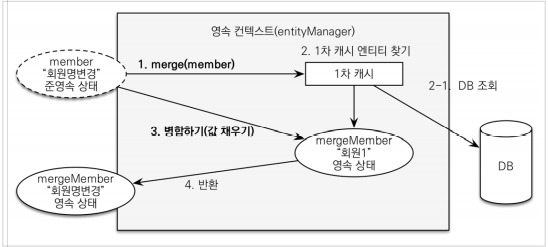

# 웹 계층 개발
## 목차
- 홈 화면과 레이아웃
- 회원 등록
- 회원 목록 조회
- 상품 등록
- 상품 목록
- 상품 수정
- 변경 감지와 병합(merge)
- 상품 주문
- 주문 목록 검색, 취소
___
## 홈 화면과 레이아웃
### 홈 컨트롤러 등록
```java
@Controller
@Slf4j
public class HomeController {

    @RequestMapping("/")
    public String home() {
        log.info("home controller");
        return "home";
    }
}
```
### 스프링 부트 타임리프 기본 설정
```properties
spring.thymeleaf.prefix=classpath:/templates/
spring.thymeleaf.suffix=.html
```
- https://docs.spring.io/spring-boot/docs/2.1.7.RELEASE/reference/html/common-application-properties.html
### 타임리프 템플릿 등록
#### home.html
```html
<!DOCTYPE HTML>
<html xmlns:th="http://www.thymeleaf.org">
<head th:replace="fragments/header :: header">
    <title>Hello</title>
    <meta http-equiv="Content-Type" content="text/html; charset=UTF-8" />
</head>
<body>
<div class="container">
    <div th:replace="fragments/bodyHeader :: bodyHeader" />
    <div class="jumbotron">
        <h1>HELLO SHOP</h1>
        <p class="lead">회원 기능</p>
        <p>
            <a class="btn btn-lg btn-secondary" href="/members/new">회원 가입</a>
            <a class="btn btn-lg btn-secondary" href="/members">회원 목록</a>
        </p>
        <p class="lead">상품 기능</p>
        <p>
            <a class="btn btn-lg btn-dark" href="/items/new">상품 등록</a>
            <a class="btn btn-lg btn-dark" href="/items">상품 목록</a>
        </p>
        <p class="lead">주문 기능</p>
        <p>
            <a class="btn btn-lg btn-info" href="/order">상품 주문</a>
            <a class="btn btn-lg btn-info" href="/orders">주문 내역</a>
        </p>
    </div>
    <div th:replace="fragments/footer :: footer" />
</div> <!-- /container -->
</body>
</html>
```
#### fragments/header
```html
<!DOCTYPE html>
<html xmlns:th="http://www.thymeleaf.org">
<head th:fragment="header">
    <!-- Required meta tags -->
    <meta charset="utf-8">
    <meta name="viewport" content="width=device-width, initial-scale=1, shrink-to-fit=no">
    <!-- Custom styles for this template -->
    <link href="/css/jumbotron-narrow.css" rel="stylesheet">
    <!-- Bootstrap CDN -->
    <link rel="stylesheet" href="https://stackpath.bootstrapcdn.com/bootstrap/4.3.1/css/bootstrap.min.css" integrity="sha384-ggOyR0iXCbMQv3Xipma34MD+dH/1fQ784/j6cY/iJTQUOhcWr7x9JvoRxT2MZw1T" crossorigin="anonymous">
    <script src="https://code.jquery.com/jquery-3.3.1.slim.min.js" integrity="sha384-q8i/X+965DzO0rT7abK41JStQIAqVgRVzpbzo5smXKp4YfRvH+8abtTE1Pi6jizo" crossorigin="anonymous"></script>
    <script src="https://cdnjs.cloudflare.com/ajax/libs/popper.js/1.14.7/umd/popper.min.js" integrity="sha384-UO2eT0CpHqdSJQ6hJty5KVphtPhzWj9WO1clHTMGa3JDZwrnQq4sF86dIHNDz0W1" crossorigin="anonymous"></script>
    <script src="https://stackpath.bootstrapcdn.com/bootstrap/4.3.1/js/bootstrap.min.js" integrity="sha384-JjSmVgyd0p3pXB1rRibZUAYoIIy6OrQ6VrjIEaFf/nJGzIxFDsf4x0xIM+B07jRM" crossorigin="anonymous"></script>
    <title>Hello, world!</title>
</head>
```
#### fragments/bodyHeader
```html
<!DOCTYPE html>
<html xmlns:th="http://www.thymeleaf.org">
<div class="header" th:fragment="bodyHeader">
    <ul class="nav nav-pills pull-right">
        <li><a href="/">Home</a></li>
    </ul>
    <a href="/"><h3 class="text-muted">HELLO SHOP</h3></a>
</div>
```
#### fragments/footer
```html
<!DOCTYPE html>
<html xmlns:th="http://www.thymeleaf.org">
<div class="footer" th:fragment="footer">
    <p>&copy; Hello Shop V2</p>
</div>
```
### 결과 화면

> <b>참고: Hierarchical-style layouts</b>
> - 예제에서는 뷰 템플릿을 최대한 간단하게 설명하려고, `header`, `footer` 같은 템플릿 파일을 반복해서 포함한다.
> - 다음 링크의 Hierarchical-style layouts을 참고하면, 이런 부분도 중복을 제거할 수 있다.
> - https://www.thymeleaf.org/doc/articles/layouts.html

> <b>참고: 뷰 템플릿 변경사항을 서버 재시작 없이 즉시 반영하기</b>
> 1. spring-boot-devtools 의존성 추가
> 2. html 파일 build -> Recompile
### view 리소스 등록
- 이쁜 디자인을 위해 부트스트랩을 사용하였다. 
    - https://getbootstrap.com/
- `resources/static` 하위에 `css`, `js` 폴더 복사
- `resources/static/css/jumbotron-naroow.css` 추가
### jumbotron-narrow.css
```css
/* Space out content a bit */
body {
    padding-top: 20px;
    padding-bottom: 20px;
}
/* Everything but the jumbotron gets side spacing for mobile first views */
.header,
.marketing,
.footer {
    padding-left: 15px;
    padding-right: 15px;
}
/* Custom page header */
.header {
    border-bottom: 1px solid #e5e5e5;
}
/* Make the masthead heading the same height as the navigation */
.header h3 {
    margin-top: 0;
    margin-bottom: 0;
    line-height: 40px;
    padding-bottom: 19px;
}
/* Custom page footer */
.footer {
    padding-top: 19px;
    color: #777;
    border-top: 1px solid #e5e5e5;
}
/* Customize container */
@media (min-width: 768px) {
    .container {
        max-width: 730px;
    }
}
.container-narrow > hr {
    margin: 30px 0;
}
/* Main marketing message and sign up button */
.jumbotron {
    text-align: center;
    border-bottom: 1px solid #e5e5e5;
}
.jumbotron .btn {
    font-size: 21px;
    padding: 14px 24px;
}
/* Supporting marketing content */
.marketing {
    margin: 40px 0;
}
.marketing p + h4 {
    margin-top: 28px;
}
/* Responsive: Portrait tablets and up */
@media screen and (min-width: 768px) {
    /* Remove the padding we set earlier */
    .header,
    .marketing,
    .footer {
        padding-left: 0;
        padding-right: 0;
    }
    /* Space out the masthead */
    .header {
        margin-bottom: 30px;
    }
    /* Remove the bottom border on the jumbotron for visual effect */
    .jumbotron {
        border-bottom: 0;
    }
}
```
___
## 회원 등록
- 폼 객체를 사용해서 화면 계층과 서비스 계층을 명확하게 분리한다.
### 회원 등록 폼 객체
```java
@Getter
@Setter
public class MemberForm {

    @NotEmpty(message = "회원 이름은 필수입니다.")
    private String name;

    private String city;
    private String street;
    private String zipcode;
}
```
### 회원 등록 컨트롤러
```java
@Controller
@RequiredArgsConstructor
public class MemberController {

    private final MemberService memberService;

    @GetMapping("/members/new")
    public String createForm(Model model) {
        model.addAttribute("memberForm", new MemberForm());
        return "members/createMemberform";
    }

    @PostMapping("/members/new")
    public String create(@Validated MemberForm form, BindingResult result) {
        if (result.hasErrors()) {
            return "members/createMemberform";
        }

        Member member = new Member(form.getName());
        member.updateAddress(form.getCity(), form.getStreet(), form.getZipcode());

        memberService.join(member);

        return "redirect:/";
    }
}
```
### 회원 등록 폼 화면
`templates/members/createMemberform.html`
```html
<!DOCTYPE HTML>
<html xmlns:th="http://www.thymeleaf.org">
<head th:replace="fragments/header :: header" />
<style>
    .fieldError {
        border-color: #bd2130;
    }
</style>
<body>
<div class="container">
    <div th:replace="fragments/bodyHeader :: bodyHeader"/>
    <form role="form" action="/members/new" th:object="${memberForm}"
          method="post">
        <div class="form-group">
            <label th:for="name">이름</label>
            <input type="text" th:field="*{name}" class="form-control"
                   placeholder="이름을 입력하세요"
                   th:class="${#fields.hasErrors('name')}? 'form-control fieldError' : 'form-control'">
            <p th:if="${#fields.hasErrors('name')}"
               th:errors="*{name}">Incorrect date</p>
        </div>
        <div class="form-group">
            <label th:for="city">도시</label>
            <input type="text" th:field="*{city}" class="form-control"
                   placeholder="도시를 입력하세요">
        </div>
        <div class="form-group">
            <label th:for="street">거리</label>
            <input type="text" th:field="*{street}" class="form-control"
                   placeholder="거리를 입력하세요">
        </div>
        <div class="form-group">
            <label th:for="zipcode">우편번호</label>
            <input type="text" th:field="*{zipcode}" class="form-control"
                   placeholder="우편번호를 입력하세요">
        </div>
        <button type="submit" class="btn btn-primary">Submit</button>
    </form>
    <br/>
    <div th:replace="fragments/footer :: footer" />
</div> <!-- /container -->
</body>
</html>
```
___
## 회원 목록 조회
### 회원 목록 컨트롤러 추가
```java
@Controller
@RequiredArgsConstructor
public class MemberController {

    private final MemberService memberService;

    @GetMapping("/members")
    public String list(Model model) {
        List<Member> members = memberService.findMembers();
        model.addAttribute("members", members);

        return "members/memberList";
    }
}
```
### 회원 목록 뷰
`templates/members/memberList.html`
```html
<!DOCTYPE HTML>
<html xmlns:th="http://www.thymeleaf.org">
<head th:replace="fragments/header :: header" />
<body>
<div class="container">
    <div th:replace="fragments/bodyHeader :: bodyHeader" />
    <div>
        <table class="table table-striped">
            <thead>
            <tr>
                <th>#</th>
                <th>이름</th>
                <th>도시</th>
                <th>주소</th>
                <th>우편번호</th>
            </tr>
            </thead>
            <tbody>
            <tr th:each="member : ${members}">
                <td th:text="${member.id}"></td>
                <td th:text="${member.name}"></td>
                <td th:text="${member.address?.city}"></td>
                <td th:text="${member.address?.street}"></td>
                <td th:text="${member.address?.zipcode}"></td>
            </tr>
            </tbody>
        </table>
    </div>
    <div th:replace="fragments/footer :: footer" />
</div> <!-- /container -->
</body>
</html>
```
> <b>참고</b>
> - 타임리프에서 `?`를 사용하면 `null`을 무시한다.

> <b>참고: 폼 객체 vs 엔티티 직접 사용</b>
> - 요구사항이 정말 단순할 때는 폼 객체(`MemberForm`) 없이 엔티티(`Member`)를 직접 등록과 수정 화면에서 사용해도 된다.
>   - 하지만 화면 요구사항이 복잡해지기 시작하면, 엔티티에 화면을 처리하기 위한 기능이 점점 증가한다.
>   - 결과적으로 엔티티는 정점 화면에 종속적으로 변하고, 이렇게 화면 기능 때문에 지저분해진 엔티티는 결국 유지보수하기 어려워진다.
> - 실무에서는 `엔티티는 핵심 비즈니스 로직만 가지고, 화면을 위한 로직은 없어야 한다.`
>   - 화면이나 API에 맞는 폼 객체나 DTO를 사용하자.
>   - 그래서 화면이나 API 요구사항을 이것들로 처리하고, 엔티티는 최대한 순수하게 유지하자.
___
## 상품 등록
### 상품 등록 폼
```java
@Getter
@Setter
public class BookForm {

    private Long id;

    private String name;
    private int price;
    private int stockQuantity;

    private String author;
    private String isbn;
}
```
### 상품 등록 컨트롤러
```java
@Controller
@RequiredArgsConstructor
public class ItemController {

    private final ItemService itemService;

    @GetMapping("/items/new")
    public String createForm(Model model) {
        model.addAttribute("form", new BookForm());

        return "items/createItemform";
    }

    @PostMapping("/items/new")
    public String create(BookForm form) {
        Book book = new Book(form.getName(), form.getPrice(), form.getStockQuantity(), form.getAuthor(), form.getIsbn());

        itemService.saveItem(book);

        return "redirect:/";
    }
}
```
- 상품 등록 폼에서 데이터를 입력하고, Submit 버튼을 클릭하면 `/items/new`를 POST 방식으로 요청
- 상품 저장이 끝나면 상품 목록 화면(`redirect:/items`)으로 리다이렉트
### 상품 등록 뷰
`items/createItemform.html`
```html
<!DOCTYPE HTML>
<html xmlns:th="http://www.thymeleaf.org">
<head th:replace="fragments/header :: header" />
<body>
<div class="container">
    <div th:replace="fragments/bodyHeader :: bodyHeader"/>
    <form th:action="@{/items/new}" th:object="${form}" method="post">
        <div class="form-group">
            <label th:for="name">상품명</label>
            <input type="text" th:field="*{name}" class="form-control"
                   placeholder="이름을 입력하세요">
        </div>
        <div class="form-group">
            <label th:for="price">가격</label>
            <input type="number" th:field="*{price}" class="form-control"
                   placeholder="가격을 입력하세요">
        </div>
        <div class="form-group">
            <label th:for="stockQuantity">수량</label>
            <input type="number" th:field="*{stockQuantity}" class="form-control" placeholder="수량을 입력하세요">
        </div>
        <div class="form-group">
            <label th:for="author">저자</label>
            <input type="text" th:field="*{author}" class="form-control"
                   placeholder="저자를 입력하세요">
        </div>
        <div class="form-group">
            <label th:for="isbn">ISBN</label>
            <input type="text" th:field="*{isbn}" class="form-control"
                   placeholder="ISBN을 입력하세요">
        </div>
        <button type="submit" class="btn btn-primary">Submit</button>
    </form>
    <br/>
    <div th:replace="fragments/footer :: footer" />
</div> <!-- /container -->
</body>
</html>
```
___
## 상품 목록
### 상품 목록 컨트롤러
```java
@Controller
@RequiredArgsConstructor
public class ItemController {

    private final ItemService itemService;

    @GetMapping("/items")
    public String list(Model model) {
        List<Item> items = itemService.findItems();
        model.addAttribute("items", items);

        return "items/itemList";
    }
}
```
### 상품 목록 뷰
`items/itemList.html`
```html
<!DOCTYPE HTML>
<html xmlns:th="http://www.thymeleaf.org">
<head th:replace="fragments/header :: header" />
<body>
<div class="container">
    <div th:replace="fragments/bodyHeader :: bodyHeader"/>
    <div>
        <table class="table table-striped">
            <thead>
            <tr>
                <th>#</th>
                <th>상품명</th>
                <th>가격</th>
                <th>재고수량</th>
                <th></th>
            </tr>
            </thead>
            <tbody>
            <tr th:each="item : ${items}">
                <td th:text="${item.id}"></td>
                <td th:text="${item.name}"></td>
                <td th:text="${item.price}"></td>
                <td th:text="${item.stockQuantity}"></td>
                <td>
                    <a href="#" th:href="@{/items/{id}/edit (id=${item.id})}"
                       class="btn btn-primary" role="button">수정</a>
                </td>
            </tr>
            </tbody>
        </table>
    </div>
    <div th:replace="fragments/footer :: footer"/>
</div> <!-- /container -->
</body>
</html>
```
___
## 상품 수정
### 상품 수정과 관련된 컨트롤러 코드
```java
@Controller
@RequiredArgsConstructor
public class ItemController {

    private final ItemService itemService;

    @GetMapping("/items/{itemId}/edit")
    public String updateItemForm(@PathVariable("itemId") Long itemId, Model model) {
        Book item = (Book) itemService.findOne(itemId);

        BookForm form = convertToForm(item);

        model.addAttribute("form", form);

        return "items/updateItemform";
    }

    private BookForm convertToForm(Book item) {
        BookForm form = new BookForm();
        form.setId(item.getId());
        form.setName(item.getName());
        form.setPrice(item.getPrice());
        form.setStockQuantity(item.getStockQuantity());
        form.setAuthor(item.getAuthor());
        form.setIsbn(item.getIsbn());
        return form;
    }

    @PostMapping("/items/{itemId}/edit")
    public String updateItem(@ModelAttribute("form") BookForm form) {
       itemService.updateItem(form.getId(), form.getName(), form.getPrice(), form.getStockQuantity());

       return "redirect:/items";
    }
}
```
- <b>상품 수정 폼 이동</b>
    1. 수정 버튼을 클릭하면, `/items/{itemId}/edit` URL을 GET 방식으로 요청
    2. 그 결과로 `updateItemForm()` 메소드를 실행하는데, 이 메소드는 `itemService.findOne(itemId)`를 호출해서 수정할 상품을 조회
    3. 조회 결과를 모델 객체에 담아 뷰(`items/updateItemform`)에 전달
- <b>상품 수정 실행</b>
    - 상품 수정 폼 HTML에는 상품의 id(hidden), 상품명, 가격, 수량 정보가 있음
    1. 상품 수정 폼에서 정보를 수정하고 Submit 버튼을 클릭
    2. `/items/{itemId}/edit` URL을 POST 방식으로 요청하고 `updateItem()` 메소드를 실행
    3. 변경감지를 이용하여 상품 수정
### 상품 수정 폼 화면
`items/updateItemform.html`
```html
<!DOCTYPE HTML>
<html xmlns:th="http://www.thymeleaf.org">
<head th:replace="fragments/header :: header" />
<body>
<div class="container">
    <div th:replace="fragments/bodyHeader :: bodyHeader"/>
    <form th:object="${form}" method="post">
        <!-- id -->
        <input type="hidden" th:field="*{id}" />
        <div class="form-group">
            <label th:for="name">상품명</label>
            <input type="text" th:field="*{name}" class="form-control"
                   placeholder="이름을 입력하세요" />
        </div>
        <div class="form-group">
            <label th:for="price">가격</label>
            <input type="number" th:field="*{price}" class="form-control"
                   placeholder="가격을 입력하세요" />
        </div>
        <div class="form-group">
            <label th:for="stockQuantity">수량</label>
            <input type="number" th:field="*{stockQuantity}" class="form-control" placeholder="수량을 입력하세요" />
        </div>
        <div class="form-group">
            <label th:for="author">저자</label>
            <input type="text" th:field="*{author}" class="form-control"
                   placeholder="저자를 입력하세요" />
        </div>
        <div class="form-group">
            <label th:for="isbn">ISBN</label>
            <input type="text" th:field="*{isbn}" class="form-control"
                   placeholder="ISBN을 입력하세요" />
        </div>
        <button type="submit" class="btn btn-primary">Submit</button>
    </form>
    <div th:replace="fragments/footer :: footer" />
</div> <!-- /container -->
</body>
</html>
```
___
## 변경 감지와 병합(merge)
- <b>준영속 엔티티</b>
    - DB에 한 번 저장되어서 식별자가 존재하지만, 영속성 컨텍스트가 더는 관리하지 않는 엔티티
    - 임의로 만들어낸 엔티티도 기존 식별자를 가지고 있으면, 준영속 엔티티로 취급한다.
- <b>준영속 엔티티를 수정하는 2가지 방법</b>
    - 변경 감지 기능 사용
    - 병합(`merge`) 사용
### 변경 감지 기능 사용
```java
// ItemController.class
@PostMapping("/items/{itemId}/edit")
public String updateItem(@ModelAttribute("form") BookForm form) {
   itemService.updateItem(form.getId(), form.getName(), form.getPrice(), form.getStockQuantity());
   return "redirect:/items";
}

// ItemService.class
@Transactional
public void updateItem(Long itemId, String name, int price, int stockQuantity) {
    Item item = itemRepository.findOne(itemId);
    item.update(name, price, stockQuantity);
}

// ItemRepository.class
public Item findOne(Long itemId) {
    return em.find(Item.class, itemId);
}

// Item.class
public void update(String name, int price, int stockQuantity) {
    this.name = name;
    this.price = price;
    this.stockQuantity = stockQuantity;
}
```
- 영속성 컨텍스트에서 엔티티를 다시 조회한 후에 데이터를 수정하는 방법
- 트랜잭션 안에서 엔티티를 다시 조회, 변경할 값 선택 -> 트랜잭션 커밋 시점에 변경 감지(Dirty Checking)이 동작해서 데이터베이스에 UPDATE SQL 실행
### 병합 사용
- 병합은 준영속 상태의 엔티티를 영속 상태로 변경할 때 사용하는 기능이다.
```java
@Transactional
void update(Item itemParam) { //itemParam: 파리미터로 넘어온 준영속 상태의 엔티티
    Item mergeItem = em.merge(item);
}
```
- <b>병합: 기존에 있는 엔티티</b><br>
    
- <b>병합 동작 방식</b>
    1. `merge()`를 실행한다.
    2. 파라미터로 넘어온 준영속 엔티티의 식별자 값으로 1차 캐시에서 엔티티를 조회한다.
        - 만약 1차 캐시에 엔티티가 없으면, DB에서 엔티티를 조회하고, 1차 캐시에 저장한다.
    3. 조회한 영속 엔티티(`mergeMember`)에 `member` 엔티티의 값을 채워 넣는다.
        - member 엔티티의 모든 값을 mergeMember에 밀어 넣는다.
        - 이 때, mergeMember의 "회원1"이라는 이름이 "회원명변경"으로 바뀐다.
    4. 영속 상태인 mergeMember를 반환한다.
- <b>병합 시 동작 방식 요약</b>
    1. 준영속 엔티티의 식별자 값으로 영속 엔티티 조회
    2. 영속 엔티티의 값을 준영속 엔티티의 값으로 모두 교체
    3. 트랜잭션 커밋 시점에 변경 감지 기능이 동작해서 DB에 UPDATE SQL이 실해
> <b>주의</b>
> - 변경 감지 기능을 사용하면, 원하는 속성만 선택해서 변경할 수 있다.
> - 그러나, 병합을 사용하면 모든 속성이 변경된다.
> - 병합 시 값이 없으면 `null`로 업데이트 할 위험도 존재한다. (병합은 모든 필드를 교체)
### 상품 리포지토리의 저장 메소드 분석
```java
public void save(Item item) {
    if (item.getId() == null) {
        em.persist(item);
    } else {
        em.merge(item);
    }
}
```
- `save()` 메소드는 식별자 값이 없으면(`null`), 새로운 엔티티로 판단해서 영속화(persist)하고, 식별자가 있으면 병합(merge)
- 지금처럼 준영속 상태인 상품 엔티티를 수정할 때는 `id`값이 있으므로 병합 수행
- <b>새로운 엔티티 저장과 준영속 엔티티 병합을 편리하게 한 번에 처리</b>
    - 상품 리포지토리에선 `save()` 메소드를 유심히 봐야 하는데, 이 메소드 하나로 저장과 수정(병합)을 다 처리한다.
    - 이렇게 함으로써, 이 메소드를 사용하는 클라이언트는 저장과 수정을 구분하지 않아도 되므로, 클라이언트의 로직이 단순해진다.
    - 여기서 사용하는 수정(병합)은 준영속 상태의 엔티티를 수정할 때 사용한다.
        - 영속 상태의 엔티티는 변경 감지(dirty checking)기능이 동작해서 트랜잭션을 커밋할 때, 자동으로 호출되므로 별도의 수정 메소드를 호출할 필요가 없으며, 그런 메소드는 존재하지도 않는다.
> <b>참고</b>
> - `save()` 메소드는 식별자를 자동 생성해야 정상 동작한다.
>   - 여기서 사용한 `Item` 엔티티의 식별자는 자동으로 생성되도록 `@GeneratedValue`를 선언했다.
>   - 따라서 식별자 없이 `save()` 메소드를 호출하면 `persist()`가 호출되면서 식별자 값이 자동으로 할당된다.
> - 반면, 식별자를 직접 할달하도록 `@Id`만 선언했다고 가정해보자.
>   - 이 경우, 식별자를 직접 할당하지 않고, `save()` 메소드를 호출하면 식별자가 없는 상태로 `persist()`를 호출하게 되어 예외가 발생한다.

> <b>참고</b>
> - 실무에서는 보통 업데이트 기능이 매우 제한적이다.
> - 그런데, 병합은 모든 필드를 변경해버리고, 데이터가 없으면 `null`로 업데이트 해버린다.
> - 병합을 사용하면서 이 문제를 해결하려면, 변경 폼 화면에서 모든 데이터를 항상 유지해야 한다.
> - 실무에서는 보통 변경 가능한 데이터만 노출하기 때문에, 병합을 사용하는 것이 오히려 번거롭다.
### 가장 좋은 해결 방법
<b>엔티티를 변경할 때는, 항상 변경 감지를 사용하자.</b>
- 컨트롤러에서 어설프게 엔티티를 생성하지 말자
- 트랜잭션이 있는 서비스 계층에 식별자(`id`)와 변경할 데이터를 명확하게 전달하자.
    > 파라미터 or DTO
- 트랜잭션이 있는 서비스 계층에서 영속 상태의 엔티티를 조회하고, 엔티티의 데이터를 직접 변경하자.
- 트랜잭션 커밋 시점에 변경 감지가 실행된다.
___

## 상품 주문
### 상품 주문 컨트롤러
```java
@Controller
@RequiredArgsConstructor
public class OrderController {

    private final OrderService orderService;
    private final MemberService memberService;
    private final ItemService itemService;

    @GetMapping("/order")
    public String createForm(Model model) {
        List<Member> members = memberService.findMembers();
        List<Item> items = itemService.findItems();

        model.addAttribute("members", members);
        model.addAttribute("items", items);

        return "orders/createOrderform";
    }

    @PostMapping("/order")
    public String order(@RequestParam("memberId") Long memberId, @RequestParam("itemId") Long itemId,
                        @RequestParam("count") int count) {
        orderService.order(memberId, itemId, count);

        return "redirect:/orders";
    }
}
```
- <b>주문 폼 이동</b>
    - 메인 화면에서 상품 주문을 선택하면 `/oredr`를 GET 방식으로 호출
    - `OrderController`의 `createForm()` 메소드
    - 주문 화면에는 주문할 고객정보와 상품정보가 필요하므로, `model` 객체에 담아 뷰에 넘겨줌
- <b>주문 실행</b>
    - 주문할 회원과 상품 그리고 수량을 선택해서 Submit 버튼을 누르면, `/order` URL을 POST 방식으로 호출
    - 컨트롤러의 `order()` 메소드 실행
    - 이 메소드는 고객 식별자(`memberId`), 주문할 상품 식별자(`itemId`), 수량(`count`) 정보를 받아 주문 서비스에 주문을 요청
    - 주문이 끝나면 상품 주문 내역이 있는 `/orders` URL로 리다이렉트
### 상품 주문 폼
`orders/createOrderForm`
```html
<!DOCTYPE HTML>
<html xmlns:th="http://www.thymeleaf.org">
<head th:replace="fragments/header :: header" />
<body>
<div class="container">
    <div th:replace="fragments/bodyHeader :: bodyHeader"/>
    <form role="form" action="/order" method="post">
        <div class="form-group">
            <label for="member">주문회원</label>
            <select name="memberId" id="member" class="form-control">
                <option value="">회원선택</option>
                <option th:each="member : ${members}"
                        th:value="${member.id}"
                        th:text="${member.name}" />
            </select>
        </div>
        <div class="form-group">
            <label for="item">상품명</label>
            <select name="itemId" id="item" class="form-control">
                <option value="">상품선택</option>
                <option th:each="item : ${items}"
                        th:value="${item.id}"
                        th:text="${item.name}" />
            </select>
        </div>
        <div class="form-group">
            <label for="count">주문수량</label>
            <input type="number" name="count" class="form-control" id="count"
                   placeholder="주문 수량을 입력하세요">
        </div>
        <button type="submit" class="btn btn-primary">Submit</button>
    </form>
    <br/>
    <div th:replace="fragments/footer :: footer" />
</div> <!-- /container -->
</body>
</html>
```
___
## 주문 목록 검색, 취소
### 주문 목록 검색 컨트롤러
```java
@Controller
@RequiredArgsConstructor
public class OrderController {

    private final OrderService orderService;
    private final MemberService memberService;
    private final ItemService itemService;

    @GetMapping("/orders")
    public String orderList(@ModelAttribute("orderSearch") OrderSearch orderSearch, Model model) {
        List<Order> orders = orderService.findOrders(orderSearch);
        model.addAttribute("orders", orders);

        return "orders/orderList";
    }
}
```
### 주문 목록 검색 화면
`orders/orderList`
```html
<!DOCTYPE HTML>
<html xmlns:th="http://www.thymeleaf.org">
<head th:replace="fragments/header :: header"/>
<body>
<div class="container">
    <div th:replace="fragments/bodyHeader :: bodyHeader"/>
    <div>
        <div>
            <form th:object="${orderSearch}" class="form-inline">
                <div class="form-group mb-2">
                    <input type="text" th:field="*{memberName}" class="form-control" placeholder="회원명"/>
                </div>
                <div class="form-group mx-sm-1 mb-2">
                    <select th:field="*{orderStatus}" class="form-control">
                        <option value="">주문상태</option>
                        <option th:each=
                                        "status : ${T(jpabook.jpashop.domain.OrderStatus).values()}"
                                th:value="${status}"
                                th:text="${status}">option
                        </option>
                    </select>
                </div>
                <button type="submit" class="btn btn-primary mb-2">검색</button>
            </form>
        </div>
        <table class="table table-striped">
            <thead>
            <tr>
                <th>#</th>
                <th>회원명</th>
                <th>대표상품 이름</th>
                <th>대표상품 주문가격</th>
                <th>대표상품 주문수량</th>
                <th>상태</th>
                <th>일시</th>
                <th></th>
            </tr>
            </thead>
            <tbody>
            <tr th:each="item : ${orders}">
                <td th:text="${item.id}"></td>
                <td th:text="${item.member.name}"></td>
                <td th:text="${item.orderItems[0].item.name}"></td>
                <td th:text="${item.orderItems[0].orderPrice}"></td>
                <td th:text="${item.orderItems[0].count}"></td>
                <td th:text="${item.orderStatus}"></td>
                <td th:text="${item.orderDate}"></td>
                <td>
                    <a th:if="${item.orderStatus.name() == 'ORDER'}" href="#"
                       th:href="'javascript:cancel('+${item.id}+')'"
                       class="btn btn-danger">CANCEL</a>
                </td>
            </tr>
            </tbody>
        </table>
    </div>
    <div th:replace="fragments/footer :: footer"/>
</div> <!-- /container -->
</body>
<script>
    function cancel(id) {
        var form = document.createElement("form");
        form.setAttribute("method", "post");
        form.setAttribute("action", "/orders/" + id + "/cancel");
        document.body.appendChild(form);
        form.submit();
    }
</script>
</html>
```
### 주문 취소 컨트롤러
```java
@Controller
@RequiredArgsConstructor
public class OrderController {

    private final OrderService orderService;
    private final MemberService memberService;
    private final ItemService itemService;

    @PostMapping("/orders/{orderId}/cancel")
    public String cancelOrder(@PathVariable("orderId") Long orderId) {
        orderService.cancelOrder(orderId);

        return "redirect:/orders";
    }
}
```