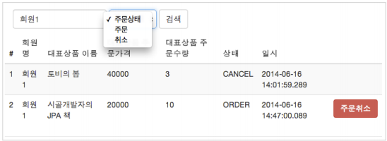

# 주문 도메인 개발
- <b>구현 기능</b>
    - 상품 주문
    - 주문내역 조회
    - 주문 취소
## 목차
- 주문 리포지토리 개발
- 주문 서비스 개발
- 주문 검색 기능 개발
- 주문 기능 테스트
___
## 주문 리포지토리 개발
### 주문 리포지토리 코드
```java
@Repository
@RequiredArgsConstructor
public class OrderRepository {

    private final EntityManager em;

    public void save(Order order) {
        em.persist(order);
    }

    public Order findOne(Long orderId) {
        return em.find(Order.class, orderId);
    }

    public List<Order> findAllByString(OrderSearch orderSearch) {
        String jpql = "select o From Order o join o.member m";
        boolean isFirstCondition = true;

        //주문 상태 검색
        if (orderSearch.getOrderStatus() != null) {
            if (isFirstCondition) {
                jpql += " where";
                isFirstCondition = false;
            } else {
                jpql += " and";
            }
            jpql += " o.orderStatus = :status";
        }

        //회원 이름 검색
        if (StringUtils.hasText(orderSearch.getMemberName())) {
            if (isFirstCondition) {
                jpql += " where";
                isFirstCondition = false;
            } else {
                jpql += " and";
            }
            jpql += " m.name like :name";
        }
        TypedQuery<Order> query = em.createQuery(jpql, Order.class)
                .setMaxResults(1000); //최대 1,000건

        if (orderSearch.getOrderStatus() != null) {
            query = query.setParameter("status", orderSearch.getOrderStatus());
        }
        if (StringUtils.hasText(orderSearch.getMemberName())) {
            query = query.setParameter("name", orderSearch.getMemberName());
        }
        return query.getResultList();
    }

    /**
     * JPA Criteria
     * @param orderSearch
     * @return
     */
    public List<Order> findAllByCriteria(OrderSearch orderSearch) {
        CriteriaBuilder cb = em.getCriteriaBuilder();
        CriteriaQuery<Order> cq = cb.createQuery(Order.class);
        Root<Order> o = cq.from(Order.class);
        Join<Object, Object> m = o.join("member", JoinType.INNER);

        List<Predicate> criteria = new ArrayList<>();

        //주문 상태 검색
        if (orderSearch.getOrderStatus() != null) {
            Predicate status = cb.equal(o.get("status"), orderSearch.getOrderStatus());
            criteria.add(status);
        }

        if (StringUtils.hasText(orderSearch.getMemberName())) {
            Predicate name = cb.like(m.<String>get("name"), "%" + orderSearch.getMemberName() + "%");
            criteria.add(name);
        }

        cq.where(cb.and(criteria.toArray(new Predicate[criteria.size()])));
        TypedQuery<Order> query = em.createQuery(cq).setMaxResults(1000);
        return query.getResultList();
    }
}
```
- `findAllByXXX(OrderSearch orderSearch)`
    - 검색 조건에 동적으로 쿼리를 생성해서 주문 엔티티를 조회한다.
    1. <b>JPQL로 처리(`findAllByString`)</b>
        - JPQL 쿼리를 문자로 생성하기는 번거롭고, 실수로 인한 버그가 충분히 발생할 수 있다.
    2. <b>JPA Criteria로 처리(`findAllByCriteria`)</b>
        - JPA Criteria는 JPA 표준 스펙이지만, 실무에서 사용하기에 너무 복잡하다.
        - 다른 대안으로는 `Querydsl`이 있다.
___
## 주문 서비스 개발
### 주문 서비스 코드
```java
@Service
@RequiredArgsConstructor
@Transactional(readOnly = true)
public class OrderService {

    private final OrderRepository orderRepository;
    private final MemberRepository memberRepository;
    private final ItemRepository itemRepository;

    /**
     * 주문
     * @param memberId
     * @param itemId
     * @param count
     * @return
     */
    @Transactional
    public Long order(Long memberId, Long itemId, int count) {

        // 엔티티 조회
        Member member = memberRepository.findOne(memberId);
        Item item = itemRepository.findOne(itemId);

        // 배송정보 생성
        Delivery delivery = new Delivery(member.getAddress());

        // 주문상품 생성
        OrderItem orderItem = OrderItem.createOrderItem(item, item.getPrice(), count);

        // 주문 생성
        Order order = Order.createOrder(member, delivery, orderItem);

        // 주문 저장
        // 배송과 주문상품이 주문에 cascade 되어 있으므로, 주문만 영속화해도 배송과 주문상품도 같이 영속화된다.
        orderRepository.save(order);

        return order.getId();
    }

    /**
     *  주문 취소
     * @param orderId
     */
    @Transactional
    public void cancelOrder(Long orderId) {
        orderRepository.findOne(orderId).cancel();
    }

    public List<Order> findOrders(OrderSearch orderSearch) {
        return orderRepository.findAllByString(orderSearch);
    }
}
```
- 주문 서비스는 주문 엔티티와, 주문상품 엔티티의 비즈니스 로직을 활용해서 주문, 주문취소, 주문내역 검색 기능을 제공한다.
> <b>참고</b>
> - 예제를 단순화하기 위해 한 번에 하나의 상품만 주문하도록 구현하였다.
- <b>주문(`order()`)</b>
    - 주문하는 회원 식별자, 상품 식별자, 주문 수량 정보를 받아서 실제 주문 엔티티를 생성한 후 저장한다.
- <b>주문 취소(`cancelOrder()`)</b>
    - 주문 식별자를 받아서 주문 엔티티를 조회한 후, 주문 엔티티에 주문 취소를 요청한다.
- <b>주문 검색(`findOrders()`)</b>
    - `OrderSearch`라는 검색 조건을 가진 객체로 주문 엔티티를 검색한다.
> <b>참고</b>
> - 주문 서비스의 주문과 주문 취소 메소드를 보면, 비즈니스 로직 대부분이 엔티티에 존재한다.
>   - 서비스 계층은 단순히 엔티티에 필요한 요청을 위임하는 역할을 한다.
>   - 이처럼 엔티티가 비즈니스 로직을 가지고 객체지향의 특성을 적극 활용하는 것을 `도메인 모델 패턴`(http://martinfowler.com/eaaCatalog/domainModel.html)이라 한다.
>   - 반대로, 서비스 계층에서 대부분의 비즈니스 로직을 처리하는 것을 `트랜잭션 스크립트 패턴`(http://martinfowler.com/eaaCatalog/transactionScript.html)이라 한다.
___
## 주문 검색 기능 개발
- JPA에서 `동적 쿼리`를 어떻게 해결해야 할까?



- <b>검색 조건 파라미터(`OrderSearch`)</b>
    ```java
    @Getter
    @AllArgsConstructor
    public class OrderSearch {

        private String memberName;
        private OrderStatus orderStatus;

    }
    ```
___
## 주문 기능 테스트
### 테스트 요구사항
- 상품 주문이 성공해야 한다.
- 상품을 주문할 때, 재고 수량을 초과하면 안 된다.
- 주문 취소가 성공해야 한다.
### 주문 기능 테스트 코드
```java
@SpringBootTest
@Transactional
class OrderServiceTest {

    @Autowired
    OrderRepository orderRepository;

    @Autowired
    OrderService orderService;

    @Autowired
    EntityManager em;

    private Book createBook(String name, int price, int stockQuantity, String author, String isbn) {
        Book book = new Book(name, price, stockQuantity, author, isbn);
        em.persist(book);
        return book;
    }

    private Member createMember(String name, String city, String street, String zipcode) {
        Member member = new Member(name);
        member.updateAddress(city, street, zipcode);
        em.persist(member);
        return member;
    }

    @Test
    void 상품주문() throws Exception {
        // given
        Member member = createMember("memberA", "서울", "강가", "123-123");
        Book book = createBook("SpringBoot", 30000, 100, "김영한", "12452113");

        int orderCount = 2;

        // when
        Long orderId = orderService.order(member.getId(), book.getId(), orderCount);

        // then
        Order findOrder = orderRepository.findOne(orderId);

        assertEquals(findOrder.getOrderStatus(), OrderStatus.ORDER, "상품 주문 시, 상태는 ORDER");
        assertEquals(findOrder.getOrderItems().size(), 1, "주문한 상품 종류 수는 1");
        assertEquals(findOrder.getTotalPrice(), book.getPrice() * orderCount, "주문 가격 = 가격 * 수량");
        assertEquals(book.getStockQuantity(), 100 - orderCount, "주문 수량만큼 재고가 감소해야 한다.");
    }

    @Test
    void 주문취소() throws Exception {
        // given
        Member member = createMember("memberA", "보성", "복내월평길", "25-6");
        Book book = createBook("JPA", 25000, 100, "김영한", "182456");

        int orderCount = 50;

        Long orderId = orderService.order(member.getId(), book.getId(), orderCount);

        // when
        orderService.cancelOrder(orderId);

        // then
        assertEquals(OrderStatus.CANCEL, orderRepository.findOne(orderId).getOrderStatus(),
                "주문을 취소하면 상태가 CANCEL 으로 바뀌어야 한다.");
        assertEquals(100, book.getStockQuantity(),
                "주문을 취소한 만큼 재고 수량이 증가해야 한다.");
    }
    
    @Test
    void 상품주문_재고수량초과() throws Exception {
        // given
        Member member = createMember("memberA", "보성", "복내월평길", "25-6");
        Book book = createBook("JPA", 25000, 100, "김영한", "182456");

        int orderCount = 101;

        // when
        NotEnoughStockException ex = assertThrows(NotEnoughStockException.class, () -> orderService.order(member.getId(), book.getId(), orderCount));

        // then
        assertEquals("need more stock", ex.getMessage());
    }
}
```
