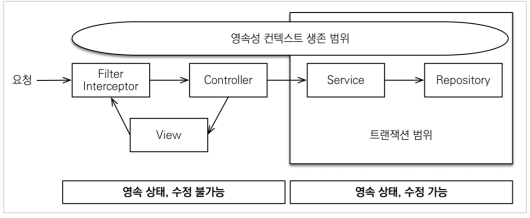
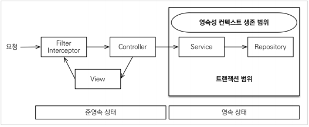
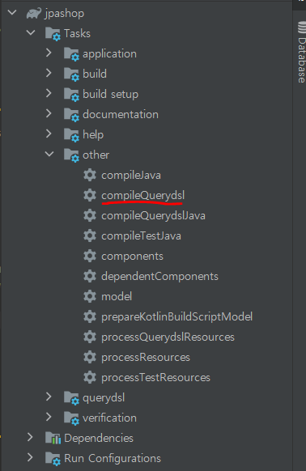
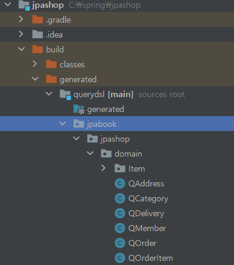

# API 개발 고급 - 실무 필수 최적화
## 목차
- OSIV와 성능 최적화
- 스프링 데이터 JPA 소개
- QueryDSL 소개
___
## OSIV와 성능 최적화
- Open Session In View: 하이버네이트
- Open EntityManager In View: JPA
    - 관례상 OSIV라 한다.
### OSIV ON

- `spring.jpa-open-io-view`: true(default)

이 기본값을 뿌리면서 애플리케이션 시작 시점에 warn 로그를 남기는 것은 이유가 있다.<br>
OSIV 전략은 트랜잭션 시작처럼, 최초 데이터베이스 커넥션 시작 시점부터 API 응답이 끝날 때 까지 영속성 컨텍스트와 데이터베이스 커넥션을 유지한다.<br>
그래서 지금까지 View Template이나 API 컨트롤러에서 지연 로딩이 가능했던 것이다.<br>
지연 로딩은 영속성 컨텍스트가 살아있어야 가능하고, 영속성 컨텍스트는 기본적으로 데이터베이스 커넥션을 유지한다. 이것 자체가 큰 장점이다.

그런데 이 전략은 너무 오랜시간동안 데이터베이스 커넥션 리소스를 사용하기 때문에, 실시간 트래픽이 중요한 애플리케이션에서는 커넥션이 모자랄 수 있다. 이것은 격룩 장애로 이어진다.<br>
예를 들어 컨트롤러에서 외부 API를 호출하면 외부 API 대기 시간만큼 커넥션 리소스를 반환하지 못하고, 유지해야 한다.
### OSIV OFF

- `spring.jpa-open-io-view`: false(OSIV 종료)

OSIV를 끄면 트랜잭션을 종료할 때 영속성 컨텍스트를 달고, 데이터베이스 커넥션도 반환한다. 따라서 커넥션 리소스를 낭비하지 않는다.<BR>
OSIV를 끄면 모든 지연로딩을 트랜잭션 안에서 처리해야 한다. 따라서 지금까지 작성한 많은 지연 로딩 코드를 트랜잭션 안으로 넣어야 하는 단점이 있다.<BR>
그리고 View Template에서 지연로딩이 동작하지 않는다.<BR>
결론적으로 트랜잭션이 끝나기 전에 지연 로딩을 강제로 호출해 두어야 한다.

### 커맨드와 쿼리 분리
- 실무에서 `OSIV를 끈 상태`로 복잡성을 관리하는 좋은 방법이 있다.
    - 바로 Command와 Query를 분리하는 것이다.
    - 참고: https://en.wikipedia.org/wiki/Command%E2%80%93query_separation

보통 비즈니스 로직은 특정 엔티티 몇 개를 등록하거나 수정하는 것이므로 성능이 크게 문제가 되지 않는다.<br>
그런데 복잡한 화면을 출력하기 위한 쿼리는 화면에 맞추어 성능을 최적화 하는 것이 중요하다.<br>
하지만 그 복잡성에 비해 핵심 비즈니스에 큰 영향을 주는 것은 아니다.<br>
그래서 크고 복잡한 애플리케이션을 개발한다면, 이 둘의 관심사를 명확하게 분리하는 선택은 유지보수 관점에서 충분히 의미 있다.<br>
단순하게 설명해서 다음처럼 분리하는 것이다.
- OrderService
    - OrderService: 핵심 비즈니스 로직
    - OrderQueryService: 화면이나 API에 맞춘 서비스 (주로 읽기 전용 트랜잭션 사용)

보통 서비스 계층에서 트랜잭션을 유지한다. 두 서비스 모두 트랜잭션을 유지하면서 지연 로딩을 사용할 수 있다.
> <b>참고</b>
> - 영한님은 고객 서비스의 실시간 API는 OSIV를 끄고, ADMIN처럼 커넥션을 많이 사용하지 않는 곳에서는 OSIV를 킨다고 한다.
___
## 스프링 데이터 JPA 소개
https://spring.io/projects/spring-data-jpa
- 스프링 데이터 JPA는 JPA를 사용할 때, 지루하게 반복되는 코드를 자동화 해준다.
    - 이미 라이브러리는 포함되어 있다.
    ```gradle
    implementation 'org.springframework.boot:spring-boot-starter-data-jpa'
    ```
    - 기존의 `MemberRepository`를 스프링 데이터 JPA로 변경해보자.
### MemberRepository
```java
public interface MemberRepository extends JpaRepository<Member, Long> {

    List<Member> findByName(String name);
}
```
findOne() -> findById()로 변경해야 한다.
- 스프링 데이터 JPA는 `JpaRepository`라는 인터페이스를 제공하는데, 여기에 기본적인 CRUD 기능이 모두 제공된다.
    - (일반적으로 상상할 수 있는 모든 기능이 다 포함되어 있다.)
- `findByName`처럼 일반화하기 어려운 기능도 메소드 이름으로 정확한 JPQL 쿼리를 실행한다.
    ```sql
    select m from Member m where m.name = :name
    ```
- 개발자는 인터페이스만 만들면 된다.
    - 구현체는 스프링 데이터 JPA가 애플리케이션 실행 시점에 주입해준다.

스프링 데이터 JPA는 스프링과 JPA를 활용해서 애플리케이션을 만들 때, 정말 편리한 기능을 많이 제공한다.<br>
하지만 `스프링 데이터 JPA는 JPA를 사용해서 이런 기능을 제공할 뿐이다. 결국 JPA 자체를 잘 이해하는 것이 가장 중요`하다.
___
## QueryDSL 소개
http://www.querydsl.com/
- 실무에서는 조건에 따라 실행되는 쿼리가 달라지는 동적 쿼리를 많이 사용한다.
- 주문 내역 검색으로 돌아가 이 예제를 QueryDSL으로 바꾸어보자.
### QueryDSL으로 처리
```java
@Slf4j
@Repository
@RequiredArgsConstructor
public class OrderRepository {

    public List<Order> findAll(OrderSearch orderSearch) {
        // 생성자 초기화로 빼서 공통으로 사용 가능
        JPAQueryFactory query = new JPAQueryFactory(em);
        // 아래 코드 지우고 static import 가능
        QOrder order = QOrder.order;
        QMember member = QMember.member;
        //==================================

        return query.select(order)
                .from(order)
                .join(order.member, member)
                .where(statusEq(orderSearch.getOrderStatus()), nameLike(orderSearch.getMemberName()))
                .limit(1000)
                .fetch();
    }

    private BooleanExpression nameLike(String memberName) {
        if (!StringUtils.hasText(memberName)) {
            return null;
        }
        return QMember.member.name.like(memberName);
    }

    private BooleanExpression statusEq(OrderStatus statusCond) {
        if (statusCond == null) {
            return null;
        }
        return QOrder.order.orderStatus.eq(statusCond);
    }
}
```
### build.gradle에 querydsl 추가
```gradle
//querydsl 추가
buildscript {
	dependencies {
		classpath("gradle.plugin.com.ewerk.gradle.plugins:querydsl-plugin:1.0.10")
	}
}

plugins {
	id 'org.springframework.boot' version '2.4.1'
	id 'io.spring.dependency-management' version '1.0.10.RELEASE'
	id 'java'
}

group = 'jpabook'
version = '0.0.1-SNAPSHOT'
sourceCompatibility = '11'

//apply plugin: 'io.spring.dependency-management'
apply plugin: "com.ewerk.gradle.plugins.querydsl"

configurations {
	compileOnly {
		extendsFrom annotationProcessor
	}
}

repositories {
	mavenCentral()
}

dependencies {
	implementation 'org.springframework.boot:spring-boot-starter-data-jpa'
	implementation 'org.springframework.boot:spring-boot-starter-validation'
	implementation 'org.springframework.boot:spring-boot-starter-thymeleaf'
	implementation 'org.springframework.boot:spring-boot-starter-web'
	implementation 'org.springframework.boot:spring-boot-devtools'
	implementation 'com.fasterxml.jackson.datatype:jackson-datatype-hibernate5'
// implementation 'org.hibernate:hibernate-core:5.4.13.Final'

	implementation 'com.github.gavlyukovskiy:p6spy-spring-boot-starter:1.5.6'

	compileOnly 'org.projectlombok:lombok'
	runtimeOnly 'com.h2database:h2'

	annotationProcessor 'org.projectlombok:lombok'
	testImplementation 'org.springframework.boot:spring-boot-starter-test'
	//추가
	testImplementation("org.junit.vintage:junit-vintage-engine") {
		exclude group: "org.hamcrest", module: "hamcrest-core"
	}

	//querydsl 추가
	implementation 'com.querydsl:querydsl-jpa'
	//querydsl 추가
	implementation 'com.querydsl:querydsl-apt'
}


//querydsl 추가
//def querydslDir = 'src/main/generated'
def querydslDir = "$buildDir/generated/querydsl"

querydsl {
	library = "com.querydsl:querydsl-apt"
	jpa = true
	querydslSourcesDir = querydslDir
}

sourceSets {
	main {
		java {
			srcDirs = ['src/main/java', querydslDir]
		}
	}
}

compileQuerydsl{
	options.annotationProcessorPath = configurations.querydsl
}

configurations {
	querydsl.extendsFrom compileClasspath
}
```
- QueryDSL은 SQL(JPQL)과 모양이 유사하면서, 자바 코드로 동적 쿼리를 편리하게 생성할 수 있다.
- 실무에서는 복잡한 동적 쿼리를 많이 사용하게 되는데, 이 때 QueryDSL을 사용하면 높은 개발 생산성을 얻으면서, 동시에 쿼리 오류를 컴파일 시점에 빠르게 잡을 수 있다.
- 꼭 동적 쿼리가 아니라 정적 쿼리인 경우에도 다음과 같은 이유로 QueryDSL을 사용하는 편이 좋다.
    - 직관적인 문법
    - 컴파일 시점에 빠른 문법 오류 발견
    - 코드 자동 완성
    - 코드 재사용
    - JPQL new 명령어와는 비교가 안 될 정도로 깔끔한 DTO 조회를 지원
- QueryDSL은 JPQL을 코드로 만드는 빌더 역할을 할 뿐이다. 따라서 JPQL을 잘 이해하면 금방 배울 수 있다.
- `QueryDSL은 JPA로 애플리케이션을 개발할 때 선택이 아닌 필수라 생각한다.`
> <b>참고</b>
> - 협업 시, gitignore에 build.generated 폴더를 꼭 추가하자.


- gradle에 의존성 추가 후, `compileQuerydsl`을 실행해야 `build.generated` 폴더에 Qxxx 클래스들이 생성된다.<br>
