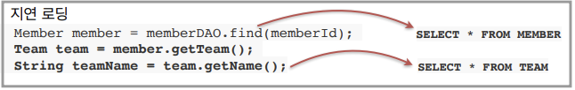

# JPA 소개
- <b>JPA</b>
    - `Java Persistence API`(자바 지속성 API)
    - 자바 진영의 `ORM` 기술 표준
    - 기존에 EJB에서 제공되던 엔티티 빈(Entity Bean)을 대체하는 기술
- <b>ORM</b>
    - `Object-Relational Mapping`(객체 관계 매핑)
    - 객체는 객체대로 설계
    - 관계형 데이터베이스는 관계형 데이터베이스대로 설계
    - ORM 프레임워크가 중간에서 둘을 매핑
    - 대중적인 언어에는 대부분 ORM 기술이 존재
- <b>JPA는 애플리케이션과 JDBC 사이에서 동작한다.</b> 

    - <b>JPA 동작 - 저장</b> 
    
    - <b>JPA 동작 - 조회</b> 
    
- <b>JPA는 표준 명세</b>
    - JPA는 인터페이스의 모음
    - JPA 2.1 표준 명세를 구현한 3가지 구현체
    - `하이버네이트`, `EclipseLinik`, `DataNucleus` 
    
- <b>JPA 버전</b>
    - JPA 1.0(JSR 220) 2006년: 초기 버전, 복합 키와 연관관계 기능이 부족
    - JPA 2.0(JSR 317) 2009년: 대부분의 ORM 기능을 포함, JPA Criteria 추가
    - JPA 2.1(JSR 338) 2013년: stored procedure 접근, Converter, 엔티티 그래프 기능 추가
## JPA를 왜 사용해야 할까?
- SQL 중심 개발 -> 객체 중심 개발
- 생산성
- 유지보수
- 패러다임 불일치 해결
- 성능
- 데이터 접근 추상화 & 벤더 독립성
- 표준
### 생산성
JPA와 CRUD
- 저장: `jpa.persist`(member)
- 조회: Member member = `jpa.find`(memberId)
- 수정: `member.setName`("변경할 이름")
- 삭제: `jpa.remove`(member)
___
### 유지보수
- <b>기존</b>: 필드 변경 시 모든 SQL 수정 필요 
    
- <b>JPA</b>: 필드만 추가하면 됨, SQL은 JPA가 처리 
    
___
### JPA와 패러다임의 불일치 해결
1. JPA와 상속
2. JPA와 연관관계
3. JPA와 객체 그래프 탐색
4. JPA와 비교하기
#### JPA와 상속

- <b>저장</b> 
    
- <b>조회</b> 
    
#### JPA와 연관관계, 객체 그래프 탐색

- <b>신뢰할 수 있는 엔티티, 계층</b> 
    
#### JPA와 비교하기

___
### JPA의 성능 최적화 기능
1. 1차 캐시와 동일성(identity) 보장
2. 트랜잭션을 지원하는 쓰기 지연(transactional wirte-behind)
3. 지연 로딩(Lazy Loading)
#### 1차 캐시와 동일성 보장
1. `같은 트랜잭션` 안에서는 `같은 엔티티`를 반환
    - 약간의 조회 성능 향상
2. DB Isolation Level이 Read Commit이어도 애플리케이션에서 Repeatable Read 보장(참고) 
    
#### 트랜잭션을 지원하는 쓰기 지연
- <b>INSERT</b>
    1. 트랜잭션을 commit하기 전까지 INSERT SQL을 모음
    2. JDBC BATCH SQL 기능을 사용해서 한 번에 SQL 전송 
        
- <b>UPDATE</b>
    1. UPDATE, DELETE로 인한 로우락(row lock) 시간 최소화
    2. 트랜잭션 commit 시, UPDATE, DELETE SQL을 실행하고 바로 commit 
        
#### 지연 로딩과 즉시 로딩
- <b>지연 로딩</b>
    - 객체가 실제 사용될 때, 로딩 
        
- <b>즉시 로딩</b>
    - JOIN SQL으로 한 번에 연관된 객체까지 미리 조회 
        