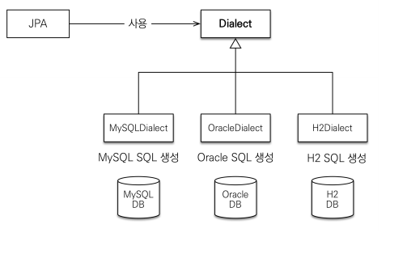
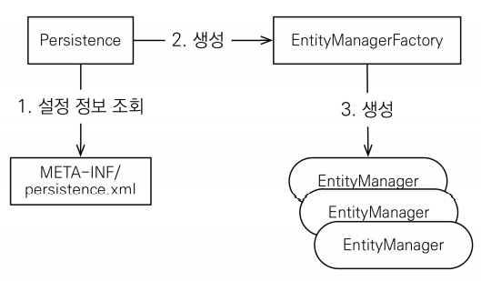

# JPA 시작하기
## 목차
- Hello JPA - 프로젝트 생성
- Hello JPA - 애플리케이션 개발
___
## Hello JPA - 프로젝트 생성
- <b>프로젝트 생성</b>
    - Java 8 이상
    - Maven
        - groupId: jpa-basic
        - artifactId: ex1-hello-jpa
        - version: 1.0.0
- <b>라이브러리 추가 - pom.xml</b>
    ```xml
    <?xml version="1.0" encoding="UTF-8"?>
    <project xmlns="http://maven.apache.org/POM/4.0.0"
             xmlns:xsi="http://www.w3.org/2001/XMLSchema-instance"
             xsi:schemaLocation="http://maven.apache.org/POM/4.0.0 http://maven.apache.org/xsd/maven-4.0.0.xsd">
        <modelVersion>4.0.0</modelVersion>

        <groupId>jpa-basic</groupId>
        <artifactId>ex1-hello-jpa</artifactId>
        <version>1.0.0</version>

        <dependencies>
            <!-- JPA 하이버네이트 -->
            <dependency>
                <groupId>org.hibernate</groupId>
                <artifactId>hibernate-entitymanager</artifactId>
                <version>5.3.10.Final</version>
            </dependency>

            <!--
            Java9 이후 빠진 기능(http://openjdk.java.net/jeps/320) 추가
            Spring boot 에서는 의존성 관리기능을 통해 jaxb-api 버전을 관리하기 때문에, 신경쓰지 않아도 된다.
            !-->
            <dependency>
                <groupId>javax.xml.bind</groupId>
                <artifactId>jaxb-api</artifactId>
                <version>2.3.0</version>
            </dependency>

            <!-- H2 데이터베이스 -->
            <dependency>
                <groupId>com.h2database</groupId>
                <artifactId>h2</artifactId>
                <version>1.4.199</version>
            </dependency>

            <!-- 
            lombok 
            Maven Repository: https://mvnrepository.com/
            !-->
            <dependency>
                <groupId>org.projectlombok</groupId>
                <artifactId>lombok</artifactId>
                <version>1.18.20</version>
                <scope>provided</scope>
            </dependency>
        </dependencies>

        <properties>
            <maven.compiler.source>15</maven.compiler.source>
            <maven.compiler.target>15</maven.compiler.target>
        </properties>

    </project>
    ```
- <b>JPA 설정하기 - persistence.xml</b>
    ```xml
    <?xml version="1.0" encoding="UTF-8"?>
    <persistence version="2.2"
                 xmlns="http://xmlns.jcp.org/xml/ns/persistence" xmlns:xsi="http://www.w3.org/2001/XMLSchema-instance"
                 xsi:schemaLocation="http://xmlns.jcp.org/xml/ns/persistence http://xmlns.jcp.org/xml/ns/persistence/persistence_2_2.xsd">
        <persistence-unit name="hello">
            <properties>
                <!-- 필수 속성 -->
                <property name="javax.persistence.jdbc.driver" value="org.h2.Driver"/>
                <property name="javax.persistence.jdbc.user" value="sa"/>
                <property name="javax.persistence.jdbc.password" value=""/>
                <property name="javax.persistence.jdbc.url" value="jdbc:h2:tcp://localhost/~/test"/>
                <property name="hibernate.dialect" value="org.hibernate.dialect.H2Dialect"/>

                <!-- 옵션 -->
                <property name="hibernate.show_sql" value="true"/>
                <property name="hibernate.format_sql" value="true"/>
                <property name="hibernate.use_sql_comments" value="true"/>
                <!--<property name="hibernate.hbm2ddl.auto" value="create" />-->
            </properties>
        </persistence-unit>
    </persistence>    
    ```
    - JPA 설정 파일
    - `/META-INF/persistence.xml` 위치
    - `persistence-unit name`으로 이름 지정
    - `javax.persistence.xxx`: JPA 표준 속성
    - `hibernate.xxx`: 하이버네이트 전용 속성
- <b>데이터베이스 방언</b>
    - JPA는 특정 데이터베이스에 종속❌
    - 각각의 데이터베이스가 제공하는 SQL 문법과 함수는 조금씩 다르다.
        - 가변 문자: `MySQL`은 `VARCHAR`, `Oracle`은 `VARCHAR2`
        - 문자열을 자르는 함수: `SQL 표준`은 `SUBSTRING()`, `Oracle`은 `SUBSTR()`
        - 페이징: `MySQL`은 `LIMIT`, `Oracle`은 `ROWNUM`
    - 방언: SQL 표준을 지키지 않는 특정 데이터베이스만의 고유한 기능<br>
    
    - `hibernate.dialect` 속성에 지정
        - H2: org.hibernate.dialect.H2Dialect
        - Oracle: org.hibernate.dialect.Oracle10gDialect
        - MySQL: org.hibernate.dialect.MySQL5InnoDBDialect
    - 하이버네이트는 40가지 이상의 데이터베이스 방언을 지원한다.
___
## Hello JPA - 애플리케이션 개발
- <b>JPA 구동 방식</b><BR>
    
### 실습 - JPA 동작 확인
- JpaMain 클래스 생성
- 객체와 테이블 생성, 매핑
    ```java
    @Entity
    @Getter
    @Setter
    public class Member {

        @Id
        private Long id;
        private String name;
    }
    ```
    - `@Entity`: JPA가 관리할 객체
    - `@Id`: 데이터베이스 PK와 매핑
    ```sql
    create table Member ( 
        id bigint not null, 
        name varchar(255), 
        primary key (id) 
    );
    ```
- <b>회원 등록</b>
    ```java
    public class JpaMain {
        public static void main(String[] args) {
            EntityManagerFactory emf = Persistence.createEntityManagerFactory("hello");
            EntityManager em = emf.createEntityManager();
            EntityTransaction tx = em.getTransaction();

            tx.begin();
            try {
                Member member1 = new Member();
                member1.setId(1L);
                member1.setName("ksp");
                em.persist(member1);

                tx.commit();
            } catch (Exception e) {
                tx.rollback();
            } finally {
                em.close();
            }
            emf.close();
        }
    }
    ```
- <b>회원 조회</b>
    ```java
    public static void main(String[] args) {
        EntityManagerFactory emf = Persistence.createEntityManagerFactory("hello");
        EntityManager em = emf.createEntityManager();

        EntityTransaction tx = em.getTransaction();
        tx.begin();

        try {
            Member member = em.find(Member.class, 1L);

            tx.commit();
        } catch (Exception e) {
            tx.rollback();
        } finally {
            em.close();
        }
        emf.close();
    }
    ```
- <b>회원 수정</b>
    ```java
    public static void main(String[] args) {
        EntityManagerFactory emf = Persistence.createEntityManagerFactory("hello");
        EntityManager em = emf.createEntityManager();
        EntityTransaction tx = em.getTransaction();

        tx.begin();
        try {
            Member member1 = em.find(Member.class, 1L);
            member1.setName("SON");
            
            tx.commit();
        } catch (Exception e) {
            tx.rollback();
        } finally {
            em.close();
        }
        emf.close();
    }
    ```
- <b>회원 삭제</b>
    ```java
    public static void main(String[] args) {
        EntityManagerFactory emf = Persistence.createEntityManagerFactory("hello");
        EntityManager em = emf.createEntityManager();
        EntityTransaction tx = em.getTransaction();

        tx.begin();
        try {
            Member member1 = em.find(Member.class, 1L);
            em.remove(member1);

            tx.commit();
        } catch (Exception e) {
            tx.rollback();
        } finally {
            em.close();
        }
        emf.close();
    }
    ```
- <b>주의</b>
    - `EntityManagerFactory`는 하나만 생성해서 애플리케이션 전체에서 공유
    - `EntityManager`는 스레드간 공유❌ (사용 후 버려야 함)
    - `JPA의 모든 데이터 변경은 트랜잭션 안에서 실행`
### JPQL 소개
```java
List<Member> result = em.createQuery("select m from Member m", Member.class)
                    .getResultList();
```
- 가장 단순한 조회 방법
    - `EntityManager.find()`
    - 객체 그래프 탐색(`a.getB().getC())`
    > 나이가 18세 이상인 회원을 모두 검색하고 싶다면?
- JPA를 사용하면 `엔티티 객체`를 중심으로 개발 가능<br><br>
- 문제는 검색 쿼리
- 검색을 할 때도, 테이블이 아닌 `엔티티 객체`를 대상으로 검색
- 모든 DB 데이터를 객체로 변환해서 검색하는 것은 불가능
- 애플리케이션이 필요한 데이터만 DB에서 불러오려면 결국 검색 조건이 포함된 SQL이 필요<br><br>
- JPA는 SQL을 추상화한 `JPQL`이라는 `객체 지향 쿼리 언어`를 제공
- SQL과 문법이 유사하며, SELECT, FROM, WHERE, GROUP BY, HAVING, JOIN 지원
- `JPQL은 엔티티 객체`를 대상으로 쿼리
- `SQL은 데이터베이스 테이블`을 대상으로 쿼리<br><br>
- JPQL은 테이블이 아닌 `객체를 대상으로 검색하는 객체 지향 쿼리`
- SQL을 추상화해서 특정 데이터베이스 SQL에 의존❌
- JPQL을 한마디로 정의하면 `객체 지향 SQL`
