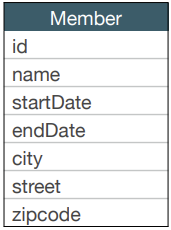
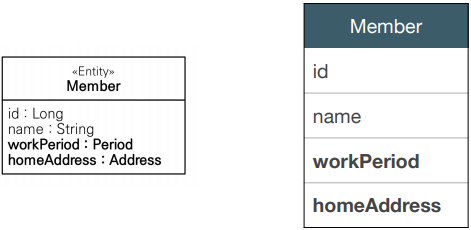
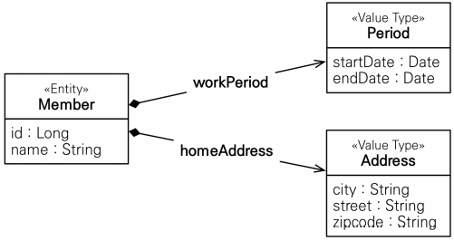
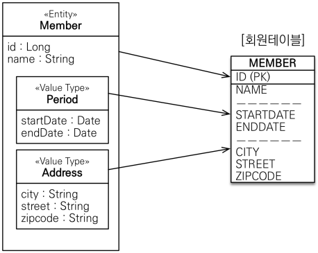
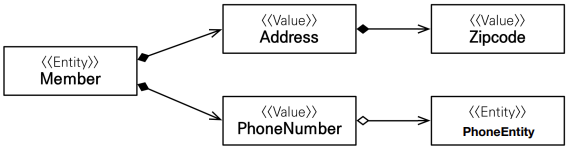
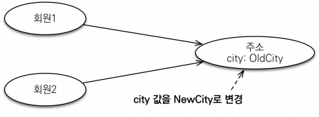
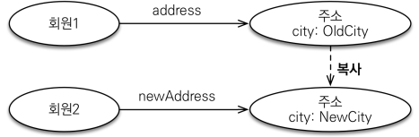
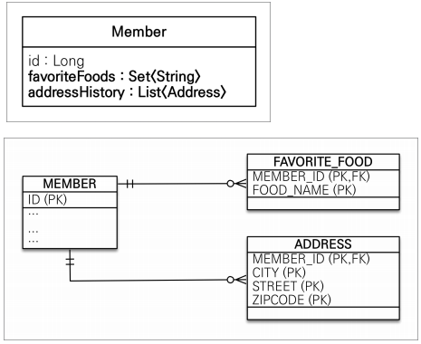
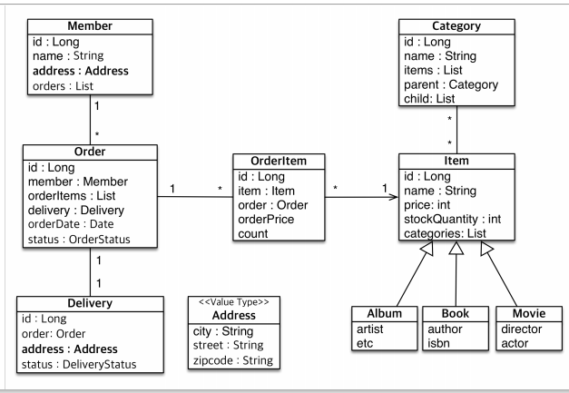

# 값 타입
## 목차
- 기본값 타입
- ⭐임베디드 타입(복합 값 타입)
- 값 타입과 불변 객체
- 값 타입의 비교
- ⭐값 타입 컬렉션
- 실전 예제 - 6. 값 타입 매핑
___
## 기본값 타입
### JPA의 데이터 타입 분류
- <b>엔티티 타입</b>
    - @Entity로 정의하는 객체
    - 데이터가 변해도 식별자로 지속해서 추적 가능
        > ex) 회언 엔티티의 키나 나이 값을 변경해도 식별자로 인식 가능
- <b>값 타입</b>
    - int, Integer, String처럼 단순히 값으로 사용하는 자바 기본 타입이나 객체
    - 식별자가 없고, 값만 있으므로 변경 시 추적 불가
        > ex) 숫자 100을 200으로 변경하면, 완전히 다른 값으로 대체
### 값 타입 분류
- <b>기본값 타입</b>
    - 자바 기본 타입(int, double)
    - Wrapper 클래스(Integer, Long)
    - String
- <b>임베디드 타입</b>(embedded type, 복합 값 타입)
- <b>컬렉션 값 타입</b>(collection value type)
### 기본값 타입
> ex) String name, int age
- 생명주기를 엔티티에 의존
    > ex) 회원을 삭제하면 이름, 나이 필드도 함께 삭제됨
- 값 타입은 절대 공유❌
    > ex) 회원 이름 변경 시, 다른 회원의 이름도 함께 변경되면 안됨
> <b>참고</b>
> - 자바의 기본 타입(primitive type)은 절대 공유❌
> - 기본 타입은 항상 값을 복사함
> - Integer 같은 Wrapper 클래스나, String 같은 특수 클래스는 공유 가능한 객체이지만, 변경❌
___
## ⭐임베디드 타입
- 새로운 값 타입을 직접 정의할 수 있음
- JPA는 임베디드 타입(embedded type)이라 함
- 주로 기본 값 타입을 모아서 만들고, 복합 값 타입이라고도 함
- int, String 과 같은 값 타입이다.
### 임베디드 타입 예시
- 회원 엔티티는 이름, 근무 시작일, 근무 종료일, 주소 도시, 주소 번지, 주소 우편번호를 가진다.<br>
    
- 회원 엔티티는 이름, 근무 기간, 집 주소를 가진다.<br>
    <br>
    
### 임베디드 타입 사용법
- `@Embeddable`: 값 타입을 정의하는 곳에 표시
- `@Embedded`: 값 타입을 사용하는 곳에 표시
- 기본 생성자 필수
### 임베디드 타입의 장점
- 재사용
- 높은 응집도
- Period.isWork() 와 같이 해당 값 타입만 사용하는 의미 있는 메소드 생성 가능
- 임베디드 탕비을 포함한 모든 값 타입은 값 타입을 소유한 엔티티에 생명주기를 의존한다.
### 임베디드 타입과 테이블 매핑

- 임베디드 타입은 엔티티의 값일 뿐이다.
- 임베디드 타입을 사용하기 전과 후의 `매핑하는 테이블은 동일`하다.
- 객체와 테이블을 아주 세밀하게(find-grained) 매핑하는 것이 가능하다.
- 잘 설계한 ORM 애플리케이션은 매핑한 테이블의 수보다 클래스의 수가 더 많다.
### 임베디드 타입과 연관관계

### @AttributeOverride: 속성 재정의
- 한 엔티티에서 같은 값 타입을 사용하면?
    - 컬럼 명이 중복!
- `@AttributeOverrides`, `@AttributeOverride`를 사용해서 컬럼 명 속성을 재정의 가능
```java
@Entity
@Getter
@Setter
public class Member{

    ...

    @Embedded
    @AttributeOverrides({
            @AttributeOverride(name = "city", column = @Column(name = "HOME_CITY")),
            @AttributeOverride(name = "street", column = @Column(name = "HOME_STREET")),
            @AttributeOverride(name = "zipcode", column = @Column(name = "HOME_ZIPCODE"))
    })
    private Address homeAddress;

    @Embedded
    @AttributeOverrides({
            @AttributeOverride(name = "city", column = @Column(name = "WORK_CITY")),
            @AttributeOverride(name = "street", column = @Column(name = "WORK_STREET")),
            @AttributeOverride(name = "zipcode", column = @Column(name = "WORK_ZIPCODE"))
    })
    private Address workAddress;
}
```
```java
@Embeddable
@Getter
public class Address {

    private String street;
    private String city;
    private String zipcode;

    public Address() {
    }

    public Address(String city, String street, String zipcode) {
        this.street = street;
        this.city = city;
        this.zipcode = zipcode;
    }

    @Override
    public boolean equals(Object o) {
        if (this == o) return true;
        if (o == null || getClass() != o.getClass())
            return false;
        Address address = (Address) o;
        return Objects.equals(street, address.street) &&
                Objects.equals(city, address.city) &&
                Objects.equals(zipcode, address.zipcode);
    }

    @Override
    public int hashCode() {
        return Objects.hash(street, city, zipcode);
    }
}
```
### 임베디드 타입과 null
- 임베디드 타입의 값이 null이면, 매핑한 컬럼 값은 모두 null
___
## 값 타입과 불변 객체
값 타입은 복잡한 객체 세상을 조금이라도 단순화하려고 만든 개념이다.<bR>
따라서 값 타입은 단순하고 안전하게 다룰 수 있어야 한다.
### 값 타입 공유 참조
- 임베디드 타입 같은 값 타입을 여러 엔티티에서 공유하면 위험❗
    - 부작용(side effect) 발생<br>
        
### 값 타입 복사
- 값 타입의 실제 인스턴스인 값을 공유하는 것은 위험❗
- 대신 값(인스턴스)를 복사해서 사용<br>
         
### 객체 타입의 한계
- 항상 값을 복사해서 사용하면, 공유 참조로 인해 발생하는 부작용을 피할 수 있다.
- 문제는 임베디드 타입처럼 `직접 정의한 값 타입은 자바의 기본 타입이 아니라, 객체 타입`이다.
- 자바 기본 타입에 값을 대입하면 값을 복사한다.
- `객체 타입은 참조 값을 직접 대입하는 것을 막을 방법이 없다.`
- `객체의 공유 참조는 피할 수 없다.`
### 불변 객체
- 객체 타입을 수정할 수 없게 만들어 `부작용을 원천 차단`
- `값 타입은 불변 객체(immutable object)로 설계해야 함`
- `불변 객체: 생성 시점 이후 절대 값을 변경할 수 없는 객체`
- 생성자로만 값을 설정하고, 수정자(Setter)를 만들지 않으면 된다.
> <b>참고</b>
> - Integer, String은 자바가 제공하는 대표적인 불변 객체

<b>불변이라는 작은 제약으로 부작용이라는 큰 재앙을 막을 수 있다.</b>

___
## 값 타입의 비교
- 값 타입: 인스턴스가 달라도, 그 안에 값이 같으면 같은 것으로 여겨야 함
- <b>동일성(identity)</b> 비교
    - 인스턴스의 `참조 값`을 비교, `==` 사용
- <b>동등성(equivalence)</b> 비교
    - 인스턴스의 `값`을 비교, `equals()` 사용
- 값 타입은 `a.equals(b)`를 사용해서 동등성 비교를 해야 함
- 값 타입의 `equals() 메소드를 적절하게 재정의`(주로 모든 필드 사용)
### equals() 재정의 - 주의
- `연관관계 필드(ManyToOne, OneToOne, ...)는 동등성 비교에서 사용❌`
- 동등성 비교의 핵심은 메모리 상에 올라와 있는 동안 비교할 때 문제가 없으면 된다.
    - 따라서, 일반적으로 동등성 비교는 `비즈니스 키`로 잡는다.
        > ex) 회원의 주민번호, 회원의 이름+전화번호 등
- 추가로, @Id에 직접 값을 할당할 때는 객체를 생성하면서 값을 넣어주기 때문에, 비즈니스 키로 잡아도 문제가 없다.
    - 하지만, `@GenerateValue`는 영속화 전까지 null이므로 주의하자!
___
## 값 타입 컬렉션

- 값 타입을 하나 이상 저장할 때 사용
- `@ElementCollection`, `@CollectionTable` 사용
- 데이터베이스는 컬렉션을 같은 테이블에 저장할 수 없다.
- 컬렉션을 저장하기 위한 별도의 테이블이 필요하다.
- 값 타입 컬렉션도 `지연 로딩` 전략을 사용한다.
> <B>참고</B>
> - 값 타입 컬렉션은 `영속성 전이(Cascade) + 고아 객체 제거` 기능을 필수로 가진다고 볼 수 있다.
### 값 타입 컬렉션 사용
```java
@Entity
@Getter
@Setter
public class Member{

    @Id
    @GeneratedValue
    @Column(name = "MEMBER_ID")
    private Long id;

    @Column(name = "USERNAME")
    private String username;
// ------------------------------ 추가 -----------------------------
    @ElementCollection
    @CollectionTable(
            name = "FAVORITE_FOOD",
            joinColumns = @JoinColumn(name = "MEMBER_ID")
    )
    @Column(name = "FOOD_NAME")
    private Set<String> favoriteFoods = new HashSet<>();

    @ElementCollection
    @CollectionTable(
            name = "ADDRESS",
            joinColumns = @JoinColumn(name = "MEMBER_ID")
    )
    @AttributeOverrides({
            @AttributeOverride(name = "city", column = @Column(name = "CITY")),
            @AttributeOverride(name = "street", column = @Column(name = "STREET")),
            @AttributeOverride(name = "zipcode", column = @Column(name = "ZIPCODE"))
    })
    private List<Address> addressHistory = new ArrayList<>();

    @Embedded
    @AttributeOverrides({
            @AttributeOverride(name = "city", column = @Column(name = "HOME_CITY")),
            @AttributeOverride(name = "street", column = @Column(name = "HOME_STREET")),
            @AttributeOverride(name = "zipcode", column = @Column(name = "HOME_ZIPCODE"))
    })
    private Address homeAddress;
}
```
```java
public class JpaMain {
    public static void main(String[] args) {
        EntityManagerFactory emf = Persistence.createEntityManagerFactory("hello");
        EntityManager em = emf.createEntityManager();
        EntityTransaction tx = em.getTransaction();

        tx.begin();
        try {
            Member member = new Member();
            member.setUsername("hello");
            member.setHomeAddress(new Address("homeCity", "homeStreet", "10000"));
// ------------------------------ 값 타입 컬렉션 [저장] 시작 ------------------------------
            member.getFavoriteFoods().add("치킨");
            member.getFavoriteFoods().add("피자");
            member.getFavoriteFoods().add("라면");

            member.getAddressHistory().add(new Address("oldCity", "oldStreet", "10300"));
            member.getAddressHistory().add(new Address("oldCity2", "oldStreet2", "10500"));

            em.persist(member);
// ------------------------------ 값 타입 컬렉션 [저장] 끝 ------------------------------
            em.flush();
            em.clear();

            System.out.println("==========================");
// ------------------------------ 값 타입 컬렉션 [조회] 시작 ------------------------------
            Member findMember = em.find(Member.class, member.getId()); // SELECT QUERY

            /**
             * 값 타입 컬렉션 -> 지연로딩
             */
            List<Address> addressHistory = findMember.getAddressHistory(); // SELECT QUERY
            for (Address address : addressHistory) {
                System.out.println("address.getCity() = " + address.getCity());
            }
// ------------------------------ 값 타입 컬렉션 [조회] 끝 ------------------------------

// ------------------------------ 값 타입 컬렉션 [수정] 시작 ------------------------------
            findMember.setHomeAddress(new Address(findMember.getHomeAddress().getCity(), "newStreet", "10001")); // UPDATE QUERY

            findMember.getFavoriteFoods().remove("치킨"); // DELETE QUERY
            findMember.getFavoriteFoods().add("족발"); // INSERT QUERY
// ------------------------------ 값 타입 컬렉션 [수정] 끝 ------------------------------

            tx.commit();
        } catch (Exception e) {
            tx.rollback();
            e.printStackTrace();
        } finally {
            em.close();
        }
        emf.close();
    }
}
```
### 값 타입 컬렉션의 제약사항
- 값 타입은 엔티티와 다르게, 식별자 개념❌
- 값은 변경하면 추적이 어려움
- 값 타입 컬렉션에 변경 사항이 발생하면, 주인 엔티티와 연관된 모든 데이터를 삭제하고, 값 타입 컬렉션에 있는 현재 값을 모두 다시 저장한다.
- 값 타입 컬렉션을 매핑하는 테이블은 모든 컬럼을 묶어서 기본 키를 구성해야 함
    - 제약사항: `null 입력❌, 중복 저장❌`
### 값 타입 컬렉션 대안
- 실무에서는 상황에 따라 `값 타입 컬렉션 대신 일대다 관계를 고려`
- 일대다 관계를 위한 엔티티를 만들고, 여기에서 값 타입을 사용
- 영속성 전이(Cascade) + 고아 객체 제거를 사용해서 값 타입 컬렉션 처럼 사용
    > ex) AddressEntity
```java
@Entity
@Getter
@Setter
@Table(name = "ADDRESS")
public class AddressEntity {

    @Id
    @GeneratedValue
    private Long id;

    @Embedded
    private Address address;

    public AddressEntity(String city, String street, String zipcode) {
        this.address = new Address(city, street, zipcode);
    }

    public AddressEntity() {

    }
}
```
```java
@Entity
@Getter
@Setter
public class Member{

    ...

    @OneToMany(cascade = ALL, orphanRemoval = true)
    @JoinColumn(name = "MEMBER_ID")
    private List<AddressEntity> addressHistory = new ArrayList<>();

    ... 
}
```
- <b>일대다 단방향 vs 다대일 양방향</b>
    - 위의 코드처럼 일대다 단방향 연관관계를 맺으면, Address(`N`)에 INSERT할 떄마다, MEMBER_ID FK를 적용하기 위해 추가적인 UPDATE 쿼리가 실행된다.
    - 이를 다대일 양방향으로 연관관계를 적용하면, 추가적인 UPDATE 쿼리를 막을 수 있다.
        - 그러나, 객체지향 관점에서 tradeoff가 존재한다.
        - 이러한 부분은 상황에 맞게 판단하자.
```java
@Entity
@Getter
@Setter
@Table(name = "ADDRESS")
public class AddressEntity {

    ...

    @ManyToOne
    @JoinColumn(name = "MEMBER_ID")
    private Member member;

    ...
}
```
```java
@Entity
@Getter
@Setter
public class Member{

    ...

    @OneToMany(mappedBy = "member", cascade = ALL, orphanRemoval = true)
    private List<AddressEntity> addressHistory = new ArrayList<>();

    // 연관관계의 주인을 대상 엔티티로 넘기는 대신, 연관관계 편의 메소드를 주 엔티티에 만듦으로써 어색함 해소
    public void addAddressHistory(String city, String street, String zipcode) {
        AddressEntity address = new AddressEntity(city, street, zipcode);
        address.setMember(this);
        addressHistory.add(address);
    }

    ...
}
```
### 정리
- <b>엔티티 타입의 특징</b>
    - 식별자⭕
    - 생명 주기 관리
    - 공유
- <b>값 타입의 특징</b>
    - 식별자❌
    - 생명 주기를 엔티티에 의존
    - 공유하지 않는 것이 안전(복사해서 사용)
    - 불변 객체로 만드는 것이 안전
- <B>값 타입은 정말 값 타입이라 판단될 때만 사용</B>
- <b>엔티티와 값 타입을 혼동해서 엔티티를 값 타입으로 만들면 안됨❗</b>
- <b>식별자가 필요하고, 지속해서 값을 추적, 변경해야 한다면, 그것은 값 타입이 아닌, 엔티티❗</b>
___
## 실전 예제 - 6. 값 타입 매핑

```java
@Embeddable
@Getter // 값 타입이므로, Setter는 사용❌
public class Address {
    @Column(length = 10)
    private String city;

    @Column(length = 20)
    private String street;

    @Column(length = 5)
    private String zipcode;

    // Address 전용 메소드 추가 가능
    public String getFullAddress(){
        return getCity() + " " + getStreet() + " " + getZipcode();
    }

        // JPA 에서는 proxy 를 고려해서 직접 필드에 접근하는 것 보다, getter 를 통해 접근하는 편이 안전하다.
    @Override
    public boolean equals(Object o) {
        if (this == o) return true;
        if (o == null || getClass() != o.getClass()) return false;
        Address address = (Address) o;
        return Objects.equals(getCity(), address.getCity())
                && Objects.equals(getStreet(), address.getStreet())
                && Objects.equals(getZipcode(), address.getZipcode());
    }

    @Override
    public int hashCode() {
        return Objects.hash(getCity(), getStreet(), getZipcode());
    }
}
```
```java
@Entity
@Getter
public class Member extends BaseEntity{

   ...

    @Embedded
    private Address address;

    ...

}
```
```java
@Entity
public class Delivery extends BaseEntity{

    ...

    @Embedded
    private Address address;

    ...
}
```