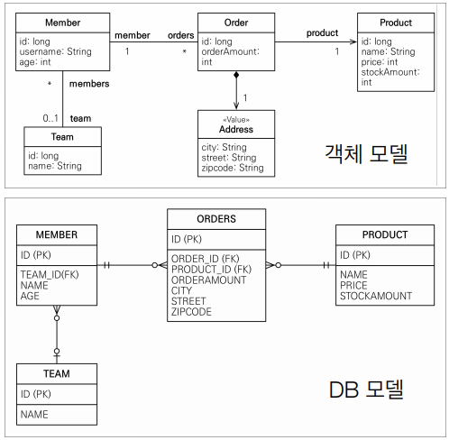
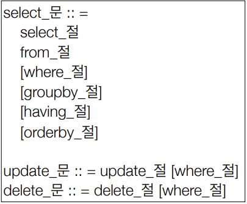
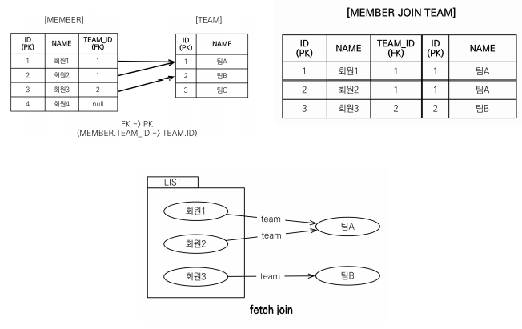
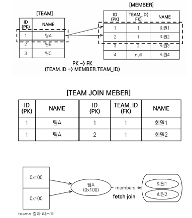
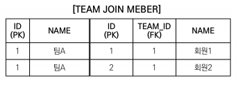
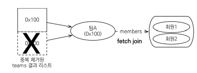
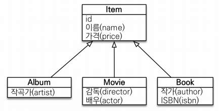

# 객체지향 쿼리 언어(JPQL)
## 목차
- 객체지향 쿼리 언어 소개
- JPQL
- 기본 문법과 기능
- 페치 조인
- 경로 표현식
- 다형성 쿼리
- 엔티티 직접 사용
- Named 쿼리
- 벌크 연산
___
## 객체지향 쿼리 언어 소개
### JPA는 다양한 쿼리 방법을 지원
- `JPQL`
- JPA Criteria
- `QueryDSL`
- Native SQL
- JDBC API 직접 사용, MyBatis, SpringJdbcTemplate 함께 사용
### JPQL 소개
- 가장 단순한 조회 방법
    - EntityManager.find()
    - 객체 그래프 탐색(a.getB().getC())
- `나이가 18살 이상인 회원을 모두 검색하고 싶다면?`
### JPQL
- JPA를 사용하면 엔티티 객체를 중심으로 개발
- 문제는 검색 쿼리
- 검색을 할 때도, `테이블이 아닌 엔티티 객체를 대상으로 검색`
- 모든 DB 데이터를 객체로 변환해서 검색하는 것은 불가능
- 애플리케이션이 필요한 데이터만 DB에서 불러오려면, 결국 검색 조건이 포함된 SQL이 필요
- JPQ는 SQL을 추상화한 JPQL이라는 객체 지향 쿼리 언어 제공
- SQL과 문법 유사, SELECT, FROM, WHERE, GROUP BY, HAVING, JOIN 지원
- JPQL은 엔티티 객체를 대상으로 쿼리
- SQL은 데이터베이스 테이블을 대상으로 쿼리
```java
//검색
String jpql = "select m From Member m where m.name like '%hello%'";
List<Member> result = em.createQuery(jpql, Member.class).getResultList();
```
- 테이블이 아닌 객체를 대상으로 검색하는 객체 지향 쿼리
- SQL을 추상화해서 특정 데이터베이스 SQL에 의존❌
- JPQL을 한마디로 정의하면, 객체 지향 SQL
### JPQL과 실행된 SQL
```java
//검색
String jpql = "select m From Member m where m.age > 18";
List<Member> result = em.createQuery(jpql, Member.class).getResultList();
```
```sql
select
    m.id as id,
    m.age as age,
    m.USERNAME as USERNAME,
    m.TEAM_ID as TEAM_ID
from
    Member m
where
    m.age > 18
```
### Criteria 소개
```java
//Criteria 사용 준비
CriteriaBuilder cb = em.getCriteriaBuilder();
CriteriaQuery<Member> query = cb.createQuery(Member.class);

//루트 클래스 (조회를 시작할 클래스)
Root<Member> m = query.from(Member.class);

//쿼리 생성
CriteriaQuery<Member> cq = query.select(m).where(cb.equal(m.get("username"), "kim"));
List<Member> resultList = em.createQuery(cq).getResultList();
```
- 문자가 아닌, 자바코드로 JPQL을 작성할 수 있음
- JPQL 빌더 역할
- JPA 공식 기능
- `단점: 너무 복잡하고 실용성이 없다.`
- Criteria 대신 `QueryDSL 사용 권장`
### QueryDSL 소개
```java
//JPQL
//select m from Member m where m.age > 18
JPAFactoryQuery query = new JPAQueryFactory(em);
QMember m = QMember.member;

List<Member> list = query.selectFrom(m)
                        .where(m.age.gt(18))
                        .orderBy(m.name.desc())
                        .fetch();
```
- 문자가 아닌, 자바코드로 JPQL을 작성할 수 있음
- JPQL 빌더 역할
- 컴파일 시점에 문법 오류를 찾을 수 있음
- 동적 쿼리 작성이 편리함
- `단순하고 쉬움`
- `실무 사용 권장`

### Native SQL 소개
- JPA가 제공하는 SQL을 직접 사용하는 기능
- JPQL로 해결할 수 없는 특정 데이터베이스에 의존적인 기능
    > ex) 오라클 CONNECT BY, 특정 DB만 사용하는 SQL hint
```java
String sql = "SELECT ID, AGE, TEAM_ID, NAME, FROM MEMBER WHERE NAME = 'kim'";
List<Member> resultList = em.createNativeQuery(sql, Member.class).getResultList();
```
### JDBC 직접 사용, SpringJdbcTemplate 등
- JPA를 사용하면서 JDBC 커넥션을 직접 사용하거나, 스프링 JdbcTemplate, MyBatis 등을 함께 사용 가능
- `단, 영속성 컨텍스트를 적절한 시점에 강제로 플러시 필요`
    > ex) JPA를 우회해서 SQL을 실행하기 직전, 영속성 컨텍스트 수동으로 플러시
___
## JPQL(Java Persistence Query Language)
### JPQL 소개
- JPQL은 객체지향 쿼리 언어다.
    - 따라서 테이블을 대상으로 쿼리하는 것이 아닌, `엔티티 객체를 대상으로 쿼리`한다.
- JPQL은 SQL을 추상화해서 특정 데이터베이스 SQL에 의존하지 않는다.
- JPQL은 결국 SQL로 변환된다.


## JPQL - 기본 문법과 기능
### JPQL 문법

- select m from `Member` as m where `m.age` > 18
- 엔티티와 속성은 대소문자 구분⭕ (Member, age)
- JPQL 키워드는 대소문자 구분❌ (SELECT, FROM, where)
- 엔티티 이름 사용, 테이블 이름이 아님❗
- `별칭은 필수(m)` (as는 생략 가능)
### 집합과 정렬
```sql
select
    COUNT(m),   // 회원 수
    SUM(m.age), // 나이 합
    AVG(m.age), // 평균 나이
    MAX(m.age), // 최대 나이
    MIN(m.age)  // 최소 나이
from Member m
```
- GROUP BY, HAVING
- ORDER BY
### TypeQuery, Query
- TypeQuery: 반환 타입이 명확할 때 사용
- Query: 반환 타입이 명확하지 않을 때 사용
```java
TypedQuery<Member> query = em.createQuery("SELECT m FROM Member m", Member.class);
```
```java
Query query = em.createQuery("SELECT m.username, m.age from Member m");
```
### 결과 조회 API
- query.getResultList(): `결과가 하나 이상일 때`, 리스트 반환
    - 결과가 없으면, 빈 리스트 반환
- query.getSingleResult(): `결과가 정확히 하나`, 단일 객체 반환
    - 결과가 없으면: javax.persistence.NoResultException 반환
    - 결과가 둘 이상: javax.persistence.NonUniqueResultException
### 파라미터 바인딩 - 이름 기준, 위치 기준
```java
em.createQuery("SELECT m FROM Member m where m.username = :username")
            .setParameter("username", "memberA")
            .getSingleResult();
```
```java
em.createQuery("SELECT m FROM Member m where m.username=?1")
            .setParameter(1, "memberA")
            .getSingleResult();
```
- 위치 기준은 웬만해서 사용❌
    - 중간에 하나 삽입하면, 순서가 꼬이게 되어 장애를 유발할 수 있음
- 이름 기준으로만 사용하자.
___
### 프로젝션
- SELECT 절에 조회할 대상을 지정하는 것
- 프로젝션 대상: 엔티티, 임베디드 타입, 스칼라 타입(숫자, 문자 등 기본 데이터 타입)
- DISTINCT로 중복 제거 가능
- <b>엔티티 프로젝션</b>
    - 결과로 나오는 모든 엔티티 객체가 영속성 컨텍스트에 저장된다.
    ```java
    em.createQuery("select m from Member m", Member.class)
        .getResultList();
    ```
    - join query를 명시적으로 표현하는 것이 유지보수 관점에서 좋다
    ```java
    // join query 예측 불가
    List<Team> result = em.createQuery("select m.team From Member m", Team.class)
                        .getResultList();
    // join query 예측 가능
    List<Team> result = em.createQuery("select t From Member m join m.team t", Team.class)
                        .getResultList();
    ```
- <b>임베디드 타입 프로젝션</b>
    ```java
    em.createQuery("select m.address from Member m", Address.class)
        .getResultList();
    ```
- <b>스칼라 타입 프로젝션</b>
    ```java
    em.createQuery("select m.username, m.age from Member m)
        .getResultList();
    ```
### 프로젝션 - 여러 값 조회
- SELECT `m.username`, `m.age` FROM Member m
    1. Query 타입으로 조회
        ```java
        List resultList = em.createQuery("select distinct m.name, m.age from Member m")
                            .getResultList();

        Object o = resultList.get(0);
        Object[] result = (Object[]) o;
        System.out.println("name = " + result[0]);
        System.out.println("age = " + result[1]);
        ```
    2. Object[] 타입으로 조회
        ```java
        List<Object[]> resultList = em.createQuery("select distinct m.name, m.age from Member m")
                                    .getResultList();

        Object[] result = resultList.get(0);
        System.out.println("name = " + result[0]);
        System.out.println("age = " + result[1]);
        ```
    3. new 명령어로 조회
        ```java
        List<MemberDTO> resultList = em.createQuery("select new jpql.MemberDTO(m.name, m.age) from Member m", MemberDTO.class)
                                    .getResultList();

        MemberDTO memberDTO = resultList.get(0);
        System.out.println("name = " + memberDTO.getName());
        System.out.println("age = " + memberDTO.getAge());
        ```
        - 단순 값을 DTO로 바로 조회
            - SELECT `new` jpabook.jpql.UserDTO(m.username, m.age) FROM Member m
        - 패키지 명을 포함한 전체 클래스 명 입력
        - 순서와 타입이 일치하는 생성자 필요
___
### 페이징 API
- JPA는 페이징을 다음 두 API로 추상화
- `setFirstResult`(int startPosition): 조회 시작 위치(0부터 시작)
- `setMaxResults`(int maxREsult): 조회할 데이터 수
### 페이징 API 예시
```java
List<Member> resultList = em.createQuery("select m from Member m order by m.name desc", Member.class)
                    .setFirstResult(1)
                    .setMaxResults(10)
                    .getResultList();
```
### 페이징 API - MySQL 방언
```sql
SELECT  
    M.ID AS ID,
    M.AGE AS AGE,
    M.TEAM_ID AS TEAM_ID,
    M.NAME AS NAME
FROM
    MEMBER M
ORDER BY
    M.NAME DESC LIMIT ?, ?
```
### 페이징 API - Oracle 방언
```sql
SELECT * FROM
    ( SELECT ROW_.*, ROWNUM ROWNUM_
    FROM
        ( SELECT
            M.ID AS ID,
            M.AGE AS AGE,
            M.TEAM_ID AS TEAM_ID,
            M.NAME AS NAME
        FROM MEMBER M
        ORDER BY M.NAME
        ) ROW_
    WHERE ROWNUM <= ?
    )
WHERE ROWNUM_ > ?
```
___
### 조인
- <b>내부 조인</b>
    ```sql
    SELECT m FROM Member m (INNER) JOIN m.team t
    ```
- <b>외부 조인</b>
    ```sql
    SELECT m FROM Member m LEFT (OUTER) JOIN m.team t
    ```
- <b>세타 조인</b>
    ```sql
    SELECT count(m) from Member m, Team t where m.name = t.name
    ```
### 조인 - ON 절
- ON절을 활용한 조인(JPA 2.1부터 지원)
    1. 조인 대상 필터링
    2. 연관관계가 없는 두 엔티티 외부 조인(하이버네이트 5.1부터)
### 1. 조인 대상 필터링
> ex) 회원과 팀을 조인하면서, 팀 이름이 A인 팀만 조인
- <b>JPQL</b>
    ```sql
    SELECT m, t FROM Member m LEFT JOIN m.team ON t.name = 'A'
    ```
- <b>SQL</b>
    ```sql
    SELECT m.*, t.* FROM Member m LEFT JOIN Team t ON m.TEAM_ID=t.id and t.name = 'A'
    ```
### 2. 연관관계가 없는 두 엔티티 외부 조인
> ex) 회원의 이름과 팀의 이름이 같은 대상 외부 조인
- <b>JPQL</b>
    ```sql
    SELECT m, t FROM Member m LEFT JOIN Team t ON m.username = t.name
    ```
- <b>SQL</b>
    ```sql
    SELECT m.*, t.* FROM Member m LEFT JOIN Team t ON m.username = t.name
    ```
___
### 서브 쿼리
- 나이가 평균보다 많은 회원
    ```sql
    select m from Member m
    where m.age > (select avg(m2.age)) from Member m2)
    ```
- 한 건이라도 주문한 고객
    ```sql
    select m from Member m
    where (select count(o) from Order o where m = o.member) > 0
    ```
### 서브 쿼리 지원 함수
- <b>[NOT] EXISTS (subquery)</b>: 서브 쿼리에 결과가 존재하면 참
    - {ALL | ANY | SOME} (subquery)
    - <b>ALL</b>: 모두 만족하면 참
    - <B>ANY, SOME</B>: 조건을 하나라도 만족하면 참
- <b>[NOT] IN (subquery)</b>: 서브쿼리의 결과 중, 하나라도 조건이 만족하면 참
### 서브 쿼리 - 예제
- 팀A 소속인 회원
    ```sql
    select m from Member m
    where exists(select t from m.team t where t.name = '팀A')
    ```
- 전체 상품 각각의 재고보다 주문량이 많은 주문들
    ```sql
    select o from Order o
    where o.orderAmount > ALL(select p.stockAmount from Product p)
    ```
- 어떤 팀이든 팀에 소속된 회원
    ```sql
    select m from Member m
    where m.team = ANY(select t from Team t)
    ```
### JPA 서브 쿼리 - 한계
- JPA는 WHERE, HAVING 절에서만 서브 쿼리 사용 가능
- SELECT 절도 가능 (하이버네이트에서 지원)
- `FROM 절의 서브 쿼리는 현재 JPQL에서 불가능`
    - 조인으로 풀 수 있으면 풀어서 해결
___
### JPQL 타입 표현
- 문자: 'HELLO', 'She"s'
- 숫자: 10L(Long), 10D(Double), 10F(Float)
- Boolean: TRUE, FALSE
- ENUM: jpabook.MemberType.Admin (`패키지명 포함`)
- 엔티티 타입: TYPE(m) = Member (상속 관계에서 사용)
    ```sql
    select i from Item i where type(i) = Book
    ```
### JPQL 기타
- SQL과 문법이 같은 식
- EXISTS, IN
- AND, OR, NOT
- =, >, >=, <, <=, <>
- BETWEEN, LIKE, `IS NULL`
___
### 조건식 - CASE 식
- <b>기본 CASE 식</b>
    ```sql
    select
        case when m.age <= 10 then '학생요금'
             when m.age >= 60 then '경로요금'
             else '일반요금'
        end
    from Member m
    ```
- <b>단순 CASE 식</b>
    ```sql
    select
        case t.name
            when '팀A' then '인센티브110%'
            when '팀B' then '인센티브120%'
            else '인센티브105%'
        end
    from Team t
    ```
- QueryDSL을 이용하면 위의 CASE식을 간단하게 만들 수 있다.<br><br>
- <B>COALESCE</B>: 하나씩 조회해서, null이 아니면 반환
    ```sql
    사용자 이름이 없으면, '이름 없는 회원'을 반환
    select COALESCE(m.username, '이름 없는 회원') from Member m
    ```
- <b>NULLIF</b>: 두 값이 같으면 null 반환, 다르면 첫 번째 값 반환
    ```sql
    사용자 이름이 '관리자'면, null을 반환하고, 나머지는 본인의 이름을 반환
    select NULLIF(m.username, '관리자') from Member m
    ```
___
### JPQL 기본 함수
- CONCAT
    ```sql
    select CONCAT('a', 'b') from Member m

    하이버네이트 구현체가 아래 문법도 제공한다.
    select 'a' || 'b' from Member m

    result : "ab"
    ```
- SUBSTRING
    ```sql
    select SUBSTRING(m.username, 2, 3) from Member m
    ```
- TRIM
    - 공백 제거
- LOWER, UPPER
- LENGTH
    - 문자의 길이
- LOCATE
    ```sql
    select LOCATE('de', 'abcdefg') from Member m

    "de"의 위치 반환
    result : 4
    ```
- ABS, SQRT, MOD
- SIZE, INDEX(JPA 용도)
    ```sql
    컬렉션(members)의 size 반환
    select SIZE(t.members) from Team t
    ```
    ```sql
    @OrderColumn(사용 비추)을 사용하는 경우 컬렉션의 인덱스를 구할 수 있음
    select INDEX(t.members) from Team t
    ```
### 사용자 정의 함수 호출
- 하이버네이트는 사용 전, 방언에 추가해야 한다.
    - 사용하는 db 방언을 상속받고, 사용자 정의 함수를 등록한다.
    ```java
    // 라이브러리를 참고해서 등록하자
    public class MyH2Dialect extends H2Dialect {
        public MyH2Dialect() {
            registerFunction("group_concat", new StandardSQLFunction("group_concat", StandardBasicTypes.STRING));
        }
    }
    ```
    ```properties
    ...
    <properties>
        ...

        <!--<property name="hibernate.dialect" value="org.hibernate.dialect.H2Dialect"/>-->
        <property name="hibernate.dialect" value="org.hibernate.dialect.MyH2Dialect"/>

        ...
    </properties>
    ...
    ```
    ```sql
    select function('group_concat', m.username) from Member m
    
    하이버네이트는 아래의 문법도 지원한다.
    select group_concat(m.username) from Member m
    
    회원의 username들을 쭉 이어진 결과를 반환한다
    result: 관리자1,관리자2,관리자3
    ```
    - DB 방언에 대부분의 함수들이 구현되어 있으므로, 원하는 함수를 등록해서 위처럼 사용하자.
    - How to call custom database functions with JPA and Hibernate
        - https://thorben-janssen.com/database-functions/
___
## JPQL - 경로 표현식
### 경로 표현식
- .(점)을 찍어 개체 그래프를 탐색하는 것
    ```sql
    select m.username -> 상태 필드
    from Member m
        join m.team t -> 단일 값 연관 필드
        join m.orders o -> 컬렉션 값 연관 필드
    where t.name = '팀A'
    ```
### 경로 표현식 용어 정리
- `상태 필드`(state field): 단순히 값을 저장하기 위한 필드
    > ex) m.username
- `연관 필드`(association field): 연관관계를 위한 필드
    - `단일 값 연관 필드`
        - @ManyToOne, @OneToOne, 대상이 엔티티
            > ex) m.team
    - `컬렉션 값 연관 필드`
        - @OneToMany, @ManyToMany, 대상이 컬렉션
            > ex) m.orders
### 경로 표현식 특징
- `상태 필드`(state field): 경로 탐색의 끝, 탐색❌
    ```sql
    select m.name from Member m
    ```
- `단일 값 연관 경로`: 묵시적 내부 조인(inner join) 발생, 탐색⭕
    - 묵시적 내부 조인을 최대한 사용하지 않는 것이 직관적이다.
    - 가능한 SQL과 비슷하게 작성해야 튜닝하기 좋다.
    - 묵시적 내부 조인이 연쇄적으로 일어나면 성능이 매우 저하될 수 있다.
    ```sql
    (JPQL) select o.member from Order o
    ```
    ```sql
    select
        m.*
    from
        Orders o
    inner join Member m on o.member_id = m.id
    ```
- `컬렉션 값 연관 경로`: 묵시적 내부 조인 발생, 탐색❌
    ```sql
    (JPQL) select t.members from Team t
    ```
    ```sql
    select
        t.members
    from
        Team t
            members1_.id
            members1_.age
            members1_.TEAM_ID
            members1_.type
            members1_.username
        from
            Team team0_
        inner join
            Member members1_
                on team0_.id=members1_.TEAM_ID
    ```
    - FROM 절에서 명시적 조인을 통해 별칭을 얻으면, 별칭을 통해 탐색 가능
        ```sql
        (JPQL) select m from Team t join t.members m
        ```
### 명시적 조인, 묵시적 조인
- <b>명시적 조인</b>
    - join 키워드 직접 사용
    ```sql
    select m from Member m join m.team t
    ```
- <b>묵시적 조인</b>
    - 경로 표현식에 의해 묵시적으로 SQL 조인 발생(내부 조인만 가능)
    ```sql
    select m.team from Member m
    ```
### 경로 표현식 - 예제
```sql
select o.member.team
from Order o
-> 성공
```
- 위 코드 명시적 조인 방법
    ```sql
    select t
    from Order o
    join o.member m
    join m.team t
    ```
```sql
select t.members
from Team t
-> 성공
```
```sql
select t.members.username
from Team t
-> 실패
```
```sql
select m.username
from Team t
join t.members m
-> 성공
```
### 경로 탐색을 사용한 묵시적 조인 시, 주의사항
- 항상 내부 조인
- 컬렉션은 경로 탐색의 끝 -> 명시적 조인을 통해 별칭을 얻어야 함
- 경로 탐색은 주로 SELECT, WHERE 절에서 사용하지만, 묵시적 조인으로 인해 SQL의 FROM (JOIN) 절에 영향을 준다
### 실무 조언
- `가급적 묵시적 조인 대신, 명시적 조인 사용`
- 조인은 SQL 튜닝에 중요 포인트❗
- 묵시적 조인은 조인이 일어나는 상황을 한 눈에 파악하기 어려움
___
## JPQL - 페치 조인(fetch join)
<b>실무에서 정말정말 중요함❗</b>

### 페치 조인(fetch join)
- SQL 조인 종류❌
- JPQL에서 `성능 최적화`를 위해 제공하는 기능
- 연관된 엔티티나 컬렉션을 `SQL 한 번에 함께 조회`하는 기능
- join fetch 명령어 사용
- 페치 조인 ::= [LEFT [OUTER] | INNER] JOIN FETCH 조인 경로
### 엔티티 페치 조인
- 회원을 조회하면서, 연관된 팀도 함께 조회(SQL 한 번에)
- SQL을 보면, 회원 뿐만 아니라 `팀(T.*)`도 함께 `SELECT`
- `[JPQL]`
    ```sql
    select m from Member m join fetch m.team
    ```
- `[SQL]`
    ```sql
    select m.*, t.*
    from Member m
    inner join team t
    on m.team_id = t.id
    ```

### 페치 조인 사용 코드
```java
//String jpql = "SELECT m FROM Member m";
String jpql = "SELECT m FROM Member m JOIN FETCH m.team";
List<Member> members = em.createQuery(jpql, Member.class).getResultList();

for (Member member : members) {
    System.out.println("username = " + member.getUsername() + ", " +
                        "teamName = " + member.getTeam().getName());
}
// 페치 조인을 사용하지 않으면, 반복문마다 계속 SELECT 쿼리를 실행하는 최악의 결과 발생
```
```
username = 회원1, teamName = 팀A
username = 회원2, teamName = 팀A
username = 회원3, teamName = 팀B
```
### 컬렉션 페치 조인
- 일대다 관계, 컬렉션 페치 조인 -> 데이터 뻥튀기❗
    > 참고: 다대일 관계는 문제 없음
- `[JPQL]`
    ```sql
    select t
    from Team t
    join fetch t.members
    where t.name = '팀A'
    ```
- `[SQL]`
    ```sql
    select t.*, m.*
    from Team t
    inner join Member m on t.id = m.team_id
    where t.name = '팀A'
    ```
    
### 컬렉션 페치 조인 사용 코드
```java
String jpql = "select t from Team t join fetch t.members where t.name = '팀A'";
List<Team> teams = em.createQuery(jpql, Team.class).getResultList();

for (Team team : teams) {
    System.out.println("teamname = " + team.getName() + ", team = " + team); 
    for (Member member : team.getMembers()) { 
        //페치 조인으로 팀과 회원을 함께 조회해서 지연 로딩 발생 안함
        System.out.println("-> username = " + member.getUsername()+ ", member = " + member); 
    } 
}
```
```
teamname = 팀A, team = Team@0x100 
-> username = 회원1, member = Member@0x200 
-> username = 회원2, member = Member@0x300 
teamname = 팀A, team = Team@0x100 
-> username = 회원1, member = Member@0x200 
-> username = 회원2, member = Member@0x300 
```
### 페치 조인과 DISTINCT
- SQL의 DISTINCT는 중복된 결과를 제거하는 명령
- JPQL의 DISTINCT 2가지 기능 제공
    1. SQL에 DISTINCT를 추가
    2. 애플리케이션에서 엔티티 중복 제거
```sql
select distinct t
from Team t join fetch t.members
where t.name = '팀A'
```
- SQL에 DISTINCT를 추가하지만, 데이터가 다르므로 SQL 결과에서 중복 제거 실패<BR>
    
- DISTINCT가 추가로 애플리케이션에서 중복 제거 시도
- 같은 식별자를 가진 `Team 엔티티 제거`<br>
    
```
[DISTINCT 추가시 결과] 
teamname = 팀A, team = Team@0x100 
-> username = 회원1, member = Member@0x200 
-> username = 회원2, member = Member@0x300
```
### 페치 조인과 일반 조인의 차이
- 일반 조인 실행 시, 연관된 엔티티를 함께 조회하지 않음
- `[JPQL]`
    ```sql
    select t
    from Team t join t.members m
    where t.name = '팀A'
    ```
- `[SQL]`
    ```sql
    select t.*
    from Team t
    inner join Member m on t.id = m.team_id
    where t.name = '팀A'
    ```
- JPQL은 결과를 반환할 때, 연관관계 고려❌
    - 단지 SELECT 절에 지정한 엔티티만 조회할 뿐
- 여기서는 팀 엔티티만 조회하고, 회원 엔티티는 조회❌
- 페치 조인을 사용할 때만, 연관된 엔티티도 함께 `조회(즉시 로딩)`
- `페치 조인은 객체 그래프를 SQL 한 번에 조회하는 개념`
### 페치 조인 실행 예시
- 페치 조인은 연관된 엔티티를 함께 조회함
- `[JPQL]`
    ```sql
    select t
    from Team t
    join fetch t.members
    where t.name = '팀A'
    ```
- `[SQL]`
    ```sql
    select t.*, m.*
    from Team t
    inner join member m on t.id = m.team_id
    where t.name = '팀A'
    ```
### 페치 조인의 특징과 한계
- `페치 조인 대상에는 별칭을 줄 수 없다.`
    - 여러 개를 페치 조인할 때는 사용 함
    - 하이버네이트는 가능, 가급적 사용❌
- `둘 이상의 컬렉션은 페치 조인 할 수 없다.`
    - 1 x N x N x ...개의 엄청 많은 결과 발생
- `컬렉션을 페치 조인하면, 페이징 API(setFirstResult, setMaxResults)를 사용할 수 없다.`
    - 일대일, 다대일 같은 단일 값 연관 필드들은 페치 조인해도 페이징 가능
    - 하이버네이트는 경고 로그를 남기고, 메모리에서 페이징(매우 위험❗)
    - @BatchSize()를 이용하여 해결할 수 있다.
        - where in을 해서 한 번에 가져오는 방식
        - 실무에서는 주로 다음과 같이 글로벌 설정을 이용한다.
        ```properties
        <property name="hibernate.default_batch_fetch_size" value="100">
        ```
        - 쿼리를 N+1이 아닌, 딱 테이블 수만큼 실행할 수 있다.
- 연관된 엔티티들을 SQL 한 번으로 조회 - 성능 최적화
- 엔티티에 직접 적용하는 글로벌 로딩 전략보다 우선함
    - @OneToMany(fetch = FetchType.LAZY) //글로벌 로딩 전략
- 실무에서 글로벌 로딩 전략은 모두 지연 로딩
- 최적화가 필요한 곳은 페치 조인 적용
### 페치 조인 - 정리
- 모든 것을 페치 조인으로 해결할 수는 없음
- 페치 조인은 객체 그래프를 유지할 때, 사용하면 효과적
- `여러 테이블을 조인해서 엔티티가 가진 모양이 아닌 전혀 다른 결과를 내야 할 때`
    1. 엔티티를 페치 조인으로 조회하고 그대로 사용
    2. 페치 조인을 한 결과를 애플리케이션에서 DTO로 변환해서 반환
    3. JPQL에서 new operation으로 DTO로 변환
___
## JPQL - 다형성 쿼리

### TYPE
- 조회 대상을 특정 자식으로 한정
    > ex) 싱글 테이블 전략에서 Item 중 Book, Movie를 조회
- `[JPQL]`
    ```sql
    select i
    from Item i
    where type(i) IN (Book, Movie)
- `[SQL]`
    ```sql
    select i
    from Item i
    where i.DTYPE in ('B', 'M')
    ```
### TREAT(JPA 2.1)
- 자바의 타입 캐스팅과 유사
- 상속 구조에서 부모 타입을 특정 자식 타입으로 다룰 떄 사용
- FROM, WHERE, SELECT(하이버네이트 지원) 사용
> ex) 싱글 테이블 전략에서 부모인 Item과 자식 Book이 있는 경우
- `[JPQL]`
    ```sql
    select i
    from Item i
    where treat(i as Book).author = 'kim'
- `[SQL]`
    ```sql
    select i
    from Item i
    where i.DTYPE = 'B' and i.author = 'kim'
    ```
___
## JPQL - 엔티티 직접 사용
### 엔티티 직접 사용 - 기본 키 값
- JPQL에서 엔티티를 직접 사용하면, SQL에서 해당 엔티티의 기본 키 값을 사용
- `[JPQL]`
    ```sql
    select count(m.id) from Member m //엔티티의 아이디를 사용
    select count(m) from Member m //엔티티를 직접 사용
- `[SQL]`
    ```sql
    select count(m.id) as cnt from Member m
    ```
- 엔티티를 파라미터로 전달
    ```java
    String jpql = “select m from Member m where m = :member”; 
    List resultList = em.createQuery(jpql) 
        .setParameter("member", member) 
        .getResultList(); 
    ```
- 식별자를 직접 전달
    ```java
    String jpql = “select m from Member m where m.id = :memberId”; 
    List resultList = em.createQuery(jpql) 
        .setParameter("memberId", memberId) 
        .getResultList(); 
    ```
- 실행된 SQL
    ```sql
    select m.* from Member m where m.id=?
    ```
### 엔티티 직접 사용 - 외래 키 값
```java
Team team = em.find(Team.class, 1L); 

String qlString = “select m from Member m where m.team = :team”; 
List resultList = em.createQuery(qlString) 
    .setParameter("team", team) 
    .getResultList();
```
```java
String qlString = “select m from Member m where m.team.id = :teamId”; 
List resultList = em.createQuery(qlString) 
    .setParameter("teamId", teamId) 
    .getResultList();
```
- 실행된 SQL
    ```sql
    select m.* from Member m where m.team_id=?
    ```
___
## JPQL - Named 쿼리
### Named 쿼리 - 정적 쿼리
- 미리 정의해서 이름을 부여해두고 사용하는 JPQL
- 정적 쿼리
- 어노테이션, XML에 정의
- 애플리케이션 로딩 시점에 초기화 후 재사용 (캐시에 저장)
- `애플리케이션 로딩 시점에 쿼리를 검증`
### Named 쿼리 - 어노테이션
```java
@Entity
@NamedQuery(
    name = "Member.findByUsername",
    query= "select m from Member m where m.username = :username")
public class Member {
 ...
}
```
```java
List<Member> resultList = 
 em.createNamedQuery("Member.findByUsername", Member.class)
    .setParameter("username", "회원1")
    .getResultList();
```
### Named 쿼리 - XML에 정의
- META-INF/persistence.xml
    ```xml
    <persistence-unit name="jpabook" >
        <mapping-file>META-INF/ormMember.xml</mapping-file>
    ```
- META-INF/ormMember.xml
    ```xml
    <?xml version="1.0" encoding="UTF-8"?>
    <entity-mappings xmlns="http://xmlns.jcp.org/xml/ns/persistence/orm" version="2.1">

        <named-query name="Member.findByUsername">
            <query><![CDATA[
                select m
                from Member m
                where m.username = :username
            ]]></query>
        </named-query>

        <named-query name="Member.count">
            <query>select count(m) from Member m</query>
        </named-query>

    </entity-mappings>
    ```
### Named 쿼리 환경에 따른 설정
- XML이 항상 우선권을 가진다.
- 애플리케이션 운영 환경에 따라 다른 XML을 배포할 수 있다.
___
## JPQL - 벌크 연산
### 벌크 연산
- 재고가 10개 미만인 모든 상품의 가격을 10% 상승하려면?
- JPA 변경 감지 기능으로 실행하려면, 너무 많은 SQL 실행
    1. 재고가 10개 미만인 상품을 리스트로 조회
    2. 상품 엔티티의 가격을 10% 증가
    3. 트랜잭션 커밋 시점에 변경감지 동작
- 변경된 데이터가 100건이라면, 100번의 UPDATE SQL 실행
### 벌크 연산 예제
- 쿼리 한 번으로 여러 테이블의 row를 변경(엔티티)
- `executeUpdate()는 영향 받은 엔티티 수를 반환`
- `UPDATE, DELETE 지원`
- `INSERT(insert into .. select, 하이버네이트 지원)`
```java
String qlString = "update Product p " +
                "set p.price = p.price * 1.1 " + 
                "where p.stockAmount < :stockAmount"; 

// flush 자동 호출
int resultCount = em.createQuery(qlString) 
            .setParameter("stockAmount", 10) 
            .executeUpdate(); 
```
### 벌크 연산 주의
- 벌크 연산은 영속성 컨텍스트를 무시하고 데이터베이스에 직접 쿼리한다.
- 해결책
    1. 벌크 연산을 먼저 실행
    2. `벌크 연산 수행 후, 영속성 컨텍스트 초기화`
        ```java
        int resultCount = em.createQuery(qlString) 
                .setParameter("stockAmount", 10) 
                .executeUpdate(); 

        em.clear();⭐

        Member findMember = em.find(Member.class, member1.getId());
        System.out.println("age = " + findMember.getAge());
        ```