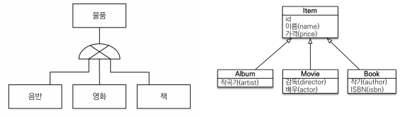
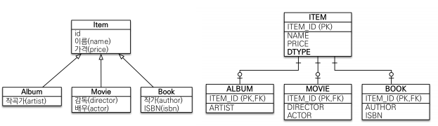
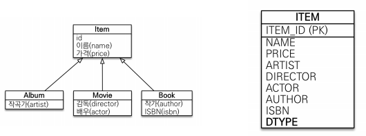
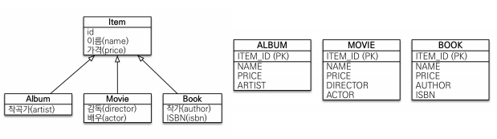
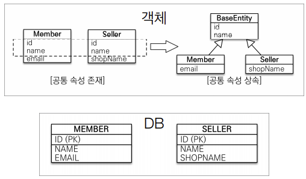
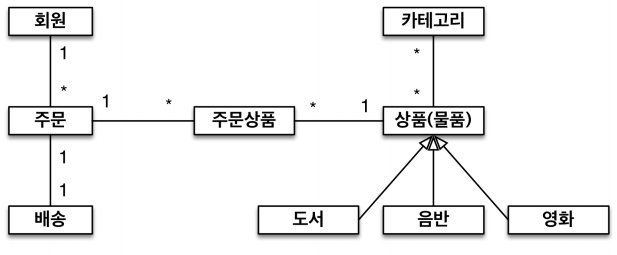
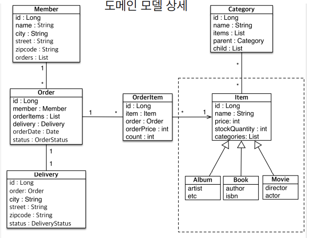
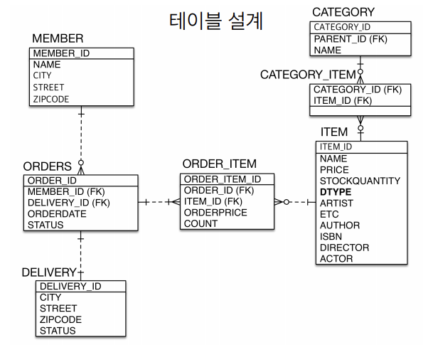
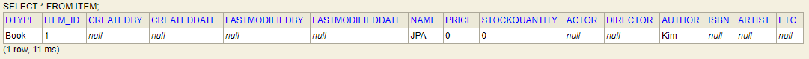

# 고급 매핑
## 목차
- 상속관계 매핑
- @MappedSuperclass
- 실전 예제 - 4. 상속관계 매핑
___
## 상속관계 매핑
- 관계형 데이터베이스는 상속 관계❌
- 대신, 객체 상속과 유사한 `슈퍼타입-서브타입 관계라는 모델링 기법`이 존재
- 상속관계 매핑
    - 객체의 상속 구조와 DB의 슈퍼타입-서브타입 관게를 매핑


- 슈퍼타입-서브타입 논리 모델을 실제 물리 모델로 구현하는 방법
    - 각각 테이블로 변환 -> `조인 전략`
    - 통합 테이블로 변환 -> `단일 테이블 전략`
    - 서브타입 테이블로 변환 -> `구현 클래스마다 테이블 전략`
### 주요 어노테이션
- <b>@Inheritance(strategy = InheritanceType.XXX)</b>
    - `JOINED`: 조인 전략
    - `SINGLE_TABLE`: 단일 테이블 전략(default)
        - 어노테이션 생략하면 default로 적용
    - `TABLE_PER_CLASS`: 구현 클래스마다 테이블 전략
- <b>@DiscriminatorColumn(name = "DTYPE")</b>
    - 기본값: name = "DTYPE"
    - 어노테이션 생략하면 default로 적용
    - <b>DTYPE을 읽기 전용 필드로 받는 방법</b>
        ```java
        @Column(insertable=false, updatable=false)
        private String dtype;
        ```
- <b>@DiscriminatorValue("XXX")</b>
    - 기본값: 엔티티 이름
### 조인 전략

- <b>장점</b>
    - 테이블 정규화
    - 외래 키 참조 무결성 제약조건 활용 가능
    - 저장공간 효율화
- <b>단점</b>
    - 조회 시, 조인을 많이 사용하므로 성능 저하 우려
        - 네트워크 성능이 발달하여, 성능 저하가 생각보다 크지 않음.
        - 성능 테스트를 해보자.
    - 조회 쿼리가 복잡함
    - 데이터 저장 시, INSERT SQL 2번 호출
### 단일 테이블 전략

- 부모 엔티티 - `@DiscriminatorColumn`, 자식 엔티티 - `@DiscriminatorValue` 필수
- <b>장점</b>
    - 조인이 필요 없으므로, 일반적으로 조회 성능이 빠름
    - 조회 쿼리가 단순함
- <b>단점</b>
    - 자식 엔티티가 매핑한 컬럼은 모두 null 허용
    - 단일 테이블에 모든 것을 저장하므로 테이블의 크기가 방대해질 수 있음
        - 상황에 따라 조회 성능이 오히려 느려질 수 있음
        - 성능 테스트를 해보자.
### 구현 클래스마다 테이블 전략

- <b>이 전략은 데이터베이스 설계자와 ORM 전문가 둘 다 추천❌</b>
- <b>장점</b>
    - 서브 타입을 명확하게 구분해서 처리할 떄 효과적
    - not null 제약조건 사용 가능
- <b>단점</b>
    - 여러 자식 테이블을 함께 조회할 때, 성능이 느림
        - UNION SQL 필요
    - 자식 테이블을 통합해서 쿼리하기 어려움
___
## @MappedSuperclass
- 공통 매핑 정보가 필요할 때 사용<br>

- 상속관계 매핑❌
- 엔티티❌, 테이블과 매핑❌
- 부모 클래스를 상속 받는 `자식 클래스에 매핑 정보만 제공`
- 조회, 검색 불가(`em.find(BaseEntity) 불가`)
- 직접 생성해서 사용할 일이 없으므로, `추상 클래스 권장`
- <b>정리</b>
    - 테이블과 관계가 없고, 단순히 엔티티가 공통으로 사용하는 매핑 정보를 모으는 역할
    - 주로 등록일, 수정일, 등록자, 수정자와 같은 전체 엔티티에서 공통으로 적용하는 정보를 모을 때 사용
    > <b>참고</b>
    > - @Entity 클래스는 `엔티티`나 `@MappedSuperclass로 지정한 클래스`만 상속 가능
___
## 실전 예제 = 4. 상속관계 매핑
### 요구사항 추가
- 상품의 종류는 음반, 도서, 영화가 있고, 이후 더 확장될 수 있다.
- 모든 데이터는 등록일과 수정일이 필수다.
### 도메인 모델

### 도메인 모델 상세

### 테이블 설계

### 코드 추가
```java
@Getter
@Setter
@MappedSuperclass
public abstract class BaseEntity {
    private String createdBy;
    private String lastModifiedBy;
    private LocalDateTime createdDate;
    private LocalDateTime lastModifiedDate;
}
```
```java
@Entity
@Getter
@Setter
@Inheritance(strategy = InheritanceType.SINGLE_TABLE)
@DiscriminatorColumn
public abstract class Item extends BaseEntity{

    @Id
    @GeneratedValue
    @Column(name = "ITEM_ID")
    private Long id;

    private String name;

    private int price;

    private int stockQuantity;

    @ManyToMany(mappedBy = "items")
    private List<Category> categories = new ArrayList<>();
}
```
```java
@Entity
public class Album extends Item{

    private String artist;
    private String etc;
}
```
```java
@Entity
@Getter
@Setter
public class Book extends Item {

    private String author;
    private String isbn;
}
```
```java
@Entity
public class Movie extends Item {

    private String director;
    private String actor;
}
```
- 이외 나머지 엔티티에 BaseEntity 상속 추가
- @ManyToMany로 조인한 테이블인 `CATEGORY_ITEM`에는 BaseEntity의 필드가 추가되지 않는다.
    - 실무에서는 @ManyToMany 사용❌

### DB에 Book 추가 테스트
```java
public class JpaMain {
    public static void main(String[] args) {
        EntityManagerFactory emf = Persistence.createEntityManagerFactory("hello");
        EntityManager em = emf.createEntityManager();
        EntityTransaction tx = em.getTransaction();

        tx.begin();

        try {
            Book book = new Book();
            book.setName("JPA");
            book.setAuthor("Kim");
            em.persist(book);

            tx.commit();
        } catch (Exception e) {
            tx.rollback();
        } finally {
            em.close();
        }

        emf.close();
    }
}
```
