# 다양한 연관관계 매핑
- <b>연관관계 매핑 시, 고려사항 3가지</b>
    - 다중성
    - 단방향, 양방향
    - 연관관계의 주인
- <b>다중성</b>
    - 다대일: @ManyToOne
    - 일대다: @OneToMany
    - 일대일: @OneToOne
    - 다대다: @ManyToMany
- <b>단방향, 양방향</b>
    - <b>테이블</b>
        - 외래 키 하나로 양쪽 조인 가능
        - 사실, 방향이라는 개념이 없음
    - <b>객체</b>
        - 참조용 필드가 있는 쪽으로만 참조 가능
        - 한 쪽만 참조하면, 단방향
        - 양 쪽이 서로 참조하면, 양방향
- <b>연관관계의 주인</b>
    - 테이블은 `외래 키 하나`로 두 테이블이 연관관계를 맺음
    - 객체 양방향 관계는 A->B, B->A 처럼 `참조가 2군데`
    - 객체 양방향 관계는 참조가 2군데 있다.
        - 둘 중 테이블의 외래 키를 관리할 곳을 지정해야 함
    - 연관관계의 주인: `외래 키를 관리하는 참조`
    - 주인의 반대편: 외래 키에 영향을 주지 않으며, 단순 조회만 가능
> <b>참고</b>
> - 참고로, @JoinColumn의 속성 중 `referencedColumnName`이 생략되어 있다.
>   - 이는 기본값으로 `대상 테이블의 PK`로 자동 지정하게 되어 있다.
>   - 대상 테이블은 @JoinColumn이 적용되는 `필드 타입`을 보고 판단한다.
> - `name` 속성에는 @ManyToOne, @OneToMany, @OneToOne 모두 `상대 One의 PK`를 넣어야 한다.
>   - `FK`는 항상 `Many`에 존재하거나, OneToOne에서는 `주 테이블`에 존재하기 때문이다.
## 목차
- 다대일 [N:1]
- 일대다 [1:N]
- 일대일 [1:1]
- 다대다 [N:M]
- 실전 예제 3 - 다양한 연관관계 매핑
___
## 다대일 [N:1]
- 항상 `다(N)에 외래 키(FK)`가 존재해야 한다.
- `다(N) 쪽이 연관관계의 주인`이다.
### 다대일 단방향
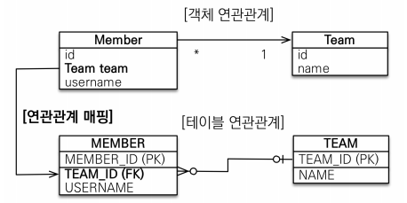
- 가장 많이 사용하는 연관관계
- `다대일`의 반대는 `일대다`
```java
@Entity
public class Member {
    @Id
    @GeneratedValue
    @Column(name = "MEMBER_ID")
    private Long id;    

    private String name;  

    @ManyToOne⭐
    @JoinColumn(name = "TEAM_ID")
    private Team team;
}
```
```java
@Entity
public class Team {
    @Id
    @GeneratedValue
    @Column(name = "TEAM_ID")
    private Long id;

    private String name;    
}
```
```java
...
Team team = new Team();
team.setName("teamA");
em.persist(team);

Member member = new Member();
member.setName("memberA");
member.setTeam(team);
em.persist(member);
...
```
### 다대일 양방향
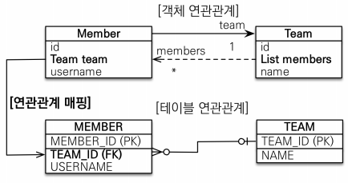
- 양 쪽을 서로 참조하도록 개발
```java
@Entity
public class Member {
    @Id
    @GeneratedValue
    @Column(name = "MEMBER_ID")
    private Long id;    

    private String name;  

    @ManyToOne
    @JoinColumn(name = "TEAM_ID")
    private Team team;

    //==연관관계 편의 메소드==//
    public void changeTeam(Team team) {
        this.team = team;
        team.getMembers().add(this);
    }
}
```
```java
@Entity
public class Team {
    @Id
    @GeneratedValue
    @Column(name = "TEAM_ID")
    private Long id;

    private String name;    

    @OneToMany(mappedBy = "team")⭐
    private List<Member> members = new ArrayList<>();
}
```
```java
...

Team team = new Team();
team.setName("teamA");
em.persist(team);

Member member = new Member();
member.setName("memberA");
member.changeTeam(team); // 연관관계 편의 메소드 사용
em.persist(member);
...
```
___
## 일대다 [1:N]
- 항상 `다(N)에 외래 키(FK)`가 존재해야 한다.
- `일(1) 쪽이 연관관계의 주인`이다.
### 일대다 단방향
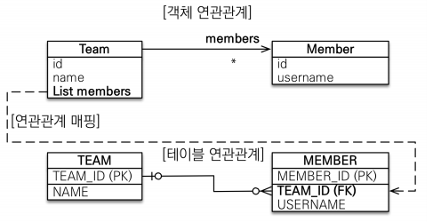
- 객체와 테이블의 차이 때문에, 반대편 테이블의 외래 키를 관리하는 특이한 구조
- @JoinColumn을 꼭 사용해야 한다.
    - 그렇지 않으면, 조인 테이블 방식을 사용한다.(중간에 테이블을 하나 추가)
- <b>단점</b>
    - 엔티티가 관리하는 외래 키가 다른 테이블에 있음
    - 연관관계 관리를 위해 `추가적인 UPDATE SQL 실행`
        > ex) Member 테이블에 회원 정보 INSERT -> 방금 삽입한 회원의 TEAM_ID 외래 키 UPDATE
- 일대다 단방향 매핑보다는 `다대일 양방향 매핑`을 사용하자.
    - `다(N)` 쪽에서 `외래 키를 관리`하되, 어색하지 않게 `일(1)` 쪽에 `연관관계 편의 메소드`를 추가하여 사용하자.
        ```java
        // 팀에서 회원을 추가하는 것이 자연스러운 경우
        // Team.class
        public void addMember(Member member){
            members.add(member);
            member.setTeam(this);
        }
        ```
    - `객체지향적인 부분의 손해(다대일 양방향)`와 `추가적인 UPDATE 쿼리 발생(일대다 단방향)`의 Tradeoff 이므로, 적절하게 판단하여 사용하자.
```java
@Entity
public class Member {
    @Id
    @GeneratedValue
    @Column(name = "MEMBER_ID")
    private Long id;    

    private String name;  
}
```
```java
@Entity
public class Team {
    @Id
    @GeneratedValue
    @Column(name = "TEAM_ID")
    private Long id;

    private String name;    

    @OneToMany
    @JoinColumn(name = "TEAM_ID")⭐
    private List<Member> members = new ArrayList<>();
    
}
```
```java
...
Member member = new Member();
member.setName("memberA");
em.persist(member);

Team team = new Team();
team.setName("teamA");
/*
    Team 테이블에는 데이터가 추가되지 않는다.
    외래 키가 Member 테이블에 있기 때문에, Member 테이블을 UPDATE 하게 된다.
*/
team.getMembers().add(member); 
em.persist(team);
...
```
### 일대다 양방향
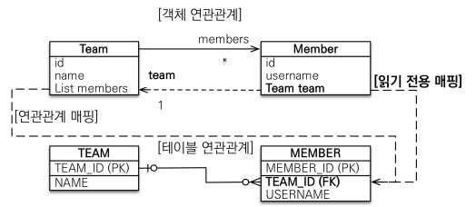
- 이런 매핑은 공식적으로 존재❌
- @JoinColumn(`insertable=false, updatable=false`)
- `읽기 전용 필드`를 사용해서 양방향처럼 사용하는 야매방법(DB에 저장 안 됨)
- `다대일 양방향`을 사용하자.
```java
@Entity
public class Member {
    @Id
    @GeneratedValue
    @Column(name = "MEMBER_ID")
    private Long id;    

    private String name;  

    @ManyToOne
    @JoinColumn(name = "TEAM_ID", insertable = false, updatable = false)⭐
    private Team team;
}
```
```java
@Entity
public class Team {
    @Id
    @GeneratedValue
    @Column(name = "TEAM_ID")
    private Long id;

    private String name;    

    @OneToMany
    @JoinColumn(name = "TEAM_ID")
    private List<Member> members = new ArrayList<>();

    //==연관관계 편의 메소드==//
    public void addMember(Member member) {
        members.add(member);
        member.setTeam(this);
    }
}
```
```java
...
Member member = new Member();
member.setName("memberA");
em.persist(member);

Team team = new Team();
team.setName("teamA");
team.addMember(member); // 연관관계 편의 메소드 사용
em.persist(team);
...
```
___
## 일대일 [1:1]
- `일대일` 관계는 그 반대도 `일대일`
- 주 테이블이나 대상 테이블 중 외래 키 선택 가능
    - 주 테이블에 외래 키
    - 대상 테이블에 외래 키
- 외래 키에 데이터베이스 유니크(UNI) 제약조건 추가
### 일대일: 주 테이블에 외래 키 단방향
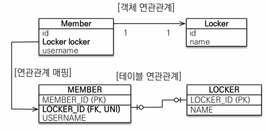
- 다대일(@ManyToOne) 단방향 매핑과 유사
```java
@Entity
public class Member {
    @Id
    @GeneratedValue
    @Column(name = "MEMBER_ID")
    private Long id;    

    private String name;  

    /**
     * JoinColumn(name = "LOCKER_ID")
     * name = 본인 테이블(Member)에 존재하는 FK
     * referencedColumnName = 대상 테이블(Locker)에 존재하는 PK(생략 가능)
     * 필드 타입을 통해 대상 엔티티의 테이블을 인지한다.
     */
    @OneToOne⭐
    @JoinColumn(name = "LOCKER_ID")
    private Locker locker;
}
```
```java
@Entity
public class Locker {
    @Id
    @GeneratedValue
    @Column(name = "LOCKER_ID")
    private Long id;

    private String name;    
}
```
```java
...
Locker locker = new Locker();
locker.setName("lockerA");
em.persist(locker);

Member member = new Member();
member.setName("memberA");
member.setLocker(locker);
em.persist(member);
...
```
### 일대일: 주 테이블에 외래 키 양방향
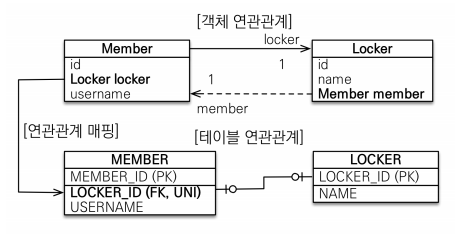
- 다대일 양방향 매핑처럼 `외래 키가 있는 곳이 연관관계의 주인`
- 반대편은 mappedBy 적용
```java
@Entity
public class Member {
    @Id
    @GeneratedValue
    @Column(name = "MEMBER_ID")
    private Long id;    

    private String name;  

    @OneToOne
    @JoinColumn(name = "LOCKER_ID")
    private Locker locker;

    //==연관관계 편의 메소드==//
    public void changeLocker(Locker locker) {
        locker.setMember(this);
        this.setLocker(locker);
    }
}
```
```java
@Entity
public class Locker {
    @Id
    @GeneratedValue
    @Column(name = "LOCKER_ID")
    private Long id;

    private String name;   

    @OneToOne(mappedBy = "locker")⭐
    private Member member; 
}
```
```java
...
Locker locker = new Locker();
locker.setName("lockerA");
em.persist(locker);

Member member = new Member();
member.setName("memberA");
member.changeLocker(locker); // 연관관계 편의 메소드 사용
em.persist(member);
...
```
### 일대일: 대상 테이블에 외래 키 단방향
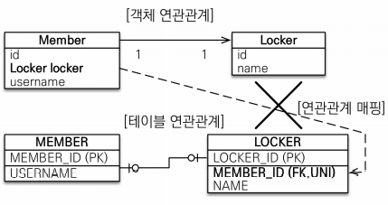
- `단방향 관계는 JPA 지원❌`
- 양방향 관계는 지원⭕
### 일대일: 대상 테이블에 외래 키 양방향
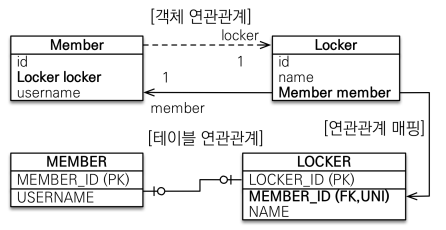
- 사실 `일대일 주 테이블에 외래 키 양방향`과 매핑 방법은 동일하다.
- 단지, 연관관계의 주인을 반대(대상 테이블)로 잡아주면 된다.
```java
@Entity
public class Member {
    @Id
    @GeneratedValue
    @Column(name = "MEMBER_ID")
    private Long id;    

    private String name;  

    @OneToOne(mappedBy = "member")
    private Locker locker;

    //==연관관계 편의 메소드==//
    public void changeLocker(Locker locker) {
        locker.setMember(this);
        this.setLocker(locker);
    }
}
```
```java
@Entity
public class Locker {
    @Id
    @GeneratedValue
    @Column(name = "LOCKER_ID")
    private Long id;

    private String name;   

    @OneToOne
    @JoinColumn(name = "MEMBER_ID")
    private Member member; 
}
```
### 일대일 정리
- <b>주 테이블에 외래 키</b>
    - 주 객체가 대상 객체의 참조를 가지는 것처럼, 주 테이블에 외래 키를 두고 대상 테이블을 찾음
    - 객체지향 개발자가 선호
    - JPA 매핑이 편리함
    - 장점: 주 테이블만 조회해도, 대상 테이블에 데이터가 있는지 확인 가능
    - 단점: 값이 없으면, 외래 키에 NULL 허용
- <b>대상 테이블에 외래 키</b>
    - 대상 테이블에 외래 키가 존재
    - 전통적인 데이터베이스 개발자가 선호
    - 장점: 주 테이블과 대상 테이블을 일대일에서 일대다 관계로 변경할 때 테이블 구조 유지 가능
    - 단점: 프록시 기능의 한계로 `지연 로딩으로 설정해도 항상 즉시 로딩됨`
___
## 다대다 [N:M]
- 관계형 데이터베이스는 정규화된 테이블 2개로 다대다 관계를 표현할 수 없음
- 연결 테이블을 추가해서 일대다, 다대일 관계로 풀어내야 함<br>
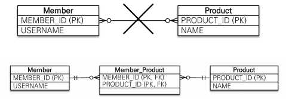
- `객체는 컬렉션을 사용해서 객체 2개로 다대다 관계 가능`<br>
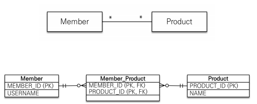
- `@ManyToMany` 사용
- `@JoinTable`로 연결 테이블 지정
- 다대다 매핑: 단방향, 양방향 가능
```java
@Entity
public class Member {

    @Id
    @GeneratedValue
    @Column(name = "MEMBER_ID")
    private Long id;

    @Column(name = "USERNAME")
    private String username;

    @ManyToMany⭐
    @JoinTable(name = "MEMBER_PRODUCT")
    private List<Product> products = new ArrayList<>();
}
```
```java
@Entity
public class Product {

    @Id
    @GeneratedValue
    private Long id;

    private String name;

    @ManyToMany(mappedBy = "products")
    private List<Member> members = new ArrayList<>();
}
```
### 다대다 매핑의 한계
- `편리해 보이지만, 실무에서 사용❌`
- 연결 테이블이 단순히 연결만 하고 끝나지 않음
- 주문시간, 수량같은 추가 데이터가 들어올 수 있음❗<br>
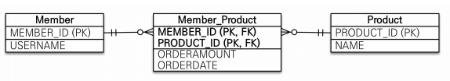
### 다대다 한계 극복
- `연결 테이블용 엔티티 추가(연결 테이블을 엔티티로 승격)`
- `@ManyToMany -> @OneToMany, @ManyToOne`<br>
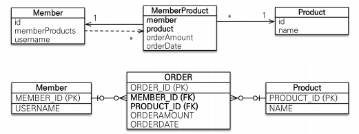
```java
@Entity
public class Product {

    @Id
    @GeneratedValue
    private Long id;

    private String name;

    @OneToMany(mappedBy = "member")
    private List<MemberProduct> memberProducts = new ArrayList<>();
}
```
```java
@Entity
public class MemberProduct {

    @Id
    @GeneratedValue
    private Long id;

    @ManyToOne
    @JoinColumn(name = "MEMBER_ID")
    private Member member;

    @ManyToOne
    @JoinColumn(name = "PROUDCT_ID")
    private Product product;

    private int count;

    private int price;

    private LocalDateTime orderDateTime;
}
```
```java
@Entity
public class Product {

    @Id
    @GeneratedValue
    private Long id;

    private String name;

    @OneToMany(mappedBy = "product")
    private List<MemberProduct> memberProducts = new ArrayList<>();
}
```
___
## 실전 예제 - 3. 다양한 연관관계 매핑
### 배송, 카테고리 추가 - 엔티티
- 주문과 배송은 1:1(`@OneToOne`)
- 상품과 카테고리는 N:M(`@ManyToMany`)<br>
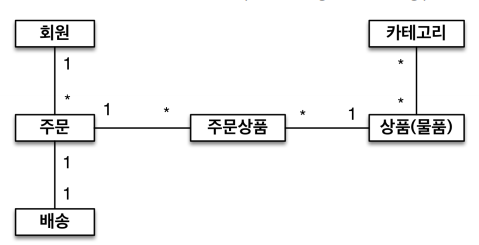
### 배송, 카테고리 추가 - ERD
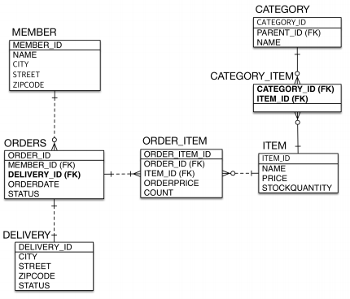
### 배송, 카테고리 추가 - 엔티티 상세
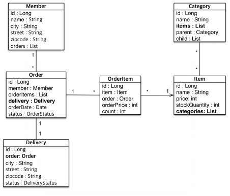
```java
@Entity
@Getter
@Setter
@Table(name = "ORDERS") 
public class Order {
    ...

    @OneToOne
    @JoinColumn(name = "DELIVERY_ID")
    private Delivery delivery;

    ...
}
```
```java
@Entity
public class Delivery {

    @Id
    @GeneratedValue
    private Long id;

    private String city;
    private String street;
    private String zipcode;
    private DeliveryStatus status;

    @OneToOne(mappedBy = "delivery")
    private Order order;
}
```
```java
@Entity
@Getter
@Setter
public class Item {

    ...

    @ManyToMany(mappedBy = "items")
    private List<Category> categories = new ArrayList<>();
}
```
```java
@Entity
public class Category {

    @Id
    @GeneratedValue
    private Long id;

    private String name;

    // self-mapping
    //========================================================
    @ManyToOne
    @JoinColumn(name = "PARENT_ID")
    private Category parent;

    @OneToMany(mappedBy = "parent")
    private List<Category> child = new ArrayList<>();
    //========================================================
    
    @ManyToMany
    @JoinTable(name = "CATEGORY_ITEM",
            joinColumns = @JoinColumn(name = "CATEGORY_ID"),
            inverseJoinColumns = @JoinColumn(name = "ITEM_ID")
    )
    private List<Item> items = new ArrayList<>();
}
```
### N:M 관계는 1:N, M:1로
- 테이블의 N:M 관계는 중간 테이블을 이용해서 1:N, M:1로 사용하자.
- 실전에서는 중간 테이블이 단순하지 않다.
- @ManyToMany는 제약 존재: 필드 추가❌, 엔티티 테이블 불일치
- 실전에서는 `@ManyToMany 사용❌`
### @JoinColumn
- 외래 키를 매핑할 때 사용
<table>
<tr><th>속성</th><th>설명</th><th>기본값</th></tr>
<tr>
<td>name</td>
<td>매핑할 FK 이름</td>
<td>필드명 + _ + 참조하는 테이블의 PK 컬럼명</td>
</tr>
<tr>
<td>referencedColumnName</td>
<td>FK가 참조하는 대상 테이블의 컬럼명</td>
<td>참조하는 테이블의 PK 컬럼명</td>
</tr>
<tr>
<td>foreignKey(DDL)</td>
<td>FK 제약조건을 직접 지정할 수 있다.<br>이 속성은 테이블을 생성할 때만 사용</td>
</tr>
<tr>
<td>
unique<br>
nullable<br>
insertable<br>
updatable<br>
columnDefinition<br>
table
</td>
<td>@Column 의 속성과 동일</td>
</tr>
</table>

### @ManyToOne - 주요 속성
- 다대일 관계 매핑
<table>
<tr><th>속성</th><th>설명</th><Th>기본값</Th></tr>
<tr>
<td>optional</td>
<td>false로 설정하면 연관된 엔티티가 항상 있어야 한다.</td>
<td>TRUE</td>
</tr>
<tr>
<td>fetch</td>
<td>글로벌 패치 전략을 설정</td>
<td>- @ManyToOne = FetchType.EAGER<br>- @OneToMany = FetchType.LAZY</td>
</tr>
<tr>
<td>cascade</td>
<td>영속성 전이 기능을 사용</td>
</tr>
<tr>
<td>targetEntity</td>
<Td>연관된 엔티티의 타입 정보를 설정한다.<br>이 기능은 거의 사용하지 않는다.<br>컬렉션을 사용해도 제네릭으로 타입 정보를 알 수 있다</Td>
</tr>
</table>

### @OneToOne - 주요 속성
- 일대다 관계 매핑
<table>
<tr><th>속성</th><th>설명</th><Th>기본값</Th></tr>
<tr>
<td>mappedBy</td>
<td>연관관계의 주인 필드를 선택한다.</td>
</tr>
<tr>
<td>fetch</td>
<td>글로벌 패치 전략을 설정</td>
<td>- @ManyToOne = FetchType.EAGER<br>- @OneToMany = FetchType.LAZY</td>
</tr>
<tr>
<td>cascade</td>
<td>영속성 전이 기능을 사용</td>
</tr>
<tr>
<td>targetEntity</td>
<Td>연관된 엔티티의 타입 정보를 설정한다.<br>이 기능은 거의 사용하지 않는다.<br>컬렉션을 사용해도 제네릭으로 타입 정보를 알 수 있다</Td>
</tr>
</table>
