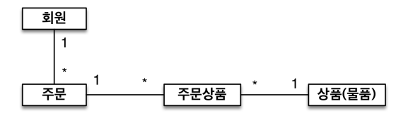
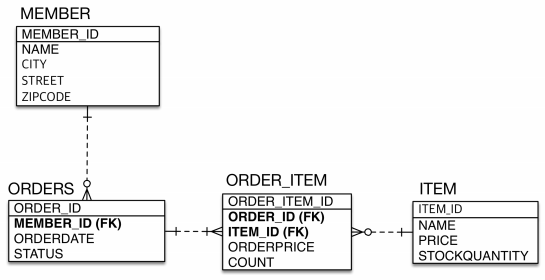
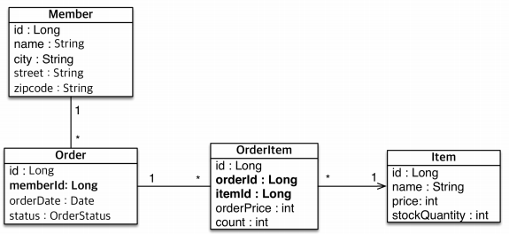

# 엔티티 매핑
- <b>엔티티 매핑 소개</b>
    - 객체와 테이블 매핑: `@Entity`, `@Table`
    - 필드와 컬럼 매핑: `@Column`
    - 기본 키(PK) 매핑: `@Id`
    - 연관관계 매핑: `@ManyToOne`, `@JoinColumn`
## 목차
- 객체와 테이블 매핑
- 데이터베이스 스키마 자동 생성
- 필드와 컬럼 매핑
- 기본 키(PK) 매핑
- 실전 예제 1 - 요구사항 분석과 기본 매핑
___
## 객체와 테이블 매핑
### <b>@Entity</b>
- `@Entity`가 붙은 클래스는 JPA가 관리하는 엔티티라 한다.
- JPA를 사용해서 테이블과 매핑할 클래스는 `@Entity` 필수
- <b>주의</b>
    - `기본 생성자 필수`(파라미터가 없는 public 또는 protected 생성자)
    - final 클래스, enum, interface, inner 클래스에 사용 ❌
    - 저장할 필드에 final 사용 ❌
### <b>@Entity</b> 속성 정리
- 속성: `name`
    - JPA에서 사용할 엔티티 이름을 지정한다.
    - default: 클래스 이름
        > ex) Member.class -> name: Member
    - 같은 클래스 이름이 없으면, 가급적 기본값 사용
### <b>@Table</b>
- `@Table`은 엔티티와 매핑할 테이블을 지정한다.

<table>
<tr>
<th>속성</th>
<th>기능</th>
<th>기본값</th>
</tr>
<tr>
<td>name</td>
<td>엔티티와 매핑할 테이블 이름</td>
<td>엔티티 이름을 사용</td>
</tr>
<tr>
<td>catalog</td>
<td>데이터베이스 catalog 매핑</td>
<td></td>
</tr>
<tr>
<td>schema</td>
<td>데이터베이스 schema 매핑</td>
<td></td>
</tr>
<tr>
<td>uniqueConstraints(DDL)</td>
<Td>DDL 생성 시, 유니크 제약 조건 생성</Td>
<td></td>
</tr>
</table>

___
## 데이터베이스 스키마 자동 생성
- DDL을 애플리케이션 실행 시점에 자동 생성
    > <b>참고</b>
    > - <b>DDL(Data Definition Language)</b>
    >   - table과 같은 데이터 구조를 정의하는데 사용
    >   - 데이터베이스 관리자나 설계자가 사용
    >   > ex) CREATE, ALTER, DROP, RENAME, TRUNCATE
    > - <b>DML(Data Manipulation Language)</b>
    >   - 데이터베이스에 들어 있는 데이터를 조회 하거나 변형을 가하는데 사용
    >   - 사용자와 데이터베이스간 인터페이스를 제공
    >   > ex) SELECT, INSERT, UPDATE, DELETE
    > - <b>DCL(Data Control Language)</b>
    >   - 데이터베이스에 접근하고, 객체들을 사용할 수 있는 권한을 주거나 회수하는데 사용
    >   > ex) GRANT, REVOKE
    > - <b>TCL(Transaction Control Language)</b>
    >   - 논리적인 작업의 단위를 묶어서 DML에 의해 조작된 결과를 작업단위(트랜잭션) 별로 제어
    >   > ex) COMMIT, ROLLBACK, SAVEPOINT
- 테이블 중심 -> 객체 중심 개발 가능
    - 엔티티에 객체 매핑을 해두고, 애플리케이션을 실행할 때 자동으로 테이블을 생성해주므로, 객체 중심으로 개발에 집중할 수 있음
- 데이터베이스 방언을 활용해서 데이터베이스에 맞는 적절한 DDL 생성
- 이렇게 `생성된 DDL은 반드시 개발 단계에서만 사용`
- 생성된 DDL은 적절히 다듬어서 운영서버에서 사용하자
### 데이터베이스 스키마 자동 생성 - 속성
`hibernate.hbm2ddl.auto`

<table>
<tr>
<th>옵션</th>
<th>설명</th>
</tr>
<tr>
<td>create</td>
<td>기존 테이블 삭제 후, 다시 생성</td>
</tr>
<tr>
<td>create-drop</td>
<td>테이블 생성 후, 종료 시점에 테이블 삭제</td>
</tr>
<tr>
<td>update</td>
<td>변경 부분만 반영<BR>운영 DB에서는 절대 사용❌</td>
</tr>
<tr>
<td>validate</td>
<td>엔티티와 테이블이 정상 매핑되었는지 확인하는 용도</td>
</tr>
<tr>
<td>none</td>
<td>자동 생성 기능 사용 ❌</td>
</tr>
</table>

### 데이터베이스 스키마 자동 생성 - 주의
- `운영 장비에는 절대 create, create-drop, update 사용하면 안 된다❗`
- 로컬 PC에서만 자유롭게 사용하되, 공동으로 작업하는 테스트 서버나 스테이징에서는 가급적 사용하지 말자.
### DDL 생성 기능
- 제약조건 추가: 회원 이름은 `필수`, 10자 초과❌
    - `@Column(nullable = false, length = 10)`
- 유니크 제약조건 추가
    - `@Table(uniqueConstraints = {@UniqueConstraint(name = "NAME_AGE_UNIQUE", columnNames = {"NAME", "AGE"})})`
- `DDL 생성 기능은 DDL을 자동 생성할 때만 사용되고, JPA의 실행 로직에는 영향을 주지 않는다.`
___
## 필드와 컬럼 매핑
### 요구사항 추가
1. 회원은 일반 회원과 관리자로 구분해야 한다.
2. 회원 가입일과 수정일이 있어야 한다.
3. 회원을 설명할 수 있는 필드가 있어야 한다. 이 필드는 길이 제한이 없다.
```java
@Entity
@Getter
@Setter
public class Member {

    @Id
    @GeneratedValue
    private Long id;

    @Column(name = "name")
    private String username;

    private Integer age;

    @Enumerated(EnumType.STRING)
    private RoleType roleType;

//    @Temporal(TemporalType.TIMESTAMP)
//    private Date createdDate;
    private LocalDate createdDate;

//    @Temporal(TemporalType.TIMESTAMP)
//    private Date lastModifiedDate;
    private LocalDateTime lastModifiedDate;

    @Lob
    private String description;

    @Transient
    private int temp;

    protected Member() {
    }
}
```
### 매핑 애노테이션 정리
`hibernate.hbm2ddl.auto`

<table>
<tr>
<Th>애노테이션</Th>
<th>설명</th>
</tr>
<tr>
<td>@Column</td>
<td>컬럼 매핑</td>
</tr>
<tr>
<td>@Temporal</td>
<td>날짜 타입 매핑</td>
</tr>
<tr>
<td>@Enumerated</td>
<td>enum 타입 매핑</td>
</tr>
<tr>
<td>@Lob</td>
<td>BLOB, CLOB 매핑</td>
</tr>
<tr>
<td>@Transient</td>
<td>특정 필드를 컬럼에 매핑하지 않음(매핑 무시)</td>
</tr>
</table>

- <b>@Column</b>
    <table>
    <tr>
    <th>속성</th><th>설명</th><th>기본값</th>
    </tr>
    <tr>
    <td>name</td><td>필드와 매핑할 테이블의 컬럼 이름</td><td>객체와 필드 이름</td>
    </tr>
    <tr>
    <td>insertable<br>updateable</td><td>등록, 변경 가능 여부</td><td>true</td>
    </tr>
    <tr>
    <td>nullable(DDL)</td><td>null 값의 허용 여부를 설정한다.<br>false로 설정하면 DDL 생성 시 not null 제약조건이 붙는다.</td>
    </tr>
    <tr>
    <td>unique(DDL)</td><td>@Table의 uniqueConstraints와 같지만, 한 컬럼에 간단히 유니크 제약조건을 걸 때 사용한다.</td><td>필드의 자바 타입과 방언 정보를 사용해서<br>적절한 컬럼 타입 length(DDL) 문자 길이 제약조건, String 타입에만 사용한다</td>
    </tr>
    <tr>
    <td>columnDefinition(DDL)</td><td>데이터베이스 컬럼 정보를 직접 줄 수 있다.<br>ex) varchar(100) default 'EMPTY'</td><td>255</td>
    </tr>
    <tr>
    <td>precision<br>scale(DDL)</td><td>BigDecimal 타입에서 사용한다.(BigInteger도 사용 가능)<br>precision은 소수점을 포함한 전체 자릿수,<br>scale은 소수의 자릿수이다.<br>참고로 double, float 타입에는 적용되지 않는다.<br>아주 큰 숫자나 정밀한 소수를 다루어야 할 때만 사용한다.</td><tD>precision=19<br>scale=2</tD>
    </tr>
    </table>
- <b>Enumerated</b>
    - 자바 enum 타입을 매핑할 때 사용
    - `주의! ORDINAL 사용❌`
        <table>
        <tr>
        <th>속성</th><th>설명</th><th>기본값</th>
        </tr>
        <tr>
        <td>value</td><td><b>EnumType.ORDINAL</b>: enum 순서를 데이터베이스에 저장<br><b>EnumType.STRING</b>: enum 이름을 데이터베이스에 저장</td><td>EnumType.ORDINAL</td>
        </tr>
        </table>
    - ORDINAL을 사용하면, enum을 추가했을 때 순서가 바뀌면서 문제가 발생할 수 있다.
- <b>@Temporal</b>
    - 날짜 타입(java.util.Date, java.util.Calendar)을 매핑할 때 사용
    - 참고: LocalDate, LocalDateTime을 사용할 때는 생략 가능(최신 하이버네이트 지원)
        <table>
        <tr>
        <th>속성</th><th>설명</th><th>기본값</th>
        </tr>
        <tr>
        <td>value</td>
        <td>
        <b>TemporalType.DATE</b>: 날짜, 데이터베이스 date 타입과 매핑 (예: 2013-10-11)<br>
        <b>TemporalType.TIME</b>: 시간, 데이터베이스 time 타입과 매핑 (예: 11:11:11:)<br>
        <b>TemporalType.TIMESTAMP</b>: 날짜와 시간, 데이터베이스 timestamp 타입과 매핑 (예: 2013-10-11 11:11:11)
        </td>
        </tr>
        </table>
- <b>@Lob</b>
    - 데이터베이스 BLOB, CLOB 타입과 매핑
        - @Lob에는 지정할 수 있는 속성이 없다.
        - 매핑하는 필드 타입이 문자면 CLOB 매핑, 나머지는 BLOB 매핑
            - `CLOB`: String, char[], java.sql.CLOB
            - `BLOB`: byte[], java.sql.BLOB
- <b>@Transient</b>
    - 필드 매핑❌
    - 데이터베이스에 저장❌, 조회❌
    - 주로 메모리상에서만 임시로 어떤 값을 보관하고 싶을 때 사용
___
## 기본 키(PK) 매핑
### 기본 키 매핑 애노테이션
- `@Id`
- `@GeneratedValue`
```java
@Id
@GeneratedValue(strategy = GenerationType.AUTO)
private Long id;
```
### 기본 키 매핑 방법
- 직접 할당: `@Id`만 사용
- 자동 생성(`@GeneratedValue`)
    - `IDENTITY`: 데이터베이스에 위임, MYSQL
    - `SEQUENCE`: 데이터베이스 시퀀스 오브젝트 사용, ORACLE
        - @SequenceGenerator 필요
    - `TABLE`: 키 생성용 테이블 사용, 모든 DB에서 사용
        - @TableGenerator 필요
    - `AUTO`: 방언에 따라 자동 지정, 기본값
### IDENTITY 전략
- <b>특징</b>
    - 기본 키 생성을 데이터베이스에 위임
    - 주로 MySQL, PostgreSQL, SQL Server, DB2에서 사용
        > ex) MySQL의 AUTO_INCREMENT
    - JPA는 보통 트랜잭션 커밋 시점에 INSERT SQL 실행
        - 그러나, AUTO_INCREMENT는 데이터베이스에 INSERT SQL을 실행한 이후에 ID 값을 알 수 있음
    - 그래서 IDENTITY 전략은 `em.persist() 시점에 즉시 INSERT SQL 실행`하고, DB에서 식별자를 조회
        - 매번 네트워크를 타기 때문에, 성능 이슈 존재
- <b>매핑</b>
    ```java
    @Entity
    public class Member
        @Id
        @GeneratedValue(strategy = GenerationType.IDENTITY)
        private Long id;
    ```
### SEQUENCE 전략
- <b>특징</b>
    - 데이터베이스 시퀀스는 유일한 값을 순서대로 생성하는 특별한 데이터베이스 오브젝트
        > ex) Oracle의 SEQUENCE
    - Oracle, PostgreSQL, DB2, H2 데이터베이스에서 사용
    - `allocationSize` 값은 DB에 매번 시퀀스를 호출하지 않기 위해 `최적화`를 위한 속성이다.
        - hibernate에서 allocationSize의 기본값은 50이다.
        - next call을 할 때, 미리 DB에 50개를 한 번에 올려놓고, 메모리 상에서 1개씩 쓰는 방식이다.
    - allocationSize의 값을 큰 수로 정하면 안 될까?
        - 이론적으로는 더 큰 수로 설정할수록 성능이 향상된다.
        - 하지만, 중간에 웹 서버를 내리는 시점에, 사용하지 않은 sequence 값이 모두 날라간다.
        - 이러한 낭비를 생각해서 50~100 사이로 설정하는 것이 적당하다.
- <b>매핑</b>
    ```java
    @Entity
    @SequenceGenerator(
        name = "MEMBER_SEQ_GENERATOR",
        sequenceName = "MEMBER_SEQ", //매핑할 데이터베이스 시퀀스 이름
        initialValue = 1, allocationSize = 1
    )
    public class Member
        @Id
        @GeneratedValue(strategy = GenerationType.SEQUENCE,
                        generator = "MEMBER_SEQ_GENERATOR")
        private Long id;
    ```
- <b>@SequenceGenerator 속성</b>
    <table>
    <tr>
    <th>속성</th><th>설명</th><th>기본값</th>
    </tr>
    <tr>
    <td>name</td><td>식별자 생성기 이름</td><td>필수</td>
    </tr>
    <tr>
    <Td>sequenceName</Td><td>데이터베이스에 등록되어 있는 시퀀스 이름</td><td>hibernate_sequence</td>
    </tr>
    <tr>
    <td>initialValue</td><td>DDL 생성 시에만 사용됨<br>시퀀스 DDL을 생성할 때, 처음 시작하는 수를 지정</td><td>1</td>
    </tr>
    <tr>
    <td>allocationSize</td><td>시퀀스 한 번 호출에 증가하는 수(성능 최적화에 사용)<br><b>데이터베이스 시퀀스 값이 하나씩 증가하도록 설정되어 있으면, 이 값을 반드시 1로 설정해야 함</b></td><td><b>50</b></td>
    </tr>
    <tr>
    <td>catalog, schema</td><td>데이터베이스 catalog, schema 이름</td>
    </tr>
    </table>

- <b>allocationSize 속성 사용 시 주의사항</b>
    - DB의 시퀀스 증가값이 1인 경우, 충돌을 막기 위해 반드시 allocationSize를 1로 맞춰 주어야 한다.
    - 이유는 allocationSize가 다음과 같은 알고리즘으로 동작하기 때문이다.
        1. 최초 persist() 실행 시, 설정에 따른 DB 시퀀스를 두 번 호출하여<br>- 첫 번째 시퀀스 값: 가상으로 관리할 시작 값<br>- 두 번째 시퀀스 값: 가상으로 관리할 범위의 끝(MAX)값<br>으로 지정한다.
        2. 이후 persist()를 실행해도, DB에 시퀀스를 호출하지 않고, 메모리에서 가상으로 관리하며 할당.<br>
        persist() 실행마다, 메모리에서 관리하는 가상의 값을 1씩 증가시키며 엔티티에 할당.
        3. 엔티티에 식별자를 할당할 값이 MAX가 되면, 다시 한번 persist()를 실행하는 시점에 DB에 시퀀스를 호출한다.
        4. 다시 호출한 시퀀스값을 가상으로 관리할 끝(MAX)값으로 바꾸고<br>
        시작값을 `끝(MAX)값 - (allocationSize - 1)`으로 정한다.
    - DB sequence 증가 값 설정 방법
        ```sql
        drop sequence HIBERNATE_SEQUENCE;
        create sequence HIBERNATE_SEQUENCE START WITH 1 INCREMENT BY 50;
### TABLE 전략
- <b>특징</b>
    - 키 생성 전용 테이블을 하나 만들어서, 데이터베이스 시퀀스를 흉내내는 전략
    - 장점: 모든 데이터베이스에 적용 가능
    - 단점: 성능 이슈
- <b>매핑</b>
    ```sql
    create table MY_SEQUENCES (
        sequence_name varchar(255) not null,
        next_val bigint,
        primaryt key (sequence_name)
    )
    ```
    ```java
    @Entity
    @TableGEnerator(
        name = "MEMBER_SEQ_GENERATOR",
        table = "MY_SEQUENCES",
        pkColumnValue = "MEMBER_SEQ", allocationSize = 1
    )
    public class Member {
        @Id
        @GeneratedValue(strategy = GenerationType.TABLE,
                        generator = "MEMBER_SEQ_GENERATOR")
        private Long id;
    }
    ```
- <b>@TableGenerator - 속성</b>
    <table>
    <tr>
    <th>속성</th><th>설명</th><Th>기본값</Th>
    </tr>
    <tr>
    <td>name</td><td>식별자 생성기 이름</td><td>필수</td>
    </tr>
    <tr>
    <td>table</td><td>키 생성 테이블명</td><td>hibernate_sequences</td>
    </tr>
    <tr>
    <td>pkColumnName</td><td>시퀀스 컬럼명</td><td>sequence_name</td>
    </tr>
    <tr>
    <td>valueColumnName</td><td>시퀀스 값 컬럼명</td><td>next_val</td>
    </tr>
    <Tr>
    <td>pkColumnValue</td><td>키로 사용할 값 이름</td><td>엔티티 이름</td>
    </Tr>
    <Tr>
    <td>initialValue</td><td>초기 값, 마지막으로 생성된 값이 기준</td><td>0</td>
    </Tr>
    <tr>
    <td>allocationSize</td><td>시퀀스 한 번 호출에 증가하는 수(성능 최적화에 사용됨)</td><td><b>50</b></td>
    </tr>
    <tr>
    <td>catalog, schema</td><td>데이터베이스 catalog, schema 이름</td>
    </tr>
    <tr>
    <td>uniqueConstraints(DDL)</td><td>유니크 제약 조건을 지정할 수 있음</td>
    </tr>
    </table>
### 권장하는 식별자 전략
- `기본 키 제약 조건`: null 아님, 유일, `변하면 안된다.`
- 미래까지 이 조건을 만족하는 자연키는 찾기 어려우므로, 대체키를 사용하자.
    > 예를 들어, 주민등록번호도 기본 키로 적절하지 않다.
- `권장: Long형 + 대체키 + 키 생성전략`
___
## 실전 예제 - 1. 요구사항 분석과 기본 매핑
### 요구사항 분석
- 회원은 상품을 주문할 수 있다
- 주문 시, 여러 종류의 상품을 선택할 수 있다.
### 기능 목록
- 회원 기능
    - 회원 등록
    - 회원 조회
- 상품 기능
    - 상품 등록
    - 상품 수정
    - 상품 조회
- 주문 기능
    - 상품 주문
    - 주문내역 조회
    - 주문 취소
### 도메인 모델 분석
- <b>회원과 주문의 관계:</b> `회원`은 여러 번 `주문`할 수 있다. (1:N)
- <b>주문과 상품의 관계:</b> `주문`할 때, 여러 `상품`을 선택할 수 있다.<br>
반대로 같은 `상품`도 여러 번 `주문`될 수 있다.<br>
`주문상품`이라는 모델을 만들어서 N:M 관계를 1:N, M:1 관계로 풀어냄<br>

### 테이블 설계

### 엔티티 설계와 매핑

### 데이터 중심 설계의 문제점
- 현재 방식은 객체 설계를 테이블 설계에 맞춘 방식
- 테이블의 외래키를 객체에 그대로 가져옴
- 객체 그래프 탐색이 불가능
- 참조가 없으므로 UML도 잘못됨