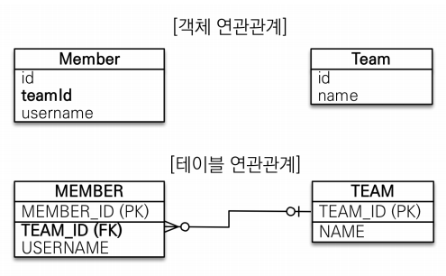

# 연관관계 매핑 기초
- <b>목표</b>
    - `객체와 테이블 연관관계의 차이를 이해`
    - `객체의 참조와 테이블의 외래 키를 매핑`
    - 용어 이해
        - `방향(Direction)`: 단방향, 양방향
        - `다중성(Multiplicity)`: 다대일(N:1), 일대다(1:N), 일대일(1:1), 다대다(N:M) 이해
        - `연관관계의 주인(Onwer)`: 객체 양방향 연관관계는 관리 주인이 필요
## 목차
- 연관관계가 필요한 이유
- 단방향 연관관계
- 양방향 연관관계와 연관관계의 주인
- 실전 예제 2 - 연관관계 매핑 시작
___
## 연관관계가 필요한 이유
> ‟객체지향 설계의 목표는 자율적인 객체들의 `협력 공동체`를 만드는 것이다.” - 조영호(객체지향의 사실과 오해)
### 예제 시나리오
- 회원과 팀이 있다.
- 회원은 하나의 팀에만 소속될 수 있다.
- 회원과 팀은 다대일 관계다.
### 객체를 테이블에 맞추어 모델링
- <b>연관관계가 없는 객체</b><br>
    
- <b>참조 대신 외래 키를 그대로 사용</b><br>
    
- <b>외래 키 식별자를 직접 다룸</b><br>
    
- <b>식별자로 다시 조회, 객체 지향적인 방법은 아니다.</b><br>
    
### 객체를 테이블에 맞추어 데이터 중심으로 모델링하면, 협력 관계를 만들 수 없다.
- `테이블은 외래 키로 조인`을 사용해서 연관된 테이블을 찾는다.
- `객체는 참조`를 사용해서 연관된 객체를 찾는다.
- 테이블과 객체 사이에는 이런 큰 간격이 있다.
___
## 단방향 연관관계
### 객체 지향 모델링
- <b>객체 연관관계 사용</b><br>
    
- <b>객체의 참조와 테이블의 외래 키를 매핑</b><br>
    
- <b>ORM 매핑</b><br>
    
- <b>연관관계 저장</b><br>
    
- <b>참조로 연관관계 조회 - 객체 그래프 탐색</b><br>
    
- <b>연관관계 수정</b><br>
    
___
## 양방향 연관관계와 연관관계의 주인
### 양방향 매핑

- <b>Member 엔티티는 단방향과 동일</b><br>
    
- <b>Team 엔티티는 컬렉션 추가</b><br>
    
- <b>반대 방향으로 객체 그래프 탐색</b><br>
    
### 연관관계의 주인과 mappedBy
객체와 테이블간에 연관관계를 맺는 차이를 이해해야 한다.
- <b>객체와 테이블이 관계를 맺는 차이</b>
    - `객체 연관관계 = 2개`
        - 회원 -> 팀 연관관계 1개(단방향)
        - 팀 -> 회원 연관관계 1개(단방향)
    - `테이블 연관관계 = 1개`
        - 회원 <-> 팀의 연관관계 1개(양방향)
    

### 객체의 양방향 관계
- 객체의 `양방향 관계는 사실 양방향 관계가 아니라, 서로 다른 단방향 관계 2개`이다.
- 객체를 양방향으로 참조하려면, `단방향 연관관계 2개`를 만들어야 한다.
    > A -> B (a.getB())<br>
    > B -> A (b.getA())
### 테이블의 양방향 연관관계
- 테이블은 `외래 키 하나`로 두 테이블의 연관관계를 관리
- MEMBER.TEAM_ID 외래 키 하나로 양방향 연관관계를 가짐(양쪽으로 조인 가능)
```sql
SELECT *
FROM MEMBER M
JOIN TEAM T ON M.TEAM_ID = T.TEAM_ID
```
```SQL
SELECT *
FROM TEAM T
JOIN MEMBER M ON T.TEAM_ID = M.TEAM_ID
```
- <b>둘 중 하나로 외래 키를 관리해야 한다.</b><br>
    
### 연관관계의 주인(Owner)
- <b>양방향 매핑 규칙</b>
    - 객체의 두 관계 중 하나를 연관관계의 주인으로 지정
    - `연관관계의 주인만이 외래 키를 관리(등록, 수정)`
    - `주인이 아닌 쪽은 읽기만 가능`
    - 주인은 mappedBy 속성 사용❌
    - 주인이 아니면 mappedBy 속성으로 주인 지정
- <b>누구를 주인으로?</b>
    - 외래 키가 있는 곳을 주인으로 정해라
    - 여기서는 `Member.team`이 연관관계의 주인<br>
        
### 양방향 매핑 시 가장 많이하는 실수
- <b>연관관계의 주인에 값을 입력하지 않음</b><br>
    
- <b>양방향 매핑 시 연관관계의 주인에 값을 입력해야 한다.</b>
    - 순수한 객체 관계를 고려하면, 항상 양쪽 모두에 값을 입력해야 한다.<br>
        
### 양방향 연관관계 주의!
- `순수 객체 상태를 고려해서 항상 양쪽에 값을 설정하자`
- `연관관계 편의 메소드`를 생성하자
    ```java
    @Entity
    @Getter
    @Setter
    public class Member {

        @Id
        @GeneratedValue
        @Column(name = "MEMBER_ID")
        private Long id;

        @Column(name = "USERNAME")
        private String username;

        @ManyToOne
        @JoinColumn(name = "TEAM_ID")
        private Team team;

        //==연관관계 편의 메소드==//
        public void changeTeam(Team team) {
            this.team = team;
            team.getMembers().add(this);
        }
    }
    ```
- 양방향 매핑 시 `무한 루프를 조심`하자
    > ex) `toString()`, `lombok`, `JSON 생성 라이브러리`
    > - lombok의 toString() 기능 사용 자제할 것
    > - Controller에서 Entity를 그대로 반환하지 말 것
    >   - DTO로 받아서 반환할 것
### 양방향 매핑 정리
- `단방향 매핑만으로도 이미 연관관계 매핑은 완료된다.`
- 양방향 매핑은 반대 방향으로 조회(객체 그래프 탐색) 기능이 추가된 것 뿐이다.
- JPQL에서 역방향으로 탐색할 일이 많음
- 단방향 매핑을 우선적으로 잘 하고, 양방향은 필요할 때 추가하자.
    - 양방향 매핑은 테이블에 영향을 주지 않음
___
## 실전 예제 - 2. 연관관계 매핑 시작
### 테이블 구조
- 테이블 구조는 이전과 같다.<br>
    
### 객체 구조
- 참조를 사용하도록 변경<br>
    
### 구현 코드
- <b>Item</b>
    ```java
    @Entity
    @Getter
    @Setter
    public class Item {

        @Id
        @GeneratedValue
        @Column(name = "ITEM_ID")
        private Long id;

        private String name;

        private int price;

        private int stockQuantity;
    }
    ```
- <b>Member</b>
    ```java
    @Entity
    @Getter
    @Setter
    public class Member {

        @Id
        @GeneratedValue
        @Column(name = "MEMBER_ID")
        private Long id;

        private String name;

        private String city;

        private String street;

        private String zipcode;

        @OneToMany(mappedBy = "member")
        ⭐private List<Order> orders = new ArrayList<>();
    }
    ```
- <b>Order</b>
    ```java
    @Entity
    @Getter
    @Setter
    @Table(name = "ORDERS") // ORDER BY 라는 예약어 때문에 테이블명 인식이 안될 수도 있기 때문에 "ORDERS"로 사용
    public class Order {

        @Id
        @GeneratedValue
        @Column(name = "ORDER_ID")
        private Long id;

        @ManyToOne
        @JoinColumn(name = "MEMBER_ID")
        ⭐private Member member;

        private LocalDateTime orderDate;

        @Enumerated(EnumType.STRING)
        private OrderStatus status;

        @OneToMany(mappedBy = "order")
        ⭐private List<OrderItem> orderItems = new ArrayList<>();

        ⭐public void addOrderItem(OrderItem orderItem) { 
            orderItems.add(orderItem);
            orderItem.setOrder(this);
        }
    }
    ```
- <b>OrderItem</b>
    ```java
    @Entity
    @Getter
    @Setter
    public class OrderItem {

        @Id
        @GeneratedValue
        @Column(name = "ORDER_ITEM_ID")
        private Long id;

        @ManyToOne
        @JoinColumn(name = "ORDER_ID")
        ⭐private Order order;

        @ManyToOne
        @JoinColumn(name = "ITEM_ID")
        ⭐private Item item;

        private int orderPrice;

        private int count;
    }
    ```
- <b>OrderStatus</b>
    ```java
    public enum OrderStatus {
        ORDER, CANCEL
    }
    ```