# 영속성 관리 - 내부 동작 방식
## 목차
- 영속성 컨텍스트
- 엔티티의 생명주기
- 영속성 컨텍스트의 이점
- 플러시
- 준영속 상태
___
## 영속성 컨텍스트
- <b>JPA에서 가장 중요한 2가지</b>
    - 객체와 관계형 데이터베이스 매핑(Object Relational Mapping)
    - `영속성 컨텍스트`
- <b>EntityManagerFactory와 EntityManager</b> 
    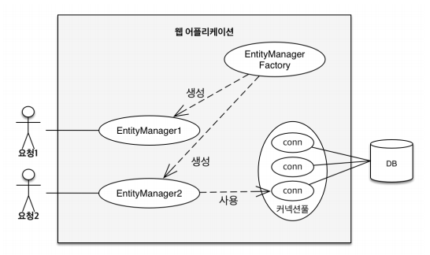
- <b>영속성 컨텍스트</b>
    - JPA를 이해하는데 가장 중요한 언어
    - `엔티티를 영구 저장하는 환경`이라는 뜻
    - `EntityManager.persist(entity)`
    - 영속성 컨텍스트는 논리적인 개념(눈에 보이지 않음)
    - EntityManager를 통해 영속성 컨텍스트에 접근 
    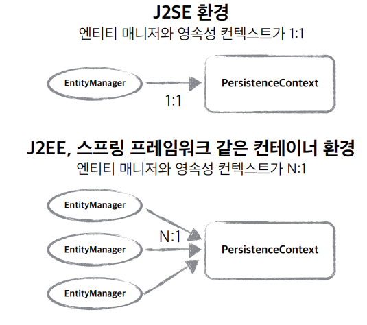
    > <b>참고</b>
    > - <b>J2SE(Java SE, Standard Edition)</b>
    >   - 표준 자바 플랫폼, 자바 API 집합체, 스윙이나 GUI 기능 포함
    > - <b>J2EE(Java EE, Enterprise Edition)</b>
    >   - 서버측 개발을 위한 자바 플랫폼, Java SE을 사용하는 서버를 위한 플랫폼
    >   - 전사적 차원(대규모의 동시 접속과 유지가 가능한 다양한 시스템의 연동 네트워크 기반 총칭)에서 필요로 하는 도구
    >   - EJB, JSP, Servlet 같은 기능을 지원, WAS를 이용한 프로그램 개발 시 사용
___
## 엔티티의 생명주기
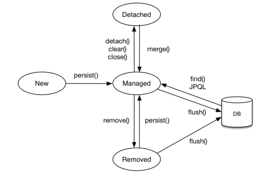
- <b>비영속 (new/transient)</b>
    - 영속성 컨텍스트와 전혀 관계가 없는 `새로운` 상태 
        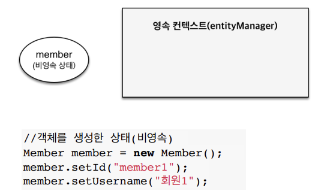
- <b>영속 (managed)</b>
    - 영속성 컨텍스트에 `관리`되는 상태 
        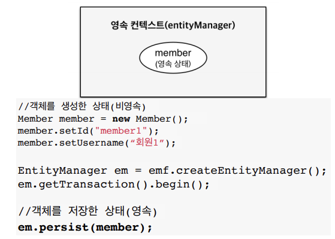
- <b>준영속 (detached)</b>
    - 영속성 컨텍스트에 저장되었다가 `분리`된 상태
- <b>삭제 (removed)</b>
    - 영속성 컨텍스트에서 완전히 `삭제`된 상태 
        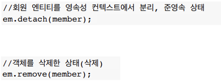
___
## 영속성 컨텍스트의 이점
- 1차 캐시
- 동일성(identity) 보장
- 트랜잭션을 지원하는 쓰기 지연(transactional write-behind)
- 변경 감지(Dirty Checking)
- 지연 로딩(Lazy Loading)
### 엔티티 조회 - 1차 캐시
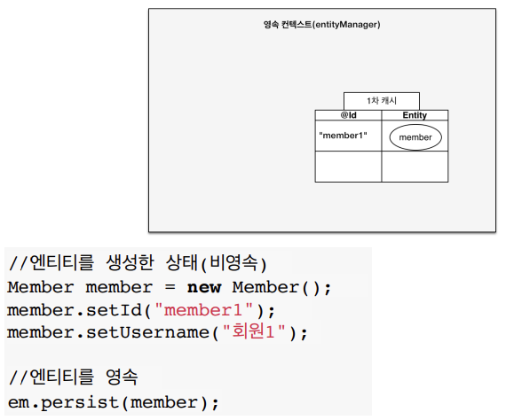
- <b>1차 캐시에서 조회</b> 
    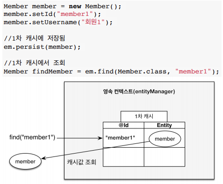
- <b>데이터베이스에서 조회</b> 
    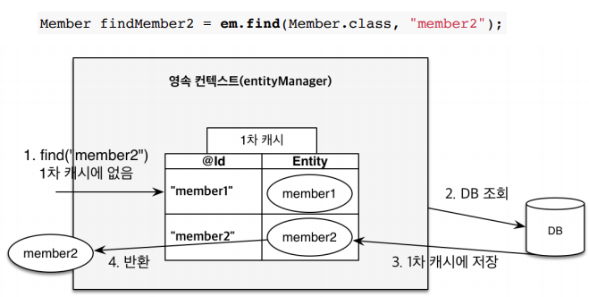
### 영속 엔티티의 동일성 보장
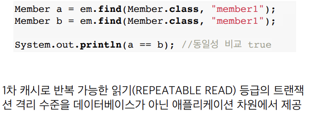
### 엔티티 등록 - 트랜잭션을 지원하는 쓰기 지연
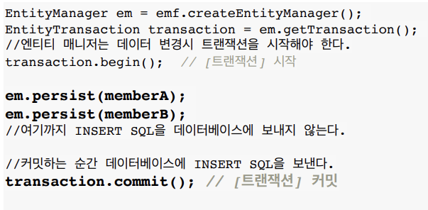 
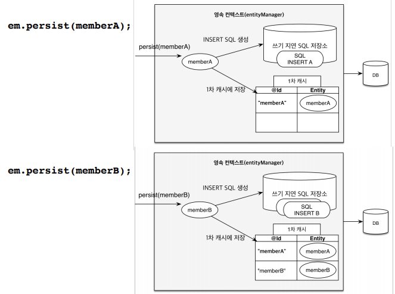 
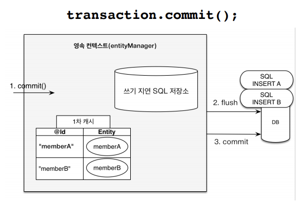
### 엔티티 수정 - 변경 감지(Dirty Checking)
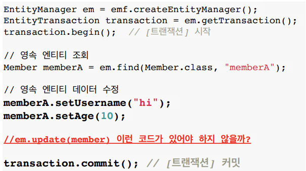 
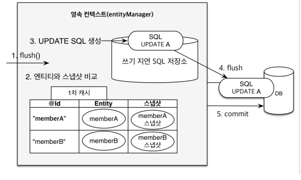
### 엔티티 삭제
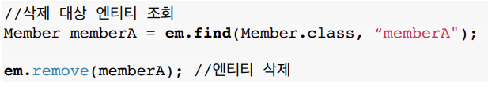
___
## 플러시
<b>영속성 컨텍스트의 변경내용을 데이터베이스에 반영</b>
- <b>플러시가 발생하면 하는 일</b>
    - 변경 감지(dirty checking)
    - 수정된 엔티티를 쓰기 지연 SQL 저장소에 등록
    - 쓰기 지연 SQL 저장소의 쿼리를 데이터베이스에 전송(등록, 수정, 삭제 쿼리)
- <b>영속성 컨텍스트를 플러시하는 방법</b>
    - `em.flush()` - 직접 호출
    - `트랜잭션 commit` - 플러시 자동 호출
    - `JPQL 쿼리` - 플러시 자동 호출
- <b>JPQL 쿼리 실행 시, 플러시가 자동으로 호출되는 이유</b>
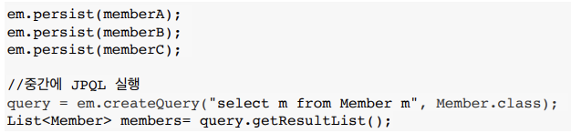
    - 아직 member A, B, C가 데이터베이스에 플러시되기 전이라, JPQL을 실행하면 기대하는 결과를 얻을 수 없다.
    - 이러한 문제를 예방하기 위해, 기본적으로 JPQL 쿼리 실행 시, 자동으로 플러시가 호출되도록 설정되었다.
- <b>플러시 모드 옵션</b>
    - `em.setFlushMode(...)`
        - `FlushModeType.AUTO`
            - commit이나 쿼리를 실행할 때, 플러시(default)
        - `FlushModeType.COMMIT`
            - commit할 때만 플러시
    - 거의 사용❌
- <b>플러시는!</b>
    - 영속성 컨텍스트를 비우지 않음
    - 영속성 컨텍스트의 변경 내용을 데이터베이스에 동기화
    - 트랜잭션이라는 작업 단위가 중요 -> commit 직전에만 동기화 하면 됨
___
## 준영속 상태
- 영속 -> 준영속
- 영속 상태의 엔티티가 영속성 컨텍스트에서 분리(detached)된 상태
    - 영속 상태일 때의 정보가 남아 있음
- 영속성 컨텍스트가 제공하는 기능을 사용 못함
### 준영속 상태로 만드는 방법
- <b>em.detach(entity)</b>
    - 특정 엔티티만 준영속 상태로 전환
- <b>em.clear()</b>
    - 영속성 컨텍스트를 완전히 초기화
- <b>em.close()</b>
    - 영속성 컨텍스트를 종료