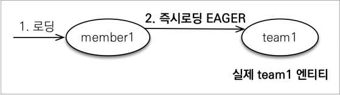

# 프록시와 연관관계 관리
## 목차
- 프록시
- 즉시 로딩과 지연 로딩
- 지연 로딩 활용
- 영속성 전이: CASCADE
- 고아 객체
- 영속성 전이 + 고아 객체, 생명주기
- 실전 예제 - 5.연관관계 관리
___
## 프록시
### Member를 조회할 때, Team도 함께 조회해야 할까?


- <b>회원과 팀 함께 출력</b>
    ```java
    public void printUserAndTeam(String memberId) {
        Member member = em.find(Member.class, memberId);
        Team team = member.getTeam();
        System.out.println("회원 이름: " + member.getUsername()); 
        System.out.println("소속팀: " + team.getName()); 
    }
    ```
- <b>회원만 출력</b>
    ```java
    public void printUser(String memberId) {
        Member member = em.find(Member.class, memberId);
        Team team = member.getTeam();
        System.out.println("회원 이름: " + member.getUsername()); 
    }
    ```
### 프록시 기초
- <b>em.find() vs em.`getReference()`</b>
- <b>em.find()</b>
    - 데이터베이스를 통해 실제 엔티티 객체 조회
- <b>em.getReference()</b>
    - `데이터베이스 조회를 미루는 가짜(프록시) 엔티티 객체 조회`
    - 실제 사용하는 시점에 DB에서 엔티티를 조회한다.(find는 바로 DB 조회)<br>
        
### 프록시 특징

- 실제 클래스를 상속 받아서 만들어짐
- 실제 클래스와 겉 모양이 같다.
- 사용하는 입장에서는 진짜 객체인지, 프록시 객체인지 구분하지 않고 사용하면 된다.
### 프록시 객체의 초기화
```java
// 영속성 컨텍스트에 프록시 객체 생성
Member member = em.getReference(Member.class, "id1");
member.getName(); // 초기화 요청
```


- <B>과정</B>
    1. `getReference()` 호출 
        - 프록시 객체 생성 후, 영속성 컨텍스트에 저장
        - 처음에는 target에 null이 들어 있다.
    2. `getName()` 호출
        - target에 null이 들어 있으므로, 영속성 컨텍스트에 `초기화` 요청
        - 영속성 컨텍스트는 `DB를 조회`하여 `실제 엔티티 객체`를 생성하고, 1차 캐시에 저장
        - 이 실제 엔티티 객체의 `참조`를 프록시 객체의 `target 변수`에 저장
        - 프록시 객체는 target 변수를 통해, 실제 엔티티 객체에 접근하여 getName()을 호출
### ⭐프록시 특징⭐
- 프록시 객체는 처음 사용할 때, `한 번만 초기화`
- 프록시 객체를 초기화할 때, 프록시 객체가 실제 엔티티로 바뀌는 것은 아니다.
    - 초기화되면, 프록시 객체를 통해 `실제 엔티티에 접근` 가능한 것이다.
- 프록시 객체는 `원본 엔티티를 상속`받는다.
    - 따라서, 타입 체크 시 주의 필요
    - == 비교 대신, `instance of` 사용
- 영속성 컨텍스트에 찾는 엔티티가 이미 있으면, em.`getReference()`를 호출해도 실제 엔티티를 반환한다.
- 영속성 컨텍스트의 도움을 받을 수 없는 `준영속` 상태일 때, 프록시를 초기화하면 문제 발생
    - 하이버네이트는 org.hibernate.LazyInitializationException 예외를 발생시킨다.
```java
/**
 * 데이터베이스 조회를 미루는 가짜(프록시) 엔티티 객체 조회
 */
Member refMember = em.getReference(Member.class, member.getId()); // proxy 생성
System.out.println("refMember = " + refMember.getClass()); // proxy
System.out.println("refMember.getId() = " + refMember.getId());

/**
 * 프록시 객체 초기화 -> 프록시 객체를 통해 실제 인티티에 접근 가능
 * SELECT 쿼리 발생
 */
System.out.println("refMember.getUsername() = " + refMember.getUsername());

/**
 * SELECT 쿼리 발생❌
 */
System.out.println("refMember.getUsername() = " + refMember.getUsername());

/**
 * 프록시 객체는 원본 엔티티를 상속받음, 따라서 타입 체크시 주의해야함
 * (== 비교 실패, 대신 instance of 사용)
 */
System.out.println(Member.class.equals(refMember.getClass())); // false
System.out.println(refMember instanceof Member); // true
```
```java
/**
 * 영속성 컨텍스트에 찾는 엔티티가 이미 있으면, em.getReference()를 호출해도 실제 엔티티를 반환한다.
 * (동일한 트랜잭션 내에서 엔티티의 동일성을 보장하기 위함)
 */
Member findMember = em.find(Member.class, member.getId()); // DB -> 1차 캐시에 실제 엔티티 저장
System.out.println("findMember.getClass() = " + findMember.getClass()); // entity
Member refMember = em.getReference(Member.class, member.getId());
System.out.println("refMember.getClass() = " + refMember.getClass()); // entity
System.out.println(findMember.getClass().equals(refMember.getClass())); // true
```
```java
/**
 * 프록시 엔티티 객체 조회 이후, find() 호출 시, 똑같이 프록시 엔티티 객체를 반환한다.
 * (동일한 트랜잭션 내에서 엔티티의 동일성을 보장하기 위함)
 */
Member refMember = em.getReference(Member.class, member.getId());
System.out.println("refMember.getClass() = " + refMember.getClass()); // proxy
Member findMember = em.find(Member.class, member.getId());
System.out.println("findMember.getClass() = " + findMember.getClass()); // proxy
System.out.println(refMember == findMember); // true
```
```java
/**
 * 준영속 상태일 때, 프록시를 초기화한 경우
 * LazyInitializationException 예외 발생
 */
Member refMember = em.getReference(Member.class, member.getId());
System.out.println("refMember.getClass() = " + refMember.getClass());

/**
 * refMember 준영속 상태로 전환
 */
em.detach(refMember);

/**
 * 프록시 객체 초기화 -> LazyInitializationException 예외 발생
 */
System.out.println("refMember.getUsername() = " + refMember.getUsername());
```
### 프록시 확인
- <b>프록시 인스턴스의 초기화 여부 확인</b>
    - `EntityManagerFactory.getPersistenceUnitUtil().isLoaded(Object entity)`
- <b>프록시 클래스 확인 방법</b>
    - `entity.getClass().getName()`
- <b>프록시 강제 초기화</b>
    - `org.hibernate.Hibernate.initialize(entity)`
> <b>참고</b>
> - JPA 표준은 강제 초기화 기능 없음
> - 강제 호출: `member.getName()`
```java
/**
 * 프록시 객체의 초기화 여부 확인
 */
Member refMember = em.getReference(Member.class, member.getId());
refMember.getUsername();
System.out.println(emf.getPersistenceUnitUtil().isLoaded(refMember));

/**
 * 프록시 클래스 확인 방법
 */
Member refMember = em.getReference(Member.class, member.getId());
System.out.println("refMember.getClass() = " + refMember.getClass());

/**
 * 프록시 강제 초기화
 */
Member refMember = em.getReference(Member.class, member.getId());
Hibernate.initialize(refMember);
```
___
## 즉시 로딩과 지연 로딩
### Member를 조회할 때, Team도 함께 조회해야 할까?
- 단순히 member 정보만 사용하는 비즈니스 로직
```java
println(member.getName());
```

### 지연 로딩 LAZY를 사용해서 프록시로 조회
```java
@Entity
public class Member {
    @Id
    @GeneratedValue
    private Long id;

    @Column(name = "USERNAME")
    private String name;

    @ManyToOne(fetch = FetchType.LAZY) ⭐
    @JoinColumn(name = "TEAM_ID")
    private Team team;
.. 
}
```
<br>

```java
Member findMember = em.find(Member.class, member.getId());
System.out.println("findMember.getClass() = " + findMember.getClass());
System.out.println("findMember.getTeam().getClass() = " + findMember.getTeam().getClass());

System.out.println("findMember.getTeam().getName() = " + findMember.getTeam().getName());
System.out.println("findMember.getTeam().getClass() = " + findMember.getTeam().getClass());
```
```sql
Hibernate: 
    select
        member0_.MEMBER_ID as MEMBER_I1_5_0_,
        member0_.createdBy as createdB2_5_0_,
        member0_.createdDate as createdD3_5_0_,
        member0_.lastModifiedBy as lastModi4_5_0_,
        member0_.lastModifiedDate as lastModi5_5_0_,
        member0_.TEAM_ID as TEAM_ID7_5_0_,
        member0_.USERNAME as USERNAME6_5_0_ 
    from
        Member member0_ 
    where
        member0_.MEMBER_ID=?
findMember.getClass() = class hellojpa.Member
findMember.getTeam().getClass() = class hellojpa.Team$HibernateProxy$cW6KmTis
Hibernate: 
    select
        team0_.TEAM_ID as TEAM_ID1_10_0_,
        team0_.createdBy as createdB2_10_0_,
        team0_.createdDate as createdD3_10_0_,
        team0_.lastModifiedBy as lastModi4_10_0_,
        team0_.lastModifiedDate as lastModi5_10_0_,
        team0_.name as name6_10_0_ 
    from
        Team team0_ 
    where
        team0_.TEAM_ID=?
findMember.getTeam().getName() = teamA
findMember.getTeam().getClass() = class hellojpa.Team$HibernateProxy$cW6KmTis
```
### Member와 Team을 함께 자주 사용한다면?

### 즉시 로딩 EAGER를 사용해서 함께 조회
```java
@Entity
public class Member {
    @Id
    @GeneratedValue
    private Long id;

    @Column(name = "USERNAME")
    private String name;

    @ManyToOne(fetch = FetchType.EAGER) ⭐
    @JoinColumn(name = "TEAM_ID")
    private Team team;
.. 
}
```
<br>

```java
Member findMember = em.find(Member.class, member.getId());
System.out.println("findMember.getClass() = " + findMember.getClass());
System.out.println("findMember.getTeam().getClass() = " + findMember.getTeam().getClass());

System.out.println("findMember.getTeam().getName() = " + findMember.getTeam().getName());
System.out.println("findMember.getTeam().getClass() = " + findMember.getTeam().getClass());
```
```sql
Hibernate: 
    select
        member0_.MEMBER_ID as MEMBER_I1_5_0_,
        member0_.createdBy as createdB2_5_0_,
        member0_.createdDate as createdD3_5_0_,
        member0_.lastModifiedBy as lastModi4_5_0_,
        member0_.lastModifiedDate as lastModi5_5_0_,
        member0_.TEAM_ID as TEAM_ID7_5_0_,
        member0_.USERNAME as USERNAME6_5_0_,
        team1_.TEAM_ID as TEAM_ID1_10_1_,
        team1_.createdBy as createdB2_10_1_,
        team1_.createdDate as createdD3_10_1_,
        team1_.lastModifiedBy as lastModi4_10_1_,
        team1_.lastModifiedDate as lastModi5_10_1_,
        team1_.name as name6_10_1_ 
    from
        Member member0_ 
    left outer join
        Team team1_ 
            on member0_.TEAM_ID=team1_.TEAM_ID 
    where
        member0_.MEMBER_ID=?
findMember.getClass() = class hellojpa.Member
findMember.getTeam().getClass() = class hellojpa.Team
findMember.getTeam().getName() = teamA
findMember.getTeam().getClass() = class hellojpa.Team
```
### 프록시와 즉시로딩 주의
- `가급적 지연 로딩만 사용(특히 실무에서)`
- `@ManyToOne, @OneToOne은 기본이 즉시 로딩` -> `LAZY로 설정`
- @OneToMany, @MAnyToMany는 기본이 지연 로딩
- 즉시 로딩을 적용하면, 예상하지 못한 SQL이 발생
- `즉시 로딩은 JPQL에서 N+1 문제를 일으킨다.`
    ```java
    public static void main(String[] args) {
        EntityManagerFactory emf = Persistence.createEntityManagerFactory("hello");
        EntityManager em = emf.createEntityManager();
        EntityTransaction tx = em.getTransaction();

        tx.begin();
        try {
            Member member = new Member();
            member.setUsername("memberA");

            Member member2 = new Member();
            member2.setUsername("memberB");

            Team team = new Team();
            team.setName("teamA");
            member.changeTeam(team);

            Team team2 = new Team();
            team2.setName("teamB");
            member2.changeTeam(team2);

            em.persist(team);
            em.persist(member);
            em.persist(team2);
            em.persist(member2);

            em.flush();
            em.clear();

            List<Member> result = em.createQuery("select m from Member m", Member.class)
                    .getResultList();
            //SQL: select * from Member -> Member에서 Team이 EAGER 세팅되어 있네?
            // Member 테이블에 존재하는 각 member마다 Team 테이블을 쿼리 수행
            // member 가 총 N명이라면, N개의 아래의 쿼리가 추가로 수행된다.
            //SQL: select * from Team where TEAM_ID = xxx -> 추가 실행
            // 즉, 처음의 쿼리와 N개의 추가 쿼리 발생 문제(N + 1)가 발생한다.

            tx.commit();
        } catch (Exception e) {
            tx.rollback();
            e.printStackTrace();
        } finally {
            em.close();
        }
        emf.close();
    }
    ```
    - 실제 쿼리 결과
        ```sql
        Hibernate: 
            select
                member0_.MEMBER_ID as MEMBER_I1_5_,
                member0_.createdBy as createdB2_5_,
                member0_.createdDate as createdD3_5_,
                member0_.lastModifiedBy as lastModi4_5_,
                member0_.lastModifiedDate as lastModi5_5_,
                member0_.TEAM_ID as TEAM_ID7_5_,
                member0_.USERNAME as USERNAME6_5_ 
            from
                Member member0_
        Hibernate: 
            select
                team0_.TEAM_ID as TEAM_ID1_10_0_,
                team0_.createdBy as createdB2_10_0_,
                team0_.createdDate as createdD3_10_0_,
                team0_.lastModifiedBy as lastModi4_10_0_,
                team0_.lastModifiedDate as lastModi5_10_0_,
                team0_.name as name6_10_0_ 
            from
                Team team0_ 
            where
                team0_.TEAM_ID=?
        Hibernate: 
            select
                team0_.TEAM_ID as TEAM_ID1_10_0_,
                team0_.createdBy as createdB2_10_0_,
                team0_.createdDate as createdD3_10_0_,
                team0_.lastModifiedBy as lastModi4_10_0_,
                team0_.lastModifiedDate as lastModi5_10_0_,
                team0_.name as name6_10_0_ 
            from
                Team team0_ 
            where
                team0_.TEAM_ID=?
        ```
___
## 지연 로딩 활용
> <b>참고</b>
> - 이론적인 내용임!
> - `실무`에선 반드시 모두 `지연로딩`으로 사용할 것!

- `Member`와 `Team`은 자주 함께 사용 -> `즉시 로딩`
- `Member`와 `Order`는 가끔 사용 -> `지연 로딩`
- `Order`와 `Product`는 자주 함께 사용 -> `즉시 로딩`

<br>
<br>
<br>
### 지연 로딩 활용 - 실무
- <b>모든 연관관계에 지연 로딩을 사용해라!</b>
- <b>실무에서 즉시 로딩을 사용하지 마라!</b>
- `JPQL fetch 조인`이나, `엔티티 그래프`기능을 사용해라!
- 즉시 로딩을 상상하지 못한 쿼리가 발생한다.
___
## 영속성 전이: CASCADE
- 특정 엔티티를 영속 상태로 만들 때, 연관된 엔티티도 함께 여속 상태로 만들고 싶을 때 사용
    > ex) 부모 엔티티를 저장할 때, 자식 엔티티도 함께 저장<br>
    
### 영속성 전이: 저장
```java
@OneToMany(mappedBy = "parent", cascade = CascadeType.PERSIST)
```

```java
Child child1 = new Child();
Child child2 = new Child();

Parent parent = new Parent();
parent.addChild(child1);
parent.addChild(child2);

em.persist(parent);
```
```sql
Hibernate: 
    /* insert hellojpa.Parent
        */ insert 
        into
            Parent
            (name, PARENT_ID) 
        values
            (?, ?)
Hibernate: 
    /* insert hellojpa.Child
        */ insert 
        into
            Child
            (name, parent_PARENT_ID, CHILD_ID) 
        values
            (?, ?, ?)
Hibernate: 
    /* insert hellojpa.Child
        */ insert 
        into
            Child
            (name, parent_PARENT_ID, CHILD_ID) 
        values
            (?, ?, ?)
```
### 영속성 전이: CASCADE - 주의!
- 영속성 전이는 연관관계를 매핑하는 것과 관련❌
- 엔티티를 영속화할 때, `연관된 엔티티도 함께 영속화하는 편리함`을 제공할 뿐이다.
- <b>Q. 모든 ManyToOne 관계에서 CASCADE를 사용하는 것이 좋을까?</b>
    - A. 그렇지 않다. `참조하는 엔티티가 하나만 존재`할 때 사용 가능하다.
        - 만약, 부모를 삭제해서 자식 엔티티까지 모두 제거되었다고 해보자.<br>
        이 때, 다른 엔티티에서 자식 엔티티를 참조하고 있었다면, 어떻게 되겠는가?
### CASCADE 종류
- `ALL: 모두 적용`
- `PERSIST: 영속`
- `REMOVE: 삭제`
- MERGE: 병합
- REFRESH: refresh
- DETACH: detach
___
## 고아 객체
- <b>고아 객체 제거</b>
    - 부모 엔티티와 `연관관계가 끊어진 자식 엔티티`를 자동으로 삭제
- `orphanRemoval = true`
```java
Parent findParent = em.find(Parent.class, parent.getId());
findParent.getChildList().remove(0); // 자식 엔티티를 컬렉션에서 제거
```
```sql
Hibernate: 
    select
        parent0_.PARENT_ID as PARENT_I1_8_0_,
        parent0_.name as name2_8_0_ 
    from
        Parent parent0_ 
    where
        parent0_.PARENT_ID=?
Hibernate: 
    select
        childlist0_.parent_PARENT_ID as parent_P3_2_0_,
        childlist0_.CHILD_ID as CHILD_ID1_2_0_,
        childlist0_.CHILD_ID as CHILD_ID1_2_1_,
        childlist0_.name as name2_2_1_,
        childlist0_.parent_PARENT_ID as parent_P3_2_1_ 
    from
        Child childlist0_ 
    where
        childlist0_.parent_PARENT_ID=?
Hibernate: 
    delete 
        from
            Child 
        where
            CHILD_ID=?
```
### 고아 객체 - 주의
- 참조가 제거된 엔티티는 `다른 곳에서 참조하지 않는 고아 객체`로 보고 삭제하는 기능이다.
- `참조하는 곳이 하나일 때만 사용해야함❗`
- <b>`특정 엔티티가 개인 소유할 때만 사용`</b>
- `@OneToOne`, `@OneToMany`만 사용 가능
> <b>참고</b>
> - 개념적으로 부모를 제거하면, 자식은 고아가 된다.
>   - 따라서, 고아 객체 제거 기능을 활성화하면, 부모를 제거할 때 자식도 함께 제거된다.
>   - 이것은 `CascadeType.REMOVE`처럼 동작한다.
___
## 영속성 전이 + 고아 객체, 생명주기
- `CascadeType.ALL + orphanRemoval = true`
- 스스로 생명주기를 관리하는 엔티티는 em.persist()로 영속화, em.remove()로 제거
- 두 옵션을 모두 활성화 하면, 부모 엔티티를 통해서 자식의 생명주기를 한 번에 관리할 수 있음
- 도메인 주도 설계(DDD)의 Aggregate Root 개념을 구현할 때 유용
___
## 실전 예제 - 5. 연관관계 관리
### 글로벌 패치 전략 설정
- 모든 연관관계를 지연 로딩으로
- @ManyToOne, @OneToOne은 기본이 즉시 로딩이므로, 지연 로딩으로 변경
```java
@Entity
public class Category extends BaseEntity{

    ...
    @ManyToOne(fetch = LAZY)⭐
    @JoinColumn(name = "PARENT_ID")
    private Category parent;

   ...
}
```
```java
@Entity
public class Delivery extends BaseEntity{

    ...
    @OneToOne(mappedBy = "delivery", fetch = LAZY)⭐
    private Order order;
}
```
```java
@Entity
@Getter
@Setter
@Table(name = "ORDERS")
public class Order extends BaseEntity{

    ...
    @ManyToOne(fetch = LAZY)⭐
    @JoinColumn(name = "MEMBER_ID")
    private Member member;

    @OneToOne(fetch = LAZY)⭐
    @JoinColumn(name = "DELIVERY_ID")
    private Delivery delivery;

    ...
}
```
```java
@Entity
@Getter
@Setter
public class OrderItem extends BaseEntity{

    ...
    @ManyToOne(fetch = LAZY)⭐
    @JoinColumn(name = "ORDER_ID")
    private Order order;

    @ManyToOne(fetch = LAZY)⭐
    @JoinColumn(name = "ITEM_ID")
    private Item item;

    ...
}
```
### 영속성 전이 설정
- `Order -> Delivery`를 영속성 전이 ALL 설정
- `Order -> OrderItem`을 영속성 전이 ALL 설정
```java
@Entity
@Getter
@Setter
@Table(name = "ORDERS") 
public class Order extends BaseEntity{

   ...
    @OneToOne(fetch = LAZY, cascade = ALL)⭐
    @JoinColumn(name = "DELIVERY_ID")
    private Delivery delivery;

    @OneToMany(mappedBy = "order", cascade = ALL)⭐
    private List<OrderItem> orderItems = new ArrayList<>();

    ...
}
```