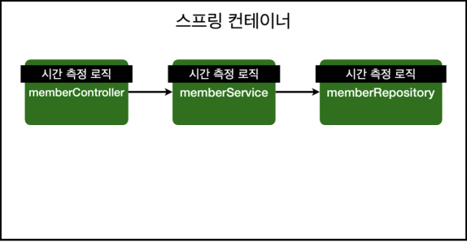
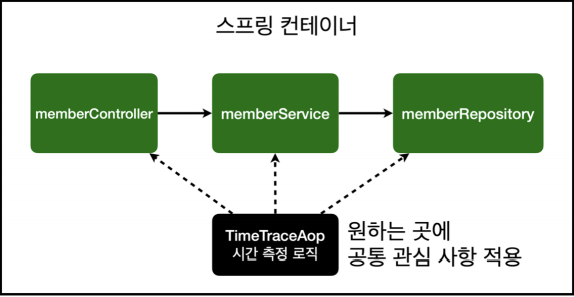
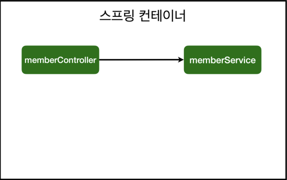
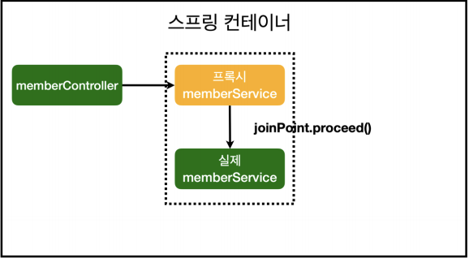
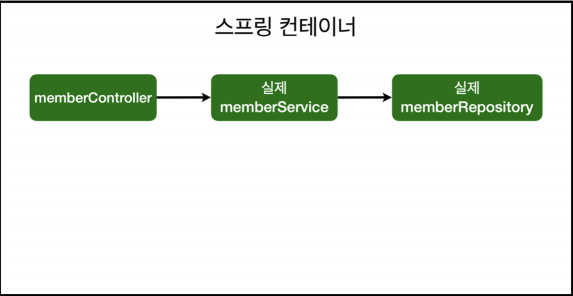
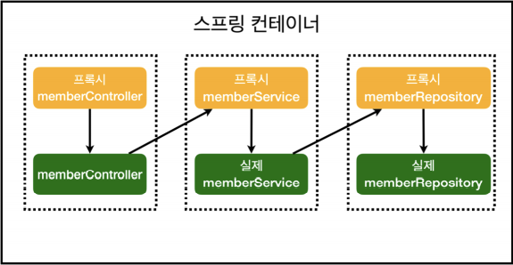

# AOP

## AOP가 필요한 상황
- 모든 메소드의 호출 시간을 측정하고 싶다면?
- 공통 관심 사항(cross-cutting concern) vs 핵심 관심 사항(core concern)
- 회원 가입 시간, 회원 조회 시간을 측정하고 싶다면?
- 

- **MemberService 회원 조회 시간 측정 추가**
```java
@Transactional
public class MemberService {

    private final MemberRepository memberRepository;

    public MemberService(MemberRepository memberRepository) {
        this.memberRepository = memberRepository;
    }

    public Long join(Member member){

        long start = System.currentTimeMillis();

        try{
            validateDuplicateMember(member);
            memberRepository.save(member);
            return member.getId();
        }finally{
            long finish = System.currentTimeMillis();
            long timeMs = finish - start;
            System.out.println("join = " + timeMs + "ms");
        }
    }
    ...
}
```

- **문제**
    - 회원가입, 회원 조회에 시간을 측정하는 기능은 핵심 관심 사항이 아니다.
    - 시간을 측정하는 로직은 공통 관심 사항이다.
    - 시간을 측정하는 로직과 핵심 비즈니스 로직이 섞여서 유지보수가 어렵다.
    - 시간을 측정하는 로직을 별도의 공통 로직으로 만들기 매우 어렵다.
    - 시간을 측정하는 로직을 변경할 때, 모든 로직을 찾아가면서 변경해야 한다.

## AOP 적용
- AOP : Aspect Oriented Programming, 관점 지향 프로그래밍
- 공통 관심 사항(cross-cutting concern) vs 핵심 관심 사항(core concern) 분리
- 

- **시간 측정 AOP 등록**
```java
package hello.hellospring.app;

import org.aspectj.lang.ProceedingJoinPoint;
import org.aspectj.lang.annotation.Around;
import org.aspectj.lang.annotation.Aspect;

//@Component
@Aspect
public class TimeTraceAop {

    // @Around("execution(* hello.hellospring..*(..))")
    @Around("execution(* hello.hellospring..*(..)) && !target(hello.hellospring.SpringConfig)")
    public Object execute(ProceedingJoinPoint joinPoint) throws Throwable{
        long start = System.currentTimeMillis();
        System.out.println("START: " + joinPoint.toString());
        try{
            return joinPoint.proceed();
        }finally {
            long finish = System.currentTimeMillis();
            long timeMs = finish - start;
            System.out.println("END: " + joinPoint.toString() + " " + timeMs + "ms");
        }
    }
}
```
- TimeTraceAop의 AOP 대상을 지정하는 `@Around` 코드를 보면, SpringConfig의 timeTraceAop() 메소드도 AOP로 처리하게 된다.
    - 자기 자신인 TimeTraceAop를 생성하는 코드도 처리하므로 `순환참조` 문제가 발생한다.
    - 이를 해결하려면, AOP 대상에서 SpringConfig를 빼주면 된다.
- 반면 컴포넌트 스캔을 사용할 때는, AOP의 대상이 되는 이런 코드 자체가 없기 때문에 문제가 발생하지 않는다.
- **스프링 설정에서 빈 등록**
```java
@Configuration
public class SpringConfig {
    ...
    @Bean
    public TimeTraceAop timeTraceAop(){
        return new TimeTraceAop();
    }
}
```
- **해결**
    - 회원가입, 회원 조회 등 핵심 관심 사항과 시간을 측정하는 공통 관심 사항을 분리한다.
    - 시간을 측정하는 로직을 별도의 공통 로직으로 만들었다.
    - 핵심 관심 사항을 깔끔하게 유지할 수 있다.
    - 변경이 필요하면 이 로직만 변경하면 된다.
    - 원하는 적용 대상을 선택할 수 있다.

### 스프링의 AOP 동작 방식 설명
- **AOP 적용 전 의존관계**
    - 
- **AOP 적용 후 의존관계**
    - 
- **AOP 적용 전 전체 그림**
    - 
- **AOP 적용 후 전체 그림**
    - 