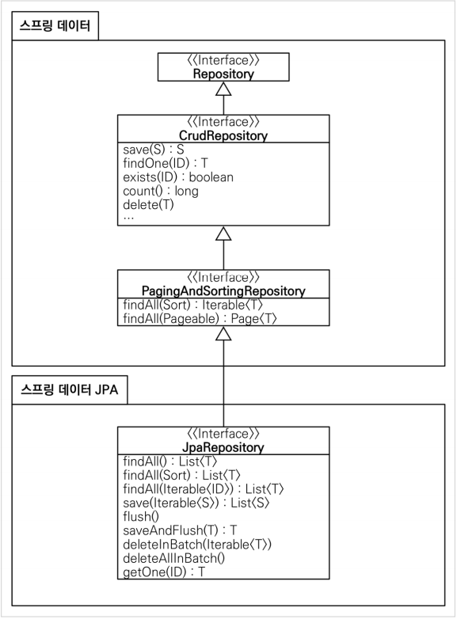

# 스프링 DB 접근 기술
- **스프링 데이터 접근**
    1. H2 데이터베이스 설치
    2. 순수 Jdbc
    3. 스프링 통합 테스트
    4. 스프링 JdbcTemplate
    5. JPA
    6. **스프링 데이터 JPA**

## 스프링 데이터 JPA
- 스프링 부트와 JPA만 사용해도 개발 생산성이 정말 많이 증가하고, 개발해야 할 코드도 확연히 줄어든다.
- 여기에 `스프링 데이터 JPA`를 사용하면, 기존의 한계를 넘어 리포지토리에 구현 클래스 없이 인터페이스만으로 개발을 완료할 수가 있다.
    - 지금껏 반복 개발해온 기본 `CRUD 기능`도 스프링 데이터 JPA가 모두 제공한다.
- 따라서 개발자는 핵심 비즈니스 로직을 개발하는데 집중할 수 있다.
- 실무에서 `관계형 데이터베이스`를 사용한다면, `스프링 데이터 JPA`는 필수이다.
- `스프링 데이터 JPA`는 JPA를 편리하게 사용하도록 도와주는 기술일 뿐이므로, 반드시 JPA를 먼저 선행하도록 하자.

- **스프링 데이터 JPA 회원 리포지토리**
```java
package hello.hellospring.repository;

import hello.hellospring.domain.Member;
import org.springframework.data.jpa.repository.JpaRepository;

import java.util.Optional;

public interface SpringDataJpaMemberRepository extends JpaRepository<Member, Long>, MemberRepository {
    @Override
    Optional<Member> findByName(String name);
}
```

- **스프링 데이터 JPA 회원 리포지토리를 사용하도록 스프링 설정 변경**
```java
package hello.hellospring;

import hello.hellospring.repository.*;
import hello.hellospring.service.MemberService;
import org.springframework.beans.factory.annotation.Autowired;
import org.springframework.context.annotation.Bean;
import org.springframework.context.annotation.Configuration;

import javax.persistence.EntityManager;
import javax.sql.DataSource;

@Configuration
public class SpringConfig {

    private final MemberRepository memberRepository;

    @Autowired
    public SpringConfig(MemberRepository memberRepository) {
        this.memberRepository = memberRepository;
    }

    @Bean
    public MemberService memberService(){
        return new MemberService(memberRepository);
    }
}
```
- 스프링 데이터 JPA가 `SpringDataJpaMemerRepository`를 스프링 빈으로 자동 등록해준다.
- **스프링 데이터 JPA 제공 클래스**
    - 
- **스프링 데이터 JPA 제공 기능**
    - 인터페이스를 통한 기본적인 CRUD
    - `findByName()`, `findByEmail()`처럼 메소드 이름만으로 조회 기능 제공
    - 페이징 기능 자동 제공
- 참고
    - 실무에서는 JPA와 스프링 데이터 JPA를 기보느로 사용하고, 복잡한 동적 쿼리는 `Querydsl`이라는 라이브러리를 사용하여 처리한다.
    - `Querydsl`을 사용하면 쿼리도 자바 코드로 안전하게 작성할 수 있고, 동적 쿼리도 편리하게 작성할 수 있다.
    - 이 조합으로 해결하기 어려운 쿼리는 JPA가 제공하는 `네이티브 쿼리`를 사용하거나, 앞서 학습한 `스프링 JdbcTemplate`를 사용하면 된다.