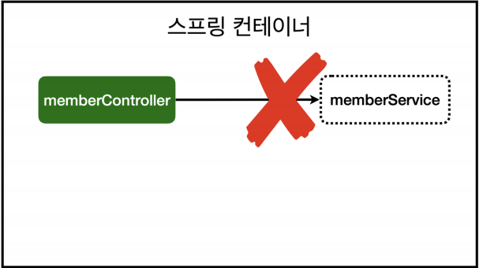
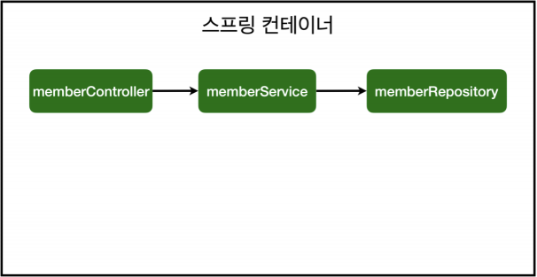

# 스프링 빈과 의존관계
- 스프링 빈을 등록하는 2가지 방법
    1. 컴포넌트 스캔과 자동 의존관계 설정
    2. 자바 코드로 직접 스프링 빈(spring bean) 등록하기
## 컴포넌트 스캔과 자동 의존관계 설정
- 회원 Controller가 회원 Service와 회원 Repository를 사용할 수 있도록 의존관계를 설정해야 한다.

### 회원 컨트롤러에 의존관계 추가
```java
package hello.hellospring.controller;

import hello.hellospring.service.MemberService;
import org.springframework.beans.factory.annotation.Autowired;
import org.springframework.stereotype.Controller;

@Controller
public class MemberController {
    private final MemberService memberService;

    @Autowired
    public MemberController(MemberService memberService) {
        this.memberService = memberService;
    }
}
```
- 생성자에 `@Autowired`가 있으면, 스프링이 스프링 컨테이너에서 연관된 객체를 찾아서 parameter에 넘겨준다.
    - 이처럼, 객체 의존관계를 외부에서 넣어주는 것을 `DI(Dependency Injection), 의존성 주입`이라고 한다.
- 이전 테스트에서는 개발자가 직접 주입했었지만, 여기서는 `@Autowired`에 의해 스프링이 주입해준다.

### 오류 발생
```java
Consider defining a bean of type 'hello.hellospring.service.MemberService' in 
your configuration.
```
- `memberService`가 `스프링 빈(spring bean)`으로 등록되어 있지 않기 때문이다.
- 
    - 참고로, helloController는 `@Controller` 애노테이션으로 명시를 해주었기 때문에, 스프링 빈으로 자동 등록된다.

### 컴포넌트 스캔 원리
- `@Component` 애노테이션이 있으면, 스프링 빈으로 자동 등록된다.
- `@Controller` 애노테이션이 있는 helloController가 스프링 빈으로 자동 등록된 이유도 `컴포넌트 스캔` 덕분이다.
- `@Component`를 포함하는 다음 애노테이션도 스프링 빈으로 자등 등록된다.
    - `@Controller`
    - `@Service`
    - `@Repository`

### 회원 서비스 스프링 빈 등록
```java
@Service
public class MemberService { 
    private final MemberRepository memberRepository;
    
    @Autowired
    public MemberService(MemberRepository memberRepository) {
        this.memberRepository = memberRepository;
    }
    ...
}
```
- 생성자에 `@Autowired`를 사용하면, 객체 생성 시점에 스프링 컨테이너에서 해당 스프링 빈을 찾아서 주입한다.
- 생성자가 1개만 있으면 `@Autowired`는 생략할 수 있다.

### 회원 리포지토리 스프링 빈 등록
```java
@Repository
public class MemoryMemberRepository implements MemberRepository { ... }
```

### 스프링 빈 등록 이미지

- `memverService`와 `memberRepository`가 스프링 컨테이너에 스프링 빈으로 등록되었다.
- 스프링은 스프링 컨테이너에 스프링 빈을 등록할 때, 기본적으로 싱글톤으로 등록한다.
    - 싱글톤 : 유일하게 하나만 등록해서 공유하는 형태
    - 따라서 같은 스프링이면 모두 같은 instance이다.
- 설정으로 싱글톤이 아니게 설정할 수도 있지만, 특별한 경우를 제외하면 대부분 싱글톤을 사용한다.