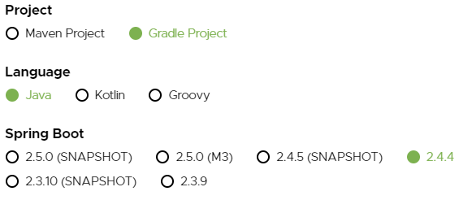
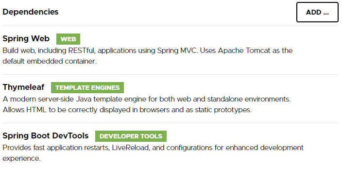
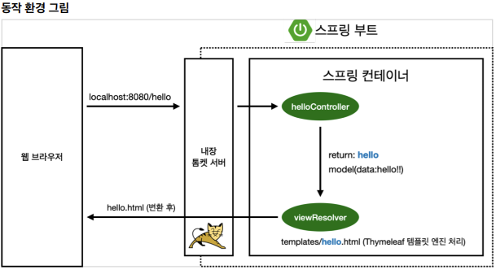

# View 환경설정
## Welcome Page 만들기
- `resources/static/index.html`
    ```html
    <!DOCTYPE HTML>
    <html><head>
     <title>Hello</title>
     <meta http-equiv="Content-Type" content="text/html; charset=UTF-8" />
    </head>
    <body>
    Hello
    <a href="/hello">hello</a>
    </body>
    </html>
    ```
- Spring Boot가 제공하는 Welcome Page 기능
    - Spring Boot는 static과 templated welcome page를 둘 다 지원한다.
        - static 폴더에 `index.html` 파일이 없으면, template 폴더에서 `index.html` 파일을 찾는다.
        - 둘 중 하나를 발견하면, 자동적으로 welcome page로 사용한다.
    - [Reference ](https://docs.spring.io/spring-boot/docs/2.3.1.RELEASE/reference/html/spring-boot-features.html#boot-features-spring-mvc-welcome-page)

## Thymeleaf template engine
### Template engine
- [REST](https://gangnam-americano.tistory.com/39) web services와 마찬가지로, Spring MVC를 동적 HTML content을 제공하기 위해 사용할 수 있다.
- Spring MVC는 `Thymeleaf`, `FreeMarker`, and `JSPs`와 같이 다양한 templating technologies를 지원한다.
- Spring Boot는 다음의 templating engines에 대한 자동 구성 지원이 포함되어 있다.
    - [Freemarker](https://freemarker.apache.org/docs/)
    - [Groovy](https://docs.groovy-lang.org/docs/next/html/documentation/template-engines.html#_the_markuptemplateengine)
    - [Thymeleaf](https://www.thymeleaf.org/)
    - [Mustache](https://mustache.github.io/)
- `JSPs`에는 several [known limitations](https://docs.spring.io/spring-boot/docs/2.3.1.RELEASE/reference/html/spring-boot-features.html#boot-features-jsp-limitations)이 존재하기 때문에, JSPs 사용은 피하는 것이 좋다.
### Tutorial
- http://localhost:8080/hello 에서 HTTP GET requests를 수용하는 static home page를 만드는 과정을 소개한다.
- requests를 받으면, HTML을 display하는 web page를 respond 한다.
- 추가로, 다음과 같이 Query string을 추가할 수도 있다.
    > `http://localhost:8080/hello?name=User`
    - `name` parameter value는 기본 값인 `World`를 재정의하고, "Hello, User!"으로 변경하는 content에 의해 respond에 반영된다.

#### Starting with Spring Initializr
- https://start.spring.io/ 에 방문해서 다음과 같이 new project를 생성한다.
    - 
    - 요즘은 Maven보다 `Gradle`을 사용하는 추세이다.
    - Spring Boot를 선택할 때, SNAPSHOT(미출시), M3 등이 붙어있지 않은 version 중 최신 version을 선택해야한다.
    - 
    - 위와 같이, SpringWeb, Thymeleaf, Spring Boot DevTools 의존성을 추가한다.
    - 생성된 폴더의 `build.gradle`을 확인해 보면 아래와 같이 생성되어 있는 것을 볼 수 있다.
    ```gradle
    plugins {
	    id 'org.springframework.boot' version '2.3.9.RELEASE'
	    id 'io.spring.dependency-management' version '1.0.11.RELEASE'
	    id 'java'
    }

    group = 'hello'
    version = '0.0.1-SNAPSHOT'
    sourceCompatibility = '11'

    repositories {
    	mavenCentral()
    }

    dependencies {
    	implementation 'org.springframework.boot:spring-boot-starter-thymeleaf'
    	implementation 'org.springframework.boot:spring-boot-starter-web'
    	testImplementation('org.springframework.boot:spring-boot-starter-test') {
    		exclude group: 'org.junit.vintage', module:'junit-vintage-engine'
    	}
    }

    test {
    	useJUnitPlatform()
    }
    ```
#### Create a Web Controller
- Spring의 web sites를 구축하는 접근 방식에서, `HTTP requests`는 `controller`에 의해 처리된다.
- `@Controller` annotation을 이용하여, controller를 identify할 수 있다.
- `@GetMapping` annotation을 이용하여, `/hello`에 대한 HTTP GET requests이 `hello()` method에 mapping된다는 것을 보장할 수 있다.
- `@RequestParam` annotation을 이용하여, query string parameter `name`의 값을 `hello()` method의 parameter `name`으로 bind할 수 있다.
    - query string parameter는 필수가 아니도록 설정(`requried=false`)하였다.
    - query string parameter가 없다면, 기본 값으로 `World`가 사용된다.
    - `name` parameter의 값은 `Model` 객체에 더해지며, 궁극적으로 view template에 접근할 수 있도록 만든다.
    ```java
    package hello.hellospring.controller;

    import org.springframework.stereotype.Controller;
    import org.springframework.ui.Model;
    import org.springframework.web.bind.annotation.GetMapping;
    import org.springframework.web.bind.annotation.RequestParam;

    @Controller
    public class HelloController {

        // http의 get method.
        // hello 라는 url에 매칭되어, http://localhost:8080/hello 에 접속하면 아래의    method가 실행이 된다.
        @GetMapping("hello")
        public String hello(@RequestParam(name="name", required=false,  defaultValue="World") String name, Model model){
            model.addAttribute("name", name);
            /*
                기본적으로, spring boot는 아래와 같이 세팅되어있다.
                 resources/templates 폴더에있는 hello를 찾아서 랜더링한다.
            */
            return "hello";
        }
    }
    ```

- body 구현은 HTML의 `server-side rendering`을 위해 view technology(여기선, `Thymeleaf`)에 의존한다.
- `Thymeleaf`는 `hello.html` template를 구문 분석하고, `th:text` 표현을 평가하여, `controller`에 설정된 `${name}` parameter의 값을 rendering한다.
    ```html
    <!DOCTYPE HTML>
    <!--
        xml의 schema로 template engine인 thymeleaf가 선언이 되어있다.
     -->
    <html xmlns:th="http://www.thymeleaf.org">
    <head>
        <title>Hello</title>
        <meta http-equiv="Content-Type" content="text/html; charset=UTF-8"/>
    </head>
    <body>
    <!--
        HelloController.class 에서 model.addAttribute("data", "hello!"); 을 사용했다고 가정해보자.
        "data"라는 attribute의 value를 "hello!" 라고 지정하였으므로
        여기서 ${data}는 "hello!"으로 치환이 된다.
    -->
    <p th:text="'안녕하세요. ' + ${name}">안녕하세요. 손님</p>
    </body>
    </html>
    ```
#### Run the Application
- `@SpringBootApplication`은 아래의 annotations들을 추가해 주는 편리한 annotation이다.
    - `@Configuration` : 해당 class에서 `Java Beans`을 등록하고 있음을 명시하는 annotation
    - `@EnableAutoConfiguration` : Spring Boot에게 classpath 설정, 다른 beans, 다양한 속성 설정을 기반으로 `Java Beans`를 추가하라고 지시하는 annotation
    - `@ComponentScan` : Spring에게 해당 패키지에서 `@Component` annotation을 가진 Beans를 스캔하여 등록하라고 지시하는 annotation
        - `@Configuration`, `@Repository`, `@Service`, `@Controller`, `@RestController` 포함
- `main()` method는 Spring Boot의 `SpringApplication.run()` method를 사용하여 application을 실행시킨다.
```java
package hello.hellospring;

import org.springframework.boot.SpringApplication;
import org.springframework.boot.autoconfigure.SpringBootApplication;

@SpringBootApplication
public class HelloSpringApplication {

	public static void main(String[] args) {
		SpringApplication.run(HelloSpringApplication.class, args);
	}

}
```

- 참고 : `spring-boot-devtools` 라이브러리를 추가하면, `html`파일을 컴파일만 해주면 서버 재시작 없이 View 파일 변경이 가능하다.
- IntelliJ 컴파일 방법 : 메뉴 build -> Recompile

#### Build and Execute
- Window에서 Git bash terminal 사용
    1. `./gradlew build`
    2. `cd build/libs`
    3. `java -jar hello-spring-0.0.1-SNAPSHOT.jar`

### 동작 환경 그림

- Controller에서 return 값으로 문자를 반환하면 `viewResolver`가 화면을 찾아서 처리한다.
    - Spring Boot template engine 기본 viewName mapping
    - `resuorce:templates/` + {ViewName} + `.html`

#### [Reference](https://spring.io/guides/gs/serving-web-content/)
