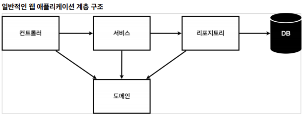
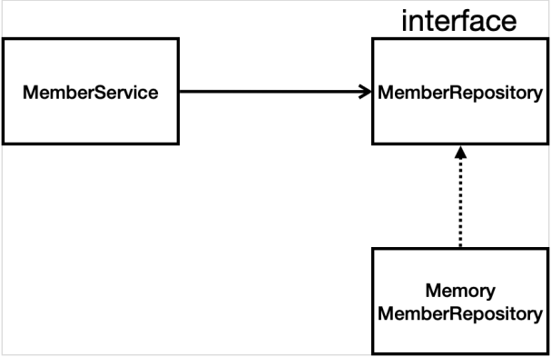

# 회원 관리 예제 - 백엔드 개발
- 비지니스 요구사항 정리
- 회원 도메인과 리포지토리 만들기
- 회원 리포지토리 테스트 케이스 작성
- 회원 서비스 개발
- 회원 서비스 테스트

## 비지니스 요구사항 정리
- 데이터 : 회원ID, 이름
- 기능 : 회원 등록, 조회
- 아직 데이터 저장소가 선정되지 않음을 가정.
### 일반적인 웹 애플리케이션 계층 구조

- 컨트롤러 : 웹 MVC의 컨트롤러 역할
- 서비스 : 핵심 비지니스 로직 구현
- 리포지토리 : DB에 접근, 도메인 객체를 DB에저장하고 관리
- 도메인 : 비지니스 도메인 객체
    > ex) 회원, 주문, 쿠폰 등 <br>
    > 주로 데이터베이스에 저장하고 관리됨.
### 클래스 의존관계

- 아직 데이터 저장소가 선정되지 않아서, 우선 `인터페이스`로 구현 클래스를 변경할 수 있도록 설계
- 데이터 저장소는 RDB, NoSQL 등 다양한 저장소를 고민중인 상황으로 가정
- 개발을 진행하기 위해서 초기 개발 단계에서는 `구현체로 가벼운 메모리 기반의 데이터 저장소` 사용

## 회원 도메인과 리포지토리 만들기
### 회원 객체
```java
package hello.hellospring.domain;

public class Member {
    private Long id;
    private String name;

    public Long getId() {
        return id;
    }

    public void setId(Long id) {
        this.id = id;
    }

    public String getName() {
        return name;
    }

    public void setName(String name) {
        this.name = name;
    }
}
```

### 회원 리포지토리 인터페이스
```java
package hello.hellospring.repository;

import hello.hellospring.domain.Member;

import java.util.List;
import java.util.Optional;

public interface MemberRepository {
    Member save(Member member);
    Optional<Member> findById(Long id);
    Optional<Member> findByName(String name);
    List<Member> findAll();
}
```

### 회원 리포지토리 메모리 구현체
```java
package hello.hellospring.repository;

import hello.hellospring.domain.Member;

import java.util.*;

// 동시성 문제가 고려되어 있지 않음.
// 실무에서는 ConcurrentHashMap, AtomicLong 사용 고려
public class MemoryMemberRepository implements MemberRepository{
    private static Map<Long, Member> store = new HashMap<>();
    private static long sequence = 0L;

    @Override
    public Member save(Member member) {
        member.setId(++sequence);
        store.put(member.getId(), member);
        return member;
    }

    @Override
    public Optional<Member> findById(Long id) {
        // Null이 반환될 가능성이 있으면 Optional.ofNullable으로 감싸주어야 함.
        return Optional.ofNullable(store.get(id));
    }

    @Override
    public Optional<Member> findByName(String name) {
        return store.values().stream()
                .filter(member -> member.getName().equals(name))
                .findAny();
    }

    @Override
    public List<Member> findAll() {
        return new ArrayList<>(store.values());
    }
}
```

## 회원 리포지토리 테스트 케이스 작성
- 개발한 기능을 실행해서 테스트 할 때, `자바의 main 메서드`를 통해서 실행하거나, `웹 애플리케이션의 컨트롤러`를 통해서 해당 기능을 실행한다.
- 이러한 방법은 준비하고 실행하는데 오래 걸리고, 반복 실행하기 어렵고, 여러 테스트를 한번에 실행하기 어렵다는 단점이 있다.
- 자바는 `Junit`이라는 `프레임워크`로 테스트를 실행해서 이러한 문제를 해결한다.

### 회원 리포지토리 메모리 구현체 테스트
- `src/test/java` 하위 폴더에 생성한다.
```java
package hello.hellospring.repository;

import hello.hellospring.domain.Member;
import org.assertj.core.api.Assertions;
import org.junit.jupiter.api.AfterEach;
import org.junit.jupiter.api.Test;

import java.util.List;

public class MemoryMemberRepositoryTest {
    // 모든 Test의 실행 순서는 랜덤이다

    // 처음엔 MemberRepository(interface) 형으로 선언하여 업캐스팅 방식을 사용했었다.
    // 그러나, interface를 구현한 클래스인 MemoryMemberRepository에서 clearStore함수를 추가로 생성하여 사용하기 위해,
    // MemoryMemberRepository 형으로 수정하였다.
    MemoryMemberRepository repository = new MemoryMemberRepository();
    // MemberRepository repository = new MemoryMemberRepository();

    @AfterEach
    public void afterEach(){
        repository.clearStore();
    }

    @Test
    public void save(){
        Member member = new Member();
        member.setName("spring");

        repository.save(member);

        Member result = repository.findById(member.getId()).get();
        Assertions.assertThat(member).isEqualTo(result);    // ALT + ENTER : static import
        // assertThat(member).isEqualTo(result);
    }

    @Test
    public void findByName(){
        Member member1 = new Member();
        member1.setName("spring1");
        repository.save(member1);

        // SHIFT + F6 : 같은 이름 한 번에 수정
        Member member2 = new Member();
        member2.setName("spring2");
        repository.save(member2);

        Member result = repository.findByName("spring1").get();

        Assertions.assertThat(result).isEqualTo(member1);
    }

    @Test
    public void findAll(){
        Member member1 = new Member();
        member1.setName("spring1");
        repository.save(member1);

        Member member2 = new Member();
        member2.setName("spring2");
        repository.save(member2);

        List<Member> result = repository.findAll();

        Assertions.assertThat(result.size()).isEqualTo(2);
    }
}
```
- `@AfterEach`
    - 한 번에 여러 테스트를 실행하면 메모리 DB에 `직전 테스트의 결과`가 남을 수 있다. 
    - 이렇게 되면, 다음 이전 테스트 때문에 `다음 테스트가 실패할 가능성`이 있다.
    - `@AfterEach`를 사용하면, 각 테스트가 종료될 때 마다 이 기능을 실행한다.
    - 여기서는 메모리 DB에 저장된 데이터를 삭제한다.
- 테스트는 각각 `독립적`으로 실행되어야 한다.
    - 테스트 순서에 의존관계가 있는 것은 좋은 테스트가 아니다.

## 회원 서비스 개발
```java
package hello.hellospring.service;

import hello.hellospring.domain.Member;
import hello.hellospring.repository.MemberRepository;
import hello.hellospring.repository.MemoryMemberRepository;

import java.util.List;
import java.util.Optional;

public class MemberService {
    private final MemberRepository memberRepository = new MemoryMemberRepository();

    /*
        회원 가입
     */
    public Long join(Member member){
        // 같은 이름이 있는 중복 회원X
        // CTRL + ALT + V : 변수 추출하기
        // memberRepository.findByName((member.getName()));
        /*
            Optional<Member> result = memberRepository.findByName((member.getName()));
            result.ifPresent(m -> {
                throw new IllegalStateException("이미 존재하는 회원입니다.");
            });
        */

        // Optional 형으로 반환하는 것은 그다지 좋지 않으므로 아래와 같이 사용하자.
        // CTRL + ALT + M : 함수 추출하기
        validateDuplicateMember(member);
        memberRepository.save(member);
        return member.getId();
    }

    private void validateDuplicateMember(Member member) {
        memberRepository.findByName(member.getName())
                .ifPresent(m -> {
                    throw new IllegalStateException("이미 존재하는 회원입니다.");
                });
    }

    /*
        전체 회원 조회
     */
    public List<Member> findMembers(){
        return memberRepository.findAll();
    }

    public Optional<Member> findOne(Long memberId){
        return memberRepository.findById(memberId);
    }
}
```

## 회원 서비스 테스트
- 기존에는 회원 서비스가 메모리 회원 리포지토리를 직접 생성하게 했다.
```java
public class MemberService {
    private final MemberRepository memberRepository = new MemoryMemberRepository();
    ...
}
```
- 회원 리포지토리의 코드가 회원 서비스 코드를 `DI` 가능하게 변경한다.
```java
public class MemberService { 
    private final MemberRepository memberRepository;
    public MemberService(MemberRepository memberRepository) {
        this.memberRepository = memberRepository;
    }
 ...
}
```
- 회원 서비스 테스트
```java
package hello.hellospring.service;

import hello.hellospring.domain.Member;
import hello.hellospring.repository.MemoryMemberRepository;
import org.junit.jupiter.api.AfterEach;
import org.junit.jupiter.api.BeforeEach;
import org.junit.jupiter.api.Test;

import static org.assertj.core.api.Assertions.*;
import static org.junit.jupiter.api.Assertions.*;

// MemberService 클래스에서 CTRL + SHIFT + T 를 누르면 자동으로 test class를 만들어준다.
class MemberServiceTest {

    MemberService memberService;
    MemoryMemberRepository memberRepository;

    @BeforeEach
    public void beforeEach(){
        memberRepository = new MemoryMemberRepository();
        // DI(Dependency Injection), (생성자) 주입
        memberService = new MemberService(memberRepository);
    }

    // SHIFT + F10 : 이전에 실행한 부분 재실행
    @AfterEach
    public void afterEach(){
        memberRepository.clearStore();
    }

    @Test
    void 회원가입() {
        //given
        Member member = new Member();
        member.setName("Hello");

        //when
        Long saveId = memberService.join(member);

        //then
        Member findMember = memberService.findOne(saveId).get();
        assertThat(member.getName()).isEqualTo(findMember.getName());
    }

    @Test
    public void 중복_회원_예외() {
        //given
        Member member1 = new Member();
        member1.setName("spring");

        Member member2 = new Member();
        member2.setName("spring");

        //when
        memberService.join(member1);
        IllegalStateException e = assertThrows(IllegalStateException.class,
                () -> memberService.join(member2)); // 예외가 발생해야 한다.
        assertThat(e.getMessage()).isEqualTo("이미 존재하는 회원입니다.");
        /*try{
            memberService.join(member2);
            fail("예외가 발생해야 합니다.");
        } catch(IllegalStateException e){
            assertThat(e.getMessage()).isEqualTo("이미 존재하는 회원입니다.");
        }*/

        //then
    }

    @Test
    void findMembers() {
    }

    @Test
    void findOne() {
    }
}
```
- `@BeforeEach`
    - 각 실행 테스트 전에 호출된다.
    - 테스트가 서로 영향이 없도록 항상 새로운 객체를 생성하고, 의존관계도 새로 맺어준다.